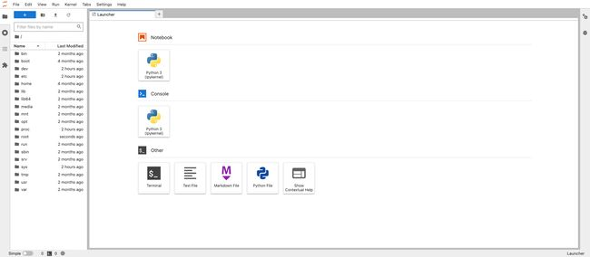
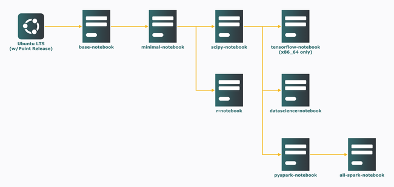
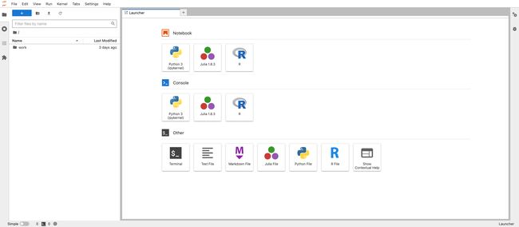
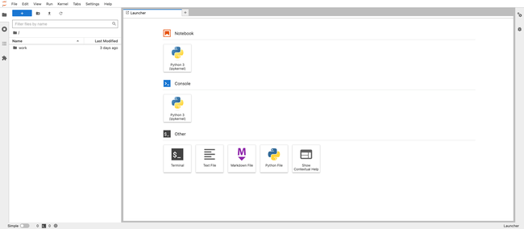
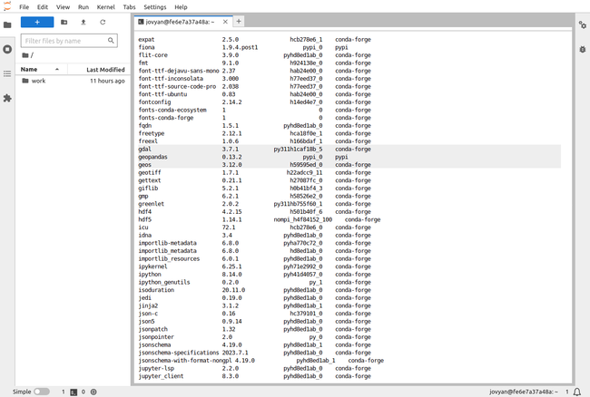
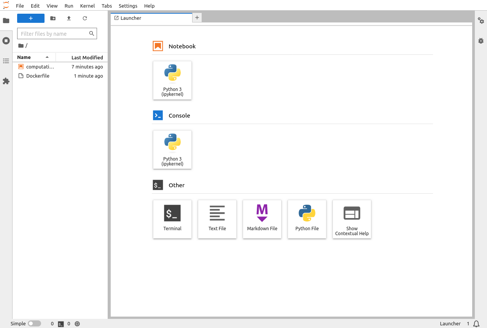

Container technologies help build lightweight portable software units that package both the application code and required dependencies. This helps to simplify, secure, and make application development, testing, and deployment more reliable.

These self-contained environments resolve environment compatibility issues. Applications can be written once and run anywhere without concern for the machine or environment they are running on.

Docker is the most popular container technology. It is a free tool for building, deploying, and managing containerized applications.

This article comprehensively discusses setting up a Jupyter environment with Docker. Continue reading to learn how to set up different Jupyter environments through Docker instances.

## What is Jupyter?

[Jupyter](https://jupyter.org/) is an open source interactive computing application that aids in the sharing of data within the context of a web page. Such data includes live code, equations, narrative text (using markdown), images, and visualization. Jupyter aids in the creation and sharing of computation documents that contain this data, known as Jupyter notebooks. These notebooks are stored in JavaScript Object Notation (JSON) format with an `.ipynb` extension.

The Jupyter architecture is comprised of three key components:

1.  **Notebook UI**: The notebook UI serves as the client side of the application that allows running and editing Jupyter notebooks. The notebook UI manages notebooks and accessibility to kernels. The UI can be accessed locally, requiring no internet, or via remote servers.

1.  **Jupyter Server**: This is the back end of the notebook UI that hosts the notebook contents and manages kernels, operating system, and API interactions. It communicates to the notebook UI via HTTP and web socket protocols. It can run locally or on a multi-user server like [JupyterHub](https://jupyterhub.readthedocs.io/en/stable/).

1.  **Kernel Protocol**: The foundational supported languages by Jupyter are (Ju)lia, (Py)thon, and e(R). However, it now supports over 40 programming languages via the use of language-specific kernels (execution environments). The kernel protocol tells the Jupyter server to execute code with the required kernel via ZeroMQ.

[](Jupyter-Architecture.png)

Jupyter has two notebook variations, Jupyter notebook and JupyterLab. With the former being the classic, and the latter being the next-generation environment for notebooks, code, and data. Both use the same Jupyter server and file format, making it flexible to switch between both interfaces. However, JupyterLab is destined to replace the classic Jupyter notebooks, as it expands the traditional notebook's scope of functionality.

JupyterLab and Jupyter notebooks are both referred to simply as "notebooks" throughout this article. These notebooks provide interactive environments for data science, machine learning, scientific computing, and computational journalism workflows. They capture thought processes and serve as a platform to explore, share, and confer about computations.

Sharing these notebooks is paramount to confer on the computational outputs from them, letting both technical and non-technical stakeholders scrutinize experiments, processes, and results. Notebooks are shared easily. Simply include the notebook `.ipynb` file as an attachment to stakeholders with access to Jupyter, or in exportable formats such as PDF or HTML. It can also be shared online via GitHub, Jupyter NBViewer, Binder, or via a multi-user Jupyter server like JupyterHub.

## Before You Begin

1.  This guide requires a desktop with at least 4 GB of memory and approximately 10 GB of free space. The commands in this guide are written for Ubuntu 22.04 LTS, but should generally work for many Linux distributions and possibly even other operating systems.

1.  To follow the steps below you need to install Docker. The easiest way to do accomplish this is via the Docker Desktop package. Download the appropriate package for your operating system and follow the installation guide [here](https://docs.docker.com/engine/install/) to install Docker.

## Jupyter and Docker Workflows

Packaging notebooks can be more comprehensive with container technologies like Docker. Here, the notebook, notebook server, libraries, respective versions, data, and stripped-down Linux OS, are all packaged into a single Docker object. Sharing this containerized unit eliminates issues such as version and OS incompatibilities. This makes data science projects and experiments more reproducible as Docker packages all the dependencies required to run the notebook.

This article comprehensively covers the various workflows of containerizing the Jupyter application and environment with Docker.

### Using Base Image

To work with notebooks, you need to install Jupyter, which can be done using two popular python distributions:

-   [**CPython**](https://www.python.org/about/), the reference implementation of Python, can install Jupyter using `pip`, its default package installer and manager.

-   [**Anaconda**](https://www.anaconda.com/) was developed by Anaconda, Inc. (formerly Continuum Analytics) for mathematics, statistics, engineering, data analysis, machine learning, and related applications. However, it can install Jupyter using `conda`, its default package installer and manager. Attributable to Anaconda's use case, it comes with some data science-related packages pre-installed.

Working with Docker, it's not necessary to set up Jupyter locally. Instead, Jupyter is set up within a Docker container.

1.  First, launch Docker Desktop and wait for it to fully load.

1.  Next, get a fully working Anaconda image from the verified publisher, [continuumio](https://hub.docker.com/u/continuumio), on Docker Hub. Open a terminal and use the following command to search for available images of "continuumio":

    ```command {title="Local Machine Terminal"}
    docker search continuumio
    ```

    The `continuumio/anaconda3` image should be at or near the top of the list:

    ```output
    NAME                                      DESCRIPTION                                     STARS     OFFICIAL   AUTOMATED
    continuumio/miniconda3                    Powerful and flexible package manager           417                  [OK]
    continuumio/anaconda3                     Powerful and flexible python distribution       722                  [OK]
    continuumio/miniconda                     Powerful and flexible package manager           85                   [OK]
    continuumio/anaconda                      Powerful and flexible python distribution       219                  [OK]
    continuumio/anaconda2                                                                     4
    continuumio/miniconda2                                                                    0
    continuumio/conda-ci-linux-64-python3.8                                                   11
    continuumio/conda-ci-linux-64-python3.7                                                   7
    continuumio/conda-ci-linux-64-python2.7                                                   0
    continuumio/conda-concourse-ci            Build and general-purpose image for Continuu…   0
    continuumio/anaconda-pkg-build                                                            2
    continuumio/anaconda-build-linux-64                                                       0
    continuumio/anaconda-build-linux-32                                                       0
    continuumio/centos5_gcc5_base                                                             3
    continuumio/binstar-build-linux64                                                         1                    [OK]
    continuumio/python_benchmarking                                                           0
    continuumio/nginx-ingress-ws                                                              0
    continuumio/conda_builder_linux           A build platform for Linux packages (64-bit …   4
    continuumio/conda-ci-linux-64-python3.9                                                   1
    continuumio/ap-auth-keycloak              Keycloak:3.1.0                                  0
    continuumio/ci-image                                                                      1
    continuumio/concourse-cleanup             TRK-292                                         0
    continuumio/repodb                        Graph database built from conda packages        0
    continuumio/concourse-rsync-resource                                                      1
    continuumio/ap-git-storage                gitea:1.3.0                                     0
    ```

1.  Now pull the Anaconda image:

    ```command {title="Local Machine Terminal"}
    docker pull continuumio/anaconda3
    ```

    ```output
    Using default tag: latest
    latest: Pulling from continuumio/anaconda3
    9d21b12d5fab: Pull complete
    57ca6dd1eda2: Pull complete
    Digest: sha256:c6c9b3ce502b51ac7736960be026a18e8c04819a22998a4493406bb261739a25
    Status: Downloaded newer image for continuumio/anaconda3:latest
    docker.io/continuumio/anaconda3:latest

    What's Next?
      View summary of image vulnerabilities and recommendations → docker scout quickview continuumio/anaconda3
    ```

1.  Next, create a container from the image in interactive mode:

    ```command {title="Local Machine Terminal"}
    docker run -it --rm -p 8888:8888 continuumio/anaconda3 /bin/bash
    ```

    This opens a bash shell where the `conda` tool and commands can be used:

    ```output
    (base) root@e57b3643e08c:/#
    ```

    Containers are isolation units, so a way to connect them with the outside world (i.e. your local machine) is needed. It is required to bind the container port to a port on the host machine using the `-p` or `–publish` tag with the syntax `-p HOST_PORT:CONTAINER_PORT`. The `–rm` flag tells Docker to discard the container after the docker run command finishes execution, which saves disk space for short-lived containers.

1.  Access the bash shell to run UNIX and `conda` commands, but first, verify if `conda` was installed by issuing the following command in the bash shell:

    ```command {title="Local Machine Conda Shell"}
    conda info
    ```

    ```output
         active environment : base
        active env location : /opt/conda
                shell level : 1
           user config file : /root/.condarc
     populated config files :
              conda version : 23.5.2
        conda-build version : 3.25.0
             python version : 3.11.3.final.0
           virtual packages : __archspec=1=x86_64
                              __glibc=2.31=0
                              __linux=5.15.49=0
                              __unix=0=0
           base environment : /opt/conda  (writable)
          conda av data dir : /opt/conda/etc/conda
      conda av metadata url : None
               channel URLs : https://repo.anaconda.com/pkgs/main/linux-64
                              https://repo.anaconda.com/pkgs/main/noarch
                              https://repo.anaconda.com/pkgs/r/linux-64
                              https://repo.anaconda.com/pkgs/r/noarch
              package cache : /opt/conda/pkgs
                              /root/.conda/pkgs
           envs directories : /opt/conda/envs
                              /root/.conda/envs
                   platform : linux-64
                 user-agent : conda/23.5.2 requests/2.29.0 CPython/3.11.3 Linux/5.15.49-linuxkit-pr debian/11 glibc/2.31
                    UID:GID : 0:0
                 netrc file : None
               offline mode : False
    ```

1.  View the list of packages and versions installed in this container using the following command:

    ```command {title="Local Machine Conda Shell"}
    conda list
    ```

    The installed packages list contains `jupyterlab` and some popular data science libraries like `pandas`, `numpy` and `matplotlib` already installed:

    ```output
    # packages in environment at /opt/conda:
    #
    # Name                    Version                   Build  Channel
    ...
    jupyter                   1.0.0           py311h06a4308_8
    jupyter_client            8.1.0           py311h06a4308_0
    jupyter_console           6.6.3           py311h06a4308_0
    jupyter_core              5.3.0           py311h06a4308_0
    jupyter_events            0.6.3           py311h06a4308_0
    jupyter_server            2.5.0           py311h06a4308_0
    jupyter_server_fileid     0.9.0           py311h06a4308_0
    jupyter_server_terminals  0.4.4           py311h06a4308_1
    jupyter_server_ydoc       0.8.0           py311h06a4308_1
    jupyter_ydoc              0.2.4           py311h06a4308_0
    jupyterlab                3.6.3           py311h06a4308_0
    jupyterlab_pygments       0.1.2                      py_0
    jupyterlab_server         2.22.0          py311h06a4308_0
    jupyterlab_widgets        3.0.5           py311h06a4308_0
    ...
    matplotlib                3.7.1           py311h06a4308_1
    matplotlib-base           3.7.1           py311ha02d727_1
    matplotlib-inline         0.1.6           py311h06a4308_0
    ...
    numpy                     1.24.3          py311h08b1b3b_1
    numpy-base                1.24.3          py311hf175353_1
    numpydoc                  1.5.0           py311h06a4308_0
    ...
    pandas                    1.5.3           py311hba01205_0
    ...
    ```

    The Jupyter server is now accessible and runs at `localhost:8888` or `127.0.0.1:8888`.

    
    Use the following command to update all of the packages in the conda environment:

    ```command {title="Local Machine Conda Shell"}
    conda update --all
    ```
    

1.  With `jupyterlab` fully installed, start the Jupyter server as follows:

    ```command {title="Local Machine Conda Shell"}
    jupyter-lab --ip="*" --no-browser --allow-root
    ```

    Here, `--ip=”*”` serves as a wildcard/placeholder, as the local machine listens to port `8888` on all IP addresses. `--no-browser` starts and runs the server without opening a web browser. `--allow-root`allows running Jupyter as the root user.

    ```output
    ...
        To access the server, open this file in a browser:
            file:///root/.local/share/jupyter/runtime/jpserver-16-open.html
        Or copy and paste one of these URLs:
            http://localhost:8888/lab?token=98e1c15b37ed92dc9aa158afe8a63f0d7ea504c44cb309bc
            http://127.0.0.1:8888/lab?token=98e1c15b37ed92dc9aa158afe8a63f0d7ea504c44cb309bc
    ...
    ```

    
    Access to the Jupyter servers implies access to running code. This makes it essential to restrict access to the Jupyter server. Jupyter, by default, has a token-based authentication to aid this restriction. Another option provided by Jupyter is to change this token-based authentication to password-based authentication. This guide uses the default setting where token authentication is enabled.
    

1.  Use a Web browser to open the JupyterLab UI at the `http://127.0.0.1:8888/lab?token=XXXX` URL as shown above. The token is passed as a URL parameter, and the value is generated when the Jupyter server starts running with the default token authentication enabled. Upon successful launch, the JupyterLab should have an interface like this:

    [](JupyterLab-UI.jpg)

    
    The notebook UI can be accessed directly at `http://127.0.0.1:8888/lab`. However, this asks for the authentication token (which can be copied from the terminal) to log in as seen below:

    [](Jupyter-Docker-Stacks-Authentication-Page.png)
    

    
    While the file structure is created by default, it's good practice to create a notebook folder to contain notebooks and related files.
    

1.  When finished, close the browser. Return to the terminal and press <kbd>CTRL</kbd>+<kbd>C</kbd> then <kbd>Y</kbd> and <kbd>Enter</kbd> to stop the server. Then type `exit` and press <kbd>Enter</kbd> to exit the container shell.

### Using Pre-Existing Images

In the previous section, the Jupyter development environment was built from an Anaconda image with some packages already installed. To reduce set up effort and have specific use-case libraries pre-installed, use [Jupyter Docker Stacks](https://github.com/jupyter/docker-stacks) instead. Jupyter Docker Stacks are a group of ready-to-run Docker images with Jupyter applications, interactive computing environments, and tools.

1.  Use the command below to view the various images in this stack. The `--no-trunc` flag prevents truncation of columns to show the full content.

    ```command {title="Local Machine Terminal"}
    docker search jupyter --no-trunc
    ```

    ```output
    NAME                                 DESCRIPTION                                                                                            STARS     OFFICIAL   AUTOMATED
    jupyter/scipy-notebook               Scientific Jupyter Notebook Python Stack from https://github.com/jupyter/docker-stacks                 410
    jupyter/tensorflow-notebook          Scientific Jupyter Notebook Python Stack w/ TensorFlow from https://github.com/jupyter/docker-stacks   350
    jupyter/all-spark-notebook           Python, Scala, R and Spark Jupyter Notebook Stack from https://github.com/jupyter/docker-stacks        418
    jupyter/pyspark-notebook             Python and Spark Jupyter Notebook Stack from https://github.com/jupyter/docker-stacks                  277
    jupyter/datascience-notebook         Data Science Jupyter Notebook Python Stack from https://github.com/jupyter/docker-stacks               1031
    jupyterhub/singleuser                single-user docker images for use with JupyterHub and DockerSpawner  see also: jupyter/docker-stacks   45                   [OK]
    jupyterhub/jupyterhub                JupyterHub: multi-user Jupyter notebook server                                                         328                  [OK]
    jupyter/minimal-notebook             Minimal Jupyter Notebook Python Stack from https://github.com/jupyter/docker-stacks                    185
    jupyter/base-notebook                Base image for Jupyter Notebook stacks from https://github.com/jupyter/docker-stacks                   205
    jupyterhub/k8s-hub                                                                                                                          22
    jupyterhub/k8s-network-tools                                                                                                                2
    jupyterhub/k8s-singleuser-sample                                                                                                            10
    jupyterhub/configurable-http-proxy   node-http-proxy + REST API                                                                             6                    [OK]
    jupyter/nbviewer                     Jupyter Notebook Viewer                                                                                33                   [OK]
    jupyter/r-notebook                   R Jupyter Notebook Stack from https://github.com/jupyter/docker-stacks                                 54
    jupyterhub/k8s-image-awaiter                                                                                                                2
    jupyter/repo2docker                  Turn git repositories into Jupyter enabled Docker Images                                               21
    jupyterhub/k8s-secret-sync                                                                                                                  1
    jupyterhub/jupyterhub-onbuild        onbuild version of JupyterHub images                                                                   6
    bitnami/jupyter-base-notebook                                                                                                               39
    jupyter/demo                         (DEPRECATED) Demo of the IPython/Jupyter Notebook                                                      16
    jupyterhub/k8s-image-cleaner                                                                                                                1
    jupyterhub/k8s-binderhub                                                                                                                    5
    jupyterhub/k8s-pre-puller                                                                                                                   1
    bitnami/jupyterhub                                                                                                                          20                                                                                                                                1
    ```

    The search shows three sets of image repositories (repos) related to Jupyter: [Jupyter](https://hub.docker.com/u/jupyter), [JupyterHub](https://hub.docker.com/u/jupyterhub), and [Bitnami](https://hub.docker.com/u/bitnami). The Jupyter notebook images published by Jupyter include the following:

    -   [base-notebook](https://hub.docker.com/r/jupyter/base-notebook): the baseline environment
    -   [minimal-notebook](https://hub.docker.com/r/jupyter/minimal-notebook): a minimalistic environment
    -   [scipy-notebook](https://hub.docker.com/r/jupyter/scipy-notebook): an environment for scientific computing
    -   [r-notebook](https://hub.docker.com/r/jupyter/r-notebook): an environment with popular R packages
    -   [tensorflow-notebook](https://hub.docker.com/r/jupyter/tensorflow-notebook): an environment with TensorFlow and other popular deep learning-related packages
    -   [datascience-notebook](https://hub.docker.com/r/jupyter/datascience-notebook): an environment with data analysis packages for Julia, Python, and R
    -   [pyspark-notebook](https://hub.docker.com/r/jupyter/pyspark-notebook): an environment for Python support for Apache Spark
    -   [all-spark-notebook](https://hub.docker.com/r/jupyter/all-spark-notebook): an environment for Python and R support for Apache Spark

    The various images are distinguishable by their respective environment content. A comprehensive explanation of these differences can be found on the [Jupyter Docker Stack documentation](https://jupyter-docker-stacks.readthedocs.io/en/latest/using/selecting.html). The hierarchy (build dependencies) and relationship of these images is shown below:

    [](Jupyter-Docker-Stack-Hierarchy.png)

1.  Next, run a Jupyter Docker Stack notebook container. A local Docker container can be launched from any notebook image through the Docker CLI using the following the syntax `docker run -it -p HOST_PORT:8888 NOTEBOOK_IMAGE`. For example, use the following command to launch a `datascience-notebook` container:

     ```command {title="Local Machine Terminal"}
    docker run -it --rm -p 8888:8888 jupyter/datascience-notebook
    ```

    
    Notice that the `docker pull` command was not used to pull the image from Docker Hub before building the container with `docker run`. The `docker run` command first searches for an image locally. If it doesnʼt find it, it then searches for the image on Docker Hub. A good practice is to link your Docker Hub account using the `docker login` command. Since you donʼt have the image locally, it is pulled from Docker Hub and run in a container as seen below:
    

    ```output
    Unable to find image 'jupyter/datascience-notebook:latest' locally
    latest: Pulling from jupyter/datascience-notebook
    ...
        To access the server, open this file in a browser:
            file:///home/jovyan/.local/share/jupyter/runtime/jpserver-7-open.html
        Or copy and paste one of these URLs:
            http://f5a90eb1aace:8888/lab?token=e987997931bc325a0cba68e75ed1fbe5b6a4fd62dee270fa
            http://127.0.0.1:8888/lab?token=e987997931bc325a0cba68e75ed1fbe5b6a4fd62dee270fa
    ...
    ```

1.  Open a web browser to access the resulting notebook UI of the `datascience-notebook` via `http://127.0.0.1:8888/lab?token=XXXX`, which contains libraries for data science computation in the Julia, Python, and R languages. Jupyter Docker Stacks notebook images also simplify the notebook file system with a working directory of `work`.

    [](Jupyter-Docker-Stacks-datascience-notebook-UI.png)

1.  When finished, close the browser. Return to the terminal and press <kbd>CTRL</kbd>+<kbd>C</kbd> then <kbd>Y</kbd> and <kbd>Enter</kbd> to stop the server.

Using a Jupyter Docker Stacks notebook image definitely reduces the time needed to set up the Jupyter environment.

### Building Your Own Image with Dockerfile

This section builds on the previous experience with Jupyter Docker Stacks images to create a custom image using a `Dockerfile`. Docker containers are isolated units, therefore changes and updates within a container stay within that container. For example, in the previous section, packages were optionally updated in the Anaconda image via `conda update –all`. If you build another container with the same image, the package versions return to defaults.

In this section, learn to build a Docker image based on the Jupyter Docker Stacks image and install desired packages in the Jupyter environment. A python geospatial data analysis project is used to explain this process. This project environment requires Python libraries like `geopandas` and `gdal` for spatial data analysis.

1.  First, create a project folder to work from. The rest of this article assumes you are working out of that directory. The following commands create a folder named `jupyter` in the current user's home directory, then changes into it:

    ```command {title="Local Machine Terminal"}
    cd ~
    mkdir jupyter
    cd jupyter
    ```

1.  A `Dockerfile` is simply a text document that contains human-readable instructions to build a docker image. To begin, create a file named `Dockerfile` without any file extension:

    ```command {title="Local Machine Terminal"}
    nano Dockerfile
    ```

1.  Give the file the following content:

    ```file {title="Dockerfile" lang="docker"}
    # Use the Jupyter Docker Stack minimal notebook as the base image and build a custom image on top of it:
    FROM jupyter/minimal-notebook

    # Install the required geospatial python libraries:
    RUN pip install geopandas
    RUN conda install -c conda-forge gdal

    # Inform Docker that this container should listen to network port 8888 at runtime:
    EXPOSE 8888
    ```

    Before building a docker image using the Dockerfile, here's an explanation of the instructions contained within:

    -   `FROM jupyter/minimal-notebook`: Docker allows image inheritance, and this instruction inherits the Jupyter Docker Stacks minimal-notebook property and functionality. It comes with some preinstalled packages as well as a Jupyter server and environment.
    -   `RUN`: The run instructions help install the dependencies required to run the containers successfully. Here, it installs the `geopandas` and `gdal` libraries.
    -   `EXPOSE`: The expose command is for documentation purposes. It's best practice to include it in the `Dockerfile` when an application is required to run on a specific port. It helps to build a container of the image and bind the local host to that particular port (e.g. `8888`).
    -   `#`: Docker treats lines in the Dockerfile beginning with `#` as comments.

1.  When done, press <kbd>CTRL</kbd>+<kbd>X</kbd>, followed by <kbd>Y</kbd> then <kbd>Enter</kbd> to save the file and exit `nano`.

1.  Next, proceed to build the Docker image using the tag `custom-jupyter-image` from the Dockerfile with the following command:

    ```command {title="Local Machine Terminal"}
    docker build -t custom-jupyter-image .
    ```

    With the image successfully built, the output should look similar to the following:

    ```output
    [+] Building 162.0s (7/7) FINISHED                         docker:desktop-linux
     => [internal] load .dockerignore                                          0.4s
     => => transferring context: 2B                                            0.0s
     => [internal] load build definition from Dockerfile                       0.4s
     => => transferring dockerfile: 389B                                       0.0s
     => [internal] load metadata for docker.io/jupyter/minimal-notebook:lates  1.5s
     => [1/3] FROM docker.io/jupyter/minimal-notebook@sha256:79ac752ccac620b4  2.2s
     => => resolve docker.io/jupyter/minimal-notebook@sha256:79ac752ccac620b4  0.1s
     => => sha256:38195dcc02072b00f0cf9cc1bfe77596db1d6f52e 14.25kB / 14.25kB  0.0s
     => => sha256:79ac752ccac620b4cbd1d3a8f32f2998528912cd3f6520f 772B / 772B  0.0s
     => => sha256:1e22819e0bcc178e211e92b035cbcab6952a5feb975 5.11kB / 5.11kB  0.0s
     => [2/3] RUN pip install geopandas                                       27.6s
     => [3/3] RUN conda install -c conda-forge gdal                          111.4s
     => exporting to image                                                    18.0s
     => => exporting layers                                                   17.9s
     => => writing image sha256:7fc368c7555cd045ebf31e633879768bfafd65967a410  0.0s
     => => naming to docker.io/library/custom-jupyter-image                    0.0s

    What's Next?
      View summary of image vulnerabilities and recommendations → docker scout quickview
    ```

1.  Next, run an instance of the image (container) as follows:

    ```command {title="Local Machine Terminal"}
    docker run -it --rm -p 8888:8888 custom-jupyter-image
    ```

    ```output
    Entered start.sh with args: jupyter lab
    Executing the command: jupyter lab
    ...
        To access the server, open this file in a browser:
            file:///home/jovyan/.local/share/jupyter/runtime/jpserver-7-open.html
        Or copy and paste one of these URLs:
            http://a48d7be7e501:8888/lab?token=3a302df24cdc263306cc5975c6b96574f768ca8b639b4baf
            http://127.0.0.1:8888/lab?token=3a302df24cdc263306cc5975c6b96574f768ca8b639b4baf
    ...
    ```

1.  The JupyterLab UI can be accessed in a Web browser via the `http://127.0.0.1:8888/lab?token=XXXX` URL:

    [](Jupyter-Dockerfile-Notebook-UI.png)

1.  Next, verify if the packages are installed in the container environment by default. Open the **Terminal** entry from **Other** section in the JupyterLab UI Launcher and use the following command to check the list of `conda` packages:

    ```command {title="JupyterLab UI Terminal"}
    conda list
    ```

    The `geospatial` packages should be visible as follows:

    [](Jupyter-Dockerfile-Notebook-UI-Terminal.png)

    
    The versions of the `geopandas` and `gdal` libraries shown are from the time of writing, and are subject to change.
    

1.  When finished, close the browser. Return to the terminal and press <kbd>CTRL</kbd>+<kbd>C</kbd> then <kbd>Y</kbd> and <kbd>Enter</kbd> to stop the server.

### Building Images with Pre-Load Requirements

This section relies on previous knowledge to build images with pre-load requirements. Requirements are files and directories that notebooks depend on to run successfully. Such requirements include configuration files, spreadsheets, images, or even scripts required to run the container.

1.  To take the geospatial project use case to the next level, create a `computation.ipynb` file:

    ```command {title="Local Machine Terminal"}
    nano computation.ipynb
    ```

1.  Add the following contents to the file:

    ```file {title="computation.ipynb" lang="python"}
    {
     "cells": [
      {
       "cell_type": "code",
       "execution_count": null,
       "id": "9d184cb1-5937-45cf-bc13-4c45007a4e50",
       "metadata": {},
       "outputs": [],
       "source": []
      }
     ],
     "metadata": {
      "kernelspec": {
       "display_name": "Python 3 (ipykernel)",
       "language": "python",
       "name": "python3"
      },
      "language_info": {
       "codemirror_mode": {
        "name": "ipython",
        "version": 3
       },
       "file_extension": ".py",
       "mimetype": "text/x-python",
       "name": "python",
       "nbconvert_exporter": "python",
       "pygments_lexer": "ipython3",
       "version": "3.9.13"
      }
     },
     "nbformat": 4,
     "nbformat_minor": 5
    }
    ```

1.  When done, press <kbd>CTRL</kbd>+<kbd>X</kbd>, followed by <kbd>Y</kbd> then <kbd>Enter</kbd> to save the file and exit `nano`.

1.  In order to create an image that includes these required files, the content in the `Dockerfile` also needs to be modified:

    ```command {title="Local Machine Terminal"}
    nano Dockerfile
    ```

1.  Add the highlighted lines to the end of the file:

    ```file {title="Dockerfile" lang="docker" hl_lines="10-15"}
    # Use the Jupyter Docker Stack minimal notebook as the base image and build a custom image on top of it:
    FROM jupyter/minimal-notebook

    # Install the required geospatial python libraries:
    RUN pip install geopandas
    RUN conda install -c conda-forge gdal

    # Inform Docker that this container should listen to network port 8888 at runtime:
    EXPOSE 8888

    # Copy files from the local directory to the image file system:
    WORKDIR /work

    # Copy the current directory contents into /work:
    COPY . /work
    ```

    Before building a Docker image using the Dockerfile for the example application, here's a breakdown of the new instructions:

    -   `WORKDIR /work`: The `WORKDIR` instruction sets the default working (root) directory in the image file system, where `Dockerfile` instructions are executed. This uses the `work` directory seen in the previous sections.
    -   `COPY . /app`: This copies files or directories from the local directory where the Dockerfile is located to the image's file system (working directory). Here, the `computation.ipynb` notebook and the `Dockerfile` itself are copied.

1.  When done, press <kbd>CTRL</kbd>+<kbd>X</kbd>, followed by <kbd>Y</kbd> then <kbd>Enter</kbd> to save the file and exit `nano`.

1.  Next, proceed to build the docker image from the Dockerfile using the tag `custom-jupyter-image:preload` with the following command:

    ```command {title="Local Machine Terminal"}
    docker build -t custom-jupyter-image:preload .
    ```

    With the image successfully built, the output should look similar to the following:

    ```output
    [+] Building 2.7s (10/10) FINISHED                         docker:desktop-linux
     => [internal] load .dockerignore                                          0.1s
     => => transferring context: 2B                                            0.0s
     => [internal] load build definition from Dockerfile                       0.1s
     => => transferring dockerfile: 530B                                       0.0s
     => [internal] load metadata for docker.io/jupyter/minimal-notebook:lates  1.3s
     => [1/5] FROM docker.io/jupyter/minimal-notebook@sha256:79ac752ccac620b4  0.0s
     => [internal] load build context                                          0.3s
     => => transferring context: 1.29kB                                        0.1s
     => CACHED [2/5] RUN pip install geopandas                                 0.0s
     => CACHED [3/5] RUN conda install -c conda-forge gdal                     0.0s
     => [4/5] WORKDIR /work                                                    0.2s
     => [5/5] COPY . /work                                                     0.2s
     => exporting to image                                                     0.2s
     => => exporting layers                                                    0.2s
     => => writing image sha256:61bf89946d8b90ef51747eea5573a295273abd89f563a  0.0s
     => => naming to docker.io/library/custom-jupyter-image:preload            0.1s

    What's Next?
      View summary of image vulnerabilities and recommendations → docker scout quickview
    ```

1.  Next, run an instance of the container as follows:

    ```command {title="Local Machine Terminal"}
    docker run -it --rm -p 8888:8888 custom-jupyter-image:preload
    ```

    ```output
    Entered start.sh with args: jupyter lab
    Executing the command: jupyter lab
    ...
        To access the server, open this file in a browser:
            file:///home/jovyan/.local/share/jupyter/runtime/jpserver-7-open.html
        Or copy and paste one of these URLs:
            http://cdf2ae048732:8888/lab?token=21c49079b7a5920fbc2e026c222951699e7de49bff3dfdbb
            http://127.0.0.1:8888/lab?token=21c49079b7a5920fbc2e026c222951699e7de49bff3dfdbb
    ...
    ```

1.  Use a Web browser to access the JupyterLab UI via the `http://127.0.0.1:8888/lab?token=XXXX` URL. It should have the `computation.ipynb` notebook and `Dockerfile` pre-loaded in the container as shown below:

    [](Jupyter-Dockerfile-Notebook-UI-Preloaded.png)

1.  When finished, close the browser. Return to the terminal and press <kbd>CTRL</kbd>+<kbd>C</kbd> then <kbd>Y</kbd> and <kbd>Enter</kbd> to stop the server.

## Conclusion

You should now be able to set up Jupyter in conjunction with Docker in a variety of ways. Using the base image or pre-existing images is quick and easy, but lacks customization. Building your own image allows you to have packages preinstalled, and pre-load requirements allow you to include content.

This article is the first installment in a series of guides that cover using Jupyter and Docker together. To expand on the knowledge gained here, check out the second article in our series [Managing Jupyter Data in Docker Images and Containers](/docs/guides/applications/big-data/manage-jupyter-data-docker/).