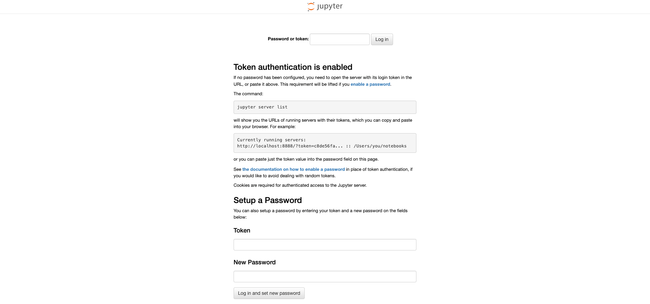
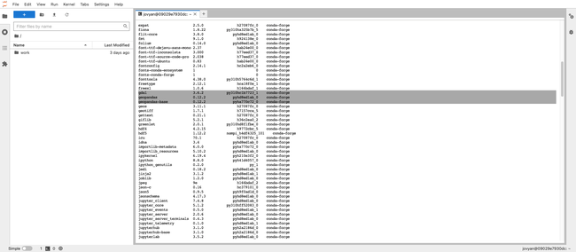
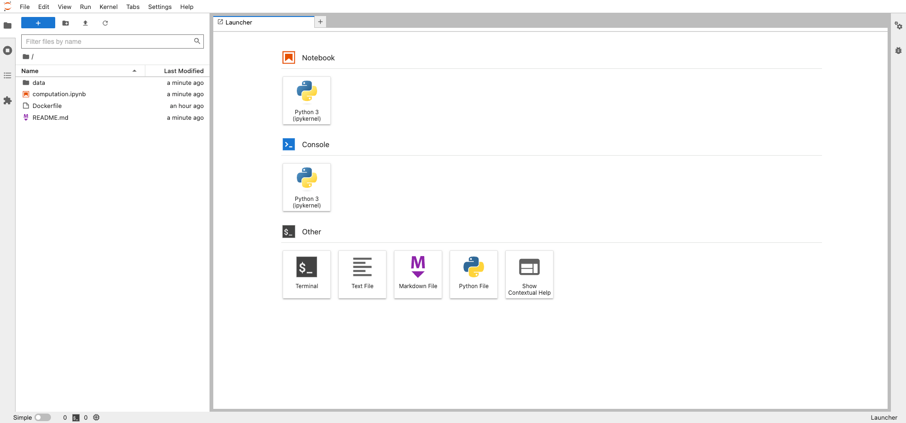

Container technologies help build lightweight, portable software units that package both the application code and required dependencies. This simplifies, secures, and helps make for reliable application development, testing, and deployment. These self-contained environments resolve environment compatibility issues. Applications can be written once and run anywhere without concern for the machine or environment they are running on. Docker is the most popular container technology. It is an open source tool powered by the Linux kernel for building, deploying, and managing containerized applications. This article comprehensively discusses developing on a Jupyter environment through Docker. Continue reading to learn how to set up different Jupyter environments through Docker instances.

## Before You Begin

1.  If you have not already done so, create a Linode account and Compute Instance. See our [Getting Started with Linode](/docs/guides/getting-started/) and [Creating a Compute Instance](/docs/guides/creating-a-compute-instance/) guides.

1.  Follow our [Setting Up and Securing a Compute Instance](/docs/guides/set-up-and-secure/) guide to update your system. You may also wish to set the timezone, configure your hostname, create a limited user account, and harden SSH access.

1.  Follow the installation guide [here](https://docs.docker.com/engine/install/) to ensure that Docker is installed.


The steps in this guide require root privileges. Be sure to run the steps below as `root` or with the `sudo` prefix. For more information on privileges, see our [Users and Groups](/docs/guides/linux-users-and-groups/) guide.


## What is Jupyter?

[Jupyter](https://jupyter.org/) is an open source, interactive computing application that aids the sharing of entities within the context of a web page. Such entities include live code, equations, narrative text (using markdown), images, and visualization. Jupyter aids the creation and sharing of computation documents that contain these entities, known as Jupyter notebooks. These notebooks are stored in JavaScript Object Notation (JSON) format with an `.ipynb` extension.

The Jupyter architecture comprises three key components:

1.  **Notebook UI**: This notebook UI serves as the client side of the application that allows running and editing Jupyter notebooks. The notebook UI manages notebooks and accessibility to kernels. The UI can be accessed locally, requiring no internet, or via remote servers.

1.  **Jupyter Server**: This is the backend of the notebook UI that hosts the notebook contents and manages kernels, operating system (OS), and API interactions. It communicates to the notebook UI via HTTP and web socket protocols. It can run locally on your machine, or on a multi-user server like [JupyterHub](https://jupyterhub.readthedocs.io/en/stable/).

1.  **Kernel Protocol**: The foundational supported languages by Jupyter are (Ju)lia, (Py)thon, and e(R). However, it now supports over 40 programming languages via the use of language-specific kernels (execution environments). The kernel protocol tells the Jupyter server to execute code with the required kernel via ZeroMQ.

[](Jupyter-Architecture.png)

Jupyter has two notebook variations, Jupyter notebook and JupyterLab. With the former being the classic, and the latter being the next-generation environment for notebooks, code, and data. Both use the same Jupyter server and file format, making it flexible to switch between both interfaces. However, JupyterLab is destined to replace the classic Jupyter notebooks, as it expands the traditional notebook's scope of functionality.

As we advance, JupyterLab and Jupyter notebooks are both referred to simply as "notebooks". These notebooks provide interactive environments for data science, machine learning, scientific computing, and computational journalism workflows. They capture thought processes and serve as a platform to explore, share, and confer about computations.

Sharing these notebooks is paramount to confer on the computational outputs from notebooks, letting both technical and non-technical stakeholders scrutinize experiments, processes, and results. Notebooks are shared easily. Simply include the notebook `.ipynb` file as an attachment to stakeholders with access to Jupyter, or in exportable formats like PDF and HTML. It can also be shared online via GitHub, Jupyter NBViewer, Binder, or via a multi-user Jupyter server like JupyterHub. Packaging notebooks can be more comprehensive with container technologies like Docker. Here, the notebook, notebook server, libraries, respective versions, data, and stripped-down Linux OS, are all packaged into a single Docker object. Sharing this containerized unit eliminates issues such as version and OS incompatibilities, and makes data science projects and experiments more reproducible. Docker packages all the dependencies required to run the notebook.

## Jupyter and Docker Workflows

This section comprehensively covers the various workflows of containerizing the Jupyter application and environment with Docker.

### Using Base Image

To work with notebooks, we need to install Jupyter, which can be done using two popular python distributions: [CPython](https://www.python.org/about/) and [Anaconda](https://www.anaconda.com/). CPython, the reference implementation of Python, can install Jupyter using `pip`, its default package installer and manager. Anaconda was developed by Anaconda, Inc. (formerly Continuum Analytics) for mathematics, statistics, engineering, data analysis, machine learning, and related applications. However, it can install Jupyter using `conda`, its default package installer and manager. Attributable to Anaconda's use case, it comes with some data science-related packages pre-installed.

Working with Docker, it's not necessary to set up Jupyter locally. Instead, Jupyter (JupyterLab) is set up in Docker. First, get a fully working Anaconda image from the verified publisher, [continuumio](https://hub.docker.com/u/continuumio), on DockerHub. Search for available images of "continuumio" using the following command in a terminal:

```command{title="Local Machine Terminal"}
docker search continuumio
```

```output
NAME                                      DESCRIPTION                                     STARS     OFFICIAL   AUTOMATED
continuumio/anaconda3                     Powerful and flexible python distribution       660                  [OK]
continuumio/miniconda3                    Powerful and flexible package manager           374                  [OK]
continuumio/anaconda                      Powerful and flexible python distribution       220                  [OK]
continuumio/miniconda                     Powerful and flexible package manager           84                   [OK]
continuumio/conda-ci-linux-64-python3.8                                                   9
continuumio/conda-ci-linux-64-python3.7                                                   7
continuumio/anaconda2                                                                     4
continuumio/conda_builder_linux           A build platform for Linux packages (64-bit …   4
continuumio/centos5_gcc5_base                                                             3
continuumio/anaconda-pkg-build                                                            2
continuumio/ci-image                                                                      1
continuumio/conda-ci-linux-64-python3.9                                                   1
continuumio/binstar-build-linux64                                                         1                    [OK]
continuumio/anaconda-build-linux-32                                                       0
continuumio/anaconda-build-linux-64                                                       0
continuumio/python_benchmarking                                                           0
continuumio/nginx-ingress-ws                                                              0
continuumio/conda-concourse-ci            Build and general-purpose image for Continuu…   0
continuumio/conda-ci-linux-64-python2.7                                                   0
continuumio/ap-auth-keycloak              Keycloak:3.1.0                                  0
continuumio/miniconda2                                                                    0
continuumio/concourse-cleanup             TRK-292                                         0
continuumio/ap-git-storage                gitea:1.3.0                                     0
continuumio/planet-gpu                    Customized base image for Telekube that enab…   0
continuumio/adam-node                                                                     0
```

Now pull the Anaconda image:

```command{title="Local Machine Terminal"}
docker pull continuumio/anaconda3
```

Next, create a container from the image in interactive mode. This opens a bash shell where the `conda` tool and commands can be used.

```command{title="Local Machine Terminal"}
docker run -it --rm -p 8888:8888 continuumio/anaconda3 /bin/bash
```

Containers are isolation units, so a way to connect them with the outside world (i.e. your local machine) is needed. It is required to bind the container port to a port on the host machine using the `-p` or `–publish` tag with the syntax `-p <host-port>:<container-port>`. The `–rm` flag tells Docker to discard the container after the docker run command finishes execution, which saves disk space for short-lived containers.

Access the bash shell to run UNIX and `conda` commands, but first, verify if `conda` was installed by issuing the following command in the bash shell:

```command{title="Local Machine Conda Shell"}
conda info
```

View the list of packages and versions installed in this container using the following command:

```command{title="Local Machine Conda Shell"}
conda list
```

**Optional:** Update all the packages in the conda environment using the command:

```command{title="Local Machine Conda Shell"}
conda update –all
```

The installed packages list contains `jupyterlab` and some popular data science libraries like `pandas`, `numpy` and `matplotlib` already installed. The Jupyter server is accessible and runs at `localhost:8888` or `127.0.0.1:8888`. With `jupyterlab` fully installed, start the Jupyter server as follows:

```command{title="Local Machine Conda Shell"}
jupyter-lab --ip="*" --no-browser --allow-root
```

Here, `--ip=”*”` serves as a wildcard/placeholder, as the local machine listens to port `8888` on all IP addresses. `--no-browser` starts and runs the server without opening a web browser. `--allow-root`allows running Jupyter as the root user.


Access to the Jupyter servers implies access to running code. This makes it essential to restrict access to the Jupyter server. Jupyter, by default, has a token-based authentication to aid this restriction. Another option provided by Jupyter is to change this token-based authentication to password-based authentication. This guide uses the default setting when token authentication is enabled.


```output
NumExpr defaulting to 1 threads.
[I 2023-01-10 17:34:54.620 ServerApp] jupyterlab | extension was successfully linked.
[I 2023-01-10 17:34:54.641 ServerApp] Writing Jupyter server cookie secret to /root/.local/share/jupyter/runtime/jupyter_cookie_secret
[I 2023-01-10 17:34:55.146 ServerApp] nbclassic | extension was successfully linked.
[I 2023-01-10 17:34:55.148 ServerApp] panel.io.jupyter_server_extension | extension was successfully linked.
[W 2023-01-10 17:34:55.206 ServerApp] WARNING: The Jupyter server is listening on all IP addresses and not using encryption. This is not recommended.
[I 2023-01-10 17:34:55.223 ServerApp] nbclassic | extension was successfully loaded.
[I 2023-01-10 17:34:55.226 LabApp] JupyterLab extension loaded from /opt/conda/lib/python3.9/site-packages/jupyterlab
[I 2023-01-10 17:34:55.227 LabApp] JupyterLab application directory is /opt/conda/share/jupyter/lab
[I 2023-01-10 17:34:55.237 ServerApp] jupyterlab | extension was successfully loaded.
[I 2023-01-10 17:34:55.241 ServerApp] panel.io.jupyter_server_extension | extension was successfully loaded.
[I 2023-01-10 17:34:55.244 ServerApp] Serving notebooks from local directory: /
[I 2023-01-10 17:34:55.245 ServerApp] Jupyter Server 1.18.1 is running at:
[I 2023-01-10 17:34:55.246 ServerApp] http://localhost:8888/lab?token=90df50ded6d2afae48846c09640919f572aaa07fb7e634e2
[I 2023-01-10 17:34:55.247 ServerApp]  or http://127.0.0.1:8888/lab?token=90df50ded6d2afae48846c09640919f572aaa07fb7e634e2
[I 2023-01-10 17:34:55.247 ServerApp] Use Control-C to stop this server and shut down all kernels (twice to skip confirmation).
[C 2023-01-10 17:34:55.255 ServerApp]

    To access the server, open this file in a browser:
        file:///root/.local/share/jupyter/runtime/jpserver-13-open.html
    Or copy and paste one of these URLs:
        http://localhost:8888/lab?token=90df50ded6d2afae48846c09640919f572aaa07fb7e634e2
     or http://127.0.0.1:8888/lab?token=90df50ded6d2afae48846c09640919f572aaa07fb7e634e2
```

We can access the JupyterLab UI at `http://127.0.0.1:8888/lab?token=XXXX` as shown above. The token is passed as a URL parameter, and the value is generated when the Jupyter server starts running with the default token authentication enabled. Upon successful launch, the JupyterLab should have an interface like this:

[](JupyterLab-UI.jpg)


The notebook UI can be accessed directly at `http://127.0.0.1:8888/lab`. However, this asks for the authentication token (which can be copied from the terminal) to log in as seen below:

[](Jupyter-Docker-Stacks-Authentication-Page.png)



While the file structure is created by default, it's good practice to create a notebook folder to contain notebooks and related files.


When finished, press **Ctrl+C** then **Y** and **Enter** to stop the server. Type `exit` and press **Enter** to exit the container shell.

### Using Pre-Existing Images

In the previous section, the Jupyter development environment was built from an Anaconda image with some packages already installed. Reduce the effort to set up and have custom, specific use-case libraries by instead using [Jupyter Docker Stacks](https://github.com/jupyter/docker-stacks).

Jupyter Docker Stacks are a group of ready-to-run Docker images with Jupyter applications and interactive computing environments and tools. Take a look at the various images in this stack:

```command{title="Local Machine Terminal"}
docker search jupyter --no-trunc
```


The `--no-trunc` flag prevents truncation of columns to show the full content.


```output
NAME                                 DESCRIPTION                                                                                            STARS     OFFICIAL   AUTOMATED
jupyter/datascience-notebook         Data Science Jupyter Notebook Python Stack from https://github.com/jupyter/docker-stacks               968
jupyter/all-spark-notebook           Python, Scala, R and Spark Jupyter Notebook Stack from https://github.com/jupyter/docker-stacks        406
jupyter/scipy-notebook               Scientific Jupyter Notebook Python Stack from https://github.com/jupyter/docker-stacks                 377
jupyter/tensorflow-notebook          Scientific Jupyter Notebook Python Stack w/ TensorFlow from https://github.com/jupyter/docker-stacks   325
jupyterhub/jupyterhub                JupyterHub: multi-user Jupyter notebook server                                                         320                  [OK]
jupyter/pyspark-notebook             Python and Spark Jupyter Notebook Stack from https://github.com/jupyter/docker-stacks                  255
jupyter/base-notebook                Base image for Jupyter Notebook stacks from https://github.com/jupyter/docker-stacks                   189
jupyter/minimal-notebook             Minimal Jupyter Notebook Python Stack from https://github.com/jupyter/docker-stacks                    167
jupyter/r-notebook                   R Jupyter Notebook Stack from https://github.com/jupyter/docker-stacks                                 48
jupyterhub/singleuser                single-user docker images for use with JupyterHub and DockerSpawner  see also: jupyter/docker-stacks   45                   [OK]
bitnami/jupyter-base-notebook                                                                                                               39
jupyter/nbviewer                     Jupyter Notebook Viewer                                                                                30                   [OK]
jupyter/repo2docker                  Turn git repositories into Jupyter enabled Docker Images                                               21
jupyterhub/k8s-hub                                                                                                                          20
jupyter/demo                         (DEPRECATED) Demo of the IPython/Jupyter Notebook                                                      16
bitnami/jupyterhub                                                                                                                          16
jupyterhub/k8s-singleuser-sample                                                                                                            10
jupyterhub/jupyterhub-onbuild        onbuild version of JupyterHub images                                                                   6
jupyterhub/configurable-http-proxy   node-http-proxy + REST API                                                                             6                    [OK]
jupyterhub/k8s-binderhub                                                                                                                    3
jupyterhub/k8s-network-tools                                                                                                                2
jupyterhub/k8s-image-awaiter                                                                                                                2
jupyterhub/k8s-secret-sync                                                                                                                  1
jupyterhub/k8s-image-cleaner                                                                                                                1
jupyterhub/k8s-pre-puller                                                                                                                   1
```

The search shows three sets of image repositories (repos) related to Jupyter: [Jupyter](https://hub.docker.com/u/jupyter), [JupyterHub](https://hub.docker.com/u/jupyterhub), and [Bitnami](https://hub.docker.com/u/bitnami). Our focus is on the Jupyter notebook images published by Jupyter, which include the following:

-   [base-notebook](https://hub.docker.com/r/jupyter/base-notebook): the baseline environment
-   [minimal-notebook](https://hub.docker.com/r/jupyter/minimal-notebook): a minimalistic environment
-   [scipy-notebook](https://hub.docker.com/r/jupyter/scipy-notebook): an environment for scientific computing
-   [r-notebook](https://hub.docker.com/r/jupyter/r-notebook): an environment with popular R packages
-   [tensorflow-notebook](https://hub.docker.com/r/jupyter/tensorflow-notebook): an environment with TensorFlow and other popular deep learning-related packages
-   [datascience-notebook](https://hub.docker.com/r/jupyter/datascience-notebook): an environment with data analysis packages for Julia, Python, and R
-   [pyspark-notebook](https://hub.docker.com/r/jupyter/pyspark-notebook): an environment for Python support for Apache Spark
-   [all-spark-notebook](https://hub.docker.com/r/jupyter/all-spark-notebook): an environment for Python and R support for Apache Spark

The various images are distinguishable by their respective environment content. A comprehensive explanation of these differences can be found on the [Jupyter Docker Stack documentation](https://jupyter-docker-stacks.readthedocs.io/en/latest/using/selecting.html). The hierarchy (build dependencies) and relationship of these images is shown below:

[](Jupyter-Docker-Stack-Hierarchy.png)

Next, run a Jupyter Docker Stack notebook container. A local Docker container can be launched from any notebook images through the Docker CLI. Use the following the syntax `docker run -it -p <host-port>:8888 <notebook-image>`. Use the following command to launch a `datascience-notebook` container:

```command{title="Local Machine Terminal"}
docker run -it --rm -p 8888:8888 jupyter/datascience-notebook
```


Notice that the `docker pull` command was not used to pull the image from DockerHub before building the container with `docker run`. The `docker run` command first searches for an image locally, and if it doesnʼt find it, it then searches for the image on DockerHub. A good practice is to link your DockerHub account using the `docker login` command. Since we donʼt have the
image locally, it is pulled from DockerHub and run in a container as seen below:


```output
Unable to find image 'jupyter/datascience-notebook:latest' locally
latest: Pulling from jupyter/datascience-notebook
6e3729cf69e0: Pulling fs layer
3dcad27c87cd: Pulling fs layer
0336f6767610: Pulling fs layer
4f4fb700ef54: Pulling fs layer
dc1c0a259e3b: Pulling fs layer
18c24dad398c: Pull complete
014a16086bc5: Pull complete
3407ddc17278: Pull complete
55f1f2cb6b3d: Pull complete
0402b91e682f: Pull complete
31d5e5a9d238: Pull complete
7d80381d4f66: Pull complete
588d572fbe21: Pull complete
8e0975085cb2: Pull complete
6fe51496bc09: Pull complete
71452a3f633d: Pull complete
0eca66f2fe69: Pull complete
94b67f4cf087: Pull complete
7bd075c5ff64: Pull complete
037dd9bf35a8: Pull complete
43c990c5c169: Pull complete
065a327966b9: Pull complete
ba1357822b7f: Pull complete
bc6872566bd0: Pull complete
7a41dae3ad99: Pull complete
911b59716a2b: Pull complete
cc624f9f1a33: Pull complete
997958355a66: Pull complete
Digest: sha256:713b01c92c2136104cc91932bff399a8ba50cbdae4c8e1983c7217cbc998f9be
Status: Downloaded newer image for jupyter/datascience-notebook:latest
Entered start.sh with args: jupyter lab
Executing the command: jupyter lab
[I 2023-01-11 15:04:04.377 ServerApp] jupyter_server_terminals | extension was successfully linked.
[I 2023-01-11 15:04:04.389 ServerApp] jupyterlab | extension was successfully linked.
[W 2023-01-11 15:04:04.394 NotebookApp] 'ip' has moved from NotebookApp to ServerApp. This config will be passed to ServerApp. Be sure to update your config before our next release.
[W 2023-01-11 15:04:04.395 NotebookApp] 'port' has moved from NotebookApp to ServerApp. This config will be passed to ServerApp. Be sure to update your config before our next release.
[W 2023-01-11 15:04:04.396 NotebookApp] 'port' has moved from NotebookApp to ServerApp. This config will be passed to ServerApp. Be sure to update your config before our next release.
[I 2023-01-11 15:04:04.400 ServerApp] nbclassic | extension was successfully linked.
[I 2023-01-11 15:04:04.403 ServerApp] Writing Jupyter server cookie secret to /home/jovyan/.local/share/jupyter/runtime/jupyter_cookie_secret
[I 2023-01-11 15:04:04.896 ServerApp] notebook_shim | extension was successfully linked.
[I 2023-01-11 15:04:05.366 ServerApp] notebook_shim | extension was successfully loaded.
[I 2023-01-11 15:04:05.369 ServerApp] jupyter_server_terminals | extension was successfully loaded.
[I 2023-01-11 15:04:05.371 LabApp] JupyterLab extension loaded from /opt/conda/lib/python3.10/site-packages/jupyterlab
[I 2023-01-11 15:04:05.371 LabApp] JupyterLab application directory is /opt/conda/share/jupyter/lab
[I 2023-01-11 15:04:05.376 ServerApp] jupyterlab | extension was successfully loaded.
[I 2023-01-11 15:04:05.384 ServerApp] nbclassic | extension was successfully loaded.
[I 2023-01-11 15:04:05.386 ServerApp] Serving notebooks from local directory: /home/jovyan
[I 2023-01-11 15:04:05.386 ServerApp] Jupyter Server 2.0.6 is running at:
[I 2023-01-11 15:04:05.387 ServerApp] http://d14c62348b49:8888/lab?token=f46a5a2b8c0df50d1a171e05ab66a441018a9107325f3d77
[I 2023-01-11 15:04:05.387 ServerApp]  or http://127.0.0.1:8888/lab?token=f46a5a2b8c0df50d1a171e05ab66a441018a9107325f3d77
[I 2023-01-11 15:04:05.388 ServerApp] Use Control-C to stop this server and shut down all kernels (twice to skip confirmation).
[C 2023-01-11 15:04:05.393 ServerApp]

    To access the server, open this file in a browser:
        file:///home/jovyan/.local/share/jupyter/runtime/jpserver-6-open.html
    Or copy and paste one of these URLs:
        http://d14c62348b49:8888/lab?token=f46a5a2b8c0df50d1a171e05ab66a441018a9107325f3d77
     or http://127.0.0.1:8888/lab?token=f46a5a2b8c0df50d1a171e05ab66a441018a9107325f3d77
```

As you can see, Jupyter Docker Stacks notebook images definitely reduce the time needed to set up the Jupyter environment.

The resulting notebook UI of the `datascience-notebook` can be accessed via `http://127.0.0.1:8888/lab?token=XXXX`, which contains libraries for data science computation in the Julia, Python, and R languages. Jupyter Docker Stacks notebook images also simplify the notebook file system with a working directory of `work`.

[](Jupyter-Docker-Stacks-datascience-notebook-UI.png)

When finished, press **Ctrl+C** then **Y** and **Enter** to stop the server.

### Building Your Own Image with Dockerfile

This section builds on the previous experience with Jupyter Docker Stacks images to create a custom image using a `Dockerfile`. Docker containers are isolated units, therefore changes and updates within a container stay in the container. For example, in the previous section, packages were updated in the anaconda image via `conda update –all`. If we build another container with the same image, the package versions return to defaults. In this section, learn to build a Docker image based on the Jupyter Docker Stacks image and install desired packages in the Jupyter environment.

A python geospatial data analysis project is used to explain this process. This project environment requires Python libraries like `geopandas` and `gdal` for spatial data analysis.

Create a file named `Dockerfile` without any file extension. The `Dockerfile` is a text document that contains human-readable instructions to build a docker image. The content of the Dockerfile is as follows:

```file {title="Dockerfile" lang="docker"}
# Let's use the Jupyter Docker Stack minimal notebook as our base image and build our custom image on top of it
FROM jupyter/minimal-notebook

# Install required geospatial python libraries
RUN conda install geopandas
RUN conda install -c conda-forge gdal

# informs Docker that this container should listen to network port 8888 at runtime
EXPOSE 8888
```

Before building a docker image using the Dockerfile, here's an explanation of the instructions contained within:

-   `FROM jupyter/minimal-notebook`: Docker allows image inheritance, and this instruction inherits the Jupyter Docker Stacks minimal-notebook property and functionality. It comes with some preinstalled packages as well as a Jupyter server and environment.
-   `RUN`: The run instructions help install the dependencies required to run the containers successfully. Here, it installs the `geopandas` and `gdal` libraries.
-   `EXPOSE`: The expose command is for documentation purposes. It's best practice to include it in the `Dockerfile` when an application is required to run on a specific port. It helps to build a container of the image and bind the local host to that particular port (e.g. `8888`).
-   `#`: Docker treats lines in the Dockerfile beginning with `#` as comments.

Next, proceed to build the Docker image using the tag `custom-jupyter-image` from the Dockerfile with the following command:

```command{title="Local Machine Terminal"}
docker build -t custom-jupyter-image .
```

With the image successfully built, the output should look similar to the following:

```output
Sending build context to Docker daemon  13.82kB
Step 1/4 : FROM jupyter/minimal-notebook
latest: Pulling from jupyter/minimal-notebook
6e3729cf69e0: Already exists
3dcad27c87cd: Already exists
0336f6767610: Already exists
4f4fb700ef54: Already exists
dc1c0a259e3b: Already exists
18c24dad398c: Already exists
014a16086bc5: Already exists
3407ddc17278: Already exists
55f1f2cb6b3d: Already exists
0402b91e682f: Already exists
31d5e5a9d238: Already exists
7d80381d4f66: Already exists
588d572fbe21: Already exists
8e0975085cb2: Already exists
6fe51496bc09: Already exists
71452a3f633d: Already exists
0eca66f2fe69: Already exists
94b67f4cf087: Already exists
Digest: sha256:8289605543e18c4e2bd4d6f7be68613631def30f8b210e7897c9d25c6af6c7a2
Status: Downloaded newer image for jupyter/minimal-notebook:latest
 ---> f7d963e5fcad
Step 2/4 : RUN conda install geopandas
 ---> Running in 713d9f7e371d
Collecting package metadata (current_repodata.json): ...working... done
Solving environment: ...working... done

## Package Plan ##

  environment location: /opt/conda

  added / updated specs:
    - geopandas


The following packages will be downloaded:

    package                    |            build
    ---------------------------|-----------------
    appdirs-1.4.4              |     pyh9f0ad1d_0          13 KB  conda-forge
    blosc-1.21.3               |       hafa529b_0          39 KB  conda-forge
    boost-cpp-1.78.0           |       h75c5d50_1        17.1 MB  conda-forge
    branca-0.6.0               |     pyhd8ed1ab_0          27 KB  conda-forge
    brotli-1.0.9               |       h166bdaf_8          18 KB  conda-forge
    brotli-bin-1.0.9           |       h166bdaf_8          20 KB  conda-forge
    cairo-1.16.0               |    ha61ee94_1014         1.5 MB  conda-forge
    cfitsio-4.2.0              |       hd9d235c_0         828 KB  conda-forge
    click-8.1.3                |unix_pyhd8ed1ab_2          74 KB  conda-forge
    click-plugins-1.1.1        |             py_0           9 KB  conda-forge
    cligj-0.7.2                |     pyhd8ed1ab_1          10 KB  conda-forge
    contourpy-1.0.6            |  py310hbf28c38_0         234 KB  conda-forge
    curl-7.87.0                |       hdc1c0ab_0          85 KB  conda-forge
    cycler-0.11.0              |     pyhd8ed1ab_0          10 KB  conda-forge
    expat-2.5.0                |       h27087fc_0         189 KB  conda-forge
    fiona-1.8.22               |  py310ha325b7b_5         767 KB  conda-forge
    folium-0.14.0              |     pyhd8ed1ab_0          71 KB  conda-forge
    font-ttf-dejavu-sans-mono-2.37|       hab24e00_0         388 KB  conda-forge
    font-ttf-inconsolata-3.000 |       h77eed37_0          94 KB  conda-forge
    font-ttf-source-code-pro-2.038|       h77eed37_0         684 KB  conda-forge
    font-ttf-ubuntu-0.83       |       hab24e00_0         1.9 MB  conda-forge
    fontconfig-2.14.1          |       hc2a2eb6_0         365 KB  conda-forge
    fonts-conda-ecosystem-1    |                0           4 KB  conda-forge
    fonts-conda-forge-1        |                0           4 KB  conda-forge
    fonttools-4.38.0           |  py310h5764c6d_1         1.9 MB  conda-forge
    freetype-2.12.1            |       hca18f0e_1         611 KB  conda-forge
    freexl-1.0.6               |       h166bdaf_1          48 KB  conda-forge
    gdal-3.6.2                 |  py310hc1b7723_1         1.4 MB  conda-forge
    geopandas-0.12.2           |     pyhd8ed1ab_0           7 KB  conda-forge
    geopandas-base-0.12.2      |     pyha770c72_0         958 KB  conda-forge
    geos-3.11.1                |       h27087fc_0         1.6 MB  conda-forge
    geotiff-1.7.1              |       h7157cca_5         249 KB  conda-forge
    gettext-0.21.1             |       h27087fc_0         4.1 MB  conda-forge
    giflib-5.2.1               |       h36c2ea0_2          77 KB  conda-forge
    hdf4-4.2.15                |       h9772cbc_5         951 KB  conda-forge
    hdf5-1.12.2                |nompi_h4df4325_101         3.2 MB  conda-forge
    joblib-1.2.0               |     pyhd8ed1ab_0         205 KB  conda-forge
    jpeg-9e                    |       h166bdaf_2         269 KB  conda-forge
    json-c-0.16                |       hc379101_0         275 KB  conda-forge
    kealib-1.5.0               |       ha7026e8_0         160 KB  conda-forge
    kiwisolver-1.4.4           |  py310hbf28c38_1          76 KB  conda-forge
    lcms2-2.14                 |       hfd0df8a_1         235 KB  conda-forge
    lerc-4.0.0                 |       h27087fc_0         275 KB  conda-forge
    libaec-1.0.6               |       h9c3ff4c_0          45 KB  conda-forge
    libblas-3.9.0              |16_linux64_openblas          13 KB  conda-forge
    libbrotlicommon-1.0.9      |       h166bdaf_8          66 KB  conda-forge
    libbrotlidec-1.0.9         |       h166bdaf_8          33 KB  conda-forge
    libbrotlienc-1.0.9         |       h166bdaf_8         288 KB  conda-forge
    libcblas-3.9.0             |16_linux64_openblas          13 KB  conda-forge
    libdeflate-1.14            |       h166bdaf_0          81 KB  conda-forge
    libgdal-3.6.2              |       he31f7c0_1         9.8 MB  conda-forge
    libgfortran-ng-12.2.0      |      h69a702a_19          22 KB  conda-forge
    libgfortran5-12.2.0        |      h337968e_19         1.8 MB  conda-forge
    libglib-2.74.1             |       h606061b_1         3.1 MB  conda-forge
    libjpeg-turbo-2.1.4        |       h166bdaf_0         988 KB  conda-forge
    libkml-1.3.0               |    h37653c0_1015         610 KB  conda-forge
    liblapack-3.9.0            |16_linux64_openblas          13 KB  conda-forge
    libnetcdf-4.8.1            |nompi_h261ec11_106         1.5 MB  conda-forge
    libopenblas-0.3.21         |pthreads_h78a6416_3        10.1 MB  conda-forge
    libpng-1.6.39              |       h753d276_0         276 KB  conda-forge
    libpq-15.1                 |       hb675445_3         2.4 MB  conda-forge
    librttopo-1.1.0            |      ha49c73b_12         236 KB  conda-forge
    libspatialindex-1.9.3      |       h9c3ff4c_4         4.6 MB  conda-forge
    libspatialite-5.0.1        |      h7c8129e_22         4.4 MB  conda-forge
    libtiff-4.5.0              |       h82bc61c_0         398 KB  conda-forge
    libwebp-base-1.2.4         |       h166bdaf_0         404 KB  conda-forge
    libxcb-1.13                |    h7f98852_1004         391 KB  conda-forge
    libzip-1.9.2               |       hc929e4a_1          97 KB  conda-forge
    mapclassify-2.4.3          |     pyhd8ed1ab_0          36 KB  conda-forge
    matplotlib-base-3.6.2      |  py310h8d5ebf3_0         7.6 MB  conda-forge
    munch-2.5.0                |             py_0          12 KB  conda-forge
    munkres-1.1.4              |     pyh9f0ad1d_0          12 KB  conda-forge
    networkx-3.0               |     pyhd8ed1ab_0         1.4 MB  conda-forge
    nspr-4.35                  |       h27087fc_0         222 KB  conda-forge
    nss-3.82                   |       he02c5a1_0         1.9 MB  conda-forge
    numpy-1.24.1               |  py310h08bbf29_0         6.3 MB  conda-forge
    openjpeg-2.5.0             |       hfec8fc6_2         344 KB  conda-forge
    pandas-1.5.2               |  py310h9b08913_2        11.4 MB  conda-forge
    pcre2-10.40                |       hc3806b6_0         2.3 MB  conda-forge
    pillow-9.4.0               |  py310h4927cde_0        44.1 MB  conda-forge
    pixman-0.40.0              |       h36c2ea0_0         627 KB  conda-forge
    pooch-1.6.0                |     pyhd8ed1ab_0          44 KB  conda-forge
    poppler-22.12.0            |       h091648b_1        14.6 MB  conda-forge
    poppler-data-0.4.11        |       hd8ed1ab_0         3.6 MB  conda-forge
    postgresql-15.1            |       h3248436_3         4.9 MB  conda-forge
    proj-9.1.0                 |       h8ffa02c_1         2.7 MB  conda-forge
    pthread-stubs-0.4          |    h36c2ea0_1001           5 KB  conda-forge
    pyparsing-3.0.9            |     pyhd8ed1ab_0          79 KB  conda-forge
    pyproj-3.4.1               |  py310hfc24d34_0         438 KB  conda-forge
    rtree-1.0.1                |  py310hbdcdc62_1          50 KB  conda-forge
    scikit-learn-1.2.0         |  py310h209a8ca_0         7.2 MB  conda-forge
    scipy-1.10.0               |  py310h8deb116_0        23.4 MB  conda-forge
    shapely-2.0.0              |  py310h8b84c32_0         411 KB  conda-forge
    snappy-1.1.9               |       hbd366e4_2          37 KB  conda-forge
    sqlite-3.40.0              |       h4ff8645_0         801 KB  conda-forge
    threadpoolctl-3.1.0        |     pyh8a188c0_0          18 KB  conda-forge
    tiledb-2.13.1              |       hd532e3d_0         5.0 MB  conda-forge
    tzcode-2022g               |       h166bdaf_0          65 KB  conda-forge
    unicodedata2-15.0.0        |  py310h5764c6d_0         500 KB  conda-forge
    xerces-c-3.2.4             |       h55805fa_1         1.7 MB  conda-forge
    xorg-kbproto-1.0.7         |    h7f98852_1002          27 KB  conda-forge
    xorg-libice-1.0.10         |       h7f98852_0          58 KB  conda-forge
    xorg-libsm-1.2.3           |    hd9c2040_1000          26 KB  conda-forge
    xorg-libx11-1.7.2          |       h7f98852_0         941 KB  conda-forge
    xorg-libxau-1.0.9          |       h7f98852_0          13 KB  conda-forge
    xorg-libxdmcp-1.1.3        |       h7f98852_0          19 KB  conda-forge
    xorg-libxext-1.3.4         |       h7f98852_1          54 KB  conda-forge
    xorg-libxrender-0.9.10     |    h7f98852_1003          32 KB  conda-forge
    xorg-renderproto-0.11.1    |    h7f98852_1002           9 KB  conda-forge
    xorg-xextproto-7.3.0       |    h7f98852_1002          28 KB  conda-forge
    xorg-xproto-7.0.31         |    h7f98852_1007          73 KB  conda-forge
    xyzservices-2022.9.0       |     pyhd8ed1ab_0          38 KB  conda-forge
    ------------------------------------------------------------
                                           Total:       225.4 MB

The following NEW packages will be INSTALLED:

  appdirs            conda-forge/noarch::appdirs-1.4.4-pyh9f0ad1d_0
  blosc              conda-forge/linux-64::blosc-1.21.3-hafa529b_0
  boost-cpp          conda-forge/linux-64::boost-cpp-1.78.0-h75c5d50_1
  branca             conda-forge/noarch::branca-0.6.0-pyhd8ed1ab_0
  brotli             conda-forge/linux-64::brotli-1.0.9-h166bdaf_8
  brotli-bin         conda-forge/linux-64::brotli-bin-1.0.9-h166bdaf_8
  cairo              conda-forge/linux-64::cairo-1.16.0-ha61ee94_1014
  cfitsio            conda-forge/linux-64::cfitsio-4.2.0-hd9d235c_0
  click              conda-forge/noarch::click-8.1.3-unix_pyhd8ed1ab_2
  click-plugins      conda-forge/noarch::click-plugins-1.1.1-py_0
  cligj              conda-forge/noarch::cligj-0.7.2-pyhd8ed1ab_1
  contourpy          conda-forge/linux-64::contourpy-1.0.6-py310hbf28c38_0
  curl               conda-forge/linux-64::curl-7.87.0-hdc1c0ab_0
  cycler             conda-forge/noarch::cycler-0.11.0-pyhd8ed1ab_0
  expat              conda-forge/linux-64::expat-2.5.0-h27087fc_0
  fiona              conda-forge/linux-64::fiona-1.8.22-py310ha325b7b_5
  folium             conda-forge/noarch::folium-0.14.0-pyhd8ed1ab_0
  font-ttf-dejavu-s~ conda-forge/noarch::font-ttf-dejavu-sans-mono-2.37-hab24e00_0
  font-ttf-inconsol~ conda-forge/noarch::font-ttf-inconsolata-3.000-h77eed37_0
  font-ttf-source-c~ conda-forge/noarch::font-ttf-source-code-pro-2.038-h77eed37_0
  font-ttf-ubuntu    conda-forge/noarch::font-ttf-ubuntu-0.83-hab24e00_0
  fontconfig         conda-forge/linux-64::fontconfig-2.14.1-hc2a2eb6_0
  fonts-conda-ecosy~ conda-forge/noarch::fonts-conda-ecosystem-1-0
  fonts-conda-forge  conda-forge/noarch::fonts-conda-forge-1-0
  fonttools          conda-forge/linux-64::fonttools-4.38.0-py310h5764c6d_1
  freetype           conda-forge/linux-64::freetype-2.12.1-hca18f0e_1
  freexl             conda-forge/linux-64::freexl-1.0.6-h166bdaf_1
  gdal               conda-forge/linux-64::gdal-3.6.2-py310hc1b7723_1
  geopandas          conda-forge/noarch::geopandas-0.12.2-pyhd8ed1ab_0
  geopandas-base     conda-forge/noarch::geopandas-base-0.12.2-pyha770c72_0
  geos               conda-forge/linux-64::geos-3.11.1-h27087fc_0
  geotiff            conda-forge/linux-64::geotiff-1.7.1-h7157cca_5
  gettext            conda-forge/linux-64::gettext-0.21.1-h27087fc_0
  giflib             conda-forge/linux-64::giflib-5.2.1-h36c2ea0_2
  hdf4               conda-forge/linux-64::hdf4-4.2.15-h9772cbc_5
  hdf5               conda-forge/linux-64::hdf5-1.12.2-nompi_h4df4325_101
  joblib             conda-forge/noarch::joblib-1.2.0-pyhd8ed1ab_0
  jpeg               conda-forge/linux-64::jpeg-9e-h166bdaf_2
  json-c             conda-forge/linux-64::json-c-0.16-hc379101_0
  kealib             conda-forge/linux-64::kealib-1.5.0-ha7026e8_0
  kiwisolver         conda-forge/linux-64::kiwisolver-1.4.4-py310hbf28c38_1
  lcms2              conda-forge/linux-64::lcms2-2.14-hfd0df8a_1
  lerc               conda-forge/linux-64::lerc-4.0.0-h27087fc_0
  libaec             conda-forge/linux-64::libaec-1.0.6-h9c3ff4c_0
  libblas            conda-forge/linux-64::libblas-3.9.0-16_linux64_openblas
  libbrotlicommon    conda-forge/linux-64::libbrotlicommon-1.0.9-h166bdaf_8
  libbrotlidec       conda-forge/linux-64::libbrotlidec-1.0.9-h166bdaf_8
  libbrotlienc       conda-forge/linux-64::libbrotlienc-1.0.9-h166bdaf_8
  libcblas           conda-forge/linux-64::libcblas-3.9.0-16_linux64_openblas
  libdeflate         conda-forge/linux-64::libdeflate-1.14-h166bdaf_0
  libgdal            conda-forge/linux-64::libgdal-3.6.2-he31f7c0_1
  libgfortran-ng     conda-forge/linux-64::libgfortran-ng-12.2.0-h69a702a_19
  libgfortran5       conda-forge/linux-64::libgfortran5-12.2.0-h337968e_19
  libglib            conda-forge/linux-64::libglib-2.74.1-h606061b_1
  libjpeg-turbo      conda-forge/linux-64::libjpeg-turbo-2.1.4-h166bdaf_0
  libkml             conda-forge/linux-64::libkml-1.3.0-h37653c0_1015
  liblapack          conda-forge/linux-64::liblapack-3.9.0-16_linux64_openblas
  libnetcdf          conda-forge/linux-64::libnetcdf-4.8.1-nompi_h261ec11_106
  libopenblas        conda-forge/linux-64::libopenblas-0.3.21-pthreads_h78a6416_3
  libpng             conda-forge/linux-64::libpng-1.6.39-h753d276_0
  libpq              conda-forge/linux-64::libpq-15.1-hb675445_3
  librttopo          conda-forge/linux-64::librttopo-1.1.0-ha49c73b_12
  libspatialindex    conda-forge/linux-64::libspatialindex-1.9.3-h9c3ff4c_4
  libspatialite      conda-forge/linux-64::libspatialite-5.0.1-h7c8129e_22
  libtiff            conda-forge/linux-64::libtiff-4.5.0-h82bc61c_0
  libwebp-base       conda-forge/linux-64::libwebp-base-1.2.4-h166bdaf_0
  libxcb             conda-forge/linux-64::libxcb-1.13-h7f98852_1004
  libzip             conda-forge/linux-64::libzip-1.9.2-hc929e4a_1
  mapclassify        conda-forge/noarch::mapclassify-2.4.3-pyhd8ed1ab_0
  matplotlib-base    conda-forge/linux-64::matplotlib-base-3.6.2-py310h8d5ebf3_0
  munch              conda-forge/noarch::munch-2.5.0-py_0
  munkres            conda-forge/noarch::munkres-1.1.4-pyh9f0ad1d_0
  networkx           conda-forge/noarch::networkx-3.0-pyhd8ed1ab_0
  nspr               conda-forge/linux-64::nspr-4.35-h27087fc_0
  nss                conda-forge/linux-64::nss-3.82-he02c5a1_0
  numpy              conda-forge/linux-64::numpy-1.24.1-py310h08bbf29_0
  openjpeg           conda-forge/linux-64::openjpeg-2.5.0-hfec8fc6_2
  pandas             conda-forge/linux-64::pandas-1.5.2-py310h9b08913_2
  pcre2              conda-forge/linux-64::pcre2-10.40-hc3806b6_0
  pillow             conda-forge/linux-64::pillow-9.4.0-py310h4927cde_0
  pixman             conda-forge/linux-64::pixman-0.40.0-h36c2ea0_0
  pooch              conda-forge/noarch::pooch-1.6.0-pyhd8ed1ab_0
  poppler            conda-forge/linux-64::poppler-22.12.0-h091648b_1
  poppler-data       conda-forge/noarch::poppler-data-0.4.11-hd8ed1ab_0
  postgresql         conda-forge/linux-64::postgresql-15.1-h3248436_3
  proj               conda-forge/linux-64::proj-9.1.0-h8ffa02c_1
  pthread-stubs      conda-forge/linux-64::pthread-stubs-0.4-h36c2ea0_1001
  pyparsing          conda-forge/noarch::pyparsing-3.0.9-pyhd8ed1ab_0
  pyproj             conda-forge/linux-64::pyproj-3.4.1-py310hfc24d34_0
  rtree              conda-forge/linux-64::rtree-1.0.1-py310hbdcdc62_1
  scikit-learn       conda-forge/linux-64::scikit-learn-1.2.0-py310h209a8ca_0
  scipy              conda-forge/linux-64::scipy-1.10.0-py310h8deb116_0
  shapely            conda-forge/linux-64::shapely-2.0.0-py310h8b84c32_0
  snappy             conda-forge/linux-64::snappy-1.1.9-hbd366e4_2
  sqlite             conda-forge/linux-64::sqlite-3.40.0-h4ff8645_0
  threadpoolctl      conda-forge/noarch::threadpoolctl-3.1.0-pyh8a188c0_0
  tiledb             conda-forge/linux-64::tiledb-2.13.1-hd532e3d_0
  tzcode             conda-forge/linux-64::tzcode-2022g-h166bdaf_0
  unicodedata2       conda-forge/linux-64::unicodedata2-15.0.0-py310h5764c6d_0
  xerces-c           conda-forge/linux-64::xerces-c-3.2.4-h55805fa_1
  xorg-kbproto       conda-forge/linux-64::xorg-kbproto-1.0.7-h7f98852_1002
  xorg-libice        conda-forge/linux-64::xorg-libice-1.0.10-h7f98852_0
  xorg-libsm         conda-forge/linux-64::xorg-libsm-1.2.3-hd9c2040_1000
  xorg-libx11        conda-forge/linux-64::xorg-libx11-1.7.2-h7f98852_0
  xorg-libxau        conda-forge/linux-64::xorg-libxau-1.0.9-h7f98852_0
  xorg-libxdmcp      conda-forge/linux-64::xorg-libxdmcp-1.1.3-h7f98852_0
  xorg-libxext       conda-forge/linux-64::xorg-libxext-1.3.4-h7f98852_1
  xorg-libxrender    conda-forge/linux-64::xorg-libxrender-0.9.10-h7f98852_1003
  xorg-renderproto   conda-forge/linux-64::xorg-renderproto-0.11.1-h7f98852_1002
  xorg-xextproto     conda-forge/linux-64::xorg-xextproto-7.3.0-h7f98852_1002
  xorg-xproto        conda-forge/linux-64::xorg-xproto-7.0.31-h7f98852_1007
  xyzservices        conda-forge/noarch::xyzservices-2022.9.0-pyhd8ed1ab_0


Proceed ([y]/n)?

Downloading and Extracting Packages

Preparing transaction: ...working... done
Verifying transaction: ...working... done
Executing transaction: ...working... done
Removing intermediate container 713d9f7e371d
 ---> 044994e39533
Step 3/4 : RUN conda install -c conda-forge gdal
 ---> Running in f79aec2fe581
Collecting package metadata (current_repodata.json): ...working... done
Solving environment: ...working... done

# All requested packages already installed.

Removing intermediate container f79aec2fe581
 ---> 531d4bdc4495
Step 4/4 : EXPOSE 8888
 ---> Running in 35038f08025d
Removing intermediate container 35038f08025d
 ---> bf0b59b1ae05
Successfully built bf0b59b1ae05
Successfully tagged custom-jupyter-image:latest
```

Next, run an instance of the image (container) as follows:

```command{title="Local Machine Terminal"}
docker run -it --rm -p 8888:8888 custom-jupyter-image
```

```output
Entered start.sh with args: jupyter lab
Executing the command: jupyter lab
[I 2023-01-11 19:59:11.767 ServerApp] jupyter_server_terminals | extension was successfully linked.
[I 2023-01-11 19:59:11.781 ServerApp] jupyterlab | extension was successfully linked.
[W 2023-01-11 19:59:11.789 NotebookApp] 'ip' has moved from NotebookApp to ServerApp. This config will be passed to ServerApp. Be sure to update your config before our next release.
[W 2023-01-11 19:59:11.791 NotebookApp] 'port' has moved from NotebookApp to ServerApp. This config will be passed to ServerApp. Be sure to update your config before our next release.
[W 2023-01-11 19:59:11.792 NotebookApp] 'port' has moved from NotebookApp to ServerApp. This config will be passed to ServerApp. Be sure to update your config before our next release.
[I 2023-01-11 19:59:11.800 ServerApp] nbclassic | extension was successfully linked.
[I 2023-01-11 19:59:11.804 ServerApp] Writing Jupyter server cookie secret to /home/jovyan/.local/share/jupyter/runtime/jupyter_cookie_secret
[I 2023-01-11 19:59:12.512 ServerApp] notebook_shim | extension was successfully linked.
[I 2023-01-11 19:59:13.148 ServerApp] notebook_shim | extension was successfully loaded.
[I 2023-01-11 19:59:13.154 ServerApp] jupyter_server_terminals | extension was successfully loaded.
[I 2023-01-11 19:59:13.157 LabApp] JupyterLab extension loaded from /opt/conda/lib/python3.10/site-packages/jupyterlab
[I 2023-01-11 19:59:13.158 LabApp] JupyterLab application directory is /opt/conda/share/jupyter/lab
[I 2023-01-11 19:59:13.165 ServerApp] jupyterlab | extension was successfully loaded.
[I 2023-01-11 19:59:13.176 ServerApp] nbclassic | extension was successfully loaded.
[I 2023-01-11 19:59:13.178 ServerApp] Serving notebooks from local directory: /home/jovyan
[I 2023-01-11 19:59:13.179 ServerApp] Jupyter Server 2.0.6 is running at:
[I 2023-01-11 19:59:13.181 ServerApp] http://09029e7930dc:8888/lab?token=be8f6504c7318652a222dcd4bb76049885cc4515622209e8
[I 2023-01-11 19:59:13.181 ServerApp]  or http://127.0.0.1:8888/lab?token=be8f6504c7318652a222dcd4bb76049885cc4515622209e8
[I 2023-01-11 19:59:13.182 ServerApp] Use Control-C to stop this server and shut down all kernels (twice to skip confirmation).
[C 2023-01-11 19:59:13.191 ServerApp]

    To access the server, open this file in a browser:
        file:///home/jovyan/.local/share/jupyter/runtime/jpserver-6-open.html
    Or copy and paste one of these URLs:
        http://09029e7930dc:8888/lab?token=be8f6504c7318652a222dcd4bb76049885cc4515622209e8
     or http://127.0.0.1:8888/lab?token=be8f6504c7318652a222dcd4bb76049885cc4515622209e8
```

The JupyterLab UI can be accessed via `http://127.0.0.1:8888/lab?token=XXXX`, and is shown below:

[](Jupyter-Dockerfile-Notebook-UI.png)

Next, verify if the packages are installed in the container environment by default.

Open **Terminal** from the JupyterLab UI and check the list of `conda` packages:

```command{title="JupyterLab UI Terminal"}
conda list
```
The `geospatial` packages should be visible as follows:

[](Jupyter-Dockerfile-Notebook-UI-Terminal.png)


The versions of the `geopandas` and `gdal` libraries shown are from the time of writing, and are subject to change.


When finished, press **Ctrl+C** then **Y** and **Enter** to stop the server.

### Building Images with Pre-Load Requirements

This section relies on previous knowledge to build images with pre-load requirements. Requirements are files and directories that notebooks depend on to run successfully. Such requirements include configuration files, spreadsheets, images, or even scripts required to run the container.

To take the geospatial project use case to the next level, add the following folder and files:

```command
mkdir data
touch README.md computation.ipynb ./data/data.geojson
```

This should create a directory structure of:

```command
.
├── Dockerfile
├── README.md
├── computation.ipynb
└── data
 └── data.geojson
```

Add the following contents to the `computation.ipynb` file:

```file {title="computation.ipynb" lang="python"}
{
 "cells": [
  {
   "cell_type": "code",
   "execution_count": null,
   "id": "9d184cb1-5937-45cf-bc13-4c45007a4e50",
   "metadata": {},
   "outputs": [],
   "source": []
  }
 ],
 "metadata": {
  "kernelspec": {
   "display_name": "Python 3 (ipykernel)",
   "language": "python",
   "name": "python3"
  },
  "language_info": {
   "codemirror_mode": {
    "name": "ipython",
    "version": 3
   },
   "file_extension": ".py",
   "mimetype": "text/x-python",
   "name": "python",
   "nbconvert_exporter": "python",
   "pygments_lexer": "ipython3",
   "version": "3.9.13"
  }
 },
 "nbformat": 4,
 "nbformat_minor": 5
}
```

To create an image that includes these required files, the content in the `Dockerfile` needs to be as follows:

```file {title="Dockerfile" lang="docker"}
# Let's use the Jupyter Docker Stack minimal notebook as our base image and build our custom image on top of it
FROM jupyter/minimal-notebook

# Install required geospatial python libraries
RUN conda install geopandas
RUN conda install -c conda-forge gdal

# informs Docker that this container should listen to network port 8888 at runtime
EXPOSE 8888

# Copy files from the local directory to the image file system
WORKDIR /work

# Copy the current directory contents into /work
COPY . /work
```

Before building a Docker image using the Dockerfile for the example application, here's a breakdown of the instructions:


This builds upon the previous Dockerfile, so only new instructions are explained below.


-   `WORKDIR /work`: The `WORKDIR` instruction sets the default working (root) directory in the image file system, where `Dockerfile` instructions are executed. This uses the `work` directory seen in the previous sections.
-   `COPY . /app`: This copies files or directories from the local directory where the Dockerfile is located to the image's file system (working directory). Here, the `data` directory and its content (`data.geojson`) are copied along with the `computation.ipynb` notebook, `README.md` Markdown file, and the `Dockerfile` itself.

Next, proceed to build the docker image from the Dockerfile using the tag `custom-jupyter-image:preload` with the following command:

```command {title="Local Machine"}
docker build -t custom-jupyter-image:preload .
```

With the image successfully built, the output should look similar to the following:

```output
Sending build context to Docker daemon  15.87kB
Step 1/6 : FROM jupyter/minimal-notebook
 ---> f7d963e5fcad
Step 2/6 : RUN conda install geopandas
 ---> Using cache
 ---> 044994e39533
Step 3/6 : RUN conda install -c conda-forge gdal
 ---> Using cache
 ---> 531d4bdc4495
Step 4/6 : EXPOSE 8888
 ---> Using cache
 ---> bf0b59b1ae05
Step 5/6 : WORKDIR /work
 ---> Using cache
 ---> f35e010a09e3
Step 6/6 : COPY . /work
 ---> 4a1d29eb6300
Successfully built 4a1d29eb6300
Successfully tagged custom-jupyter-image:preload
```

Next, run an instance of the container as follows:

```command{title="Local Machine"}
docker run -it --rm -p 8888:8888 custom-jupyter-image:preload
```

```output
Entered start.sh with args: jupyter lab
Executing the command: jupyter lab
[I 2023-01-11 21:22:50.834 ServerApp] jupyter_server_terminals | extension was successfully linked.
[I 2023-01-11 21:22:50.848 ServerApp] jupyterlab | extension was successfully linked.
[W 2023-01-11 21:22:50.859 NotebookApp] 'ip' has moved from NotebookApp to ServerApp. This config will be passed to ServerApp. Be sure to update your config before our next release.
[W 2023-01-11 21:22:50.860 NotebookApp] 'port' has moved from NotebookApp to ServerApp. This config will be passed to ServerApp. Be sure to update your config before our next release.
[W 2023-01-11 21:22:50.861 NotebookApp] 'port' has moved from NotebookApp to ServerApp. This config will be passed to ServerApp. Be sure to update your config before our next release.
[I 2023-01-11 21:22:50.868 ServerApp] nbclassic | extension was successfully linked.
[I 2023-01-11 21:22:50.873 ServerApp] Writing Jupyter server cookie secret to /home/jovyan/.local/share/jupyter/runtime/jupyter_cookie_secret
[I 2023-01-11 21:22:51.365 ServerApp] notebook_shim | extension was successfully linked.
[I 2023-01-11 21:22:51.857 ServerApp] notebook_shim | extension was successfully loaded.
[I 2023-01-11 21:22:51.861 ServerApp] jupyter_server_terminals | extension was successfully loaded.
[I 2023-01-11 21:22:51.864 LabApp] JupyterLab extension loaded from /opt/conda/lib/python3.10/site-packages/jupyterlab
[I 2023-01-11 21:22:51.866 LabApp] JupyterLab application directory is /opt/conda/share/jupyter/lab
[I 2023-01-11 21:22:51.874 ServerApp] jupyterlab | extension was successfully loaded.
[I 2023-01-11 21:22:51.885 ServerApp] nbclassic | extension was successfully loaded.
[I 2023-01-11 21:22:51.888 ServerApp] Serving notebooks from local directory: /work
[I 2023-01-11 21:22:51.890 ServerApp] Jupyter Server 2.0.6 is running at:
[I 2023-01-11 21:22:51.891 ServerApp] http://97e57366682d:8888/lab?token=2d038ed68b99e8979fd460f8f4a0a9b6511ac13c44446210
[I 2023-01-11 21:22:51.892 ServerApp]  or http://127.0.0.1:8888/lab?token=2d038ed68b99e8979fd460f8f4a0a9b6511ac13c44446210
[I 2023-01-11 21:22:51.893 ServerApp] Use Control-C to stop this server and shut down all kernels (twice to skip confirmation).
[C 2023-01-11 21:22:51.907 ServerApp]

    To access the server, open this file in a browser:
        file:///home/jovyan/.local/share/jupyter/runtime/jpserver-7-open.html
    Or copy and paste one of these URLs:
        http://97e57366682d:8888/lab?token=2d038ed68b99e8979fd460f8f4a0a9b6511ac13c44446210
     or http://127.0.0.1:8888/lab?token=2d038ed68b99e8979fd460f8f4a0a9b6511ac13c44446210
[I 2023-01-11 21:23:07.849 LabApp] Generating new user for token-authenticated request: 558ef0bc2be84a82b33f9c62effe16bd
[I 2023-01-11 21:23:13.093 LabApp] Build is up to date
```

The JupyterLab UI can be accessed via `http://127.0.0.1:8888/lab?token=XXXX`. It should have the requirements pre-loaded in the container as shown below:

[](Jupyter-Dockerfile-Notebook-UI-Preloaded.png)

When finished, press **Ctrl+C** then **Y** and **Enter** to stop the server.

## Managing Data in Images and Containers

The previous sections covered how to pre-load data alongside images and containers. This section teaches how to manage data in images and containers. Before delving into it, here's an overview of the different data types with Docker objects. There are three types of data associated with Docker objects, namely:

1.  **Application Data** consists of the source code and environment (dependencies). Here, it is the Jupyter notebook and its environment. The developer building the image provides this data, and it is added to the Docker objects at the build phase. This data is immutable, meaning it cannot be changed once the image is built, as Docker images are read-only.

1.  **Temporary Data** is fetched or produced in a running container. It is stored in the container's writable layer, rather than in the image or host machine. This data is dynamic, as it changes from container to container, but is cleared when the respective containers are shut down. The data doesn't persist when the container is non-existent, hence the data can not get out of the container. An excellent example of this data is user inputs in Jupyter notebooks.

1.  **Permanent Data** is also fetched or produced in a running container, but must persist such that the data isn't lost if a container is stopped or deleted. Permanent data is required to get data out of containers and store it in the host machine, either as files or in a database. Examples of such types of data are computation outputs or user information.

The next section focuses on permanent data, as both application and temporary data were covered in the previous section. There are two ways containers store data on the host machine (meaning date persists even after the container stops): **volumes** and **bind mounts**. Data in containers persisted with either of these methods look the same. The only difference between these options is where the persisted data lives on the Docker host.

To better understand these methods, expand on the example geospatial use case with an `outputs` folder to persist data (computation outputs):

```command{title="Local Machine"}
mkdir outputs
```

The new file directory structure of the project should be as follows:

```command
.
├── Dockerfile
├── README.md
├── computation.ipynb
├── data
│ └── data.geojson
└── outputs
```

### Anonymous Volumes

Volumes allow persisting data outside of the container in a Docker-managed file system in the host machine. When using volumes, Docker sets up a directory in the host machine, with the location concealed. This helps prevent non-Docker processes from modifying this directory. Containers can read and write into volumes.


Persistence is the continuance of an effect after removing the cause. Data persistence means that data survives after the creation process has ended or been otherwise removed.


There are two types of volumes, Anonymous and Named (explained later).

Anonymous volumes are explicitly created for a single container, and only exist as long as the container exists or is running. Therefore, removing the container also removes the volume. This attachment to a container means that containers created with mounted anonymous volumes yield unique attached volumes, which is evident in its automatically generated name. This type of volume can survive shutdown and restart. However, it is removed if the container is run with the remove flag (`--rm`), which connotes removing the container when it is stopped. This property makes anonymous volumes inadequate to share data across containers, nor can they be used to persist data across container destruction and recreation. Anonymous volumes are created in the `Dockerfile` using the `VOLUME` instruction followed by the container path containing the data required to be persisted. Following the syntax `VOLUME ["path"]` in the Dockerfile, mount this anonymous volume as follows:


Docker volumes look similar to the `COPY` instruction in the `Dockerfile`. However, the `COPY` instruction creates a one-time snapshot of the host machine file system (where the `Dockerfile` is located). It then adds it to the image during the build phase.


```file {title="Dockerfile" lang="docker"}
# Let's use the Jupyter Docker Stack minimal notebook as our base image and build our custom image on top of it
FROM jupyter/minimal-notebook

# Install required geospatial python libraries
RUN conda install geopandas
RUN conda install -c conda-forge gdal

# informs Docker that this container should listen to network port 8888 at runtime
EXPOSE 8888

# Copy files from the local directory to the image file system
WORKDIR /work

# Copy the current directory contents into /work
COPY . /work

# Mount anonymous volume
VOLUME ["/project/outputs"]
```

Next, build the docker image with a mounted anonymous volume using the tag `custom-jupyter-image:anon-volume` from this Dockerfile as follows:

```command{title="Local Machine Terminal"}
docker build -t custom-jupyter-image:anon-volume .
```

```output
Sending build context to Docker daemon  17.92kB
Step 1/7 : FROM jupyter/minimal-notebook
 ---> f7d963e5fcad
Step 2/7 : RUN conda install geopandas
 ---> Using cache
 ---> 044994e39533
Step 3/7 : RUN conda install -c conda-forge gdal
 ---> Using cache
 ---> 531d4bdc4495
Step 4/7 : EXPOSE 8888
 ---> Using cache
 ---> bf0b59b1ae05
Step 5/7 : WORKDIR /work
 ---> Using cache
 ---> f35e010a09e3
Step 6/7 : COPY . /work
 ---> 116f60284eb7
Step 7/7 : VOLUME ["/project/outputs"]
 ---> Running in 3ff5022b3f12
Removing intermediate container 3ff5022b3f12
 ---> 7d7387d31253
Successfully built 7d7387d31253
Successfully tagged custom-jupyter-image:anon-volume
```


Docker objects are layer-based, where every instruction in the `Dockerfile` is a layer. By default, Docker caches the layer of previously built images and reuses them to speed up build time. This caching works on the `RUN`, `COPY`, and `ADD` commands.


Next, run an instance of the image (container) while naming it `custom-jupyter-container` as follows:

```command{title="Local Machine Terminal"}
docker run -it --rm -p 8888:8888 --name custom-jupyter-container custom-jupyter-image:anon-volume
```

```output
Entered start.sh with args: jupyter lab
Executing the command: jupyter lab
[I 2023-01-12 14:03:18.068 ServerApp] jupyter_server_terminals | extension was successfully linked.
[I 2023-01-12 14:03:18.078 ServerApp] jupyterlab | extension was successfully linked.
[W 2023-01-12 14:03:18.082 NotebookApp] 'ip' has moved from NotebookApp to ServerApp. This config will be passed to ServerApp. Be sure to update your config before our next release.
[W 2023-01-12 14:03:18.084 NotebookApp] 'port' has moved from NotebookApp to ServerApp. This config will be passed to ServerApp. Be sure to update your config before our next release.
[W 2023-01-12 14:03:18.084 NotebookApp] 'port' has moved from NotebookApp to ServerApp. This config will be passed to ServerApp. Be sure to update your config before our next release.
[I 2023-01-12 14:03:18.089 ServerApp] nbclassic | extension was successfully linked.
[I 2023-01-12 14:03:18.091 ServerApp] Writing Jupyter server cookie secret to /home/jovyan/.local/share/jupyter/runtime/jupyter_cookie_secret
[I 2023-01-12 14:03:18.439 ServerApp] notebook_shim | extension was successfully linked.
[I 2023-01-12 14:03:18.821 ServerApp] notebook_shim | extension was successfully loaded.
[I 2023-01-12 14:03:18.825 ServerApp] jupyter_server_terminals | extension was successfully loaded.
[I 2023-01-12 14:03:18.827 LabApp] JupyterLab extension loaded from /opt/conda/lib/python3.10/site-packages/jupyterlab
[I 2023-01-12 14:03:18.827 LabApp] JupyterLab application directory is /opt/conda/share/jupyter/lab
[I 2023-01-12 14:03:18.833 ServerApp] jupyterlab | extension was successfully loaded.
[I 2023-01-12 14:03:18.840 ServerApp] nbclassic | extension was successfully loaded.
[I 2023-01-12 14:03:18.842 ServerApp] Serving notebooks from local directory: /work
[I 2023-01-12 14:03:18.843 ServerApp] Jupyter Server 2.0.6 is running at:
[I 2023-01-12 14:03:18.843 ServerApp] http://c70c6cbb57a4:8888/lab?token=a472e9d7d81cc452dfb5f553d17d5ba2c0017a19e24eabcf
[I 2023-01-12 14:03:18.844 ServerApp]  or http://127.0.0.1:8888/lab?token=a472e9d7d81cc452dfb5f553d17d5ba2c0017a19e24eabcf
[I 2023-01-12 14:03:18.844 ServerApp] Use Control-C to stop this server and shut down all kernels (twice to skip confirmation).
[C 2023-01-12 14:03:18.851 ServerApp]

    To access the server, open this file in a browser:
        file:///home/jovyan/.local/share/jupyter/runtime/jpserver-6-open.html
    Or copy and paste one of these URLs:
        http://c70c6cbb57a4:8888/lab?token=a472e9d7d81cc452dfb5f553d17d5ba2c0017a19e24eabcf
      or http://127.0.0.1:8888/lab?token=a472e9d7d81cc452dfb5f553d17d5ba2c0017a19e24eabcf
```

Open a new terminal and view the list of volumes via:

```command{title="Local Machine Terminal #2"}
docker volume ls
```

```output
DRIVER    VOLUME NAME
local     f8af09353ab6f969792bc4f7a64e28e4cf4fa752f9c2a8140cb7fb17f5ed0a84
```

The volume's name is cryptic, as it is automatically generated and unique to each instance. Removing the container automatically removes the anonymous volume, which is a consequence of starting/running a container with the `--rm` flag.

When finished, type **exit** and press **Enter** to logout of the second terminal, then close it. In the original terminal, press **Ctrl+C** then **Y** and **Enter** to stop the server.

#### Using the Volume Flag

Anonymous volumes can also be created using the `--volume` or `-v` flag when creating the container. Following the syntax `docker run -v /dir/in/container/ image-name`. Recall that Docker manages the location of the volume on the host machine, so there is no need to specify it.

```command{title="Local Machine Terminal"}
docker run -d -v /project/outputs -it -p 8888:8888 --name custom-jupyter-container custom-jupyter-image:anon-volume
```

An anonymous volume is now mounted to a container using the `-v` flag.

#### Using the Detached Flag

The container is also running in detached mode using the `--detach` or `-d` flag, which runs the Jupyter application in the background. With detached mode, containers can be started and you can still use the same terminal after the startup command executes. However, `http://127.0.0.1:8888/lab?token=XXXX` is not shown, which is required to load the Jupyter UI.

To retrieve this URL, first view the running containers:

```command {title="Local Machine Terminal"}
docker ps
```

This brings up a list of Docker containers and their corresponding IDs:

```output
DRIVER    VOLUME NAME
local     c997c3b9795136e1960318194ef37821093f02fd82301fb058d13dbbc65d93d6
```

Now check the container's logs using the following command syntax:

```command{title="Local Machine Terminal"}
docker logs <container-id>
```

If successful, the terminal output includes the `http://127.0.0.1:8888/lab?token=XXXX` link. Open the link in a browser.

#### Writing Data

Now write data to the container's `outputs` folder, which persists data to the anonymous volume. Here, the geospatial datasets used for explanation purposes are the [Motorized Foot Scooter Trips 2020](https://hub.arcgis.com/search?collection=Dataset&q=Motorized%20Foot%20Scooter%20Trips) data from [ArcGIS Hub](https://hub.arcgis.com/).

In the JupyterLab UI, open the `computation.ipynb` notebook and enter the following:

```file {title="computation.ipynb" lang="python"}
import pandas as pd
# data url in ArcGIS Hub
data_url = "https://opendata.arcgis.com/api/v3/datasets/f3277b5838814277afa3275671e632e5_0/downloads/data?format=csv&spatialRefId=4326&where=1%3D1"
dataframe = pd.read_csv(data_url)
dataframe.to_csv("outputs/Motorized-Foot-Scooter-Trips-2020.csv")
```
Press the play button to run the code. You should get the following error message:

```output
PermissionError: [Errno 13] Permission denied: 'outputs/Motorized-Foot-Scooter-Trips-2020.csv'
```

Don't panic, an explanation and fix for this error are covered in the following sections.

#### Understanding File Permission

Docker uses features of the Linux kernel to build and manage containers. Everything is considered a file in Linux, including directories. These files have permissions that enable or restrict operations, such as viewing (reading), modifying (writing), and executing these files. Access and restrictions are associated with respective users. For example, the superuser, also known as `root`, can access any file on the system. Ownership of files in Linux falls into three categories: `user`, `group`, and `other`. The `user` is the person who created the file. The `group` is an association of users with the same permissions. The `other` is any other person with access to that file, who neither created the file nor is in any group that has access to it.

Docker, by default, runs containers as root, which is a consequence of the Docker daemon running as root on the host machine. The Docker daemon gives containers root privileges that could pose a security threat when applications are breached. Hackers could run root-privileged operations or even break out of the container and into to your local machine. It's best practice to run Docker containers and processes as non-root users to prevent privilege escalation attacks.

See these permissions in action by opening the JupyterLab UI terminal and entering the following command:

```command{title="JupyterLab UI Terminal"}
ls -l
```

```output
total 16
-rw-r--r-- 1 root root  617 Jan 20 15:33 computation.ipynb
drwxr-xr-x 2 root root 4096 Jan 20 15:27 data
-rw-r--r-- 1 root root  547 Jan 20 15:36 Dockerfile
drwxr-xr-x 2 root root 4096 Jan 20 15:36 outputs
-rw-r--r-- 1 root root    0 Jan 20 15:27 README.md
```

Here's an explanation of the items listed above:

-   `total 16`: This is the total disk space occupied by the files measured in [file system blocks](https://en.wikipedia.org/wiki/Block_(data_storage))
-   `d`: denotes that the file is a directory
-   `r`: denotes reading (viewing) permission
-   `w`: denotes writing (modifying/editting) permission
-   `x`: denotes executing permission
-   `-`: denotes no permission

The three types of user access restrictions are shown following the syntax `-user-group-others`.

Now inspect the user in the container:

```command{title="JupyterLab UI Terminal"}
whoami
```

This yields `jovyan` as a non-root user, as the Jupyter Docker Stacks images are configured to run containers as non-root:

```output {title="Jupyter Notebook UI Terminal}
joyvan
```

The parent image `jupyter/minimal-notebook` from which we are building runs as a non-root user to prevent containers from accidentally running as root. This can be seen from its Dockerfile [here](https://github.com/jupyter/docker-stacks/blob/master/minimal-notebook/Dockerfile). So, a non-root user was trying to access root-owned files, hence the file permission issue in the previous section. It's worth noting that the non-root user has permission to write, read, and execute. However, since the files belong to the root user, no other user aside from root can modify them. There are two ways to fix this. First, run the container as the root user to access root-owned files (not recommended). Second, change the file ownership to the non-root user. This guide employs latter method to fix the Permission Denied issue which arose when copying files into Docker images.

#### Removing Containers

Until now, this article used the `--rm` flag for container removal on shut down. To manually remove the container after shutdown, first determine the container's name or ID:

```command{title="Local Machine Terminal"}
docker ps
```

```output
CONTAINER ID   IMAGE                              COMMAND                  CREATED          STATUS                    PORTS                                       NAMES
4d6af622977c   custom-jupyter-image:anon-volume   "tini -g -- start-no…"   12 minutes ago   Up 12 minutes (healthy)   0.0.0.0:8888->8888/tcp, :::8888->8888/tcp   custom-jupyter-container
```

Next, stop the container using the following command syntax:

```command{title="Local Machine Terminal"}
docker stop <container-id/container-name>
```

Now remove the container using a similar command syntax:

```command{title="Local Machine Terminal"}
docker rm <container-id/container-name>
```


To prevent errors due to multiple containers exposed on the same ports, stop and remove Jupyter containers after each non-`--rm` workflow execution.


#### Removing Volumes

Removing this container does not remove the respective anonymous volume, leading to unused anonymous volumes. These remnant anonymous volumes are unnecessary, as a new running container creates a new anonymous volume.

To clear these unused volumes, first list determine their names with the following command:

```command{title="Local Machine Terminal"}
docker volume ls
```

Now, remove the desired volume using the following command syntax:

```command{title="Local Machine Terminal"}
docker volume rm <volume-name>
```

#### Fixing File Permissions

In order to fix the file permission, update the `Dockerfile` as follows:

```file {title="Dockerfile" lang="docker"}
# Let's use the Jupyter Docker Stack minimal notebook as our base image and build our custom image on top of it
FROM jupyter/minimal-notebook

# Install required geospatial python libraries
RUN conda install geopandas
RUN conda install -c conda-forge gdal

# informs Docker that this container should listen to network port 8888 at runtime
EXPOSE 8888

# Copy files from the local directory to the image file system
WORKDIR /work

# Copy the current directory contents into /work
COPY --chown=$NB_UID:$NB_GID . /work

# Mount anonymous volume
VOLUME ["/project/outputs"]
```

Here's a breakdown of the new instruction in the Dockerfile that changes ownership from root to the non-root user `jovyan`:

-   `COPY --chown=$NB_UID:$NB_GID . /work`: Linux identifies a user by its user identifierc(UID) and a group by its group identifier (GID). These identifiers are used to determine system access to resources. Here, files from the local directory are copied to the image file system, but using the `--chown` flag to change ownership. Following the syntax `--chown=<user>:<group>` changes ownership of the files and directories to the `jovyan` user. The numeric user ID and group ID of the `jovyan` user matches the `NB_UID` and `NB_GID` of the `NB_USER`, as the `NB_USER` value is `jovyan` by default.

Re-build the image to capture the change of ownership of files within the container:

```command{title="Local Machine Terminal"}
docker build -t custom-jupyter-image:anon-volume .
```

Now run the container:

```command{title="Local Machine Terminal"}
docker run -d -v /project/outputs -it -p 8888:8888 --name custom-jupyter-container custom-jupyter-image:anon-volume
```

Locate the JupyterLab UI URL using the instructions in the [Using the Detached Flag](/docs/guides/jupyter-docker-workflows#using-the-detached-flag) section. Then test the volume by again attempting to download the geospatial data and write it to the `output` folder as in the [Writing Data](/docs/guides/jupyter-docker-workflows#writing-data) section.

The output should now show `joyvan` as the `user` and `users` as the `group`:

```output
total 12
-rw-rw-r-- 1 jovyan users    0 Jan 18 15:11 computation.ipynb
drwxrwxr-x 2 jovyan users 4096 Jan 18 15:11 data
-rw-rw-r-- 1 jovyan users  571 Jan 18 15:12 Dockerfile
drwxrwxr-x 2 jovyan users 4096 Jan 18 15:11 outputs
-rw-rw-r-- 1 jovyan users    0 Jan 18 15:11 README.md
```

While in the JupyterLab UI Terminal, check the IDs of the user and group:

```command{title="JupyterLab UI Terminal"}
id
```

The output should be as follows:

```output
uid=1000(jovyan) gid=100(users) groups=100(users)
```

It shows the `jovyan` user's `uid` and `gid` as `1000` and `100`, respectively. It also successfully fixed the permission issues, and you can now write to the container's `outputs` folder.


The copy instruction can also be applied to `uid` and `gid` as follows `COPY --chown=1000:100`.


Test the anonymous volume by again attempting to download the geospatial data and write it to the `output` folder. In the JupyterLab UI, open the `computation.ipynb` notebook and enter the following:

```command{title="JupyterLab UI computation.ipynb Notebook"}
import pandas as pd
# data url in ArcGIS Hub
data_url = "https://opendata.arcgis.com/api/v3/datasets/f3277b5838814277afa3275671e632e5_0/downloads/data?format=csv&spatialRefId=4326&where=1%3D1"
dataframe = pd.read_csv(data_url)
dataframe.to_csv("outputs/Motorized-Foot-Scooter-Trips-2020.csv")
```

The `Motorized-Foot-Scooter-Trips-2020.csv` file should now be in the `outputs` folder, yielding a file structure of:

```
.
├── Dockerfile
├── README.md
├── computation.ipynb
├── data
│ └── data.geojson
└── outputs
 └── Motorized-Foot-Scooter-Trips-2020.csv
```

Stop the container using the command syntax:

```command
docker stop <container-id/container-name>
```

Now restart it using the command syntax:

```command
docker start <container-id/container-name>
```

Now reopen the JupyterLab UI in a web browser. You can see that the data (`Motorized-Foot-Scooter-Trips-2020.csv`) persisted, and the file structure remains the same in the container. However, this volume only exists as long as the container exists, as anonymous volumes are container-specific. Anonymous volumes are best suited for temporary files in containers. Outsourcing to host machine storage yields better container performance and efficiency. It can also be used to avoid specific files being overwritten by other mounted external storage. However, this could be improved for persisting data across containers to the host machine via named volumes.

When done, manually remove the container and volume using the instructions in the [Manually Removing Containers](/docs/guides/jupyter-docker-workflows#manually-removing-volumes) and [Removing Volumes](/docs/guides/jupyter-docker-workflows#removing-volumes) sections, respectively.

### Named Volumes

Docker manages the location of both named and anonymous volumes on the host machine. However, named volumes are referenced by name when mounting to a container's directory. This volume type is unassigned to a specific container, and good for general purposes. Named volumes survive container shutdown, restarts, and removal. This makes them sharable to multiple containers using the volume name as the reference. Named volumes can also be reused for the same container across restarts. Named volumes can not be created in the `Dockerfile`, but when running a container using the `-v` flag. The syntax for creating named volumes is `docker run -v name:/dir/in/container/ image-name`.

Mount a named volume to the containers by removing the `VOLUME` instruction from the `Dockerfile` like so:

```file{title="Dockerfile" lang="docker"}
# Let's use the Jupyter Docker Stack minimal notebook as our base image and build our custom image on top of it
FROM jupyter/minimal-notebook

# Install required geospatial python libraries
RUN conda install geopandas
RUN conda install -c conda-forge gdal

# informs Docker that this container should listen to network port 8888 at runtime
EXPOSE 8888

# Copy files from the local directory to the image file system
WORKDIR /work

# Copy the current directory contents into /work
COPY --chown=$NB_UID:$NB_GID . /work
```

Rebuild the image as follows:

```command{title="Local Machine Terminal"}
docker build -t custom-jupyter-image:named-volume .
```

Next, create an empty named volume:

```command{title="Local Machine Terminal"}
docker volume create named-data-volume
```


If you donʼt explicitly create a volume, a volume is created the first time it is mounted into a container.


Now create the custom Jupyter container using the named volume:

```command{title="Local Machine Terminal"}
docker run -d -v named-data-volume:/project/outputs -it -p 8888:8888 --name custom-jupyter-container custom-jupyter-image:named-volume
```

Locate the JupyterLab UI URL using the instructions in the [Using the Detached Flag](/docs/guides/jupyter-docker-workflows#using-the-detached-flag) section. Then test the volume by again attempting to download the geospatial data and write it to the `output` folder as in the [Writing Data](/docs/guides/jupyter-docker-workflows#writing-data) section.

This should give the container the following file system:

```
.
├── Dockerfile
├── README.md
├── computation.ipynb
├── data
│ └── data.geojson
└── outputs
 ├── Motorized-Foot-Scooter-Trips-2020.csv
 └── Motorized-Foot-Scooter-Trips-2021.csv
```

Two versions of the Motorized Foot Scooter Trip data, 2020 and 2021, were downloaded. With named volumes, the `outputs` data is persistent. Recall that anonymous volumes only exist as the container exists. When outputs are created from computation in the container, the data doesn't persist when the container is removed or shut down. This particular external data storage mechanism is helpful to persist data outside of containers even when the containers are removed.

Named volumes do survive the container's removal as they are not attached to a container like anonymous volumes. Hence containers can utilize these volumes (with all the files available) using the volume name as a reference. This makes named volumes ideal for data that should persist and which doesn't need to be edited or viewed directly. For example, suppose a new container mounted on the named volume used to store the geospatial data is created. In that case, the data is readily available in the new running container file structure.


Docker volumes may look similar to the `COPY` instruction in the `Dockerfile`. However, the `COPY` instruction creates a one-time snapshot of the host machine file system (where the `Dockerfile` is located). It then adds it to the image during the build phase.


### Bind Mounts

1.  **Bind Mounts**: Data persisted with bind mounts can be stored anywhere on the host system. Non-Docker processes and containers can modify that directory. Bind mounts have some similarities with volumes, but the developer, rather than Docker, manages them. Bind mounts are general-purpose, as they are not attached to any specific container and survive container shutdown, restart, and removal. The only way to remove data from a bind mount is to clear/delete it from the host machine, rather than any Docker command, since it's stored there.

According to Docker, "Volumes are the preferred way to persist data in Docker containers and services". This is due to ease of management, security, portability, accessibility, and I/O performance on Docker Desktop. It's an excellent solution for data that needs to be persisted and edited by the developer. See the [Docker documentation](https://docs.docker.com/storage/#:~:text=Volumes%20are%20the%20preferred%20way,is%20mounted%20into%20a%20container.) on the best use cases of these external data storages. Bind mounts are not suitable for data that needs to be shared among multiple running containers. It is beneficial for development purposes via direct container interactions as it instantly reflects changes from the host into running containers. For example, sharing source code or artifacts between a development environment on the Docker host and a container.

To understand how this works, put the computational notebook into a bind mount. Make the container use it from that bind mount connection rather than the snapshot from the `COPY` instruction in the Dockerfile. This gives the container access to the latest code in the computation notebook rather than the snapshot from the `COPY` instruction.

Like named volumes, bind mounts can not be done from inside the Dockerfile since it's specific to a container you run. Therefore, it doesn't affect the image, but rather the container. A bind mount must be set up when running the container via the `docker run ...` command.

Bind mounts can be mounted on containers using the `-v` or `--volume` flag. However, Docker recommends using the `--mount` flag as it is more explicit, verbose, and easier to use. The `--mount` flag consists of multiple key-value pairs separated by commas. These keys and values are as follows:

-   **type**: the type of mount which can be `bind`, `volume`, or `tmpfs`
-   **source/src**: the source path of the mount (here, its the host path)
-   **destination/dst/target**: the path where the file or directory is mounted in the container)
-   optional keys such as `readonly` and `bind-propagation`


When using the `--mount` command, avoid whitespaces after the comma of key-values pairs and optional flags.


To make the bind mount connection to the container, run containers with the following key-value pair syntax:

```command
docker run -d \
    -v named-data-volume:/project/outputs \
    --mount type=bind,source="$(pwd)"/computation.ipynb,target=/work/computation.ipynb \
    -it \
    -p 8888:8888 \
    --name custom-jupyter-container \
    custom-jupyter-image:named-volume
```


Recall that bind mounts access directories on the host machine. So, a prompt to allow Docker access to these folders appears when mounting a bind mount to containers on the host machine.


This successfully creates a bind mount connection between the container and the host machine. You can edit the Jupyter notebook, and the changes should be automatically available in the container. However, there is a caveat. These external data storages allow containers to read and write to the destination directory, managed by Docker (Volumes) or by the Developer (Bind Mounts). This bind mount connection allows changes to be made from the host machine to containers, and vice versa. However, the reverse is undesirable, as operations in containers could overwrite files on the host machine. Resolve this issue by adding a restriction to Docker's writing functionality on the host machine. This is done using the `readonly` flag in the `--mount` command as follows:

```command
docker run -d \
    -v named-data-volume:/project/outputs \
    --mount type=bind,source="$(pwd)"/computation.ipynb,target=/work/computation.ipynb,readonly \
    -it \
    -p 8888:8888 \
    --name custom-jupyter-container \
    custom-jupyter-image:named-volume
```

This restriction doesn't affect the host machine, just the containers. So, changes can still be made to the Jupyter notebook in the host machine without rebuilding the image to capture these changes.

At the development phase's conclusion, containers are not run with bind mounts. Since containers in production servers have no connecting source code, which we can update while the container runs, it runs solely on the snapshot version. The `COPY . .` instruction is still included in the `Dockerfile` to have a snapshot of the code and dependencies required to run the containers in production. The `COPY` instruction is necessary to spin up production-ready containers.

## Advanced Data Persistence and Container Communication

In the previous section, data was persisted and stored on the local machine via volumes. In a modern data science environment, this structured data from containers can be stored in a database. Persisting this data in containerized environments to a database can be done in either the host machine or in a container.

This section covers both strategies as they further drive understanding of container communication with the local machine and other containers. To better understand the process of working with notebooks and databases, first set the data to persist locally without using containers. Persist the data to MySQL, a free and open source relational database based on SQL that also offers support for python. MySQL is famous for its speed, reliability, compatibility, scalability, and security.

#### Local Machine

The local setup is an optional section to build an understanding of how Jupyter interacts with a MySQL database. It helps demonstrate how to persist data from the container to either a database running on the local machine, or a container. The local setup requires some prerequisites to follow:

-   Install MySQL to your local machine using [this guide](https://dev.mysql.com/doc/mysql-installation-excerpt/5.7/en/).
-   Download and install [MySQL Workbench](https://dev.mysql.com/downloads/workbench/), a graphical management tool that facilitates creating, designing, and building databases.
-   Install MySQL Connector, as python requires a MySQL driver to access the MySQL database via `pip install mysql-connector-python`.
-   Install `python-dotenv`, a library to read environment variables via `pip install python-dotenv`.
-   Install Jupyter to your local machine using [this guide](https://jupyter.org/install).

With the prerequisites satisfied, launch JupyterLab from the terminal using `jupyter-lab` and navigate to the example project directory. Next, create an environment file `.env` to store the database credentials alongside `computation.ipynb` in the project's directory. The file system structure should be as follows:

```
.
├── .env
└── computation.ipynb
...
```

The `env` file takes key-value pairs, for example: `MYSQL_USER=root`. Be sure to change the examples values <Your-MySQL-Username> and <Your-MySQL-Password> to your actual MySQL username and password, respectively.

```file{title=".env"}
MYSQL_USER=<Your-MySQL-Username>
MYSQL_PASSWORD=<Your-MySQL-Password>
```

Next, create a database connection (using the cursor object) to the MySQL database using the following environment variables:

```file {title=".env"}
# import neccessary libraries
import mysql.connector
from mysql.connector import Error
import os
from dotenv import load_dotenv
load_dotenv()

# Reading enviroment variables
mysql_user = os.getenv('MYSQL_USER')
mysql_password = os.getenv('MYSQL_PASSWORD')

# Creating MYSQL connection
try:
    mydb_connection = mysql.connector.connect(
    host="localhost",
    user=mysql_user,
    password=mysql_password)
    # Check connection
    if mydb_connection.is_connected():
        print("connection successfully")
        mycursor = mydb_connection.cursor()
        # Create database
        database_name = "scooter_trips"
        mycursor.execute(f"CREATE DATABASE {database_name}")
except Error:
    print("Error while connecting to MySQL", Error)
```

If the above code executes with no errors, a database was created successfully. View this table on the MySQL workbench:

[SCREENSHOT]

This shows our empty database `scooter_trips` running on local host at port `3306`. Now create an empty table with the column names of the data being imported to the MySQL table. This data ([Motorized-Foot-Scooter-Trips-2020.csv](https://hub.arcgis.com/datasets/cityoflakes::motorized-foot-scooter-trips-2020/explore) was previously used in the named volume section of the article. Now write its content into the created empty table as follows:

```file
# data = pd.read_csv('outputs/Motorized-Foot-Scooter-Trips-2020.csv')
try:
    mydb_connection = mysql.connector.connect(
    host="localhost",
    user=mysql_user,
    password=mysql_password,
    database="scooter_trips") # Added the created database to the
connection

    # Check connection
    if mydb_connection.is_connected():
        print("connection successfully")
        mycursor = mydb_connection.cursor()
        mycursor.execute("SELECT database();")
        record = mycursor.fetchone()
        print("You're connected to database: ", record)
        table_name = "Motorized_Foot_Scooter_Trips_2020"
        mycursor.execute("CREATE TABLE Motorized_Foot_Scooter_Trips_2020
(TripID VARCHAR(255), TripDuration VARCHAR(255), TripDistance
VARCHAR(255), StartTime VARCHAR(255), EndTime VARCHAR(255),
StartCenterlineID VARCHAR(255), StartCenterlineType VARCHAR(255),
EndCenterlineID VARCHAR(255), EndCenterlineType VARCHAR(255))")
        print(f"{table_name} table created")

except Error:
    print("Error while connecting to MySQL", Error)
```


When creating the columns, the character strings `VARCHAR(length)` data type was used for all columns, so no data types issue should exist.


If the above code executes with no errors, an empty table `Motorized_Foot_Scooter_Trips_2020` in the `scooter_trips` database was successfully created. View this table on the MySQL workbench:

[SCREENSHOT]

Next, write the content of the output data into this empty table as follows:

```file
# Read data from output folder
data = pd.read_csv('outputs/Motorized-Foot-Scooter-Trips-2020.csv')

# Check connection
if mydb_connection.is_connected():
    for index, row in data.iterrows():
        sql = "INSERT INTO scooter_trips.Motorized_Foot_Scooter_Trips_2020
(TripID, TripDuration, TripDistance, StartTime, EndTime,
StartCenterlineID, StartCenterlineType, EndCenterlineID,
EndCenterlineType) VALUES (%s,%s,%s,%s,%s,%s,%s,%s,%s)"
        mycursor.execute(sql, list(row))
        # the connection is not auto committed by default, so we must
commit to save our changes
    mydb_connection.commit()
```

This writes the output data to the respective columns in the MySQL table. View this change in the table on the MySQL workbench:

[SCREENSHOT]

Data has been successfully persisted from the local Jupyter instance to the local MySQL database.

#### Container

This logic can be expanded to a containerized notebook environment, persisting data to MySQL in the local machine. First, update the `Dockerfile` with the installation of the MySQL driver and set up environment variables during build time:

```file
# Let's use the Jupyter Docker Stack minimal notebook as our base image and build our custom image on top of it
FROM jupyter/minimal-notebook

# Install required geospatial python libraries
RUN conda install geopandas
RUN conda install -c conda-forge gdal
RUN pip install mysql-connector-python

# informs Docker that this container should listen to network port 8888 at runtime
EXPOSE 8888

# Copy files from the local directory to the image file system
WORKDIR /work

# Copy the current directory contents into /work
COPY --chown=$NB_UID:$NB_GID . /work

# set environment default values
ARG USER
ARG PASSWORD
ENV MYSQL_USER=${USER:-NOT_DEFINED}
ENV MYSQL_PASSWORD=${PASSWORD:-NOT_DEFINED}
```


The `COPY` instruction in the `Dockerfile` copies everything where the `Dockerfile` is located. This is not ideal for copying the environment file `.env` as it contains sensitive credentials. Add the `.env` file to a `.dockerignore` file to exclude it and use Docker's `ARG` and `ENV` commands to send these variables into the Jupyter environment.


Next, proceed to build the docker image with the following change:

```command
docker build --build-arg USER=XXXX --build-arg PASSWORD=XXXX -t customjupyter-image:mysql-connected .
```

Change the values of the `USER` and `PASSWORD` to your MySQL credentials before building the Docker image. Here Docker's `ARG` and `ENV` are used to set up the MySQL credentials using the `--build` flag at image build time. Next, create the custom Jupyter container to persist data to the local machine's MySQL:

```command
docker run -d -it -p 8888:8888 \
    --name custom-jupyter-container-mysql \
    custom-jupyter-image:mysql-connected
```

Notice the volumes and bind mounts were removed. The data is now persisting to the MySQL database on the local machine and preparing the environment for production. Load and use another version of the Motorized Foot Scooter Trips data (`Motorized-Foot-Scooter-Trips-2021`) as follows:

```file
import pandas as pd

# data url in ArcGIS Hub
data_url ="https://opendata.arcgis.com/api/v3/datasets/033311f71d5a4b98babaa2280b432a43_0/downloads/data?format=csv&spatialRefId=4326&where=1%3D1"
data = pd.read_csv(data_url)
data.to_csv("outputs/Motorized-Foot-Scooter-Trips-2021.csv")
```

Next, make a connection from the container to the local database:

```file
# import neccessary libraries
import mysql.connector
from mysql.connector import Error
import os

# Reading enviroment variables
mysql_user = os.environ['MYSQL_USER']
mysql_password = os.environ['MYSQL_PASSWORD']

# Creating MYSQL connection
try:
    mydb_connection = mysql.connector.connect(
    host="localhost",
    user=mysql_user,
    password=mysql_password)
    # Check connection
    if mydb_connection.is_connected():
        print("connection successfully")
except Error:
    print("Error while connecting to MySQL", Error)
```


Here, the `dotenv` library is not needed. The environment variables set at the image build phase can be accessed via build time arguments using `os.environ[variable]`.


This database connection fails, as Docker can not identify the host address as the localhost. Hence the container can not connect to the local database, which outputs the following error:

[OUTPUT]

To fix this connection issue, replace `localhost` with a unique domain that Docker can use to connect to the local host, which is `host.docker.internal`. The database connection from the container should look like this:

```file
# import neccessary libraries
import mysql.connector
from mysql.connector import Error
import os

# Reading enviroment variables
mysql_user = os.environ['MYSQL_USER']
mysql_password = os.environ['MYSQL_PASSWORD']

# Creating MYSQL connection
try:
    mydb_connection = mysql.connector.connect(
    host="host.docker.internal",
    user=mysql_user,
    password=mysql_password)
    # Check connection
    if mydb_connection.is_connected():
        print("connection successfully")

except Error:
    print("Error while connecting to MySQL", Error)
```

This unique domain enables a successful connection to the local database. Notably, computations in the container are persisting data as new tables in the existing database (`scooter_trips` in the local machine).

Next, create an empty table `Motorized_Foot_Scooter_Trips_2021` in the `scooter_trips` database:

```file
try:
    mydb_connection = mysql.connector.connect(
    host="host.docker.internal",
    user=mysql_user,
    password=mysql_password,
    database="scooter_trips") # Added the created database to the connection

    # Check connection
    if mydb_connection.is_connected():
        print("connection successfully")
        mycursor = mydb_connection.cursor()
        mycursor.execute("SELECT database();")
        record = mycursor.fetchone()
        print("You're connected to database: ", record)
        table_name = "Motorized_Foot_Scooter_Trips_2021"
        mycursor.execute("CREATE TABLE Motorized_Foot_Scooter_Trips_2021
(TripID VARCHAR(255), TripDuration VARCHAR(255), TripDistance
VARCHAR(255), StartTime VARCHAR(255), EndTime VARCHAR(255),
StartCenterlineID VARCHAR(255), StartCenterlineType VARCHAR(255),
EndCenterlineID VARCHAR(255), EndCenterlineType VARCHAR(255))")
        print(f"{table_name} table created")

except Error:
    print("Error while connecting to MySQL", Error)
```

If the above code was executed with no errors, this empty table can be viewed on the MySQL workbench:

[SCREENSHOT]

The empty table from the container has persisted from the running container to the local MySQL database. Both the table generated from running the notebook locally as well as running the notebook from a container can be seen. Next, write the outputs data from the container to the empty table in the local database:

```file
# Check connection
if mydb_connection.is_connected():
    for index, row in data.iterrows():
        sql = "INSERT INTO scooter_trips.Motorized_Foot_Scooter_Trips_2021
(TripID, TripDuration, TripDistance, StartTime, EndTime,
StartCenterlineID, StartCenterlineType, EndCenterlineID,
EndCenterlineType) VALUES (%s,%s,%s,%s,%s,%s,%s,%s,%s)"
        mycursor.execute(sql, list(row))
        # the connection is not auto committed by default, so we must commit to save our changes
        mydb_connection.commit()
```

This writes data from the output data to the respective columns in the MySQL table. This change in table can be viewed on the MySQL workbench:

[SCREENSHOT]


Missing data instances might cause the writing of data to fail. Check if there are missing data instances across the data and either replace them with a value or remove those instances. The data column dimension must also be the same as the database table to which you are trying to create and persist data.


This section covers persisting data from the containerized Jupyter environment to the locally installed database. If the container is removed, the data survives on the local database. This communication from the container to the host machine works. However, it is best practice to use containers as one-service-per-container in order to separate areas of concern. Hence, to avoid our container being responsible for running the application and handling the database operations in our jupyter workflow, separate the two aspects of our application into two containers. Persisting data to a database running in a container (container-to-container communication) is covered next.

Here two containers are used, one for the Jupyter environment and the other for the MySQL database. Since a containerized MySQL database is used, failure to install and set up MySQL database locally isn't an issue. The MySQL is instead installed and set up in the container using its [Official image](https://hub.docker.com/_/mysql) on DockerHub.

One approach to connecting these two separate and isolated containers involves knowing the IP address of the container with a running MySQL database instance. This IP address is then used to replace the `host.docker.internal` address on the Jupyter environment container.


You can get the IP address of a container by using the container inspection command `docker container inspect <container-name>` and navigating to the `NetworkSettings`.


Moving forward, the Docker network is utilized to make this container-to-container communication required for the example project. The Docker network enables the container to communicate with other containers using their respective names rather than IP addresses. Each container has its own IP address, and as you work with more containers, it's not ideal to manually check IP addresses.

First, create the network for the Jupyter and MySQL containers to belong to:

```command
docker network create jupyter-mysql-net
```

This instruction creates a network `jupyter-mysql-net` which can be viewed using `docker network ls`. Next, create the running container required to be part of the `jupyter-mysql-net` network. For the MySQL container, create it as follows:

```command
docker run -d --name mysql-db --network jupyter-mysql-net -e
MYSQL_ROOT_PASSWORD=my-secret-pw mysql
```

This instruction creates a new container named `mysql-db` based on the official MySQL image in detached mode, added to the `jupyter-mysql-net network` via the `--network` flag. This container spins up a MySQL database accessible on port `3306` with a required root password.


To have a successful connection, make your password the same as the one provided in the argument `PASSWORD`.


Next, re-create the Jupyter container running in this network for communication:

```command
docker run -d -it -p 8888:8888 \
    --name custom-jupyter-container-mysql \
    --network jupyter-mysql-net \
    custom-jupyter-image:mysql-connected
```

Check the running containers using `docker ps --no-trunc` to show the two running containers:

[OUTPUT]

Now both containers are running in the same network, hence they can now communicate with each other using their respective container name.

Launch the Jupyter environment in the container and test this communication by loading another version of the Motorized Foot Scooter Trips data (`Motorized-Foot-Scooter-Trips-2018`):

```file
import pandas as pd

# data url in ArcGIS Hub
data_url ="https://opendata.arcgis.com/api/v3/datasets/aaf4274109f34ffd93ac71267c5b276e_0/downloads/data?format=csv&spatialRefId=4326&where=1%3D1"
data = pd.read_csv(data_url)
data.to_csv("outputs/Motorized-Foot-Scooter-Trips-2018.csv")
```

Next, connect to the MySQL database in the `mysql-db` container and create a `scooter_trips` database:

```file
# import neccessary libraries
import mysql.connector
from mysql.connector import Error
import os

# Reading enviroment variables
mysql_user = os.getenv('MYSQL_USER')
mysql_password = os.getenv('MYSQL_PASSWORD')

# Creating MYSQL connection
try:
    mydb_connection = mysql.connector.connect(
    host="mysql-db",
    user=mysql_user,
    password=mysql_password)
    # Check connection
    if mydb_connection.is_connected():
        print("connection successfully")
        mycursor = mydb_connection.cursor()
        # Create database
        database_name = "scooter_trips"
        mycursor.execute(f"CREATE DATABASE {database_name}")
except Error:
    print("Error while connecting to MySQL", Error)
```

This successfully connects to the `mysql-db` container and creates a `scooter_trips` database with the container name as the host value.

Next, create a table in the newly created database. Like in the previous section, create an empty table in the containerized database environment in the `mysql-db` container:

```file
try:
    mydb_connection = mysql.connector.connect(
    host="mysql-db",
    user=mysql_user,
    password=mysql_password,
    database="scooter_trips") # Added the created database to the
connection

    # Check connection
    if mydb_connection.is_connected():
    print("connection successfully")
    mycursor = mydb_connection.cursor()
    mycursor.execute("SELECT database();")
    record = mycursor.fetchone()
    print("You're connected to database: ", record)
    table_name = "Motorized_Foot_Scooter_Trips_2018"
    mycursor.execute(f"CREATE TABLE {table_name} (TripID VARCHAR(255),
TripDuration VARCHAR(255), TripDistance VARCHAR(255), StartTime
VARCHAR(255), EndTime VARCHAR(255), StartCenterlineID VARCHAR(255),
StartCenterlineType VARCHAR(255), EndCenterlineID VARCHAR(255),
EndCenterlineType VARCHAR(255))")
    print(f"{table_name} table created")
    for index, row in data.iterrows():
        sql = f"INSERT INTO
scooter_trips.Motorized_Foot_Scooter_Trips_2018 (TripID, TripDuration,
TripDistance, StartTime, EndTime, StartCenterlineID, StartCenterlineType,
EndCenterlineID, EndCenterlineType) VALUES (%s,%s,%s,%s,%s,%s,%s,%s,%s)"
        mycursor.execute(sql, list(row))
        # the connection is not auto committed by default, so we must commit to save our changes
        mydb_connection.commit()

except Error:
    print("Error while connecting to MySQL", Error)
```

This successfully connects to the `mysql-db` container and `scooter_trips` database, and creates and writes data to `Motorized_Foot_Scooter_Trips_2018` table. Note that this database setup and content cannot be accessed locally (via the command line or MySQL workbench). This is because the database is running in a Docker container, and no ports were published when running the `mysql-db` container. However, the content of this `Motorized_Foot_Scooter_Trips_2018` table in the `mysql-db` can be accessed from the Jupyter container by running a query like this:

```file
try:
    mydb_connection = mysql.connector.connect(
    host="mysql-db",
    user=mysql_user,
    password=mysql_password,
    database="scooter_trips") # Added the created database to the connection

    # Check connection
    if mydb_connection.is_connected():
        print("connection successfully")
        mycursor = mydb_connection.cursor()
        mycursor.execute("SELECT * FROM Motorized_Foot_Scooter_Trips_2018 limit 5")
        myresult = mycursor.fetchall()
        for x in myresult:
        print(x)
except Error:
    print("Error while connecting to MySQL", Error)
```

This yields five queried instances, confirming the connection to `mysql-db` is functional and successful.

[OUTPUT]

However, at the moment, the `mysql-db` container does not persist the database data. One option is to let Docker can manage the storage of database data on the host machine via volumes. Alternatively, you can manage the database storage manually. To so by creating a data directory on the host machine and mounting it to the container via bind mounts. Using its internal volume management system, this tutorial uses the Docker volume method (named volume) to manage the containerized database data. However, the bind mounts method can help conveniently inspect the containerized database data. The database data in MySQL containers built from the official image stores database data in the `var/lib/mysql` directory. A named volume can be mounted to this path in the `mysql-db` container to persist database data as follows:

```command
docker run -d --name mysql-db --network jupyter-mysql-net -v mysqldata:/var/lib/mysql -e MYSQL_ROOT_PASSWORD=my-secret-pw mysql
```

This command creates the named volume `mysql-data` and mounts it to the `mysql-db`. This persists the containerized database data to a location on the local machine managed by Docker.

## Simplify Multi-Container Orchestration with Docker Compose

The commands to run these containers with respective configurations are cumbersome. We can utilize the Docker compose tool to simplify defining and sharing multi-containers with their respective configurations. It is a powerful tool that helps replace multiple `docker build` and `docker run` commands into one configuration file with a set of orchestration commands. The Docker compose also enables defined containers to be spun up and torn down with a single command - `docker compose up` and `docker compose down`. We start by creating a Docker compose file - `docker-compose.yaml` or `dockercompose.yml` in our project directory on our local machine. The Docker compose file is [YAML](https://yaml.org/), a human-readable file that uses indentation to denote configurations dependency. The file defines services that create containers, networks, and volumes.


Tip: You should already have Docker Compose installed on macOS and Windows through the Docker Desktop. For Linux, you need to install it separately; see the guide [here](https://docs.docker.com/compose/install/).



Note: Docker composes files do not replace Dockerfiles for custom docker images and containers but make working with them more manageable.


In our created `docker-compose.yml` file, let's define our containers as follows:

```file
    version: '3.8'
    services:
    mysql:
        image: 'mysql'
        container_name: 'mysql-db'
        volumes:
        - mysql-data:/var/lib/mysql
        environment:
        MYSQL_ROOT_PASSWORD: my-secret-pw
    jupyter:
        build:
        context: .
        # Looks for a Dockerfile in the current directory to build the image
        args:
        # Adding image build time arguments
            USER: root
            PASSWORD: my-secret-pw
        container_name: 'custom-jupyter-image'
        ports:
        - '8888:8888'
        # Enabling iterative mode
        stdin_open: true
        tty: true
        depends_on:
        - mysql
    volumes:
    # Specify the named volume
    mysql-data:
```

Before we build the images and run the containers using Docker compose, let's first understand the orchestration instruction outlined in the `docker-compose.yml` file:

-   version: This key specifies the version of the Docker compose specification that influences features we can use in the file. This compose file is under active development and can change over time, see [here](https://docs.docker.com/compose/compose-file/compose-versioning/) for reference.
-   services: This key refers to containers' configurations and takes nested values. It contains configuration settings for both the `mysql-db` and `custom-jupyter-image:mysql-connected` containers. The configuration covers setting up environment variables and arguments, publishing ports, mounting volumes and running in iterative mode.
-   Docker compose will automatically create a default network and add all containers defined in the compose to that network. However, we can manually specify a network.

Next, before we start services with Docker compose, let first stop containers using `docker ps -q` and remove all stop containers, all networks not used, images without at least one container associated to them and build cache using the `docker system prune -a`. Next, on our terminal where our compose file is located we start the services using:

```command
docker compose up
```

or in detached mode

```command
docker compose up -d
```

This command will pull and build all the required images and start the containers as in the previous section. It also creates a default network and mounts required volumes(if not existing) to containers. Upon successful execution of the `docker-compose up`, creates the required container with the necessary configuration as we set up in the previous section. We can view the running containers using `docker ps`:

[OUTPUT]

Also, to stop all services and remove all containers use:

```command
docker compose down
```

This command doesn't remove volumes created as its ideal strategy to persist data on container removal. However, if that is required, it can be achieved by running the following:

```command
docker compose down -v
```

## Deployment to Linode

Voila! We have a running containerized jupyter environment persisting data to a containerized MySQL database. Next, we will be cloud hosting our containerized jupyter and MySQL, leveraging Linode cloud infrastructure and app marketplace. Linode app marketplace helps with cloud hosting and serves as an online store where our application can be accessed, interacted and purchased. Linode will help us deploy in seconds with simple app creation procedures and provides app customization features and deployment management service. The Linode Marketplace will enable us to deploy our containerized jupyter and MySQL quickly using the Linode compute instance without the knowledge or hassle of using the command line.

Firstly we need to get our image into the remote server, which can be achieved by building the image on the remote machine or using a fully built image on the remote server. The latter reduces unnecessary complexity as we can deploy our images on a public repository like DockerHub and then pull it on our remote server.


Tip: DockerHub is a service provided by Docker that serves as a community of repositories where Docker users create, test, manage, store and share container images and free for public create repositories.


Follow the following steps:

-   [Sign up on Docker Hub](https://hub.docker.com/signup) if you don't already have an account.
-   After creating an account and successfully logging in, click on the Repositories navigation bar and create a new repository using a repository name and an optional description. You should see a UI similar to:

   [SCREENHOT]

-   Next, with our Docker Hub repository set up, we need to create a connection between Docker Hub and our local machine. On our terminal in our local machine, login into docker, which will prompt you to enter your Docker Hub username and password as follows:

    ```command
    docker login
    ```

    Let view the images created by docker compose files using `docker images`

    [OUTOPUT]

    ```command
    docker images --no-trunc
    ```

-   Upon successful login, before we push our image to the created repository, we have to rename our image to the standard format following `<your-docker-hub-username>/<repository-name>`. We rename our docker image as follows:

    ```command
    docker tag project_jupyter <your-docker-hub-username>/project_jupyter
    ```

Lastly, we push the image to Docker Hub as follows:

```command
docker push <your-docker-hub-username>/project_jupyter
```

Once completed, your Docker Hub repository should look like this:

[SCREENSHOT]

To pull this image from Docker Hub, we need to use the docker pull command using the syntax `docker pull <your-docker-hub-username>/<repository-name>:tagname` as follows:

```command
docker pull codebrain001/project_jupyter
```

With the image successfully pulled, you can test the application using docker run command following the syntax `docker run <your-docker-hub-username>/<repository-name>:tagname` as follows:

```command
docker run codebrain001/project_jupyter
```

For the MySQL database container, we will utilize its official image available on DockerHub.

To get started with Linode's Marketplace to aid the deployment of our jupyter workflow, we follow the following procedures:

-   [create a Linode account](https://login.linode.com/signup?promo=docs1000822).
-   Next, we will log in to the Linode [Cloud Manager](https://cloud.linode.com/) and select the **Marketplace** link from the left navigation menu. This selection displays the Linode **Create** page with the **Marketplace** tab preselected.
-   Under the **Select App** section, select **Docker**.
-   From the **Docker** selection, there are advanced optional configurations, including limited users, custom domain, resources to download(URL of a hosted Dockerfile or docker-compose.yml file), and docker command to be run during the application creation process. However, we will ignore these configurations.
-   Next, we will select Debian operating system release `Debian 11` as our base image.
-   Use Linode [speed tests](https://www.linode.com/speed-test/) to find the best region for your current location; for me, it was `Newark, United States`.
-   Next, you select the **Linode plan** that suits your workload.
-   Next, provide a root password required to deploy our docker image
-   Click the **Create Linode** button to create a Linode compute instance, where Docker is installed and ready to use upon completion. The Linode compute instance dashboard should look similar to:

    [SCREENSHOT]

    Next, launch the **LISH(Linode Shell)** console, where we will access our compute instance (Docker) with the login as `root` and the root password you provided in the Linode setup,

-   With the launched LISH, let create a network `jupyter-mysql-net` for our containers as follows:

    ```command
    docker network create jupyter-mysql-net
    ```

-   Next, letʼs pull our custom jupyter image we deployed to DockerHub and the official MySQL image on DockerHub as follows:

    -   For the MySQL image:

        ```command
        docker run -d \
            --name mysql-db \
            --network docker jupyter-mysql-net \
            -e MYSQL_ROOT_PASSWORD=my-secret-pw mysql
        ```

    -   For the custom jupyter image, we will pull and run our custom image deployed on DockerHub as follows:

        ```command
        docker run -d \
            -it -p 8888:8888 \
            --name custom-jupyter-container \
            --network jupyter-mysql-net \
            codebrain001/project_jupyter
        ```

Upon successful deployment, we can view our Jupyter UI using our Linode IP address and Docker port number following the syntax `http://<Linode-IP-address>:8888/lab?token=XXXX`. The token can be retrieved by logging the Jupyter container like `docker logs custom-jupyter-container` which shows the token:

[OUTPUT]

Accessing the address described above with the token value launches the Jupyter UI and environment with data persisting in the containerized MySQL database hosted in this Linode compute instance.

[SCREENSHOT]

Let's test our containerized database hosted on Linode by persisting data to it from the `computation.ipynb` notebook as follows:

```file
import pandas as pd

# data url in ArcGIS Hub
data_url =
"https://opendata.arcgis.com/api/v3/datasets/aaf4274109f34ffd93ac71267c5b2
76e_0/downloads/data?format=csv&spatialRefId=4326&where=1%3D1"
data = pd.read_csv(data_url)
data.to_csv("outputs/Motorized-Foot-Scooter-Trips-2018.csv")

# import neccessary libraries
import mysql.connector
from mysql.connector import Error
import os

# Reading enviroment variables
mysql_user = os.getenv('MYSQL_USER')
mysql_password = os.getenv('MYSQL_PASSWORD')

# Creating MYSQL connection
try:
    mydb_connection = mysql.connector.connect(
    host="mysql-db",
    user=mysql_user,
    password=mysql_password)
    # Check connection
    if mydb_connection.is_connected():
        print("connection successfully")
        mycursor = mydb_connection.cursor()
        # Create database
        database_name = "scooter_trips"
        mycursor.execute(f"CREATE DATABASE {database_name}")

except Error:
    print("Error while connecting to MySQL", Error)
```

This command successfully connects to the containerized database hosted on Linode and creates a database named `scooter_trips` in it. Next, let's write the downloaded geospatial data to a table in the `scooter_trips` database as follows:

```file
try:
    mydb_connection = mysql.connector.connect(
    host="mysql-db",
    user=mysql_user,
    password=mysql_password,
    database="scooter_trips") # Added the created database to the
connection

    # Check connection
    if mydb_connection.is_connected():
        print("connection successfully")
        mycursor = mydb_connection.cursor()
        mycursor.execute("SELECT database();")
        record = mycursor.fetchone()
        print("You're connected to database: ", record)
        table_name = "Motorized_Foot_Scooter_Trips_2018"
        mycursor.execute(f"CREATE TABLE {table_name} (TripID VARCHAR(255),
TripDuration VARCHAR(255), TripDistance VARCHAR(255), StartTime
VARCHAR(255), EndTime VARCHAR(255), StartCenterlineID VARCHAR(255),
StartCenterlineType VARCHAR(255), EndCenterlineID VARCHAR(255),
EndCenterlineType VARCHAR(255))")
        print(f"{table_name} table created")
        for index, row in data.iterrows():
            sql = f"INSERT INTO scooter_trips.{table_name} (TripID,
TripDuration, TripDistance, StartTime, EndTime, StartCenterlineID,
EndCenterlineID) VALUES (%s,%s,%s,%s,%s,%s,%s)"
            mycursor.execute(sql, list(row))
            # the connection is not auto committed by default, so we must commit to save our changes
            mydb_connection.commit()
except Error:
    print("Error while connecting to MySQL", Error)
```

This command has successfully persisted data to our containerized database, where we can query data from the database. Everything works well on Linode, and ready for your exploration. You can observe your application resources utilization, work load, network traffic and configuration on the Linode compute instance dashboard:

[SCREENSHOT]

## Conclusion

This tutorial covers the various jupyter and Docker workflows that may exist. The tutorial also covered persisting data in these images and containers using volumes, bind mounts, and databases. It also guides and resolves file permission issues and simplifies these containers' orchestration via Docker compose. Lastly, guides in deploying these services on the Linode app marketplace. Happy coding!