test

Container technologies help build lightweight, portable software units that package both the application code and required dependencies. This simplifies, secures, and helps make for reliable application development, testing, and deployment. These self-contained environments resolve environment compatibility issues. Applications can be written once and run anywhere without concern for the machine or environment they are running on. Docker is the most popular container technology. It is an open source tool powered by the Linux kernel for building, deploying, and managing containerized applications. This article comprehensively discusses developing on a Jupyter environment through Docker. Continue reading to learn how to set up different Jupyter environments through Docker instances.

## Before You Begin

1.  Follow the installation guide [here](https://docs.docker.com/engine/install/) to ensure that Docker Desktop is installed on your local machine.


This guide is written for a non-root user. Commands that require elevated privileges are prefixed with `sudo`. If you’re not familiar with the `sudo` command, see the [Users and Groups](/docs/guides/linux-users-and-groups/) guide.


## What is Jupyter?

[Jupyter](https://jupyter.org/) is an open source, interactive computing application that aids the sharing of entities within the context of a web page. Such entities include live code, equations, narrative text (using markdown), images, and visualization. Jupyter aids the creation and sharing of computation documents that contain these entities, known as Jupyter notebooks. These notebooks are stored in JavaScript Object Notation (JSON) format with an `.ipynb` extension.

The Jupyter architecture comprises three key components:

1.  **Notebook UI**: This notebook UI serves as the client side of the application that allows running and editing Jupyter notebooks. The notebook UI manages notebooks and accessibility to kernels. The UI can be accessed locally, requiring no internet, or via remote servers.

1.  **Jupyter Server**: This is the backend of the notebook UI that hosts the notebook contents and manages kernels, operating system (OS), and API interactions. It communicates to the notebook UI via HTTP and web socket protocols. It can run locally on your machine, or on a multi-user server like [JupyterHub](https://jupyterhub.readthedocs.io/en/stable/).

1.  **Kernel Protocol**: The foundational supported languages by Jupyter are (Ju)lia, (Py)thon, and e(R). However, it now supports over 40 programming languages via the use of language-specific kernels (execution environments). The kernel protocol tells the Jupyter server to execute code with the required kernel via ZeroMQ.

[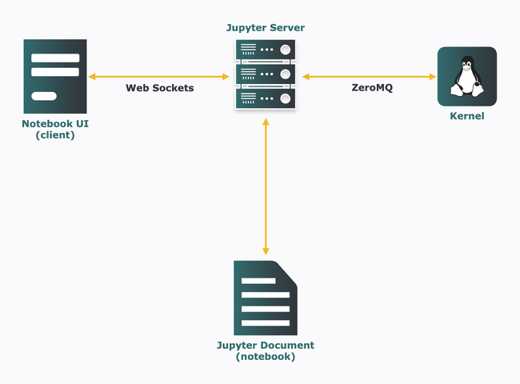](Jupyter-Architecture.png)

Jupyter has two notebook variations, Jupyter notebook and JupyterLab. With the former being the classic, and the latter being the next-generation environment for notebooks, code, and data. Both use the same Jupyter server and file format, making it flexible to switch between both interfaces. However, JupyterLab is destined to replace the classic Jupyter notebooks, as it expands the traditional notebook's scope of functionality.

As we advance, JupyterLab and Jupyter notebooks are both referred to simply as "notebooks". These notebooks provide interactive environments for data science, machine learning, scientific computing, and computational journalism workflows. They capture thought processes and serve as a platform to explore, share, and confer about computations.

Sharing these notebooks is paramount to confer on the computational outputs from notebooks, letting both technical and non-technical stakeholders scrutinize experiments, processes, and results. Notebooks are shared easily. Simply include the notebook `.ipynb` file as an attachment to stakeholders with access to Jupyter, or in exportable formats like PDF and HTML. It can also be shared online via GitHub, Jupyter NBViewer, Binder, or via a multi-user Jupyter server like JupyterHub. Packaging notebooks can be more comprehensive with container technologies like Docker. Here, the notebook, notebook server, libraries, respective versions, data, and stripped-down Linux OS, are all packaged into a single Docker object. Sharing this containerized unit eliminates issues such as version and OS incompatibilities, and makes data science projects and experiments more reproducible. Docker packages all the dependencies required to run the notebook.

## Jupyter and Docker Workflows

This section comprehensively covers the various workflows of containerizing the Jupyter application and environment with Docker.

### Using Base Image

To work with notebooks, we need to install Jupyter, which can be done using two popular python distributions: [CPython](https://www.python.org/about/) and [Anaconda](https://www.anaconda.com/). CPython, the reference implementation of Python, can install Jupyter using `pip`, its default package installer and manager. Anaconda was developed by Anaconda, Inc. (formerly Continuum Analytics) for mathematics, statistics, engineering, data analysis, machine learning, and related applications. However, it can install Jupyter using `conda`, its default package installer and manager. Attributable to Anaconda's use case, it comes with some data science-related packages pre-installed.

Working with Docker, it's not necessary to set up Jupyter locally. Instead, Jupyter (JupyterLab) is set up in Docker. First, get a fully working Anaconda image from the verified publisher, [continuumio](https://hub.docker.com/u/continuumio), on DockerHub.

1. Start Docker Desktop and wait for it to fully initialize.

1.  Open a terminal window and search for available images of "continuumio" using the following command:

    ```command{title="Local Machine Terminal"}
    docker search continuumio
    ```

    ```output
    NAME                                      DESCRIPTION                                     STARS     OFFICIAL   AUTOMATED
    continuumio/miniconda3                    Powerful and flexible package manager           378                  [OK]
    continuumio/anaconda3                     Powerful and flexible python distribution       672                  [OK]
    continuumio/miniconda                     Powerful and flexible package manager           83                   [OK]
    continuumio/anaconda                      Powerful and flexible python distribution       220                  [OK]
    continuumio/anaconda2                                                                     4
    continuumio/miniconda2                                                                    0
    continuumio/conda-ci-linux-64-python3.8                                                   9
    continuumio/conda-ci-linux-64-python3.7                                                   7
    continuumio/conda-ci-linux-64-python2.7                                                   0
    continuumio/conda-concourse-ci            Build and general-purpose image for Continuu…   0
    continuumio/anaconda-pkg-build                                                            2
    continuumio/anaconda-build-linux-64                                                       0
    continuumio/anaconda-build-linux-32                                                       0
    continuumio/centos5_gcc5_base                                                             3
    continuumio/binstar-build-linux64                                                         1                    [OK]
    continuumio/python_benchmarking                                                           0
    continuumio/nginx-ingress-ws                                                              0
    continuumio/conda_builder_linux           A build platform for Linux packages (64-bit …   4
    continuumio/conda-ci-linux-64-python3.9                                                   1
    continuumio/ap-auth-keycloak              Keycloak:3.1.0                                  0
    continuumio/ci-image                                                                      1
    continuumio/concourse-cleanup             TRK-292                                         0
    continuumio/ap-git-storage                gitea:1.3.0                                     0
    continuumio/planet-gpu                    Customized base image for Telekube that enab…   0
    continuumio/adam-node                                                                     0
    ```

1.  Now pull the Anaconda image:

    ```command{title="Local Machine Terminal"}
    docker pull continuumio/anaconda3
    ```

1.  Next, create a container from the image in interactive mode. This opens a bash shell where the `conda` tool and commands can be used.

    ```command{title="Local Machine Terminal"}
    docker run -it --rm -p 8888:8888 continuumio/anaconda3 /bin/bash
    ```

    Containers are isolation units, so a way to connect them with the outside world (i.e. your local machine) is needed. It is required to bind the container port to a port on the host machine using the `-p` or `–publish` tag with the syntax `-p <host-port>:<container-port>`. The `–rm` flag tells Docker to discard the container after the docker run command finishes execution, which saves disk space for short-lived containers.

1.  Access the bash shell to run UNIX and `conda` commands, but first, verify if `conda` was installed by issuing the following command in the bash shell:

    ```command{title="Local Machine Conda Shell"}
    conda info
    ```

1.  View the list of packages and versions installed in this container using the following command:

    ```command{title="Local Machine Conda Shell"}
    conda list
    ```

1.  **Optional:** Update all the packages in the conda environment using the command:

    ```command{title="Local Machine Conda Shell"}
    conda update --all
    ```

    The installed packages list contains `jupyterlab` and some popular data science libraries like `pandas`, `numpy` and `matplotlib` already installed. The Jupyter server is accessible and runs at `localhost:8888` or `127.0.0.1:8888`.

1.  With `jupyterlab` fully installed, start the Jupyter server as follows:

    ```command{title="Local Machine Conda Shell"}
    jupyter-lab --ip="*" --no-browser --allow-root
    ```

    Here, `--ip=”*”` serves as a wildcard/placeholder, as the local machine listens to port `8888` on all IP addresses. `--no-browser` starts and runs the server without opening a web browser. `--allow-root`allows running Jupyter as the root user.

    
    Access to the Jupyter servers implies access to running code. This makes it essential to restrict access to the Jupyter server. Jupyter, by default, has a token-based authentication to aid this restriction. Another option provided by Jupyter is to change this token-based authentication to password-based authentication. This guide uses the default setting when token authentication is enabled.
    


    ```output
    [I 2023-02-09 15:02:32.610 ServerApp] jupyterlab | extension was successfully linked.
    [I 2023-02-09 15:02:32.617 ServerApp] nbclassic | extension was successfully linked.
    [I 2023-02-09 15:02:32.618 ServerApp] Writing Jupyter server cookie secret to /root/.local/share/jupyter/runtime/jupyter_cookie_secret
    [I 2023-02-09 15:02:32.623 ServerApp] notebook_shim | extension was successfully linked.
    [I 2023-02-09 15:02:32.623 ServerApp] panel.io.jupyter_server_extension | extension was successfully linked.
    [W 2023-02-09 15:02:32.665 ServerApp] WARNING: The Jupyter server is listening on all IP addresses and not using encryption. This is not recommended.
    [I 2023-02-09 15:02:32.669 ServerApp] notebook_shim | extension was successfully loaded.
    [I 2023-02-09 15:02:32.670 LabApp] JupyterLab extension loaded from /opt/conda/lib/python3.9/site-packages/jupyterlab
    [I 2023-02-09 15:02:32.671 LabApp] JupyterLab application directory is /opt/conda/share/jupyter/lab
    [I 2023-02-09 15:02:32.675 ServerApp] jupyterlab | extension was successfully loaded.
    [I 2023-02-09 15:02:32.685 ServerApp] nbclassic | extension was successfully loaded.
    [I 2023-02-09 15:02:32.687 ServerApp] panel.io.jupyter_server_extension | extension was successfully loaded.
    [I 2023-02-09 15:02:32.694 ServerApp] Serving notebooks from local directory: /
    [I 2023-02-09 15:02:32.695 ServerApp] Jupyter Server 1.23.4 is running at:
    [I 2023-02-09 15:02:32.696 ServerApp] http://localhost:8888/lab?token=a5ffa16bffb26db82881a7ed8059fdd78ac4831ae627db24
    [I 2023-02-09 15:02:32.697 ServerApp]  or http://127.0.0.1:8888/lab?token=a5ffa16bffb26db82881a7ed8059fdd78ac4831ae627db24
    [I 2023-02-09 15:02:32.698 ServerApp] Use Control-C to stop this server and shut down all kernels (twice to skip confirmation).
    [C 2023-02-09 15:02:32.703 ServerApp]

    To access the server, open this file in a browser:
        file:///root/.local/share/jupyter/runtime/jpserver-1169-open.html
    Or copy and paste one of these URLs:
        http://localhost:8888/lab?token=a5ffa16bffb26db82881a7ed8059fdd78ac4831ae627db24
     or http://127.0.0.1:8888/lab?token=a5ffa16bffb26db82881a7ed8059fdd78ac4831ae627db24
    ```

1.  We can access the JupyterLab UI at `http://127.0.0.1:8888/lab?token=XXXX` as shown above. The token is passed as a URL parameter, and the value is generated when the Jupyter server starts running with the default token authentication enabled. Upon successful launch, the JupyterLab should have an interface like this:

    [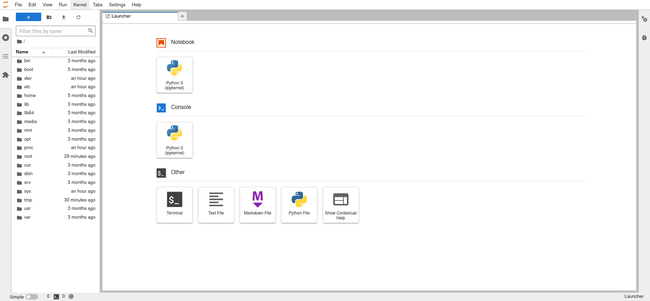](JupyterLab-UI.png)

    
    The notebook UI can be accessed directly at `http://127.0.0.1:8888/lab`. However, this asks for the authentication token (which can be copied from the terminal) to log in as seen below:

    [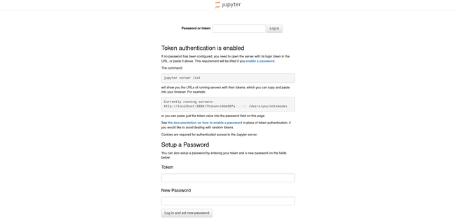](JupyterLab-UI-Authentication-Page.png)
    

    
    While the file structure is created by default, it's good practice to create a notebook folder to contain notebooks and related files.
    

1.  When finished close the browser. In the terminal, press **Ctrl+C** then **Y** and **Enter** to stop the server, then type `exit` and press **Enter** to exit the container shell.

### Using Pre-Existing Images

In the previous section, the Jupyter development environment was built from an Anaconda image with some packages already installed. Reduce the effort to set up and have custom, specific use-case libraries by instead using [Jupyter Docker Stacks](https://github.com/jupyter/docker-stacks).

1.  Jupyter Docker Stacks are a group of ready-to-run Docker images with Jupyter applications and interactive computing environments and tools. Take a look at the various images in this stack:

    ```command{title="Local Machine Terminal"}
    docker search jupyter --no-trunc
    ```

    
    The `--no-trunc` flag prevents truncation of columns to show the full content.
    

    ```output
    NAME                                 DESCRIPTION                                                                                            STARS     OFFICIAL   AUTOMATED
    jupyter/scipy-notebook               Scientific Jupyter Notebook Python Stack from https://github.com/jupyter/docker-stacks                 380
    jupyter/all-spark-notebook           Python, Scala, R and Spark Jupyter Notebook Stack from https://github.com/jupyter/docker-stacks        408
    jupyter/tensorflow-notebook          Scientific Jupyter Notebook Python Stack w/ TensorFlow from https://github.com/jupyter/docker-stacks   327
    jupyter/pyspark-notebook             Python and Spark Jupyter Notebook Stack from https://github.com/jupyter/docker-stacks                  258
    jupyter/datascience-notebook         Data Science Jupyter Notebook Python Stack from https://github.com/jupyter/docker-stacks               973
    jupyterhub/singleuser                single-user docker images for use with JupyterHub and DockerSpawner  see also: jupyter/docker-stacks   46                   [OK]
    jupyter/minimal-notebook             Minimal Jupyter Notebook Python Stack from https://github.com/jupyter/docker-stacks                    168
    jupyter/base-notebook                Base image for Jupyter Notebook stacks from https://github.com/jupyter/docker-stacks                   193
    jupyterhub/jupyterhub                JupyterHub: multi-user Jupyter notebook server                                                         322                  [OK]
    jupyterhub/k8s-network-tools                                                                                                                2
    jupyterhub/k8s-hub                                                                                                                          20
    jupyter/nbviewer                     Jupyter Notebook Viewer                                                                                30                   [OK]
    jupyterhub/configurable-http-proxy   node-http-proxy + REST API                                                                             6                    [OK]
    jupyter/r-notebook                   R Jupyter Notebook Stack from https://github.com/jupyter/docker-stacks                                 48
    jupyterhub/k8s-singleuser-sample                                                                                                            10
    jupyter/repo2docker                  Turn git repositories into Jupyter enabled Docker Images                                               21
    jupyterhub/k8s-image-awaiter                                                                                                                2
    jupyterhub/k8s-secret-sync                                                                                                                  1
    jupyterhub/jupyterhub-onbuild        onbuild version of JupyterHub images                                                                   6
    jupyter/demo                         (DEPRECATED) Demo of the IPython/Jupyter Notebook                                                      16
    bitnami/jupyter-base-notebook                                                                                                               39
    jupyterhub/k8s-image-cleaner                                                                                                                1
    jupyterhub/k8s-binderhub                                                                                                                    3
    jupyterhub/k8s-pre-puller                                                                                                                   1
    bitnami/jupyterhub                                                                                                                          16
    ```

    The search shows three sets of image repositories (repos) related to Jupyter: [Jupyter](https://hub.docker.com/u/jupyter), [JupyterHub](https://hub.docker.com/u/jupyterhub), and [Bitnami](https://hub.docker.com/u/bitnami). Our focus is on the Jupyter notebook images published by Jupyter, which include the following:

    -   [base-notebook](https://hub.docker.com/r/jupyter/base-notebook): the baseline environment
    -   [minimal-notebook](https://hub.docker.com/r/jupyter/minimal-notebook): a minimalistic environment
    -   [scipy-notebook](https://hub.docker.com/r/jupyter/scipy-notebook): an environment for scientific computing
    -   [r-notebook](https://hub.docker.com/r/jupyter/r-notebook): an environment with popular R packages
    -   [tensorflow-notebook](https://hub.docker.com/r/jupyter/tensorflow-notebook): an environment with TensorFlow and other popular deep learning-related packages
    -   [datascience-notebook](https://hub.docker.com/r/jupyter/datascience-notebook): an environment with data analysis packages for Julia, Python, and R
    -   [pyspark-notebook](https://hub.docker.com/r/jupyter/pyspark-notebook): an environment for Python support for Apache Spark
    -   [all-spark-notebook](https://hub.docker.com/r/jupyter/all-spark-notebook): an environment for Python and R support for Apache Spark

    The various images are distinguishable by their respective environment content. A comprehensive explanation of these differences can be found on the [Jupyter Docker Stack documentation](https://jupyter-docker-stacks.readthedocs.io/en/latest/using/selecting.html). The hierarchy (build dependencies) and relationship of these images is shown below:

    [](Jupyter-Docker-Stack-Hierarchy.png)

1.  Next, run a Jupyter Docker Stack notebook container. A local Docker container can be launched from any notebook images through the Docker CLI. Use the following the syntax `docker run -it -p <host-port>:8888 <notebook-image>`. Use the following command to launch a `datascience-notebook` container:

    ```command{title="Local Machine Terminal"}
    docker run -it --rm -p 8888:8888 jupyter/datascience-notebook
    ```

    
    Notice that the `docker pull` command was not used to pull the image from DockerHub before building the container with `docker run`. The `docker run` command first searches for an image locally, and if it doesnʼt find it, it then searches for the image on DockerHub. A good practice is to link your DockerHub account using the `docker login` command. Since we donʼt have the image locally, it is pulled from DockerHub and run in a container as seen below:
    

    ```output
    Unable to find image 'jupyter/datascience-notebook:latest' locally
    latest: Pulling from jupyter/datascience-notebook
    6e3729cf69e0: Pulling fs layer
    2a5593e5ecfc: Pulling fs layer
    20992337f1f4: Pulling fs layer
    4f4fb700ef54: Waiting
    1251f2e2dce2: Waiting
    47ab07aa15a9: Pull complete
    3e9d8e201824: Pull complete
    02a2fc3dea5e: Pull complete
    70dcc59aa209: Pull complete
    8136769236d4: Pull complete
    14c799efb5eb: Pull complete
    090e64dba0d9: Pull complete
    5690d470bf80: Pull complete
    01c98906b370: Pull complete
    a2b861f1f8bd: Pull complete
    30008ac36da9: Pull complete
    b83a4840ce73: Pull complete
    baef5752be62: Pull complete
    7158b286e056: Pull complete
    8cc9f159a8d7: Pull complete
    2da8e9a66547: Pull complete
    5948d29dccd8: Pull complete
    cbb4a7bcbf00: Pull complete
    aed48a9fd8d4: Pull complete
    a5b53536dee1: Pull complete
    42aa8bfd227a: Pull complete
    325e500204b1: Pull complete
    813081653b3a: Pull complete
    Digest: sha256:8f9315f712f1b1d65ee47b37421c4c343edcea538536125898536602ccc6617a
    Status: Downloaded newer image for jupyter/datascience-notebook:latest
    Entered start.sh with args: jupyter lab
    Executing the command: jupyter lab
    [I 2023-02-09 15:27:37.127 ServerApp] Package jupyterlab took 0.0000s to import
    [I 2023-02-09 15:27:37.139 ServerApp] Package jupyter_server_fileid took 0.0089s to import
    [I 2023-02-09 15:27:37.176 ServerApp] Package jupyter_server_terminals took 0.0368s to import
    [I 2023-02-09 15:27:37.325 ServerApp] Package jupyter_server_ydoc took 0.1483s to import
    [I 2023-02-09 15:27:37.327 ServerApp] Package nbclassic took 0.0000s to import
    [W 2023-02-09 15:27:37.332 ServerApp] A `_jupyter_server_extension_points` function was not found in nbclassic. Instead, a `_jupyter_server_extension_paths` function was found and will be used for now. This function name will be deprecated in future releases of Jupyter Server.
    [I 2023-02-09 15:27:37.333 ServerApp] Package notebook_shim took 0.0000s to import
    [W 2023-02-09 15:27:37.333 ServerApp] A `_jupyter_server_extension_points` function was not found in notebook_shim. Instead, a `_jupyter_server_extension_paths` function was found and will be used for now. This function name will be deprecated in future releases of Jupyter Server.
    [I 2023-02-09 15:27:37.341 ServerApp] jupyter_server_fileid | extension was successfully linked.
    [I 2023-02-09 15:27:37.346 ServerApp] jupyter_server_terminals | extension was successfully linked.
    [I 2023-02-09 15:27:37.355 ServerApp] jupyter_server_ydoc | extension was successfully linked.
    [I 2023-02-09 15:27:37.362 ServerApp] jupyterlab | extension was successfully linked.
    [W 2023-02-09 15:27:37.372 NotebookApp] 'ip' has moved from NotebookApp to ServerApp. This config will be passed to ServerApp. Be sure to update your config before our next release.
    [W 2023-02-09 15:27:37.372 NotebookApp] 'ip' has moved from NotebookApp to ServerApp. This config will be passed to ServerApp. Be sure to update your config before our next release.
    [I 2023-02-09 15:27:37.376 ServerApp] nbclassic | extension was successfully linked.
    [I 2023-02-09 15:27:37.378 ServerApp] Writing Jupyter server cookie secret to /home/jovyan/.local/share/jupyter/runtime/jupyter_cookie_secret
    [I 2023-02-09 15:27:38.276 ServerApp] notebook_shim | extension was successfully linked.
    [I 2023-02-09 15:27:38.841 ServerApp] notebook_shim | extension was successfully loaded.
    [I 2023-02-09 15:27:38.854 FileIdExtension] Configured File ID manager: ArbitraryFileIdManager
    [I 2023-02-09 15:27:38.855 FileIdExtension] ArbitraryFileIdManager : Configured root dir: /home/jovyan
    [I 2023-02-09 15:27:38.856 FileIdExtension] ArbitraryFileIdManager : Configured database path: /home/jovyan/.local/share/jupyter/file_id_manager.db
    [I 2023-02-09 15:27:38.859 FileIdExtension] ArbitraryFileIdManager : Successfully connected to database file.
    [I 2023-02-09 15:27:38.859 FileIdExtension] ArbitraryFileIdManager : Creating File ID tables and indices.
    [I 2023-02-09 15:27:39.268 FileIdExtension] Attached event listeners.
    [I 2023-02-09 15:27:39.273 ServerApp] jupyter_server_fileid | extension was successfully loaded.
    [I 2023-02-09 15:27:39.278 ServerApp] jupyter_server_terminals | extension was successfully loaded.
    [I 2023-02-09 15:27:39.280 ServerApp] jupyter_server_ydoc | extension was successfully loaded.
    [I 2023-02-09 15:27:39.281 LabApp] JupyterLab extension loaded from /opt/conda/lib/python3.10/site-packages/jupyterlab
    [I 2023-02-09 15:27:39.282 LabApp] JupyterLab application directory is /opt/conda/share/jupyter/lab
    [I 2023-02-09 15:27:39.290 ServerApp] jupyterlab | extension was successfully loaded.
    [I 2023-02-09 15:27:39.311 ServerApp] nbclassic | extension was successfully loaded.
    [I 2023-02-09 15:27:39.312 ServerApp] Serving notebooks from local directory: /home/jovyan
    [I 2023-02-09 15:27:39.312 ServerApp] Jupyter Server 2.2.1 is running at:
    [I 2023-02-09 15:27:39.312 ServerApp] http://66583d1dc25a:8888/lab?token=e117119467007b1842a41964680153edae451c54195cacab
    [I 2023-02-09 15:27:39.312 ServerApp]     http://127.0.0.1:8888/lab?token=e117119467007b1842a41964680153edae451c54195cacab
    [I 2023-02-09 15:27:39.312 ServerApp] Use Control-C to stop this server and shut down all kernels (twice to skip confirmation).
    [C 2023-02-09 15:27:39.319 ServerApp]

        To access the server, open this file in a browser:
            file:///home/jovyan/.local/share/jupyter/runtime/jpserver-7-open.html
        Or copy and paste one of these URLs:
            http://66583d1dc25a:8888/lab?token=e117119467007b1842a41964680153edae451c54195cacab
            http://127.0.0.1:8888/lab?token=e117119467007b1842a41964680153edae451c54195cacab
    ```

    As you can see, Jupyter Docker Stacks notebook images definitely reduce the time needed to set up the Jupyter environment.

1.  The resulting notebook UI of the `datascience-notebook` can be accessed via `http://127.0.0.1:8888/lab?token=XXXX`, which contains libraries for data science computation in the Julia, Python, and R languages. Jupyter Docker Stacks notebook images also simplify the notebook file system with a working directory of `work`.

    [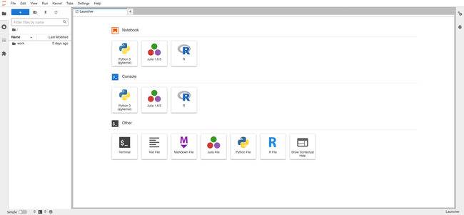](Jupyter-Docker-Stacks-datascience-notebook-UI.png)

1.  When finished, close the browser. In the terminal, press **Ctrl+C** then **Y** and **Enter** to stop the server.

### Building Your Own Image with Dockerfile

This section builds on the previous experience with Jupyter Docker Stacks images to create a custom image using a `Dockerfile`. Docker containers are isolated units, therefore changes and updates within a container stay in the container. For example, in the previous section, packages were updated in the anaconda image via `conda update –all`. If we build another container with the same image, the package versions return to defaults. In this section, learn to build a Docker image based on the Jupyter Docker Stacks image and install desired packages in the Jupyter environment.

A python geospatial data analysis project is used to explain this process. This project environment requires Python libraries like `geopandas` and `gdal` for spatial data analysis.

1.  Create and enter a project directory to work in from this point forward:

    ```command{title="Local Machine Terminal"}
    mkdir Jupyter
    cd Jupyter
    ```

1.  Create a file named `Dockerfile` without any file extension:

    ```command{title="Local Machine Terminal"}
    nano Dockerfile
    ```

    The `Dockerfile` is a text document that contains human-readable instructions to build a docker image.

1.  Fill the Dockerfile with the following content:

    ```file {title="Dockerfile" lang="docker"}
    # Let's use the Jupyter Docker Stack minimal notebook as our base image and build our custom image on top of it
    FROM jupyter/minimal-notebook

    # Install required geospatial python libraries
    RUN conda install geopandas
    RUN conda install -c conda-forge gdal

    # informs Docker that this container should listen to network port 8888 at runtime
    EXPOSE 8888
    ```

1.  Press **CTRL+X**, followed by **Y** and **Enter** to save the `Dockerfile` and exit `nano`.

    Before building a docker image using the Dockerfile, here's an explanation of the instructions contained within:

    -   `FROM jupyter/minimal-notebook`: Docker allows image inheritance, and this instruction inherits the Jupyter Docker Stacks minimal-notebook property and functionality. It comes with some preinstalled packages as well as a Jupyter server and environment.
    -   `RUN`: The run instructions help install the dependencies required to run the containers successfully. Here, it installs the `geopandas` and `gdal` libraries.
    -   `EXPOSE`: The expose command is for documentation purposes. It's best practice to include it in the `Dockerfile` when an application is required to run on a specific port. It helps to build a container of the image and bind the local host to that particular port (e.g. `8888`).
    -   `#`: Docker treats lines in the Dockerfile beginning with `#` as comments.

1.  Proceed to build the Docker image using the tag `custom-jupyter-image` from the Dockerfile with the following command:

    ```command{title="Local Machine Terminal"}
    docker build -t custom-jupyter-image .
    ```

    With the image successfully built, the output should look similar to the following:

    ```output
    [+] Building 222.4s (7/7) FINISHED
     => [internal] load build definition from Dockerfile                       0.3s
     => => transferring dockerfile: 391B                                       0.0s
     => [internal] load .dockerignore                                          0.2s
     => => transferring context: 2B                                            0.0s
     => [internal] load metadata for docker.io/jupyter/minimal-notebook:lates  1.7s
     => [1/3] FROM docker.io/jupyter/minimal-notebook@sha256:3a7895d1deef8fcd  4.1s
     => => resolve docker.io/jupyter/minimal-notebook@sha256:3a7895d1deef8fcd  0.1s
     => => sha256:57a4d94d32c3abbc98979e9a2ab3a1e8cd9b9f9d2 13.73kB / 13.73kB  0.0s
     => => sha256:31212ef015d81892f9223fbe3dcbd9604a5b9265167 4.91kB / 4.91kB  0.0s
     => => sha256:3a7895d1deef8fcd5d806d32a4ec30f6bff8f343870a82e 772B / 772B  0.0s
     => [2/3] RUN conda install geopandas                                    167.8s
     => [3/3] RUN conda install -c conda-forge gdal                           26.9s
     => exporting to image                                                    21.1s
     => => exporting layers                                                   20.9s
     => => writing image sha256:2f593b301e73e4bb3be4aa46f2e0787e4b1d8c3ff36cc  0.0s
     => => naming to docker.io/library/custom-jupyter-image                    0.0s

    Use 'docker scan' to run Snyk tests against images to find vulnerabilities and learn how to fix them
    ```

1.  Next, run an instance of the image (container) as follows:

    ```command{title="Local Machine Terminal"}
    docker run -it --rm -p 8888:8888 custom-jupyter-image
    ```

    ```output
    Entered start.sh with args: jupyter lab
    Executing the command: jupyter lab
    [I 2023-02-09 15:57:08.535 ServerApp] Package jupyterlab took 0.0000s to import
    [I 2023-02-09 15:57:08.540 ServerApp] Package jupyter_server_fileid took 0.0044s to import
    [I 2023-02-09 15:57:08.554 ServerApp] Package jupyter_server_terminals took 0.0128s to import
    [I 2023-02-09 15:57:08.621 ServerApp] Package jupyter_server_ydoc took 0.0665s to import
    [I 2023-02-09 15:57:08.621 ServerApp] Package nbclassic took 0.0000s to import
    [W 2023-02-09 15:57:08.627 ServerApp] A `_jupyter_server_extension_points` function was not found in nbclassic. Instead, a `_jupyter_server_extension_paths` function was found and will be used for now. This function name will be deprecated in future releases of Jupyter Server.
    [I 2023-02-09 15:57:08.628 ServerApp] Package notebook_shim took 0.0000s to import
    [W 2023-02-09 15:57:08.628 ServerApp] A `_jupyter_server_extension_points` function was not found in notebook_shim. Instead, a `_jupyter_server_extension_paths` function was found and will be used for now. This function name will be deprecated in future releases of Jupyter Server.
    [I 2023-02-09 15:57:08.635 ServerApp] jupyter_server_fileid | extension was successfully linked.
    [I 2023-02-09 15:57:08.639 ServerApp] jupyter_server_terminals | extension was successfully linked.
    [I 2023-02-09 15:57:08.644 ServerApp] jupyter_server_ydoc | extension was successfully linked.
    [I 2023-02-09 15:57:08.649 ServerApp] jupyterlab | extension was successfully linked.
    [W 2023-02-09 15:57:08.655 NotebookApp] 'ip' has moved from NotebookApp to ServerApp. This config will be passed to ServerApp. Be sure to update your config before our next release.
    [W 2023-02-09 15:57:08.655 NotebookApp] 'ip' has moved from NotebookApp to ServerApp. This config will be passed to ServerApp. Be sure to update your config before our next release.
    [I 2023-02-09 15:57:08.659 ServerApp] nbclassic | extension was successfully linked.
    [I 2023-02-09 15:57:08.660 ServerApp] Writing Jupyter server cookie secret to /home/jovyan/.local/share/jupyter/runtime/jupyter_cookie_secret
    [I 2023-02-09 15:57:09.221 ServerApp] notebook_shim | extension was successfully linked.
    [I 2023-02-09 15:57:09.390 ServerApp] notebook_shim | extension was successfully loaded.
    [I 2023-02-09 15:57:09.390 FileIdExtension] Configured File ID manager: ArbitraryFileIdManager
    [I 2023-02-09 15:57:09.391 FileIdExtension] ArbitraryFileIdManager : Configured root dir: /home/jovyan
    [I 2023-02-09 15:57:09.391 FileIdExtension] ArbitraryFileIdManager : Configured database path: /home/jovyan/.local/share/jupyter/file_id_manager.db
    [I 2023-02-09 15:57:09.394 FileIdExtension] ArbitraryFileIdManager : Successfully connected to database file.
    [I 2023-02-09 15:57:09.394 FileIdExtension] ArbitraryFileIdManager : Creating File ID tables and indices.
    [I 2023-02-09 15:57:09.414 FileIdExtension] Attached event listeners.
    [I 2023-02-09 15:57:09.415 ServerApp] jupyter_server_fileid | extension was successfully loaded.
    [I 2023-02-09 15:57:09.420 ServerApp] jupyter_server_terminals | extension was successfully loaded.
    [I 2023-02-09 15:57:09.422 ServerApp] jupyter_server_ydoc | extension was successfully loaded.
    [I 2023-02-09 15:57:09.424 LabApp] JupyterLab extension loaded from /opt/conda/lib/python3.10/site-packages/jupyterlab
    [I 2023-02-09 15:57:09.424 LabApp] JupyterLab application directory is /opt/conda/share/jupyter/lab
    [I 2023-02-09 15:57:09.429 ServerApp] jupyterlab | extension was successfully loaded.
    [I 2023-02-09 15:57:09.439 ServerApp] nbclassic | extension was successfully loaded.
    [I 2023-02-09 15:57:09.441 ServerApp] Serving notebooks from local directory: /home/jovyan
    [I 2023-02-09 15:57:09.441 ServerApp] Jupyter Server 2.2.1 is running at:
    [I 2023-02-09 15:57:09.441 ServerApp] http://8e7bfd0cb99c:8888/lab?token=1b3b1365c865152c873c4ac04d53aef48bb570b61ae41b5d
    [I 2023-02-09 15:57:09.442 ServerApp]     http://127.0.0.1:8888/lab?token=1b3b1365c865152c873c4ac04d53aef48bb570b61ae41b5d
    [I 2023-02-09 15:57:09.443 ServerApp] Use Control-C to stop this server and shut down all kernels (twice to skip confirmation).
    [C 2023-02-09 15:57:09.448 ServerApp]

        To access the server, open this file in a browser:
            file:///home/jovyan/.local/share/jupyter/runtime/jpserver-7-open.html
        Or copy and paste one of these URLs:
            http://8e7bfd0cb99c:8888/lab?token=1b3b1365c865152c873c4ac04d53aef48bb570b61ae41b5d
            http://127.0.0.1:8888/lab?token=1b3b1365c865152c873c4ac04d53aef48bb570b61ae41b5d
    ```

1.  The JupyterLab UI can be accessed via `http://127.0.0.1:8888/lab?token=XXXX`, and is shown below:

    [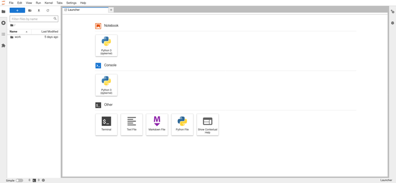](JupyterLab-Dockerfile-UI.png)

1.  Next, verify if the packages are installed in the container environment by default. Open **Terminal** from the JupyterLab UI and check the list of `conda` packages:

    ```command{title="JupyterLab UI Terminal"}
    conda list
    ```

    The `geospatial` packages should be visible as follows:

    [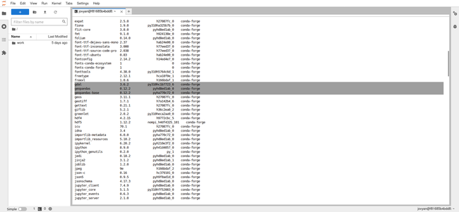](JupyterLab-Dockerfile-Terminal-conda-list-Output.png)

    
    The versions of the `geopandas` and `gdal` libraries shown are from the time of writing, and are subject to change.
    

1.  When finished, close the browser. In the terminal, press **Ctrl+C** then **Y** and **Enter** to stop the server.

### Building Images with Pre-Load Requirements

This section relies on previous knowledge to build images with pre-load requirements. Requirements are files and directories that notebooks depend on to run successfully. Such requirements include configuration files, spreadsheets, images, or even scripts required to run the container.

1.  To take the geospatial project use case to the next level, add the following folder and files:

    ```command{title="Local Machine Terminal"}
    mkdir data
    touch README.md ./data/data.geojson
    ```

1.  Create a `computation.ipynb` file:

    ```command{title="Local Machine Terminal"}
    nano computation.ipynb
    ```

1.  Fill the `computation.ipynb file with the following minimal contents for a blank python notebook:

    ```file {title="computation.ipynb" lang="python"}
    {
     "cells": [
      {
       "cell_type": "code",
       "execution_count": null,
       "id": "9d184cb1-5937-45cf-bc13-4c45007a4e50",
       "metadata": {},
       "outputs": [],
       "source": []
      }
     ],
     "metadata": {
      "kernelspec": {
       "display_name": "Python 3 (ipykernel)",
       "language": "python",
       "name": "python3"
      },
      "language_info": {
       "codemirror_mode": {
        "name": "ipython",
        "version": 3
       },
       "file_extension": ".py",
       "mimetype": "text/x-python",
       "name": "python",
       "nbconvert_exporter": "python",
       "pygments_lexer": "ipython3",
       "version": "3.10.9"
      }
     },
     "nbformat": 4,
     "nbformat_minor": 5
    }
    ```

1.  Press **CTRL+X**, followed by **Y** and **Enter** to save the `computation.ipynb` file and exit `nano`.

    This should create a directory structure of:

    ```
    .
    ├── Dockerfile
    ├── README.md
    ├── computation.ipynb
    └── data
     └── data.geojson
    ```

1.  To create an image that includes these required files, the contents of the `Dockerfile` needs to be modified:

    ```command{title="Local Machine Terminal"}
    nano Dockerfile
    ```

1.  Change the content of the `Dockerfile` to reflect the following:

    ```file {title="Dockerfile" lang="docker"}
    # Let's use the Jupyter Docker Stack minimal notebook as our base image and build our custom image on top of it
    FROM jupyter/minimal-notebook

    # Install required geospatial python libraries
    RUN conda install geopandas
    RUN conda install -c conda-forge gdal

    # informs Docker that this container should listen to network port 8888 at runtime
    EXPOSE 8888

    # Copy files from the local directory to the image file system
    WORKDIR /work

    # Copy the current directory contents into /work
    COPY . /work
    ```

1.  Press **CTRL+X**, followed by **Y** and **Enter** to save the `Dockerfile` and exit `nano`.

    Here's an overview of the instructions. Since this builds upon the Dockerfile in the previous section, only new instructions are explained below:

    -   `WORKDIR /work`: The `WORKDIR` instruction sets the default working (root) directory in the image file system, where `Dockerfile` instructions are executed. This uses the `work` directory seen in the previous sections.
    -   `COPY . /app`: This copies files or directories from the local directory where the Dockerfile is located to the image's file system (working directory). Here, the `data` directory and its content (`data.geojson`) are copied along with the `computation.ipynb` notebook, `README.md` Markdown file, and the `Dockerfile` itself.

1.  Before building a Docker image using the `Dockerfile`, add it to a `dockerignore` file so that it doesn't appear in the built container:

    ```command{title="Local Machine Terminal"}
    echo .env > Dockerfile
    ```

1.  Proceed to build the docker image from the Dockerfile using the tag `custom-jupyter-image:preload` with the following command:

    ```command {title="Local Machine Terminal"}
    docker build -t custom-jupyter-image:preload .
    ```

    With the image successfully built, the output should look similar to the following:

    ```output
    [+] Building 1.0s (10/10) FINISHED
     => [internal] load build definition from Dockerfile                       0.0s
     => => transferring dockerfile: 532B                                       0.0s
     => [internal] load .dockerignore                                          0.0s
     => => transferring context: 2B                                            0.0s
     => [internal] load metadata for docker.io/jupyter/minimal-notebook:lates  0.5s
     => [1/5] FROM docker.io/jupyter/minimal-notebook@sha256:3a7895d1deef8fcd  0.0s
     => [internal] load build context                                          0.1s
     => => transferring context: 1.29kB                                        0.0s
     => CACHED [2/5] RUN conda install geopandas                               0.0s
     => CACHED [3/5] RUN conda install -c conda-forge gdal                     0.0s
     => [4/5] WORKDIR /work                                                    0.1s
     => [5/5] COPY . /work                                                     0.0s
     => exporting to image                                                     0.2s
     => => exporting layers                                                    0.1s
     => => writing image sha256:59fddef00eb9ad080d68bfeb87670d0a10c5a38419c81  0.0s
     => => naming to docker.io/library/custom-jupyter-image:preload            0.0s

    Use 'docker scan' to run Snyk tests against images to find vulnerabilities and learn how to fix them
    ```

1.  Next, run an instance of the container as follows:

    ```command{title="Local Machine Terminal"}
    docker run -it --rm -p 8888:8888 custom-jupyter-image:preload
    ```

    ```output
    Entered start.sh with args: jupyter lab
    Executing the command: jupyter lab
    [I 2023-02-09 16:12:50.178 ServerApp] Package jupyterlab took 0.0000s to import
    [I 2023-02-09 16:12:50.181 ServerApp] Package jupyter_server_fileid took 0.0022s to import
    [I 2023-02-09 16:12:50.187 ServerApp] Package jupyter_server_terminals took 0.0048s to import
    [I 2023-02-09 16:12:50.215 ServerApp] Package jupyter_server_ydoc took 0.0270s to import
    [I 2023-02-09 16:12:50.216 ServerApp] Package nbclassic took 0.0000s to import
    [W 2023-02-09 16:12:50.219 ServerApp] A `_jupyter_server_extension_points` function was not found in nbclassic. Instead, a `_jupyter_server_extension_paths` function was found and will be used for now. This function name will be deprecated in future releases of Jupyter Server.
    [I 2023-02-09 16:12:50.219 ServerApp] Package notebook_shim took 0.0000s to import
    [W 2023-02-09 16:12:50.219 ServerApp] A `_jupyter_server_extension_points` function was not found in notebook_shim. Instead, a `_jupyter_server_extension_paths` function was found and will be used for now. This function name will be deprecated in future releases of Jupyter Server.
    [I 2023-02-09 16:12:50.226 ServerApp] jupyter_server_fileid | extension was successfully linked.
    [I 2023-02-09 16:12:50.231 ServerApp] jupyter_server_terminals | extension was successfully linked.
    [I 2023-02-09 16:12:50.236 ServerApp] jupyter_server_ydoc | extension was successfully linked.
    [I 2023-02-09 16:12:50.241 ServerApp] jupyterlab | extension was successfully linked.
    [W 2023-02-09 16:12:50.244 NotebookApp] 'ip' has moved from NotebookApp to ServerApp. This config will be passed to ServerApp. Be sure to update your config before our next release.
    [W 2023-02-09 16:12:50.244 NotebookApp] 'ip' has moved from NotebookApp to ServerApp. This config will be passed to ServerApp. Be sure to update your config before our next release.
    [I 2023-02-09 16:12:50.247 ServerApp] nbclassic | extension was successfully linked.
    [I 2023-02-09 16:12:50.248 ServerApp] Writing Jupyter server cookie secret to /home/jovyan/.local/share/jupyter/runtime/jupyter_cookie_secret
    [I 2023-02-09 16:12:50.469 ServerApp] notebook_shim | extension was successfully linked.
    [I 2023-02-09 16:12:50.651 ServerApp] notebook_shim | extension was successfully loaded.
    [I 2023-02-09 16:12:50.652 FileIdExtension] Configured File ID manager: ArbitraryFileIdManager
    [I 2023-02-09 16:12:50.652 FileIdExtension] ArbitraryFileIdManager : Configured root dir: /work
    [I 2023-02-09 16:12:50.652 FileIdExtension] ArbitraryFileIdManager : Configured database path: /home/jovyan/.local/share/jupyter/file_id_manager.db
    [I 2023-02-09 16:12:50.652 FileIdExtension] ArbitraryFileIdManager : Successfully connected to database file.
    [I 2023-02-09 16:12:50.653 FileIdExtension] ArbitraryFileIdManager : Creating File ID tables and indices.
    [I 2023-02-09 16:12:50.694 FileIdExtension] Attached event listeners.
    [I 2023-02-09 16:12:50.696 ServerApp] jupyter_server_fileid | extension was successfully loaded.
    [I 2023-02-09 16:12:50.697 ServerApp] jupyter_server_terminals | extension was successfully loaded.
    [I 2023-02-09 16:12:50.698 ServerApp] jupyter_server_ydoc | extension was successfully loaded.
    [I 2023-02-09 16:12:50.699 LabApp] JupyterLab extension loaded from /opt/conda/lib/python3.10/site-packages/jupyterlab
    [I 2023-02-09 16:12:50.699 LabApp] JupyterLab application directory is /opt/conda/share/jupyter/lab
    [I 2023-02-09 16:12:50.704 ServerApp] jupyterlab | extension was successfully loaded.
    [I 2023-02-09 16:12:50.708 ServerApp] nbclassic | extension was successfully loaded.
    [I 2023-02-09 16:12:50.709 ServerApp] Serving notebooks from local directory: /work
    [I 2023-02-09 16:12:50.709 ServerApp] Jupyter Server 2.2.1 is running at:
    [I 2023-02-09 16:12:50.709 ServerApp] http://bcc73442cb9a:8888/lab?token=e08a05e66eba87a73806e5f4b4e53cde156ba7b9f1205ce7
    [I 2023-02-09 16:12:50.709 ServerApp]     http://127.0.0.1:8888/lab?token=e08a05e66eba87a73806e5f4b4e53cde156ba7b9f1205ce7
    [I 2023-02-09 16:12:50.709 ServerApp] Use Control-C to stop this server and shut down all kernels (twice to skip confirmation).
    [C 2023-02-09 16:12:50.714 ServerApp]

        To access the server, open this file in a browser:
            file:///home/jovyan/.local/share/jupyter/runtime/jpserver-7-open.html
        Or copy and paste one of these URLs:
            http://bcc73442cb9a:8888/lab?token=e08a05e66eba87a73806e5f4b4e53cde156ba7b9f1205ce7
            http://127.0.0.1:8888/lab?token=e08a05e66eba87a73806e5f4b4e53cde156ba7b9f1205ce7
    ```

1.  The JupyterLab UI can be accessed via `http://127.0.0.1:8888/lab?token=XXXX`. It should have the requirements pre-loaded in the container as shown below:

    [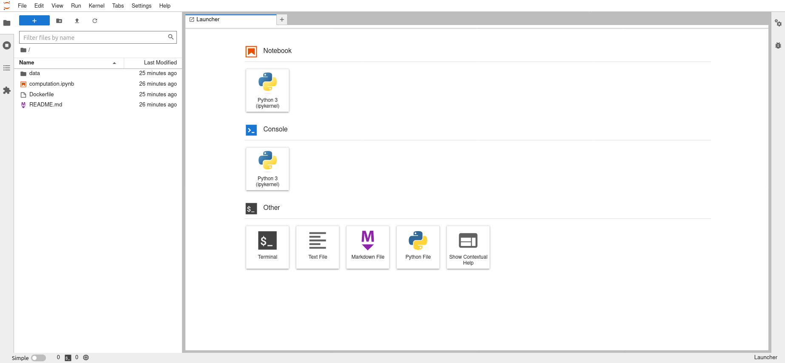](Jupyter-Dockerfile-Preload.png)

1.  When finished, close the browser. In the terminal, press **Ctrl+C** then **Y** and **Enter** to stop the server.

## Managing Data in Images and Containers

The previous sections covered how to pre-load data alongside images and containers. This section teaches how to manage data in images and containers. Before delving into it, here's an overview of the different data types with Docker objects. There are three types of data associated with Docker objects, namely:

-   **Application Data** consists of the source code and environment (dependencies). Here, it is the Jupyter notebook and its environment. The developer building the image provides this data, and it is added to the Docker objects at the build phase. This data is immutable, meaning it cannot be changed once the image is built, as Docker images are read-only.

-   **Temporary Data** is fetched or produced in a running container. It is stored in the container's writable layer, rather than in the image or host machine. This data is dynamic, as it changes from container to container, but is cleared when the respective containers are shut down. The data doesn't persist when the container is non-existent, hence the data can not get out of the container. An excellent example of this data is user inputs in Jupyter notebooks.

-   **Permanent Data** is also fetched or produced in a running container, but must persist such that the data isn't lost if a container is stopped or deleted. Permanent data is required to get data out of containers and store it in the host machine, either as files or in a database. Examples of such types of data are computation outputs or user information.

The next section focuses on permanent data, as both application and temporary data were covered in the previous section. There are two ways containers store data on the host machine (meaning date persists even after the container stops): **volumes** and **bind mounts**. Data in containers persisted with either of these methods look the same. The only difference between these options is where the persisted data lives on the Docker host.

To better understand these methods, expand on the example geospatial use case with an `outputs` folder to persist data (computation outputs):

```command{title="Local Machine Terminal"}
mkdir outputs
```

The new file directory structure of the project should be as follows:

```
.
├── Dockerfile
├── README.md
├── computation.ipynb
├── data
│ └── data.geojson
└── outputs
```

### Anonymous Volumes

Volumes allow persisting data outside of the container in a Docker-managed file system in the host machine. When using volumes, Docker sets up a directory in the host machine, with the location concealed. This helps prevent non-Docker processes from modifying this directory. Containers can read and write into volumes.


Persistence is the continuance of an effect after removing the cause. Data persistence means that data survives after the creation process has ended or been otherwise removed.


There are two types of volumes, Anonymous and Named (explained later).

Anonymous volumes are explicitly created for a single container, and only exist as long as the container exists or is running. Therefore, removing the container also removes the volume. This attachment to a container means that containers created with mounted anonymous volumes yield unique attached volumes, which is evident in its automatically generated name. This type of volume can survive shutdown and restart. However, it is removed if the container is run with the remove flag (`--rm`), which connotes removing the container when it is stopped. This property makes anonymous volumes inadequate to share data across containers, nor can they be used to persist data across container destruction and recreation. Anonymous volumes are created in the `Dockerfile` using the `VOLUME` instruction followed by the container path containing the data required to be persisted.

1.  Edit the `Dockerfile`:

    ```command{title="Local Machine Terminal"}
    nano Dockerfile
    ```

1.  Follow the syntax `VOLUME ["path"]` to mount this anonymous volume as follows:

    ```file {title="Dockerfile" lang="docker"}
    # Let's use the Jupyter Docker Stack minimal notebook as our base image and build our custom image on top of it
    FROM jupyter/minimal-notebook

    # Install required geospatial python libraries
    RUN conda install geopandas
    RUN conda install -c conda-forge gdal

    # informs Docker that this container should listen to network port 8888 at runtime
    EXPOSE 8888

    # Copy files from the local directory to the image file system
    WORKDIR /work

    # Copy the current directory contents into /work
    COPY . /work

    # Mount anonymous volume
    VOLUME ["/project/outputs"]
    ```

    
    Docker volumes look similar to the `COPY` instruction in the `Dockerfile`. However, the `COPY` instruction creates a one-time snapshot of the host machine file system (where the `Dockerfile` is located). It then adds it to the image during the build phase.
    

1.  Press **CTRL+X**, followed by **y** and **Enter** to save the `Dockerfile` and exit `nano`.

1.  Next, build the docker image with a mounted anonymous volume using the tag `custom-jupyter-image:anon-volume` from the Dockerfile as follows:

    ```command{title="Local Machine Terminal"}
    docker build -t custom-jupyter-image:anon-volume .
    ```

    ```output
    [+] Building 0.8s (10/10) FINISHED
     => [internal] load build definition from Dockerfile                       0.0s
     => => transferring dockerfile: 586B                                       0.0s
     => [internal] load .dockerignore                                          0.0s
     => => transferring context: 2B                                            0.0s
     => [internal] load metadata for docker.io/jupyter/minimal-notebook:lates  0.4s
     => [1/5] FROM docker.io/jupyter/minimal-notebook@sha256:3a7895d1deef8fcd  0.0s
     => [internal] load build context                                          0.0s
     => => transferring context: 734B                                          0.0s
     => CACHED [2/5] RUN conda install geopandas                               0.0s
     => CACHED [3/5] RUN conda install -c conda-forge gdal                     0.0s
     => CACHED [4/5] WORKDIR /work                                             0.0s
     => [5/5] COPY . /work                                                     0.1s
     => exporting to image                                                     0.1s
     => => exporting layers                                                    0.0s
     => => writing image sha256:baa6decdcfbb68ca746e9d88f4ab3f4282dd5b62d8277  0.0s
     => => naming to docker.io/library/custom-jupyter-image:anon-volume        0.0s

    Use 'docker scan' to run Snyk tests against images to find vulnerabilities and learn how to fix them
    ```

    
    Docker objects are layer-based, where every instruction in the `Dockerfile` is a layer. By default, Docker caches the layer of previously built images and reuses them to speed up build time. This caching works on the `RUN`, `COPY`, and `ADD` commands.
    

1.  Next, run an instance of the image (container) while naming it `custom-jupyter-container` as follows:

    ```command{title="Local Machine Terminal"}
    docker run -it --rm -p 8888:8888 --name custom-jupyter-container custom-jupyter-image:anon-volume
    ```

    ```output
    Entered start.sh with args: jupyter lab
    Executing the command: jupyter lab
    [I 2023-02-09 16:21:16.789 ServerApp] Package jupyterlab took 0.0000s to import
    [I 2023-02-09 16:21:16.794 ServerApp] Package jupyter_server_fileid took 0.0035s to import
    [I 2023-02-09 16:21:16.803 ServerApp] Package jupyter_server_terminals took 0.0080s to import
    [I 2023-02-09 16:21:16.841 ServerApp] Package jupyter_server_ydoc took 0.0374s to import
    [I 2023-02-09 16:21:16.843 ServerApp] Package nbclassic took 0.0000s to import
    [W 2023-02-09 16:21:16.846 ServerApp] A `_jupyter_server_extension_points` function was not found in nbclassic. Instead, a `_jupyter_server_extension_paths` function was found and will be used for now. This function name will be deprecated in future releases of Jupyter Server.
    [I 2023-02-09 16:21:16.847 ServerApp] Package notebook_shim took 0.0000s to import
    [W 2023-02-09 16:21:16.847 ServerApp] A `_jupyter_server_extension_points` function was not found in notebook_shim. Instead, a `_jupyter_server_extension_paths` function was found and will be used for now. This function name will be deprecated in future releases of Jupyter Server.
    [I 2023-02-09 16:21:16.852 ServerApp] jupyter_server_fileid | extension was successfully linked.
    [I 2023-02-09 16:21:16.858 ServerApp] jupyter_server_terminals | extension was successfully linked.
    [I 2023-02-09 16:21:16.863 ServerApp] jupyter_server_ydoc | extension was successfully linked.
    [I 2023-02-09 16:21:16.869 ServerApp] jupyterlab | extension was successfully linked.
    [W 2023-02-09 16:21:16.874 NotebookApp] 'ip' has moved from NotebookApp to ServerApp. This config will be passed to ServerApp. Be sure to update your config before our next release.
    [W 2023-02-09 16:21:16.874 NotebookApp] 'ip' has moved from NotebookApp to ServerApp. This config will be passed to ServerApp. Be sure to update your config before our next release.
    [I 2023-02-09 16:21:16.877 ServerApp] nbclassic | extension was successfully linked.
    [I 2023-02-09 16:21:16.879 ServerApp] Writing Jupyter server cookie secret to /home/jovyan/.local/share/jupyter/runtime/jupyter_cookie_secret
    [I 2023-02-09 16:21:17.108 ServerApp] notebook_shim | extension was successfully linked.
    [I 2023-02-09 16:21:17.269 ServerApp] notebook_shim | extension was successfully loaded.
    [I 2023-02-09 16:21:17.269 FileIdExtension] Configured File ID manager: ArbitraryFileIdManager
    [I 2023-02-09 16:21:17.269 FileIdExtension] ArbitraryFileIdManager : Configured root dir: /work
    [I 2023-02-09 16:21:17.269 FileIdExtension] ArbitraryFileIdManager : Configured database path: /home/jovyan/.local/share/jupyter/file_id_manager.db
    [I 2023-02-09 16:21:17.270 FileIdExtension] ArbitraryFileIdManager : Successfully connected to database file.
    [I 2023-02-09 16:21:17.270 FileIdExtension] ArbitraryFileIdManager : Creating File ID tables and indices.
    [I 2023-02-09 16:21:17.300 FileIdExtension] Attached event listeners.
    [I 2023-02-09 16:21:17.313 ServerApp] jupyter_server_fileid | extension was successfully loaded.
    [I 2023-02-09 16:21:17.318 ServerApp] jupyter_server_terminals | extension was successfully loaded.
    [I 2023-02-09 16:21:17.324 ServerApp] jupyter_server_ydoc | extension was successfully loaded.
    [I 2023-02-09 16:21:17.329 LabApp] JupyterLab extension loaded from /opt/conda/lib/python3.10/site-packages/jupyterlab
    [I 2023-02-09 16:21:17.329 LabApp] JupyterLab application directory is /opt/conda/share/jupyter/lab
    [I 2023-02-09 16:21:17.334 ServerApp] jupyterlab | extension was successfully loaded.
    [I 2023-02-09 16:21:17.338 ServerApp] nbclassic | extension was successfully loaded.
    [I 2023-02-09 16:21:17.339 ServerApp] Serving notebooks from local directory: /work
    [I 2023-02-09 16:21:17.339 ServerApp] Jupyter Server 2.2.1 is running at:
    [I 2023-02-09 16:21:17.340 ServerApp] http://12ccca89f372:8888/lab?token=463795aac836360180f0ee1b445eac335a7cb426283426cd
    [I 2023-02-09 16:21:17.340 ServerApp]     http://127.0.0.1:8888/lab?token=463795aac836360180f0ee1b445eac335a7cb426283426cd
    [I 2023-02-09 16:21:17.341 ServerApp] Use Control-C to stop this server and shut down all kernels (twice to skip confirmation).
    [C 2023-02-09 16:21:17.348 ServerApp]

        To access the server, open this file in a browser:
            file:///home/jovyan/.local/share/jupyter/runtime/jpserver-7-open.html
        Or copy and paste one of these URLs:
            http://12ccca89f372:8888/lab?token=463795aac836360180f0ee1b445eac335a7cb426283426cd
            http://127.0.0.1:8888/lab?token=463795aac836360180f0ee1b445eac335a7cb426283426cd
    ```

1.  Open a new terminal and view the list of volumes via:

    ```command{title="Local Machine Terminal #2"}
    docker volume ls
    ```

    ```output
    DRIVER    VOLUME NAME
    local     f8af09353ab6f969792bc4f7a64e28e4cf4fa752f9c2a8140cb7fb17f5ed0a84
    ```

    The volume's name is cryptic, as it is automatically generated and unique to each instance. Removing the container automatically removes the anonymous volume, which is a consequence of starting/running a container with the `--rm` flag.

1.  When finished, type **exit** and press **Enter** to close the second terminal. In the original terminal, press **Ctrl+C** then **Y** and **Enter** to stop the server.

#### Using the Volume Flag

Anonymous volumes can also be created using the `--volume` or `-v` flag when creating the container. Following the syntax `docker run -v /dir/in/container/ image-name`. Recall that Docker manages the location of the volume on the host machine, so there is no need to specify it.

```command{title="Local Machine Terminal"}
docker run -d -v /project/outputs -it -p 8888:8888 --name custom-jupyter-container custom-jupyter-image:anon-volume
```

An anonymous volume is now mounted to a container using the `-v` flag.

#### Using the Detached Flag

The container is also running in detached mode using the `--detach` or `-d` flag, which runs the Jupyter application in the background. With detached mode, containers can be started and you can still use the same terminal after the startup command executes. However, `http://127.0.0.1:8888/lab?token=XXXX` is not shown, which is required to load the Jupyter UI. The output instead shows the container ID:

```output
3cea43b5229e60cb79b13a712d8be7d55a8ec312ce0dc09d88af027e68e329d1
```


The names of all running containers can be also be viewed using the following command:

```command {title="Local Machine Terminal"}
docker ps
```

This brings up a list of Docker containers and their corresponding IDs:

```output
DRIVER    VOLUME NAME
local     3cea43b5229e60cb79b13a712d8be7d55a8ec312ce0dc09d88af027e68e329d1
```


1.  Now check the container's logs using the following command syntax:

    ```command{title="Local Machine Terminal"}
    docker logs <Container-ID>
    ```

    If successful, the terminal output includes the `http://127.0.0.1:8888/lab?token=XXXX` link.

1.  Open the link in a browser.

#### Writing Data

Now write data to the container's `outputs` folder, which persists data to the anonymous volume. Here, the geospatial datasets used for explanation purposes are the [Motorized Foot Scooter Trips 2020](https://hub.arcgis.com/search?collection=Dataset&q=Motorized%20Foot%20Scooter%20Trips) data from [ArcGIS Hub](https://hub.arcgis.com/).

1.  In the JupyterLab UI, open the `computation.ipynb` notebook and enter the following:

    ```command
    import pandas as pd

    # data url in ArcGIS Hub
    data_url = "https://opendata.arcgis.com/api/v3/datasets/f3277b5838814277afa3275671e632e5_0/downloads/data?format=csv&spatialRefId=4326&where=1%3D1"
    dataframe = pd.read_csv(data_url, index_col=0)
    dataframe.to_csv("outputs/Motorized-Foot-Scooter-Trips-2020.csv", index=False)
    ```

1.  Press the play button to run the code. You should get the following error message:

    ```output
    PermissionError: [Errno 13] Permission denied: 'outputs/Motorized-Foot-Scooter-Trips-2020.csv'
    ```

    Don't panic, an explanation and fix for this error are covered in the following sections.

#### Understanding File Permission

Docker uses features of the Linux kernel to build and manage containers. Everything is considered a file in Linux, including directories. These files have permissions that enable or restrict operations, such as viewing (reading), modifying (writing), and executing these files. Access and restrictions are associated with respective users. For example, the superuser, also known as `root`, can access any file on the system. Ownership of files in Linux falls into three categories: `user`, `group`, and `other`. The `user` is the person who created the file. The `group` is an association of users with the same permissions. The `other` is any other person with access to that file, who neither created the file nor is in any group that has access to it.

Docker, by default, runs containers as root, which is a consequence of the Docker daemon running as root on the host machine. The Docker daemon gives containers root privileges that could pose a security threat when applications are breached. Hackers could run root-privileged operations or even break out of the container and into to your local machine. It's best practice to run Docker containers and processes as non-root users to prevent privilege escalation attacks.

1.  See these permissions in action by opening the JupyterLab UI terminal and entering the following command:

    ```command{title="JupyterLab UI Terminal"}
    ls -l
    ```

    ```output
    total 16
    -rw-r--r-- 1 root root  617 Jan 20 15:33 computation.ipynb
    drwxr-xr-x 2 root root 4096 Jan 20 15:27 data
    -rw-r--r-- 1 root root  547 Jan 20 15:36 Dockerfile
    drwxr-xr-x 2 root root 4096 Jan 20 15:36 outputs
    -rw-r--r-- 1 root root    0 Jan 20 15:27 README.md
    ```

    Here's an explanation of the items listed above:

    -   `total 16`: This is the total disk space occupied by the files measured in [file system blocks](https://en.wikipedia.org/wiki/Block_(data_storage))
    -   `d`: denotes that the file is a directory
    -   `r`: denotes reading (viewing) permission
    -   `w`: denotes writing (modifying/editting) permission
    -   `x`: denotes executing permission
    -   `-`: denotes no permission

    The three types of user access restrictions are shown following the syntax `-user-group-others`.

1.  Now inspect the user in the container:

    ```command{title="JupyterLab UI Terminal"}
    whoami
    ```

    This yields `jovyan` as a non-root user, as the Jupyter Docker Stacks images are configured to run containers as non-root:

    ```output
    joyvan
    ```

    The parent image `jupyter/minimal-notebook` from which we are building runs as a non-root user to prevent containers from accidentally running as root. This can be seen from its Dockerfile [here](https://github.com/jupyter/docker-stacks/blob/master/minimal-notebook/Dockerfile). So, a non-root user was trying to access root-owned files, hence the file permission issue in the previous section. It's worth noting that the non-root user has permission to write, read, and execute. However, since the files belong to the root user, no other user aside from root can modify them. There are two ways to fix this. First, run the container as the root user to access root-owned files (not recommended). Second, change the file ownership to the non-root user. This guide employs latter method to fix the Permission Denied issue which arose when copying files into Docker images.

1.  When finished, close the browser.

#### Stopping and Removing Containers

Until now, this article used the `--rm` flag for automatic container removal on shut down. What's more, containers running without the `-v` flag could be stopped using a simple key combination. Containers launched in detached mode without the `--rm` flag must be stopped and removed manually.

1.  Stop the container using the following command syntax:

    ```command{title="Local Machine Terminal"}
    docker stop <Container-ID/Container-Name>
    ```

1.  Now remove the container using a similar command syntax:

    ```command{title="Local Machine Terminal"}
    docker rm <Container-ID/Container-Name>
    ```


To prevent errors due to multiple containers exposed on the same ports, stop and remove Jupyter containers after each non-`--rm` workflow execution.


#### Removing Volumes

Removing this container does not remove the respective anonymous volume, leading to unused anonymous volumes. These remnant anonymous volumes are unnecessary, as new containers create a new anonymous volumes.

1.  To clear these unused volumes, first determine their names with the following command:

    ```command{title="Local Machine Terminal"}
    docker volume ls
    ```

1.  Now, remove the desired volume using the following command syntax:

    ```command{title="Local Machine Terminal"}
    docker volume rm <Volume-Name>
    ```

#### Fixing File Permissions

1.  In order to fix the file permission, edit the `Dockerfile`:

    ```command{title="Local Machine Terminal"}
    nano Dockerfile
    ```

1.  Change the `Dockerfile` content to reflect the following:

    ```file {title="Dockerfile" lang="docker"}
    # Let's use the Jupyter Docker Stack minimal notebook as our base image and build our custom image on top of it
    FROM jupyter/minimal-notebook

    # Install required geospatial python libraries
    RUN conda install geopandas
    RUN conda install -c conda-forge gdal

    # informs Docker that this container should listen to network port 8888 at runtime
    EXPOSE 8888

    # Copy files from the local directory to the image file system
    WORKDIR /work

    # Copy the current directory contents into /work
    COPY --chown=$NB_UID:$NB_GID . /work

    # Mount anonymous volume
    VOLUME ["/project/outputs"]
    ```

    Here's a breakdown of the new instruction in the Dockerfile that changes ownership from root to the non-root user `jovyan`:

    -   `COPY --chown=$NB_UID:$NB_GID . /work`: Linux identifies a user by its user identifierc(UID) and a group by its group identifier (GID). These identifiers are used to determine system access to resources. Here, files from the local directory are copied to the image file system, but using the `--chown` flag to change ownership. Following the syntax `--chown=<user>:<group>` changes ownership of the files and directories to the `jovyan` user. The numeric user ID and group ID of the `jovyan` user matches the `NB_UID` and `NB_GID` of the `NB_USER`, as the `NB_USER` value is `jovyan` by default.

1.  Press **CTRL+X**, followed by **Y** and **Enter** to save the `Dockerfile` and exit `nano`.

1.  Re-build the image to capture the change of ownership of files within the container:

    ```command{title="Local Machine Terminal"}
    docker build -t custom-jupyter-image:anon-volume .
    ```

1.  Now run the container:

    ```command{title="Local Machine Terminal"}
    docker run -d -v /project/outputs -it -p 8888:8888 --name custom-jupyter-container custom-jupyter-image:anon-volume
    ```

    The container ID should appear in the output:

    ```output
    5e301acf781cedc4f291964a2ec1aecf713d84689da657bbef42fc2b17bc9e25
    ```

1.  Locate the JupyterLab UI URL using the following command syntax:

    ```command{title="Local Machine Terminal"}
    docker logs <Container-ID>
    ```

1.  Open the JupyterLab UI in a Web browser using the displayed `127.0.0.1:8888/lab?token=XXXX` link.

1.  Open the JupyterLab UI Terminal and enter:

    ```command{title="JupyterLab UI Terminal"}
    ls -l
    ```

    The output should now show `joyvan` as the `user` and `users` as the `group`:

    ```output
    total 12
    -rw-rw-r-- 1 jovyan users    0 Jan 18 15:11 computation.ipynb
    drwxrwxr-x 2 jovyan users 4096 Jan 18 15:11 data
    -rw-rw-r-- 1 jovyan users  571 Jan 18 15:12 Dockerfile
    drwxrwxr-x 2 jovyan users 4096 Jan 18 15:11 outputs
    -rw-rw-r-- 1 jovyan users    0 Jan 18 15:11 README.md
    ```

1.  While in the JupyterLab UI Terminal, check the IDs of the user and group:

    ```command{title="JupyterLab UI Terminal"}
    id
    ```

    The output should be as follows:

    ```output
    uid=1000(jovyan) gid=100(users) groups=100(users)
    ```

    It shows the `jovyan` user's `uid` and `gid` as `1000` and `100`, respectively. It also successfully fixed the permission issues, and you can now write to the container's `outputs` folder.

    
    The copy instruction can also be applied to `uid` and `gid` as follows `COPY --chown=1000:100`.
    

1.  Open the `computation.ipynb` notebook and test the anonymous volume by again attempting to download the geospatial data and write it to the `outputs` folder:

    ```command{title="JupyterLab UI computation.ipynb Notebook"}
    import pandas as pd

    # data url in ArcGIS Hub
    data_url = "https://opendata.arcgis.com/api/v3/datasets/f3277b5838814277afa3275671e632e5_0/downloads/data?format=csv&spatialRefId=4326&where=1%3D1"
    dataframe = pd.read_csv(data_url, index_col=0)
    dataframe.to_csv("outputs/Motorized-Foot-Scooter-Trips-2020.csv", index=False)
    ```

    The code should run with no errors and the `Motorized-Foot-Scooter-Trips-2020.csv` file should now be in the `outputs` folder, yielding a file structure of:

    ```
    .
    ├── Dockerfile
    ├── README.md
    ├── computation.ipynb
    ├── data
    │ └── data.geojson
    └── outputs
      └── Motorized-Foot-Scooter-Trips-2020.csv
    ```

1.  Stop the container using the following command syntax:

    ```command{title="Local Machine Terminal"}
    docker stop <Container-ID>
    ```

1.  Now restart the container using this command syntax:

    ```command{title="Local Machine Terminal"}
    docker start <Container-ID>
    ```

    You can see that the data (`Motorized-Foot-Scooter-Trips-2020.csv`) persisted, and the file structure remains the same in the container. However, this volume only exists as long as the container exists, as anonymous volumes are container-specific. Anonymous volumes are best suited for temporary files in containers. Outsourcing to host machine storage yields better container performance and efficiency. It can also be used to avoid specific files being overwritten by other mounted external storage. However, this could be improved for persisting data across containers to the host machine via named volumes.

1.  When done, close the browser, stop the container again, and remove it using the following command syntax:

    ```command{title=Local Machine Terminal"}
    docker rm <Container-ID>
    ```

1.  Locate the anonymous volume name:

    ```command{title=Local Machine Terminal"}
    docker volume ls
    ```

1.  Remove the anonymous volume using the following command syntax:

    ```command{title=Local Machine Terminal"}
    docker volume rm <Volume-Name>
    ```

### Named Volumes

Docker manages the location of both named and anonymous volumes on the host machine. However, named volumes are referenced by name when mounting to a container's directory. This volume type is unassigned to a specific container, and good for general purposes. Named volumes survive container shutdown, restarts, and removal. This makes them sharable to multiple containers using the volume name as the reference. Named volumes can also be reused for the same container across restarts. Named volumes can not be created in the `Dockerfile`, but when running a container using the `-v` flag. The syntax for creating named volumes is `docker run -v name:/dir/in/container/ image-name`.

1.  Edit the `Dockerfile`:

    ```command{title="Local Machine Terminal"}
    nano Dockerfile
    ```

1.  Mount a named volume to the container by removing the `VOLUME` instruction from the `Dockerfile` like so:

    ```file{title="Dockerfile" lang="docker"}
    # Let's use the Jupyter Docker Stack minimal notebook as our base image and build our custom image on top of it
    FROM jupyter/minimal-notebook

    # Install required geospatial python libraries
    RUN conda install geopandas
    RUN conda install -c conda-forge gdal

    # informs Docker that this container should listen to network port 8888 at runtime
    EXPOSE 8888

    # Copy files from the local directory to the image file system
    WORKDIR /work

    # Copy the current directory contents into /work
    COPY --chown=$NB_UID:$NB_GID . /work
    ```

1.  Press **CTRL+X**, followed by **Y** and **Enter** to save the `Dockerfile` and exit `nano`.

1.  Rebuild the image as follows:

    ```command{title="Local Machine Terminal"}
    docker build -t custom-jupyter-image:named-volume .
    ```

1.  Create an empty named volume:

    ```command{title="Local Machine Terminal"}
    docker volume create named-data-volume
    ```

    
    If you donʼt explicitly create a volume, a volume is created the first time it is mounted into a container.
    

1.  Run the custom Jupyter container using the named volume:

    ```command{title="Local Machine Terminal"}
    docker run -d -v named-data-volume:/project/outputs -it -p 8888:8888 --name custom-jupyter-container custom-jupyter-image:named-volume
    ```

    The container ID should appear in the output.

1.  Locate the `127.0.0.1:8888/lab?token=XXXX` address using the following command syntax:

    ```command{title="Local Machine Terminal"}
    docker logs <Container-ID>
    ```

1.  Reopen the JupyterLab UI in a web browser.

1.  Once again, open the `computation.ipynb` notebook and test the anonymous volume by downloading the geospatial data and writing it to the `outputs` folder:

    ```command{title="JupyterLab UI computation.ipynb Notebook"}
    import pandas as pd

    # data url in ArcGIS Hub
    data_url = "https://opendata.arcgis.com/api/v3/datasets/f3277b5838814277afa3275671e632e5_0/downloads/data?format=csv&spatialRefId=4326&where=1%3D1"
    dataframe = pd.read_csv(data_url, index_col=0)
    dataframe.to_csv("outputs/Motorized-Foot-Scooter-Trips-2020.csv", index=False)
    ```

    The Motorized Foot Scooter Trip 2020 data should have downloaded once more. With named volumes, the `outputs` data is persistent. Recall that anonymous volumes only exist as the container exists. When outputs are created from computation in the container, the data doesn't persist when the container is removed or shut down. This particular external data storage mechanism is helpful to persist data outside of containers even when the containers are removed.

    Named volumes survive the container's removal as they are not attached to a container like anonymous volumes. Hence containers can utilize these volumes (with all the files available) using the volume name as a reference. This makes named volumes ideal for data that should persist and which doesn't need to be edited or viewed directly. For example, suppose a new container mounted on the named volume used to store the geospatial data is created. In that case, the data is readily available in the new running container file structure.

    
    Docker volumes may look similar to the `COPY` instruction in the `Dockerfile`. However, the `COPY` instruction creates a one-time snapshot of the host machine file system (where the `Dockerfile` is located). It then adds it to the image during the build phase.
    

1.  When done, close the browser then stop and remove the container using the following command syntax:

    ```command{title="Local Machine Terminal"}
    docker stop <Container-ID>
    ```

    ```command{title="Local Machine Terminal"}
    docker rm <Container-ID>
    ```

### Bind Mounts

Data persisted with bind mounts can be stored anywhere on the host system. Non-Docker processes and containers can modify that directory. Bind mounts have some similarities with volumes, but the developer, rather than Docker, manages them. Bind mounts are general-purpose, as they are not attached to any specific container and survive container shutdown, restart, and removal. Data in a bind mount cannot be removed with any Docker command. The only way to remove data from a bind mount is to delete it from the host machine, since it's stored there.

According to Docker, "Volumes are the preferred way to persist data in Docker containers and services". This is due to ease of management, security, portability, accessibility, and I/O performance on Docker Desktop. It's an excellent solution for data that needs to be persisted and edited by the developer. See the [Docker documentation](https://docs.docker.com/storage/#:~:text=Volumes%20are%20the%20preferred%20way,is%20mounted%20into%20a%20container.) on the best use cases of these external data storages. Bind mounts are not suitable for data that needs to be shared among multiple running containers. It is beneficial for development purposes via direct container interactions as it instantly reflects changes from the host into running containers. For example, sharing source code or artifacts between a development environment on the Docker host and a container.

To understand how this works, put the computational notebook into a bind mount. Make the container use it from that bind mount connection rather than the snapshot from the `COPY` instruction in the Dockerfile. This gives the container access to the latest code in the computation notebook rather than the snapshot from the `COPY` instruction.

Like named volumes, bind mounts can not be done from inside the Dockerfile since it's specific to a container you run. Therefore, it doesn't affect the image, but rather the container. A bind mount must be set up when running the container via the `docker run ...` command.

Bind mounts can be mounted on containers using the `-v` or `--volume` flag. However, Docker recommends using the `--mount` flag as it is more explicit, verbose, and easier to use. The `--mount` flag consists of multiple key-value pairs separated by commas. These keys and values are as follows:

-   **type**: the type of mount which can be `bind`, `volume`, or `tmpfs`
-   **source/src**: the source path of the mount (here, its the host path)
-   **destination/dst/target**: the path where the file or directory is mounted in the container)
-   optional keys such as `readonly` and `bind-propagation`


When using the `--mount` command, avoid whitespaces after the comma of key-values pairs and optional flags.


1.  To make the bind mount connection to the container, run containers with the following key-value pair syntax:

    ```command{title="Local Machine Terminal"}
    docker run -d -v named-data-volume:/project/outputs --mount type=bind,source="$(pwd)"/computation.ipynb,target=/work/computation.ipynb -it -p 8888:8888 --name custom-jupyter-container custom-jupyter-image:named-volume
    ```

    
    Recall that bind mounts access directories on the host machine. So, a prompt to allow Docker access to these folders appears when mounting a bind mount to containers on the host machine.
    

    This successfully creates a bind mount connection between the container and the host machine. You can edit the Jupyter notebook, and the changes should automatically be available in the container.

    These external data storages allow containers to read and write to the destination directory, managed by Docker (Volumes) or by the Developer (Bind Mounts). This bind mount connection allows changes to be made from the host machine to containers, and vice versa. However, the reverse is undesirable, as operations in containers could overwrite files on the host machine. Resolve this issue by adding a restriction to Docker's writing functionality on the host machine.

2.  First, stop the container using the following command syntax:

    ```command{title="Local Machine Terminal"}
    docker stop <Container-ID>
    ```
3.  Remove the container:

    ```command{title="Local Machine Terminal"}
    docker rm <Container-ID>
    ```

4.  Now rerun the container using the `readonly` flag in the `--mount` command as follows:

    ```command{title="Local Machine Terminal"}
    docker run -d -v named-data-volume:/project/outputs --mount type=bind,source="$(pwd)"/computation.ipynb,target=/work/computation.ipynb,readonly -it -p 8888:8888 --name custom-jupyter-container custom-jupyter-image:named-volume
    ```

    This restriction doesn't affect the host machine, just the containers. So, changes can still be made to the Jupyter notebook in the host machine without rebuilding the image to capture these changes.

    At the development phase's conclusion, containers are not run with bind mounts. Since containers in production servers have no connecting source code, which we can update while the container runs, it runs solely on the snapshot version. The `COPY . .` instruction is still included in the `Dockerfile` to have a snapshot of the code and dependencies required to run the containers in production. The `COPY` instruction is necessary to spin up production-ready containers.

5.  When done, stop the container using the following command syntax:

    ```command{title="Local Machine Terminal"}
    docker stop <Container-ID>
    ```

6.  Then remove it using the following command syntax:

    ```command{title="Local Machine Terminal"}
    docker rm <Container-ID>
    ```

## Advanced Data Persistence and Container Communication

In the previous section, data was persisted and stored on the local machine via volumes. In a modern data science environment, this structured data from containers can be stored in a database. Persisting this data in containerized environments to a database can be done in either the host machine or in a container.

This section covers both strategies as they further drive understanding of container communication with the local machine and other containers. To better understand the process of working with notebooks and databases, first set the data to persist locally without using containers. Persist the data to MySQL, a free and open source relational database based on SQL that also offers support for python. MySQL is famous for its speed, reliability, compatibility, scalability, and security.

The local setup is an optional section to build an understanding of how Jupyter interacts with a MySQL database. It helps demonstrate how to persist data from the container to either a database running on the local machine, or a container.

### Before You Begin

The local setup requires some prerequisites to follow:

1.  Install MySQL to your local machine using [this guide](https://www.digitalocean.com/community/tutorials/how-to-install-mysql-on-ubuntu-22-04).

1.  Download and install [MySQL Workbench](https://dev.mysql.com/downloads/workbench/), a graphical management tool that facilitates creating, designing, and building databases.

1.  Add your user's local bin directory (`$HOME/.local/bin`) to your $PATH:

    ```command{title=Local Machine Terminal"}
    echo "export PATH="$HOME/.local/bin:$PATH"" >> ~/.bashrc
    source ~/.bashrc
    ```

1.  In order to install the remaining items, first install `pip`:

    ```command{title="Local Machine Terminal"}
    sudo apt install pip
    ```

1.  Since python requires a MySQL driver to access the MySQL database, install MySQL Connector along with `python-dotenv`, a library to read environment variables, JupyterLab, and `pandas` via `pip`:

    ```command{title="Local Machine Terminal"}
    pip install mysql-connector-python python-dotenv jupyterlab pandas
    ```

### Local Machine

1.  With the prerequisites satisfied, navigate to the example project directory and create a `.env` environment file to store the database credentials alongside `computation.ipynb`:

    ```command{title="Local Machine Terminal"}
    nano .env
    ```

    The `env` file takes key-value pairs, such as `MYSQL_USER=root`.

1.  Add the following content to the `.env` file and be sure to change the example value `my-secret-pw` to your actual MySQL root password:

    ```file{title=".env"}
    MYSQL_USER=root
    MYSQL_PASSWORD=my-secret-pw
    ```

1.  Press **CTRL+X**, followed by **Y** and **Enter** to save the `.env` and exit `nano`.

    The file system structure should now be as follows:

    ```
    .
    ├── .env
    ├── Dockerfile
    ├── README.md
    ├── computation.ipynb
    ├── data
    │ └── data.geojson
    └── outputs
    ```

1.  Launch JupyterLab from the terminal:

    ```command{title="Local Machine Terminal"}
    jupyter-lab
    ```

    A Web browser should automatically open with the JupyterLab UI accessed.

1.  Open the `computation.ipynb` notebook and once again, download the geospatial data and write it to the `output` folder.

    ```command{title="JupyterLab UI computation.ipynb Notebook"}
    import pandas as pd

    # data url in ArcGIS Hub
    data_url = "https://opendata.arcgis.com/api/v3/datasets/f3277b5838814277afa3275671e632e5_0/downloads/data?format=csv&spatialRefId=4326&where=1%3D1"
    dataframe = pd.read_csv(data_url, index_col=0)
    dataframe.to_csv("outputs/Motorized-Foot-Scooter-Trips-2020.csv", index=False)
    ```

    The `Motorized-Foot-Scooter-Trips-2020.csv` file should now be in the `outputs` folder.

1.  Create a database connection (using the cursor object) to the MySQL database using the following environment variables:

    ```command{title="JupyterLab UI computation.ipynb Notebook"}
    # import neccessary libraries
    import mysql.connector
    from mysql.connector import Error
    import os
    from dotenv import load_dotenv
    load_dotenv()

    # Reading enviroment variables
    mysql_user = os.getenv('MYSQL_USER')
    mysql_password = os.getenv('MYSQL_PASSWORD')

    # Creating MYSQL connection
    try:
        mydb_connection = mysql.connector.connect(
        host="localhost",
        user=mysql_user,
        password=mysql_password)
        # Check connection
        if mydb_connection.is_connected():
            print("connection successfully")
            mycursor = mydb_connection.cursor()
            # Create database
            database_name = "scooter_trips"
            mycursor.execute(f"CREATE DATABASE {database_name}")

    except Error:
        print("Error while connecting to MySQL", Error)
    ```

    If the above code executes with no errors, a database was created successfully. View this table on the MySQL workbench:

    [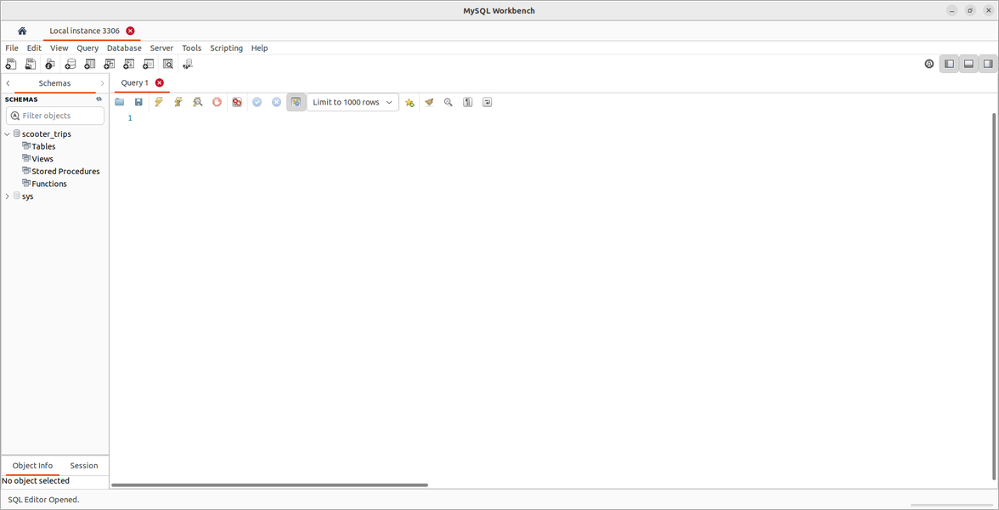](scooter-trips-Database-MySQL-Workbench.png)

    This shows our empty database `scooter_trips` running on local host at port `3306`.

6.  Now create an empty table with the column names of the data being imported to the MySQL table. Write its content into the created empty table as follows:

    ```command{title="JupyterLab UI computation.ipynb Notebook"}
    # data = pd.read_csv('outputs/Motorized-Foot-Scooter-Trips-2020.csv')
    try:
        mydb_connection = mysql.connector.connect(
        host="localhost",
        user=mysql_user,
        password=mysql_password,
        database="scooter_trips") # Added the created database to the connection

        # Check connection
        if mydb_connection.is_connected():
            print("connection successfully")
            mycursor = mydb_connection.cursor()
            mycursor.execute("SELECT database();")
            record = mycursor.fetchone()
            print("You're connected to database: ", record)
            table_name = "Motorized_Foot_Scooter_Trips_2020"
            mycursor.execute("CREATE TABLE Motorized_Foot_Scooter_Trips_2020 (TripID VARCHAR(255), TripDuration VARCHAR(255), TripDistance VARCHAR(255), StartTime VARCHAR(255), EndTime VARCHAR(255), StartCenterlineID VARCHAR(255), StartCenterlineType VARCHAR(255), EndCenterlineID VARCHAR(255), EndCenterlineType VARCHAR(255))")
            print(f"{table_name} table created")

    except Error:
        print("Error while connecting to MySQL", Error)
    ```

    
    When creating the columns, the character strings `VARCHAR(length)` data type was used for all columns, so no data types issue should exist.
    

    If the above code executes with no errors, an empty table `Motorized_Foot_Scooter_Trips_2020` in the `scooter_trips` database was successfully created. View this table in MySQL Workbench:

    [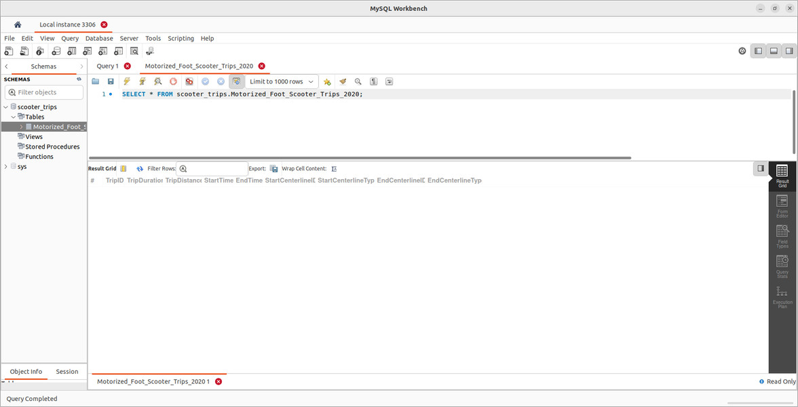](Motorized-Foot-Scooter-Trips-2020-Empty-Table-MySQL-Workbench.png)

8.  Next, write the content of the output data into this empty table as follows:

    ```command{title="JupyterLab UI computation.ipynb Notebook"}
    # Read data from output folder
    data = pd.read_csv('outputs/Motorized-Foot-Scooter-Trips-2020.csv')

    # Check connection
    if mydb_connection.is_connected():
        for index, row in data.iterrows():
            sql = "INSERT INTO scooter_trips.Motorized_Foot_Scooter_Trips_2020 (TripID, TripDuration, TripDistance, StartTime, EndTime, StartCenterlineID, StartCenterlineType, EndCenterlineID, EndCenterlineType) VALUES (%s,%s,%s,%s,%s,%s,%s,%s,%s)"
            mycursor.execute(sql, list(row))
            # the connection is not auto committed by default, so we must commit to save our changes
        mydb_connection.commit()
    ```

    This writes the output data to the respective columns in the MySQL table. It could take up to five minutes for the table to populate with data. Wait for the **Python 3 (ipykernel) |** indicator in the lower left-hand side of the screen to change from **Busy** to **Idle** before proceeding. Then, view this change in the table on the MySQL workbench:

    [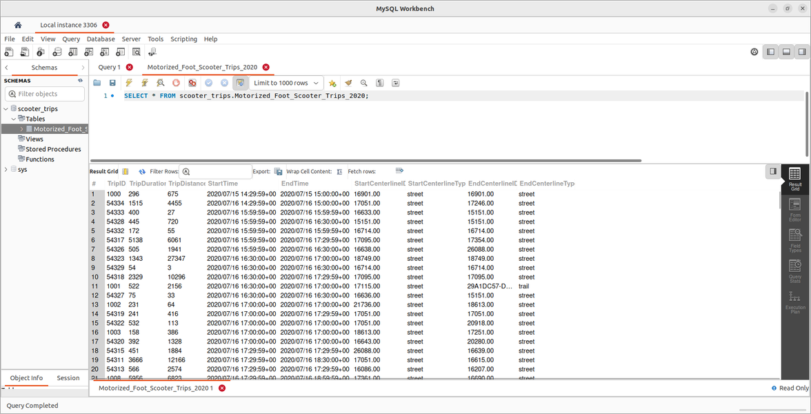](Motorized-Foot-Scooter-Trips-2020-Full-Table-MySQL-Workbench.png)

    Data has been successfully persisted from the local Jupyter instance to the local MySQL database.

9.  When finished, close the browser. In the terminal, press **Ctrl+C** then **Y** and **Enter** to stop the server.

### Container

This logic can be expanded to a containerized notebook environment, persisting data to MySQL in the local machine.

1.  First, edit the `Dockerfile`:

    ```command{title="Local Machine Terminal"}
    nano Dockerfile
    ```

1.  Update the content of the `Dockerfile` with the MySQL driver installed and environment variables set up during build time:

    ```file{title="Dockerfile"}
    # Let's use the Jupyter Docker Stack minimal notebook as our base image and build our custom image on top of it
    FROM jupyter/minimal-notebook

    # Install required geospatial python libraries
    RUN conda install geopandas
    RUN conda install -c conda-forge gdal
    RUN pip install mysql-connector-python

    # informs Docker that this container should listen to network port 8888 at runtime
    EXPOSE 8888

    # Copy files from the local directory to the image file system
    WORKDIR /work

    # Copy the current directory contents into /work
    COPY --chown=$NB_UID:$NB_GID . /work

    # set environment default values
    ARG USER
    ARG PASSWORD
    ENV MYSQL_USER=${USER:-NOT_DEFINED}
    ENV MYSQL_PASSWORD=${PASSWORD:-NOT_DEFINED}
    ```

    The `COPY` instruction in the `Dockerfile` copies everything where the `Dockerfile` is located. This is not ideal for copying the environment file `.env` as it contains sensitive credentials.

1.  Press **CTRL+X**, followed by **Y** and **Enter** to save the `Dockerfile` and exit `nano`.

1.  Add the `.env` file to the `.dockerignore` file to exclude it and instead use Docker's `ARG` and `ENV` commands to send these variables into the Jupyter environment:

    ```command{title="Local Machine Terminal"}
    echo .env >> .dockerignore
    ```

1.  Next, proceed to build the docker image with the following change:

    ```command{title="Local Machine Terminal"}
    docker build --build-arg USER=root --build-arg PASSWORD=my-secret-pw -t custom-jupyter-image:mysql-connected .
    ```

    Change the values of the `PASSWORD` to your MySQL root password before building the Docker image. Here Docker's `ARG` and `ENV` are used to set up the MySQL credentials using the `--build` flag at image build time.

1.  Next, create the custom Jupyter container to persist data to the local machine's MySQL:

    ```command{title="Local Machine Terminal"}
    docker run -d -it -p 8888:8888 --name custom-jupyter-container-mysql custom-jupyter-image:mysql-connected
    ```

    Notice the volumes and bind mounts were removed. The data is now persisting to the MySQL database on the local machine and preparing the environment for production.

1.  Locate the JuypterLab UI URL using the following command syntax:

    ```command{title="Local Machine Terminal"}
    docker logs <Container-ID>
    ```

1.  Use the link to open the JupyterLab UI and the `computation.ipynb` notebook.

1.  Load and use another version of the Motorized Foot Scooter Trips data (`Motorized-Foot-Scooter-Trips-2021`) as follows:

    ```command{title="JupyterLab UI computation.ipynb Notebook"}
    import pandas as pd

    # data url in ArcGIS Hub
    data_url ="https://opendata.arcgis.com/api/v3/datasets/033311f71d5a4b98babaa2280b432a43_0/downloads/data?format=csv&spatialRefId=4326&where=1%3D1"
    data = pd.read_csv(data_url, index_col=0)
    data.to_csv("outputs/Motorized-Foot-Scooter-Trips-2021.csv", index=False)
    ```

1.  Make a connection from the container to the local database:

    ```command{title="JupyterLab UI computation.ipynb Notebook"}
    # import neccessary libraries
    import mysql.connector
    from mysql.connector import Error
    import os

    # Reading enviroment variables
    mysql_user = os.environ['MYSQL_USER']
    mysql_password = os.environ['MYSQL_PASSWORD']

    # Creating MYSQL connection
    try:
        mydb_connection = mysql.connector.connect(
        host="localhost",
        user=mysql_user,
        password=mysql_password)
        # Check connection
        if mydb_connection.is_connected():
            print("connection successfully")

    except Error:
        print("Error while connecting to MySQL", Error)
    ```

    
    Here, the `dotenv` library is not needed. The environment variables set at the image build phase can be accessed via build time arguments using `os.environ[variable]`.
    

    This database connection fails, as Docker can not identify the host address as the localhost. Hence the container can not connect to the local database, which outputs the following error:

    ```output
    Error while connecting to MySQL <class 'mysql.connector.errors.Error'>
    ```

1.  To fix this connection issue, replace `localhost` with a unique domain that Docker can use to connect to the local host, which is `host.docker.internal`. The database connection from the container should look like this:

    ```command{title="JupyterLab UI computation.ipynb Notebook"}
    # import neccessary libraries
    import mysql.connector
    from mysql.connector import Error
    import os

    # Reading enviroment variables
    mysql_user = os.environ['MYSQL_USER']
    mysql_password = os.environ['MYSQL_PASSWORD']

    # Creating MYSQL connection
    try:
        mydb_connection = mysql.connector.connect(
        host="host.docker.internal",
        user=mysql_user,
        password=mysql_password)
        # Check connection
        if mydb_connection.is_connected():
            print("connection successfully")

    except Error:
        print("Error while connecting to MySQL", Error)
    ```

    This unique domain enables a successful connection to the local database. Notably, computations in the container are persisting data as new tables in the existing database (`scooter_trips` in the local machine).

1.  Create an empty table `Motorized_Foot_Scooter_Trips_2021` in the `scooter_trips` database:

    ```command{title="JupyterLab UI computation.ipynb Notebook"}
    try:
        mydb_connection = mysql.connector.connect(
        host="host.docker.internal",
        user=mysql_user,
        password=mysql_password,
        database="scooter_trips") # Added the created database to the connection

        # Check connection
        if mydb_connection.is_connected():
            print("connection successfully")
            mycursor = mydb_connection.cursor()
            mycursor.execute("SELECT database();")
            record = mycursor.fetchone()
            print("You're connected to database: ", record)
            table_name = "Motorized_Foot_Scooter_Trips_2021"
            mycursor.execute("CREATE TABLE Motorized_Foot_Scooter_Trips_2021 (TripID VARCHAR(255), TripDuration VARCHAR(255), TripDistance VARCHAR(255), StartTime VARCHAR(255), EndTime VARCHAR(255), StartCenterlineID VARCHAR(255), StartCenterlineType VARCHAR(255), EndCenterlineID VARCHAR(255), EndCenterlineType VARCHAR(255))")
            print(f"{table_name} table created")

    except Error:
        print("Error while connecting to MySQL", Error)
    ```

    If the above code was executed with no errors, this empty table can be viewed on the MySQL workbench:

    [](Motorized-Foot-Scooter-Trips-2021-Empty-Table-MySQL-Workbench.png)

    The empty table from the container has persisted from the running container to the local MySQL database. Both the table generated from running the notebook locally as well as running the notebook from a container can be seen.

1.  Write the outputs data from the container to the empty table in the local database:

    ```command{title="JupyterLab UI computation.ipynb Notebook"}
    # Read data from output folder
    data = pd.read_csv('outputs/Motorized-Foot-Scooter-Trips-2021.csv')
    data.fillna(0.0, inplace = True)

    # Check connection
    if mydb_connection.is_connected():
        for index, row in data.iterrows():
            sql = "INSERT INTO scooter_trips.Motorized_Foot_Scooter_Trips_2021 (TripID, TripDuration, TripDistance, StartTime, EndTime, StartCenterlineID, StartCenterlineType, EndCenterlineID, EndCenterlineType) VALUES (%s,%s,%s,%s,%s,%s,%s,%s,%s)"
            mycursor.execute(sql, list(row))
            # the connection is not auto committed by default, so we must commit to save our changes
            mydb_connection.commit()
    ```

    This writes data from the output data to the respective columns in the MySQL table. This change in table can be viewed on the MySQL workbench:

    [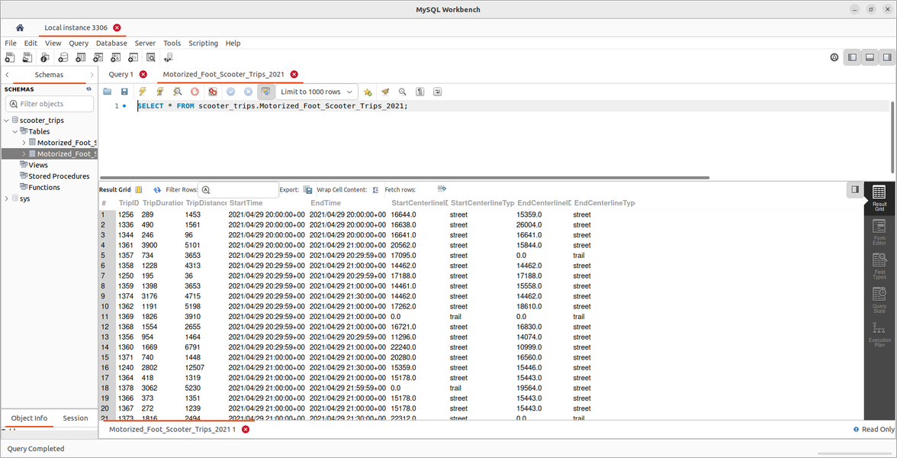](Motorized-Foot-Scooter-Trips-2021-Full-Table-MySQL-Workbench.png)

    
    Missing data instances might cause the writing of data to fail. Check if there are missing data instances across the data and either replace them with a value or remove those instances. The data column dimension must also be the same as the database table to which you are trying to create and persist data.
    

1.  When done, close the browser then stop and remove the container using the following command syntax:

    ```command{title="Local Machine Terminal"}
    docker stop <Container-ID>
    ```

    ```command{title="Local Machine Terminal"}
    docker rm <Container-ID>
    ```

### Multiple Containers

The previous section covered persisting data from the containerized Jupyter environment to the locally installed database. If the container is removed, the data survives on the local database. This communication from the container to the host machine works. However, it is best practice to use containers as one-service-per-container in order to separate areas of concern. In the example jupyter workflow, a single container being responsible for running the application and handling the database operations is no good. Instead, separate the two aspects of the example application into two separate containers. Persisting data to a database running in a container (container-to-container communication) is covered next.

Here two containers are used, one for the Jupyter environment and the other for the MySQL database. Since a containerized MySQL database is used, failure to install and set up MySQL database locally isn't an issue. The MySQL is instead installed and set up in the container using its [Official image](https://hub.docker.com/_/mysql) on DockerHub.

One approach to connecting these two separate and isolated containers involves knowing the IP address of the container with a running MySQL database instance. This IP address is then used to replace the `host.docker.internal` address on the Jupyter environment container.


You can get the IP address of a container by using the container inspection command `docker container inspect <container-name>` and navigating to the `NetworkSettings`.


Moving forward, the Docker network is utilized to make this container-to-container communication required for the example project. The Docker network enables the container to communicate with other containers using their respective names rather than IP addresses. Each container has its own IP address, and as you work with more containers, it's not ideal to manually check IP addresses.

1.  First, create the network for the Jupyter and MySQL containers to belong to:

    ```command{title="Local Machine Terminal"}
    docker network create jupyter-mysql-net
    ```

    This instruction creates a network `jupyter-mysql-net` which can be viewed using `docker network ls`.

2.  Next, create the running container required to be part of the `jupyter-mysql-net` network. For the MySQL container, create it as follows:

    ```command{title="Local Machine Terminal"}
    docker run -d --name mysql-db --network jupyter-mysql-net -e MYSQL_ROOT_PASSWORD=my-secret-pw mysql
    ```

    This instruction creates a new container named `mysql-db` based on the official MySQL image in detached mode, added to the `jupyter-mysql-net network` via the `--network` flag. This container spins up a MySQL database accessible on port `3306` with a required root password.

    
    To have a successful connection, replace the example value `my-secret-pw` with your MySQL root password.
    

3.  Next, re-create the Jupyter container running in this network for communication:

    ```command
    docker run -d -it -p 8888:8888 --name custom-jupyter-container-mysql --network jupyter-mysql-net custom-jupyter-image:mysql-connected
    ```

4.  Check the running containers to show the two running containers:

    ```command{title="Local Machine Terminal"}
    docker ps --no-trunc
    ```

    ```output
    CONTAINER ID                                                       IMAGE                                  COMMAND                          CREATED          STATUS                    PORTS                    NAMES
    dd6885dc43f65c46e7e79be38293d1a58d12c221672cf50ca5d03877f0ccd1a1   custom-jupyter-image:mysql-connected   "tini -g -- start-notebook.sh"   25 seconds ago   Up 22 seconds (healthy)   0.0.0.0:8888->8888/tcp   custom-jupyter-container-mysql
    88c96bc189c063464570c1ab89ef0a80c88dab9626677ce3412f733490582c03   mysql                                  "docker-entrypoint.sh mysqld"    4 minutes ago    Up 4 minutes              3306/tcp, 33060/tcp      mysql-db
    ```

    Now both containers are running in the same network, hence they can now communicate with each other using their respective container name.

5.  Determine the JuypterLab UI URL using the following command:

    ```command{title="Local Machine Terminal"}
    docker logs custom-jupyter-container-mysql
    ```

6.  Launch the JupyterLab UI environment and open the `computation.ipynb` notebook. Load another version of the Motorized Foot Scooter Trips data (`Motorized-Foot-Scooter-Trips-2018`):

    ```command{title="JupyterLab UI computation.ipynb Notebook"}
    import pandas as pd

    # data url in ArcGIS Hub
    data_url ="https://opendata.arcgis.com/api/v3/datasets/aaf4274109f34ffd93ac71267c5b276e_0/downloads/data?format=csv&spatialRefId=4326&where=1%3D1"
    data = pd.read_csv(data_url, index_col=0)
    data.to_csv("outputs/Motorized-Foot-Scooter-Trips-2018.csv", index=False)
    ```

7.  Next, connect to the MySQL database in the `mysql-db` container and create a `scooter_trips` database:

    ```command{title="JupyterLab UI computation.ipynb Notebook"}
    # import neccessary libraries
    import mysql.connector
    from mysql.connector import Error
    import os

    # Reading enviroment variables
    mysql_user = os.getenv('MYSQL_USER')
    mysql_password = os.getenv('MYSQL_PASSWORD')

    # Creating MYSQL connection
    try:
        mydb_connection = mysql.connector.connect(
        host="mysql-db",
        user=mysql_user,
        password=mysql_password)
        # Check connection
        if mydb_connection.is_connected():
            print("connection successfully")
            mycursor = mydb_connection.cursor()
            # Create database
            database_name = "scooter_trips"
            mycursor.execute(f"CREATE DATABASE {database_name}")

    except Error:
        print("Error while connecting to MySQL", Error)
    ```

    This successfully connects to the `mysql-db` container and creates a `scooter_trips` database with the container name as the host value.

8.  Next, create a table in the newly created database. Like in the previous section, create an empty table in the containerized database environment in the `mysql-db` container:

    ```command{title="JupyterLab UI computation.ipynb Notebook"}
    try:
        mydb_connection = mysql.connector.connect(
        host="mysql-db",
        user=mysql_user,
        password=mysql_password,
        database="scooter_trips") # Added the created database to the connection

        # Check connection
        if mydb_connection.is_connected():
            print("connection successfully")
            mycursor = mydb_connection.cursor()
            mycursor.execute("SELECT database();")
            record = mycursor.fetchone()
            print("You're connected to database: ", record)
            table_name = "Motorized_Foot_Scooter_Trips_2018"
            mycursor.execute(f"CREATE TABLE {table_name} (TripID VARCHAR(255), TripDuration VARCHAR(255), TripDistance VARCHAR(255), StartTime VARCHAR(255), EndTime VARCHAR(255), StartCenterlineID VARCHAR(255), EndCenterlineID VARCHAR(255))")
            print(f"{table_name} table created")
            for index, row in data.iterrows():
                sql = f"INSERT INTO scooter_trips.Motorized_Foot_Scooter_Trips_2018 (TripID, TripDuration, TripDistance, StartTime, EndTime, StartCenterlineID, EndCenterlineID) VALUES (%s,%s,%s,%s,%s,%s,%s)"
                mycursor.execute(sql, list(row))
                # the connection is not auto committed by default, so we must commit to save our changes
                mydb_connection.commit()

    except Error:
        print("Error while connecting to MySQL", Error)
    ```

    This successfully connects to the `mysql-db` container and `scooter_trips` database, and creates and writes data to `Motorized_Foot_Scooter_Trips_2018` table. Note that this database setup and content cannot be accessed locally (via the command line or MySQL workbench). This is because the database is running in a Docker container, and no ports were published when running the `mysql-db` container.

    It may take up to 30 minutes to populate the table. Wait for the **Python 3 (ipykernel) |** indicator in the lower left-hand side of the screen to change from **Busy** to **Idle** before proceeding.

9.  The content of this `Motorized_Foot_Scooter_Trips_2018` table in the `mysql-db` can be accessed from the Jupyter container by running a query like this:

    ```command{title="JupyterLab UI computation.ipynb Notebook"}
    try:
        mydb_connection = mysql.connector.connect(
        host="mysql-db",
        user=mysql_user,
        password=mysql_password,
        database="scooter_trips") # Added the created database to the connection

        # Check connection
        if mydb_connection.is_connected():
            print("connection successfully")
            mycursor = mydb_connection.cursor()
            mycursor.execute("SELECT * FROM Motorized_Foot_Scooter_Trips_2018 limit 5")
            myresult = mycursor.fetchall()
            for x in myresult:
                print(x)

    except Error:
        print("Error while connecting to MySQL", Error)
    ```

    The query yields five rows of data, confirming the connection to `mysql-db` is functional and successful.

    ```output
    connection successfully
    ('154744', '256', '1108', '2018/07/10 12:00:00+00', '2018/07/10 12:00:00+00', '16914', '16914')
    ('154745', '185', '519', '2018/07/10 12:00:00+00', '2018/07/10 12:00:00+00', '17104', '17872')
    ('154742', '177', '496', '2018/07/10 12:30:00+00', '2018/07/10 12:30:00+00', '17117', '17865')
    ('154743', '344', '929', '2018/07/10 12:30:00+00', '2018/07/10 12:30:00+00', '16632', '17117')
    ('154741', '176', '588', '2018/07/10 12:59:59+00', '2018/07/10 12:59:59+00', '21654', '17250')
    ```

1.  When finished, close the browser.

#### Persisting the Database to a Named Volume

At the moment, the `mysql-db` container does not persist the database data. One option is to let Docker can manage the storage of database data on the host machine via volumes.


Alternatively, you can manage the database storage manually. Do so by creating a data directory on the host machine and mounting it to the container via bind mounts.

Using its internal volume management system, this tutorial uses the Docker volume method (named volumes) to manage the containerized database data. However, the bind mounts method can help conveniently inspect the containerized database data.


1.  First, stop and remove the current `mysql-db` container using the following command syntax:

    ```command{title="Local Machine Terminal"}
    docker stop mysql-db
    ```

    ```command{title="Local Machine Terminal"}
    docker rm mysql-db
    ```

1.  The database data in MySQL containers built from the official image stores database data in the `var/lib/mysql` directory. A named volume can be mounted to this path in the `mysql-db` container to persist database data as follows:

    ```command{title="Local Machine Terminal"}
    docker run -d --name mysql-db --network jupyter-mysql-net -v mysqldata:/var/lib/mysql -e MYSQL_ROOT_PASSWORD=my-secret-pw mysql
    ```

    This command creates the named volume `mysql-data` and mounts it to the `mysql-db`. The example workflow from the previous section persists containerized database data to a location on the local machine managed by Docker.

1.  When done, close the browser and stop all running containers using the following command syntax:

    ```command{title="Local Machine Terminal"}
    docker stop custom-jupyter-container-mysql
    docker stop mysql-db
    ```

1.  Also remove all stopped containers, all networks not used, images without at least one container associated to them, and build cache:

    ```command{title="Local Machine Terminal"}
    docker system prune -a
    ```

## Simplify Multi-Container Orchestration with Docker Compose

The commands to run these containers with respective configurations are cumbersome. Utilizing the Docker compose tool simplifies defining and sharing multi-containers with their respective configurations.


You should already have Docker Compose installed through Docker Desktop.


The Docker compose file is [YAML](https://yaml.org/), a human-readable file that uses indentation to denote dependency. The file defines services that create containers, networks, and volumes.

Docker compose files do not replace Dockerfiles for custom docker images and containers, they simply make working with them more manageable. Instead, it replaces multiple `docker build` and `docker run` commands with one configuration file containing a set of orchestration commands.

Docker compose also enables containers to be spun up and torn back down with a simple command: `docker compose up` and `docker compose down`.

1.  Start by creating a Docker compose file (`compose.yaml`, `compose.yml`, `docker-compose.yaml` or `docker-compose.yml`) in the project directory on your local machine:

    ```command{title="Local Machine Terminal"}
    nano docker-compose.yml
    ```

1.  Paste the following content into the created `docker-compose.yml` file:

    ```file{title="docker-compose.yml"}
    version: '3'

    services:
      mysql:
        image: 'mysql'
        container_name: 'mysql-db'
        volumes:
          - mysql-data:/var/lib/mysql
        environment:
          MYSQL_ROOT_PASSWORD: my-secret-pw
      jupyter:
        build:
          context: .
          args:
            USER: root
            PASSWORD: my-secret-pw
        # Looks for a Dockerfile in the current directory to build the image
        container_name: 'custom-jupyter-image'
        ports:
          - '8888:8888'
        # Enabling iterative mode
        stdin_open: true
        tty: true
        depends_on:
          - mysql
    volumes:
      # Specify the named volume
      mysql-data:
    ```

    The `services` key refers to a containers' configurations and takes nested values. It contains configuration settings for both the `mysql-db` and `custom-jupyter-image:mysql-connected` containers. The configuration covers setting up environment variables and arguments, publishing ports, mounting volumes, and running in iterative mode.

    Docker compose automatically creates a default network and adds all containers defined in the compose to that network. However, we can manually specify a network.

1.  Since the `docker-compose.yml` file contains sensitive information, add it to the `dockerignore` file:

    ```command{title="Local Machine Terminal"}
    echo docker-compose.yml >> .dockerignore
    ```

1.  In the same directory where the Docker compose file is located, start the services using:

    ```command{title="Local Machine Terminal"}
    docker compose up
    ```

    
    Alternatively, services can also be started in detached mode:

    ```command
    docker compose up -d
    ```
    

    This command pulls and builds all the required images and starts the containers. It also creates a default network and mounts required volumes to containers. Upon successful execution of `docker-compose up`, the required container with the necessary configuration is should be created.

1.  Open a second terminal window (unless you ran `docker compose up` in detached mode) to view the running containers:

    ```command{title="Local Machine Terminal #2"}
    docker ps
    ```

    ```output
    CONTAINER ID   IMAGE             COMMAND                  CREATED          STATUS                    PORTS                    NAMES
    600a1a52233f   jupyter-jupyter   "tini -g -- start-no…"   38 minutes ago   Up 22 seconds (healthy)   0.0.0.0:8888->8888/tcp   custom-jupyter-image
    ee6927299775   mysql             "docker-entrypoint.s…"   38 minutes ago   Up 23 seconds             3306/tcp, 33060/tcp      mysql-db
    ```

1.  Switch to the example project directory, then stop all services and remove all containers:

    ```command{title="Local Machine Terminal #2"}
    cd ~/Jupyter
    docker compose down
    ```

    
    This command doesn't remove volumes created as its strategy to persist data on container removal. However, if that is required, it can be achieved by running the following:

    ```command{title="Local Machine Terminal #2"}
    docker compose down -v
    ```
    

1.  Unless you ran in detached mode, in the second terminal window type `exit` and press the **Enter** key when done.

## Deployment to Linode

You now have a running containerized Jupyter environment persisting data to a separate containerized MySQL database. The next section covers moving this containerized setup to cloud hosting by leveraging Linode Compute instances and the App Marketplace.

Using a Linode compute instance is easy to do without the required knowledge or hassle of using the command line. Linode helps you deploy in seconds, with simple app creation procedures, customization features, and a deployment management service.

The App Marketplace serves as an online store where your application can be accessed, interacted with, and purchased.

First, the image must be copied to the remote server. This can be achieved by building the image on the remote machine, or by using a fully built image. The latter reduces unnecessary complexity. Images deployed on a public repository like DockerHub can easily be pulled to the remote server.

### Before You Begin

1.  [Log in to Docker Hub](https://login.docker.com/u/login), or [sign up](https://hub.docker.com/signup) if you don't already have an account.


DockerHub is a service provided by Docker that serves as a community of repositories for users to create, test, manage, store, and share container images. Account signup is free, and so is the creation of public repositories.


1.  Configure the Docker Desktop CLI using [these instructions](https://docs.docker.com/desktop/get-started/).

### Docker Hub Setup

1.  After creating an account and successfully logging in to Docker Hub, click **Repositories** in the top navigation bar and create a new repository. When done, you should see a UI similar to:

    [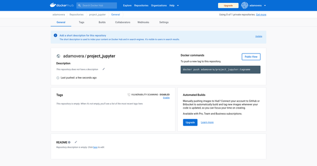](Docker-Hub-Project-Jupyter.png)

1.  Create a connection between Docker Hub and your local machine. Open a terminal and login into Docker Hub:

    ```command{title="Local Machine Terminal"}
    docker login
    ```

    This prompts you to enter your DockerHub username and password.

2.  Now view the images created by the `docker-compose.yml` file:

    ```command{title="Local Machine Terminal"}
    docker images --no-trunc
    ```

    ```output
    REPOSITORY        TAG       IMAGE ID                                                                  CREATED        SIZE
    jupyter-jupyter   latest    sha256:2aaccf87754bc852cac0007d052f19f63c032b329105a5066772c50f30b98e3e   21 hours ago   2.98GB
    mysql             latest    sha256:57da161f45ac3835bc872dcb50f0cde87f65661ba8f50a5a0835dee7e262703f   5 days ago     517MB
    ```

3.  Before pushing the image to the created repository, rename it to the standard `<your-docker-hub-username>/<repository-name>` format as follows:

    ```command{title="Local Machine Terminal"}
    docker tag jupyter-jupyter <your-docker-hub-username>/project_jupyter
    ```

4.  Now push the image to DockerHub:

    ```command{title="Local Machine Terminal"}
    docker push <your-docker-hub-username>/project_jupyter
    ```

    Once complete, your Docker Hub repository should look like this:

    [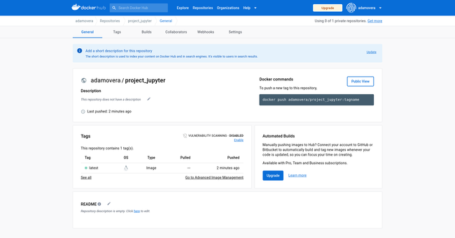](Docker-Hub-Project-Jupyter-Image.png)

5.  To pull this image from Docker Hub, use the `docker pull` command using the syntax `docker pull <your-docker-hub-username>/<repository-name>:tagname` as follows:

    ```command{title="Local Machine Terminal"}
    docker pull <your-docker-hub-username>/project_jupyter
    ```

6.  With the image successfully pulled, test the application using the `docker run` command using the syntax `docker run <your-docker-hub-username>/<repository-name>:tagname` as follows:

    ```command{title="Local Machine Terminal"}
    docker run <your-docker-hub-username>/project_jupyter
    ```

### Linode Setup

To get started with Linode's Marketplace to aid the deployment of the example Jupyter workflow, use the following procedures:

1.  If you have not already done so, [create a Linode account](https://login.linode.com/signup?promo=docs1000822).

2.  Log in to the [Linode Cloud Manager](https://cloud.linode.com/) and select **Marketplace** from the left navigation menu. This selection displays the Linode **Create** page with the **Marketplace** tab preselected.

3.  Under the **Select App** section, select **Docker**.

4.  The **Docker Setup** section contains **Advanced Option**, including limited users, custom domain, resources to download (URL of a hosted Dockerfile or `docker-compose` file), and `docker` command to be run during the application creation process. Ignore these configurations.

5.  In the **Select an Image** section, choose **Debian 11** as the base image.

6.  Use [Linode speed tests](https://www.linode.com/speed-test/) to find the best **Region** for your current location.

7.  Under **Linode Plan** choose one that suits your workload. The Linode 4GB Shared CPU plan works best for this example.

8.  Enter a descriptive **Linode Label** and optionally **Add Tags**.

8.  Provide a **Root Password** required to deploy the Docker image.

9.  Click the **Create Linode** button to create a Linode compute instance, where Docker is installed and ready to use upon completion. The Linode compute instance dashboard should look similar to:

0.  **SSH Keys** are optional here, as this tutorial uses the online LISH (Linode Shell) console.

    [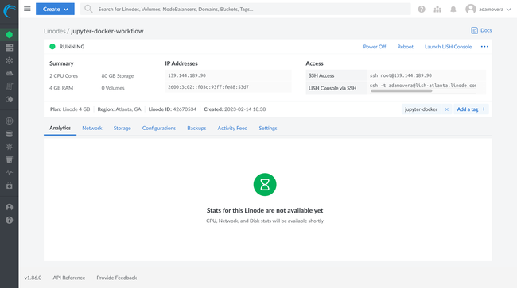](Jupyter-Docker-Workflow-Linode-Dashboard.png)

### Deployment on Linode

1.  With the setup out of the way, click **Launch LISH Console** and access the compute instance (Docker) with the login as `root` and the root password you provided in the setup.

1.  In the LISH (Linode Shell) console, create a network named `jupyter-mysql-net` for the containers:

    ```command{title="LISH Console"}
    docker network create jupyter-mysql-net
    ```

1.  Pull the official MySQL image on DockerHub:

    ```command{title="LISH Console"}
    docker run -d --name mysql-db --network jupyter-mysql-net -e MYSQL_ROOT_PASSWORD=my-secret-pw mysql
    ```

1.  Pull and run the custom Jupyter image you previously deployed to DockerHub:

    ```command{title="LISH Console"}
    docker run -d -it -p 8888:8888 --name custom-jupyter-container --network jupyter-mysql-net <your-docker-hub-username>/project_jupyter
    ```

1.  Upon successful deployment, view the JupyterLab UI using your Linode IP address and Docker port number following the syntax `http://<Linode-IP-address>:8888/lab?token=XXXX`. This URL can be retrieved by logging the Jupyter container:

    ```command{title="LISH Console"}
    docker logs custom-jupyter-container
    ```

    This should provide output similar to the following:

    ```output
    [I 2023-02-14 19:27:27.997 ServerApp] jupyter_server_terminals | extension was successfully loaded.
    [I 2023-02-14 19:27:27.998 ServerApp] jupyter_server_ydoc | extension was successfully loaded.
    [I 2023-02-14 19:27:27.999 LabApp] JupyterLab extension loaded from /opt/conda/lib/python3.10/site-packages/jupyterlab
    [I 2023-02-14 19:27:27.999 LabApp] JupyterLab application directory is /opt/conda/share/jupyter/lab
    [I 2023-02-14 19:27:28.005 ServerApp] jupyterlab | extension was successfully loaded.
    [I 2023-02-14 19:27:28.014 ServerApp] nbclassic | extension was successfully loaded.
    [I 2023-02-14 19:27:28.015 ServerApp] Serving notebooks from local directory: /work
    [I 2023-02-14 19:27:28.015 ServerApp] Jupyter Server 2.2.1 is running at:
    [I 2023-02-14 19:27:28.015 ServerApp] http://5959d9d8b5f3:8888/lab?token=ba162d57a64292a1963086f34b4d824de132fe32dee553b2
    [I 2023-02-14 19:27:28.015 ServerApp]     http://127.0.0.1:8888/lab?token=ba162d57a64292a1963086f34b4d824de132fe32dee553b2
    [I 2023-02-14 19:27:28.015 ServerApp] Use Control-C to stop this server and shut down all kernels (twice to skip confirmation).
    [C 2023-02-14 19:27:28.022 ServerApp]

        To access the server, open this file in a browser:
            file:///home/jovyan/.local/share/jupyter/runtime/jpserver-7-open.html
        Or copy and paste one of these URLs:
            http://5959d9d8b5f3:8888/lab?token=ba162d57a64292a1963086f34b4d824de132fe32dee553b2
            http://127.0.0.1:8888/lab?token=ba162d57a64292a1963086f34b4d824de132fe32dee553b2
    ```

    The address described above launches the Jupyter UI and environment with data persisting in the containerized MySQL database hosted in this Linode compute instance.

    [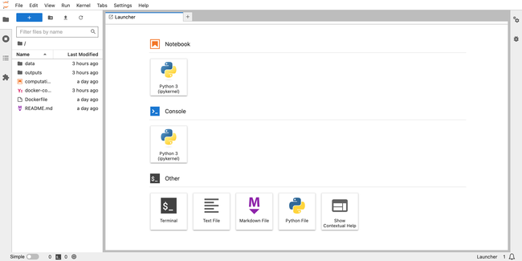](JupyterLab-UI-Linode.png)

1.  Open the `computation.ipynb` notebook and test the containerized database hosted on Linode by persisting data to it as follows:

    ```command{title="computation.ipynb Notebook"}
    import pandas as pd

    # data url in ArcGIS Hub
    data_url ="https://opendata.arcgis.com/api/v3/datasets/aaf4274109f34ffd93ac71267c5b276e_0/downloads/data?format=csv&spatialRefId=4326&where=1%3D1"
    data = pd.read_csv(data_url, index_col=0)
    data.to_csv("outputs/Motorized-Foot-Scooter-Trips-2018.csv", index=False)

    # import neccessary libraries
    import mysql.connector
    from mysql.connector import Error
    import os

    # Reading enviroment variables
    mysql_user = os.getenv('MYSQL_USER')
    mysql_password = os.getenv('MYSQL_PASSWORD')

    # Creating MYSQL connection
    try:
        mydb_connection = mysql.connector.connect(
        host="mysql-db",
        user=mysql_user,
        password=mysql_password)
        # Check connection
        if mydb_connection.is_connected():
            print("connection successfully")
            mycursor = mydb_connection.cursor()
            # Create database
            database_name = "scooter_trips"
            mycursor.execute(f"CREATE DATABASE {database_name}")

    except Error:
        print("Error while connecting to MySQL", Error)
    ```

    This command successfully connects to the containerized database hosted on Linode and creates a database named `scooter_trips` in it.

7.  Next, write the downloaded geospatial data to a table in the `scooter_trips` database:

    ```command{title="computation.ipynb Notebook"}
    try:
        mydb_connection = mysql.connector.connect(
        host="mysql-db",
        user=mysql_user,
        password=mysql_password,
        database="scooter_trips") # Added the created database to the connection

        # Check connection
        if mydb_connection.is_connected():
            print("connection successfully")
            mycursor = mydb_connection.cursor()
            mycursor.execute("SELECT database();")
            record = mycursor.fetchone()
            print("You're connected to database: ", record)
            table_name = "Motorized_Foot_Scooter_Trips_2018"
            mycursor.execute(f"CREATE TABLE {table_name} (TripID VARCHAR(255), TripDuration VARCHAR(255), TripDistance VARCHAR(255), StartTime VARCHAR(255), EndTime VARCHAR(255), StartCenterlineID VARCHAR(255), EndCenterlineID VARCHAR(255))")
            print(f"{table_name} table created")
            for index, row in data.iterrows():
                sql = f"INSERT INTO scooter_trips.{table_name} (TripID, TripDuration, TripDistance, StartTime, EndTime, StartCenterlineID, EndCenterlineID) VALUES (%s,%s,%s,%s,%s,%s,%s)"
                mycursor.execute(sql, list(row))
                # the connection is not auto committed by default, so we must commit to save our changes
                mydb_connection.commit()
    except Error:
        print("Error while connecting to MySQL", Error)
    ```

    This command successfully persists data to the containerized database, where data can be queried from the database.

You can observe application resource utilization, work load, network traffic, and configuration settings on the Linode compute instance dashboard:

[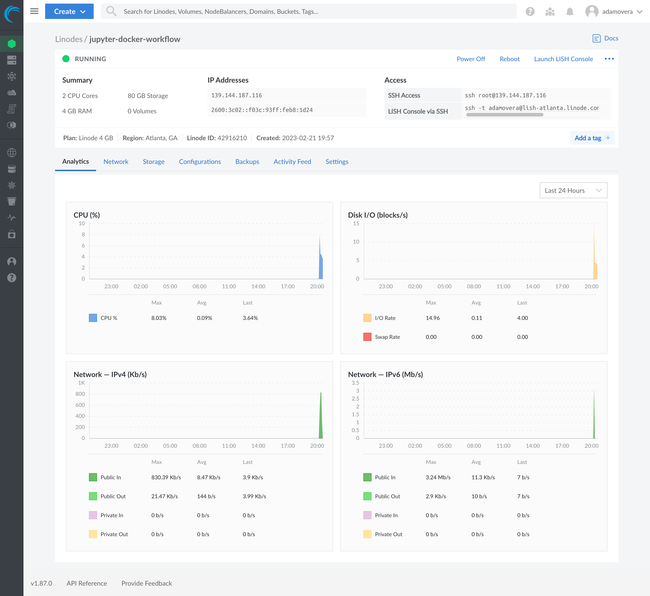](Linode-Dashboard-After-Jupyter-Docker-Workflow.png)

## Conclusion

This tutorial covers the various Jupyter and Docker workflows that may exist. The tutorial also covers persisting data in these images and containers using volumes, bind mounts, and databases. It also guides and resolves file permission issues and simplifies these containers' orchestration via Docker compose. Lastly, it guides in deploying these services via the Linode app marketplace.