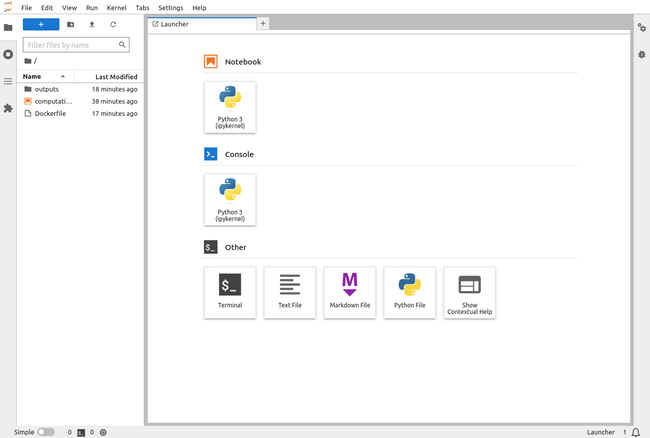
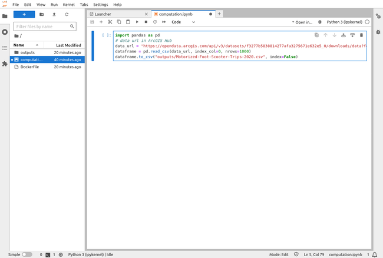

Jupyter notebooks are a versatile tool for developers and data scientists. They seamlessly integrate code, visualizations, and text into a single interactive environment called notebooks. However, as projects expand it can become difficult to manage these notebooks. Containerization with Docker presents a powerful solution, making it easy to share, deploy, and reproduce Jupyter notebooks.

The previous article in our series on Jupyter/Docker workflows covered how to pre-load data alongside images and containers. This article teaches how to manage data *in* images and containers.

## Before You Begin

1.  This guide requires a desktop with at least 4 GB of memory and approximately 10 GB of free space. The commands in this guide are written for Ubuntu 22.04 LTS, but should generally work for other Linux distributions and operating systems.

1.  To follow the steps below you need to install Docker. The easiest way to do accomplish this is via the Docker Desktop package. Download the appropriate package for your operating system and follow the installation guide [here](https://docs.docker.com/engine/install/) to ensure that Docker is installed.

1.  To better understand Jupyter Docker workflows, read the previous article in our Jupyter series, [How to Set Up Jupyter with Docker](/docs/guides/jupyter-docker-setup-guide/), and follow the steps therein. Alternatively, follow the steps below to quickly set up the example project:

    ```command {title="Local Machine Terminal"}
    cd ~
    mkdir jupyter
    cd jupyter
    ```

1.  Create a `computation.ipynb` notebook file:

    ```command {title="Local Machine Terminal"}
    nano computation.ipynb
    ```

1.  Give it the following contents:

    ```file {title="computation.ipynb" lang="python"}
    {
     "cells": [
      {
       "cell_type": "code",
       "execution_count": null,
       "id": "9d184cb1-5937-45cf-bc13-4c45007a4e50",
       "metadata": {},
       "outputs": [],
       "source": []
      }
     ],
     "metadata": {
      "kernelspec": {
       "display_name": "Python 3 (ipykernel)",
       "language": "python",
       "name": "python3"
      },
      "language_info": {
       "codemirror_mode": {
        "name": "ipython",
        "version": 3
       },
       "file_extension": ".py",
       "mimetype": "text/x-python",
       "name": "python",
       "nbconvert_exporter": "python",
       "pygments_lexer": "ipython3",
       "version": "3.9.13"
      }
     },
     "nbformat": 4,
     "nbformat_minor": 5
    }
    ```

1.  When done, press <kbd>CTRL</kbd>+<kbd>X</kbd>, followed by <kbd>Y</kbd> then <kbd>Enter</kbd> to save the file and exit `nano`.

## Data Types

Before delving into the examples, here's an overview of the different Docker object data types. There are three types of data associated with Docker objects:

1.  **Application Data** consists of the source code and environment (dependencies). Here, it is the Jupyter notebook and its environment. The developer building the image provides this data, and it is added to the Docker objects at the build phase. This data is immutable, meaning it cannot be changed once the image is built, as Docker images are read-only.

1.  **Temporary Data** is fetched or produced in a running container. It is stored in the container's writable layer, rather than in the image or host machine. This data is dynamic, as it changes from container to container, but is cleared when the respective containers are shut down. The data doesn't persist when the container is non-existent, hence the data can not get out of the container. An excellent example of this data is user inputs in Jupyter notebooks.

1.  **Permanent Data** is also fetched or produced in a running container, but must persist such that the data isn't lost if a container is stopped or deleted. Permanent data is required to get data out of containers and store it in the host machine, either as files or in a database. Examples of such types of data are computation outputs or user information.

This article focuses on permanent data, as both application and temporary data were covered in the previous article. There are two ways containers store data on the host machine (meaning data persists even after the container stops): **volumes** and **bind mounts**. Data in containers persisted with either of these methods look the same. The only difference between these options is where the persisted data lives on the Docker host.

## Volumes

Volumes allow persisting data outside of the container in a Docker-managed file system on the host machine. When using volumes, Docker sets up a directory in the host machine, with the location concealed. This helps prevent non-Docker processes from modifying this directory. Containers can read and write into volumes.

There are two types of volumes, Anonymous and Named (explained later).

### Anonymous Volumes

Anonymous volumes are explicitly created for a single container, and only exist as long as the container exists or is running. Therefore, removing the container also removes the volume. This attachment to a container means that containers created with mounted anonymous volumes yield unique attached volumes, which is evident in its automatically generated name. This type of volume can survive shutdown and restart. However, it is removed if the container is run with the remove flag (`--rm`), which connotes removing the container when it is stopped. This property makes anonymous volumes inadequate to share data across containers, nor can they be used to persist data across container destruction and recreation. Anonymous volumes are created in the `Dockerfile` using the `VOLUME` instruction followed by the container path containing the data required to be persisted.


Persistence is the continuance of an effect after removing the cause. Data persistence means that data survives after the creation process has ended or been otherwise removed.


1.  Create an `outputs` folder in the `jupyter` directory to persist the sample geospatial data (computation outputs):

    ```command {title="Local Machine Terminal"}
    cd ~/jupyter
    mkdir outputs
    ```

1.  Create a `Dockerfile`:

    ```command {title="Local Machine Terminal"}
    nano Dockerfile
    ```

1.  Following the syntax `VOLUME ["path"]` in the Dockerfile, mount an anonymous volume as follows:

    ```file {title="Dockerfile" lang="docker"}
    # Use the Jupyter Docker Stack minimal notebook as the base image and build a custom image on top of it:
    FROM jupyter/minimal-notebook

    # Install the required geospatial python libraries:
    RUN pip install geopandas
    RUN conda install -c conda-forge gdal

    # Inform Docker that this container should listen to network port 8888 at runtime:
    EXPOSE 8888

    # Copy files from the local directory to the image file system:
    WORKDIR /work

    # Copy the current directory contents into /work:
    COPY . /work

    # Mount an anonymous volume:
    VOLUME ["/project/outputs"]
    ```

    
    Docker volumes look similar to the `COPY` instruction in the `Dockerfile`. However, the `COPY` instruction creates a one-time snapshot of the host machine file system (where the `Dockerfile` is located). It then adds it to the image during the build phase.
    

1.  When done, press <kbd>CTRL</kbd>+<kbd>X</kbd>, followed by <kbd>Y</kbd> then <kbd>Enter</kbd> to save the file and exit `nano`.

1.  Next, build the docker image with a mounted anonymous volume using the tag `custom-jupyter-image:anon-volume` from this Dockerfile as follows:

    ```command {title="Local Machine Terminal"}
    docker build -t custom-jupyter-image:anon-volume .
    ```

    ```output
    Sending build context to Docker daemon  17.92kB
    Step 1/7 : FROM jupyter/minimal-notebook
     ---> f7d963e5fcad
    Step 2/7 : RUN conda install geopandas
     ---> Using cache
     ---> 044994e39533
    Step 3/7 : RUN conda install -c conda-forge gdal
     ---> Using cache
     ---> 531d4bdc4495
    Step 4/7 : EXPOSE 8888
     ---> Using cache
     ---> bf0b59b1ae05
    Step 5/7 : WORKDIR /work
     ---> Using cache
     ---> f35e010a09e3
    Step 6/7 : COPY . /work
     ---> 116f60284eb7
    Step 7/7 : VOLUME ["/project/outputs"]
     ---> Running in 3ff5022b3f12
    Removing intermediate container 3ff5022b3f12
     ---> 7d7387d31253
    Successfully built 7d7387d31253
    Successfully tagged custom-jupyter-image:anon-volume
    ```

    
    Docker objects are layer-based, where every instruction in the `Dockerfile` is a layer. By default, Docker caches the layer of previously built images and reuses them to speed up build time. This caching works on the `RUN`, `COPY`, and `ADD` commands.
    

1.  Next, run an instance of the image (container) while naming it `custom-jupyter-container` as follows:

    ```command {title="Local Machine Terminal"}
    docker run -it --rm -p 8888:8888 --name custom-jupyter-container custom-jupyter-image:anon-volume
    ```

    ```output
    Entered start.sh with args: jupyter lab
    Executing the command: jupyter lab
    [I 2023-01-12 14:03:18.068 ServerApp] jupyter_server_terminals | extension was successfully linked.
    [I 2023-01-12 14:03:18.078 ServerApp] jupyterlab | extension was successfully linked.
    [W 2023-01-12 14:03:18.082 NotebookApp] 'ip' has moved from NotebookApp to ServerApp. This config will be passed to ServerApp. Be sure to update your config before our next release.
    [W 2023-01-12 14:03:18.084 NotebookApp] 'port' has moved from NotebookApp to ServerApp. This config will be passed to ServerApp. Be sure to update your config before our next release.
    [W 2023-01-12 14:03:18.084 NotebookApp] 'port' has moved from NotebookApp to ServerApp. This config will be passed to ServerApp. Be sure to update your config before our next release.
    [I 2023-01-12 14:03:18.089 ServerApp] nbclassic | extension was successfully linked.
    [I 2023-01-12 14:03:18.091 ServerApp] Writing Jupyter server cookie secret to /home/jovyan/.local/share/jupyter/runtime/jupyter_cookie_secret
    [I 2023-01-12 14:03:18.439 ServerApp] notebook_shim | extension was successfully linked.
    [I 2023-01-12 14:03:18.821 ServerApp] notebook_shim | extension was successfully loaded.
    [I 2023-01-12 14:03:18.825 ServerApp] jupyter_server_terminals | extension was successfully loaded.
    [I 2023-01-12 14:03:18.827 LabApp] JupyterLab extension loaded from /opt/conda/lib/python3.10/site-packages/jupyterlab
    [I 2023-01-12 14:03:18.827 LabApp] JupyterLab application directory is /opt/conda/share/jupyter/lab
    [I 2023-01-12 14:03:18.833 ServerApp] jupyterlab | extension was successfully loaded.
    [I 2023-01-12 14:03:18.840 ServerApp] nbclassic | extension was successfully loaded.
    [I 2023-01-12 14:03:18.842 ServerApp] Serving notebooks from local directory: /work
    [I 2023-01-12 14:03:18.843 ServerApp] Jupyter Server 2.0.6 is running at:
    [I 2023-01-12 14:03:18.843 ServerApp] http://c70c6cbb57a4:8888/lab?token=a472e9d7d81cc452dfb5f553d17d5ba2c0017a19e24eabcf
    [I 2023-01-12 14:03:18.844 ServerApp]  or http://127.0.0.1:8888/lab?token=a472e9d7d81cc452dfb5f553d17d5ba2c0017a19e24eabcf
    [I 2023-01-12 14:03:18.844 ServerApp] Use Control-C to stop this server and shut down all kernels (twice to skip confirmation).
    [C 2023-01-12 14:03:18.851 ServerApp]

        To access the server, open this file in a browser:
            file:///home/jovyan/.local/share/jupyter/runtime/jpserver-6-open.html
        Or copy and paste one of these URLs:
            http://c70c6cbb57a4:8888/lab?token=a472e9d7d81cc452dfb5f553d17d5ba2c0017a19e24eabcf
          or http://127.0.0.1:8888/lab?token=a472e9d7d81cc452dfb5f553d17d5ba2c0017a19e24eabcf
    ```

1.  Open a new terminal and view the list of volumes via:

    ```command {title="Local Machine Terminal #2"}
    docker volume ls
    ```

    ```output
    DRIVER    VOLUME NAME
    local     f8af09353ab6f969792bc4f7a64e28e4cf4fa752f9c2a8140cb7fb17f5ed0a84
    ```

    The volume's name is cryptic, as it is automatically generated and unique to each instance. Removing the container automatically removes the anonymous volume, which is a consequence of starting/running a container with the `--rm` flag.

1.  When finished, close the second terminal. Return to the original terminal and press **Ctrl+C** then **Y** and **Enter** to stop the server.

#### Using the Volume Flag

Anonymous volumes can also be created using the `--volume` or `-v` flag when creating the container. Following the syntax `docker run -v /DIRECTORY/IN/CONTAINER/ IMAGE_NAME`. However, Docker manages the location of the volume on the host machine, so there is no need to specify it.

```command {title="Local Machine Terminal"}
docker run -d -v /project/outputs -it -p 8888:8888 --name custom-jupyter-container custom-jupyter-image:anon-volume
```

An anonymous volume is now mounted to a container using the `-v` flag.

#### Using the Detached Flag

The container is also running in detached mode using the `--detach` or `-d` flag, which runs the Jupyter application in the background. With detached mode, containers can be started and you can still use the same terminal after the startup command executes. However, the `http://127.0.0.1:8888/lab?token=XXXX` URL is not shown, which is required to load the Jupyter UI.

1.  To retrieve this URL, first view the running containers:

    ```command {title="Local Machine Terminal"}
    docker ps
    ```

    This brings up a list of Docker containers and their corresponding IDs and names:

    ```output
    DRIVER    VOLUME NAME
    local     c997c3b9795136e1960318194ef37821093f02fd82301fb058d13dbbc65d93d6
    ```

1.  Now check the container's logs using the following command syntax:

    ```command {title="Local Machine Terminal"}
    docker logs CONTAINER_ID_OR_NAME
    ```

    If successful, the terminal output includes the `http://127.0.0.1:8888/lab?token=XXXX` link.

1.  Open the link in a Web browser to access the JupyterLab UI:

    [](JupyterLab-Launcher.png)

#### Writing Data

Now write data to the container's `outputs` folder, which persists data to the anonymous volume. Here, the geospatial datasets used for explanation purposes are the first 1,000 rows of the [Motorized Foot Scooter Trips 2020](https://hub.arcgis.com/search?collection=Dataset&q=Motorized%20Foot%20Scooter%20Trips) data from [ArcGIS Hub](https://hub.arcgis.com/).

1.  In the JupyterLab UI, open the `computation.ipynb` notebook and enter the following:

    ```file {title="computation.ipynb" lang="python"}
    import pandas as pd
    # data url in ArcGIS Hub
    data_url = "https://opendata.arcgis.com/api/v3/datasets/f3277b5838814277afa3275671e632e5_0/downloads/data?format=csv&spatialRefId=4326&where=1%3D1"
    dataframe = pd.read_csv(data_url, index_col=0, nrows=1000)
    dataframe.to_csv("outputs/Motorized-Foot-Scooter-Trips-2020.csv", index=False)
    ```

    [](Computation-Notebook-JupyterLab.png)

1.  Press the play button to run the code. You should get the following error message:

    ```output
    PermissionError: [Errno 13] Permission denied: 'outputs/Motorized-Foot-Scooter-Trips-2020.csv'
    ```

    Don't panic, an explanation and fix for this error are covered in the following sections.

#### Understanding File Permission

Docker uses features of the Linux kernel to build and manage containers. Everything is considered a file in Linux, including directories. These files have permissions that enable or restrict operations, such as viewing (reading), modifying (writing), and executing these files. Access and restrictions are associated with respective users. For example, the superuser, also known as `root`, can access any file on the system. Ownership of files in Linux falls into three categories: `user`, `group`, and `other`. The `user` is the person who created the file. The `group` is an association of users with the same permissions. The `other` is any other person with access to that file, who neither created the file nor is in any group that has access to it.

Docker, by default, runs containers as root, which is a consequence of the Docker daemon running as root on the host machine. The Docker daemon gives containers root privileges that could pose a security threat when applications are breached. Hackers could run root-privileged operations or even break out of the container and into to your local machine. It's best practice to run Docker containers and processes as non-root users to prevent privilege escalation attacks.

1.  To see these permissions in action, return to the JupyterLab UI Launcher, open **Terminal** from the **Other** section, and enter the following command:

    ```command {title="JupyterLab UI Terminal"}
    ls -l
    ```

    ```output
    total 12
    -rw-r--r-- 1 root root  617 Jan 20 15:33 computation.ipynb
    -rw-r--r-- 1 root root  547 Jan 20 15:36 Dockerfile
    drwxr-xr-x 2 root root 4096 Jan 20 15:36 outputs
    ```

    Here's an explanation of the items listed above:

    -   `total 12`: This is the total disk space occupied by the files measured in [file system blocks](https://en.wikipedia.org/wiki/Block_(data_storage))
    -   `d`: denotes that the file is a directory
    -   `r`: denotes reading (viewing) permission
    -   `w`: denotes writing (modifying/editting) permission
    -   `x`: denotes executing permission
    -   `-`: denotes no permission

    The three types of user access restrictions are shown following the syntax `-user-group-others`.

1.  Now inspect the user in the container:

    ```command {title="JupyterLab UI Terminal"}
    whoami
    ```

    This yields `jovyan` as a non-root user, as the Jupyter Docker Stacks images are configured to run containers as non-root:

    ```output
    joyvan
    ```

    The parent image `jupyter/minimal-notebook` from which you are building runs as a non-root user to prevent containers from accidentally running as root. This can be seen from its Dockerfile [here](https://github.com/jupyter/docker-stacks/blob/master/minimal-notebook/Dockerfile).

    Basically, a non-root user was trying to access root-owned files, hence the file permission issue in the previous section. It's worth noting that the non-root user has permission to write, read, and execute. However, since the files belong to the root user, no other user aside from root can modify them.

    There are two ways to fix this. First, run the container as the root user to access root-owned files, which is not recommended. Second, change the file ownership to the non-root user. This guide employs the latter method to fix the Permission Denied issue which arose when copying files into Docker images.

1.  When done, close the Web browser and return to the terminal.

#### Removing Containers

Until now, this article used the `--rm` flag for container removal on shut down.

1.  To manually remove the container after shutdown, first determine the container's name or ID with `docker ps`, then stop the container using the following command syntax:

    ```command {title="Local Machine Terminal"}
    docker stop CONTAINER_ID_OR_NAME
    ```

1.  Now remove the container using a similar command syntax:

    ```command {title="Local Machine Terminal"}
    docker rm CONTAINER_ID_OR_NAME
    ```


To prevent errors due to multiple containers exposed on the same ports, stop and remove Jupyter containers after each non-`--rm` workflow execution.


#### Removing Volumes

Removing this container does not remove the respective anonymous volume, leading to unused anonymous volumes. These remnant anonymous volumes are unnecessary, as a new running container creates a new anonymous volume.

1.  To clear these unused volumes, first determine their names with the following command:

    ```command {title="Local Machine Terminal"}
    docker volume ls
    ```

1.  Now, remove the desired volume using the following command syntax:

    ```command {title="Local Machine Terminal"}
    docker volume rm VOLUME_NAME
    ```

#### Fixing File Permissions

In order to fix the file permissions, you need to update the `Dockerfile`.

1.  Open the `Dockerfile`:

    ```command {title="Local Machine Terminal"}
    nano Dockerfile
    ```

1.  Edit the last five lines so that the file's contents are as follows:

    ```file {title="Dockerfile" lang="docker" hl_lines="14-18"}
    # Use the Jupyter Docker Stack minimal notebook as the base image and build a custom image on top of it
    FROM jupyter/minimal-notebook

    # Install the required geospatial python libraries:
    RUN pip install geopandas
    RUN conda install -c conda-forge gdal

    # Inform Docker that this container should listen to network port 8888 at runtime:
    EXPOSE 8888

    # Copy files from the local directory to the image file system:
    WORKDIR /work

    # Copy the current directory contents into /work:
    COPY --chown=$NB_UID:$NB_GID . /work

    # Mount an anonymous volume:
    VOLUME ["/project/outputs"]
    ```

    Here's a breakdown of the new instructions in the Dockerfile that changes ownership from root to the non-root user `jovyan`:

    -   `COPY --chown=$NB_UID:$NB_GID . /work`: Linux identifies a user by its user identifier (UID) and a group by its group identifier (GID). These identifiers are used to determine system access to resources. Here, files from the local directory are copied to the image file system, but using the `--chown` flag to change ownership. Following the syntax `--chown=USER:GROUP` changes ownership of the files and directories to the `jovyan` user. The numeric user ID and group ID of the `jovyan` user matches the `NB_UID` and `NB_GID` of the `NB_USER`, as the value of `NB_USER` is `jovyan` by default.

1.  Re-build the image to capture the ownership change of the files within the container:

    ```command {title="Local Machine Terminal"}
    docker build -t custom-jupyter-image:anon-volume .
    ```

1.  Now run the container:

    ```command {title="Local Machine Terminal"}
    docker run -d -v /project/outputs -it -p 8888:8888 --name custom-jupyter-container custom-jupyter-image:anon-volume
    ```

1.  Locate the JupyterLab UI URL using the instructions in the [Using the Detached Flag](/docs/guides/manage-jupyter-data-docker/#using-the-detached-flag) section and open it in a Web browser.

1.  Once in the JupyterLab UI Launcher screen, select **Terminal** from the **Other** section and re-check the permissions:

    ```command {title="JupyterLab UI Terminal"}
    ls -l
    ```

    The output should now show `joyvan` as the `user` and `users` as the `group`:

    ```output
    total 12
    -rw-rw-r-- 1 jovyan users    0 Jan 18 15:11 computation.ipynb
    -rw-rw-r-- 1 jovyan users  571 Jan 18 15:12 Dockerfile
    drwxrwxr-x 2 jovyan users 4096 Jan 18 15:11 outputs
    ```

1.  While still in the JupyterLab UI terminal, check the IDs of the user and group:

    ```command {title="JupyterLab UI Terminal"}
    id
    ```

    The output should be as follows:

    ```output
    uid=1000(jovyan) gid=100(users) groups=100(users)
    ```

    It shows the `jovyan` user's `uid` and `gid` as `1000` and `100`, respectively. It also successfully fixed the permission issues, and you can now write to the container's `outputs` folder.

    
    The copy instruction can also be applied to `uid` and `gid` as follows `COPY --chown=1000:100`.
    

1.  Test the anonymous volume by again attempting to download the geospatial data and write it to the `output` folder. In the JupyterLab UI, open the `computation.ipynb` notebook and enter the following:

    ```file {title="computation.ipynb" lang="python"}
    import pandas as pd
    # data url in ArcGIS Hub
    data_url = "https://opendata.arcgis.com/api/v3/datasets/f3277b5838814277afa3275671e632e5_0/downloads/data?format=csv&spatialRefId=4326&where=1%3D1"
    dataframe = pd.read_csv(data_url, index_col=0, nrows=1000)
    dataframe.to_csv("outputs/Motorized-Foot-Scooter-Trips-2020.csv", index=False)
    ```

    This time there should be no error and a new the `Motorized-Foot-Scooter-Trips-2020.csv` file should now be in the `outputs` folder

    [](Motorized-Foot-Scooter-Trips-2020-File-JupyterLab.png)

1.  When done, close the Web browser and return to the local machine terminal.

1.  Stop the container using the command syntax:

    ```command {title="Local Machine Terminal"}
    docker stop CONTAINER_ID_OR_NAME
    ```

1.  Now restart it using the command syntax:

    ```command {title="Local Machine Terminal"}
    docker start CONTAINER_ID_OR_NAME
    ```

1.  Now reopen the JupyterLab UI in a web browser. You can see that the data (`Motorized-Foot-Scooter-Trips-2020.csv`) persisted, and the file structure remains the same in the container.

    However, this volume only exists as long as the container exists, as anonymous volumes are container-specific. Anonymous volumes are best suited for temporary files in containers. Outsourcing to host machine storage yields better container performance and efficiency. It can also be used to avoid specific files being overwritten by other mounted external storage. However, this could be improved for persisting data across containers to the host machine via named volumes.

1.  When done, close the Web browser, then manually stop and remove both the container and volume using the instructions in the [Manually Removing Containers](/docs/guides/manage-jupyter-data-docker/#removing-containers) and [Removing Volumes](/docs/guides/manage-jupyter-data-docker/#removing-volumes) sections, respectively.

### Named Volumes

Docker manages the location of both named and anonymous volumes on the host machine. However, named volumes are referenced by name when mounting to a container's directory. This volume type is not assigned to any specific container, and good for general purposes. Named volumes also survive container shutdown, restarts, and removal. This makes them sharable to multiple containers using the volume name as the reference. Named volumes can also be reused for the same container across restarts. Named volumes can not be created in the `Dockerfile`, but when running a container using the `-v` flag. The syntax for creating named volumes is `docker run -v name:/dir/in/container/ image-name`.

1.  Reopen the `Dockerfile`

    ```command {title="Local Machine Terminal"}
    nano Dockerfile
    ```

1.  Mount a named volume to the containers by removing the `VOLUME` instruction from the `Dockerfile` so that it appears like the following:

    ```file {title="Dockerfile" lang="docker"}
    # Use the Jupyter Docker Stack minimal notebook as the base image and build a custom image on top of it:
    FROM jupyter/minimal-notebook

    # Install the required geospatial python libraries:
    RUN pip install geopandas
    RUN conda install -c conda-forge gdal

    # Inform Docker that this container should listen to network port 8888 at runtime:
    EXPOSE 8888

    # Copy files from the local directory to the image file system:
    WORKDIR /work

    # Copy the current directory contents into /work:
    COPY --chown=$NB_UID:$NB_GID . /work
    ```

1.  When done, press <kbd>CTRL</kbd>+<kbd>X</kbd>, followed by <kbd>Y</kbd> then <kbd>Enter</kbd> to save the file and exit `nano`.

1.  Rebuild the image as follows:

    ```command {title="Local Machine Terminal"}
    docker build -t custom-jupyter-image:named-volume .
    ```

1.  Next, create an empty named volume:

    ```command {title="Local Machine Terminal"}
    docker volume create named-data-volume
    ```

    
    If you donʼt explicitly create a volume, a volume is created the first time it is mounted into a container.
    

1.  Now create the custom Jupyter container using the named volume:

    ```command {title="Local Machine Terminal"}
    docker run -d -v named-data-volume:/project/outputs -it -p 8888:8888 --name custom-jupyter-container custom-jupyter-image:named-volume
    ```

1.  Locate the JupyterLab UI URL using the instructions in the [Using the Detached Flag](/docs/guides/manage-jupyter-data-docker/#using-the-detached-flag) section.

1.  Test the volume by again attempting to download the geospatial data and write it to the `output` folder as in the [Writing Data](/docs/guides/manage-jupyter-data-docker/#writing-data) section. This should produce an `Motorized-Foot-Scooter-Trips-2020.csv` file in the `outputs` folder.

    With named volumes, the `outputs` data is persistent. Recall that anonymous volumes only exist as the container exists. When outputs are created from computation in the container, the data doesn't persist when the container is removed or shut down. This particular external data storage mechanism is helpful to persist data outside of containers even when the containers are removed.

    Named volumes do survive the container's removal as they are not attached to a container like anonymous volumes. Hence containers can utilize these volumes of data by using the volume name as a reference. This makes named volumes ideal for data that should persist and which doesn't need to be edited or viewed directly. For example, suppose a new container mounted on the named volume used to store the geospatial data is created. In that case, the data is readily available in the new container's file structure.

    
    Docker volumes may look similar to the `COPY` instruction in the `Dockerfile`. However, the `COPY` instruction creates a one-time snapshot of the host machine file system where the `Dockerfile` is located. It then adds it to the image during the build phase.
    

1.  When done, close the Web browser and return to the local machine terminal. Manually stop and remove the container using the instructions in the [Manually Removing Containers](/docs/guides/manage-jupyter-data-docker/#writing-data) sections.

## Bind Mounts

Data persisted with bind mounts can be stored anywhere on the host system. Non-Docker processes and containers can modify that directory. Bind mounts have some similarities with volumes, but the developer, rather than Docker, manages them. Bind mounts are general-purpose, as they are not attached to any specific container and survive container shutdown, restart, and removal. Since bind mount data is stored on the host machine, the only way to remove it is to delete it directly from the host machine. No Docker command can remove this data.

According to Docker, "Volumes are the preferred way to persist data in Docker containers and services". This is due to ease of management, security, portability, accessibility, and I/O performance on Docker Desktop. It's an excellent solution for data that needs to be persisted and edited by the developer. See the [Docker documentation](https://docs.docker.com/storage/#:~:text=Volumes%20are%20the%20preferred%20way,is%20mounted%20into%20a%20container.) on the best use cases of these external data storages.

Bind mounts are not suitable for data that needs to be shared among multiple running containers. However, it is beneficial for development purposes via direct container interactions, as it instantly reflects changes from the host into running containers. For example, sharing source code or artifacts between a development environment on the Docker host and a container.

To understand how this works, put the computational notebook into a bind mount. Make the container use it from that bind mount connection rather than the snapshot from the `COPY` instruction in the Dockerfile. This gives the container access to the latest code in the computation notebook rather than the snapshot from the `COPY` instruction.

Like named volumes, bind mounts can not be done from inside the Dockerfile since it's not specific to a container. Therefore, it doesn't affect the image, but rather the container. A bind mount must be set up when running the container via the `docker run` command.

Bind mounts can be mounted on containers using the `-v` or `--volume` flag. However, Docker recommends using the `--mount` flag as it is more explicit, verbose, and easier to use. The `--mount` flag consists of multiple key-value pairs separated by commas. These keys and values are as follows:

-   **type**: the type of mount which can be `bind`, `volume`, or `tmpfs`
-   **source/src**: the source path of the mount (here, it's the host path)
-   **destination/dst/target**: the path where the file or directory is mounted in the container
-   optional keys such as `readonly` and `bind-propagation`


When using the `--mount` command, avoid whitespaces after the comma of key-value pairs and optional flags.


1.  To make the bind mount connection to the container, run containers with the following key-value pair syntax:

    ```command {title="Local Machine Terminal"}
    docker run -d -v named-data-volume:/project/outputs --mount type=bind,source="$(pwd)"/computation.ipynb,target=/work/computation.ipynb -it -p 8888:8888 --name custom-jupyter-container custom-jupyter-image:named-volume
    ```

    
    Recall that bind mounts access directories on the host machine. So, a prompt to allow Docker access to these folders may appear when mounting a bind mount to containers on the host machine.
    

    This successfully creates a bind mount connection between the container and the host machine. You can edit the Jupyter notebook, and the changes should be automatically available in the container.

    However, there is a caveat. These external data storages allow containers to read and write to the destination directory, managed by Docker (Volumes) or by the Developer (Bind Mounts). This bind mount connection allows changes to be made from the host machine to containers, and vice versa. The reverse is undesirable, as operations in containers could overwrite files on the host machine.

    Resolve this issue by adding a restriction to Docker's writing functionality on the host machine. This is done using the `readonly` flag in the `--mount` command.

1.  First, stop and remove the container using the instructions in the [Manually Removing Containers](/docs/guides/manage-jupyter-data-docker/#writing-data) sections.

1.  Now re-run the `docker run` command as follows:

    ```command {title="Local Machine Terminal"}
    docker run -d -v named-data-volume:/project/outputs --mount type=bind,source="$(pwd)"/computation.ipynb,target=/work/computation.ipynb,readonly -it -p 8888:8888 --name custom-jupyter-container custom-jupyter-image:named-volume
    ```

This restriction doesn't affect the host machine, just the containers. So, changes can still be made to the Jupyter notebook in the host machine without rebuilding the image to capture these changes.

At the development phase's conclusion, containers are not run with bind mounts. Containers in production servers cannot be updated while the container runs, so they run solely on the snapshot version. The `COPY . .` instruction is still included in the `Dockerfile` to have a snapshot of the code and dependencies required to run the containers in production. The `COPY` instruction is also necessary to spin up production-ready containers.

## Conclusion

You should now have a better idea of how to manage Jupyter data using Docker containers and volumes. With anonymous volumes, named volumes, and bind mounts, Docker offers plenty of options to containerize Jupyter data. These techniques provide developers, data scientists, and researchers different ways to save, store, and share data.

To learn more, check out the next article in our Jupuyter/Docker workflow series [Advanced Jupyter Data Persistence with MySQL and Docker](/docs/guides/persist-jupyter-data-mysql-docker/).