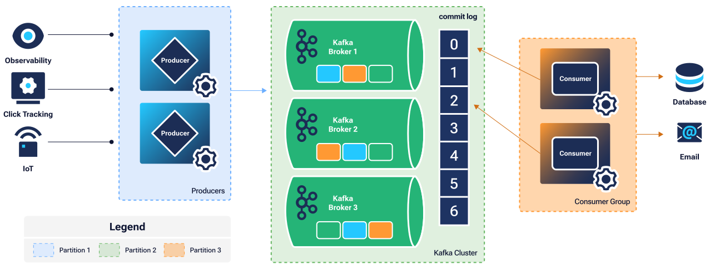

[Apache Kafka](https://kafka.apache.org/) is a scalable open source, distributed system for managing real-time data streams. Kafka supports a wide range of applications, including those used for log aggregation, monitoring, and real-time analytics. Kafka is considered an industry standard for use cases such as data pipelines, event-driven architectures, and stream-processing applications.

This guide includes steps for deploying a Kafka cluster using Ansible. The provided Ansible playbook creates a functioning Kafka cluster comprised of three broker nodes configured to authenticate with encrypted secrets. Also included are steps for producing and consuming sample data for testing cluster functionality.

If you wish to deploy Kafka automatically rather than manually, consider our [Apache Kafka cluster marketplace deployment](/docs/marketplace-docs/guides/apache-kafka-cluster/).

## Architecture Diagram



### Architecture Components

-   **Kafka Cluster**: A minimum three-node cluster for a fault-tolerant architecture
    -   **Kafka Brokers**: Individual servers used to receive and send data
    -   **Commit log**: A file that lives on each broker server to log event data
-   **Producers**: Any app, software, or code that connects to Kafka producing data
-   **Consumer group**: Any app, software, or code that consumes produced data to perform a function

## Prerequisites

The following software and components must be installed and configured on your local system in order for the provided playbooks to function:

-   [Python](https://www.python.org/downloads/) version: > v3.8
-   The [venv](https://docs.python.org/3/library/venv.html) Python module
-   A [Linode API access token](/docs/products/tools/api/get-started/#get-an-access-token)
-   A configured [SSH key pair](/docs/guides/use-public-key-authentication-with-ssh/) along with your public key
-   The [Git](https://git-scm.com/) utility

## Deployment Details, Software, and Supported Distributions

### Deployment Details

-   The minimum cluster size is *three* nodes, as three controllers are configured for fault-tolerance at all times.
-   The nodes used in this deployment default to 4GB dedicated instances. For production environments, it is recommended to use a minimum [plan size](https://www.linode.com/pricing/) of 8GB dedicated instances up to 32GB dedicated instances. Individual use cases may vary.
-   The manual deployment in this guide uses Kafka’s native consensus protocol, [KRaft](https://kafka.apache.org/documentation/#kraft).
-   During the provisioning process, the cluster is configured with mTLS for authentication. This means inter-broker communication and client authentication are established via certificate identity.
-   Clients that connect to the cluster need their own valid certificate. All certificates are created using a self-signed Certificate Authority (CA). Client keystores and truststores are found on the first Kafka node in the following directories:
    -   `/etc/kafka/ssl/keystore`
    -   `/etc/kafka/ssl/truststore`
-   The CA key and certificate pair are stored on the first Kafka node in the `/etc/kafka/ssl/ca` directory.

### Included Software

-   Apache Kafka version 3.8.0
-   KRaft
-   UFW (Uncomplicated Firewall) version 0.36.1
-   Fail2ban version 0.11.2

### Supported Deployment Distribution

-   Ubuntu 24.04 LTS

## Clone the docs-cloud-projects Github Repository

In order to run the Kafka deployment in this guide, the docs-cloud-projects GitHub repository must be cloned to your local machine. This includes all playbooks, configurations, and files for all project directories in the repository, including those needed to successfully deploy the Kafka cluster.

1.  Using git, clone the docs-cloud-projects repository. This clones the repository to the current working directory on your local machine:

    ```command
    git clone https://github.com/linode/docs-cloud-projects.git
    ```

1.  Navigate to the manual-kafka-cluster directory within your local cloned repository:

    ```command
    cd docs-cloud-projects/apps/manual-kafka-cluster
    ```

1.  Confirm the manual-kafka-cluster directory contents on your system:

    ```command
    ls
    ```

    The following contents should be visible:

    ```output
    LICENSE          ansible.cfg      group_vars       images           requirements.txt scripts
    README.md        collections.yml  hosts            provision.yml    roles            site.yml
    ```

## Installation

1.  Using python, create a virtual environment with the venv utility. This isolates dependencies from other packages on your local system:

    ```command
    python3 -m venv env
    source env/bin/activate
    pip install -U pip
    ```

1.  Install all packages in the `requirements.txt` file. This includes Ansible collections and required Python packages:

    ```command
    pip install -r requirements.txt
    ansible-galaxy collection install -r collections.yml
    ```

1.  Confirm Ansible is installed by checking the version:

    ```command
    ansible --version
    ```

    Sample output:

    ```output
    ansible [core 2.17.5]
    (...)
    python version = 3.12.4 (main, Jun 18 2024, 08:58:27) [Clang 15.0.0 (clang-1500.0.40.1)]
    (...)
    jinja version = 3.1.4
    libyaml = True
    ```

    
    Some ansible-core package versions may contain older parameters. Should you experience any errors related to out-of-date or deprecated parameters, you can update the ansible-core version with the below command:

    ```command
    python -m pip install --upgrade ansible-core
    ```
    

## Setup

All secrets are encrypted with the Ansible Vault utility as a best practice.

1.  Export `VAULT_PASSWORD`, replacing  with a password of your choosing. This password acts as a key for decrypting encrypted secrets. Save this password for future use:

    ```command
    export VAULT_PASSWORD=
    ```

1.  Using the ansible-vault utility, encrypt the following: a root password, sudo user password, your Linode APIv4 token, truststore password, keystore password, and certificate authority (CA) password

    In the command, replace the below values with your own:

    -    with a root password
    -    with a sudo user password
    -    with your Linode APIv4 token
    -    with a truststore password
    -    with a keystore password
    -    with a certificate authority password

    This command generates encrypted output and also assigns values to the following variables for Ansible to reference later. **Do not** replace these values:

    -   `root_password`
    -   `sudo_password`
    -   `api_token`
    -   `truststore_password`
    -   `keystore_password`
    -   `ca_password`

    When running the command, leave the single quotation marks `'` around each value:

    ```command
    ansible-vault encrypt_string '' --name 'root_password'
    ansible-vault encrypt_string '' --name 'sudo_password'
    ansible-vault encrypt_string '' --name 'api_token'
    ansible-vault encrypt_string '' --name 'truststore_password'
    ansible-vault encrypt_string '' --name 'keystore_password'
    ansible-vault encrypt_string '' --name 'ca_password'
    ```

    
    Each password must meet Akamai’s strong password requirements. If your passwords do not meet these requirements, deployment will fail during the provisioning stage.

    See: [Password Requirements and Recommendations](https://techdocs.akamai.com/cloud-computing/docs/reset-your-user-password#password-requirements-and-recommendations)
    

1.  Copy the generated outputs for `root_password`, `sudo_password`, `api_token`, `truststore_password`, `keystore_password`, and `ca_password`. Save them in the `group_vars/kafka/secret_vars` file. Sample output:

    ```output
    root_password: !vault |
            $ANSIBLE_VAULT;1.1;AES256
            38306438386334663834633634363930343233373066353234616363356534653033346232333538
            3163313031373138383965383739356339663831613061660a666332636564356236656331323361
            61383134663166613462363633646330678356561386230383332313564643135343538383161383236
            6432396332643232620a393630633132336134613039666336326337376566383531393464303864
            34306435376534653961653739653232383262613336383837343962633565356546
    sudo_password: !vault |
            $ANSIBLE_VAULT;1.1;AES256
            38306438386334663834633634363930343233373066353234616363356534653033346232333538
            3163313031373138383965383739356339663831613061660a666332636564356236656331323361
            61383134663166613462363633646330356561386230383332313564643135343538383161383236
            6432396332643232620a393630633sdf32336134613039666336326337376566383531393464303864
            34306435376534653961653739653232383262613336383837343962633565356546
    api_token: !vault |
            $ANSIBLE_VAULT;1.1;AES256
            38306438386334663834633634363930343233373066353234616363356534653033346232333538
            3163313031373138383965383739356339663831613061660a666332636564356236656331323361
            6138313466316661346236363364567330356561386230383332313564643135343538383161383236
            6432396332643232620a393630633132336134613039666336326337376566383531393464303864
            34306435376534653961653739653232383262613336383837343962633565356546
    truststore_password: !vault |
            $ANSIBLE_VAULT;1.1;AES256
            38306438386334663834633634363930343233373066353234616363356534653033346232333538
            3163313031373138383965383739356339663831613061660a666332636564356236656331323361
            6138313466316661346236363364567330356561386230383332313564643135343538383161383236
            6432396332643232620a393630633132336134613039666336326337376566383531393464303864
            34306435376534653961653739653232383262613336383837343962633565356546
    keystore_password: !vault |
            $ANSIBLE_VAULT;1.1;AES256
            38306438386334663834633634363930343233373066353234616363356534653033346232333538
            3163313031373138383965383739356339663831613061660a666332636564356236656331323361
            6138313466316661346236363364567330356561386230383332313564643135343538383161383236
            6432396332643232620a393630633132336134613039666336326337376566383531393464303864
            34306435376534653961653739653232383262613336383837343962633565356546
    ca_password: !vault |
            $ANSIBLE_VAULT;1.1;AES256
            38306438386334663834633634363930343233373066353234616363356534653033346232333538
            3163313031373138383965383739356339663831613061660a666332636564356236656331323361
            6138313466316661346236363364567330356561386230383332313564643135343538383161383236
            6432396332643232620a393630633132336134613039666336326337376566383531393464303864
            34306435376534653961653739653232383262613336383837343962633565356546
    ```

    
    When saving the generated encrypted outputs, omit any `Encryption successful` text.
    

1.  Using a text editor, open and edit the Linode instance parameters in the `group_vars/kafka/vars` file. Replace the values for the following variables with your preferred deployment specifications, and save your changes when complete:

    -   `ssh_keys`: Your SSH public key(s); replace the example keys with your own and remove any unused keys.
    -   `type`: Compute Instance type and plan for each Kafka instance.
    -   `region`: The data center region for the cluster.
    -   `image`: The distribution image to be installed on each Kafka instance. The deployment in this guide supports the `ubuntu24.04` image.
    -   `group` and `linode_tags` (optional): Any [groups or tags](/docs/guides/tags-and-groups/) you with to apply to your cluster’s instances for organizational purposes.
    -   `cluster_size`: The number of Kafka instances in the cluster deployment. Minimum value of 3.
    -   `sudo_username`: A sudo username for each cluster instance.
    -   `country_name`, `state_or_province_name`, `locality_name`, and `organization_name`: The geographical and organizational information for your self-signed TLS certificate.
    -   `email_address`: A functioning SOA administrator email for your self-signed TLS certificate.

    ```file {title="group_vars/kafka/vars"}
    ssh_keys:
    - ssh-ed25519 
    - ssh-rsa 

    instance_prefix: kafka
    type: g6-dedicated-2
    region: us-southeast
    image: linode/ubuntu24.04
    group:
    linode_tags:

    cluster_size: 3
    client_count: 2
    sudo_username: 

    #tls
    country_name: US
    state_or_province_name: Pennsylvania
    locality_name: Philadelphia
    organization_name: Akamai Technologies
    email_address: 
    ca_common_name: Kafka RootCA
    ```

    See [Linode API: List Types](https://techdocs.akamai.com/linode-api/reference/get-linode-types) for information on Linode API parameters.

## Provision Your Cluster

1.  Using the `ansible-playbook` utility, run the `provision.yml` playbook with verbose options to keep track of the deployment process. This creates Linode instances and dynamically writes the Ansible inventory to the hosts file:

    ```command
    ansible-playbook -vvv provision.yml
    ```

    Once the playbook has finished running, you should see the following output:

    ```output
    PLAY RECAP *******************************************************************************************************
    localhost                  : ok=6    changed=3    unreachable=0    failed=0    skipped=0    rescued=0    ignored=0
    ```

1.  Run the `site.yml` playbook with the hosts inventory file. This playbook configures and installs all required dependencies in the cluster:

    ```command
    ansible-playbook -vvv -i hosts site.yml
    ```

    Once complete, you should see similar output to the first playbook, this time including the public IP addresses for each Kafka instance:

    ```output
    PLAY RECAP *******************************************************************************************************
    192.0.2.21             : ok=25   changed=24   unreachable=0    failed=0    skipped=0    rescued=0    ignored=0
    198.51.100.17              : ok=25   changed=24   unreachable=0    failed=0    skipped=0    rescued=0    ignored=0
    203.0.113.24              : ok=49   changed=46   unreachable=0    failed=0    skipped=3    rescued=0    ignored=0
    ```

## Producing and Consuming Data

Once your cluster is up and running, you can begin producing and consuming messages from the brokers. The steps below produce and consume sample data to test the functionality of your Kafka cluster.

### Install Python Dependency

Using `pip`, install the `confluent_kafka` Python client for Apache Kafka while still in your local virtual environment:

```command
pip install confluent_kafka
```

```output
Installing collected packages: confluent_kafka
Successfully installed confluent_kafka-2.6.0
```

### Configure Your /etc/hosts File

On your local machine (or the machine from which you are producing data), you must configure your `/etc/hosts` file to resolve each Kafka node’s IP with a hostname. This is done to facilitate certificate authentication between a client and broker.

1.  On your local machine, open your `/etc/hosts` file using the text editor of your choice in a separate terminal session. You may need to edit the file path to match your local environment:

    ```command
    nano /etc/hosts
    ```

1.  Add the highlighted lines underneath your localhost information. Replace the IP addresses with those of your respective Kafka broker nodes. Save your changes when complete:

    ```file {title="/etc/hosts" hl_lines="3-5"}
    127.0.0.1       localhost
    (...)
       kafka1
       kafka2
       kafka3
    ```

    In the file, `kafka1`, `kafka2`, and `kafka3` define the hostnames associated with each Kafka node and must be included.

### Obtain Client Certificates

In order to send data to the Kafka broker, you must obtain three certificate files (`ca-cert`, `client1.crt`, and `client1.key`) stored on the first Kafka server in your cluster, kafka1. For the purposes of this test, the certificate files must also be located in the same working directory as the `produce.py` and `consume.py` scripts used to produce and consume testing data, respectively. These scripts are located in the `/scripts` directory of the manual-kafka-cluster folder that was cloned from the docs-cloud-projects repository.

The `produce.py`, `consume.py`, and `getcerts.sh` scripts are provided by Akamai for testing and are not endorsed by Apache.

1.  In your local virtual environment, navigate to the `scripts` folder within `manual-kafka-cluster`:

    ```command
    cd scripts
    ```

1.  Confirm the contents of the directory:

    ```command
    ls
    ```

    You should see both the `produce.py` and `consume.py` scripts, along with the `getcerts.sh` script used to obtain the necessary certificate files from the kafka1 server:

    ```output
    consume.py  getcerts.sh produce.py
    ```

1.  To obtain the certificate files, run the `getcerts.sh` script. Replace  with the IP address of your first Kafka node, kafka1.

    ```command
    bash getcerts.sh 
    ```

    ```output
    [info] fetching /etc/kafka/ssl/cert/client1.crt from 192.0.2.21..
    [info] fetching /etc/kafka/ssl/key/client1.key from 192.0.2.21..
    [info] fetching /etc/kafka/ssl/ca/ca-crt from 192.0.2.21..
    ```

1.  Confirm successful download of the certificate files, `ca-cert`, `client1.crt`, and `client1.key`:

    ```command
    ls
    ```

    ```output
    ca-crt      client1.crt client1.key consume.py  getcerts.sh produce.py
    ```

### Produce and Consume Data

#### Produce Data

The `produce.py` script connects to one of the three Kafka broker nodes to send sample message data over port 9092. This is the default port Kafka brokers use to communicate with clients that produce and consume data.

1.  While in the `scripts` directory, run the `produce.py` script to send message data to the broker node:

    ```command
    python3 produce.py
    ```

    ```output
    Message delivered to test [0] at offset 0
    Message delivered to test [0] at offset 1
    Message delivered to test [0] at offset 2
    ```

#### Consume Data

Similar to the `produce.py` script, the `consume.py` script is provided to test the consumption of message data. The `consume.py` script connects to one of the available Kafka nodes to consume the messages that were produced by the `produce.py` script.

1.  While in the same working directory, `scripts`, run the `consume.py` script to receive the sample data:

    ```command
    python3 consume.py
    ```

    ```output
    Received event: {'event_id': 0, 'timestamp': 1727888292, 'message': 'Event number 0'}
    Received event: {'event_id': 1, 'timestamp': 1727888292, 'message': 'Event number 1'}
    Received event: {'event_id': 2, 'timestamp': 1727888292, 'message': 'Event number 2'}
    ```

1.  Once the `consume.py` script has successfully fetched the message data, you can break the connection with the broker by pressing <kbd>Ctrl</kbd> + <kbd>C</kbd> on your keyboard.

## What's Next

Once your Kafka cluster is up, running, and fully functional, you may consider the following next steps depending on your application or [use case](https://kafka.apache.org/documentation/#uses):

-   Save the client certificate files on your "producer" and "consumer" servers so that they can communicate with Kafka. The certificates are located in `/etc/kafka/ssl` on the first Kafka node, kafka1.
-   Update your connection string to connect to the Kafka brokers

Familiarize yourself with the official Apache Kafka documentation, including use cases, community links, and Kafka support:

-   [Apache Kafka Documentation](https://kafka.apache.org/documentation/)
-   [Kafka Project Information](https://kafka.apache.org/project)
-   [Kafka Contact Information](https://kafka.apache.org/contact)