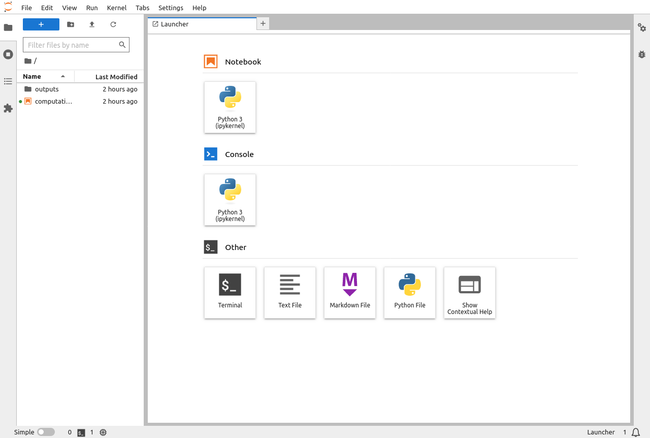

Managing multiple containers for application components can be challenging. The commands to run these containers with respective configurations are cumbersome. Docker Compose simplifies defining and sharing multiple containers with their respective configurations. It is a powerful tool that helps replace numerous `docker build` and `docker run` commands into one configuration file with a set of orchestration commands. Docker Compose also enables defined containers to be spun up and torn down with a simple, self-evident `up` and `down` commands.

Using the example of a Jupyter/MySQL workflow, learn how Docker Compose can quickly and easily deploy a multi-container application.

## Before You Begin

1.  This guide requires a desktop with at least 4 GB of memory and approximately 10 GB of free space. The commands in this guide are written for Ubuntu 22.04 LTS, but should generally work for other Linux distributions and operating systems.

1.  Docker is needed to follow this tutorial. The easiest way to install Docker is via the Docker Desktop package. Download the appropriate package for your operating system and follow the installation guide [here](https://docs.docker.com/engine/install/) to ensure that Docker is installed.

1.  To better understand Jupyter/Docker workflows, read the previous articles in our series:

    -   [How to Set Up Jupyter with Docker](/docs/guides/jupyter-docker-setup-guide/)
    -   [Managing Jupyter Data in Docker Images and Containers](/docs/guides/manage-jupyter-data-docker/)
    -   [Advanced Jupyter Data Persistence with MySQL and Docker](/docs/guides/persist-jupyter-data-mysql-docker/)

    
    If you followed the previous articles, you must first clear out all previous examples:

    1.  First stop all containers:

        ```command {title="Local Machine Terminal"}
        docker ps -q
        ```

    1.  Now remove all stopped containers, all unused networks, images without no associated containers, and build cache:

        ```command {title=Local Machine Terminal"}
        docker system prune -a
        ```
    

### Set up the Prerequisites

Follow the steps below to quickly set up the example project files and directories:

1. First, create a `jupyter` project directory and an `outputs` sub-directory:

    ```command {title="Local Machine Terminal"}
    cd ~
    mkdir jupyter
    cd jupyter
    mkdir outputs
    ```

    The rest of this article assumes you are working out of this directory.

1.  Create `computation.ipynb` notebook file:

    ```command {title="Local Machine Terminal"}
    nano computation.ipynb
    ```

1.  Fill the `compution.ipynb` file with the following contents:

    ```file {title="computation,ipynb" lang="python"}
    {
     "cells": [
      {
       "cell_type": "code",
       "execution_count": null,
       "id": "9d184cb1-5937-45cf-bc13-4c45007a4e50",
       "metadata": {},
       "outputs": [],
       "source": []
      }
     ],
     "metadata": {
      "kernelspec": {
       "display_name": "Python 3 (ipykernel)",
       "language": "python",
       "name": "python3"
      },
      "language_info": {
       "codemirror_mode": {
        "name": "ipython",
        "version": 3
       },
       "file_extension": ".py",
       "mimetype": "text/x-python",
       "name": "python",
       "nbconvert_exporter": "python",
       "pygments_lexer": "ipython3",
       "version": "3.9.13"
      }
     },
     "nbformat": 4,
     "nbformat_minor": 5
    }
    ```

1.  When done, press <kbd>CTRL</kbd>+<kbd>X</kbd>, followed by <kbd>Y</kbd> then <kbd>Enter</kbd> to save the file and exit `nano`.

1.  Now create a `Dockerfile` to define the resulting containers:

    ```command {title="Local Machine Terminal"}
    nano Dockerfile
    ```

1.  Give the `Dockerfile` the following content:

    ```file {title="Dockerfile"}
    # Use the Jupyter Docker Stack minimal notebook as the base image and build a custom image on top of it:
    FROM jupyter/minimal-notebook

    # Install the required geospatial python libraries:
    RUN pip install geopandas
    RUN conda install -c conda-forge gdal
    RUN pip install mysql-connector-python

    # Inform Docker that this container should listen to network port 8888 at runtime:
    EXPOSE 8888

    # Copy files from the local directory to the image file system:
    WORKDIR /work

    # Copy the current directory contents into /work:
    COPY --chown=$NB_UID:$NB_GID . /work

    # Set environment default values:
    ARG USER
    ARG PASSWORD
    ENV MYSQL_USER=${USER:-NOT_DEFINED}
    ENV MYSQL_PASSWORD=${PASSWORD:-NOT_DEFINED}
    ```

1.  When done, press <kbd>CTRL</kbd>+<kbd>X</kbd>, followed by <kbd>Y</kbd> then <kbd>Enter</kbd> to save the file and exit `nano`.

## Create a Docker Compose File

The Docker Compose file is in [YAML](https://yaml.org/) format, a human-readable file that uses indentation to denote configuration dependency. It is typically named `docker-compose.yaml` or `dockercompose.yml`. The file defines services that create containers, networks, and volumes. Docker Compose files do not replace Dockerfiles for custom docker images and containers, but make working with them more manageable.

1.  Start by creating a Docker Compose file in the project directory on your local machine:

    ```command {title="Local Machine Terminal"}
    nano docker-compose.yaml
    ```

1.  Define the containers by filling the `docker-compose.yml` file with the following content:

    ```file {title="docker-compose.yaml" lang="yaml" hl_lines="9,17"}
    version: '3.8'
    services:
      mysql:
        image: 'mysql'
        container_name: 'mysql-db'
        volumes:
          - mysql-data:/var/lib/mysql
        environment:
          MYSQL_ROOT_PASSWORD: my-secret-pw
      jupyter:
        build:
          context: .
          # Looks for a Dockerfile in the current directory to build the image
          args:
            # Adding image build time arguments
            USER: root
            PASSWORD: my-secret-pw
        container_name: 'custom-jupyter-image'
        ports:
          - '8888:8888'
        # Enabling iterative mode
        stdin_open: true
        tty: true
        depends_on:
          - mysql
    volumes:
      # Specify the named volume
      mysql-data:
    ```

    Before building the images and running the containers using Docker Compose, here's an overview of the orchestration instructions outlined in the `docker-compose.yml` file:

    -   `version`: This key specifies the version of the Docker Compose specification. It influences what features can be used in the file. This compose file is under active development and can change over time, see [Docker's Compose versioning documentation](https://docs.docker.com/compose/compose-file/compose-versioning/) for reference.
    -   `services`: This key refers to container configurations and accepts nested values. It contains configuration settings for both the `mysql-db` and `custom-jupyter-image:mysql-connected` containers. The configuration covers setting up environment variables and arguments, publishing ports, mounting volumes, and running in iterative mode.
    -   Docker Compose automatically creates a default network and adds all containers defined in the compose file to that network. However, a network can also be specified manually.

## Create a .dockerignore File

Since login credentials are stored in the `docker-compose.yaml` file, having this file in the resulting Jupyter container presents a security vulnerability. To hide this file, as well as the `Dockerfile`, utilize a `.dockerignore` file.

1.  Create a `.dockerignore` file in the project directory:

    ```command
    nano .dockerignore
    ```

1.  Give the `.dockerignore` file the following contents:

    ```file {title=".dockerignore"}
    Dockerfile
    docker-compose.yaml
    ```

1.  When done, press <kbd>CTRL</kbd>+<kbd>X</kbd>, followed by <kbd>Y</kbd> then <kbd>Enter</kbd> to save the file and exit `nano`.

## Start Services with Docker Compose

1.  Start the services in the directory where the Docker Compose file is located:

    ```command {title="Local Machine Terminal"}
    docker compose up
    ```

    This command pulls and builds all the required images and starts the containers as in the previous section. It also creates a default network and mounts required volumes to containers.

    
    Alternatively, start services in detached mode to continue using the same terminal window:

    ```command {title="Local Machine Terminal"}
    docker compose up -d
    ```

    However, you need to run `docker logs` on the container to retrieve the Jupyter token URL in the next step:

    ```command {title="Local Machine Terminal"}
    docker logs custom-jupyter-image
    ```
    

    A custom container with preloaded configurations is created upon successful execution of the `docker-compose up` command.

    ```output
    ...
    custom-jupyter-image  |     To access the server, open this file in a browser:
    custom-jupyter-image  |         file:///home/jovyan/.local/share/jupyter/runtime/jpserver-7-open.html
    custom-jupyter-image  |     Or copy and paste one of these URLs:
    custom-jupyter-image  |         http://58d1f3a9dde8:8888/lab?token=6760f5aa6f3395aed5f773401e869babc0e4bb02f9ea8a4f
    custom-jupyter-image  |         http://127.0.0.1:8888/lab?token=6760f5aa6f3395aed5f773401e869babc0e4bb02f9ea8a4f
    ...
    ```

1.  Locate the `http://127.0.0.1:8888/lab?token=XXXX` link in the output from the command above and open it in a Web browser to launch the Jupyter environment.

    You should see the `outputs` folder and `computation.ipynb` notebook in the left pane:

    [](Jupyter-Lab-UI-Docker-Compose.png)

    Voila! You now have a running containerized Jupyter environment persisting data to a containerized MySQL database.

1.  From here, you can open the `computation.ipynb` notebook and run the python commands in our previous Jupyter/Docker workflows article [Advanced Jupyter Data Persistence with MySQL and Docker](/docs/guides/persist-jupyter-data-mysql-docker/).

## Stop Services with Docker Compose

1.  Open another terminal window, change into the project directory, and view the running containers with `docker ps`:

    ```command {title="Local Machine Terminal #2"}
    cd ~/jupyter
    docker ps
    ```

    ```output
    CONTAINER ID   IMAGE             COMMAND                  CREATED         STATUS                   PORTS                    NAMES
    e738dd7e7031   jupyter-jupyter   "tini -g -- start-no…"   3 minutes ago   Up 3 minutes (healthy)   0.0.0.0:8888->8888/tcp   custom-jupyter-image
    63a0fa58d201   mysql             "docker-entrypoint.s…"   3 minutes ago   Up 3 minutes             3306/tcp, 33060/tcp      mysql-db
    ```

1.  Use the following command to stop all services and remove all containers:

    ```command {title="Local Machine Terminal"}
    docker compose down
    ```

    ```output
    [+] Running 3/3
     ✔ Container custom-jupyter-image  Rem...                                  1.5s
     ✔ Container mysql-db              Removed                                 2.0s
     ✔ Network jupyter_default         Removed                                 0.2s
    ```

    
    This command doesn't remove volumes created in order to persist data on container removal. Use the `-v` flag to also remove volumes:

    ```command {title="Local Machine Terminal"}
    docker compose down -v
    ```
    

## Conclusion

Docker Compose is an essential tool for developers to create multi-container applications with ease. A single `docker-compose.yaml` file to run the commands in one or more Dockerfiles is not only efficient but also reproducible. The commands to run and stop a complex multi-container application, such as the Jupyter/MySQL example, are about as simple as it gets.

You should now have a better understanding of how to orchestrate multiple containers with Docker Compose. To learn more, continue reading our series on Jupyter/Docker workflows. The next and final article covers deploying this setup to a Linode cloud instance.