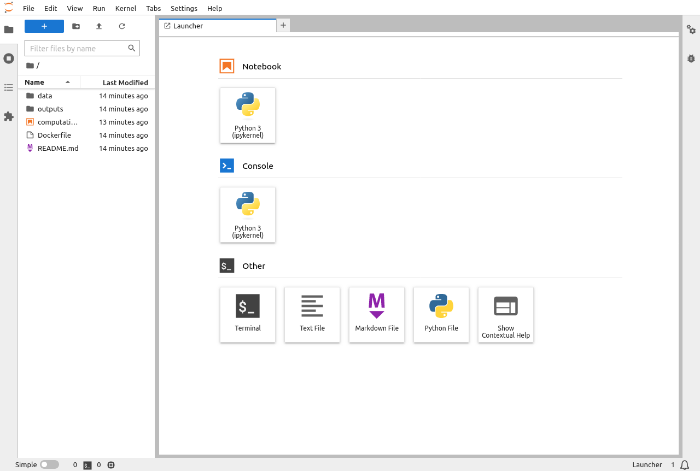
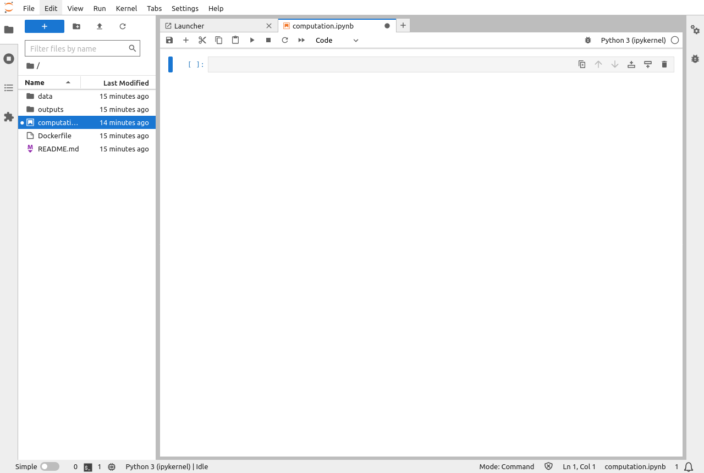
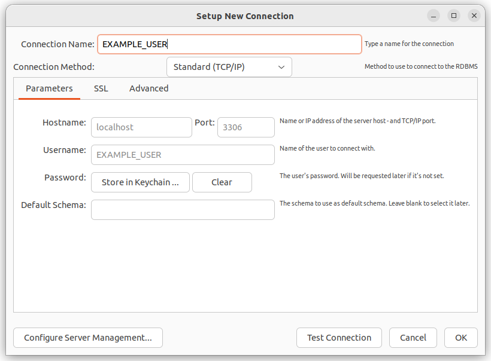
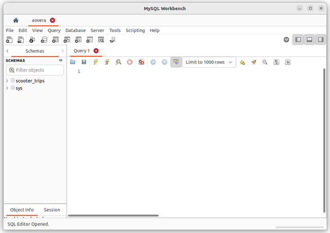
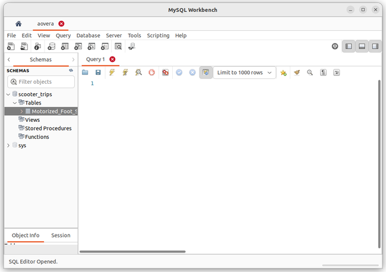
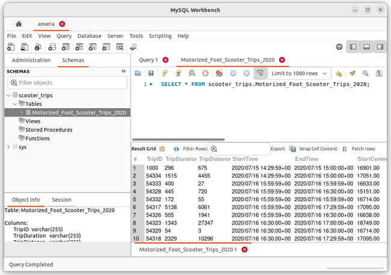
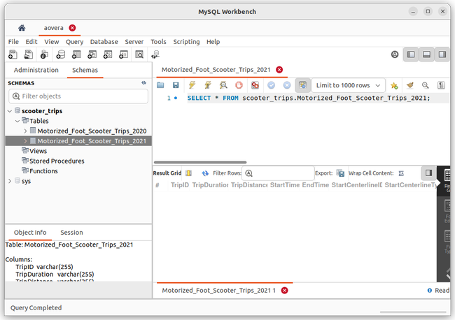
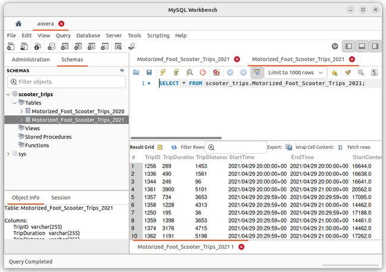

The previous article in our Jupyter/Docker workflows series persisted and stored data on the local machine via volumes. However, in a modern data science environment, this data should instead be stored in a database. Persisting data in containerized environments to a database can be done in either the host machine or in a container.

This article covers both strategies as they further drive understanding of container communication with the local machine and other containers. To better understand the process of working with notebooks and databases, first set the data to persist locally without using containers. Then persist the data to MySQL, a free and open source relational database based on SQL that also offers support for python. MySQL is famous for its speed, reliability, compatibility, scalability, and security.

## Before You Begin

1.  This guide requires a desktop with at least 4 GB of memory and approximately 10 GB of free space. The commands in this guide are written for Ubuntu 22.04 LTS, but should generally work for other Linux distributions and operating systems.

1.  To follow the steps below you need to install Docker. The easiest way to do accomplish this is via the Docker Desktop package. Download the appropriate package for your operating system and follow the installation guide [here](https://docs.docker.com/engine/install/) to ensure that Docker is installed.

1.  Install MySQL to your local machine using the instructions in our guide [Install and Configure MySQL on Ubuntu 22.04](/docs/guides/install-and-configure-mysql-on-ubuntu-22-04/).

1.  Download and install [MySQL Workbench](https://dev.mysql.com/downloads/workbench/), a graphical management tool that facilitates creating, designing, and building databases.

1.  In order to install the remaining required packages, first install `pip`:

    ```command {title="Local Machine Terminal"}
    sudo apt install python3-pip
    ```

1.  Now use `pip` to install MySQL Connector driver, the `python-dotenv` library to read environment variables, the `pandas` data science library, and `jupyterlab` itself:

    ```command {title="Local Machine Terminal"}
    pip install mysql-connector-python python-dotenv pandas jupyterlab
    ```

1.  Follow the instructions in our guide [Add a Directory to the PATH on Linux](/docs/guides/how-to-add-directory-to-path/) to add the `~/.local/bin` directory to your PATH.

### Setting up the Prerequisites

1.  To better understand Jupyter/Docker workflows, read the previous articles in our series:

    -   [How to Set Up Jupyter with Docker](/docs/guides/jupyter-docker-setup-guide/)
    -   [Managing Jupyter Data in Docker Images and Containers](/docs/guides/manage-jupyter-data-docker/)

    Alternatively, follow the steps below to quickly set up the example project:

    ```command {title="Local Machine Terminal"}
    cd ~
    mkdir jupyter
    cd jupyter
    mkdir outputs
    ```

1.  Create a `computation.ipynb` file:

    ```command {title="Local Machine Terminal"}
    nano computation.ipynb
    ```

1.  Give it the following contents:

    ```file {title="computation.ipynb" lang="python"}
    {
     "cells": [
      {
       "cell_type": "code",
       "execution_count": null,
       "id": "9d184cb1-5937-45cf-bc13-4c45007a4e50",
       "metadata": {},
       "outputs": [],
       "source": []
      }
     ],
     "metadata": {
      "kernelspec": {
       "display_name": "Python 3 (ipykernel)",
       "language": "python",
       "name": "python3"
      },
      "language_info": {
       "codemirror_mode": {
        "name": "ipython",
        "version": 3
       },
       "file_extension": ".py",
       "mimetype": "text/x-python",
       "name": "python",
       "nbconvert_exporter": "python",
       "pygments_lexer": "ipython3",
       "version": "3.9.13"
      }
     },
     "nbformat": 4,
     "nbformat_minor": 5
    }
    ```

1.  When done, press <kbd>CTRL</kbd>+<kbd>X</kbd>, followed by <kbd>Y</kbd> then <kbd>Enter</kbd> to save the file and exit `nano`.

## Local Machine

A local setup builds an understanding of how Jupyter interacts with a MySQL database. It helps demonstrate how to persist data from the container to either a database running on the local machine, or a container.

1.  First, navigate to the example project directory (`~/jupyter`) and create an environment file (`.env`) to store the database credentials alongside `computation.ipynb` and the `outputs` folder:

    ```command {title="Local Machine Terminal"}
    nano .env
    ```

1.  The `env` file takes key-value pairs, for example: `MYSQL_USER=myusername`. Be sure to change the examples values `EXAMPLE_USERNAME` and `EXAMPLE_PASSWORD` to your actual MySQL username and password, respectively.

    ```file {title=".env"}
    MYSQL_USER=EXAMPLE_USERNAME
    MYSQL_PASSWORD=EXAMPLE_PASSWORD
    ```

1.  When done, press <kbd>CTRL</kbd>+<kbd>X</kbd>, followed by <kbd>Y</kbd> then <kbd>Enter</kbd> to save the file and exit `nano`.

1.  Launch JupyterLab from the project directory:

    ```command {title="Local Machine Terminal"}
    jupyter-lab
    ```

    ```output
    ...
        To access the server, open this file in a browser:
            file:///home/EXAMPLE_USER/.local/share/jupyter/runtime/jpserver-7262-open.html
        Or copy and paste one of these URLs:
            http://localhost:8888/lab?token=556561770c425ae4363c1f3bbbaf1498cd3f540da38c8872
            http://127.0.0.1:8888/lab?token=556561770c425ae4363c1f3bbbaf1498cd3f540da38c8872
    ```

1.  Your system's default Web browser should open with the Jupyter UI dashboard. If not, open the `http://127.0.0.1:8888/lab?token=XXXX` link in the output:

    

1.  Locate the `computation.ipynb` file in the left-hand pane and double-click to open it.

    

1.  Download the example dataset by inputting the following code into the file then pressing the play button in the upper toolbar:

    ```file {title="computation.ipynb" lang="python"}
    import pandas as pd
    # data url in ArcGIS Hub
    data_url = "https://opendata.arcgis.com/api/v3/datasets/f3277b5838814277afa3275671e632e5_0/downloads/data?format=csv&spatialRefId=4326&where=1%3D1"
    dataframe = pd.read_csv(data_url, index_col=0, nrows=1000)
    dataframe.to_csv("outputs/Motorized-Foot-Scooter-Trips-2020.csv", index=False)
    ```

    This should result in a new `Motorized-Foot-Scooter-Trips-2020.csv` file appearing in the `~/jupyter/outputs` folder.

1.  Next, create a database connection (using the cursor object) to the MySQL database using the following environment variables:

    ```file {title="computation.ipynb" lang="python"}
    # import neccessary libraries
    import mysql.connector
    from mysql.connector import Error
    import os
    from dotenv import load_dotenv
    load_dotenv()

    # Reading enviroment variables
    mysql_user = os.getenv('MYSQL_USER')
    mysql_password = os.getenv('MYSQL_PASSWORD')

    # Creating MYSQL connection
    try:
        mydb_connection = mysql.connector.connect(
        host="localhost",
        user=mysql_user,
        password=mysql_password)
        # Check connection
        if mydb_connection.is_connected():
            print("connection successfully")
            mycursor = mydb_connection.cursor()
            # Create database
            database_name = "scooter_trips"
            mycursor.execute(f"CREATE DATABASE {database_name}")
    except Error:
        print("Error while connecting to MySQL", Error)
    ```

    If the above code executes with no errors, a database was created successfully:

    ```output
    connection successfully
    ```

1.  Open MySQL Workbench and select the plus button to create a connection for the user defined when during the MySQL installation.

    

1.  Open the new connection and select the right arrow next to **Administration** in the left pane to change it to **Schemas**. This shows the empty **scooter_trips** database running on `localhost` at port `3306`:

    

1.  Now create an empty table with the column names of the imported data, then write its content into the newly created table as follows:

    ```file {title="computation.ipynb" lang="python"}
    # data = pd.read_csv('outputs/Motorized-Foot-Scooter-Trips-2020.csv')
    try:
        mydb_connection = mysql.connector.connect(
        host="localhost",
        user=mysql_user,
        password=mysql_password,
        database="scooter_trips") # Added the created database to the connection

        # Check connection
        if mydb_connection.is_connected():
            print("connection successfully")
            mycursor = mydb_connection.cursor()
            mycursor.execute("SELECT database();")
            record = mycursor.fetchone()
            print("You're connected to database: ", record)
            table_name = "Motorized_Foot_Scooter_Trips_2020"
            mycursor.execute("CREATE TABLE Motorized_Foot_Scooter_Trips_2020 (TripID VARCHAR(255), TripDuration VARCHAR(255), TripDistance VARCHAR(255), StartTime VARCHAR(255), EndTime VARCHAR(255), StartCenterlineID VARCHAR(255), StartCenterlineType VARCHAR(255), EndCenterlineID VARCHAR(255), EndCenterlineType VARCHAR(255))")
            print(f"{table_name} table created")

    except Error:
        print("Error while connecting to MySQL", Error)
    ```

    
    When creating the columns, the character strings `VARCHAR(length)` data type was used for all columns, so no data types issue should exist.
    

    If the above code executes with no errors, an empty `Motorized_Foot_Scooter_Trips_2020` table was successfully created in the `scooter_trips` database:

    ```output
    connection successfully
    You're connected to database:    ('scooter_trips',)
    Motorized_Foot_Scooter_Trips_2002 table created
    ```

1.  Open MySQL Workbench and click the arrows next to **scooter_trips** and then **Tables** to view the new `Motorized_Foot_Scooter_Trips_2020` table:

    

1.  Next, write the content of the output data into this empty table as follows:

    ```file {title="computation.ipynb" lang="python"}
    # Read data from output folder
    data = pd.read_csv('outputs/Motorized-Foot-Scooter-Trips-2020.csv')

    # Check connection
    if mydb_connection.is_connected():
        for index, row in data.iterrows():
            sql = "INSERT INTO scooter_trips.Motorized_Foot_Scooter_Trips_2020 (TripID, TripDuration, TripDistance, StartTime, EndTime, StartCenterlineID, StartCenterlineType, EndCenterlineID, EndCenterlineType) VALUES (%s,%s,%s,%s,%s,%s,%s,%s,%s)"
            mycursor.execute(sql, list(row))
            # the connection is not auto committed by default, so we must commit to save our changes
        mydb_connection.commit()
    ```

    It could take a few moments to write the output data to the respective columns in the MySQL table.

1.  When complete, right-click the `Motorized_Foot_Scooter_Trips_2020` table in MySQL Workbench and choose **Select Rows - Limit 1000** to view this change in the table:

    

    Data has been successfully persisted from the local Jupyter instance to the local MySQL database.

1.  When finished, close the Web browser and return to the local machine terminal. Press <kbd>CTRL</kbd>+<kbd>C</kbd> then <kbd>Y</kbd> and <kbd>Enter</kbd> to stop the server.

## Container

The local scenario can be expanded to a containerized notebook environment, but still persisting data to MySQL in the local machine.

1.  First, create a `Dockerfile` in the project directory:

    ```command {title="Local Machine Terminal"}
    nano Dockerfile
    ```

1.  Provide the `Dockerfile` with instructions to install the MySQL driver and set up environment variables during build time:

    ```file {title="Dockerfile" lang="docker"}
    # Use the Jupyter Docker Stack minimal notebook as the base image and build a custom image on top of it:
    FROM jupyter/minimal-notebook

    # Install the required geospatial python libraries:
    RUN pip install geopandas
    RUN conda install -c conda-forge gdal
    RUN pip install mysql-connector-python

    # Inform Docker that this container should listen to network port 8888 at runtime:
    EXPOSE 8888

    # Copy files from the local directory to the image file system:
    WORKDIR /work

    # Copy the current directory contents into /work:
    COPY --chown=$NB_UID:$NB_GID . /work

    # Set environment default values:
    ARG USER
    ARG PASSWORD
    ENV MYSQL_USER=${USER:-NOT_DEFINED}
    ENV MYSQL_PASSWORD=${PASSWORD:-NOT_DEFINED}
    ```

    The `COPY` instruction in the `Dockerfile` copies everything where the `Dockerfile` is located. This is not ideal for copying the `.env` file as it contains sensitive credentials. To prevent this, either delete it or add the `.env` file to a `.dockerignore` file to exclude it. Docker's `ARG` and `ENV` commands are used to send these variables into the Jupyter environment instead.

1.  First, create a `.dockerignore` file in the main project directory:

    ```command {title="Local Machine Terminal"}
    nano .dockerignore
    ```

1.  Now simply add the `.env` file to it like so:

    ```file {title=".dockerignore"}
    .env
    ```

1.  When done, press <kbd>CTRL</kbd>+<kbd>X</kbd>, followed by <kbd>Y</kbd> then <kbd>Enter</kbd> to save the file and exit `nano`.

1.  If not already running, start Docker Desktop and wait for it to fully load.

1.  Next, proceed to build the docker image. Be sure to change `EXAMPLE_USER` and `EXAMPLE_PASSWORD` in the command below to your actual MySQL username and password:

    ```command {title="Local Machine Terminal"}
    docker build --build-arg USER=EXAMPLE_USER --build-arg PASSWORD=EXAMPLE_PASSWORD -t custom-jupyter-image:mysql-connected .
    ```

    Here Docker's `ARG` and `ENV` are used to set up the MySQL credentials using the `--build` flag at image build time.

    ```output
    [+] Building 182.5s (11/11) FINISHED                       docker:desktop-linux
     => [internal] load build definition from Dockerfile                       0.1s
     => => transferring dockerfile: 729B                                       0.0s
     => [internal] load .dockerignore                                          0.1s
     => => transferring context: 2B                                            0.0s
     => [internal] load metadata for docker.io/jupyter/minimal-notebook:lates  1.5s
     => [1/6] FROM docker.io/jupyter/minimal-notebook@sha256:5ed09b0f8ccfabc  61.1s
     => => resolve docker.io/jupyter/minimal-notebook@sha256:5ed09b0f8ccfabc2  0.1s
     => => sha256:140bb683c283cc68f893d4974e3aa27d4b908620eb6 5.11kB / 5.11kB  0.0s
     => => sha256:5ed09b0f8ccfabc2e8925bcf0c2e3d5903dea876f755eda 772B / 772B  0.0s
     => => sha256:fcdc6c9df32d66d893eea7407dfab4514b8ddd9ff 14.71kB / 14.71kB  0.0s
     => => sha256:3153aa388d026c26a2235e1ed0163e350e451f41a 29.53MB / 29.53MB  1.5s
     => => sha256:7255003dcd006ccbe6d645e98c8a4388f471f9e12e0 9.82MB / 9.82MB  1.3s
     => => sha256:e121eb237177ace7d872fb01b2f59d441e3237bc5090e02 680B / 680B  0.5s
     => => sha256:4f4fb700ef54461cfa02571ae0db9a0dc1e0cdb5577484a6d 32B / 32B  0.7s
     => => sha256:f67e18968dba809176d244923165a10db5389862a68 1.92kB / 1.92kB  1.0s
     => => sha256:101e3a129727873116eeae05a38425d1073f5cd4a26 4.92kB / 4.92kB  1.3s
     => => sha256:5bc6fbe31d1cd1d9351c686657cc6ac7bb4c75aacb021d9 275B / 275B  1.4s
     => => sha256:829968467f86e89b8476bd34f64af2cc2b335bad2204c12 152B / 152B  1.4s
     => => sha256:cc1ad04b36f62e94cdfbf8ef834b8823978201c 104.37MB / 104.37MB  8.0s
     => => sha256:17c0d1b253f810f8ca7690df285585d45ee0ed1d4aa 4.20kB / 4.20kB  1.6s
     => => sha256:ac7ba4fe803e5dbdc51a71bff85151e985aac5a3 30.50MB / 30.50MB  10.6s
     => => sha256:4e7b9c1c80a5057775062a463b4a242aff63cec 134.00MB / 134.00MB  9.0s
     => => extracting sha256:3153aa388d026c26a2235e1ed0163e350e451f41a8a313e1  6.0s
     => => sha256:c624f304daf7e22cb8c59a2fb0215dbe4ac8b2914eae302 682B / 682B  8.2s
     => => extracting sha256:7255003dcd006ccbe6d645e98c8a4388f471f9e12e04dd66  2.1s
     => => sha256:85815c696f547261895693eec799c7dce54c6f91258 1.40kB / 1.40kB  8.4s
     => => sha256:aa08b036cf3f2dd717d524e719434c81e8ea1f4a39b 1.42kB / 1.42kB  8.7s
     => => sha256:be86bbb214a3c1fbcc40c90f146b9b791770e6 178.43MB / 178.43MB  14.3s
     => => sha256:1604495c9853e79d3d98a664e1a4340be3548a2c56b 1.47kB / 1.47kB  9.1s
     => => sha256:2a2d91f2181e60595f28e36666a626eca5474eff7850036 433B / 433B  9.3s
     => => sha256:543f3aaa49671687f415184586379bdb39f91a61cda 1.26kB / 1.26kB  9.4s
     => => extracting sha256:e121eb237177ace7d872fb01b2f59d441e3237bc5090e020  0.0s
     => => extracting sha256:4f4fb700ef54461cfa02571ae0db9a0dc1e0cdb5577484a6  0.0s
     => => extracting sha256:f67e18968dba809176d244923165a10db5389862a682058e  0.0s
     => => extracting sha256:101e3a129727873116eeae05a38425d1073f5cd4a265504e  0.0s
     => => extracting sha256:829968467f86e89b8476bd34f64af2cc2b335bad2204c12c  0.0s
     => => extracting sha256:5bc6fbe31d1cd1d9351c686657cc6ac7bb4c75aacb021d9e  0.0s
     => => extracting sha256:cc1ad04b36f62e94cdfbf8ef834b8823978201c82193ed2  10.6s
     => => extracting sha256:17c0d1b253f810f8ca7690df285585d45ee0ed1d4aabd12d  0.0s
     => => extracting sha256:ac7ba4fe803e5dbdc51a71bff85151e985aac5a30c31360e  1.9s
     => => extracting sha256:4e7b9c1c80a5057775062a463b4a242aff63cecedfb65a1  14.0s
     => => extracting sha256:c624f304daf7e22cb8c59a2fb0215dbe4ac8b2914eae3021  0.0s
     => => extracting sha256:85815c696f547261895693eec799c7dce54c6f9125879851  0.0s
     => => extracting sha256:aa08b036cf3f2dd717d524e719434c81e8ea1f4a39b128a4  0.0s
     => => extracting sha256:be86bbb214a3c1fbcc40c90f146b9b791770e6dc1199e59  20.6s
     => => extracting sha256:1604495c9853e79d3d98a664e1a4340be3548a2c56bbec52  0.0s
     => => extracting sha256:2a2d91f2181e60595f28e36666a626eca5474eff78500364  0.0s
     => => extracting sha256:543f3aaa49671687f415184586379bdb39f91a61cdaf04ad  0.0s
     => [internal] load build context                                          0.9s
     => => transferring context: 14.86MB                                       0.8s
     => [2/6] RUN pip install geopandas                                       17.7s
     => [3/6] RUN conda install -c conda-forge gdal                           78.3s
     => [4/6] RUN pip install mysql-connector-python                           6.0s
     => [5/6] WORKDIR /work                                                    0.1s
     => [6/6] COPY --chown=1000:100 . /work                                    0.1s
     => exporting to image                                                    17.2s
     => => exporting layers                                                   17.2s
     => => writing image sha256:4f48cf599aa85215a6a472c658e12444ccd438b3f12d2  0.0s
     => => naming to docker.io/library/custom-jupyter-image:mysql-connected    0.0s

    What's Next?
      View summary of image vulnerabilities and recommendations → docker scout quickview
    ```

1.  Next, create the custom Jupyter container to persist data to the local machine's MySQL:

    ```command {title="Local Machine Terminal"}
    docker run -d -it -p 8888:8888 --name custom-jupyter-container-mysql custom-jupyter-image:mysql-connected
    ```

    Notice the volumes and bind mounts were removed. The data is now persisting to the MySQL database on the local machine and preparing the environment for production.

    If successful, the container ID should appear the command's output similar to the following:

    ```output
    383985fc3b5e4fde8d4cdc48eaa28f2a1ade66a53d6909dd50aa45fafd954e88
    ```

1.  Use the container ID from the output with the `docker logs` command to locate the JupyterLab `http://127.0.0.1:8888/lab?token=XXXX` URL, like so:

    ```command {title="Local Machine Terminal"}
    docker logs CONTAINER_ID
    ```

1.  Open the `http://127.0.0.1:8888/lab?token=XXXX` link in a Web browser and then open the `computation.ipynb` file.

1.  Load another version of the sample Motorized Foot Scooter Trips data (`Motorized-Foot-Scooter-Trips-2021`) as follows:

    ```file {title="computation.ipynb" lang="python"}
    import pandas as pd
    # data url in ArcGIS Hub
    data_url ="https://opendata.arcgis.com/api/v3/datasets/033311f71d5a4b98babaa2280b432a43_0/downloads/data?format=csv&spatialRefId=4326&where=1%3D1"
    data = pd.read_csv(data_url, index_col=0, nrows=1000)
    filled_data = data.fillna(0.0)
    filled_data.to_csv("outputs/Motorized-Foot-Scooter-Trips-2021.csv", index=False)
    ```

    
    Missing data instances cause the writing of data to fail. This sample dataset has missing data instances throughout. To fix this, the `fillena()` method was applied replace them with a value (`0.0`). Alternatively, those instances can be removed entirely with `dropna()` those instances.
    

    This should result in a `Motorized-Foot-Scooter-Trips-2021.csv` file appearing in the `outputs` folder alongside `Motorized-Foot-Scooter-Trips-2021.csv`.

1.  Next, make a connection from the container to the local database:

    ```file {title="computation.ipynb" lang="python"}
    # import neccessary libraries
    import mysql.connector
    from mysql.connector import Error
    import os

    # Reading enviroment variables
    mysql_user = os.environ['MYSQL_USER']
    mysql_password = os.environ['MYSQL_PASSWORD']

    # Creating MYSQL connection
    try:
        mydb_connection = mysql.connector.connect(
        host="host.docker.internal",
        user=mysql_user,
        password=mysql_password)
        # Check connection
        if mydb_connection.is_connected():
            print("connection successfully")

    except Error:
        print("Error while connecting to MySQL", Error)
    ```

    Here, the `dotenv` library is not needed. The environment variables set at the image build phase can be accessed via build time arguments using `os.environ[variable]`.

    `localhost` has also been replaced with `host.docker.internal`, a unique domain that Docker can use to connect to the local host. This unique domain enables a successful connection to the local database. Notably, computations in the container persist data as new tables in the existing `scooter_trips` database in the local machine.

    ```output
    connection sucessfully
    ```

1.  Next, create an empty `Motorized_Foot_Scooter_Trips_2021` table in the `scooter_trips` database:

    ```file {title="computation.ipynb" lang="python"}
    try:
        mydb_connection = mysql.connector.connect(
        host="host.docker.internal",
        user=mysql_user,
        password=mysql_password,
        database="scooter_trips") # Added the created database to the connection

        # Check connection
        if mydb_connection.is_connected():
            print("connection successfully")
            mycursor = mydb_connection.cursor()
            mycursor.execute("SELECT database();")
            record = mycursor.fetchone()
            print("You're connected to database: ", record)
            table_name = "Motorized_Foot_Scooter_Trips_2021"
            mycursor.execute("CREATE TABLE Motorized_Foot_Scooter_Trips_2021 (TripID VARCHAR(255), TripDuration VARCHAR(255), TripDistance VARCHAR(255), StartTime VARCHAR(255), EndTime VARCHAR(255), StartCenterlineID VARCHAR(255), StartCenterlineType VARCHAR(255), EndCenterlineID VARCHAR(255), EndCenterlineType VARCHAR(255))")
            print(f"{table_name} table created")

    except Error:
        print("Error while connecting to MySQL", Error)
    ```

    ```output
    connection successfully
    You're connected to database:    ('scooter_trips'.)
    Motorized_Foot_Scooter_Trips_2021 table created
    ```

    If the above code was executed with no errors, this empty table can be viewed on the MySQL Workbench:

    

    The empty table from the container has persisted from the running container to the local MySQL database. Both the table generated from the locally running notebook as well as from the container can be seen.

1.  Next, write the outputs data from the container to the empty table in the local database:

    ```file {title="computation.ipynb" lang="python"}
    #Read data from output folder
    data = pd.read_csv('outputs/Motorized-Foot-Scooter-Trips-2021.csv')

    # Check connection
    if mydb_connection.is_connected():
        for index, row in data.iterrows():
            sql = "INSERT INTO scooter_trips.Motorized_Foot_Scooter_Trips_2021 (TripID, TripDuration, TripDistance, StartTime, EndTime, StartCenterlineID, StartCenterlineType, EndCenterlineID, EndCenterlineType) VALUES (%s,%s,%s,%s,%s,%s,%s,%s,%s)"
            mycursor.execute(sql, list(row))
            # the connection is not auto committed by default, so we must commit to save our changes
            mydb_connection.commit()
    ```

    This writes data from the output data to the respective columns in the MySQL table. View this change to the table in MySQL Workbench:

    

1.  When finished, close MySQL Workbench and the Web browser and return to the local machine terminal. Stop the container using the container ID from earlier with a command like this:

    ```command {title="Local Machine Terminal"}
    docker stop CONTAINER_ID
    ```

1.  Now remove that container using the same container ID with a command like this:

    ```command {title="Local Machine Terminal"}
    docker rm CONTAINER_ID
    ```

## Persist Containerized Data to Local Database

The previous section covered persisting data from the containerized Jupyter environment to the locally installed database. If the container is removed, the data survives on the local database. This communication from the container to the host machine works. However, it is best practice to use containers as one-service-per-container in order to separate areas of concern. To avoid the container being responsible for running the application and handling the database, separate the two aspects of the application into two containers.

This section covers persisting data to a database running in a container (container-to-container communication). Here two containers are used, one for the Jupyter environment and the other for the MySQL database. The MySQL is installed and set up in the container using its [Official image](https://hub.docker.com/_/mysql) on Docker Hub.

One approach to connecting these two separate and isolated containers involves knowing the IP address of the container with a running MySQL database instance. This IP address is then used to replace the `host.docker.internal` address on the Jupyter environment container.


You can get the IP address of a container by using the container inspection command `docker container inspect CONTAINER_NAME` and navigating to the `NetworkSettings`.


This article utilizes the Docker network to make this container-to-container communication required for the example project. The Docker network enables the container to communicate with other containers using their respective names rather than IP addresses. As each container has its own IP address, it's not ideal to manually check IP addresses as you begin working with multiple containers.

1.  First, create the network for the Jupyter and MySQL containers to belong to:

    ```command {title="Local Machine Terminal"}
    docker network create jupyter-mysql-net
    ```

    This instruction creates a network `jupyter-mysql-net` which can be viewed using `docker network ls`.

1.  Next, create the MySQL container as part of the `jupyter-mysql-net` network. The command below creates a new container named `mysql-db` based on the official MySQL image in detached mode, added to the `jupyter-mysql-net network` via the `--network` flag. This container spins up a MySQL database accessible on port `3306` with a required root password. Be sure to change `EXAMPLE_PASSWORD` to an actual MySQL root password before running the following command:

    ```command {title="Local Machine Terminal"}
    docker run -d --name mysql-db --network jupyter-mysql-net -e MYSQL_ROOT_PASSWORD=EXAMPLE_PASSWORD mysql
    ```

1.  Next, re-create the Jupyter container running in this network for communication. Make sure to replace `EXAMPLE_PASSWORD` in the command below with the same password you set for `MYSQL_ROOT_PASSWORD` in the command above:

    ```command {title="Local Machine Terminal"}
    docker run -d -it -p 8888:8888 --name custom-jupyter-container-mysql --network jupyter-mysql-net -e MYSQL_USER=root -e MYSQL_PASSWORD=EXAMPLE_PASSWORD custom-jupyter-image:mysql-connected
    ```

1.  Use the following command to check the running containers:

    ```command {tile="Local Machine Terminal"}
    docker ps
    ```

    This should show the two running containers:

    ```output
    CONTAINER ID   IMAGE                                  COMMAND                  CREATED              STATUS                        PORTS                    NAMES
    e72144985a37   custom-jupyter-image:mysql-connected   "tini -g -- start-no…"   About a minute ago   Up About a minute (healthy)   0.0.0.0:8888->8888/tcp   custom-jupyter-container-mysql
    cb1f84e3c755   mysql                                  "docker-entrypoint.s…"   24 minutes ago       Up 24 minutes                 3306/tcp, 33060/tcp      mysql-db
    ```

    Now both containers are running in the same network, hence they can now communicate with each other using their respective container names.

1.  Check the logs of the `custom-jupyter-container-mysql` container to retrieve the `http://127.0.0.1:8888/lab?token=XXXX` link.

    ```command
    docker logs custom-jupyter-container-mysql
    ```

1.  Open the `http://127.0.0.1:8888/lab?token=XXXX` link in a Web browser to launch the Jupyter environment, then open the `computation.ipynb` notebook.

1.  Test the communication between containers by loading another version of the Motorized Foot Scooter Trips data (`Motorized-Foot-Scooter-Trips-2018`):

    ```file {title="computation.ipynb" lang="python"}
    import pandas as pd
    # data url in ArcGIS Hub
    data_url ="https://opendata.arcgis.com/api/v3/datasets/aaf4274109f34ffd93ac71267c5b276e_0/downloads/data?format=csv&spatialRefId=4326&where=1%3D1"
    data = pd.read_csv(data_url, index_col=0, nrows=1000)
    data.to_csv("outputs/Motorized-Foot-Scooter-Trips-2018.csv", index=False)
    ```

    This should result in a `Motorized-Foot-Scooter-Trips-2018.csv` file appearing in the `/outputs` folder.

1.  Next, connect to the MySQL database in the `mysql-db` container and create a `scooter_trips` database:

    ```file {title="computation.ipynb" lang="python"}
    # import neccessary libraries
    import mysql.connector
    from mysql.connector import Error
    import os

    # Reading enviroment variables
    mysql_user = os.getenv('MYSQL_USER')
    mysql_password = os.getenv('MYSQL_PASSWORD')

    # Creating MYSQL connection
    try:
        mydb_connection = mysql.connector.connect(
        host="mysql-db",
        user=mysql_user,
        password=mysql_password)
        # Check connection
        if mydb_connection.is_connected():
            print("connection successfully")
            mycursor = mydb_connection.cursor()
            # Create database
            database_name = "scooter_trips"
            mycursor.execute(f"CREATE DATABASE {database_name}")
    except Error:
        print("Error while connecting to MySQL", Error)
    ```

    This successfully connects to the `mysql-db` container and creates a `scooter_trips` database with the container name as the host value:

    ```output
    connection successfully
    ```

1.  Next, create a table in the newly created database. Like in the previous section, create an empty table in the containerized database environment in the `mysql-db` container:

    ```file {title="computation.ipynb" lang="python"}
    try:
        mydb_connection = mysql.connector.connect(
        host="mysql-db",
        user=mysql_user,
        password=mysql_password,
        database="scooter_trips") # Added the created database to the connection

        # Check connection
        if mydb_connection.is_connected():
            print("connection successfully")
            mycursor = mydb_connection.cursor()
            mycursor.execute("SELECT database();")
            record = mycursor.fetchone()
            print("You're connected to database: ", record)
            table_name = "Motorized_Foot_Scooter_Trips_2018"
            mycursor.execute(f"CREATE TABLE {table_name} (TripID VARCHAR(255), TripDuration VARCHAR(255), TripDistance VARCHAR(255), StartTime VARCHAR(255), EndTime VARCHAR(255), StartCenterlineID VARCHAR(255), EndCenterlineID VARCHAR(255))")
            print(f"{table_name} table created")
            for index, row in data.iterrows():
                sql = f"INSERT INTO scooter_trips.Motorized_Foot_Scooter_Trips_2018 (TripID, TripDuration, TripDistance, StartTime, EndTime, StartCenterlineID, EndCenterlineID) VALUES (%s,%s,%s,%s,%s,%s,%s)"
                mycursor.execute(sql, list(row))
                # the connection is not auto committed by default, so we must commit to save our changes
                mydb_connection.commit()

    except Error:
        print("Error while connecting to MySQL", Error)
    ```

    
    The data column dimension must be the same as the database table to which you are trying to create and persist data.
    

    This successfully connects to the `mysql-db` container and `scooter_trips` database, and creates and writes data to `Motorized_Foot_Scooter_Trips_2018` table:

    ```output
    connection successfully
    You're connected to database:    ('scooter_trips',)
    Motorized_Foot_Scooter_Trips_2018 table created
    ```

    Note that this database setup and content cannot be accessed locally (via the command line or MySQL Workbench). This is because the database is running in a Docker container, and no ports were published when running the `mysql-db` container. However, the content of this `Motorized_Foot_Scooter_Trips_2018` table in the `mysql-db` can be accessed from the Jupyter container by running a query like this:

    ```file {title="computation.ipynb" lang="python"}
    try:
        mydb_connection = mysql.connector.connect(
        host="mysql-db",
        user=mysql_user,
        password=mysql_password,
        database="scooter_trips") # Added the created database to the connection

        # Check connection
        if mydb_connection.is_connected():
            print("connection successfully")
            mycursor = mydb_connection.cursor()
            mycursor.execute("SELECT * FROM Motorized_Foot_Scooter_Trips_2018 limit 5")
            myresult = mycursor.fetchall()
            for x in myresult:
                print(x)
    except Error:
        print("Error while connecting to MySQL", Error)
    ```

    This yields five queried instances, confirming the connection to `mysql-db` is functional and successful.

    ```output
    connection successfully
    ('154744', '256', '1108', '2018/07/10 12:00:00+00', '2018/07/10 12:00:00+00', '16914', '16914')
    ('154745', '185', '519', '2018/07/10 12:00:00+00', '2018/07/10 12:00:00+00', '17104', '17872')
    ('154742', '177', '496', '2018/07/10 12:30:00+00', '2018/07/10 12:30:00+00', '17117', '17865')
    ('154743', '344', '929', '2018/07/10 12:30:00+00', '2018/07/10 12:30:00+00', '16632', '17117')
    ('154741', '176', '588', '2018/07/10 12:59:59+00', '2018/07/10 12:59:59+00', '21654', '17250')
    ```

    At the moment, the `mysql-db` container does not persist the database data. One option is to let Docker can manage the storage of database data on the host machine via volumes. Alternatively, you can manage the database storage manually. Do so by creating a data directory on the host machine and mounting it to the container via bind mounts.

    Using its internal volume management system, this tutorial uses the Docker volume method (named volume) to manage the containerized database data. However, the bind mounts method can help conveniently inspect the containerized database data. The database data in MySQL containers built from the official image stores database data in the `var/lib/mysql` directory. A named volume can be mounted to this path in the `mysql-db` container to persist database data.

1.  To do so, first stop and remove the running MySQL container:

    ```command {title="Local Machine Terminal"}
    docker stop mysql-db
    ```

    ```command {title="Local Machine Terminal"}
    docker rm mysql-db
    ```

1.  Now re-run it with the following changes:

    ```command {title="Local Machine Terminal"}
    docker run -d --name mysql-db --network jupyter-mysql-net -v mysqldata:/var/lib/mysql -e MYSQL_ROOT_PASSWORD=EXAMPLE_PASSWORD mysql
    ```

    This command creates the named volume `mysql-data` and mounts it to the `mysql-db`. This persists the containerized database data to a location on the local machine managed by Docker.

## Conclusion

Jupyter, MySQL, and Docker is a winning combination for data professionals who require collaboration. This article has shown various routes to persist Jupyter data to a MySQL database. From a fully local setup, to a containerized Jupyter instance and a local MySQL instance, to having both instances containerized.

To learn more, check out the next article in our series on Jupyter/Docker workflows [Simplify Multi-Container Orchestration with Docker Compose](/docs/guides/multi-container-orchestration-docker-compose/).