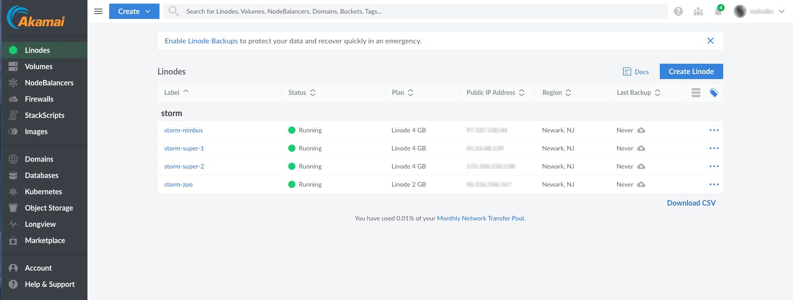
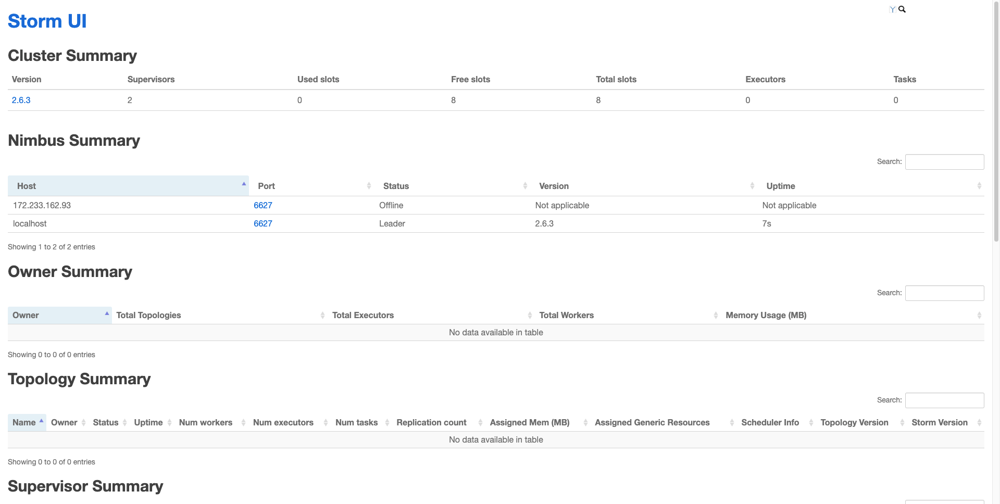

This guide explains Apache Storm and how to create a real-time data stream with it on Akamai Compute.

## What Is Apache Storm?

[Apache Storm](https://storm.apache.org/) is a distributed stream processing computation framework. It is primarily written in Clojure, a dynamic and functional dialect of the Lisp programming language on the Java platform. Storm integrates with various systems and libraries, including Apache Kafka, Apache Cassandra, Redis, Amazon Kinesis, Kestrel, RabbitMQ/Advanced Message Queuing Protocol (AMQP), and Java Message Service (JMS).

### Apache Storm Components

The sections below describe each of Apache Storm’s component terminology in detail:

#### Tuples

Storm uses *tuples* as its main data structure, which are named lists of values of any type. Tuples are dynamically typed and have helper methods to retrieve field values without casting. Storm needs to know how to serialize all tuple values, which it can do for primitives, strings, and byte arrays by default. Other types require a custom serializer.

#### Topologies

A Storm *topology* is a package of logic for a real-time application. It's similar to a MapReduce job but runs indefinitely, unlike MapReduce which finishes eventually. A Storm topology is a graph of spouts and bolts connected by stream groupings, as shown in the diagram below:


#### Streams

A *stream* is a sequence of tuples that is processed in parallel and can contain various data types. A stream has a specified schema that names the fields in the stream's tuples and can be given a custom ID.

#### Spouts

A *spout* is a source of streams in a topology. It reads tuples from an external source and emits them into the topology. Spouts can be either reliable or unreliable. Reliable spouts can replay a tuple if it fails to be processed, whereas unreliable spouts forget the tuple as soon as it is emitted.

#### Bolts

*Bolts* are the components in Storm that perform processing tasks. They perform various operations such as filtering, aggregations, joins, and talking to databases. Bolts can transform streams, although complex transformations often require multiple bolts.

#### Nodes

Apache Storm has two types of *nodes*:

-   **Nimbus** (master node) is the central component of Storm and is responsible for running Storm topologies, analyzing the topology, and determining which tasks to execute.

-   **Supervisor** (worker node) manages worker processes, monitors their health, restarts them if necessary, and ensures they're running correctly. It receives heartbeats from workers, reports to Nimbus, distributes tasks, and handles communication between workers and Nimbus. It acts as a bridge between Nimbus and workers, ensuring tasks are executed correctly and Nimbus has up-to-date task status.


## Defining Bolts in Other Languages

To define [bolts](https://storm.apache.org/releases/2.5.0/Concepts.html) in other languages, use the [multi-language protocol](https://storm.apache.org/releases/current/Multilang-protocol.html). Storm is designed to use the language-independent [Thrift](https://thrift.apache.org/) protocol. Support for multiple languages is implemented using the `ShellBolt`, `ShellSpout`, and `ShellProcess` classes. These classes implement the `IBolt` and `ISpout` interfaces and use the `ProcessBuilder` class in Java to execute scripts or programs via the shell. The `ShellBolt` class and `IBolt` interface are specifically relevant to bolts. There are additional considerations if [using non-JVM languages](https://storm.apache.org/releases/current/Using-non-JVM-languages-with-Storm.html).

## Guarantee Message Processing

Storm offers several levels of [guaranteed message processing](https://storm.apache.org/releases/current/Guaranteeing-message-processing.html), including *best effort*, and *at least once*. To process a message exactly once, use the [Trident](https://storm.apache.org/releases/current/Trident-tutorial.html) interface on top of Storm.

## How to Create a Message Stream with Apache Storm

Before creating your message stream, [install Apache Storm on Linode](/docs/guides/big-data-in-the-linode-cloud-streaming-data-processing-with-apache-storm/). For additional information about installing a cluster, consult the official [Storm setup guide](https://storm.apache.org/releases/2.5.0/Setting-up-a-Storm-cluster.html). You should also [install Storm locally](https://storm.apache.org/releases/2.5.0/Local-mode.html) to simulate a cluster for development and testing purposes.

For this guide, install a Java Development Kit on your local machine. [Adoptium](https://adoptium.net/) offers prebuilt OpenJDK versions for Linux, macOS, and Windows. The latest stable version of OpenJDK (Temurin 17 as of this writing) works. If you prefer Java 8, download the Oracle version from [Java.com](https://www.java.com/en/download/help/download_options.html).

Although Storm is written in Java, Python, C, JavaScript, and Clojure, you do not need to install Clojure or C for the purposes of this guide. Instead, you can [download pre-compiled Storm releases](https://storm.apache.org/downloads.html') for your local development environment. Since Java and Clojure both compile to Java bytecode, Storm releases contain numerous JAR files in their `/lib` folders.


## Before You Begin

1.  If you do not already have a virtual machine to use, create a Compute Instance with at least 4 GB of memory. See our [Getting Started with Linode](/docs/products/platform/get-started/) and [Creating a Compute Instance](/docs/products/compute/compute-instances/guides/create/) guides.

1.  Follow our [Setting Up and Securing a Compute Instance](/docs/products/compute/compute-instances/guides/set-up-and-secure/) guide to update your system. You may also wish to set the timezone, configure your hostname, create a limited user account, and harden SSH access.

1.  Follow these [instructions](/docs/products/tools/api/guides/manage-api-tokens/) to generate a personal access/API Token.


This guide is written for a non-root user. Commands that require elevated privileges are prefixed with `sudo`. If you’re not familiar with the `sudo` command, see the [Users and Groups](/docs/guides/linux-users-and-groups/) guide.


## Set up a Local Development Environment

1.  Install a Java Development Kit on your local machine:

    ```command
    sudo apt install default-jdk
    ```

1.  Download the latest Storm release [here](https://storm.apache.org/downloads.html). This guide uses Storm version `2.6.2` though yours may be more recent.

    ```command
    wget https://dlcdn.apache.org/storm/apache-storm-2.6.2/apache-storm-2.6.2.tar.gz
    ```

1.  Unpack the downloaded archive:

    ```command
    tar -xzf apache-storm-2.6.2.tar.gz
    ```

1.  Open your `.bashrc` file to add the unpacked `/bin` directory to your PATH:

    ```command
    nano ~/.bashrc
    ```

    
    On macOS, that requires adding these lines to `.zprofile`.
    

    Append the following contents to the end of the file:

    ```file {title="~/.bashrc"}
    #Set PATH for Storm
    export PATH="~/apache-storm-2.6.2/bin:$PATH"
    ```

    When done, press <kbd>CTRL</kbd>+<kbd>X</kbd>, followed by <kbd>Y</kbd> then <kbd>Enter</kbd> to save the file and exit `nano`.

1.  Apply the changes to `.bashrc`:

    ```command
    source ~/.bashrc
    ```

1.  Open a shell and test the installation:

    ```command
    storm version
    ```

    The version number should be located towards the middle of the output:

    ```output
    ...
    Storm 2.6.2
    ...
    ```

This local version allows you to interact with your remote cluster once you have created it and saved your configuration locally.

## Create Zookeeper, Nimbus, and Storm Supervisor (Worker) Instances

Follow the instructions in our [Creating a Compute Instance](/docs/products/compute/compute-instances/guides/create/) guide to create four nodes: one for Zookeeper, one for Nimbus, and two Storm supervisors (workers). Use the following settings:

1.  Under **Images**, select the newest Long-Term Support (LTS) version of Ubuntu available for all nodes. The examples in this guide use **Ubuntu 24.04 LTS**.

1. Choose the **Region** that is closest to you, or to the bulk of your users [as measured by ping times](https://www.linode.com/speed-test/) or geographic proximity. The examples in this guide use **Miami**.

1.  Under **Linode Plan**, open the **Shared CPU** tab and [create](/docs/products/compute/compute-instances/guides/create/) the following plans for each node:

    -   **Zookeeper Node**: Linode 2 GB
    -   **Nimbus Node**: Linode 4 GB
    -   **Storm Supervisor Node 1**: Linode 4 GB
    -   **Storm Supervisor Node 2**: Linode 4 GB

    You can always expand the cluster later.

1.  Enter descriptive **Linode Label** for the instances. The examples in this guide use:

    -   **Zookeeper Node**: `storm-zoo`
    -   **Nimbus Node**: `storm-nimbus`
    -   **Storm Supervisor Node 1**: `storm-super-1`
    -   **Storm Supervisor Node 2**: `storm-super-2`

1.  **Optional**: If you have other active Linodes, you may want to enter a tag such as `storm` under **Add Tags** to better differentiate these from your other Linodes.

    
    To avoid filling out the whole instance creation form four times, click on **Create Using Command Line** and edit the generated command line in a programming editor or IDE to cover the four instances.

    Alternatively, open the first instance, click the **...** button in the upper right and choose [**Clone**](https://www.linode.com/docs/products/compute/compute-instances/guides/clone-instance/) in the dropdown to create the subsequent machines. This avoids reentering most of the details while you can change the **Linode Label** and **Linode Plan** for each.
    

1.  Before continuing, take note of the **Public IP Address** (4th column) and corresponding **Label** (1st column) for each node, as shown in the screenshot below:

    

    This view also shows the current status of the instances.

    
    If you have many irrelevant instances showing, you can filter the display by the tag `storm`.
    

    
    For a quick way to grab the IP addresses and labels, click **Download CSV** to download the list of instances as a CSV file.
    

1.  Verify that you can connect to your new nodes via SSH. Be sure to replace  with the **Public IP Address** of each node:

    ```command
    ssh root@
    ```

## Install Java on All Nodes

Both Python and Java are prerequisites for Storm. Fortunately, Ubuntu 24.04 LTS already has Python 3.10.12 installed by default. Follow the steps below to install Java on all four instances:

1.  First, update the package manager:

    ```command {title="storm-zoo, storm-nimbus, storm-super-1, and storm-super-2"}
    apt update
    ```

1.  Now install Java:

    ```command {title="storm-zoo, storm-nimbus, storm-super-1, and storm-super-2"}
    apt install default-jdk
    ```

1.  Verify the Java installation and display the installed version:

    ```command {title="storm-zoo, storm-nimbus, storm-super-1, and storm-super-2"}
    java --version
    ```

    ```output
    openjdk 21.0.3 2024-04-16
    OpenJDK Runtime Environment (build 21.0.3+9-Ubuntu-1ubuntu1)
    OpenJDK 64-Bit Server VM (build 21.0.3+9-Ubuntu-1ubuntu1, mixed mode, sharing)
    ```

## Install, Configure, Start, and Test Zookeeper, Nimbus, and Storm

The cluster you’re building is sufficient for development and testing, but is not up to production standards. You can expand it later with all the necessary redundancies; for example, additional instances for Zookeeper and Nimbus, and supervision; for example, using [**supervisord**](http://supervisord.org/).

## Install Zookeeper

Follow the steps in this section to install Zookeeper on the `storm-zoo` instance.

1.  Use `ssh` to connect to the `storm-zoo` instance from a terminal on your local machine, but replace  with the actual public IP address of the `storm-zoo` instance:

    ```command {title="Local Machine"}
    ssh root@
    ```

    
    For a Windows machine, you can run `scp` and `ssh` in cmd.exe, PowerShell, or Windows Terminal, as long as OpenSSH is installed. If you need to install OpenSSH, go to **Settings** > **Apps** > **Optional Features** and select the **OpenSSH client**.
    

1.  Create and change into the `zoo` directory, then print the current working directory:

    ```command {title="storm-zoo"}
    mkdir zoo
    cd zoo
    pwd
    ```

    ```output
    /root/zoo
    ```

1.  Use `wget` to download ZooKeeper the latest stable version available on the [ZooKeeper release page](https://zookeeper.apache.org/releases.html). The examples in this guide use ZooKeeper version `3.9.2`:

    ```command {title="storm-zoo"}
    wget https://dlcdn.apache.org/zookeeper/zookeeper-3.9.2/apache-zookeeper-3.9.2-bin.tar.gz
    ```

    ```output
    ...
    2024-07-02 16:51:54 (194 MB/s) - ‘apache-zookeeper-3.9.2-bin.tar.gz’ saved [20213309/20213309]
    ```

1.  Confirm the ZooKeeper download:

    ```command {title="storm-zoo"}
    ls -l
    ```

    ```output
    total 19740
    -rw-r--r-- 1 root root 20213309 Feb 12 21:24 apache-zookeeper-3.9.2-bin.tar.gz
    ```

1.  Unpack the Zookeeper tarball:

    ```command {title="storm-zoo"}
    tar -zxvf apache-zookeeper-3.9.2-bin.tar.gz
    ```

    ```output
    ...
    apache-zookeeper-3.9.2-bin/lib/snappy-java-1.1.10.5.jar
    ```

1.  Verify that the archive file is now unpacked:

    ```command {title="storm-zoo"}
    ls
    ```

    ```output
    apache-zookeeper-3.9.2-bin  apache-zookeeper-3.9.2-bin.tar.gz
    ```

1.  List the contents of the newly unpacked `apache-zookeeper-3.9.2-bin` folder:

    ```command
    ls apache-zookeeper-3.9.2-bin
    ```

    ```output
    bin  conf  docs  lib  LICENSE.txt  NOTICE.txt  README.md  README_packaging.md
    ```

1.  Create a ZooKeeper configuration file, `apache-zookeeper-3.9.2-bin/conf/zoo.cfg`:

    ```command {title="storm-zoo"}
    nano apache-zookeeper-3.9.2-bin/conf/zoo.cfg
    ```

    Give the file the following three lines as content:

    ```file {title="apache-zookeeper-3.9.2-bin/conf/zoo.cfg"}
    tickTime=2000
    dataDir=/var/zookeeper
    clientPort=2181
    ```

    When done, press <kbd>CTRL</kbd>+<kbd>X</kbd>, followed by <kbd>Y</kbd> then <kbd>Enter</kbd> to save the file and exit `nano`.

1.  Also create the `/var/zookeeper` directory for data:

    ```command {title="storm-zoo"}
    mkdir /var/zookeeper
    ```

1.  Start ZooKeeper:

    ```command {title="storm-zoo"}
    apache-zookeeper-3.9.2-bin/bin/zkServer.sh start
    ```

    ```output
    /usr/bin/java
    ZooKeeper JMX enabled by default
    Using config: /root/zoo/apache-zookeeper-3.9.2-bin/bin/../conf/zoo.cfg
    Starting zookeeper ... STARTED
    ```


This single-server Zookeeper instance works for development and test purposes. For production, upgrade to a [replicated Zookeeper](https://zookeeper.apache.org/doc/r3.3.3/zookeeperStarted.html#sc_RunningReplicatedZooKeeper) cluster by cloning the instance using slightly longer configuration files and setting `myid` files on each node. Also, implement Zookeeper maintenance and supervision on each node to detect Zookeeper failures and prevent issues such as servers running out of storage due to old snapshots and log files.


## Set Up Storm on Nimbus and Storm Supervisor Instances

1.  Since you already have the latest Storm tarball to your local machine, use `scp` to upload it to the `/tmp` directory of all three instances:

    ```command {title="storm-nimbus, storm-super-1, and storm-super-2"}
    scp apache-storm-2.6.6.tar.gz root@17.104.210.138:/tmp
    ```

    ```command
    wget https://dlcdn.apache.org/storm/apache-storm-2.6.2/apache-storm-2.6.2.tar.gz
    ```

1.  Once the tarballs are present, you can unpack (untar) them all:

    ```command {title="storm-nimbus, storm-super-1, and storm-super-2"}
    mkdir storm
    cd storm
    tar -zxvf ~/apache-storm-2.6.2.tar.gz
    ```

1.  On each instance, you should be able to list the Storm installation:

    ```command {title="storm-nimbus, storm-super-1, and storm-super-2"}
    ls apache-storm-2.6.2
    ```

    ```output
    bin                  external       lib-tools   licenses  README.markdown
    conf                 extlib         lib-webapp  log4j2    RELEASE
    DEPENDENCY-LICENSES  extlib-daemon  lib-worker  NOTICE    SECURITY.md
    examples             lib            LICENSE     public
    ```

## Edit the Storm Configuration and Upload to All Instances

You already have a Storm installation on your local machine, so you can edit the `conf/storm.yaml` file locally.

1.  Open the `storm.yaml` file on your local machine:

    ```command {title="Local Machine"}
    nano conf/storm.yaml
    ```

    For this guide’s cluster, the active lines in the YAML file are:

    ```file {title="conf/storm.yaml"}
    storm.zookeeper.servers:
 	    - "96.126.104.147"
    nimbus.seeds: ["97.107.130.44"]
    storm.local.dir: "/root/storm"
    ```

    Be sure to replace  with the actual IP address for your `storm-zoo` instance and  with the actual IP address for your `storm-nimbus` instance.

    This defines the ZooKeeper and Nimbus instances IP addresses and sets the `/root/storm` directory you created earlier for state. Alternatively, you could set a separate `/var/storm` directory. You can optionally specify the ports for Storm workers to use. The default is `4` workers. The Storm supervisor nodes register themselves with ZooKeeper when they run, and the Nimbus nodes query Zookeeper. Refer to the [Storm Setup Guide](https://github.com/apache/storm/blob/master/docs/Setting-up-a-Storm-cluster.md#fill-in-mandatory-configurations-into-stormyaml) for more details.

1.  Use `scp` from your local machine to upload the completed YAML file to the `/root/storm/apache-storm-2.5.0/conf/` directory on each of the three instances Storm:

    ```command {title="Local Machine"}
    scp apache-storm-2.6.2/conf/storm.yaml root@:/root/storm/apache-storm-2.6.2/conf
    ```

    ```command {title="Local Machine"}
    scp apache-storm-2.6.2/conf/storm.yaml root@:/root/storm/apache-storm-2.6.2/conf
    ```

    ```command {title="Local Machine"}
    scp apache-storm-2.6.2/conf/storm.yaml root@:/root/storm/apache-storm-2.6.2/conf
    ```

## Optional: Install a Supervisor Daemon on the Nodes

[`supervisor`](http://supervisord.org/index.html) is a program that can start, stop, and automatically restart other processes on Linux and Unix systems, including macOS. It ensures that Zookeeper and Storm restart if they crash.

Follow the steps below to install Supervisor on your Ubuntu 24.04 LTS servers:

1.  Connect to each server as `root` with `ssh`.

1.  Install the `python3-pip` package:

    ```command {title="storm-zoo, storm-nimbus, storm-super-1, storm-super-2"}
    apt install python3-pip
    ```

1.  Use `pip` to install `supervisor`:

    ```command {title="storm-zoo, storm-nimbus, storm-super-1, storm-super-2"}
    pip install supervisor
    ```

    
    Alternatively, install `supervisor` with `apt`. This has the advantage of integration with Ubuntu, but it may install an older version than `pip`.
    

1.  To configure `supervisord`, create a `supervisord.conf` file in [one of the supported directories](http://supervisord.org/configuration.html). Common directories include `/etc/supervisord.com and add the Storm or Zookeeper executable to the **program** section, depending on which is installed on that particular instance. [Running supervisord](http://supervisord.org/running.html) starts the server program. Relevant command lines are listed in the next section.

Despite similar names, Supervisor (**supervisord**) and Storm Supervisor (**/bin/storm supervisor**) are completely different.

#### Start Storm (Optionally under Supervision)

1.  On the two `storm-super` instances, the command to run Storm as a supervisor daemon is:

    ```command
    storm/apache-storm-2.5.0/bin/storm supervisor&
    ```

    Use <kbd>CTRL</kbd>+<kbd>D</kbd> to logout and get back your local terminal’s command line.

1.  On the `storm-nimbus` instance, the command to run Storm as a nimbus daemon is:

    ```command
    storm/apache-storm-2.5.0/bin/storm nimbus&
    ```

    Use <kbd>CTRL</kbd>+<kbd>D</kbd> to logout and get back your local terminal’s command line.

    
    You can optionally run the Storm UI web server on the storm-nimbus instance:

    ```command
    storm/apache-storm-2.5.0/bin/storm ui&
    ```
    

1.  The web site created by this command defaults to port `8080` and shows the status of the cluster, as in the screenshot below:

    

#### Storm UI Prior to Uploading Topologies

To run Storm [under supervision](https://github.com/apache/storm/blob/master/docs/Setting-up-a-Storm-cluster.md#launch-daemons-under-supervision-using-storm-script-and-a-supervisor-of-your-choice), which is preferred for production with **supervisord**, the command line(s) given above (without the trailing `&`) is/are the entry/entries to use under **program-storm** in the **supervisord.conf** file. If you chose a different supervisor program than **supervisord**, such as **systemd** (already installed in Ubuntu 22.04) or [**monit**](https://mmonit.com/monit/), consult the documentation for that program.

### Create the Message Stream Locally

The screenshot above shows no topologies, and therefore has no message streams. You can fix this.

The [`storm-starter`](https://github.com/apache/storm/blob/master/examples/storm-starter/README.markdown) sample, which is in your **apache-storm-<version>/examples/** directory, contains a variety of Storm topologies, ranging from a very simple, one-spout/two bolt example called **ExclamationTopology.java** to more complicated examples. Review these then move up a directory to the other Storm examples.

If Apache [Maven](https://maven.apache.org/) or [IntelliJ IDEA](https://www.jetbrains.com/idea/) are not installed on your local machine, install the latest stable release of Maven, by downloading the archive, unpacking it, and adding its bin directory to your path. You may need to restart your terminal window to see the update. Test it with:

1.  ???:

    ```command
    mvn -v
    ```

1.  Get basic documentation with:

    ```command
    mvn -h
    ```

1.  You can now build a Storm "Uber-Jar" locally. Your **cd** command depends on your current directory, the Storm version, and where you unpacked the `apache-storm-` archive.

    ```command
    cd Downloads/apache-storm-2.5.0/examples/storm-starter
    m storm-starter % mvn package
    ```

    ```output
    [INFO] Scanning for projects...
    Downloading from central: https://repo.maven.apache.org/maven2/org/apache/storm/storm/2.5.0/storm-2.5.0.pom
    Downloaded from central: https://repo.maven.apache.org/maven2/org/apache/storm/storm/2.5.0/storm-2.5.0.pom (69 kB at 310 kB/s)
    Downloading from central: https://repo1.maven.org/maven2/org/apache/apache/30/apache-30.pom
    Downloaded from central: https://repo1.maven.org/maven2/org/apache/apache/30/apache-30.pom (23 kB at 352 kB/s)
    Downloading from central: https://repo.maven.apache.org/maven2/com/theoryinpractise/clojure-maven-plugin/1.8.4/clojure-maven-plugin-1.8.4.pom
    Downloaded from central: https://repo.maven.apache.org/maven2/com/theoryinpractise/clojure-maven-plugin/1.8.4/clojure-maven-plugin-1.8.4.pom (10 kB at 785 kB/s)
    Downloading from central: https://repo.maven.apache.org/maven2/org/apache/maven/plugin-tools/maven-plugin-annotations/3.6.0/maven-plugin-annotations-3.6.0.pom
    ```

You find the JAR file you built at `examples/storm-starter/target/storm-starter-.jar`.

### A Basic Topology

There are quite a few samples in the Storm repository, most in Java and some that use other languages. The simplest, [**ExclamationTopology.java**](https://github.com/apache/storm/blob/master/examples/storm-starter/src/jvm/org/apache/storm/starter/ExclamationTopology.java), follows. The **run** method of **ExclamationTopology** defines the topology and sets a few parameters. The **execute** method of **ExclamationBolt** adds three exclamation marks to the word received.

```file
/**
 * Licensed to the Apache Software Foundation (ASF) under one or more contributor license agreements.  See the NOTICE file distributed with
 * this work for additional information regarding copyright ownership.  The ASF licenses this file to you under the Apache License, Version
 * 2.0 (the "License"); you may not use this file except in compliance with the License.  You may obtain a copy of the License at
 *
 * http://www.apache.org/licenses/LICENSE-2.0
 *
 * Unless required by applicable law or agreed to in writing, software distributed under the License is distributed on an "AS IS" BASIS,
 * WITHOUT WARRANTIES OR CONDITIONS OF ANY KIND, either express or implied. See the License for the specific language governing permissions
 * and limitations under the License.
 */

package org.apache.storm.starter;

import java.util.Map;
import org.apache.storm.task.OutputCollector;
import org.apache.storm.task.TopologyContext;
import org.apache.storm.testing.TestWordSpout;
import org.apache.storm.topology.ConfigurableTopology;
import org.apache.storm.topology.OutputFieldsDeclarer;
import org.apache.storm.topology.TopologyBuilder;
import org.apache.storm.topology.base.BaseRichBolt;
import org.apache.storm.tuple.Fields;
import org.apache.storm.tuple.Tuple;
import org.apache.storm.tuple.Values;

/**
 * This is a basic example of a Storm topology.
 */
public class ExclamationTopology extends ConfigurableTopology {

	public static void main(String[] args) throws Exception {
    	ConfigurableTopology.start(new ExclamationTopology(), args);
	}

	@Override
	protected int run(String[] args) {
    	TopologyBuilder builder = new TopologyBuilder();

    	builder.setSpout("word", new TestWordSpout(), 10);
    	builder.setBolt("exclaim1", new ExclamationBolt(), 3).shuffleGrouping("word");
    	builder.setBolt("exclaim2", new ExclamationBolt(), 2).shuffleGrouping("exclaim1");

    	conf.setDebug(true);

    	String topologyName = "test";

    	conf.setNumWorkers(3);

    	if (args != null && args.length > 0) {
        	topologyName = args[0];
    	}

    	return submit(topologyName, conf, builder);
	}

	public static class ExclamationBolt extends BaseRichBolt {
    	OutputCollector collector;

    	@Override
    	public void prepare(Map<String, Object> conf, TopologyContext context, OutputCollector collector) {
        	this.collector = collector;
    	}

    	@Override
    	public void execute(Tuple tuple) {
        	collector.emit(tuple, new Values(tuple.getString(0) + "!!!"));
        	collector.ack(tuple);
    	}

    	@Override
    	public void declareOutputFields(OutputFieldsDeclarer declarer) {
        	declarer.declare(new Fields("word"));
    	}

	}
}
```

### Upload to Your Storm Cluster and Test

The [**storm jar** command](https://github.com/apache/storm/blob/master/examples/storm-starter/README.markdown#packaging-storm-starter-for-use-on-a-storm-cluster) allows you to pick a topology from the uberjar and submit that to your cluster, or to run it locally with the **-local** flag. For example:

```command
storm-starter % storm jar target/storm-starter-*.jar org.apache.storm.starter.RollingTopWords production-topology
```

If you get an error similar to "`Could not find leader nimbus from seed hosts [97.107.130.44]. Did you specify a valid list of nimbus hosts for config nimbus.seeds?`", one possible fix is to restart Zookeeper. Another is to go into your Linode console and enable port 6627 in the firewall for the **storm-nimbus** instance, or to edit your local **storm.yaml** file to have the correct list of Nimbus seed(s). You may need to restart the Nimbus program on the **storm-nimbus** instance. That’s one of the reasons to run Nimbus, and all other Storm components, under supervision.

## Conclusion

You can create a Storm cluster on Linode using four or more instances. You can define Storm topologies on your local machine, build an "uberjar" from them using Maven, and upload specific topologies from the JAR file to your cluster using the **storm jar** command.