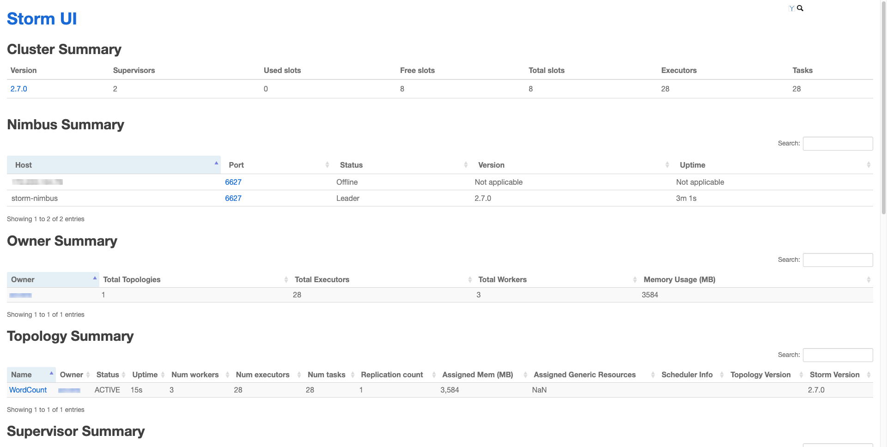

[Apache Storm](https://storm.apache.org/) is a distributed stream processing computation framework. It integrates with various systems and libraries, including Apache Kafka, Apache Cassandra, Redis, Amazon Kinesis, Kestrel, RabbitMQ/Advanced Message Queuing Protocol (AMQP), and Java Message Service (JMS).

This guide discusses key concepts and terminology associated with Apache Storm, and includes instructions for using it to create a real-time data stream.

## Apache Storm Components & Terminology

-   **Tuples**: In Storm, *tuples* serve as the main data structure. Tuples are named lists that can contain any type of values and are dynamically typed. They have helper methods to retrieve field values without casting. By default, Storm can serialize tuple values for primitives, strings, and byte arrays, though a custom serializer is needed for other types.

-   **Topologies**: A Storm *topology* is the logical framework for a real-time application. It functions similarly to a MapReduce job, but is designed to run indefinitely. Topologies are composed of spouts and bolts connected by stream groupings, as illustrated in the diagram below:

    

-   **Streams**: A *stream* is a sequence of tuples processed in parallel, capable of containing various data types. Each stream has a defined schema that specifies the fields within its tuples and can be assigned a unique ID.

-   **Spouts**: A *spout* acts as a source of streams in a topology. It reads tuples from an external source and emits them into the topology. Spouts are categorized as either "reliable" or "unreliable". Reliable spouts have the capability to replay a tuple if it fails to be processed, whereas unreliable spouts do not retain the tuple after it is emitted.

-   **Bolts**: *Bolts* perform the processing tasks in Storm, including filtering, aggregations, joins, and interactions with databases. Bolts can transform streams, and complex transformations often involve multiple bolts working together.

-   **Nodes**: Apache Storm consists of two primary types of *nodes*:

    -   **Nimbus** (Master Node): The central component responsible for running Storm topologies. Nimbus analyzes the topology and determines which tasks to execute.

    -   **Supervisor** (Worker Node): This node manages worker processes, monitors their health, ensures they are running correctly, and restarts them if necessary. It receives heartbeats from workers, reports to Nimbus, distributes tasks, and facilitates communication between workers and Nimbus. The Supervisor acts as a bridge between Nimbus and workers, ensuring tasks are executed correctly and keeping Nimbus updated on task status.

-   **ZooKeeper**: [Apache ZooKeeper](https://zookeeper.apache.org/) acts as a centralized server that helps manage and coordinate services for distributed applications. In this guide, ZooKeeper is installed on a separate, single node, however [ZooKeeper clusters](https://zookeeper.apache.org/doc/r3.3.3/zookeeperAdmin.html) can be configured for larger workloads.

## Before You Begin


The example cluster in this guide is recommended for development and testing, but it is **not** recommended for production systems. It can be expanded later using the necessary redundancies such as additional ZooKeeper and Nimbus instances, as well as tools like [**supervisord**](http://supervisord.org/).


1.  Using the instructions in our [Creating a Compute Instance](/docs/products/compute/compute-instances/guides/create/) guide and specifications below, create the **four** necessary instances to run an Apache Storm cluster (one for ZooKeeper, one for Nimbus, and two Storm Supervisors):

    -   **Images**: Use the latest Long Term Support (LTS) version of Ubuntu available for all nodes. The examples in this guide use **Ubuntu 24.04 LTS**.

    -   **Region**: Choose the geographic region best suited for your use case. The examples in this guide use the **Miami** (`us-mia`) region.

    -   **Linode Plan**: Below are the minimum specifications recommended for each node:

        -   **ZooKeeper Node**: Linode Shared 2 GB
        -   **Nimbus Node**: Linode Shared 4 GB
        -   **Storm Supervisor Node 1**: Linode Shared 4 GB
        -   **Storm Supervisor Node 2**: Linode Shared 4 GB

    -   **Linode Label**: Enter a descriptive label for each instance. The examples in this guide use the following:

        -   **ZooKeeper Node**: `storm-zoo`
        -   **Nimbus Node**: `storm-nimbus`
        -   **Storm Supervisor Node 1**: `storm-super-1`
        -   **Storm Supervisor Node 2**: `storm-super-2`

1.  Once deployed, follow our [Setting Up and Securing a Compute Instance](/docs/products/compute/compute-instances/guides/set-up-and-secure/) guide to update your system. You may also wish to set the timezone, configure your hostname, create a limited user account, and harden SSH access.


This guide is written for a non-root user. Commands that require elevated privileges are prefixed with `sudo`. If you’re not familiar with the `sudo` command, see the [Users and Groups](/docs/guides/linux-users-and-groups/) guide.


## Install Java On All Nodes

Both Python and Java are prerequisites for Storm and ZooKeeper. Ubuntu 24.04 LTS comes with Python version 3.12.3 installed by default, but Java must be installed manually.

On each deployed instance, follow the steps below to install Java.

1.  Install the Java Development Kit (JDK):

    ```command {title="storm-zoo, storm-nimbus, storm-super-1, and storm-super-2"}
    sudo apt install default-jdk
    ```

1.  Display the installed version to verify the Java installation:

    ```command {title="storm-zoo, storm-nimbus, storm-super-1, and storm-super-2"}
    java --version
    ```

    ```output
    openjdk 21.0.4 2024-07-16
    OpenJDK Runtime Environment (build 21.0.4+7-Ubuntu-1ubuntu224.04)
    OpenJDK 64-Bit Server VM (build 21.0.4+7-Ubuntu-1ubuntu224.04, mixed mode, sharing)
    ```

## Install ZooKeeper

Follow the steps in this section to install ZooKeeper on the `storm-zoo` instance.

1.  Use `wget` to download the latest stable version of ZooKeeper available on the [ZooKeeper release page](https://zookeeper.apache.org/releases.html). The examples in this guide use ZooKeeper version 3.8.4. If necessary, adjust the commands below according to your version:

    ```command {title="storm-zoo"}
    wget https://dlcdn.apache.org/zookeeper/zookeeper-/apache-zookeeper--bin.tar.gz
    ```

1.  Unpack the ZooKeeper tarball:

    ```command {title="storm-zoo"}
    tar -zxvf apache-zookeeper--bin.tar.gz
    ```

1.  Create a `zoo.cfg` ZooKeeper configuration file:

    ```command {title="storm-zoo"}
    nano ~/apache-zookeeper--bin/conf/zoo.cfg
    ```

    Give the file the following content, and save your changes:

    ```file {title="/opt/zookeeper/conf/zoo.cfg"}
    tickTime=2000
    dataDir=~/apache-zookeeper--bin/data
    clientPort=2181
    ```

1.  Create the `~/apache-zookeeper--bin/data` directory for data storage:

    ```command {title="storm-zoo"}
    mkdir ~/apache-zookeeper--bin/data
    ```

1.  Start ZooKeeper:

    ```command {title="storm-zoo"}
    ~/apache-zookeeper--bin/bin/zkServer.sh start
    ```

    ```output
    /usr/bin/java
    ZooKeeper JMX enabled by default
    Using config: /home//apache-zookeeper--bin/bin/../conf/zoo.cfg
    Starting zookeeper ... STARTED
    ```


The single-server ZooKeeper instance in this guide is suitable for development and testing purposes. For production, it is recommended to upgrade to a [replicated ZooKeeper cluster](https://zookeeper.apache.org/doc/r3.3.3/zookeeperStarted.html#sc_RunningReplicatedZooKeeper).

To help ZooKeeper detect failures and prevent issues, it is important to implement regular maintenance and supervision on each individual node. For example, this can help avoid problems like running out of storage due to old snapshots and log files.


## Set Up Storm on Nimbus and Supervisor Instances

This section provides instructions for downloading and installing Apache Storm on the `storm-nimbus`, `storm-super-1`, and `storm-super-2` instances.

1.  Download the [latest Storm release](https://storm.apache.org/downloads.html) on each specified instance. This guide uses Storm version 2.7.0. If necessary, adjust the commands for your version of Storm.

    ```command {title="storm-nimbus, storm-super-1, and storm-super-2"}
    wget https://dlcdn.apache.org/storm/apache-storm-/apache-storm-.tar.gz
    ```

1.  Once the Storm tarballs are present, unpack them:

    ```command {title="storm-nimbus, storm-super-1, and storm-super-2"}
    tar -zxvf apache-storm-.tar.gz
    ```

1.  Open your `.bashrc` file:

    ```command {title="storm-nimbus, storm-super-1, and storm-super-2"}
    nano ~/.bashrc
    ```

    Append the following lines the end of the file to add Storm's `bin` directory to your PATH. Save your changes when complete:

    ```file {title="~/.bashrc"}
    #Set PATH for Storm
    export PATH="$HOME/apache-storm-/bin:$PATH"
    ```

    Apply the changes to `.bashrc`:

    ```command {title="storm-nimbus, storm-super-1, and storm-super-2"}
    source ~/.bashrc
    ```

1.  Verify the Storm installation by checking the version:

    ```command {title="storm-nimbus, storm-super-1, and storm-super-2"}
    storm version
    ```

    ```output
    Running: java -client -Ddaemon.name= -Dstorm.options= -Dstorm.home=/home//apache-storm- -Dstorm.log.dir=/home//apache-storm-/logs -Djava.library.path=/usr/local/lib:/opt/local/lib:/usr/lib:/usr/lib64 -Dstorm.conf.file= -cp /home//apache-storm-/*:/home//apache-storm-/lib/*:/home//apache-storm-/extlib/*:/home//apache-storm-/extlib-daemon/*:/home//apache-storm-/conf org.apache.storm.utils.VersionInfo
    Storm 
    URL https://@github.com/apache/storm.git -r b95a7f25a114ae7fb9c23cbc2979d3cfff09fa73
    Branch v
    Compiled by rui on 2024-10-11T17:28Z
    From source with checksum dcefb62616ea3f989d583d962257084
    ```

## Edit the Storm Configuration on Nimbus and Supervisor Instances

The `storm.yaml` configuration file specifies the local directory for Storm's operation and defines the connection settings for ZooKeeper and Nimbus.

1.  Open the `storm.yaml` file on the `storm-nimbus`, `storm-super-1`, and `storm-super-2` instances:

    ```command {title="storm-nimbus, storm-super-1, and storm-super-2"}
    nano ~/apache-storm-/conf/storm.yaml
    ```

    Add the following lines to the end of the file. Replace  with the IP address for your `storm-zoo` instance and  with the IP address for your `storm-nimbus` instance.

    ```file {title="conf/storm.yaml"}
    storm.zookeeper.servers:
      - ""
    nimbus.seeds: [""]
    storm.local.dir: "~/apache-data"
    ```

    This defines the IP addresses of the ZooKeeper and Nimbus instances and sets the `/var/storm` directory for Storm's state and temporary files. Refer to the [Storm Setup Guide](https://github.com/apache/storm/blob/master/docs/Setting-up-a-Storm-cluster.md#fill-in-mandatory-configurations-into-stormyaml) for more details.

    When done, save your changes.

1.  On your `storm-zoo` instance, create the `~/storm-data` directory for Storm's application data:

    ```command {title="storm-zoo"}
    mkdir ~/storm-data
    ```

## Start Storm

1.  On the `storm-super-1` and `storm-super-2` instances, execute the following command to run Storm as a Supervisor daemon:

    ```command {title="storm-super-1 & storm-super-2"}
    storm supervisor &
    ```

1.  On the `storm-nimbus` instance, execute the following commands to run Storm as a nimbus daemon and run the Storm UI web server:

    ```command {title="storm-nimbus"}
    storm nimbus &
    storm ui &
    ```

1.  Open a web browser on your local machine and navigate to port `8080` of the `storm-nimbus` instance's public IP address:

    ```command {title="Local machine"}
    http://:8080
    ```

    The web site at that address shows the status of the cluster:

    

## Create the Message Stream

The site above shows no topologies, and therefore has no message streams. The [`storm-starter`](https://github.com/apache/storm/blob/master/examples/storm-starter/README.markdown) sample, located in the `apache-storm-/examples/` directory, can solve this. It contains a variety of Storm topologies, including one titled `WordCount` that is used as an example below.

1.  On the `storm-nimbus` instance, use `wget` to download the latest version of [Apache Maven](https://maven.apache.org/). This guide uses Maven version 3.9.9.

    ```command {title="storm-nimbus"}
    wget https://dlcdn.apache.org/maven/maven-3//binaries/apache-maven--bin.tar.gz
    ```

1.  Unpack the downloaded archive file:

    ```command {title="storm-nimbus"}
    tar xzvf apache-maven--bin.tar.gz
    ```

1.  Open your `.bashrc` file:

    ```command {title="storm-nimbus"}
    nano ~/.bashrc
    ```

    Add Maven's `bin` directory to your PATH, and save your changes:

    ```file {title="~/.bashrc"}
    #Set PATH for Maven
    export PATH="$HOME/apache-maven-/bin:$PATH"
    ```

1.  Apply the changes to `.bashrc`:

    ```command {title="storm-nimbus"}
    source ~/.bashrc
    ```

1.  Verify the Maven installation by checking the version:

    ```command {title="storm-nimbus"}
    mvn -v
    ```

    ```output
    Apache Maven 3.9.9 (8e8579a9e76f7d015ee5ec7bfcdc97d260186937)
    Maven home: /home//apache-maven-3.9.9
    Java version: 21.0.4, vendor: Ubuntu, runtime: /usr/lib/jvm/java-21-openjdk-amd64
    Default locale: en_US, platform encoding: UTF-8
    OS name: "linux", version: "6.8.0-47-generic", arch: "amd64", family: "unix"
    ```

1.  Issue the following commands to change into the `~/apache-storm-/examples/storm-starter` directory and build a Storm "uber JAR":

    ```command {title="storm-nimbus"}
    cd ~/apache-storm-/examples/storm-starter
    mvn package
    ```

    After a few minutes, you should see a success message towards the bottom of the output:

    ```output
    ...
    [INFO] BUILD SUCCESS
    ...
    ```

    The JAR file you built is located at `~/apache-storm-/examples/storm-starter/target/storm-starter-.jar`.

## Submit the Example Topology

The [`storm jar`](https://github.com/apache/storm/blob/master/examples/storm-starter/README.markdown#packaging-storm-starter-for-use-on-a-storm-cluster) command allows you to choose a topology from the "uber JAR" and submit that to your cluster.

1.  On the `storm-nimbus` instance, use the following command to submit the `WordCount` topology:

    ```command {title="storm-nimbus"}
    storm jar ~/apache-storm-/examples/storm-starter/target/storm-starter-.jar org.apache.storm.starter.WordCountTopology WordCount
    ```

1.  On your local machine, return to your web browser and refresh the page located at port `8080` of the `storm-nimbus` instance:

    ```command {title="Local machine"}
    http://:8080
    ```

    The Storm UI page should now show **WordCount** under the **Topology Summary** section:

    