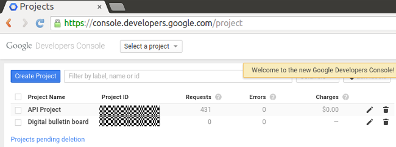
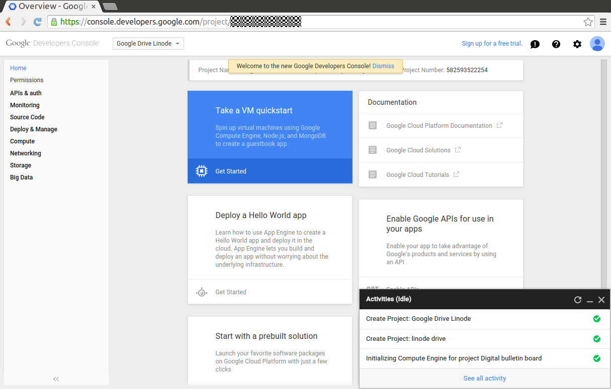
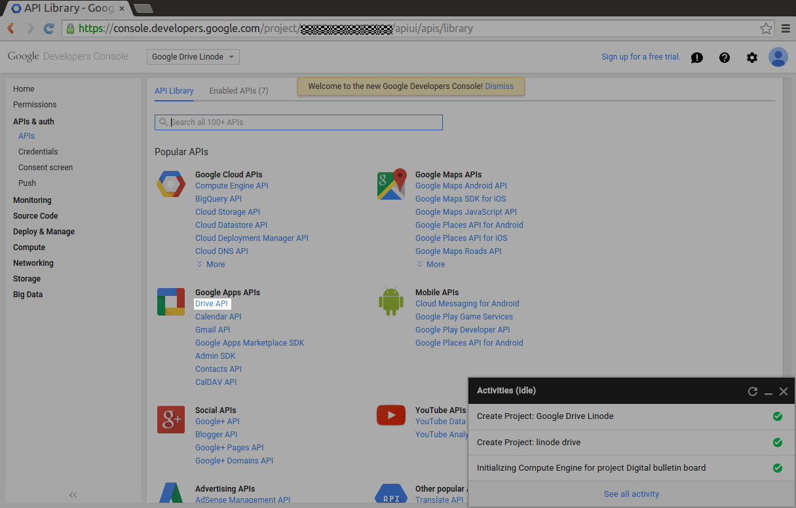
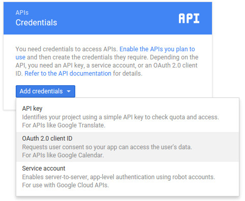
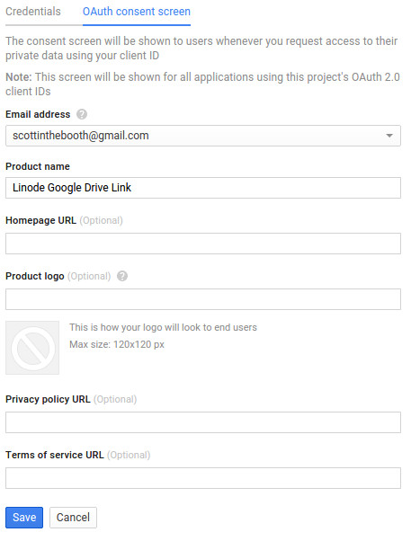
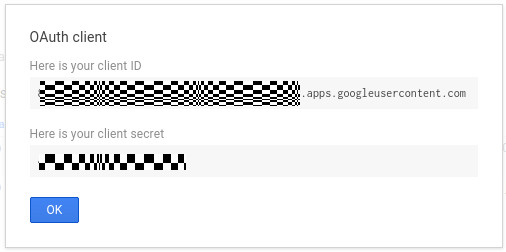
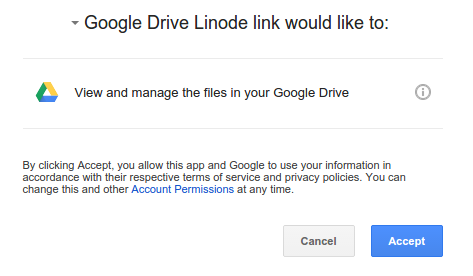

If you've used Google Drive, you know that it can be an indispensable tool for remote file access. While one of the standard counter-arguments to remote storage is "just carry a flash drive," that only works until you need to add a file to your Linode. This guide will show you how to install and configure a great piece of free software to access your Google Drive from your Linode running Ubuntu version 14.04 or newer.

**Google-drive-ocamlfuse (OCamlfuse)** uses the Drive API to scan and access your Google Drive contents. A majority of the following steps involve authorizing its use and applying that authorization to the copy running on your Linode. Once it has been installed and authorized, you will have real-time access to your Google Drive via Linode.

Before beginning, you should be familiar with our [Setting Up and Securing a Compute Instance](/docs/products/compute/compute-instances/guides/set-up-and-secure/) guide, particularly if your Google Drive contains sensitive personal information. This guide is intended to be run as a non-root user, with sudo privileges required for some steps.

## Install Software

First, we will add the repository where OCamlfuse lives in our Linode. Once that's done, we update so the changes are visible to us and then install normally.

1.  Add the repository:

        sudo add-apt-repository ppa:alessandro-strada/ppa

2.  Update apt:

        sudo apt-get update

3.  Install the application:

        sudo apt-get install google-drive-ocamlfuse

## Access the Google Drive API

Next, we're going to enable API access to Google Drive and create a set of credentials. These steps require a web browser on your local computer, and access to the Google account with which your Drive is associated.

1.  Visit the Google API developer's console on your desktop at https://console.developers.google.com/project

    

2.  Create a project. Click **Create Project**, then give the project a name and click **Create** again:

    

    Google will take a moment to create the project, and when it's complete you'll arrive at the dashboard:

    

3.  Enable the Google Drive API. Click **APIs & auth**, then **APIs** when the menu expands. You'll see a list like the one below. Click on **Drive API**:

    

    If you don't see the **Drive API** on the list as pictured, you may need to search for it. After you've selected it, click the blue **Enable** button at the top of the page.

    

4.  Click **Credentials** in the menu on the left side of the page. Then click **Add New Credential**.

    

    Click **Configure consent screen**. Google assumes you are writing a piece of software so it wants some information about it.

    

    The product name field is required, but you can leave everything else blank. Then click **Save** at the bottom of the page.

    

    Now click **Other** for the application type. Google will ask for a name again - you may use the default or choose a name you'll easily associate with this project. Then click **Create**.

    

    Click **Credentials** on the menu on the left side of the screen, and select your project from the list. You will now be able to view your **Client ID** and **Client secret** strings:

    

## Authorize OCamlfuse Access

Next, we'll provide the credentials for your Drive API to OCamlfuse in your Linode, authorizing it to access your Google Drive.

1.  Authorize your Google Drive link, replacing `client-ID` and `client-secret` with those you received from the Google API Manager in the steps above:

        google-drive-ocamlfuse -headless -label me -id client-ID -secret client-secret

    The output from this command will give you a long URL. Copy it and paste it for use in step 2:

        Please, open the following URL in a web browser: https://accounts.google.com/o/oauth2/auth?client_id=URL_SNIPPED
        Please enter the verification code:

2.  Google will ask for permission to allow this new application (OCamlfuse) to access your Google Drive. Click **Accept** to receive the verification code:

    

3.  Copy/paste the verification code back to OCamlfuse in your Linode.

## Choose Where Google Drive Will Mount

The following steps will create an empty directory where Google Drive will live. All of your Google Drive files and folders will appear here.

1.  Create a mount point. The following will create it in your home folder, but you may choose a different path:

        mkdir ~/google-drive

2.  Mount your Google Drive:

        google-drive-ocamlfuse -label me google-drive

And you're done! The directory `google-drive` will now reflect the contents of your Google Drive! The first time you access the folder it may take a few minutes to synchronize, depending on the content on your drive. However, after the initial sync, access is almost immediate.

## Troubleshooting

If the contents of your Google Drive do not load automatically, it's likely that your credentials have expired. If this happens:

1.  On your local computer, visit **http://console.developers.google.com** If you've created other projects on the Developers Console, be sure to select the one you created above.

2.  Click **APIs & Auth**.

3.  Click **Credentials** from the menu on the left side of the page. From there, select the client ID from the list, which will be identified by your project name.

4.  Click **Reset secret**.

5.  Repeat the steps to [authorize OCamlfuse access on your Linode](#authorize-ocamlfuse-access).

6.  Remount your Google Drive:

        google-drive-ocamlfuse -label me google-drive
