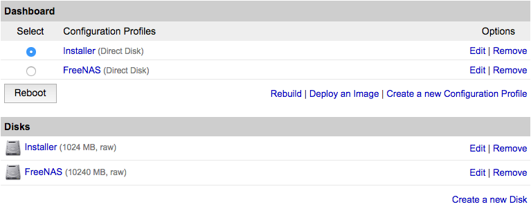
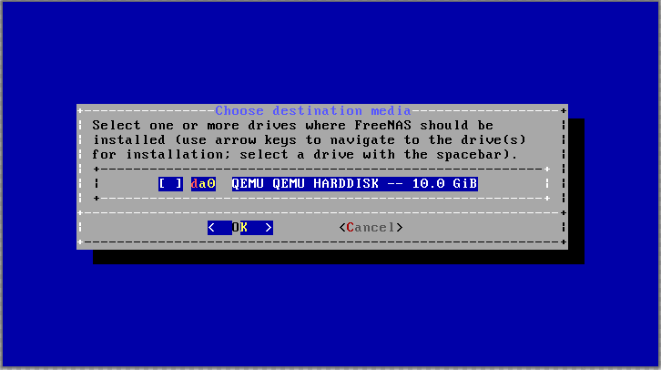
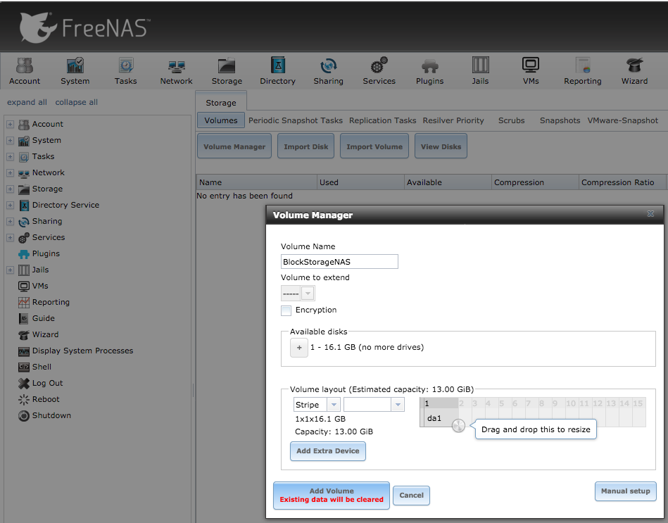
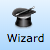
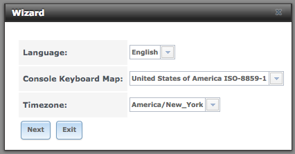
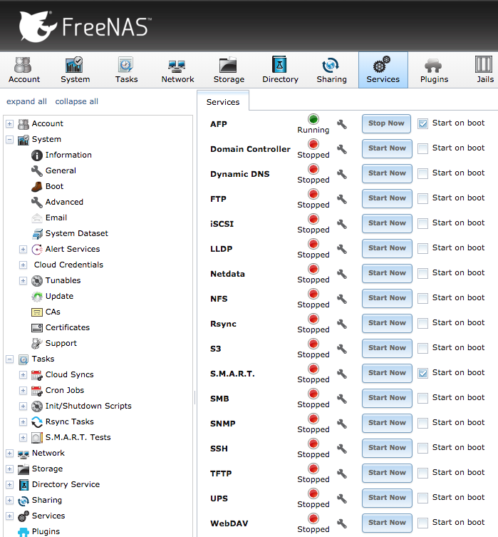

Network-attached storage (NAS) allows multiple client devices to access the connected storage media as though it's stored locally to the device. FreeNAS is FreeBSD-based NAS software, configurable via a browser interface.

This guides shows how to install FreeNAS on a Linode and attach a [Block Storage Volume](/docs/products/storage/block-storage/) so that you can access both FreeNAS and the Storage Volume from your computer, phone, or tablet almost anywhere in the world.


FreeNAS is not officially supported by Linode at this time. This means that features like the [Linode Backup Service](/docs/platform/backup-service) and Lish will be unavailable to you.

Any issues you may encounter with FreeNAS on your Linode are outside the scope of Linode Support. For further help with this guide's subject, you can ask questions on the [Linode Community Site](https://www.linode.com/community/questions/).


## Prepare Your Linode

1.  Create a Linode in your preferred data center. Ensure that your Linode has at least 8GB RAM and at least 11GB of available disk space. FreeNAS recommends 16GB of RAM for media servers. Visit the [official requirements](http://www.freenas.org/hardware-requirements/) for more information.

2.  Disable the [Lassie Shutdown Watchdog](/docs/uptime/monitoring-and-maintaining-your-server/#configure-shutdown-watchdog/) to prevent it from attempting to restart your Linode without your input. You can disable Lassie in the **Settings** tab of the Linode Manager under **Shutdown Watchdog**.

3.  [Create two disks](/docs/guides/disks-and-storage/#creating-a-disk):

    1.  **Label:** Installer
        * **Type:** unformatted / raw
        * **Size:** 1024

    2.  **Label:** FreeNAS
        * **Type:** unformatted / raw
        * **Size:** Can be set to use remaining disk. At least 10240MB

4.  [Create two configuration profiles](/docs/guides/linode-configuration-profiles/#creating-a-configuration-profile) with the following settings. In each profile, disable all of the options under **Filesystem/Boot Helpers**.

    1.  **Label:** Installer
        * **Kernel:** Direct Disk
        * **/dev/sda:** FreeNAS
        * **/dev/sdb:** Installer
        * **root / boot device:** Standard /dev/sdb
        * **Filesystem/Boot Helpers:** Select No for each Helper

    2. **Label:** FreeNAS
        * **Kernel:** Direct Disk
        * **/dev/sda:** FreeNAS
        * **root / boot device:** Standard /dev/sda
        * **Filesystem/Boot Helpers:** Select No for each Helper

## Create an Installer Disk

1.  Boot into **Rescue Mode** with the installer disk mounted to `/dev/sda` and access your Linode using [Lish](/docs/guides/using-the-lish-console/) from the dashboard of your Linode from the Linode Cloud Manager.

2.  Once in Rescue Mode, run the following command to set the [latest FreeNAS release](http://www.freenas.org/download-freenas-release/) (11.1 at the time of this writing) as a variable:

        iso=https://download.freenas.org/11/latest/x64/FreeNAS-11.1-U4.iso

3.  Run the `update-ca-certificates` program to allow the secure download:

        update-ca-certificates

4.  Download the FreeNAS ISO image and expand it to the Installer disk:

        curl $iso | dd of=/dev/sda

5.  When the command finishes, reboot into the **Installer profile**:

    

6.  Go to the Linode Cloud Manager and access the dashboard for your Linode.

7.  Click the **Launch Console** link to access the [Glish](/docs/guides/using-the-linode-graphical-shell-glish/) console and start the installation.

## Install FreeNAS

1.  Press **Enter** to Install/Upgrade.
2.  Press the **Spacebar** to select the FreeNAS disk (`da0` in this screenshot) and press **Enter**:

    

3.  The installation shows a warning that all data on the disk will be deleted. Press **Enter** to continue.
4.  Enter a root password, tab to the next field to re-enter it, and press **Enter** to continue.
5.  Press **Enter** to Boot via BIOS.
6.  There's no media to remove. Press **Enter** to acknowledge the successful installation message.
7.  Press **4** to select Shutdown System, and press **Enter** to end the session. Close the Glish window.
8.  In the Manager, shut the Linode down.

## Boot and Configure FreeNAS

1.  Select the FreeNAS configuration profile, and click **Boot**:

    

    SSH and Lish are disabled in FreeNAS. Use Glish to monitor the first boot which takes several minutes. Once booted, close Glish and proceed to the next step to use the web interface for configuration.

2.  Use a web browser to navigate to the Linode's IP address. Log in with the user `root` and the password set in Step 4 of the previous section. Close any popup menu that appears when you first log in.

3.  Click the **Network** icon and complete the network information using the Default Gateways and DNS Resolvers found in the Networking tab of the Linode Cloud Manager. Use the DNS Resolvers information to fill in the Nameserver fields. Click **Save** before continuing.

4.  Select the **Interfaces** section of the Network tab, and click **Add Interface**. Name the interface and enable DHCP, then click **OK**.

## Add a Block Storage Volume to FreeNAS

1.  [Add or attach a Block Storage Volume](/docs/products/storage/block-storage/guides/manage-volumes/) to the Linode. After you attach your Block Storage Volume, the Linode Manager will present command-line instructions for mounting it from your Linode, but you can disregard these.

2.  Reboot the Linode from the Linode Manager. After a few minutes, launch Glish from the dashboard again. You can monitor the reboot progress in Glish.

### Format Block Storage Volume as ZFS


Formatting will erase all data on the volume.


1.  Log back into the web interface for FreeNAS.

2.  Click the **Storage** icon at the top, then **View Disks** to confirm that FreeNAS recognized the Block Storage Volume.

3.  Return to the **Storage** tab and click **Volume Manager**. Enter a Volume Name and under Available Disks click the **+** next to the Block Storage Volume. Below Volume layout, select **Stripe**. Click **Add Volume** to format and attach the Volume:

    

### Set Permissions, Share the Volume, and Complete Configuration

1.  Click the Wizard icon:

    

2.  Select your language, keyboard map, and timezone and click **Next**:

    

3.  When prompted for the Directory Service, press **Next** to skip the step.

4.  Enter a Share name and purpose. Click **Ownership** to configure the Permissions to allow the client to access and manage access. Visit the [official FreeNAS documentation](http://doc.freenas.org/11/storage.html#change-permissions) for more information about the available options. Click **Add**, then **Next** to continue.

5.  Configure e-mail notification settings or press **Next** to skip and continue.

6.  Press **Confirm** and the Wizard will complete the remaining configuration.

## Enable SSH Root Login (Optional)

FreeNAS has SSH disabled by default. This is a more secure configuration, but makes it difficult to troubleshoot issues from the command line.

1.  Click the **Services** icon, then the wrench icon on the SSH line:

    

2.  Check **Login as Root with password** and press **OK**. Check **Start on Boot** if you would like to keep the setting enabled through future reboots. Click **Start Now**.

    Use the same username and password as for the web interface.

## Next Steps

Now that FreeNAS is running connected to your Block Storage Volume, you can [connect to it from your local machine](http://doc.freenas.org/11/sharing.html), to a [Plex server](http://www.freenas.org/blog/plex-on-freenas/), or a variety of other platforms using [plugins](http://doc.freenas.org/11/plugins.html#available-plugins).
