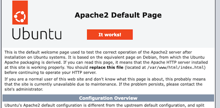
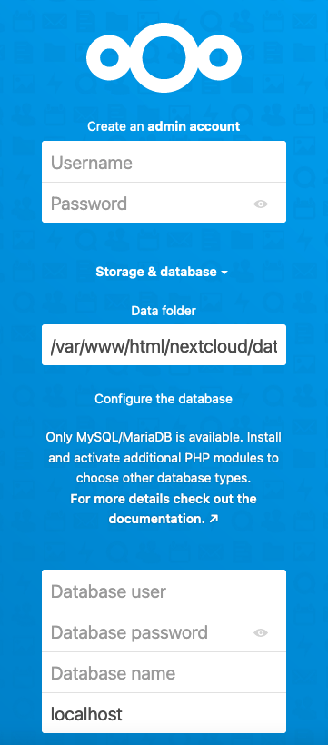
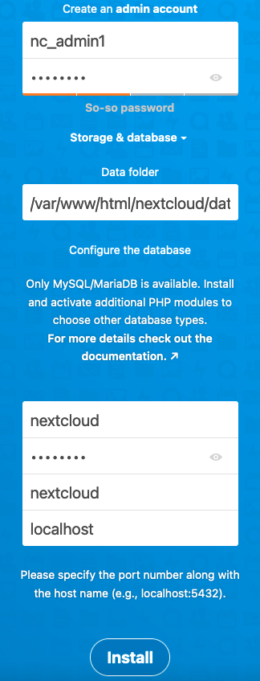
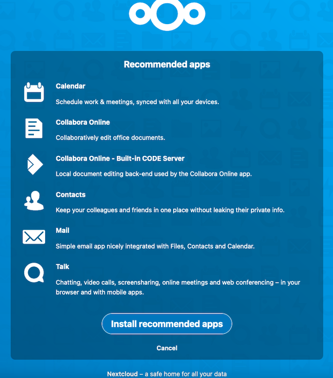
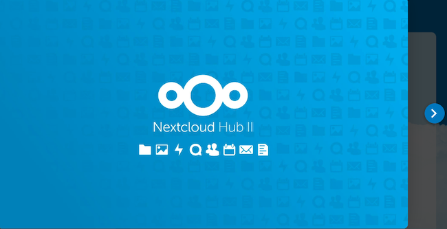
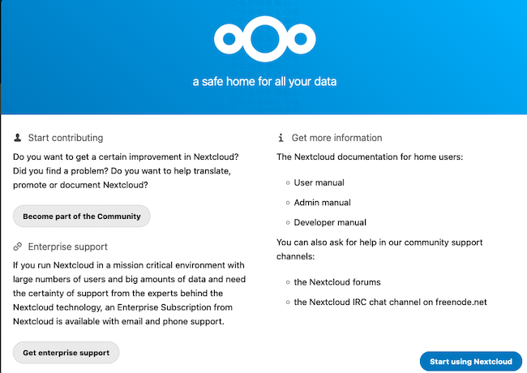
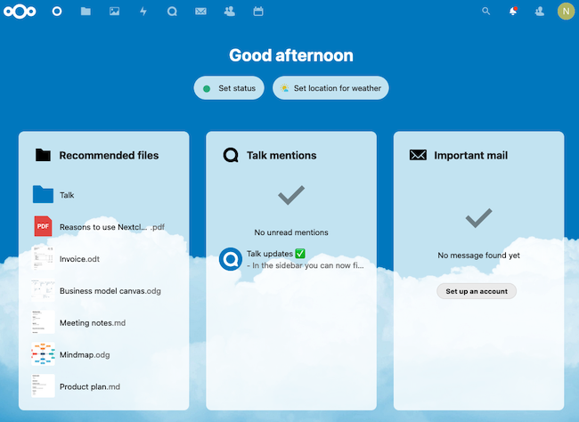
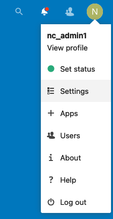
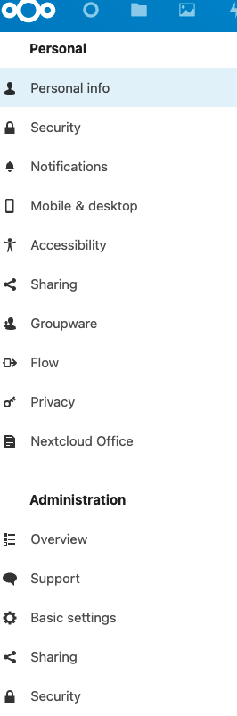
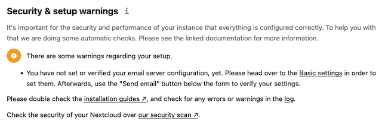

[Nextcloud](https://nextcloud.com/) is a free and open source application for storing and sharing files. It allows approved users to access documents and pictures online from a central location. Nextcloud is considered a strong alternative to Dropbox and Google Drive. This guide explains how to download, install, and configure Nextcloud on Ubuntu 22.04 LTS. It also explains how to configure an Ubuntu LAMP stack to support Nextcloud.

## What is Nextcloud?

Nextcloud advertises itself as a safe home for user data and documents. Developed with an open source philosophy in mind, Nextcloud provides users with much more control and flexibility than the alternatives. Some of the main advantages of Nextcloud include:

- Users can host documents on their own server and do not have to rely on other vendors for hosting.
- Finely-grained file access and sharing controls, along with workflow and audit logs.
- Included full-text search engine that can query the entire collection of files.
- Able to monitor and record all data exchanges and communications.
- Offers end-to-end client side encryption and key handling.
- Includes real-time notifications, comments, and multi-user editing.
- Prioritizes security through third-party reviews and a well-funded Security Bug Bounty program.
- Works together with the developer and user communities to develop, optimize, and test new features.
- Has an [app store](https://apps.nextcloud.com/) where users can download additional extensions and customizations.

See the [Nextcloud feature comparison](https://nextcloud.com/compare/) for a more complete analysis. For complete information on how to use Nextcloud, consult the [Nextcloud product documentation](https://docs.nextcloud.com/server/24/admin_manual/contents.html).

## Before You Begin

1. If you have not already done so, create a Linode account and Compute Instance. See our [Getting Started with Linode](/docs/products/platform/get-started/) and [Creating a Compute Instance](/docs/products/compute/compute-instances/guides/create/) guides.

1. Follow our [Setting Up and Securing a Compute Instance](/docs/products/compute/compute-instances/guides/set-up-and-secure/) guide to update your system. You may also wish to set the timezone, configure your hostname, create a limited user account, and harden SSH access.

1. A LAMP Stack, including an Apache web server, a MariaDB/MySQL RDBMS, and the PHP programming language, must be installed before Nextcloud can be used. This guide includes instructions for installing the LAMP stack components. More information about installing a LAMP stack is available in the [Linode guide to installing a LAMP stack on Ubuntu 22.04](/docs/guides/how-to-install-a-lamp-stack-on-ubuntu-22-04/).

1. To properly use Nextcloud and secure the installation with HTTPS, configure a domain name for the server. For information on domain names and pointing the domain name to a Linode, see the [Linode DNS Manager guide](/docs/products/networking/dns-manager/).


This guide is written for a non-root user. Commands that require elevated privileges are prefixed with `sudo`. If you are not familiar with the `sudo` command, see the [Users and Groups](/docs/guides/linux-users-and-groups/) guide.


## Installing the Nextcloud Prerequisites

Nextcloud requires a LAMP stack to work properly. This section provides instructions on how to install the Apache web server, MariaDB RDBMS, and the PHP programming languages. While these instructions are geared towards Ubuntu 22.04 users, they are also broadly applicable to Ubuntu 20.04.


Nextcloud only recently added support for PHP 8.1 in version 24. PHP 8.1 is the default PHP library package in Ubuntu 22.04. Earlier versions of Nextcloud must use PHP 7.4. This might require a downgrade of the local PHP packages.


### Installing the Apache Web Server

To install and test an Apache web server on Ubuntu 22.04, follow these instructions.

1. Update and upgrade the Ubuntu packages:

    ```command
    sudo apt update && sudo apt upgrade
    ```

1. Install the Apache web server using `apt`:

    ```command
    sudo apt install apache2
    ```

1. Configure the `ufw` firewall to allow the `Apache Full` profile. This permits HTTP and HTTPS connections, enabling web access. `OpenSSH` connections must also be allowed. Enable `ufw` when all changes are complete.

    ```command
    sudo ufw allow OpenSSH
    sudo ufw allow in "Apache Full"
    sudo ufw enable
    ```

    
The `Apache Full` profile permits HTTP and HTTPS traffic. To temporarily restrict web traffic to HTTP requests, use the `Apache` profile instead. The `Apache Secure` profile blocks HTTP requests and only permits HTTPS traffic through. Do not use this profile before enabling HTTPS on the server.
    

1. Verify the firewall settings using the `ufw status` command:

    ```command
    sudo ufw status
    ```

    ```output
    Status: active

    To                         Action      From
    --                         ------      ----
    OpenSSH                    ALLOW       Anywhere
    Apache Full                ALLOW       Anywhere
    OpenSSH (v6)               ALLOW       Anywhere (v6)
    Apache Full (v6)           ALLOW       Anywhere (v6)
    ```

1. Enable the `mpm_prefork` Apache module and disable `mpm_event`:

    ```command
    sudo a2dismod mpm_event
    sudo a2enmod mpm_prefork
    ```

1. Restart Apache using the `systemctl` utility:

    ```command
    sudo systemctl restart apache2
    ```

1. Ensure the web server is still active using `systemctl`:

    ```command
    sudo systemctl status apache2
    ```

1. Visit the IP address of the web server and confirm the server is working properly:

    ```command
    http://your_IP_address/
    ```

    
Use the Linode Dashboard to find the IP address for the Ubuntu system.
    

    The default Ubuntu/Apache2 welcome page appears in the browser. The page features the message "It works" and details some basic information about the server:

    

For more information about configuring the Apache HTTP Server, see the [Apache Documentation](https://httpd.apache.org/docs/2.4/).

### Installing the MariaDB RDBMS

Nextcloud stores its information inside an RDBMS, such as MySQL or MariaDB. This guide uses MariaDB. MariaDB is very similar to MySQL, but it more closely follows the open source philosophy. MariaDB provides more features than MySQL does. It also has better performance and usability.

To install MariaDB on Ubuntu 22.04, follow the steps in this example.

1. Install MariaDB using `apt`:

    ```command
    sudo apt install mariadb-server
    ```

1. Verify the status of MariaDB to ensure it is installed correctly:

    ```command
    sudo systemctl status mariadb
    ```

1. Enable MariaDB in `systemctl` so it automatically activates upon server boot up:

    ```command
    sudo systemctl enable mariadb
    ```

1. Configure and secure MariaDB using the `mysql_secure_installation` utility:

    ```command
    sudo mysql_secure_installation
    ```

    Enter your password. It is not necessary to switch to Unix socket authentication or change the root password. Answer `Y` to the following questions:

    - `Remove anonymous users?`
    - `Disallow root login remotely?`
    - `Remove test database and access to it?`
    - `Reload privilege tables now?`

For further information about MariaDB, consult the [MariaDB Server Documentation](https://mariadb.com/kb/en/documentation/).

### Creating the Nextcloud database in MariaDB

When MariaDB is installed, create a new database for Nextcloud to use. It is also necessary to create a user for the database and grant this user additional permissions. To configure the database, follow these instructions.

1. Log into MariaDB as the `root` user. If you added a root password, provide it when requested. The MariaDB prompt appears.

    ```command
    sudo mysql -u root
    ```

    ```output
    Welcome to the MariaDB monitor.  Commands end with ; or \g.
    Your MariaDB connection id is 37
    Server version: 10.6.7-MariaDB-2ubuntu1.1 Ubuntu 22.04

    Copyright (c) 2000, 2018, Oracle, MariaDB Corporation Ab and others.

    Type 'help;' or '\h' for help. Type '\c' to clear the current input statement.

    MariaDB [(none)]>
    ```

1. Create the `nextcloud` database. For this and all remaining commands, MariaDB should reply with `Query OK`.

    ```command
    CREATE DATABASE nextcloud;
    ```

1. Use the `SHOW DATABASES` command to ensure the database has been properly created:

    ```command
    SHOW DATABASES;
    ```

    ```output
    +--------------------+
    | Database           |
    +--------------------+
    | information_schema |
    | mysql              |
    | nextcloud          |
    | performance_schema |
    | sys                |
    +--------------------+
    5 rows in set (0.001 sec)
    ```

1. Create a user and grant them all rights to access the database. In place of `password`, provide a more secure password.

    ```command
    GRANT ALL PRIVILEGES ON nextcloud.* TO 'nextcloud'@'localhost' IDENTIFIED BY 'password';
    ```

1. Flush the privileges to apply the recent changes:

    ```command
    FLUSH PRIVILEGES;
    ```

1. Exit the database:

    ```command
    quit
    ```

### Installing PHP and Other Components

Nextcloud uses the PHP programming language. Nextcloud version 24 supports PHP release 8.1. This is also the default release of PHP in the Ubuntu packages, so the regular `php` package can be installed. However, PHP 7.4 is required to use earlier versions of Nextcloud.


To install PHP 7.4, substitute `php7.4` in place of `php` for all packages. For example, `php-cli` becomes `php7.4-cli`.


To install PHP and the other required packages, use these commands.

1. Install the core PHP package using `apt`:

    ```command
    sudo apt install php
    ```

1. Confirm the PHP release number:

    ```command
    php -v
    ```

    ```output
    PHP 8.1.2-1ubuntu2.6 (cli) (built: Sep 15 2022 11:30:49) (NTS)
    ```

1. Install the remaining PHP components:

    ```command
    sudo apt install php-apcu php-bcmath php-cli php-common php-curl php-gd php-gmp php-imagick php-intl php-mbstring php-mysql php-zip php-xml
    ```

1. Enable the necessary PHP extensions:

    ```command
    sudo phpenmod bcmath gmp imagick intl
    ```

1. Install the `unzip` utility. This utility might already be installed on the system.

    ```command
    sudo apt install unzip
    ```

1. Install the `libmagic` package:

    ```command
    sudo apt install libmagickcore-6.q16-6-extra
    ```

## Downloading, Installing, and Configuring Nextcloud

Nextcloud can be downloaded using `wget`. After unzipping the downloaded file, a virtual host must be created for Nextcloud. Some additional configurations and optimizations must also be applied to the system.

### Downloading and Installing Nextcloud

To download and install Nextcloud, follow these steps.

1. Download Nextcloud using `wget`. To find the URL for the latest stable release of Nextcloud, visit the [Nextcloud installation page](https://nextcloud.com/install/). This page provides a link to the latest Nextcloud zip file. To locate a particular release of Nextcloud, consult the [Nextcloud changelog and archive](https://nextcloud.com/changelog/). The following example demonstrates how to download the Nextcloud release 24.0.1.

    ```command
    wget https://download.nextcloud.com/server/releases/nextcloud-24.0.1.zip
    ```

1. Unzip the archive. This creates a `nextcloud` folder in the same directory as the zip file.

    ```command
    unzip nextcloud-24.0.1.zip
    ```

1. **(Optional)** Delete or rename the archive after unzipping the contents. It is also possible to rename the `nextcloud` directory to a more meaningful name, such as `nextcloud.yourdomainname`.

1. Change the folder permissions for the `nextcloud` directory:

    ```command
    sudo chown -R www-data:www-data nextcloud
    ```

1. Move the new directory to the server directory. The server directory usually defaults to `/var/www/html` on most servers.

    ```command
    sudo mv nextcloud /var/www/html
    ```

1. Disable the default Apache landing page:

    ```command
    sudo a2dissite 000-default.conf
    ```

    
Ignore the advisory to reload Apache at this time. Apache should be reloaded later when all configuration is complete.
    

### Creating a Virtual Host File for Nextcloud

This section explains how to configure a virtual host file for the Nextcloud application. The virtual host tells Apache how to handle and serve requests for the Nextcloud domain.

1. Create a new file in the `etc/apache2/sites-available` directory and name the file `nextcloud.conf`:

    ```command
    sudo nano /etc/apache2/sites-available/nextcloud.conf
    ```

1. The file must include the following information. The `DocumentRoot` is the name of the server directory followed by `/nextcloud`. For the `ServerName` attribute, enter the actual name of the domain instead of `example.com`. Save the file when all changes have been made.

    ```file {title="/etc/apache2/sites-available/nextcloud.conf" lang="aconf"}
    <VirtualHost *:80>
        DocumentRoot "/var/www/html/nextcloud"
        ServerName example.com

        <Directory "/var/www/html/nextcloud/">
            Options MultiViews FollowSymlinks
            AllowOverride All
            Order allow,deny
            Allow from all
        </Directory>

        TransferLog /var/log/apache2/nextcloud_access.log
        ErrorLog /var/log/apache2/nextcloud_error.log

    </VirtualHost>
    ```

1. Enable the site. Do not reload Apache yet.

    ```command
    sudo a2ensite nextcloud.conf
    ```

    ```output
    Enabling site nextcloud.
    ```

### Optimizing PHP for Nextcloud

The default PHP implementation is fine for most applications. But certain PHP settings must be adjusted to allow for peak Nextcloud performance and operations. To make the necessary adjustments, follow these steps.

1. Edit the `php.ini` file and make the following changes. In some cases, the parameter might be commented out and must be uncommented. To uncomment a parameter, delete the `;` character at the start of the line. Leave the remaining lines unchanged.

    
To locate the correct timezone for the `date.timezone` parameter, consult the [PHP timezone documentation](https://www.php.net/manual/en/timezones.europe.php).

If the server is running an earlier PHP release, substitute the actual release number in place of `8.1` in the filename. For example, to configure PHP 7.4, the filename is `/etc/php/7.4/apache2/php.ini`
    

    ```command
    sudo nano /etc/php/8.1/apache2/php.ini
    ```

    ```file {title="/etc/php/8.1/apache2/php.ini"}
    max_execution_time = 360
    memory_limit = 512M
    post_max_size = 200M
    upload_max_filesize = 200M
    date.timezone = Europe/London
    opcache.enable=1
    opcache.memory_consumption=128
    opcache.interned_strings_buffer=8
    opcache.max_accelerated_files=10000
    opcache.revalidate_freq=1
    opcache.save_comments=1
    ```

1. Enable some additional Apache modules:

    ```command
    sudo a2enmod dir env headers mime rewrite ssl
    ```

1. Restart the Apache server:

    ```command
    sudo systemctl restart apache2
    ```

1. Verify the Apache server status and ensure it is still `active`. If the server is in a failed state, examine the server error logs and make any necessary changes to the `/etc/apache2/sites-enabled/nextcloud.conf` file.

    ```command
    sudo systemctl status apache2
    ```

## Setting up Nextcloud Using the Web Interface

The remaining Nextcloud configuration tasks can be accomplished using the web interface. To configure and activate Nextcloud, follow these steps.

1. Visit the domain associated with the server. The Nextcloud configuration page appears in the browser window. In the following example, replace `example.com` with the name of the domain: `http://example.com/`.

    

1. On this page, perform the following tasks:

    - Create an administrative account. Provide a user name and password for the account.
    - Leave the address for the **Data Folder** at the current value.
    - In the **Configure the database** section, add information about the `nextcloud` database. Enter the user name and password for the account created in MariaDB earlier. The database name is `nextcloud`. Leave the final field set to `localhost`.
    - Click **Install** to complete the form.

    

1. Nextcloud proceeds to set up the application. This might take a minute or two. On the next page, Nextcloud asks whether to install a set of recommended applications. Click **Install recommended apps** to continue.

    

1. Nextcloud displays a series of welcome slides. Click the right arrow symbol on the right-hand side of the page to walk through the slides. Read through each slide, recording any important information.

    

1. On the final welcome page, select **Start using Nextcloud** to proceed to the Nextcloud dashboard.

    

1. The browser now displays the Nextcloud Dashboard page.

    

## Securing and Optimizing Your Nextcloud Application

Nextcloud is now ready to use. However, it is not as secure or as efficient as it could be. For a better Nextcloud experience, enable the *Hypertext Transfer Protocol Secure* (HTTPS) protocol using the [Certbot](https://certbot.eff.org/) application. There are also a few more changes to add to the `config.php` file.

### Setting up a SSL Certificate for Nextcloud (Optional)

Nextcloud works even without the *Hypertext Transfer Protocol Secure* (HTTPS) protocol. However, HTTPS is highly recommended, and Nextcloud displays some warnings on the "Settings" page if it is not configured. HTTPS encrypts information using the *Secure Sockets Layer* (SSL) technology to help secure the Nextcloud data.

The Linode server must possess a signed public-key certificate from a trusted certificate authority before it can accept HTTPS requests. Most Ubuntu administrators use Certbot to install SSL certificates. Certbot is a free and open source tool for automating the process of requesting [Let's Encrypt](https://letsencrypt.org/) certificates for a website.

To configure HTTPS for the domain, follow these steps.

1. Update Snap, which is pre-installed on Ubuntu 22.04. Snap is used to download application bundles.

    ```command
    sudo snap install core && sudo snap refresh core
    ```

1. To avoid conflicts, remove the default Ubuntu Certbot package:

    ```command
    sudo apt remove certbot
    ```

1. Use `snap` to install Certbot:

    ```command
    sudo snap install --classic certbot
    ```

    ```output
    certbot 1.31.0 from Certbot Project (certbot-eff✓) installed
    ```

1. Use Certbot to download a certificate for the domain:

    ```command
    sudo certbot --apache
    ```

1. Certbot begins the installation process. To receive a certificate, the following information is required. The workflow varies depending on whether you have used Certbot before. Enter the following information when requested to do so:

    - A contact email for the domain owner.
    - An acknowledgment of the terms of service. Enter `Y` to proceed.
    - Whether to share the email address with the Electronic Frontier Foundation.
    - The domain name to be registered. Enter the domain both with and without the `www` prefix or choose it from a list.

    After granting the certificate, Certbot displays some information about the granting process and the certificate. Take note of the location of the newly-deployed certificate. Additional configuration is added to this file in the next section.

    ```output
    Deploying certificate
    Successfully deployed certificate for example.com to /etc/apache2/sites-available/nextcloud-le-ssl.conf
    Congratulations! You have successfully enabled HTTPS on https://example.com
    ```

1. **(Optional)** Certbot can automatically renew and update the certificate. To perform a trial run, use the `renew` command:

    ```command
    sudo certbot renew --dry-run
    ```

### Configuring Extra Security Measures for Nextcloud

At this point, almost all configuration is complete. The SSL configuration and the Nextcloud `config.php` file still require additional changes. The `config.php` file was created when configuring Nextcloud using the web interface. To complete all additional security tasks, follow these steps.

1. Change the permissions for the Nextcloud-specific `config.php` file so other users cannot access it. This file is located inside the `config` directory in the Nextcloud domain directory.

    ```command
    sudo chmod 660 /var/www/html/nextcloud/config/config.php
    ```

1. Change the ownership of this file. Ensure the `root` account and the Apache web server share co-ownership.

    ```command
    sudo chown root:www-data /var/www/html/nextcloud/config/config.php
    ```

1. Edit the Nextcloud `config.php` file and add the following two lines to the end of the array. Ensure these lines are placed inside the final `)` bracket. For the `default_phone_region` use the country code where the server is located. Consult the Wikipedia page for the [ISO Alpha-2 codes](https://en.wikipedia.org/wiki/ISO_3166-1_alpha-2) for a full list of country codes. This example uses the country code for the United Kingdom.

    ```command
    sudo nano /var/www/html/nextcloud/config/config.php
    ```

    ```file {title="/var/www/html/nextcloud/config/config.php" lang="php"}
    ...
        'memcache.local' => '\\OC\\Memcache\\APCu',
        'default_phone_region' => 'GB',
    );
    ```

1. Edit the SSL certificate file and enable strict transport security. You recorded the name of this file when installing the certificate. Add the following line immediately after the line containing the `ServerName` attribute.

    ```command
    sudo nano /etc/apache2/sites-available/nextcloud-le-ssl.conf
    ```

    ```file {title="/etc/apache2/sites-available/nextcloud-le-ssl.conf"}
    ...
        Header always set Strict-Transport-Security "max-age=15552000; includeSubDomains"
    ...
    ```

1. Restart Apache to apply the recent changes:

    ```command
    sudo systemctl restart apache2
    ```

1. Reload the Nextcloud dashboard. The site is now using HTTPS, and the URL in the browser bar begins with `https://`.

1. Verify whether there are any warnings displayed in the Administration section of the Nextcloud Dashboard. First click the user ID icon in the upper-right corner of the dashboard and select **Settings**.

    

1. On the Settings section of the Dashboard, click **Overview** in the left-hand menu. This is located right under the **Administration** section heading.

    

1. Nextcloud now displays the "Security & Setup Warnings" page. Review the information in this section and ensure there are no security or configuration warnings. Some missing features, such as the email server, can be configured whenever it is convenient.

    

## Concluding Thoughts about Nextcloud on Ubuntu 22.04

Nextcloud is a competitive open source alternative to Dropbox and Google Drive offering shared online access to files, folders, and other content. Nextcloud can be downloaded on Ubuntu 22.04 using `wget` and configured through a web interface. The Nextcloud dashboard allows users to administer the site and add or share files.

Nextcloud requires a LAMP stack, including configuration changes to the Apache web server, the MySQL/MariaDB RDBMS, and the PHP programming language. Nextcloud recommends installing an SSL certificate, permitting the use of HTTPS. For more information on how to install, configure, and use Nextcloud, consult the [Nextcloud User Documentation](https://docs.nextcloud.com/server/24/admin_manual/contents.html).