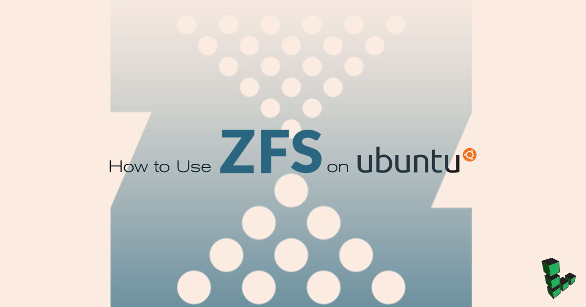
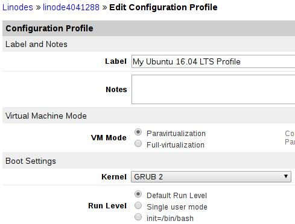

## What is Silent Data Corruption? How Does ZFS Work?

*Silent data corruption* can be caused by a controller fault, firmware bug, or microscopic flaw in the design of magnetic/flash memory. The drive will write incorrect data but report a successful operation. Since no errors have been reported by the filesystem, the backups contain the corrupted files so there is no way to recover.

ZFS offers protection against silent data corruption. Instead of "trusting" the storage device, it [checksums](https://en.wikipedia.org/wiki/Checksum) the data then stores it in separate blocks from the data itself. Corrupted data will be reported and even automatically fixed if the storage pool has been setup with redundancy.

ZFS provides other features as well:

 - A volume manager allows you to combine your physical storage devices into pools. This makes it possible to dynamically increase the pool size without worrying about partitioning and expanding the filesystem.
 - Most of the operations can be done online.
 - Devices can be grouped in RAID-Z arrays, similar to RAID 5, but more than three parity disks are supported.
 - You can take snapshots of your filesystems and rollback to them in case of need.
 - Clones can be created from snapshots and can be promoted to take over.
 - Compression and deduplication can be turned on to save disk space. Compression also improves read and write speeds - sometimes considerably if the information is very compressible (e.g. text files).

## The Structure of ZFS Pools

1.  A ZFS pool is made up of one or more groups of *virtual devices* or *vdevs*. The vdevs are made up of block devices. The block devices can be backed by partitions or whole disks/drives.

    Here's an example of a pool:

        root@zfsbox:~# zpool status
          pool: testpool
         state: ONLINE
          scan: none requested
        config:

                NAME            STATE     READ WRITE CKSUM
                testpool        ONLINE       0     0     0
                  mirror-0      ONLINE       0     0     0
                    sdb         ONLINE       0     0     0
                    sdc         ONLINE       0     0     0
                  mirror-1      ONLINE       0     0     0
                    sdd         ONLINE       0     0     0
                    sde         ONLINE       0     0     0

        errors: No known data errors

    **sdb** and **sdc** are the block devices backed by whole disks. These make up the vdev called **mirror-0**. The second vdev, **mirror-1**, is made up as well of two disks. These two vdevs make up the pool called **testpool**.

2.  The pool can store *datasets*. These can be: filesystems, snapshots, clones or volumes. The last are a kind of virtual block devices.

    For example, you could combine two physical disks into a pool and then create a volume that spans on both of the physical devices. This way a large, virtual disk can be formatted with the filesystem of your choice.

### Single-Disk vdev

You can create a vdev out of a single disk. If you group multiple such vdevs together, you get a structure similar to RAID-0, where data is striped dynamically across all the physical devices.

Advantages:

 - Using close to 100% of the storage space available
 - Fastest write and read speeds
 - Easily increase pool capacity by adding more drives

Disadvantages:

 - If one disk fails, your entire pool fails
 - No way to recover original data in case of read/checksum errors; ZFS will report them but there's nothing more it can do

### Mirror vdevs

Mirror two or more devices then later add another mirror to the same virtual device to increase redundancy. Alternatively, you can create a new vdev that includes a new set of mirrored drives to expand the poll. This gets something similar to RAID-10. While expanding the pool with other types of vdevs is an option, it's generally recommended you stick to the same kind of structures in each pool.

If you couple a 1TB disk with a 2TB disk, the usable space will be cut to 1TB. This is because that is the maximum information that can be mirrored in such a setup.

Advantages:

 - Fast read speeds. Slightly better than what you get with RAID-Z; slightly worse than the previous non-redundant setup.
 - Fast resilvering (replacing a failed device and mirroring data back).
 - If there is at least one functional device in a mirror vdev, you can replace the failed drives and recover.
 - Redundancy can be increased later on

Disadvantages:

 - Least amount of storage space available. If there are 4 disks in a mirror vdev, the capacity that you can use to store data is the capacity of the smallest disk in that structure.
 - Weakest write performance. Basically the same as a single disk.

### RAID-Z vdevs

These vdevs can be configured with single, double, or triple parity (and even more in recent versions of ZFS). Parity information is spread across all physical devices in the vdev. The usable space is roughly total storage capacity minus parity information. As an example when using a structure with double parity and the RAID-Z2 vdev contains 9 disks of 1TB, then you can store approximately 7TB of information (9TB total - 2TB for parity).

Advantages:

 - Good compromise between usable space and redundancy.
 - Good read/write speeds that is inversely proportional to parity.

Disadvantages:

 - Cannot add disks to a RAID-Z vdev.
 - Resilvering can be more time-consuming and intensive than mirrors.

Other types of virtual devices like cache and log can be used when dealing with mechanical hard-drives. Spare vdevs can be set up to automatically replace failed devices.

## RAID-Z and ZFS Recommendations

1. When compression is turned on and RAID-Z arrays are large or are set up with more than two parity devices, it can help a lot to use a Linode with multiple virtual CPUs (usually in intense write situations).

2.  If creating a storage server that is intensively read by other servers/services, it helps to choose a Linode with plenty of RAM so that data is cached and rapidly delivered when requested.

    The above recommendations are for best performance but ZFS will work on any Linode. There is a myth caused by misunderstanding how Adaptive Replacement Cache (ARC) is RAM intensive to be discussed at the end of this guide. This is true only if deduplication is enabled.

3.  Use the same size for all physical devices in a vdev. There's almost never a reason to mix them up and performance is almost always degraded or usable space is lost if you mix devices with different storage space.

    For example, a 1TB disk and a 4TB disk are in a non-redundant striped array, and you write 5GB of data. ZFS will try to balance writes so that drives are filled up at the same rate. Approximately 1GB will be sent to the first disk and 4GB to the second. The 4GB drive will be the rate limiting step for writing. If they would have been the same size, the write could have been more balanced and would have finished faster.

    In the case of mirrors or RAID-Z, usable size will be capped to the smallest storage device in a vdev.

4.  It's better to design it right from the start rather than starting low and then adding vdevs to your pool when you need more space. An empty vdev will get more writes than one which is half full.

    If you need to add more space to your setup, it's preferable to create a secondary pool rather than add virtual devices to the old one. You can create a new Linode, create a larger pool, and import data from your old Linode.

5.  Even with all the measures against data corruption, it's still good practice to backup off-site.

## Before You Begin

1.  If you have not already done so, create a Linode account and Compute Instance. See our [Getting Started with Linode](/docs/guides/getting-started/) and [Creating a Compute Instance](/docs/guides/creating-a-compute-instance/) guides.

1.  Follow our [Setting Up and Securing a Compute Instance](/docs/guides/set-up-and-secure/) guide to update your system. You may also wish to set the timezone, configure your hostname, create a limited user account, and harden SSH access. While updating, if asked about a configuration change in GRUB's config file select **keep the local version currently installed**.

    
The steps in this guide require root privileges. Be sure to run the steps below as `root` or with the `sudo` prefix. For more information on privileges, see our [Users and Groups](/docs/guides/linux-users-and-groups/) guide.


1.  Install a metapackage that will pull in the latest Ubuntu provided kernel, geared towards virtual machines.

        apt install linux-image-virtual

1.  You'll activate booting with GRUB later on, which has a default timeout of 10 seconds for user input. Change it to 0 and rebuild GRUB configuration files:

        sed -i.bak 's/GRUB_TIMEOUT.*/GRUB_TIMEOUT=0/' /etc/default/grub; update-grub

1.  After deciding how to structure your ZFS build, follow the steps in this guide to [create new volumes and attach them to your Linode](/docs/products/storage/block-storage/guides/manage-volumes/). Ignore the steps about creating a filesystem, mounting, editing `fstab`. ZFS will take care of that.

1.  Linode's kernels, booted by default, don't include the ZFS module you'll need so you have to switch to the kernel provided by Ubuntu. In your Linode's dashboard, click **Edit** to make changes to your Ubuntu configuration profile. Under **Boot settings**, change the **Kernel** to **GRUB 2**.

    

1.  Reboot through the Linode Manager.

## Install ZFS and Create a Pool

1.  Install the ZFS utilities:

        apt install zfsutils-linux

2.  Find out how the symbolic links to your volumes are named:

        ls /dev/disk/by-id/

    Here is an example output:

        root@localhost:~# ls /dev/disk/by-id/
        scsi-0Linode_Volume_d1  scsi-0Linode_Volume_d4
        scsi-0Linode_Volume_d2  scsi-0QEMU_QEMU_HARDDISK_drive-scsi-disk-0
        scsi-0Linode_Volume_d3  scsi-0QEMU_QEMU_HARDDISK_drive-scsi-disk-1

    `d1`, standing for device 1, resulted in the id `scsi-0Linode_Volume_d1`. Remember to replace each instance you'll see in the following example commands with your own identifiers.

### Non-redundant ZFS Pools

1.  Adding two disks in a striped, non-redundant configuration is done by:

        zpool create -f testpool /dev/disk/by-id/scsi-0Linode_Volume_d1 /dev/disk/by-id/scsi-0Linode_Volume_d2

    `-f` stands for "force". Under normal circumstances, you should not use this switch so you get warnings about possible mistakes. It is used here since the devices are empty and zpool refuses to use them in their current state without the `-f` switch.

    `testpool` is the name of the pool. This will be automatically mounted in `/testpool`. You can choose a different mountpoint with the -m switch: `zpool create -f -m /othermountpoint testpool /dev/disk/by-id/scsi-0Linode_Volume_d1`.

2.  To change this mountpoint later on:

        zfs set mountpoint=/somewhereelse testpool

3.  To add more disks to the array:

        zpool add -f testpool /dev/disk/by-id/scsi-0Linode_Volume_d4

4.  Destroy the test pool so you can proceed through the next examples:

        zpool destroy testpool

### Mirror ZFS Pools

1.  Create a pool by mirroring two devices:

        zpool create -f testpool mirror /dev/disk/by-id/scsi-0Linode_Volume_d1 /dev/disk/by-id/scsi-0Linode_Volume_d2

2.  Redundancy can be further increased by adding another device and creating a three-way mirror:

        zpool attach -f testpool /dev/disk/by-id/scsi-0Linode_Volume_d2 /dev/disk/by-id/scsi-0Linode_Volume_d3

3.  Inspect the pool with:

        zpool status

    The **READ WRITE** and **CKSUM** columns show how many errors have been encountered when trying to read, write and verify checksums. If these are different than 0, it's time to replace the respective device.

4.  Destroy the pool:

        zpool destroy testpool

    Let's create another type of array:

        zpool create -f testpool mirror /dev/disk/by-id/scsi-0Linode_Volume_d1 /dev/disk/by-id/scsi-0Linode_Volume_d2 mirror /dev/disk/by-id/scsi-0Linode_Volume_d3 /dev/disk/by-id/scsi-0Linode_Volume_d4

    With `zpool status` you will see that now you have two mirrors. This combines the benefits of redundancy with the benefits of distributing writes across two vdevs.

    Destroy the pool so you can also experiment with RAID-Z.

### Raid-Z Pools

1.  Create a RAID-Z pool with single parity:

        zpool create -f testpool raidz1 /dev/disk/by-id/scsi-0Linode_Volume_d1 /dev/disk/by-id/scsi-0Linode_Volume_d2 /dev/disk/by-id/scsi-0Linode_Volume_d3 /dev/disk/by-id/scsi-0Linode_Volume_d4

2.  Run this command:

        zpool list

    **SIZE** stands for raw size including parity data. To get the usable storage size:

        zfs list

    **AVAIL** shows the storage capacity for your files and directories.

3.  To create a double parity RAID-Z setup, destroy your pool and enter the following command:

        zpool create -f testpool raidz2 /dev/disk/by-id/scsi-0Linode_Volume_d1 /dev/disk/by-id/scsi-0Linode_Volume_d2 /dev/disk/by-id/scsi-0Linode_Volume_d3 /dev/disk/by-id/scsi-0Linode_Volume_d4

    Entering `zfs list` again will show there's less space available since two devices are used for parity instead of one. Parity can be further increased by changing `raidz2` in the previous command with `raidz3`, `raidz4`, or more. The more parity added, the more performance is degraded. It's usually better to have two RAID-Z2 arrays of eight disks each rather than a single array of 16 disks.

## Datasets, Snapshots and Rollbacks

1.  Creating multiple ZFS filesystems can be useful. These are mounted under `/testpool` in our example and look like ordinary directories.

        zfs create testpool/data

    If you have one directory with code from a project and a directory with images, you can create two datasets and then turn compression on for the dataset containing code and compression off for the dataset with images. You can see the value of all properties that can be changed with:

        zfs get all

    By keeping a logical separation of data in different filesystems, you will also be able to snapshot and rollback just the parts of interest.

2.  Change directory to `/testpool/data` and create a few files:

        cd /testpool/data/; touch {a..z}

    Type `ls` to see them.

3.  Take a snapshot:

        zfs snapshot testpool/data@a-to-z

4.  Simulate a disaster by deleting a few files:

        rm /testpool/data/{a..l};ls /testpool/data/

5.  There's a hidden directory, `.zfs`, in each filesystem that can be used to see the content of your snapshots:

        ls /testpool/data/.zfs/snapshot/a-to-z/

6.  Rollback to that snapshot:

        zfs rollback testpool/data@a-to-z

7.  If you list the contents of your `data` filesystem, it is restored back to the snapshot:

        ls /testpool/data/

8.  Destroy a snapshot with:

        zfs destroy testpool/data@a-to-z

## Speed Up ZFS

1.  By default, compression is turned off. Turning this on will speed up writing and reading data when files are compressible.

        zfs set compression=on testpool

    To turn on compression on a specific dataset:

        zfs set compression=on testpool/data

2.  The memory used by the Adaptive Replacement Cache shows up as used instead of cached in various utilities such as `free` or `htop`. This can make it seem like the ARC is chewing up RAM. However, the ARC frees up memory when other utilities need it. This allows a ZFS filesystem to run even with modest RAM.

3.  By default, the ARC will use at most 75% of total memory. While this makes sense on a server with multiple purposes, a storage server loses of approximately 20% RAM that could be put to good use. So follow these instructions only if you're not using your Linode to run other applications and have at least 4GB of RAM.

    The numbers in `zfs.conf` represent bytes. 1GB is calculated by multiplying 2 to the power of 30 but you should use values such as `7000000000` to reserve approximately 7GB. As a rule of thumb, set `zfs_arc_max` to total memory available minus 1GB.  `zfs_arc_min` can be set to 50% of total RAM. For example if you have 16GB available, `zfs_arc_max` would be `15000000000` and `zfs_arc_min` would be `8000000000`.

4. Open the `zfs.conf` file. Paste these lines into the editor and then adjust the two numerical values:

    
options zfs zfs_arc_min=3221225472
options zfs zfs_arc_max=6442450944


5. Save the file and reboot the machine via the Linode Manager so the changes can take effect.

Occasionally run `zpool status` to keep an eye on things. There is also a cron script that runs `zpool scrub` monthly in `/etc/cron.d/zfsutils-linux`.
