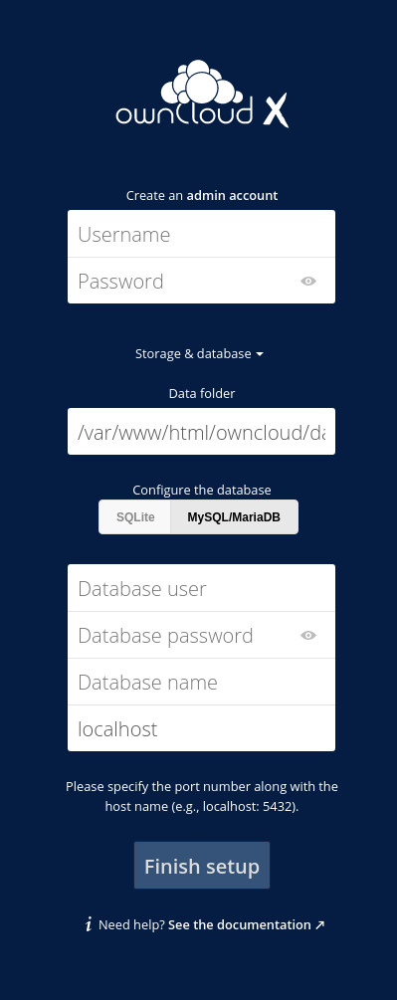

## What is ownCloud?

With [ownCloud](https://owncloud.com/) you can host a private cloud for data synchronization, file storage, and file sharing. You can use ownCloud as an alternative to commercial services like DropBox or Box. This software is great for secure collaboration across your projects and teams.

ownCloud has plenty of compelling features:

- **Versioning**: A file history permits you to roll back to a previous version.
- **Encryption**: ownCloud protects user data in transit; when it’s transmitted between client and server.
- **Drag and drop upload**: Drag files from your desktop file manager to your ownCloud instance.
- **Theming**: Change the look of your ownCloud instance.
- **Viewing ODF files**: You can view Open Document Format files such as `.odt` documents and `.ods` spreadsheets.
- **Expansion via installable applications**: From within the [ownCloud Marketplace](https://marketplace.owncloud.com/), you can install a number of official and third party applications.
- **A mobile app for [Android](https://play.google.com/store/apps/details?id=com.owncloud.android) and [iOS](https://apps.apple.com/us/app/owncloud-file-sync-and-share/id1359583808)**: Mobile apps allow you to interact with your ownCloud server, such as for syncing, uploading, downloading, and viewing files.

Why would you want to host your own cloud? Some common reasons are:

- To save sensitive data, but not on a third-party, commercial option.
- You work from home and you need a private cloud to be used only by those in your household.
- You own a small business and want to keep everything in-house.
- You need an expandable storage solution.

This tutorial walks you through the steps to install ownCloud on [CentOS Stream 8](https://www.centos.org/centos-stream/). There are only a few steps to install ownCloud on CentOS Stream 8. You [install the LAMP (Linux Apache MySQL/MariaDB PHP) stack](/docs/guides/how-to-install-a-lamp-stack-on-centos-8/); create a database and database user; configure Apache; and set up ownCloud using its graphical user interface.

## Before You Begin

1.  If you have not already done so, create a Linode account and Compute Instance. See our [Getting Started with Linode](/docs/guides/getting-started/) and [Creating a Compute Instance](/docs/guides/creating-a-compute-instance/) guides.

1.  Follow our [Setting Up and Securing a Compute Instance](/docs/guides/set-up-and-secure/) guide to update your system. You may also wish to set the timezone, configure your hostname, create a limited user account, and harden SSH access.


If you have a registered domain name that you want to point to your ownCloud instance, then use the [Linode DNS Manager to point the domain](/docs/guides/dns-manager/) to the Linode server on which you plan to install ownCloud. If you do not have a registered domain name, then replace example.com with the IP address of the Linode server when following the steps in the [Create an Apache Configuration File](#create-an-apache-configuration-file) section.


## Install ownCloud
### Install the LAMP Stack
#### Install the Apache Web Server

ownCloud requires a full LAMP (Linux, Apache, MySQL, PHP) stack. In this section, you complete the steps to install a LAMP stack on your Linode. Although you don't have to use Apache as the web server, the ownCloud developers highly recommend it over web servers like NGINX and lightHTTP.

1. Install the Apache web server:

        sudo dnf install httpd httpd-tools -y

1. When the installation is complete, enable and start Apache:

        sudo systemctl start httpd
        sudo systemctl enable httpd

1. Configure FirewallD to Allow HTTP and HTTPS Connections

        sudo firewall-cmd --permanent --zone=public --add-service=http
        sudo firewall-cmd --permanent --zone=public --add-service=https
        sudo firewall-cmd --reload

1. Ensure you can reach the Apache server. Open a web browser, and enter in your [Linode's IP address](/docs/guides/find-your-linodes-ip-address/). For example, enter in `http://192.0.2.0` and replace the IP address with your own. You should see the Apache welcome page.

#### Install MariaDB

1. Install MariaDB:

        sudo dnf install mariadb-server mariadb -y

1. Start and enable the database:

       sudo systemctl start mariadb
       sudo systemctl enable mariadb

1. Set a MariaDB admin password and secure the installation. The command includes `mysql` even though we use MariaDB.

        sudo mysql_secure_installation

    During this process, the system asks if you want to enable the `VALIDATE PASSWORD COMPONENT`. This feature ensures that all created passwords are strong and unique. Answer `n` (as in "no"). When prompted, type and verify a new secure password for the MySQL admin user. You are then prompted to answer four questions, to all of which you should respond `y` (as in "yes").

#### Install PHP

So far, you have installed the Apache web server, and MariaDB. Next up is the programming language, PHP 7.4.

1. Add the EPEL repository to install the current version of PHP:

        sudo dnf install epel-release -y

1. CentOS Stream installs PHP 7.2 by default, but PHP 7.4 (or higher) is required to use ownCloud. This requires a few steps. First, reset the PHP modules:

        sudo dnf module reset php

1. Enable PHP 7.4:

        sudo dnf module enable php:7.4

1. Install PHP and all the required PHP modules:

        sudo dnf install php php-opcache php-gd php-curl php-mysqlnd php-intl php-json php-ldap php-mbstring php-mysqlnd php-xml php-zip -y

1. Restart and enable the PHP Fast Process Manager (PHP-FPM):

        sudo systemctl start php-fpm
        sudo systemctl enable php-fpm

1. Enable SELinux to allow Apache to execute PHP code via PHP-FPM.:

        sudo setsebool -P httpd_execmem 1

#### Create the ownCloud Database

Now that you have installed the prerequisites, it’s time to create the ownCloud database and user. The commands in this section are issued from within the MariaDB console.

1. Access the MariaDB console:

        sudo mysql -u root -p

1. create your ownCloud database:

        CREATE DATABASE ownclouddb;

1. Create a new user with the necessary privileges, including a strong and unique password. Be sure to substitute `PASSWORD` with your own password:

        GRANT ALL ON ownclouddb.* TO 'ownclouduser'@'localhost' IDENTIFIED BY 'PASSWORD';

1. Flush your database's privileges:

        FLUSH PRIVILEGES;

1. Finally, exit the database console:

        exit

### Download ownCloud

At this point, the system is ready for ownCloud. Before you actually download the software, check the [ownCloud downloads page](https://owncloud.com/download-server/) to confirm the most recent version.

1. Install the wget and unzip utilities on your CentOS Stream 8 system:

       sudo yum install unzip wget

1. Download ownCloud. As of writing this guide, the latest version is 10.5.0. Replace `10.5.0` with the version you want to download.

        wget https://download.owncloud.org/community/owncloud-10.5.0.zip

1. Unzip the downloaded file:

        unzip owncloud-10.5.0.zip

1. When you unzip the file, a new directory named `owncloud` is created. Move the new directory to the Apache document `root`. This example uses the default directory for Apache site files:

        sudo mv owncloud /var/www/html/

1. Change the ownership of the `owncloud` directory:

        sudo chown -R apache: /var/www/html/owncloud

### Create an Apache Configuration File

Apache requires a [virtual host configuration file](https://httpd.apache.org/docs/2.4/vhosts/examples.html) in order to server your ownCloud instance to the web.

1. Create an Apache configuration file using the Nano text editor:

        sudo nano /etc/httpd/conf.d/owncloud.conf

1. Paste the following text into the new file. Replace mentions of `example.com` with your own domain name or your [Linode's IP Address](/docs/guides/find-your-linodes-ip-address/):


Alias /owncloud "/var/www/html/owncloud/"
<Directory /var/www/html/owncloud/>
  Options +FollowSymlinks
  AllowOverride All

 <IfModule mod_dav.c>
  Dav off
 </IfModule>

 SetEnv HOME /var/www/html/owncloud
 SetEnv HTTP_HOME /var/www/html/owncloud

</Directory>


1. Save and close the file by typing **Ctrl + O** and then, **Ctrl + X**:

1. Restart the Apache server:

        sudo systemctl restart httpd

1. Make sure that the Apache web server can write to the ownCloud directory:

        sudo setsebool -P httpd_unified 1

### Configure ownCloud

This section covers the web-based portion of the installation.

1. Open a web browser and navigate to your site's domain, if it has been configured to use a domain name like, `http://example.com/owncloud`. If you configured Apache to point to your server's IP address, navigate to `http://192.0.2.0/owncloud` and replace the example IP address with your own. You should see the ownCloud web-based installer.


**Troubleshooting SELinux**

If you encounter permissions errors when navigating to your ownCloud instance in the web browser, it means you need to configure the SELinux. You can do so with the following commands:

    su
    semanage fcontext -a -t httpd_sys_rw_content_t '/var/www/html/owncloud/data(/.*)?'
    semanage fcontext -a -t httpd_sys_rw_content_t '/var/www/html/owncloud/config(/.*)?'
    semanage fcontext -a -t httpd_sys_rw_content_t '/var/www/html/owncloud/apps(/.*)?'
    semanage fcontext -a -t httpd_sys_rw_content_t '/var/www/html/owncloud/apps-external(/.*)?'
    semanage fcontext -a -t httpd_sys_rw_content_t '/var/www/html/owncloud/.htaccess'
    semanage fcontext -a -t httpd_sys_rw_content_t '/var/www/html/owncloud/.user.ini'
    restorecon -Rv '/var/www/html/owncloud/'
    exit

If you continue to experience issues, you can temporarily disable SELinux.

    sudo setenforce 0

Refer to the [A Beginner's Guide to SELinux on CentOS 8](/docs/guides/a-beginners-guide-to-selinux-on-centos-8/) guide to learn more about SELinux.



1. Once you access the web-based installer, type a username and password for the admin user; click the `Storage & Database` drop-down; and then click `MySQL/MariaDB`.

1. The database information section is now available. Enter the following information:

    - Database User: `ownclouduser`
    - Database password: the password you set for the ownCloud database user
    - Database: `ownclouddb`
    - Localhost: leave as the default

    

1. Click **Finish setup**. When the install completes, the ownCloud login page appears. Login with the newly-created admin credentials. Once logged in, you are taken to the main ownCloud page.

    

You now have a working instance of ownCloud, running on CentOS 8 Stream.
