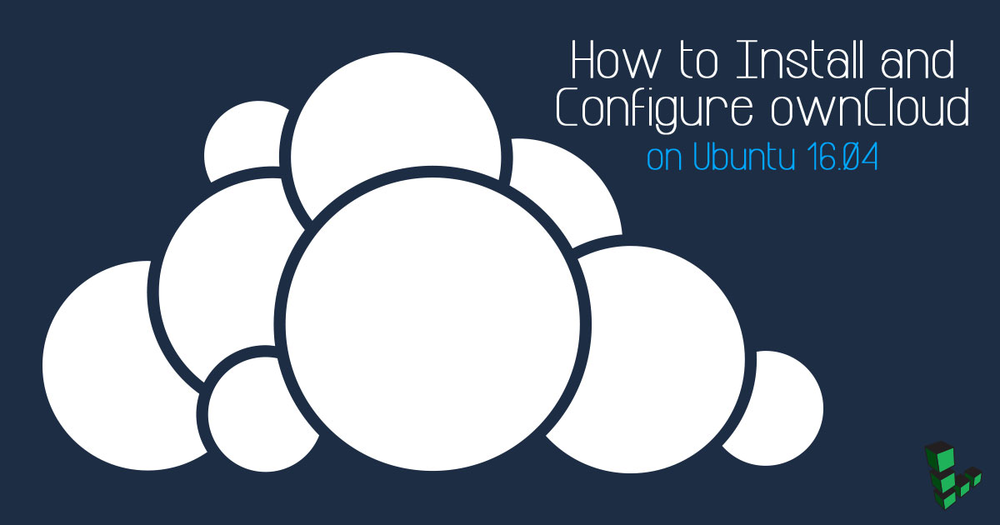
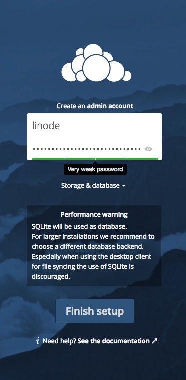
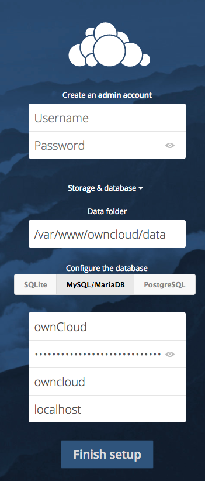
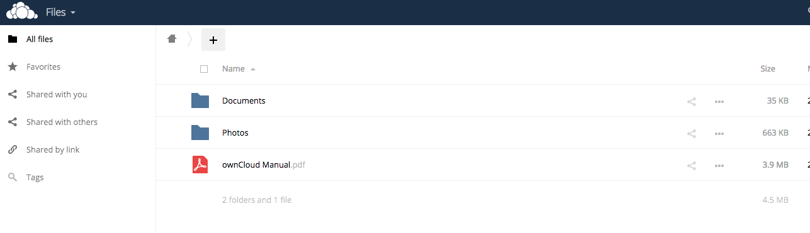
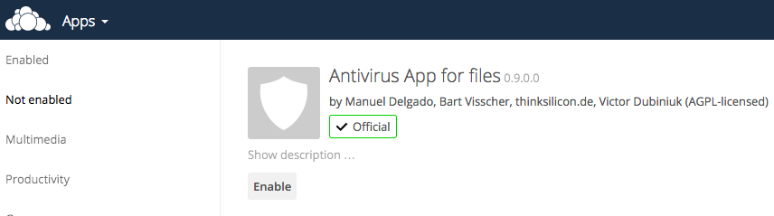
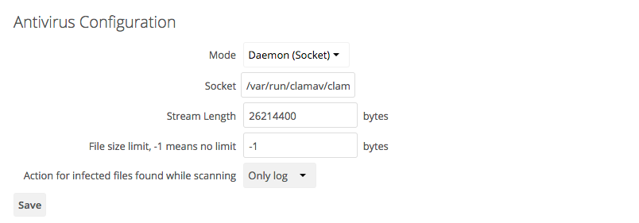
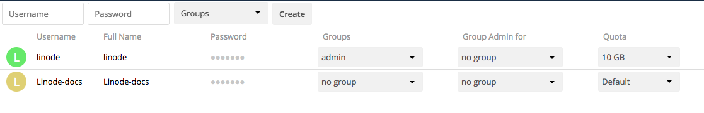

OwnCloud is an open-source, cloud-based, file hosting service you can install on your Linode. OwnCloud offers a quick installation process, works out of the box, and has an extensive library of plugins available. Its cross-platform compatibility means you can access your files from most major operating systems, browsers, and mobile devices.


To automatically install ownCloud on a Compute Instance, consider deploying [ownCloud Server through the Linode Marketplace](/docs/products/tools/marketplace/guides/owncloud/).


## Before You Begin

1.  If you have not already done so, create a Linode account and Compute Instance. See our [Getting Started with Linode](/docs/products/platform/get-started/) and [Creating a Compute Instance](/docs/products/compute/compute-instances/guides/create/) guides.

1.  Follow our [Setting Up and Securing a Compute Instance](/docs/products/compute/compute-instances/guides/set-up-and-secure/) guide to update your system. You may also wish to set the timezone, configure your hostname, create a limited user account, and harden SSH access.

3.  [Install and configure a LAMP stack](/docs/guides/install-lamp-stack-on-ubuntu-16-04/).

## Install ownCloud

Add the repository key to apt, and install ownCloud:

    sudo wget -nv https://download.owncloud.org/download/repositories/9.1/Ubuntu_16.04/Release.key -O Release.key
    sudo apt-key add - < Release.key
    sudo sh -c "echo 'deb http://download.owncloud.org/download/repositories/9.1/Ubuntu_16.04/ /' > /etc/apt/sources.list.d/owncloud.list"
    sudo apt update
    sudo apt install owncloud

## Configure MySQL

1.  Log in to your MySQL database, and enter your root password:

        mysql -u root -p

2.  Create a new database for ownCloud, and replace `strong_password` with a new, secure password:

    
CREATE DATABASE ownCloud;
CREATE USER ownCloud@localhost;
SET PASSWORD FOR 'ownCloud'@'localhost' = PASSWORD('strong_password');


3.  Assign the new user to the database:

    
GRANT ALL PRIVILEGES ON ownCloud.* to ownCloud@localhost;
FLUSH PRIVILEGES;
exit


4.  Log into MySQL as the newly created user:

        mysql -u ownCloud -p

5.  You can check the current user in MySQL using the `SELECT current_user();` command:

    
SELECT current_user();


    Which will display something similar to:

        +--------------------+
        | current_user()     |
        +--------------------+
        | ownCloud@localhost |
        +--------------------+
        1 row in set (0.00 sec)

## Create an Administrator Account

1. After ownCloud is installed and MySQL is configured, point your browser to `ip_address_or_domain/owncloud` (where, `ip_address_or_domain` is your IP or FQDN) and create an administrator account:

    

2.  Click **Storage & database** and enter the database login information:

    

    Welcome to ownCloud:

    

## Install ClamAV and Configure ownCloud

1.  Install [ClamAV](https://www.clamav.net/), an open source antivirus engine which works with ownCloud's antivirus plugin:

        sudo apt install clamav clamav-daemon

    The `clamav` package starts a daemon on your system.

2.  Enable the antivirus app in ownCloud. Select **Apps** from the menu, then **Not enabled** to find "Antivirus App for files" and click **Enable**:

    

3.  Configure the antivirus mode in ownCloud to reflect the changes to your system:

    

4.  To add new users and groups, select **Users** in the dropdown menu in the upper right-hand corner:

    

## Secure the System

Now that ownCloud is installed and configured, you should secure your system. The official documentation has a well-written section on [hardening your server](https://doc.owncloud.org/server/9.0/admin_manual/configuration_server/harden_server.html), which covers everything from using HTTPS, to JavaScript Asset Managing.
