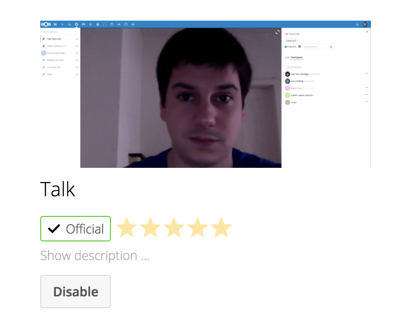

## What is Nextcloud 14?

Nextcloud 14 is a cloud storage platform that offers users the ability to self-host a video and text chat platform called Talk, featuring end-to-end encryption. This guide will walk you through setting up Nextcloud, and show how to use the video chat platform built-into the latest release.

## Install Docker CE

You will need a Linode with Docker CE installed to follow along with the steps in this guide.



## Install Nextcloud 14 and Talk

### Nextcloud

1. Pull and run the Nextcloud image:

        docker run -d -p 8080:80 nextcloud

2.  In a browser, navigate to port `8080` of your Linode (e.g. `192.0.2.0:8080`) to launch the Nextcloud console.

3. Create an admin account when prompted:

    

### Talk

Talk works by allowing all the users that are registered to your Nextcloud instance to communicate with each other. Nextcloud Talk offers simple text and video chat, private or group password protected calls, and screen sharing. The [Nextcloud Talk](https://github.com/nextcloud/spreed) source code is available on GitHub.

1. From the Nextcloud console main page, click the **Settings** icon on the right side of the navigation bar. Choose **+ Apps**.

2.  Install the Talk add-on located in the **Social & communication** section. Select the app and click **Enable**.

3.  Navigate to the **Users** section of the Nextcloud interface, and create logins for your team.

## How to Use Talk

Nextcloud Talk is built using [WebRTC](https://simplewebrtc.com/), and works in your browser.

1.  Choose **Users** from the settings menu and add one or more additional users. Give the username and password combinations to each user and have them log in through the web console.

2.  Once Talk is installed, an icon for the addon will appear on the nav menu:

    

3.  Click this icon to enter Talk and allow the use of your system's camera and microphone when prompted. Once this is done, you will be able to start a chat or video call with any of the users you have created.

The basic configuration here allows you to make video calls using Firefox. Google Chrome requires an HTTPS connection in order to allow access to the camera and microphone. To do this, create an [SSL certificate](/docs/security/ssl/) or place Nextcloud behind a [reverse proxy](https://docs.nginx.com/nginx/admin-guide/web-server/reverse-proxy/).

## Docker Compose

The basic Nextcloud Docker image is already configured for persistent data in the event that your container crashes. However, Docker Compose makes it easy to launch a configuration using a separate database container and persistent data volume. This method keeps your data consistent through upgrades and automatically handles all container restarts.

### Install Docker Compose



### Create docker-compose.yaml

1.  In a text editor, create `docker-compose.yaml` and add the following configuration (from the [Nextcloud Github repo](https://github.com/nextcloud/docker)). Fill in the `MYSQL_ROOT_PASSWORD` and `MYSQL_PASSWORD` with suitable values.

    
  version: '2'

  volumes:
    nextcloud:
    db:

  services:
    db:
      image: mariadb
      restart: always
      volumes:
        - db:/var/lib/mysql
      environment:
        - MYSQL_ROOT_PASSWORD=
        - MYSQL_PASSWORD=
        - MYSQL_DATABASE=nextcloud
        - MYSQL_USER=nextcloud

    app:
      image: nextcloud
      ports:
        - 8080:80
      links:
        - db
      volumes:
        - nextcloud:/var/www/html
      restart: always


2.  If it is still running, stop the container from the previous section using `docker stop` and the container name or ID.

3.  Launch the Docker Compose configuration:

        docker-compose up -d

    Nextcloud should be available at port 8080 on your Linode's public IP address.

4.  When creating an admin account, open the **Storage & database** drop-down menu, fill in the information as shown below, and enter the MySQL password you used in the `docker-compose` file:

    


The setup provided by Nextcloud does not include any SSL encryption. To secure your data and communications, the Nextcloud service should be placed behind a [reverse proxy](https://docs.nginx.com/nginx/admin-guide/web-server/reverse-proxy/). A Docker Compose file using a NGINX reverse proxy and Let's Encrypt is also [available](https://github.com/nextcloud/docker/blob/master/.examples/docker-compose/with-nginx-proxy/mariadb/apache/docker-compose.yml).

