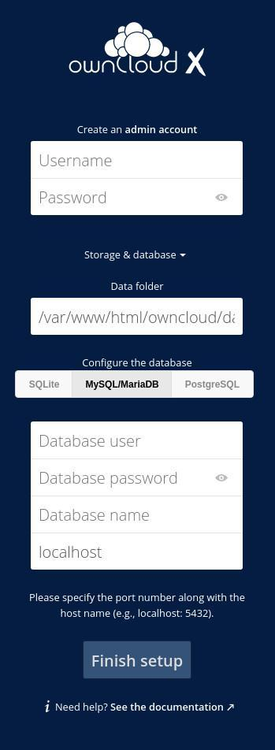

author:
  name: Jack Wallen
  email: jlwallen@monkeypantz.net
description: A popular open source alternative to Dropbox is ownCloud. Fortunately, installing ownCloud on Debian Linux is surprisingly simple. Just follow these steps.
keywords: "owncloud on Debian"
license:
published:
modified_by:
  name: Linode
title: 'How to install ownCloud on Debian 10'
contributor:
  name: Jack Wallen
  link:
external_resources:
  - '[Link Title 1](http://www.example.com)'
  - '[Link Title 2](http://www.example.net)'
---

# How to install ownCloud on Debian 10

Type: How to

Docs Library Section: applications/cloud-storage/install-owncloud-debian10

Target Keyword: owncloud on Debian

Description: A popular open source alternative to Dropbox is ownCloud. Fortunately, installing ownCloud on Debian Linux is surprisingly simple. Just follow these steps.

By Jack Wallen

Deck/social: Installing ownCloud on Debian Linux is surprisingly simple. Just follow these steps.

With [ownCloud](https://owncloud.com/) you can host a private cloud for data synchronization, file storage and sharing, instead of using a commercial service like DropBox or Box. Because ownCloud works fine on commodity hardware, anyone can enjoy their own private cloud.

ownCloud has plenty of compelling features:

- **Versioning**: A file history permits you to roll back to a previous version.
- **Encryption**: ownCloud protects user data in transit, when it’s not on either the server or the client (desktop or mobile application).
- **Drag and drop upload**: Drag files from your desktop file manager to your ownCloud instance.
- **Theming**: Change the look of your ownCloud instance.
- **Viewing ODF files**: You can view Open Document Format files such as .odt documents and .ods spreadsheets.
- **Expansion via installable applications**: From within the ownCloud Market, you can install a number of official and third party applications.
- **A mobile app for [Android](https://play.google.com/store/apps/details?id=com.owncloud.android) and [iOS](https://apps.apple.com/us/app/owncloud-file-sync-and-share/id1359583808)**: Mobile apps allow you to interact with your ownCloud server, such as for syncing, uploading, downloading, and viewing files.

Why would you want to host your own cloud? The reasons are plenty:

- You want to save sensitive data, but not on a third-party, commercial option.
- You work from home and need a private cloud to be used only by those in your household.
- You own a small business and want to keep everything in-house.
- You need expandable storage, but don't want to pay for it.

This tutorial walks you through the steps of installing ownCloud on Debian 10, one of the most reliable server operating systems on the market.

There are only a few steps to install ownCloud on Debian. You install the LAMP (Linux Apache MySQL/MariaDB PHP) stack; create a database and database user; set up ownCloud; and finally configure Apache.

Let's make this happen.

## Install the web server and PHP

To install the web server and all of the necessary PHP components, issue the command:

~~~~
sudo apt-get install apache2 mariadb-server libapache2-mod-php openssl php-imagick php-common php-curl php-gd php-imap php-intl php-json php-ldap php-mbstring php-mysql php-pgsql php-smbclient php-ssh2 php-sqlite3 php-xml php-zip php-apcu -y
~~~~

Start and enable Apache with the commands:

~~~~
sudo systemctl start apache2

sudo systemctl enable apache2
~~~~

## Install the database

ownCloud relies on a database for storing data. Instead of MySQL, this installation uses MariaDB. Why? MariaDB is a fork of MySQL that places a higher importance on security. And since MariaDB is a functional replacement to MySQL, it's a no-brainer.

Log into the Debian server and install MariaDB with the command:

~~~~
sudo apt-get install mariadb-server -y
~~~~

Start and enable the database with the commands:

~~~~
sudo systemctl start mariadb

sudo systemctl enable mariadb
~~~~

Next, set an admin password and secure the MariaDB installation. This is accomplished with a tool borrowed from MySQL:

~~~~
sudo mysql\_secure\_database
~~~~

When prompted, hit `Enter` on your keyboard (as there is no current MariaDB admin password). Answer `y` (as in "yes") to set the admin password, and type and verify a new secure password for the MariaDB admin user. Finally, the database setup prompts you to answer four questions. Answer `y` (as in "yes") to each of these questions.

## Create the ownCloud database

The foundation is in place. It’s time to create the ownCloud database and user.

The commands in this section are issued from within the MariaDB console. To access the console, issue the command:

~~~~
sudo mysql -u root -p
~~~~

From here, create the database by typing:

~~~~
CREATE DATABASE ownclouddb;
~~~~

Create a new user, with the necessary privileges, including a strong, unique password. Be sure to substitute the word PASSWORD with your own password:

~~~~
GRANT ALL ON ownclouddb.\* TO 'ownclouduser'@'localhost' IDENTIFIED BY 'PASSWORD';
~~~~

Flush the privileges with the command:

~~~~
FLUSH PRIVILEGES;
~~~~

Finally, exit the database console:

~~~~
exit
~~~~

## Download, unpack, install and move ownCloud

At this point, the system is ready for ownCloud. Before you actually download the software, check the [ownCloud downloads page](https://owncloud.com/download-server/) to confirm the most recent version.

The command to download ownCloud version 10.5.0 is:

~~~~
wget https://download.owncloud.org/community/owncloud-10.5.0.zip
~~~~

Unzip the downloaded file:

~~~~
unzip owncloud-10.5.0.zip
~~~~

If necessary, install unzip with the command:

~~~~
sudo apt-get install zip -y
~~~~

When you unzip the file, a new directory (named `owncloud`) is created. Move the new directory to the Apache document `root` (the default directory for Apache websites) with the command:

~~~~
sudo mv owncloud /var/www/html/
~~~~

Change the ownership of the owncloud directory. Type:

~~~~
sudo chown -R www-data: /var/www/html/owncloud
~~~~

## Create an Apache configuration file

Without a specific configuration file, Apache isn't aware of ownCloud, so you'd be presented with a 404 error in the web browser.

To create an Apache configuration file, type:

~~~~
sudo nano /etc/apache2/sites-available/owncloud.conf
~~~~

Paste the following text into the new file, replacing mentions of `your-domain.com` with your own domain:

~~~~
<VirtualHost \*:80>
     ServerAdmin admin@your\_domain.com
     DocumentRoot /var/www/html/owncloud
     ServerName your-domain.com
    <Directory /var/www/html/owncloud>
         Options FollowSymlinks
         AllowOverride All
         Require all granted
     </Directory>

ErrorLog ${APACHE\_LOG\_DIR}/your-domain.com\_error.log

CustomLog ${APACHE\_LOG\_DIR}/your-domain.com\_access.log combined

</VirtualHost>
~~~~

Save and close the file.

Enable the rewrite, mime, and unique\_id Apache modules:

~~~~
sudo a2enmod rewrite mime unique\_id
~~~~

Restart the Apache server:

~~~~
sudo systemctl restart apache2
~~~~

The command line portion of the installation is complete.

## Finish up the installation

We now turn our attention to the web-based portion of the installation. Open a web browser and navigate to `http://SERVER/owncloud` where `SERVER` is the IP address of the hosting server. You should see the ownCloud web-based installer.

 

Type a username and password for the admin user; click the `Storage & Database` drop-down; and then click `MySQL/MariaDB`.

  

The database information section is now available.

Enter the following:

~~~~
    • Database User: ownclouduser
    • Database password: the password you set for the ownclouduser
    • Database: ownclouddb
    • Localhost: leave as the default
~~~~

Click `Finish setup`. When the install completes, the ownCloud login page appears.

Login with the newly-created admin credentials. You'll find yourself on the main ownCloud page.

Congratulations! You now have a working instance of ownCloud, running on Debian 10.
