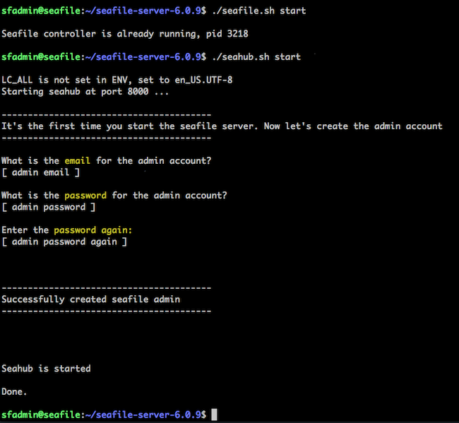

Seafile is a cross-platform file hosting tool with server applications for Linux and Windows, and GUI clients for Android, iOS, Linux, OS X and Windows. It supports file versioning and snapshots, two-factor authentication, WebDAV, and can be paired with NGINX or Apache to enable connections over HTTPS.

Seafile has [two editions](https://www.seafile.com/en/product/private_server/): a free and open source Community Edition and a paid Professional edition. While the Pro edition is free for up to 3 users, this guide will use Seafile Community Edition with NGINX serving an HTTPS connection, and MySQL on the backend. This application stack could also benefit from large amounts of disk space, so consider using our [Block Storage](/docs/platform/how-to-use-block-storage-with-your-linode/) service with this setup.

## Prepare Ubuntu


This guide is written for a non-root user. Commands that require elevated privileges are prefixed with `sudo`. If you’re not familiar with the `sudo` command, see the [Linux Users and Groups](/docs/tools-reference/linux-users-and-groups/) guide.


1.  Update the system:

        apt update && apt upgrade

2.  Create a standard user account with root privileges. As an example, we'll call the user *sfadmin*:

        adduser sfadmin
        adduser sfadmin sudo

3.  Log out of your Linode's root user account and back in as *sfadmin*:

        exit
        ssh sfadmin@<your_linode's_ip>

4.  You should now be logged into your Linode as *sfadmin*. Use our [Setting Up and Securing a Compute Instance](/docs/guides/set-up-and-secure/#harden-ssh-access) guide to harden SSH access.

5.  Set up UFW rules. UFW is Ubuntu's iptables controller which makes setting up firewall rules a little easier. For more info on UFW, see our guide [Configure a Firewall with UFW](/docs/security/firewalls/configure-firewall-with-ufw/). Set the allow rules for SSH and HTTP(S) access with:

        sudo ufw allow ssh
        sudo ufw allow http
        sudo ufw allow https
        sudo ufw enable

    Then check the status of your rules and list them numerically:

        sudo ufw status numbered

    The output should be:

        Status: active

        To                         Action      From
        --                         ------      ----
        [ 1] 22                         ALLOW IN    Anywhere
        [ 2] 80                         ALLOW IN    Anywhere
        [ 3] 443                        ALLOW IN    Anywhere
        [ 4] 22 (v6)                    ALLOW IN    Anywhere (v6)
        [ 5] 80 (v6)                    ALLOW IN    Anywhere (v6)
        [ 6] 443 (v6)                   ALLOW IN    Anywhere (v6)

    
If you don't want UFW allowing SSH on port 22 for both IPv4 and IPv6, you can delete it. For example, you can delete the rule to allow SSH over IPv6 with `sudo ufw delete 4`.


6.  Set the Linode's hostname. We'll call it *seafile* as an example:

        sudo hostnamectl set-hostname seafile

7. Add the new hostname to `/etc/hosts`. The second line in the file should look like this:

    
127.0.1.1    members.linode.com     seafile


8.  On first boot, your Linode's timezone will be set to UTC. Changing this is optional, but if you wish, use:

        sudo dpkg-reconfigure tzdata

## Install and Configure MySQL

1.  During Installation, you will be asked to assign a password for the root mysql user. Be sure to install the package `mysql-server-5.7`, not `mysql-server`. This is because an upstream issue causes problems starting the MySQL service if you install by using the `mysql-server` package.

        sudo apt install mysql-server-5.7

2.  Run the *mysql_secure_installation* script:

        sudo mysql_secure_installation

    For more info on MySQL, see our guide: [Install MySQL on Ubuntu](/docs/databases/mysql/install-mysql-on-ubuntu-14-04/)

## Create a TLS Certificate for use with NGINX

If you don't already have an SSL/TLS certificate, you can create one. This certificate will be self-signed, and will cause web browsers to protest about a non-private connection. You should verify the SHA256 fingerprint of the certificate in the browser versus that on the server, and add a permanent exception to the browser to trust this certificate.

1.  Change to the location where we'll store the certificate files and create server's certificate with key:

        cd /etc/ssl
        sudo openssl genrsa -out privkey.pem 4096
        sudo openssl req -new -x509 -key privkey.pem -out cacert.pem

## Install and Configure NGINX

1.  Install NGINX from Ubuntu's repository:

        sudo apt install nginx

2.  Create the site configuration file. The only line you need to change below is `server_name`. For more HTTPS configuration options, see our guide on [TLS Best Practices with NGINX](/docs/web-servers/nginx/nginx-ssl-and-tls-deployment-best-practices/).

    
server{
    listen 80;
    server_name example.com;
    rewrite ^ https://$http_host$request_uri? permanent;
    proxy_set_header X-Forwarded-For $remote_addr;
    }
 server {
    listen 443 ssl http2;
    ssl on;
    ssl_certificate /etc/ssl/cacert.pem;
    ssl_certificate_key /etc/ssl/privkey.pem;
    server_name example.com;

    ssl_protocols TLSv1 TLSv1.1 TLSv1.2;
    add_header   Strict-Transport-Security "max-age=31536000; includeSubdomains";
    add_header   X-Content-Type-Options nosniff;
    add_header   X-Frame-Options DENY;
    ssl_session_cache shared:SSL:10m;
    ssl_ciphers  "EECDH+AESGCM:EDH+AESGCM:AES256+EECDH:AES256+EDH !RC4";
    ssl_prefer_server_ciphers   on;

    fastcgi_param   HTTPS               on;
    fastcgi_param   HTTP_SCHEME         https;

  location / {
        fastcgi_pass    127.0.0.1:8000;
        fastcgi_param   SCRIPT_FILENAME     $document_root$fastcgi_script_name;
        fastcgi_param   PATH_INFO           $fastcgi_script_name;

        fastcgi_param    SERVER_PROTOCOL        $server_protocol;
        fastcgi_param   QUERY_STRING        $query_string;
        fastcgi_param   REQUEST_METHOD      $request_method;
        fastcgi_param   CONTENT_TYPE        $content_type;
        fastcgi_param   CONTENT_LENGTH      $content_length;
        fastcgi_param    SERVER_ADDR         $server_addr;
        fastcgi_param    SERVER_PORT         $server_port;
        fastcgi_param    SERVER_NAME         $server_name;
        fastcgi_param   REMOTE_ADDR         $remote_addr;

        access_log      /var/log/nginx/seahub.access.log;
        error_log       /var/log/nginx/seahub.error.log;
        fastcgi_read_timeout 36000;
        client_max_body_size 0;
    }

    location /seafhttp {
        rewrite ^/seafhttp(.*)$ $1 break;
        proxy_pass http://127.0.0.1:8082;
        client_max_body_size 0;
        proxy_connect_timeout  36000s;
        proxy_read_timeout  36000s;
        proxy_send_timeout  36000s;
        send_timeout  36000s;
        proxy_request_buffering off;
    }

    location /media {
        root /home/sfadmin/sfroot/seafile-server-latest/seahub;
    }
    }



3.  Disable the default site configuration and enable the one you just created:

        sudo rm /etc/nginx/sites-enabled/default
        sudo ln -s /etc/nginx/sites-available/seafile.conf /etc/nginx/sites-enabled/seafile.conf

4.  Run the NGINX configuration test and restart the web server. If the test fails, it will give you a brief description of what's wrong so you can troubleshoot the problem.

        sudo nginx -t
        sudo systemctl restart nginx

## Configure and Install Seafile

1.  The [Seafile manual](https://manual.seafile.com/deploy/using_mysql.html) advises to use a particular directory structure to ease upgrades. We'll do the same here, but instead of using the example `haiwen` directory found in the Seafile manual, we'll create a directory called `sfroot` in the `sfadmin` home folder.

        mkdir ~/sfroot && cd ~/sfroot

2.  Download the Seafile CE 64 bit Linux server. You'll need to get the exact link from [seafile.com](https://www.seafile.com/en/download/). Once you have the URL, use `wget` to download it to *~/sfadmin/sfroot*.

        wget <link>

3.  Extract the tarball and move it when finished:

        tar -xzvf seafile-server*.tar.gz
        mkdir installed && mv seafile-server*.tar.gz installed

4.  Install dependency packages for Seafile:

        sudo apt install python2.7 libpython2.7 python-setuptools python-imaging python-ldap python-mysqldb python-memcache python-urllib3

5.  Run the installation script:

        cd seafile-server-* && ./setup-seafile-mysql.sh

    You'll be prompted to answer several questions and choose settings during the installation process. For those that recommend a default, use that.

6.  Start the server.

        ./seafile.sh start
        ./seahub.sh start-fastcgi

    The `seahub.sh` script will set up an admin user account used to log into Seafile. You'll be asked for a login email and to create a password.

    

7. Seafile should now be accessible from a web browser using both your Linode's IP address or the `server_name` you set earlier in NGINX's `seafile.conf` file. Nginx will redirect to HTTPS and as mentioned earlier, your browser will warn of an HTTPS connection which is not private due to the self-signed certificate you created. Once you tell the browser to proceed to the site anyway, you'll see the Seafile login.

    

## Automatically Start Seafile on Sever Bootup

The `seafile.sh` and `seahub.sh` scripts don't automatically run if your Linode were to reboot.

1.  Create the systemd unit files:

    
[Unit]
Description=Seafile Server
After=network.target mysql.service

[Service]
Type=oneshot
ExecStart=/home/sfadmin/sfroot/seafile-server-latest/seafile.sh start
ExecStop=/home/sfadmin/sfroot/seafile-server-latest/seafile.sh stop
RemainAfterExit=yes
User=sfadmin
Group=sfadmin

[Install]
WantedBy=multi-user.target



    
[Unit]
Description=Seafile Hub
After=network.target seafile.service

[Service]
Type=oneshot
ExecStart=/home/sfadmin/sfroot/seafile-server-latest/seahub.sh start-fastcgi
ExecStop=/home/sfadmin/sfroot/seafile-server-latest/seahub.sh stop
RemainAfterExit=yes
User=sfadmin
Group=sfadmin

[Install]
WantedBy=multi-user.target



2.  Then enable the services:

        sudo systemctl enable seafile
        sudo systemctl enable seahub

    You can verify they've started successfully with:

        sudo systemctl status seafile
        sudo systemctl status seahub

3.  Confirm the startup scripts are working by rebooting your Linode. After bootup, both the Seafile and Seahub services should be active when running the status commands in the previous step. You should also still be able to access Seafile with a web browser.

## Updating Seafile

There are various ways to update Seafile depending on if you are upgrading from one milestone to another (version 5 to 6), or upgrading between point releases (5.1.0 to 5.1.1). See the [Seafile Manual](https://manual.seafile.com/deploy/upgrade.html) for upgrade instructions that best suit your needs.
