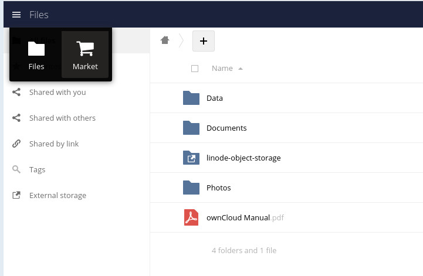
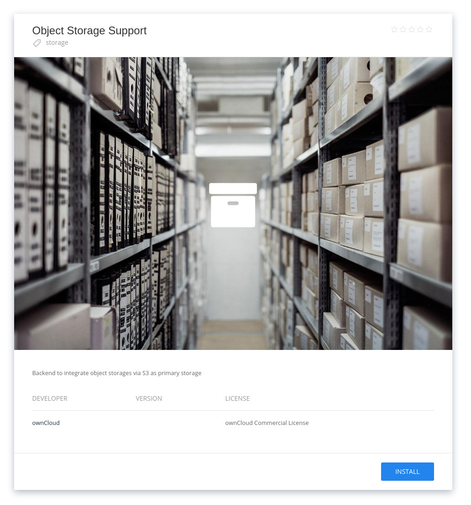
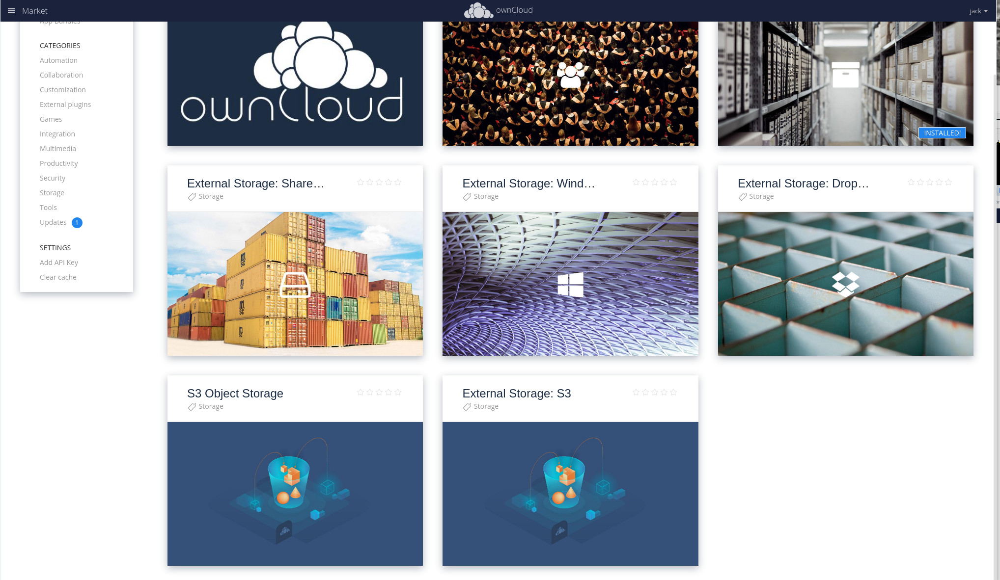
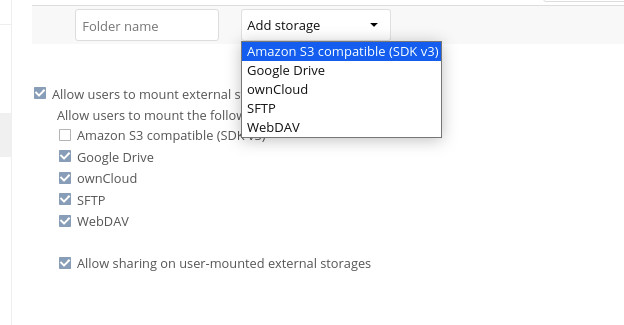
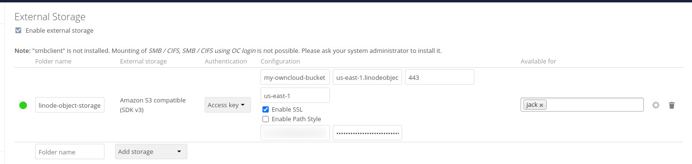
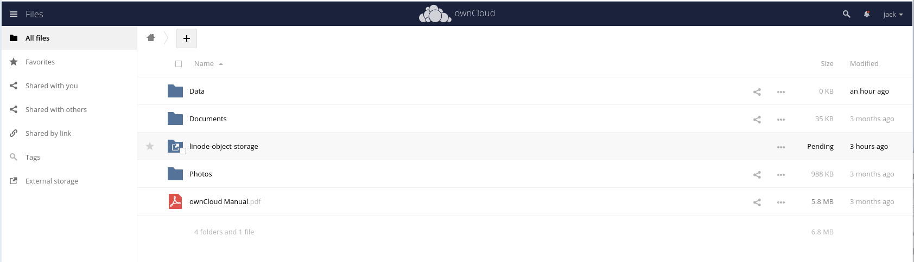

ownCloud is an open-source file hosting and sharing solution. With ownCloud, you can sync files to a Linode hosted-instance and then collaborate on them with anyone around the world. ownCloud helps you create your own personal cloud, and includes plenty of installable apps and features for security, communication, and ease of use.

One feature found in ownCloud is the ability to connect an instance to Linode Object Storage. With this option, you can extend the storage capability of ownCloud and prevent your instance from running out of space. This can be especially helpful as you grow your ownCloud instance with more collaborators and even more data.

## Before You Begin

1. Ensure you have a [running instance of ownCloud](/docs/guides/install-and-configure-owncloud-on-ubuntu-20-04/) deployed on your Linode.

    
    To automatically install ownCloud on a Compute Instance, consider deploying [ownCloud Server through the Linode Marketplace](/docs/products/tools/marketplace/guides/owncloud/).
    

1. Purchase an [enterprise license for ownCloud](https://doc.owncloud.com/server/admin_manual/enterprise/installation/install.html) (to enable the necessary external storage app).

1. Generate a pair of [Object Storage access keys](/docs/products/storage/object-storage/guides/access-keys/).


- ownCloud requires the installation of two external storage applications to connect to an Object Storage service.

- Once the ownCloud Marketplace external storage app is installed, you can configure a connection to your Linode Object Storage bucket.


## Configuring ownCloud

### Install the External Storage app

To connect to a Linode Object Storage bucket, the *External Storage: S3 app* must be installed.

1. Log into ownCloud as an admin user.

1. Click the **Files** button in the upper left corner and click **Market**.

    

1. Click **Storage** in the left sidebar.

1. Click **Object Storage Support** and then click **INSTALL**.

    

1. Go back to the Storage apps listing and click **External Storage: S3** and, when prompted, click **INSTALL**.

    

## Creating a Linode Object Storage External Storage Instance

With external storage enabled for ownCloud, you now need to create an external storage mount between ownCloud and your Linode bucket. For this you need the following information:

- **Bucket**: This is a unique name given to your external bucket. Make sure to not use a name that already exists in the data center region you've selected.

- **Hostname**: This is the hostname for the Object Storage region you've selected and is in the form `us-east-1.linodeobjects.com` or similar.

- **Region**: The region you've selected for your Bucket, such as `us-east-1` or similar.

- **Access Key**: The value of the Access Key you created in the Linode Cloud Manager.

- **Secret Key**: The value of the Secret Key you created in the Linode Cloud Manager.

1. Click your username drop-down and select **Settings**. In the Settings window, click **Storage** from the left sidebar.

1. Click the checkbox for **Enable external storage**.

1. Select **Amazon S3 Compatible**, from the **Add storage** drop-down.

    

In the resulting window, make sure to configure the external storage mount with the information from above and also set the following options:

- **Enable SSL** must be enabled.

- Port must be `443`.

- **Enable Path Style** must be disabled.

When everything is filled out, ownCloud automatically attempts to make the connection. When everything is configured properly, a green circle appears to the left of the folder name.

Your settings are automatically be saved.

## Accessing your External Storage Mount

Click the **Files** icon on the ownCloud toolbar. A new folder appears with the same name you used for the Bucket option in the External Storage configuration.

Open that folder and you're ready to start storing files to your external storage. Upload files to the folder and they are automatically saved to your Linode Object Storage instance. The files you upload are also available through the Linode Cloud Manager, in the Object Storage section.
