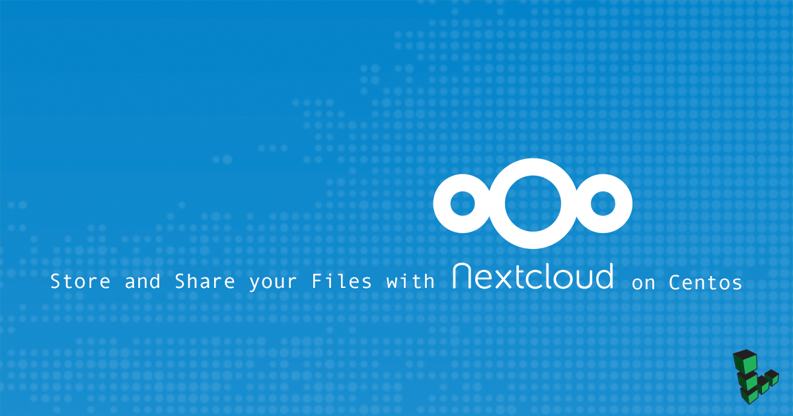

## Before You Begin

1.  If you have not already done so, create a Linode account and Compute Instance. See our [Getting Started with Linode](/docs/products/platform/get-started/) and [Creating a Compute Instance](/docs/products/compute/compute-instances/guides/create/) guides.

1.  Follow our [Setting Up and Securing a Compute Instance](/docs/products/compute/compute-instances/guides/set-up-and-secure/) guide to update your system. You may also wish to set the timezone, configure your hostname, create a limited user account, and harden SSH access.

1.  Install the *EPEL* repository:

        yum install epel-release -y

## Install MariaDB Database Server

1. Add the MariaDB 10.2 repository to force yum to install the latest version:

    
[mariadb]
name = MariaDB-10.2.3
baseurl = http://yum.mariadb.org/10.2.3/centos7-amd64
gpgkey=https://yum.mariadb.org/RPM-GPG-KEY-MariaDB
gpgcheck=1


2.  Install MariaDB and enable the service on system startup:

        yum install mariadb mariadb-server -y
        systemctl start mariadb
        systemctl enable mariadb

3.  Set up the MariaDB server with the `mysql_secure_installation` script. Respond to the prompts with the replies shown below:

        mysql_secure_installation

        Enter current password for root (enter for none): ENTER
        Set root password? [Y/n] Y
        Remove anonymous users? [Y/n] Y
        Disallow root login remotely? [Y/n] Y
        Remove test database and access to it? [Y/n] Y
        Reload privilege tables now? [Y/n] Y

4.  Create a database and user for Nextcloud in MariaDB. Login as `root` and enter the password set earlier. Be sure to create a strong password to replace the `CREATE-PASSWORD-HERE` text:

        mysql -u root -p

        MariaDB [(none)]> CREATE DATABASE nextcloud;
        MariaDB [(none)]> GRANT ALL PRIVILEGES ON nextcloud.* TO 'nextclouduser'@'localhost' IDENTIFIED BY 'CREATE-PASSWORD-HERE' WITH GRANT OPTION;
        MariaDB [(none)]> FLUSH PRIVILEGES;
        MariaDB [(none)]> quit

## Install Apache Web Server

1.  Install Apache and enable the service on system startup:

        yum install httpd -y
        systemctl start httpd
        systemctl enable httpd

2.  Disable Apache's WebDAV modules to prevent conflict with Nextcloud's WebDAV modules:

        sudo sed -i 's/^/#&/g' /etc/httpd/conf.modules.d/00-dav.conf

3.  Restart Apache to reflect changes:

        systemctl restart httpd

## Install PHP 7.1 and Required Modules

1.  Add the Remi repository:

        rpm -Uvh http://rpms.remirepo.net/enterprise/remi-release-7.rpm

2.  Install the *yum-utils* package:

        yum install yum-utils -y

3.  Update the system to populate the Remi repository:

        yum update -y

4.  Direct the system to use PHP 7.1 and issue installation command:

        yum-config-manager --enable remi-php71
        yum install php71-php php-mbstring php-zip php71-php-opcache php71-php-mysql php71-php-pecl-imagick php71-php-intl php71-php-mcrypt php71-php-pdo php-ZendFramework-Db-Adapter-Pdo-Mysql php71-php-pecl-zip php71-php-mbstring php71-php-gd php71-php-xml -y

5.  The default file upload size PHP will allow is 2MB. Increase (or decrease) the allowed file size to your preferred value. The example below will set a 512MB file upload size and no limit for the post size:

        sudo cp /etc/php.ini /etc/php.ini.bak
        sudo sed -i "s/post_max_size = 8M/post_max_size = 0/" /etc/php.ini
        sudo sed -i "s/upload_max_filesize = 2M/upload_max_filesize = 512M/" /etc/php.ini

6.  Restart Apache:

        systemctl restart httpd

## Install Nextcloud 12

1.  Check the [Nextcloud download page](https://nextcloud.com/install/#instructions-server) for the latest version and replace `12.0.4` in the command below with the appropriate version number:

        cd /opt
        sudo yum install wget
        wget https://download.nextcloud.com/server/releases/nextcloud-12.0.4.zip

2.  Unzip the package:

        sudo yum install unzip
        unzip nextcloud-x.y.z.zip

3.  Move the entire unzipped Nextcloud folder to the root web directory and grant permissions to the `apache` user for all contents:

        cp -r nextcloud /var/www/html

4.  Grant permissions to the Nextcloud folder and all its contents to the Apache user. Determine which user Apache is running with the first command below. Replace `apache:apache` in the second command with the output if it differs:

        ps -ef | egrep '(httpd|apache2|apache)' | grep -v `whoami` | grep -v root | head -n1 | groups $(awk '{print $1}')
        chown apache:apache -R /var/www/html/nextcloud

5.  Navigate to the `nextcloud` root web directory, and complete the Nextcloud installation:

        cd /var/www/html/nextcloud
        sudo -u apache php occ maintenance:install --database "mysql" --database-name "nextcloud"  --database-user "nextclouduser" --database-pass "yourpassword" --admin-user "admin" --admin-pass "adminpassword"

6.  If the installation is successful, you will receive the following message:

        Nextcloud was successfully installed

7.  Since these files are now internet-facing, set stronger permissions to improve security:

        find /var/www/html -type f -print0 | sudo xargs -0 chmod 0640
        find /var/www/html -type d -print0 | sudo xargs -0 chmod 0750

8.  Update the URL in the `config.php` file to accommodate the `nextcloud` subfolder added within the document root. Match the `overwrite.cli.url` and `htaccess.RewriteBase` lines:

    
. . .

),
  'datadirectory' => '/var/www/html/nextcloud/data',
  'overwrite.cli.url' => 'http://localhost/nextcloud',
  'htaccess.RewriteBase' => '/nextcloud',
  'dbtype' => 'mysql',
  'version' => '12.0.3.3',
  'dbname' => 'nextcloud',

. . .


9. Update the `.htaccess` file with the URL changes:

        sudo -u apache php /var/www/nextcloud/occ maintenance:update:htaccess

10. Navigate to `your-Linode-IP-address/nextcloud` (replace `your-Linode-IP-address`) and the Nextcloud page should load with a login page for the admin user you created earlier.

    To check the status of your Nextcloud environment, use the following `occ` command:

        sudo -u apache /var/www/html/nextcloud/ php occ status

## Where to Go from Here

Once you have successfully installed you Nextcloud environment, you may want to further integrate it into an owned domain name or make adjustments to your web server to serve SSL encrypted pages. See Nextcloud's [Enabling SSL](https://docs.nextcloud.com/server/12/admin_manual/installation/source_installation.html#enabling-ssl) guide to enable SSL.

Although Apache was used as the web server in this guide, installing Nextcloud with nginx is possible as well. Navigate to the [Nextcloud NGINX Configuration](https://docs.nextcloud.com/server/12/admin_manual/installation/nginx.html) documentation to setup Nextcloud with NGINX.

[Nextcloud Talk](https://nextcloud.com/talk/), is an addon to Nextcloud that allows for secure text and video conferencing through Nextcloud's platform. Check out our guide on how to [Install Nextcloud Talk](/docs/guides/install-nextcloud-talk/).
