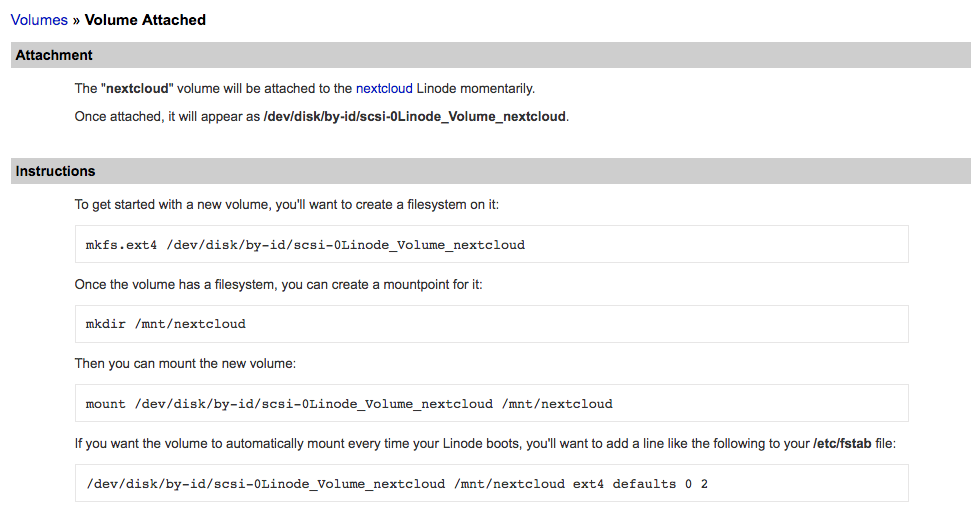
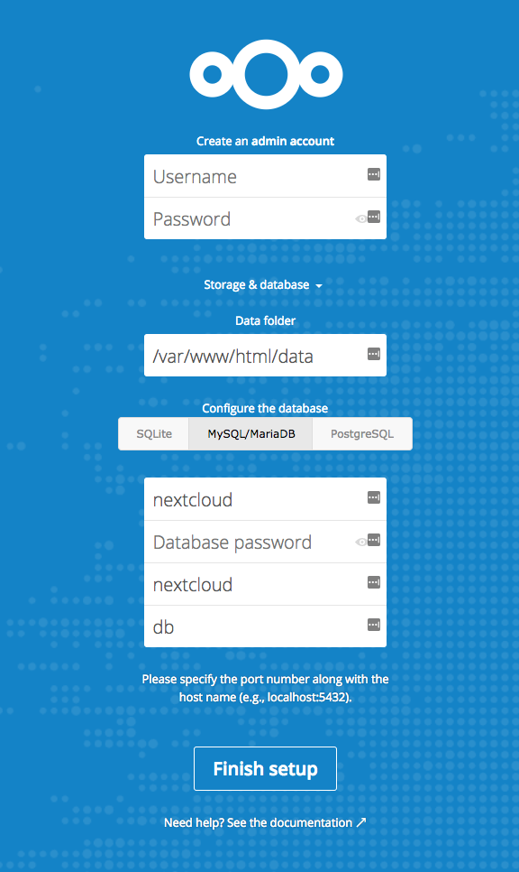
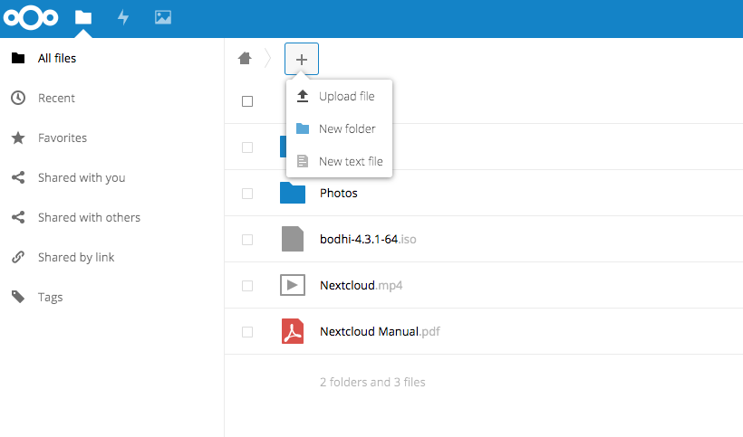

## What is Nextcloud?

Nextcloud is a cloud storage platform that allows you to store and access your files from any device. This guide shows how to attach a Block Storage Volume to a Linode in order to meet the demands of a large file library.

## Before You Begin

- You will need root access to your Linode, or a user account with `sudo` privilege.
- Update your system.

## Install Docker and Docker Compose

### Docker



### Docker Compose



## Attach a Block Storage Volume

1.  Create a Block Storage Volume and attach it to your Linode. See [View, Create, and Delete Block Storage Volumes](/docs/products/storage/block-storage/guides/manage-volumes/) for instructions on how to do this from the Linode Manager.

    * You can also use the [Linode CLI](https://github.com/linode/linode-cli) to create a new Volume. The command below creates a 20GB Volume with the label `nextcloud` attached to a Linode labeled `nextcloud-linode`. Adjust the command as needed:

            linode-cli volume create nextcloud -l nextcloud-linode -s 20

2.  Create a filesystem on the Block Storage Volume, then create a mount point per the instructions from the Linode Manager:

    

3.  Check available disk space. Notice that there is some overhead with the Volume due to the file system:

        df -BG

    
Filesystem     1G-blocks  Used Available Use% Mounted on
/dev/root            20G    2G       18G   6% /
devtmpfs              1G    0G        1G   0% /dev
tmpfs                 1G    0G        1G   0% /dev/shm
tmpfs                 1G    1G        1G   2% /run
tmpfs                 1G    0G        1G   0% /run/lock
tmpfs                 1G    0G        1G   0% /sys/fs/cgroup
tmpfs                 1G    0G        1G   0% /run/user/1000
/dev/sdc             20G    1G       19G   1% /mnt/nextcloud


4.  Change the ownership of the mount point:

        sudo chown username:username /mnt/nextcloud/

## Configure Nextcloud with Docker Compose

Nextcloud provides an official `docker-compose.yml` file for persisting data to a database when running the Nextcloud container. You can edit this file to bind the data volumes to your Block Storage Volume's mount point.

1.  Create a directory for Nextcloud:

        mkdir ~/nextcloud && cd ~/nextcloud

2.  In a text editor, create `docker-compose.yml` and add the following content. Add an appropriate password for MariaDB:

    
version: '2'

volumes:
  nextcloud:
  db:

services:
  db:
    image: mariadb
    restart: always
    volumes:
      - /mnt/nextcloud/:/var/lib/mysql
    environment:
      - MYSQL_ROOT_PASSWORD=
      - MYSQL_PASSWORD=
      - MYSQL_DATABASE=nextcloud
      - MYSQL_USER=nextcloud

  app:
    image: nextcloud
    ports:
      - 8080:80
    links:
      - db
    volumes:
      - /mnt/nextcloud/data:/var/www/html
    restart: always


3.  Launch the Docker Compose configuration:

        docker-compose up -d

    Nextcloud should be available at port `8080` on your Linode's public IP address.

4.  When creating an admin account, open the **Storage & database** drop-down menu, fill in the information as shown below, and enter the MariaDB password you used in the `docker-compose` file:

    


The setup provided by Nextcloud does not include any SSL encryption. To secure your data and communications, the Nextcloud service should be placed behind a [reverse proxy](https://docs.nginx.com/nginx/admin-guide/web-server/reverse-proxy/). A Docker Compose file using an NGINX reverse proxy and Let's Encrypt is also [available](https://github.com/nextcloud/docker/blob/master/.examples/docker-compose/with-nginx-proxy/mariadb/apache/docker-compose.yml).


## Upload Data

1.  After you have created an admin account, the Nextcloud dashboard will be displayed. Click on the `+` icon in the upper left and select **Upload file**. For demonstration purposes, choose a large file (an Ubuntu `.iso` file was used to generate the output below).

    

2.  After the file has uploaded successfully, return to the terminal and check to see your available space:

        df -BG

    
Filesystem     1G-blocks  Used Available Use% Mounted on
/dev/root            20G    2G       17G  11% /
devtmpfs              1G    0G        1G   0% /dev
tmpfs                 1G    0G        1G   0% /dev/shm
tmpfs                 1G    1G        1G   2% /run
tmpfs                 1G    0G        1G   0% /run/lock
tmpfs                 1G    0G        1G   0% /sys/fs/cgroup
/dev/sdc             20G    2G       17G  11% /mnt/nextcloud
tmpfs                 1G    0G        1G   0% /run/user/1000


    The output should show that the file has been stored in `/mnt/nextcloud`, which is the mount point for the Block Storage Volume.
