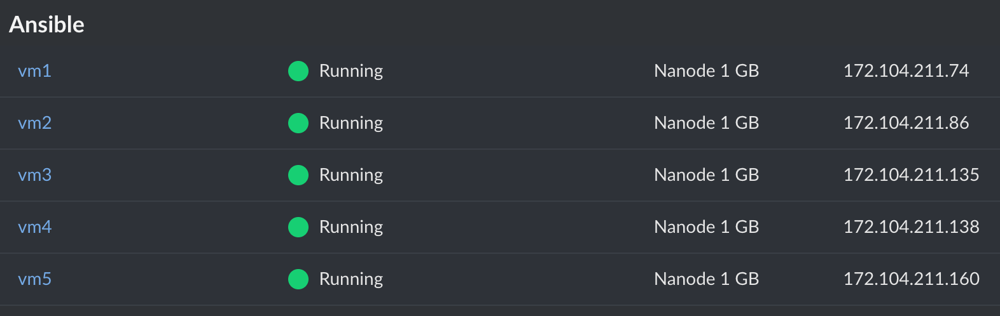

## What is Ansible?

Ansible is an open-source, software provisioning tool that automates application and IT infrastructure deployment. It is lightweight and agent-less, meaning there is no client or server software to install. Ansible uses SSH and Python to accomplish its highly useful automation tasks.

In this guide you:
- Deploy and configure five Linodes. One is the Ansible control node and the others are worker nodes.
- Configure and run an Ansible playbook that configures the worker nodes.
- Test your running web servers and log server.


The example instructions in this guide create five, [1GB Linodes](https://www.linode.com/pricing). These add billable resources to your Linode account. If you do not want to keep using the Linodes created, be sure to delete them once you have finished this how-to guide.

If you remove these resources afterward, you are only [billed for the time](/docs/guides/understanding-billing-and-payments/) the resources were present on your account.


## Prerequisites

- Intermediate understanding of the Bash shell and its utilities.
- Install the [Linode CLI](/docs/products/tools/cli/guides/install/) or you can use the [Linode Cloud Manager](https://cloud.linode.com/linodes).
  - Using the CLI allows you to save time creating, labeling, and tagging your Linodes.
- Create a new directory to work from. For example, you can name it, **"Ansible_Infra"**.


The steps in this guide are written for non-root users. Commands that require elevated privileges are prefixed with `sudo`. If you’re not familiar with the `sudo` command, see the [Users and Groups](/docs/guides/linux-users-and-groups/) guide.


## Create Five Linodes Using the Linode CLI

### Create One Ansible Control Node and Four Managed Nodes


This section requires that you have the [Linode CLI](/docs/products/tools/cli/guides/install/) installed and configured on your computer.


On your local machine, set up an environment variable to temporarily store a password. This environment variable will be sued in later steps in a `for` loop to create five Linodes. Substitute `yourrootpassword` for a secure password as this is used as the root password for all your newly created Linodes.

    pass=yourrootpassword

Check if this password works by running `echo $pass`. You should see your newly created password as the output.


echo $pass
yourrootpassword


Run the command below to create five Linodes.

    for i in {1..5}; do linode-cli linodes create --root_pass $pass; done

Your output should resemble the following example:


┌──────────┬────────────────┬─────────┬─────────────┬────────────────────┬──────────────┬────────────────┐
│ id       │ label          │ region  │ type        │ image              │ status       │ ipv4           │
├──────────┼────────────────┼─────────┼─────────────┼────────────────────┼──────────────┼────────────────┤
│ 31202535 │ linode31202535 │ us-east │ g6-nanode-1 │ linode/ubuntu20.04 │ provisioning │ 192.0.2.0      │
└──────────┴────────────────┴─────────┴─────────────┴────────────────────┴──────────────┴────────────────┘
┌──────────┬────────────────┬─────────┬─────────────┬────────────────────┬──────────────┬────────────────┐
│ id       │ label          │ region  │ type        │ image              │ status       │ ipv4           │
├──────────┼────────────────┼─────────┼─────────────┼────────────────────┼──────────────┼────────────────┤
│ 31202548 │ linode31202548 │ us-east │ g6-nanode-1 │ linode/ubuntu20.04 │ provisioning │ 192.0.2.1      │
└──────────┴────────────────┴─────────┴─────────────┴────────────────────┴──────────────┴────────────────┘
┌──────────┬────────────────┬─────────┬─────────────┬────────────────────┬──────────────┬─────────────────┐
│ id       │ label          │ region  │ type        │ image              │ status       │ ipv4            │
├──────────┼────────────────┼─────────┼─────────────┼────────────────────┼──────────────┼─────────────────┤
│ 31202559 │ linode31202559 │ us-east │ g6-nanode-1 │ linode/ubuntu20.04 │ provisioning │ 192.0.2.2       │
└──────────┴────────────────┴─────────┴─────────────┴────────────────────┴──────────────┴─────────────────┘
┌──────────┬────────────────┬─────────┬─────────────┬────────────────────┬──────────────┬─────────────────┐
│ id       │ label          │ region  │ type        │ image              │ status       │ ipv4            │
├──────────┼────────────────┼─────────┼─────────────┼────────────────────┼──────────────┼─────────────────┤
│ 31202570 │ linode31202570 │ us-east │ g6-nanode-1 │ linode/ubuntu20.04 │ provisioning │ 192.0.2.3       │
└──────────┴────────────────┴─────────┴─────────────┴────────────────────┴──────────────┴─────────────────┘
┌──────────┬────────────────┬─────────┬─────────────┬────────────────────┬──────────────┬─────────────────┐
│ id       │ label          │ region  │ type        │ image              │ status       │ ipv4            │
├──────────┼────────────────┼─────────┼─────────────┼────────────────────┼──────────────┼─────────────────┤
│ 31202576 │ linode31202576 │ us-east │ g6-nanode-1 │ linode/ubuntu20.04 │ provisioning │ 192.0.2.4       │
└──────────┴────────────────┴─────────┴─────────────┴────────────────────┴──────────────┴─────────────────┘


### Store Your Linode Ids In a Temporary File

Use the following command to print the last five Linode IDs and redirect the output to the `tmp.txt` file. You can use these Linode IDs to tag and label your Linodes.


Tagging and labeling your Linodes helps to keep your Linode Cloud Manager organized.


    linode-cli linodes list --text | tail -5 | awk '{print $1}' > tmp.txt

### Tag Your Ansible Linodes

Use the following line of code to tag the Linodes with "Ansible". Doing this groups the Linodes together in the Cloud Manager.

    for i in $(cat tmp.txt); do linode-cli linodes update --tags Ansible $i; done

### Label Your Ansible Linodes

Loop through the Linode IDs from the `tmp.txt` file you created earlier. Then, assign each Linode a numbered label (`vm1` through `vm5`) using the following line of code.

    i=1; for j in $(cat tmp.txt); do linode-cli linodes update --label vm$i $j; let "i++"; done

If you check the Cloud Manager GUI, you can see these five Linodes grouped under the tag "Ansible" and labeled `vm1` through `vm5`.

## Create Setup Files to Configure the Ansible Control Node and Worker Nodes

Create three files named `ansibleCN_setup.sh`, `ansibleMN_setup.sh`, and `myplaybook.yml`. Using a text editor, copy and paste the code in the example files below into each respective file. The setup files help to secure your Linode, install needed software, and create a limited user on your instance. The playbook file, `myplaybook.yml` is what Ansible uses to configure the managed nodes.


As a shortcut, you can also `wget` the configuration files from [the author's GitHub repository](https://github.com/bennettnw2/Ansible_webserver_infra_files) and save them in your local, working folder, `Ansible_Infra` that you created earlier.

    wget https://raw.githubusercontent.com/bennettnw2/Ansible_webserver_infra_files/main/ansibleCN_setup.sh
    wget https://raw.githubusercontent.com/bennettnw2/Ansible_webserver_infra_files/main/ansibleMN_setup.sh
    wget https://raw.githubusercontent.com/bennettnw2/Ansible_webserver_infra_files/main/myplaybook.yml



#! /bin/bash
# This is the script to run to setup an Ansible control node.

echo "##########################################################"
echo "# Update and Secure Linode Instance                      #"
echo "##########################################################"

apt update
apt upgrade -y

hostnamectl set-hostname CtlNode

# Secure ssh a bit with no root login and no x11 forwarding
# Need to remove host key checking for Ansible to run properly
sed -in 's/PermitRootLogin yes/PermitRootLogin no/' /etc/ssh/sshd_config
sed -in 's/X11Forwarding yes/X11Forwarding no/' /etc/ssh/sshd_config
sed -in 's/#   StrictHostKeyChecking ask/StrictHostKeyChecking no/' /etc/ssh/ssh_config

echo "##########################################################"
echo "# Installing Software                                    #"
echo "##########################################################"
# Install Software
# ====================================================================================================
apt install sshpass -y
apt install ansible -y
apt install fail2ban -y
apt install python3-pip -y
pip3 install passlib

# Configure Software
# ====================================================================================================
# fail2ban
# ========
systemctl enable fail2ban.service
systemctl start fail2ban.service
# ufw
# ========
ufw allow openssh
yes | ufw enable
ufw status

echo "##########################################################"
echo "# Creating limited user                                  #"
echo "##########################################################"
echo ""
echo "Please enter preferred username: "
read USERNAME
# Create limited user and give sudo privileges.
useradd -m -G sudo -s /bin/bash $USERNAME
passwd $USERNAME

mv ansibleMN_setup.sh myplaybook.yml /home/$USERNAME

# Create passwordless sudo for user $USERNAME
#+ and add file in /etc/sudoers.d/
echo "$USERNAME ALL=(ALL) NOPASSWD:ALL" > /etc/sudoers.d/10-user-$USERNAME
chmod 440 /etc/sudoers.d/10-user-$USERNAME
visudo -c

# Create an ssh key for the user.
mkdir /home/$USERNAME/.ssh
ssh-keygen -t rsa -b 2048 -f /home/$USERNAME/.ssh/id_rsa -q -N ''

# Set file permissions for the user.
chown -R $USERNAME:$USERNAME /home/$USERNAME/.ssh
chown $USERNAME:$USERNAME /home/$USERNAME/myplaybook.yml

echo "##########################################################"
echo "# Dunzo. Poke around if you like.  I recommend a reboot. #"
echo "##########################################################"



#!/bin/bash
# This is the script to run in order to setup Ansible managed nodes.

echo "##########################################################"
echo "# Update and Secure Linode Instance                      #"
echo "##########################################################"
apt update
apt upgrade -y

# Secure ssh a bit with no root login and no x11 forwarding.
sed -in 's/PermitRootLogin yes/PermitRootLogin no/' /etc/ssh/sshd_config
sed -in 's/X11Forwarding yes/X11Forwarding no/' /etc/ssh/sshd_config
sed -in 's/#PubkeyAuthentication/PubkeyAuthentication/' /etc/ssh/sshd_config

apt install fail2ban -y
systemctl enable fail2ban.service
systemctl start fail2ban.service

echo "##########################################################"
echo "# Creating limited user                                  #"
echo "##########################################################"
echo ""
echo "Please enter preferred username: "
read USERNAME
# Create limited user and give sudo privileges.
useradd -m -G sudo -s /bin/bash $USERNAME
passwd $USERNAME

# Create passwordless sudo execution for user $USERNAME
#+ and add file in /etc/sudoers.d/
echo "$USERNAME ALL=(ALL) NOPASSWD:ALL" > /etc/sudoers.d/10-user-$USERNAME
chmod 440 /etc/sudoers.d/10-user-$USERNAME
visudo -c

echo "##########################################################"
echo "# Dunzo. Poke around if you like.  I recommend a reboot. #"
echo "##########################################################"


Ansible playbooks are what makes Ansible powerful software. The syntax of the tasks is very similar to plain language and therefore, makes the playbook file human readable. As a best practice, ensure your task names are descriptive and precise. Review the names of the tasks in `myplaybook.yml`, to learn what each task is supposed to do accomplish.


---
- hosts: webservers
  become: yes
  tasks:
    - name: "Install Apache Server"
      apt:
        name: apache2
        state: present

    - name: "Enable and Start Apache Server"
      service:
        name: apache2
        enabled: yes
        state: started

    - name: "Install Firewalld"
      apt:
        name: firewalld
        state: present

    - name: "Enable and start firewalld server"
      service:
        name: firewalld
        enabled: yes
        state: started

    - name: "Open Firewall Port"
      firewalld:
        service: http
        immediate: true
        permanent: true
        state: enabled

    - name: "Create web admin group"
      group:
        name: web
        state: present

    - name: "Create web admin user"
      user:
        name: webadm
        comment: "Web Admin"
        password: {{ HASHED_PASSWORD }}
        groups: web
        append: yes

    - name: "Set content directory group/permissions"
      file:
        path: /var/www/html
        owner: root
        group: web
        state: directory
        mode: u=rwx,g=rwx,o=rx,g+s

    - name: "Create default page content"
      copy:
        content: "Welcome to {{ ansible_fqdn }} on {{ ansible_default_ipv4.address }}"
        dest: /var/www/html/index.html
        owner: webadm
        group: web
        mode: u=rw,g=rw,o=r

- hosts: dbservers
  become: yes
  tasks:
    - name: "Install MariaDB Server"
      apt:
        name: mariadb-server
        state: present

    - name: "Enable and start MariaDB server"
      service:
        name: mariadb
        enabled: yes
        state: started

- hosts: logservers
  become: yes
  tasks:
    - name: "Configure rsyslog remote log reception over udp"
      lineinfile:
        path: /etc/rsyslog.conf
        line: "{{ item }}"
        state: present
      with_items:
        - '$ModLoad imudp'
        - '$UDPServerRun 514'
      notify:
        - restart rsyslogd

    - name: "Install Firewalld"
      apt:
        name: firewalld
        state: present

    - name: "Enable and start firewalld server"
      service:
        name: firewalld
        enabled: yes
        state: started

    - name: "Open firewall port"
      firewalld:
        port: 514/udp
        immediate: true
        permanent: true
        state: enabled

  handlers:
    - name: "restart rsyslogd"
      service:
        name: rsyslog
        state: restarted

- hosts: lamp
  become: yes
  tasks:
    - name: configure rsyslog
      lineinfile:
        path: /etc/rsyslog.conf
        line: '*.* @{{ LOG_IP_ADDRESS }}'
        state: present
      notify:
        - restart rsyslogd

  handlers:
    - name: "restart rsyslogd"
      service:
        name: rsyslog
        state: restarted


## Configure Your Control Node

Using `scp`, the above files are sent to the Ansible control node. You can then log into the control node and execute the control node script, `ansibleCN_setup.sh`.


Throughout all the steps in this section, replace `VM1_IPADDRESS` with the [IP address](/docs/guides/find-your-linodes-ip-address/) obtained from either the Linode CLI or Cloud Manager.



Do not forget the colon "**:**" at the end of the command below.


    scp ansibleCN_setup.sh ansibleMN_setup.sh myplaybook.yml root@VM1_IPADDRESS:

### Update, Secure, and Install Package Dependencies on the Linode

1. SSH into `vm1` and run `ansibleCN_setup.sh`. This updates, secures, and installs only the needed dependencies on the Linode.

        ssh root@VM1_IPADDRESS

1. Change the permissions on `ansibleCN_setup.sh` and `ansibleMN_setup.sh` to be executable.

        chmod 744 ansibleCN_setup.sh ansibleMN_setup.sh

1. Execute `ansibleCN_setup.sh` script. It takes a few minutes for the script to complete.

        ./ansibleCN_setup.sh

    
The script asks you to enter a username and password for the new user being created.


### Reboot and Access your Ansible Linode

Use the command below to reboot the Linode either using the Linode CLI. You can also [reboot the Linode](/docs/products/tools/cloud-manager/guides/cloud-reboot-linode/) using the Cloud Manager.

    linode-cli linodes reboot LINODE_ID

Use the command below to SSH into `vm1`.


Be sure to use the new user you created because the setup script disables root logins.


    ssh YOUR_USERNAME@VM1_IPADDRESS

You should see the hostname, **CtlNode**, configured on the command prompt along with your username.


example_user@CtlNode:~$


## Configure your Control Node to Connect to the Worker Nodes

### Set Up your Control Node's Hosts File

This enables you to use hostnames when referring to different instances. Run the command below from your local machine.

    linode-cli linodes list --text | grep vm | awk '{print $7,$2,$2".ansi.com"}' | column -t

Your output should resemble the following example:


192.0.2.0  vm1  vm1.ansi.com
192.0.2.1  vm2  vm2.ansi.com
192.0.2.2  vm3  vm3.ansi.com
192.0.2.3   vm4  vm4.ansi.com
192.0.2.4  vm5  vm5.ansi.com


Using the text editor of your choice, copy and paste this output to the end of the `/etc/hosts/` file on `vm1`.


Use `sudo` to edit `/etc/hosts` using Vi(m).


Use the line of code below to ensure you can ping all the hostnames.

    for i in {1..5}; do ping -c 2 vm$i; done

## Create Ansible Configs on the Control Node

Using a text editor, create and copy the configuration file, `ansible.cfg`, to your home directory.


[defaults]
inventory = $HOME/hosts


Create and copy the below Ansible hosts configuration file to your home directory.

 
 [webservers]
 vm2
 vm3

 [dbservers]
 vm4

 [logservers]
 vm5

 [lamp:children]
 webservers
 dbservers


Using the command below to ensure all hosts are accessible.

    ansible all --list-hosts

Your output should resemble the following:


example_user@CtlNode:~$ ansible all --list-hosts
  hosts (4):
    vm5
    vm2
    vm3
    vm4


## Set Up Ansible Playbook to Configure Worker Nodes

### Create and Add Hashed, Plain-Text Password to Ansible Playbook

Run the command below from your Ansible control node. The command prompts you for a password. This password is used to access the web servers.

     python3 -c "from passlib.hash import sha512_crypt; import getpass; print(sha512_crypt.hash(getpass.getpass()))"

Be sure to copy the output from the dollar sign to the period. Paste the resulting hashed password into `myplaybook.yml`, in the place holder, **{{ HASHED_PASSWORD }}**.

### Add your Log Server IP Address to Playbook

Grab the IP address of logging sever (`vm5`) and paste it into `configure rsyslog` section of `myplaybook.yml`. Paste the IP address into the place holder, **{{ LOG_IP_ADDRESS }}**.

## Configure Ansible Managed Nodes

### Send Setup Script to Each Managed Node

Create a password file to use in the next step. Use the same root password you used when creating these Linodes.

    echo 'yourrootpassword' > ~/.ssh/file

Send the managed node setup script to each managed node.

    for i in {2..5}; do sshpass -f ~/.ssh/file scp ansibleMN_setup.sh root@vm$i:/root/; done

Check to make sure each managed node contains the script by sending the `ls` command via ssh.

    for i in {2..5}; do sshpass -f ~/.ssh/file ssh root@vm$i 'ls'; done

The resulting output is the following:


example_user@CtlNode:~$ for i in {2..5}; do sshpass -f ~/.ssh/file ssh root@vm$i 'ls'; done
ansibleMN_setup.sh
ansibleMN_setup.sh
ansibleMN_setup.sh
ansibleMN_setup.sh


### Log into Each Worker Node and Run the Setup Script

From the local computer, open four terminal sessions, and within each session, ssh into each managed node (`vm2` - `vm5`). Once logged in, execute the managed node setup script.

    ./ansibleMN_setup.sh


The script asks you to enter a username and password for the new user being created.


Once the setup script has been completed for each managed node, reboot all your Ansible infrastructure Linodes with the command below.

    for i in $(cat tmp.txt); do linode-cli linodes reboot $i; done

### Upload the SSH Key from the Control Node to the Managed Nodes

Log back into the control node and run the command below. This sends the control node's limited user's ssh key to each managed node. This allows easy, secure ssh communication from the control node to the managed nodes.

    for i in {2..5}; do sshpass -f ~/.ssh/file ssh-copy-id $USER@vm$i; done


If the limited user's password is different from the root user's password, change the `~/.ssh/file` contents to match the limited user's password.


Confirm all hosts can be pinged using Ansible. A successful run of this command indicates the [ssh communication is working.](https://docs.ansible.com/ansible/2.7/user_guide/intro_getting_started.html#remote-connection-information)

    ansible all -m ping


example_user@CtlNode:~$ ansible all -m ping
vm4 | SUCCESS => {
    "ansible_facts": {
        "discovered_interpreter_python": "/usr/bin/python3"
    },
    "changed": false,
    "ping": "pong"
}
vm3 | SUCCESS => {
    "ansible_facts": {
        "discovered_interpreter_python": "/usr/bin/python3"
    },
    "changed": false,
    "ping": "pong"
}
vm2 | SUCCESS => {
    "ansible_facts": {
        "discovered_interpreter_python": "/usr/bin/python3"
    },
    "changed": false,
    "ping": "pong"
}
vm5 | SUCCESS => {
    "ansible_facts": {
        "discovered_interpreter_python": "/usr/bin/python3"
    },
    "changed": false,
    "ping": "pong"
}


## Run the Ansible Playbook to Configure Managed Nodes

Run the playbook with the command below:

    ansible-playbook myplaybook.yml

If all is successful, you should see the output included below. Note that `unreachable` and `failed` both show `0` instances.

Truncated output:


example_user@CtlNode:~$ ansible-playbook myplaybook.yml

PLAY [webservers] *************************************************************************************************

TASK [Gathering Facts] ********************************************************************************************
ok: [vm3]
ok: [vm2]

TASK [Install Apache Server] **************************************************************************************
changed: [vm3]
changed: [vm2]

{ ... }

PLAY RECAP ********************************************************************************************************
vm2                        : ok=13   changed=9    unreachable=0    failed=0    skipped=0    rescued=0    ignored=0
vm3                        : ok=13   changed=9    unreachable=0    failed=0    skipped=0    rescued=0    ignored=0
vm4                        : ok=6    changed=3    unreachable=0    failed=0    skipped=0    rescued=0    ignored=0
vm5                        : ok=6    changed=4    unreachable=0    failed=0    skipped=0    rescued=0    ignored=0


## Check the Playbook Run for Success

cURL the IP addresses of the web servers. (`vm2` and `vm3`)

    curl vm2_IPADDRESS
    curl vm3_IPADDRESS


example_user@CtlNode:~$ curl 192.0.2.1
Welcome to li1924-155 on 192.0.2.1

example_user@CtlNode:~$ curl 192.0.2.2
Welcome to li1924-165 on 192.0.2.2


Send a `logger` command to the LAMP stack defined in the `hosts` file.

    ansible lamp -m command -a 'logger hurray it works'


example_user@CtlNode:~$ ansible lamp -m command -a 'logger hurray it works'
vm4 | CHANGED | rc=0 >>

vm3 | CHANGED | rc=0 >>

vm2 | CHANGED | rc=0 >>


Search the log server for the entry you just sent.

    ansible logservers -m command -a "grep 'hurray it works$' /var/log/syslog" -b


example_user@CtlNode:~$ ansible logservers -m command -a "grep 'hurray it works$' /var/log/syslog" -b
vm5 | CHANGED | rc=0 >>
Oct 25 21:22:00 li1924-200 example_user: hurray it works
Oct 25 21:22:00 li1924-165 example_user: hurray it works
Oct 25 21:22:00 li1924-155 example_user: hurray it works


You have now completed the deployment of your web server, log server, and database server using Ansible.
