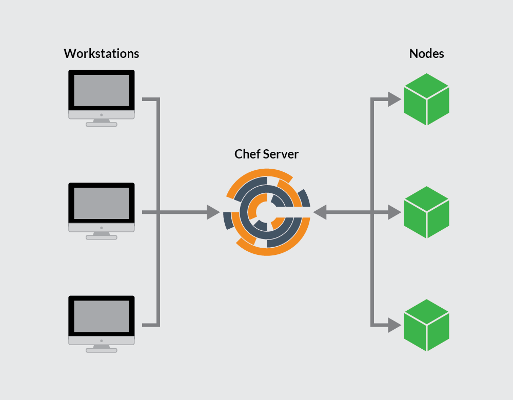

*Chef* is a declarative configuration management and automation platform used to translate infrastructure into code. This enables a development and deployment process with better testing, efficient and predictable deployments, centralized versioning, and reproducible environments across all servers.

Chef works with three core components:

- **A Chef server:** As the center of operations, the Chef server stores, manages and provides configuration data to all other Chef components.
- **Chef Workstations:** Workstations are personal computers or virtual servers where the configuration code for Chef is created, tested, and changed. There can be as many workstations as needed, whether this is one per person or otherwise.
- **Chef Nodes:** Nodes are the servers Chef pushes changes to, generally a fleet of multiple machines that require the benefits of automation. Chef can manage nodes that are virtual servers, containers, network devices, and storage devices. A Chef client is installed on every node that is managed by Chef.

These three components allow Chef to communicate in a mostly linear fashion, with any changes pushed from workstations to the Chef server, and then pulled from the server to the nodes and implemented on each node through the Chef client. In turn, information about the node passes to the server to determine which files are different from the current settings and need to be updated.

After reading this guide, if you wish to further explore implementing Chef, see [Setting Up a Chef Server, Workstation, and Node on Ubuntu 18.04](/docs/guides/install-a-chef-server-workstation-on-ubuntu-18-04/) and [Creating Your First Chef Cookbook](/docs/guides/creating-your-first-chef-cookbook/).

## The Chef Server

The Chef server provides a communication pathway between the workstations where the infrastructure coding takes place, and the nodes that are configured by those workstations. All configuration files, cookbooks, metadata, and other information are created on workstations and stored on the Chef server. The Chef server also keeps a record of the state of all nodes at the time of the last [chef-client](#chef-client) run.

A workstation communicates with the Chef server using [*Knife*](/docs/guides/beginners-guide-chef/#knife) and Chef command-line tools, while nodes communicate with the Chef server using the [Chef client](/docs/guides/beginners-guide-chef/#chef-client).

Any changes made to your infrastructure code must pass through the Chef server to be applied to nodes. Prior to accepting or pushing changes, the Chef server authenticates all communication via its REST API using public key encryption.

### Components of a Chef Server
Chef Server is made up of several components to help efficiently communicate with workstations and nodes. Each Chef server has an NGINX front-end load balancer to route all requests to the API, a PostgreSQL database, an Apache Solr instance (wrapped by chef-solr) for indexing and search, and an enterprise web interface (known as Chef automate) for common Chef server management tasks and aggregated data analytics. All these components contribute to the Chef server's ability to handle requests for several thousands of nodes and can make Chef server a resource-heavy application, so a Chef server's minimum system requirements are a Linode with 8 GB of RAM and four CPU cores. For more specifications, see the [Chef System Requirements](https://docs.chef.io/chef_system_requirements.html) documentation page.

### Bookshelf

Chef Server uses a *Bookshelf* to store its cookbooks (and related files and templates). The Bookshelf is a versioned repository (generally located at `/var/opt/opscode/bookshelf`; full root access is necessary for access). When a cookbook is uploaded to the Chef server, the new version is compared to the one already stored. If there are changes, the new version is stored. The Chef server only stores one copy of a file or template, meaning if resources are shared between cookbooks and cookbook versions, they will not be stored multiple times.

## The Chef Workstation

A Chef workstation is where a user creates, tests, and maintains cookbooks and policies pushed to the Chef server and pulled by the Chef nodes. The workstation functionality is available by downloading the [Chef Workstation package](https://downloads.chef.io/chef-workstation/), which provides the chef and knife command-line tools, the testing tools (Test Kitchen, ChefSpec, Cookstyle, and Foodcritic), and [InSpec](https://www.chef.io/inspec/). Inspec is a tool for writing automated tests for compliance, security, and policy requirements. Additionally, *Berkshelf*, the dependency manager for Chef cookbooks, is installed.

The Chef workstation can be installed on virtual servers or personal computers. A Chef workstation will interact with a single Chef server, and most work is done in the `chef-repo` directory located on the workstation.

Cookbooks created on a Chef workstation can be used privately by one organization or uploaded to the [Chef Supermarket](https://supermarket.chef.io/) for others to use. Similarly, a Chef workstations can download cookbooks found in the Supermarket.

See Chef's [official documentation](https://docs.chef.io/workstation) for more in-depth information on Chef Workstation and its tools.

### chef-repo

A Chef workstation's `chef-repo` directory is where cookbooks are authored and maintained. Any supporting resources (such as roles, data bags, and environments) are also stored there. The `chef-repo` should be version-controlled with a remote version control system (such as Git). Chef can communicate with the server from the `chef-repo` and push any changes via the use of `knife` commands.

You can generate a Chef repository using the following command: `chef generate repo repo-name`.

### Knife

The Knife command-line tool is the primary way that a workstation communicates the contents of its `chef-repo` directory with a Chef server. It also provides an interface to manage nodes, cookbooks, roles, environments, and databags.

- A Knife command executed from the workstation uses the following format:

      knife subcommand [ARGUMENT] (options)

- For example, to view the details of a Chef user, execute the following command:

      knife user show USER_NAME

The Knife command-line tool is configured with the `knife.rb` file:


log_level                :info
log_location             STDOUT
node_name                'username'
client_key               '~/chef-repo/.chef/username.pem'
validation_client_name   'shortname-validator'
validation_key           '~/chef-repo/.chef/shortname.pem'
chef_server_url          'https://123.45.67.89/organizations/shortname'
syntax_check_cache_path  '~/chef-repo/.chef/syntax_check_cache'
cookbook_path [ '~/chef-repo/cookbooks' ]


The default `knife.rb` file is defined with the following properties:

-	**log_level:** The amount of logging to be stored in the log file. The default value, `:info`, notes that any informational messages will be logged. Other values include `:debug`, `:warn`, `:error`, and `:fatal`.
-	**log_location:** The location of the log file. The default value, `STOUT` is for *standard output logging*. If set to another value then standard output logging will still be performed.
-	**node_name:**	The username of the person using the workstation. This user requires a valid authorization key located on the workstation.
-	**client_key:** The location of the user's authorization key.
-	**validation_client_name:** The name for the server validation key determining whether a node is registered with the Chef server. These values must match during a chef-client run.
-	**validation_key:** The path to your organization's validation key.
-	**chef_server_url:** The URL of the Chef server, with `shortname` being the defined shortname of your organization (this can also be an IP address). `/organizations/shortname` must be included in the URL.
-	**syntax_check_cache_path:** The location in which `knife` stores information about files checked for appropriate Ruby syntax.
-	**cookbook_path:** The path to the cookbook directory.

Knife allows for a variety of other useful operations on the Chef server and nodes. View Chef's [Knife](https://docs.chef.io/knife.html) documentation for a full list of all available commands.

### Test Kitchen

Test Kitchen provides a development environment on a workstation to create, test, and iterate on cookbooks before distributing its contents to production nodes. The Kitchen command-line tool can be used to run integration tests against different platforms allowing testing against the variety of nodes running in a production environment. Refer to the [Kitchen CI](https://kitchen.ci/docs/getting-started/introduction/) documentation for information about getting started with Test Kitchen.

## The Chef Node

A Chef *node* is any machine managed by a Chef server. Chef can manage virtual servers, containers, network devices, and storage devices as nodes. Each node must have a corresponding Chef client installed to execute the steps needed to bring it to the required state defined by a cookbook.

Nodes are validated through the `validator.pem` and `client.pem` certificates created on the node when it is bootstrapped. All nodes must be bootstrapped over SSH as either the root user or a user with elevated privileges.

Nodes are kept up-to-date through chef-client, which runs a convergence between the node and the Chef server. What cookbooks and roles the node takes on depends on the run list and environment set for the node in question.

### chef-client

On a node, chef-client checks the node's current configuration against the recipes and policies stored on the Chef server and brings the node up to date. The process begins with the chef-client checking the node's [run list](#run-lists), loading the required cookbooks, then checking and syncing the cookbooks with the current configuration of the node.

The chef-client must be run with elevated privileges to configure the node correctly. It should run periodically to ensure that the server is always up to date (usually with a cron job or by setting up the chef-client to run as a service).

### Run Lists

Run lists define which [recipes](/docs/guides/beginners-guide-chef/#recipes) a Chef node will use. The run list is an ordered list of all [*roles*](http://docs.chef.io/server_manage_roles.html) and recipes chef-client needs to pull from the Chef server. Roles define patterns and attributes across nodes.

### Ohai

[Ohai](https://docs.chef.io/ohai/) collects system configuration data to be used in cookbooks and is required to be present on every Chef node. It is installed as part of the bootstrap process.

Ohai gathers data about network and memory usage, CPU data, kernel data, hostnames, FQDNs, and other automatic attributes. This data helps the Chef client determine the state of the node prior to applying that node's run list.

## Environments

Chef environments mimic a real-life workflow, allowing nodes to be organized into different groups that define the role the node plays in the fleet. This allows for users to combine environments and versioned cookbooks to have different attributes for different nodes. For example, if testing a shopping cart, you may not want to test any changes on the live website, but with a development set of nodes.

Environments are defined in `chef-repo/environments` and saved as Ruby or JSON files.

As a Ruby file:


name "environmentname"
description "environment_description"
cookbook_versions  "cookbook" => "cookbook_version"
default_attributes "node" => { "attribute" => [ "value", "value", "etc." ] }
override_attributes "node" => { "attribute" => [ "value", "value", "etc." ] }


As a JSON:


{
  "name": "environmentname",
  "description": "a description of the environment",
  "cookbook_versions": {

  },
  "json_class": "Chef::Environment",
  "chef_type": "environment",
  "default_attributes": {

  },
  "override_attributes": {

  }


All nodes are set to the "default" environment upon bootstrap. To change what environment a node is in, edit `/etc/chef/client.rb` on the nodes.

## Cookbooks

Cookbooks are the basis for managing the configurations on any node. Cookbooks contain values and information about the *desired state* of a node. Using the cookbook, the Chef server and Chef client ensure the defined state is achieved.

Cookbooks are comprised of recipes, metadata,  attributes, resources, templates, libraries, and anything else used to create a functioning system (attributes and recipes being the two core parts). Components of a cookbook should be modular, with recipes that are small and related.

Cookbooks should be version controlled. Versions can help when using different Chef environments, allowing distribution and collaboration with other team members.

### Recipes

Recipes are written in Ruby and contain information about everything needing to be run, changed, or created on a node. Recipes work as a collection of *resources* determining the configuration or policy of a node (with resources being a configuration element of the recipe). For a node to run a recipe, it must be on that node's run list.

The example recipe below is part of Chef's [Vim cookbook](https://github.com/chef-cookbooks/vim). It dictates the required Vim package based on a node's Linux distribution:


...

vim_base_pkgs = value_for_platform_family(
  %w(debian arch) => ['vim'],
  %w(rhel fedora) => ['vim-minimal', 'vim-enhanced'],
  'default' => ['vim']
)

package vim_base_pkgs

package node['vim']['extra_packages'] unless node['vim']['extra_packages'].empty?


### Attributes

Attributes define specific values about a node and its configuration. Attributes are often used in conjunction with templates and recipes to define settings, and are applied via the Chef client's attribute list. The Chef client can receive attributes from nodes, attribute files, recipes, environments, and roles. To learn more about attributes, refer to [Chef's documentation](https://docs.chef.io/attributes.html).

### Files

In chef, `files` refer to the static files that are uploaded to nodes. Files can be configuration and set-up files, scripts, website files, and more. For example, you may have a recipe that uses an `index.php` file. You can use a `cookbook_file` resource block within a recipe to create the file on a node. All static files should be stored in a cookbook’s “files” directory.

### Libraries

Although Chef comes with libraries built-in, additional libraries can be defined. Libraries allow you to write Ruby code to include in a cookbook. Libraries are a convenient way to include helper code for your existing recipes. Libraries provide a powerful way to extend the resources created by your recipes.

### Resources

Resources are written in Ruby and defined in recipe files. Resources must contain a type, a name, one or more properties, and one or more actions. Resources are the key components making up any single recipe. To learn more, visit [Chef's official documentation](https://docs.chef.io/resource.html).

### Templates

Templates are embedded Ruby files (`.erb`) used to dynamically create static text files. To use a template within a Chef cookbook, a template resource must be declared in a recipe and include a corresponding `.erb` file in a `template` subdirectory. Your template resource can contain variables used by the template to dynamically provide those values based on a node's particular context.

## Chef Beginners' Q&A

### Why use Chef?

In addition to automating deployments, Chef allows for continuous delivery utilizing an ["Infrastructure as Code"](https://en.wikipedia.org/wiki/Infrastructure_as_code) methodology, which can be key in any organization adopting [DevOps](https://en.wikipedia.org/wiki/DevOps) principles.

### What are the disadvantages to Chef?

Chef users who aren't familiar with coding (specifically Ruby) may encounter a steep learning curve.

### Where can I learn about Chef in-depth?

In-depth (and free) Chef training can be found on Chef's education page at [learn.chef.io](https://learn.chef.io).
