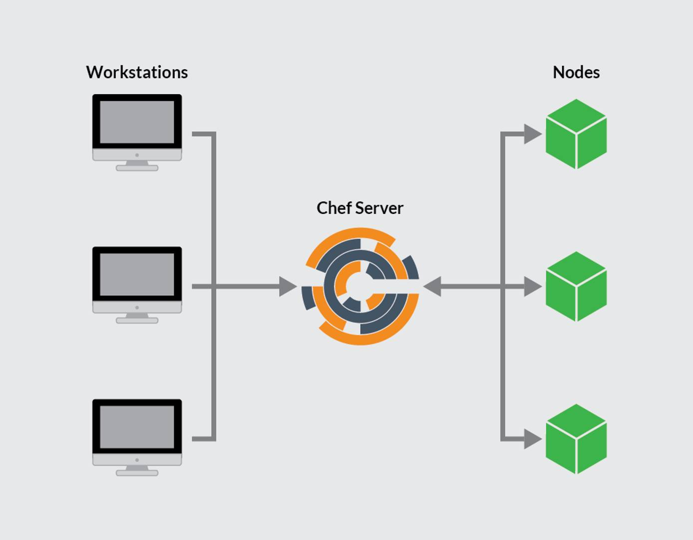

[Chef](https://www.chef.io/) is a free and open source *Infrastructure as Code* (IaC) application. It's a configuration management system that allows administrators to provision and manage infrastructure using automation. A complete Chef workflow includes one or more Chef Workstations, a Chef Server, and a set of nodes. This guide provides some background on how Chef works, and explains how to install and configure Chef on Ubuntu 20.04.

## What is Chef?

Chef is a IaC application for automating and streamlining the process of provisioning, configuring, deploying, and managing network nodes. It allows for continuous deployment and an automated environment. Chef can manage many types of components including servers, containers, and networking infrastructure.

Chef operates using a hub-and-spoke architecture, with the master Chef Server at the center. One or more Chef Workstations interact with the Server, which automates the configuration of one or more Chef nodes. Configuration assets move from the workstation to the server and finally to the nodes. Workstations cannot interact with the nodes directly. The Chef infrastructure consists of the following components.

- **Chef Workstation**: A workstation is a server for creating and testing configuration code. The code is then pushed to the Chef Server. Several workstations can interact with the same server, but each workstation only links to one server. The [Chef Workstation documentation](https://docs.chef.io/workstation/) contains more information on how to use the workstation.
- **Chef Server**: The Chef Server is the "command center" for the entire system. It stores and maintains all the configuration files, code, and scripts. A Chef Server includes many components, including a web server and PostgreSQL database. It is responsible for pushing the relevant assets to the various nodes and keeping track of the nodes under its management. Each server is highly capable, efficient, and robust, and is capable of managing a large number of nodes.
- **Chef Node**: The Chef Server deploys and manages a node using assets developed on the Chef Workstation. Each node is administered by a single Chef Server. Although it is dependent on the server, a Chef Node contains a Chef client. The client queries the server for updates and keeps the node up to date.

The following illustration indicates the relationship between the three parts of the Chef system.



The workstations use Chef commands, such as the `knife` directive, to interact with the server. Chef incorporates extra security and authentication into all of its operations, using public key encryption. However, the Chef system is complex and has a high learning curve.

Chef uses an idiosyncratic terminology based on cooking vocabulary. Some of the more important terms include the following:

- **Attribute**: Specifies a value for an item on a node.
- **Bookshelf**: Stores the various cookbooks and assets on a Chef Server using versioning control.
- **Chef-client**: Runs on the node, and is responsible for verifying whether the node is up-to-date with the assets stored on the server.
- **Chef-repo**: A directory on the Chef Workstation that contains the local cookbooks and configuration files.
- **Cookbook**: The primary method of managing nodes. It contains information describing the final state of a node. The Chef server and node use the cookbook to guide configuration. Cookbooks contain *recipes*, along with attributes, libraries, templates, and scripts. These cookbooks can be developed on the workstation or downloaded from the [Chef Supermarket](https://supermarket.chef.io/).
- **Environment**: Collects nodes into groups to better organize them. Similar configurations and scripts can be applied to the entire group.
- **Knife**: A Chef Workstation uses the `knife` tool to correspond with the Chef Server. A `knife` command usually takes the format `knife subcommand [ARGUMENT] (options)`.
- **Recipe**: A recipe is contained within a cookbook. It explains the resources to add, change, or run on the node. Recipes are written in Ruby.
- **Resource**: A resource is part of a recipe. It contains a type, name, and list of key-value pairs for a component.
- **Test Kitchen**: This is a workstation module to help users test recipes before deployment.

Linode has a helpful [Beginner's Guide to Chef](/docs/guides/beginners-guide-chef/). For detailed information about Chef, see the [Chef documentation](https://docs.chef.io/). Chef also makes the [Learn Chef](https://learn.chef.io/) training resource available.

## Before You Begin

1. If you have not already done so, create a Linode account and Compute Instance. See our [Getting Started with Linode](/docs/products/platform/get-started/) and [Creating a Compute Instance](/docs/products/compute/compute-instances/guides/create/) guides.

1. Follow our [Setting Up and Securing a Compute Instance](/docs/products/compute/compute-instances/guides/set-up-and-secure/) guide to update your system. You may also wish to set the timezone, configure your hostname, create a limited user account, and harden SSH access.

1. At least three Linode systems running Ubuntu 20.04 are required to implement a Chef system. One server is for the Chef Workstation, the second for the Chef Server, while a third represents a node under administration. Due to Chef's memory demands, the Chef Server requires a 8GB Linode. The other two servers can be 2GB Linodes. Both the Chef Server and Chef Workstation should be configured using the previous instructions. Chef is used to set up the target node.

1. Ensure all Linode servers are updated using the following command.

    ```command
    sudo apt update && sudo apt upgrade
    ```

1. Assign a domain name to the Chef Server. For information on domain names and pointing the domain name to a Linode, see the [Linode DNS Manager guide](/docs/products/networking/dns-manager/).

1. Configure the host name of the Chef Server so it matches the domain name. This allows SSL certificate allocation to proceed normally. To set the host name of a Ubuntu server, use the command `sudo hostnamectl set-hostname <hostname>`, replacing `<hostname>` with the actual name of your domain.


This guide is written for a non-root user. Commands that require elevated privileges are prefixed with `sudo`. If you are not familiar with the `sudo` command, see the [Users and Groups](/docs/guides/linux-users-and-groups/) guide.


## How to Install and Configure the Chef Server

Because the Chef Server operates as a hub for the entire system, it is best to install and configure it first. The Chef Server uses a high amount of resources, so it is important to use a dedicated Linode with at least 8GB of memory.

### How to Install the Chef Server

The Chef Server Core can be downloaded using `wget`. The following steps demonstrate how to download the latest release of Chef for the Ubuntu 20.04 release. For other releases of Ubuntu, see the [Chef download page](https://www.chef.io/downloads/tools/infra-server?os=ubuntu). For more detailed instructions, see the [Chef Server installation page](https://docs.chef.io/server/install_server/). To install the Chef Server, follow these steps.

1. Download the Chef Server core using `wget`.

    ```command
    wget https://packages.chef.io/files/stable/chef-server/15.1.7/ubuntu/20.04/chef-server-core_15.1.7-1_amd64.deb
    ```

1. Install the server core.

    ```command
    sudo dpkg -i chef-server-core_*.deb
    ```

    ```output
    Selecting previously unselected package chef-server-core.
    (Reading database ... 108635 files and directories currently installed.)
    Preparing to unpack chef-server-core_15.1.7-1_amd64.deb ...
    Unpacking chef-server-core (15.1.7-1) ...
    Setting up chef-server-core (15.1.7-1) ...
    Thank you for installing Chef Infra Server!
    ```
1. For better security and to preserve server space, remove the downloaded `.deb` file.

    ```command
    rm chef-server-core_*.deb
    ```

1. Start the Chef server. Answer `yes` when prompted to accept the product licenses.

    
The installation process takes several minutes to complete. Upon a successful installation, the message `Chef Infra Server Reconfigured!` is displayed.
    

    ```command
    sudo chef-server-ctl reconfigure
    ```

### How to Configure a Chef User and Organization

To use Chef, configure an organization and at least one user on the Chef Server. This enables server access for workstations and nodes. To create these accounts, follow these steps.

1. Create a `.chef` directory to store the keys. This should be a subdirectory located inside the home directory.

    ```command
    mkdir .chef
    ```

1. Use the `chef-server-ctl` command to create a user account for the Chef administrator. Additional user accounts can be created later. Replace the `USER_NAME`, `FIRST_NAME`, `LAST_NAME`, `EMAIL`, and `PASSWORD` fields with the relevant information. For the `--filename` argument, replace `USER_NAME.pem` with the user name used earlier in the command.

    ```command
    sudo chef-server-ctl user-create USER_NAME FIRST_NAME LAST_NAME EMAIL 'PASSWORD' --filename ~/.chef/USER_NAME.pem
    ```

1. Review the user list and confirm the account now exists.

    ```command
    sudo chef-server-ctl user-list
    ```

    ```output
    USER_NAME
    ```

1. Create a new organization, also using the `chef-server-ctl` command. Replace `ORG_NAME` and `ORG_FULL_NAME` with the actual name of the organization. The `ORG_NAME` field must be all lower case. The value for `USER_NAME` must be the same name used in the `user-create` command. For the `--filename` argument, in `ORG_NAME.pem`, replace `ORG_NAME` with the organization name used elsewhere in the command.

    ```command
    sudo chef-server-ctl org-create ORG_NAME "ORG_FULL_NAME" --association_user USER_NAME --filename ~/.chef/ORG_NAME.pem
    ```

1. List the organizations to confirm the new organization is successfully created.

    ```command
    sudo chef-server-ctl org-list
    ```

    ```output
    ORG_NAME
    ```

## How to Install and Configure a Chef Workstation

A Chef Workstation is for users to create and test recipes. Any Linode with at least 2GB of memory can be used for this task. Unlike the Chef Server, a workstation can also be used for other tasks. However, in a larger organization hosting many users, it is often efficient to centralize workstation activities on one server hosting multiple accounts.

### How to Install a Chef Workstation

The steps for installing a Chef Workstation are similar to those for installing the Server. Download the correct file using `wget`, then install it. To install a Chef Workstation, follow these steps.

1. Download the source files for the Chef Workstation. For different releases of the Workstation, or downloads for earlier releases, see the [Chef Workstation Downloads page](https://www.chef.io/downloads/tools/workstation?os=ubuntu). For more information on the installation process, see the [Chef Workstation Installation Documentation](https://docs.chef.io/workstation/install_workstation/).

    ```command
    wget https://packages.chef.io/files/stable/chef-workstation/22.10.1013/ubuntu/20.04/chef-workstation_22.10.1013-1_amd64.deb
    ```

1. Install the Chef Workstation.

    ```command
    sudo dpkg -i chef-workstation_*.deb
    ```

    ```output
    Thank you for installing Chef Workstation!
    ```

1. Remove the source file.

    ```command
    rm chef-workstation_*.deb
    ```

1. Confirm the correct release of the Chef Workstation is installed.

    ```command
    chef -v
    ```

    ```output
    Chef Workstation version: 22.10.1013
    Chef Infra Client version: 17.10.0
    Chef InSpec version: 4.56.20
    Chef CLI version: 5.6.1
    Chef Habitat version: 1.6.521
    Test Kitchen version: 3.3.2
    Cookstyle version: 7.32.1
    ```

### How to Configure a Chef Workstation

A few more items must be configured before the Workstation is operational. Tasks include generating a repository, editing the `hosts` file, and creating a subdirectory. To fully configure the workstation, follow these steps.

1. Generate the `chef-repo` repository. This directory stores the Chef cookbooks and recipes. Enter `yes` when asked whether to accept the product licenses.

    ```command
    chef generate repo chef-repo
    ```

    ```output
    Your new Chef Infra repo is ready! Type `cd chef-repo` to enter it.
    ```

1. Edit the `/etc/hosts` file. This file contains mappings between host names and their IP addresses. Add an entry for the Chef Server, containing the name of the server, which is also the domain name, and its IP address. In this example, this is indicated in the line `192.0.1.0 example.com`. There must also be an entry for the local server. This is the `192.0.2.0 chefworkstation` line in the example. This entry must contain the local IP address and the hostname of the server hosting the Chef Workstation. The file should resemble the following example.

    ```file {title="/etc/hosts" lang="conf"}
    127.0.0.1 localhost
    192.0.1.0 example.com
    192.0.2.0 chefworkstation
    ```

1. Create a `.chef` subdirectory. This is where the `knife` file is stored, along with files for encryption and security.

    ```command
    mkdir ~/chef-repo/.chef
    cd chef-repo
    ```

### How to Add RSA Private Keys

RSA private keys enable better security between the Chef Server and associated workstations through the use of encryption. Earlier, RSA private keys were created on the Chef Server. Copying these keys to a workstation allows it to communicate with the server. To enable encryption using RSA private keys, follow these steps.


SSH password authentication must be enabled on the Chef Server to complete the key exchange. If SSH password authentication has been disabled for better security, enable it again before proceeding. After the keys have been retrieved and added to the workstation, SSH password authentication can be disabled again. See the Linode guide to [How to Secure Your Server](/docs/products/compute/compute-instances/guides/set-up-and-secure/#ssh-daemon-options) for more information.


1. On the workstation, generate an RSA key pair. This key can be used to initially access the Chef server to copy over the private encryption files.

    ```command
    ssh-keygen -b 4096
    ```

    ```output
    Generating public/private rsa key pair.
    Enter file in which to save the key (/home/username/.ssh/id_rsa):
    ```

1. Hit the **Enter** key to accept the default file names `id_rsa` and `id_rsa.pub`. Ubuntu stores these files in the `/home/username/.ssh` directory.

    ```output
    Created directory '/home/username/.ssh'.
    Enter passphrase (empty for no passphrase):
    ```

1. Enter a password when prompted, then enter it again. An identifier and public key are saved to the directory.

    ```output
    Your identification has been saved in /home/username/.ssh/id_rsa
    Your public key has been saved in /home/username/.ssh/id_rsa.pub
    ```

1. Copy the new public key from the workstation to the Chef Server. In the following command, use the account name for the Chef Server along with its IP address.

    ```command
    ssh-copy-id username@192.0.1.0
    ```

1. Use the `scp` command to copy the `.pem` files from the Chef Server to the workstation. In the following example, replace `username` with the user account for the Chef Server and `192.0.1.0` with the actual Chef Server IP address.

    ```command
    scp username@192.0.1.0:~/.chef/*.pem ~/chef-repo/.chef/
    ```

    ```output
    Enter passphrase for key '/home/username/.ssh/id_rsa':
    username.pem                                                                       100% 1674     1.7MB/s   00:00
    testcompany.pem                                                                 100% 1678     4.7MB/s   00:00
    ```

1. List the contents of the `.chef` subdirectory to ensure the `.pem` files were successfully copied.

    ```command
    ls ~/chef-repo/.chef
    ```

    ```output
    username.pem  testcompany.pem
    ```

### How to Configure Git on a Chef Workstation

A *version control system* helps the Chef Workstation track any changes to the cookbooks and restore earlier versions if necessary. This example uses Git, which is compatible with the Chef system. The following steps explain how to configure Git, initialize a Git repository, add new files, and commit them.

1. Configure Git using the `git config` command. Replace `username` and `user@email.com` with your own values.

    ```command
    git config --global user.name username
    git config --global user.email user@email.com
    ```

1. Add the `.chef` directory to the `.gitignore` file. This ensures system and auto-generated files are not shown in the output of `git status` and other Git commands.

    ```command
    echo ".chef" > ~/chef-repo/.gitignore
    ```

1. Ensure the `chef-repo` directory is the current working directory. Add and commit the existing files using `git add` and `git commit`.

    ```command
    cd ~/chef-repo
    git add .
    git commit -m "initial commit"
    ```

    ```output
    [master (root-commit) a3208a3] initial commit
    13 files changed, 343 insertions(+)
    create mode 100644 .chef-repo.txt
    ...
    create mode 100644 policyfiles/README.md
    ```

1. Run the `git status` command to ensure all files have been committed.

    ```command
    git status
    ```

    ```output
    On branch master
    nothing to commit, working tree clean
    ```

## How to Generate a Chef Cookbook

To generate a new Chef cookbook, use the `chef generate` command.

```command
chef generate cookbook my_cookbook
```

## How to Configure the Knife Utility

The Chef Knife utility helps a Chef workstation communicate with the server. It provides a method of managing cookbooks, nodes, and the Chef environment. Chef uses the `config.rb` file in the `.chef` subdirectory to store the Knife configuration. To configure Knife, follow these steps.

1. Create a `config.rb` file in the `~/chef-repo/.chef` directory. This example uses `vi`, but any text editor can be used.

    ```command
    cd ~/chef-repo/.chef
    vi config.rb
    ```

1. Use the following `config.rb` file as an example of how to configure Knife. Copy this sample configuration to the file.

    ```file {title="~/chef-repo/.chef/config.rb" lang="ruby"}
    current_dir = File.dirname(__FILE__)
    log_level                :info
    log_location             STDOUT
    node_name                'node_name'
    client_key               "USER.pem"
    validation_client_name   'ORG_NAME-validator'
    validation_key           "ORG_NAME-validator.pem"
    chef_server_url          'https://example.com/organizations/ORG_NAME'
    cache_type               'BasicFile'
    cache_options( :path => "#{ENV['HOME']}/.chef/checksums" )
    cookbook_path            ["#{current_dir}/../cookbooks"]
    ```

1. Make the following changes:

    - `node_name` must be the name of the user account created when configuring the Chef Server.
    - For `client_key`, replace `USER` with the user name associated with the `.pem` file, followed by `.pem`.
    - `validation_client_name` requires the same `ORG_NAME` used when creating the organization followed by `-validator`.
    - the `validation_key` field must contain the name used for `ORG_NAME` when the organization was created, followed by `-validator.pem`.
    - For `chef_server_url`, change `example.com` to the name of the domain. Follow the domain name with `/organizations/` and the `ORG_NAME` used when creating the organization.
    - Leave the remaining fields unchanged.

1. Move back to the `chef-repo` directory and fetch the necessary SSL certificates from the server using the `knife fetch` command.

    
The SSL certificates were generated when the Chef server was installed. The certificates are self-signed. This means a certificate authority has not verified them. Before fetching the certificates, log in to the Chef server and ensure the hostname and fully qualified domain name (FQDN) are the same. These values can be confirmed using the commands `hostname` and `hostname -f`.
    

    ```command
    cd ..
    knife ssl fetch
    ```

    ```output
    Knife has no means to verify these are the correct certificates. You should verify the authenticity of these certificates after downloading.
    Adding certificate for example.com in /home/username/chef-repo/.chef/trusted_certs/example.com.crt
    ```

1. To confirm the `config.rb` file is correct, run the `knife client list` command. The relevant validator name should be displayed.

    ```command
    knife client list
    ```

    ```output
    testcompany-validator
    ```

## How to Bootstrap a Node

At this point, both the Chef Server and Chef Workstation are configured. They can now be used to bootstrap the node. The bootstrap process installs the chef client on the node and performs validation. The node can then retrieve any necessary updates from the Chef Server. To bootstrap the node, follow these steps.

1. Log in to the target node, which is the node to be bootstrapped, and edit the `/etc/hosts` file. Add entries for the node, the Chef server domain name, and the workstation. The file should resemble the following example, using the actual names of the Chef Server, workstation, and the target node, along with their IP addresses.

    ```file {title="/etc/hosts" lang="conf"}
    127.0.0.1 localhost
    192.0.100.0 targetnode
    192.0.2.0 chefworkstation
    192.0.1.0 example.com
    ```

1. Return to the Linode hosting the Chef Workstation and change the working directory to `~/chef-repo/.chef`.

    ```command
    cd ~/chef-repo/.chef
    ```

1. Bootstrap the node using the `knife bootstrap` command. Specify the IP address of the target node for `node_ip_address`. This is the address of the node to bootstrap. In the following example, use the actual user name and password for the account in place of `username` and `password`. Enter the name of the node in place of `nodename`. Answer `Y` when asked "Are you sure you want to continue connecting".

    
The option to bootstrap using key-pair authentication no longer appears to be supported.
    

    ```command
    knife bootstrap node_ip_address -U username -P password --sudo --use-sudo-password --node-name nodename
    ```

1. Confirm the node has been successfully bootstrapped. List the client nodes using the `knife client list` command. All bootstrapped nodes should be listed.

    ```command
    knife client list
    ```

    ```output
    target-node
    testcompany-validator
    ```

1. Add the bootstrapped node to the workstation `/etc/hosts` file as follows. Replace `192.0.100.0 targetnode` with the IP address and name of the bootstrapped node.

    ```file {title="/etc/hosts" lang="conf"}
    127.0.0.1 localhost
    192.0.1.0 example.com
    192.0.2.0 chefworkstation
    192.0.100.0 targetnode
    ```

## How to Download and Apply a Cookbook (Optional)

A cookbook is the most efficient way of keeping target nodes up to date. In addition, a cookbook can delete the `validation.pem` file that was created on the node when it was bootstrapped. It is important to delete this file for security reasons.

It is not mandatory to download or create cookbooks to use Chef. But this section provides a brief example of how to download a cookbook and apply it to a node.

1. On the Chef workstation, change to the `~/chef-repo/.chef` directory.

    ```command
    cd ~/chef-repo/.chef
    ```

1. Download the `cron-delvalidate` cookbook from the Chef Supermarket. For more information on the `supermarket` command see the [Chef supermarket documentation](https://docs.chef.io/workstation/knife_supermarket/).

    ```command
    knife supermarket download cron-delvalidate
    ```

    ```output
    Downloading cron-delvalidate from Supermarket at version 0.1.3 to /home/username/chef-repo/.chef/cron-delvalidate-0.1.3.tar.gz
    Cookbook saved: /home/username/chef-repo/.chef/cron-delvalidate-0.1.3.tar.gz
    ```

1. If the cookbook is downloaded as a `.tar.gz` file, use the `tar` command to extract it. Move the extracted directory to the `cookbooks` directory.

    ```command
    tar -xf cron-delvalidate-0.1.3.tar.gz
    cp -r  cron-delvalidate ~/chef-repo/cookbooks/
    ```

1. Review the cookbook's `default.rb` file to see the recipe. This recipe is written in Ruby and demonstrates how a typical recipe is structured. It contains a cron job named `clientrun`. This job instantiates a new cron job to run the `chef-client` command on an hourly basis. It also removes the extraneous `validation.pem` file.

    ```file {title="~/chef-repo/cookbooks/cron-delvalidate/recipes/default.rb" lang="ruby"}
    #
    # Cookbook Name:: cron-delvalidate
    # Recipe:: Chef-Client Cron & Delete Validation.pem
    #
    #
    cron "clientrun" do
      minute '0'
      hour '*/1'
      command "/usr/bin/chef-client"
      action :create
    end

    file "/etc/chef/validation.pem" do
      action :delete
    end
    ```

1. Add the recipe to the run list for the node. In the following command, replace `nodename` with the name of the node.

    ```command
    knife node run_list add nodename 'recipe[cron-delvalidate::default]'
    ```

    ```output
    nodename:
      run_list: recipe[cron-delvalidate::default]
    ```

1. Upload the cookbook and its recipes to the Chef Server.

    ```command
    knife cookbook upload cron-delvalidate
    ```

    ```output
    Uploading cron-delvalidate [0.1.3]
    Uploaded 1 cookbook.
    ```

1. Run the `chef-client` command on the node using the `knife ssh` utility. This command causes the node to pull the recipes in its run list from the server. It also determines whether there are any updates. The Chef Server transmits the recipes to the target node. When the recipe runs, it deletes the file and installs a cron job to keep the node up to date in the future. In the following command, replace `nodename` with the actual name of the target node. Replace `username` with the name of a user account with `sudo` access. Enter the password for the account when prompted to do so.

    ```command
    knife ssh 'name:nodename' 'sudo chef-client' -x username
    ```

    ```output
    nodename Chef Infra Client, version 17.10.3
    nodename Patents: https://www.chef.io/patents
    nodename Infra Phase starting
    nodename Resolving cookbooks for run list: ["cron-delvalidate::default"]
    nodename Synchronizing cookbooks:
    nodename   - cron-delvalidate (0.1.3)
    nodename Installing cookbook gem dependencies:
    nodename Compiling cookbooks...
    nodename Loading Chef InSpec profile files:
    nodename Loading Chef InSpec input files:
    nodename Loading Chef InSpec waiver files:
    nodename Converging 2 resources
    nodename Recipe: cron-delvalidate::default
    nodename   * cron[clientrun] action create
    nodename     - add crontab entry for cron[clientrun]
    nodename   * file[/etc/chef/validation.pem] action delete (up to date)
    nodename
    nodename Running handlers:
    nodename Running handlers complete
    nodename Infra Phase complete, 1/2 resources updated in 03 seconds
    ```

## Conclusion

Chef is an infrastructure as code (IaC) application for automating the deployment and management of infrastructure nodes. The Chef architecture consists of the Chef Server, which stores all the procedures, and a Chef Workstation, where the infrastructure code is developed. The managed nodes communicate with the server to receive updates. To use Chef, install the Chef Server and Chef Workstation software. Share RSA keys between the server and workstation, and install version control and the Chef Knife utility on the workstation. Bootstrap the target nodes using the `knife bootstrap` utility. After a node is bootstrapped, it is possible to download cookbooks and recipes using the node's run list. For more information, see the [Chef documentation](https://docs.chef.io/).