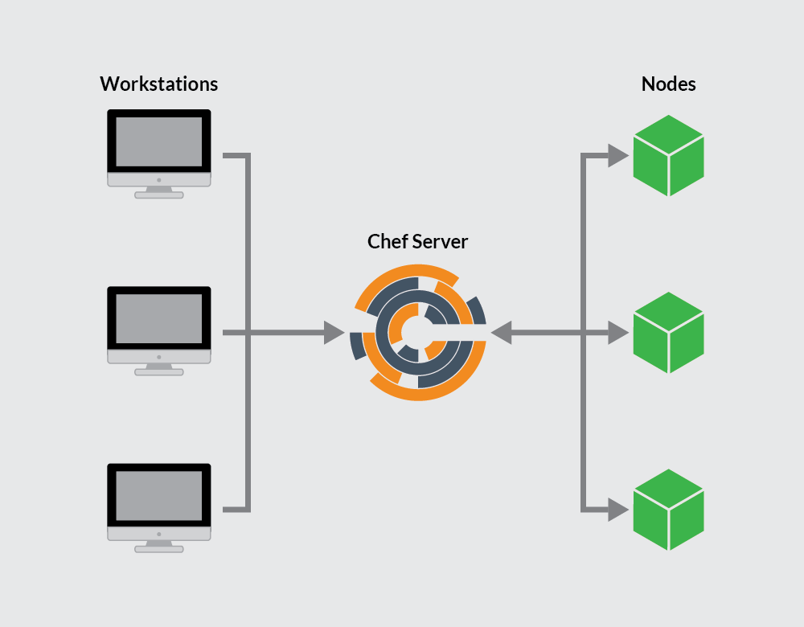

[Chef](http://www.chef.io) is a Ruby based configuration management tool used to define infrastructure as code. This enables users to automate the management of many *nodes* and maintain consistency across those nodes. *Recipes* declare the desired state for managed nodes and are created on a user's *workstation* using the *Chef Workstation* package. Your recipes are distributed across nodes via a *Chef server*. A *Chef client*, installed on each node, is in charge of applying the recipe to its corresponding node.

This guide will show you how to create and configure a Chef server and workstation. You will also bootstrap a node to manage with Chef. This work will require three individual Linodes.

See [A Beginner's Guide to Chef](/docs/guides/beginners-guide-chef/) for an introduction to Chef concepts.


This guide is written for a non-root user. Commands that require elevated privileges are prefixed with `sudo`. If you're not familiar with the `sudo` command, you can check our [Users and Groups](/docs/guides/linux-users-and-groups/#understanding-sudo) guide.


## Prerequisites

-  One 8GB Linode running Ubuntu 18.04. This Linode will host the Chef server.
  - Assign a Domain to the Chef server. Ensure your domain has a corresponding domain zone, NS record, and A/AAA record. See [Create a Domain](/docs/products/networking/dns-manager/guides/create-domain/) for details.
  - Ensure your Chef server's hostname is the same as its Domain name. Your Chef server will automatically create SSL certificates based on the Linode's hostname.
-  Two 2 GB Linodes, each running Ubuntu 18.04. One Linode will host a workstation and the other a node to be managed by Chef.
-  The workstation and Chef server should be configured per the [Setting Up and Securing a Compute Instance](/docs/products/compute/compute-instances/guides/set-up-and-secure/) guide. Once your node is [bootstrapped](/docs/guides/install-a-chef-server-workstation-on-ubuntu-18-04/#bootstrap-a-node), you can use a Chef cookbook to secure your node. Consider using the [Users](https://supermarket.chef.io/cookbooks/users) cookbook and the [Firewall](https://supermarket.chef.io/cookbooks/firewall) cookbook for this work.
-  Ensure that all servers are up-to-date:

        sudo apt update && sudo apt upgrade

## The Chef Server

The Chef server is the hub of interaction between all workstations and nodes under Chef management. Changes made to configuration code on workstations are pushed to the Chef server, and then pulled by a node's `chef-client` to apply the configurations.

### Install the Chef Server

1.  Download the [latest Chef server core](https://downloads.chef.io/chef-server/#ubuntu):

        wget https://packages.chef.io/files/stable/chef-server/13.1.13/ubuntu/18.04/chef-server-core_13.1.13-1_amd64.deb

1.  Install the server:

        sudo dpkg -i chef-server-core_*.deb

1.  Remove the downloaded file:

        rm chef-server-core_*.deb

1.  The Chef server includes a command line utility called `chef-server-ctl`. Run `chef-server-ctl` to start the Chef server services:

        sudo chef-server-ctl reconfigure

### Create a Chef User and Organization

In order to link workstations and nodes to the Chef server, create an administrator and organization with associated RSA private keys.

1.  From the home directory, create a `.chef` directory to store the keys:

        mkdir .chef

1.  Use `chef-server-ctl` to create a user. In this example, change the following to match your needs: `USER_NAME`, `FIRST_NAME`, `LAST_NAME`, `EMAIL`, and `PASSWORD`. Adjust `USER_NAME.pem`, and leave the `.pem` extension:

        sudo chef-server-ctl user-create USER_NAME FIRST_NAME LAST_NAME EMAIL 'PASSWORD' --filename ~/.chef/USER_NAME.pem

    To view a list of all users on your Chef server issue the following command:

        sudo chef-server-ctl user-list

1.  Create an organization and add the user created in the previous step to the admins and billing admins security groups. Replace `ORG_NAME` with a short identifier for the organization, `ORG_FULL_NAME` with the organizations' complete name, `USER_NAME` with the username created in the step above and `ORG_NAME.pem` with organization's short identifier followed by `.pem`:

        sudo chef-server-ctl org-create ORG_NAME "ORG_FULL_NAME" --association_user USER_NAME --filename ~/.chef/ORG_NAME.pem

    
`ORG_NAME` must be in all lower case.


    To view a list of all organizations on your Chef server, use the following command:

        sudo chef-server-ctl org-list

With the Chef server installed and the RSA keys generated, you can begin configuring your workstation. The workstation is where all major configurations will be created for your nodes.

## Chef Workstations

The Chef workstation is where you create and configure any recipes, cookbooks, attributes, and other changes necessary to manage your nodes. Although this can be a local machine running any OS, there is some benefit to keeping a remote server as your workstation so you can access it from anywhere.

In this section, you will download and install the Chef Workstation package, which provides all tools also included with the [ChefDK](https://docs.chef.io/about_chefdk.html), Chef's development kit.

### Setting Up a Workstation

1.  [Download the latest Chef Workstation](https://downloads.chef.io/chef-workstation/0.2.43#ubuntu):

        wget  https://packages.chef.io/files/stable/chef-workstation/0.2.43/ubuntu/18.04/chef-workstation_0.2.43-1_amd64.deb

1.  Install Chef Workstation:

        sudo dpkg -i chef-workstation_*.deb

1.  Remove the installation file:

        rm chef-workstation_*.deb

1. Create your Chef repository. The `chef-repo` directory will store your Chef cookbooks and other related files.

        chef generate repo chef-repo

1. Ensure that your workstation's `/etc/hosts` file maps its IP address to your Chef server's fully qualified domain name and workstation hostnames. For example:

    
127.0.0.1 localhost
192.0.1.0 example.com
192.0.2.0 workstation
...
    

1. Create a `.chef` subdirectory. The `.chef` subdirectory will store your [Knife](/docs/guides/beginners-guide-chef/#knife) configuration file and your `.pem` files that are used for RSA key pair authentication with the Chef server. Move into the `chef-repo` directory:

        mkdir ~/chef-repo/.chef
        cd chef-repo

### Add the RSA Private Keys

Authentication between the Chef server and workstation and/or nodes is completed with public key encryption. This ensures that the Chef server only communicates with trusted machines. In this section, the RSA private keys, generated when setting up the Chef server, will be copied to the workstation to allow communicate between the Chef server and workstation.

1. If you do not already have an RSA key-pair on your workstation, generate one. This key-pair will be used to gain  access to the Chef server and then transfer their `.pem` files:

        ssh-keygen -b 4096

    Press **Enter** to use the default names `id_rsa` and `id_rsa.pub` in `/home/your_username/.ssh` before entering your passphrase.

    
  If you have disabled SSH password authentication on your Chef server's Linode, as recommended by the [How to Secure Your Server](/docs/products/compute/compute-instances/guides/set-up-and-secure/#ssh-daemon-options) guide, re-enable SSH password authentication prior to performing these steps. Be sure to disable it again once you have added your workstation's public ssh key to the Chef server's Linode.
    

    Upload your workstation's public key to the Linode hosting the Chef server. Ensure you replace `example_user` with the Chef server's user account and `192.0.2.0` with its IP address:

        ssh-copy-id example_user@192.0.2.0

1. Copy the `.pem` files from your Chef server to your workstation using the `scp` command. Replace `user` with the appropriate username, and `192.0.2.0` with your Chef server's IP:

        scp example_user@192.0.2.0:~/.chef/*.pem ~/chef-repo/.chef/

1.  Confirm that the files have been copied successfully by listing the contents of the `.chef` directory:

        ls ~/chef-repo/.chef

    Your `.pem` files should be listed.

### Add Version Control

The workstation is used to create, download, and edit cookbooks and other related files. You should track any changes made to these files with version control software, like Git. The Chef Workstation adds the Git component to your workstation and initializes a Git repository in the directory where the `chef-repo` was generated. Configure Git by adding your username and email, and add and commit any new files created in the steps above.

1.  Configure Git by adding your username and email, replacing the needed values:

        git config --global user.name yourname
        git config --global user.email user@email.com

2.  Add the `.chef` directory to the `.gitignore` file:

        echo ".chef" > ~/chef-repo/.gitignore

3.  Move into the `~/chef-repo` directory, if you are not already there and add and commit all existing files:

        cd ~/chef-repo
        git add .
        git commit -m "initial commit"

4.  Make sure the directory is clean:

        git status

    It should output:

    
On branch master
nothing to commit, working directory clean
    

## Generate your First Cookbook

1. Generate a new Chef cookbook:

        chef generate cookbook my_cookbook

### Configure Knife

1.  Create a knife configuration file by navigating to your `~/chef-repo/.chef` directory and creating a file named `config.rb` using your preferred text editor.

1.  Copy the following configuration into the `config.rb` file:

    
current_dir = File.dirname(__FILE__)
log_level                :info
log_location             STDOUT
node_name                'node_name'
client_key               "USER.pem"
validation_client_name   'ORG_NAME-validator'
validation_key           "ORGANIZATION-validator.pem"
chef_server_url          'https://example.com/organizations/ORG_NAME'
cache_type               'BasicFile'
cache_options( :path => "#{ENV['HOME']}/.chef/checksums" )
cookbook_path            ["#{current_dir}/../cookbooks"]


1.  Change the following:

     - The value for `node_name` should be the username that was created on the Chef server.
     - Change `USER.pem` under `client_key` to reflect your `.pem` file for your user.
     - The `validation_client_name` should be your organization's `ORG_NAME` followed by `-validator`.
     - `ORGANIZATION-validator.pem` in the `validation_key` path should be set to the `ORG_NAME` followed by `-validator.pem`.
     - Finally the `chef_server_url` should be the Chef server's domain with `/organizations/ORG_NAME` appended. Be sure to replace `ORG_NAME` with your own organization's name.

1.  Move to the `chef-repo` directory and copy the needed SSL certificates from the server:

        cd ..
        knife ssl fetch

    
The SSL certificates are generated during the installation of the Chef server. These certificates are self-signed, which means there isn’t a signing certificate authority (CA) to verify. The Chef server's hostname and FQDN should be the same so that the workstation can fetch and verify the SSL certificates. You can verify the Chef server's hostname and FQDN by running `hostname` and `hostname -f`, respectively. Consult the [Chef documentation](https://docs.chef.io/server_security.html#regenerate-certificates) for details on regenerating SSL certificates.


1.  Confirm that `config.rb` is set up correctly by running the client list:

        knife client list

    This command should output the validator name.

Now that your Chef server and workstation are configured, you can bootstrap your first node.

## Bootstrap a Node

Bootstrapping a node installs the Chef client on the node and validates the node. This allows the node to read from the Chef server and pull down and apply any needed configuration updates detected by the chef-client.


If you encounter any `401 Unauthorized` errors ensure that your `ORGANIZATION.pem` file has `700` permissions. See [Chef's troubleshooting](https://docs.chef.io/errors.html) guide for further information on diagnosing authentication errors.


1. Update the `/etc/hosts` file on the *node* to identify the node, Chef server's domain name, and the workstation.

    
127.0.0.1 localhost
198.51.100.0 node-hostname
192.0.2.0 workstation
192.0.1.0 example.com
...
    

1. From your *workstation*, navigate to your `~/chef-repo/.chef` directory:

        cd ~/chef-repo/.chef

1.  Bootstrap the client node either using the client node's root user, or a user with elevated privileges:

    - **As the node's root user**, change `password` to your root password and `nodename` to the desired name for your client node. You can leave this off if you would like the name to default to your node's hostname:

            knife bootstrap 192.0.2.0 -x root -P password --node-name nodename

    - **As a user with sudo privileges**, change `username` to a node user, `password` to the user's password and `nodename` to the desired name for the client node. You can leave this off if you would like the name to default to your node's hostname:

            knife bootstrap 192.0.2.0 -x username -P password --use-sudo-password --node-name nodename

    - **As a user with key-pair authentication**, change `username` to a node user, and `nodename` to the desired name for the client node. You can leave this off if you would like the name to default to your client node's hostname:

            knife bootstrap 192.0.2.0 --ssh-user username --sudo --identity-file ~/.ssh/id_rsa.pub --node-name hostname

1.  Confirm that the node has been bootstrapped by listing the client nodes:

        knife client list

    Your new client node should be included in the list.

1. Add the bootstrapped node to your workstation's `/etc/hosts` file. Replace `node-hostname` with the hostname you just assigned to the node when it was bootstrapped:

    
127.0.0.1 localhost
192.0.1.0 example.com
192.0.2.0 workstation
198.51.100.0 node-hostname
...
    

## Download a Cookbook (Optional)

When using Chef, the Chef client should periodically run on your nodes and pull down any changes pushed to the Chef server from your workstation. You will also want the `validation.pem` file that is uploaded to your node upon bootstrap to be deleted for security purposes. While these steps can be performed manually, it is often easier and more efficient to set them up as a cookbook.

This section is optional, but provides instructions on downloading a cookbook to your workstation and pushing it to a server, and includes the skeleton of a basic cookbook to expand on and experiment with.

1. From your *workstation*, navigate to your `~/chef-repo/.chef` directory:

        cd ~/chef-repo/.chef

1.  Download the cookbook and dependencies:

        knife cookbook site install cron-delvalidate

1.  Open the `default.rb` file to examine the default cookbook recipe:

    
#
# Cookbook Name:: cron-delvalidate
# Recipe:: Chef-Client Cron & Delete Validation.pem
#
#

cron "clientrun" do
  minute '0'
  hour '*/1'
  command "/usr/bin/chef-client"
  action :create
end

file "/etc/chef/validation.pem" do
  action :delete
end


    The resource `cron "clientrun" do` defines the cron action. It is set to run the `chef-client` action (`/usr/bin/chef-client`) every hour (`*/1` with the `*/` defining that it's every hour and not 1AM daily). The `action` code denotes that Chef is *creating* a new cronjob.

    `file "/etc/chef/validation.pem" do` calls to the `validation.pem` file. The `action` defines that the file should be removed (`:delete`).

    These are two very basic sets of code written in Ruby that provide an example of the code structure that will be used when creating Chef cookbooks. These examples can be edited and expanded as needed.

1.  Add the recipe to your node's run list, replacing `nodename` with your node's name:

        knife node run_list add nodename 'recipe[cron-delvalidate::default]'

1.  Push the cookbook to the Chef server:

        knife cookbook upload cron-delvalidate

    This command is also used when updating cookbooks.

1. Use `knife-ssh` to run the `chef-client` command on your node. Replace `nodename` with your node's name. If you have set up your node with a limited user account, replace `-x root` with the correct username, i.e. `-x username`.

        knife ssh 'name:nodename' 'sudo chef-client' -x root

    The recipes in the run list will be pulled from the server and run on the node. In this instance, it will be the `cron-delvalidate` recipe. This recipe ensures that any cookbooks pushed to the Chef Server, and added to the node's run list will be pulled down to bootstrapped nodes once an hour. This automated step eliminates connecting to the node in the future to pull down changes.

Now that you know how to download Chef cookbooks, add the cookbook to a node's run list, and apply the configurations on a node, consider securing your Chef managed node with the following cookbooks: [Users](https://supermarket.chef.io/cookbooks/users) and [Firewall](https://supermarket.chef.io/cookbooks/firewall).
