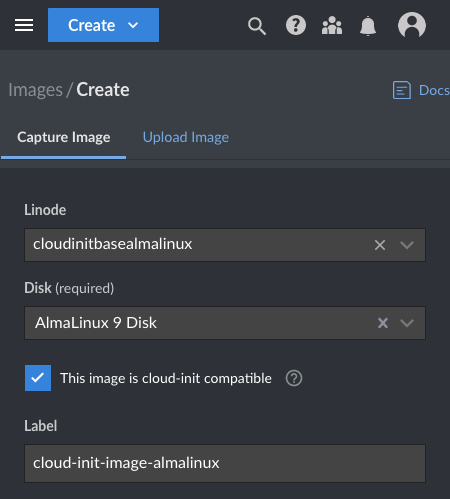
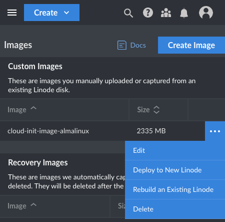

Akamai's [Metadata service](/docs/products/compute/compute-instances/guides/metadata/) gives you the ability to deploy new Compute Instances using cloud-init user data to automate configuration. Script your configuration needs in cloud-config user data, and all the necessary steps get applied as your instance deploys.

While the line of distributions with Metadata support out of the box continues to expand, you can already set up most distributions for cloud-init. This guide walks you through how to install cloud-init to create a Metadata-ready image. Then you can use that image to deploy new instances with whatever cloud-init user data you need.

## Before You Begin

**Create a fresh Compute Instance** running the distribution of your choice. This instance forms the basis for a cloud-init deployment template. See our [Getting Started with Linode](/docs/guides/getting-started/) and [Creating a Compute Instance](/docs/guides/creating-a-compute-instance/) guides. The instructions in this tutorial cover Debian, Ubuntu, and RHEL-based systems (CentOS, Fedora, AlmaLinux, Rocky Linux, etc.). The steps have not been verified with other distributions but may be adaptable with some modifications.


The steps in this guide require root privileges. Be sure to run the steps below as `root` or with the `sudo` prefix. For more information on privileges, see our [Users and Groups](/docs/guides/linux-users-and-groups/) guide.


## Install Cloud-Init

Akamai's Metadata service requires that an instance have cloud-init version 23.3.1 or newer. While cloud-init can be installed from many distributions' package managers, typically those versions are too dated to work. The steps below thus show you how to install cloud-init from source.

1.  Install Git and Pip for Python 3.

    
    

    ```command
    apt update
    apt install git python3-pip
    ```

    
    

    ```command
    dnf install git python3-pip
    ```

    
    

1.  Clone the cloud-init Git repository, and change into the repository directory. This step also first changes into the `/tmp/` directory, since the repository only needs to be stored temporarily.

    ```command
    cd /tmp/
    git clone https://github.com/cloud-init/cloud-init.git
    cd cloud-init/
    ```

1.  Install the project's prerequisites.

    ```command
    pip3 install -r requirements.txt
    ```

    With some newer distributions, you may need to run the above with the `--break-system-packages` option. This overrides a specification that attempts to prevent conflicts between the OS package manager and Pip.

    ```command
    pip3 install -r requirements.txt --break-system-packages
    ```

    
    The [PEP 668](https://peps.python.org/pep-0668/) specification attempts to prevent conflicts between Python packages installed via the OS package manager and PIP. The specification recommends installing packages with Pip in Python virtual environments, like [Virtualenv](/docs/guides/how-to-manage-packages-and-virtual-environments-on-linux/#manage-virtual-environments-in-linux).

    That approach does not work well with the cloud-init installer, so the steps here recommend overriding the specification. In our tests, this did not result in any issues, but be aware that use of this option can impact the behavior of some Python packages.
    

1.  Build and install cloud-init from the project.

    ```command
    python3 setup.py build
    python3 setup.py install --init-system systemd
    ```

## Configure Cloud-Init

A few configuration steps are necessary to prepare the cloud-init installation for running properly on the instance. The steps below start up cloud-init and add the Akamai datasource needed for making deployments with the Metadata service.

1.  Initialize cloud-init on the system. Doing so also outputs the version; make sure the version is at least `23.3.1` to ensure compatibility with the Akamai Metadata service.

    ```command
    cloud-init init --local
    ```

    ```output
    Cloud-init v. 23.3.3 running 'init-local' at Mon, 27 Nov 2023 22:31:40 +0000. Up 105.67 seconds.
    ```

1.  Verify the status of the cloud-init service.

    ```command
    cloud-init status
    ```

    ```output
    status: running
    ```

1.  Add `Akamai` to the `datasource_list` in one of the cloud-init configuration files. Locate the appropriate configuration file as follows.

    -   On many new Akamai Compute Instances, a cloud-init configuration file is included at `/etc/cloud/cloud.cfg.d/99-linode.cfg`. This configuration takes priority, and if you have it you should add the datasource there.

    -   If you do not have the `99-linode.cfg` file mentioned above, you should add the datasource in the default cloud-init configuration file: `/etc/cloud/cloud.cfg`.

    In either case, find the `datasource_list` and add `Akamai` as the first entry, as shown below. If the `datasource_list` option is not already in the configuration file, add it with `Akamai` as the only item in the array.

    ```file {title="/etc/cloud/cloud.cfg.d/99-linode.cfg"}
    ...

    datasource_list: [ Akamai, NoCloud, ConfigDrive, None ]

    ...
    ```

1.  Shut down the instance, either from the command line with the command below or from within the Akamai Cloud Manager.

    ```command
    shutdown
    ```

## Create a Custom Image

Creating an image from the instance setup above allows you to deploy new instances leveraging the Metadata service and custom cloud-init deployment scripts. For more on creating an image of an Akamai Compute Instance, you can refer to our [Capture an Image](/docs/products/tools/images/guides/capture-an-image/#capturing-an-image-through-the-cloud-manager) guide.

What follows is a summary of steps you can use to create a base image from the instance on which you installed cloud-init.

1.  Navigate to the **Images** section of the Akamai Cloud Manager.

1.  Select **Create Image**.

1.  On the resulting form:

    - Select the Compute Instance on which you installed cloud-init
    - Select the associated disk drive
    - Indicate that the image is *cloud-init compatible*
    - Give the image a label
    - Choose the option to **Create Image**

    

1.  Wait for the creation process to complete. You can see its progress from the **Images** section of the Cloud Manager.

## Deploy an Instance with User-data

With a base cloud-init image ready, you can deploy a new instance the Metadata service and cloud-init user data whenever you need. Refer to our guide on how to [Deploy an Image to a New Compute Instance](/docs/products/tools/images/guides/deploy-image-to-new-linode/) for image deployment. And refer to our guide on how to [Use Cloud-Init to Automatically Configure and Secure Your Servers](/docs/guides/configure-and-secure-servers-with-cloud-init/) for more on adding user data to new instances.

The steps that follow walk you through a simple new deployment from a base cloud-init image. This includes a simple cloud-init user data script modeled on our guide to [Setting Up and Securing a Compute Instance](/docs/guides/set-up-and-secure/).


Newly deployed Compute Instances do not have network access during boot. This prevents cloud-init from properly running. The last several steps below address this, restarting the cloud-init process after initial boot.


1.  Navigate to the **Images** section of the Akamai Cloud Manager.

1.  Locate the image with cloud-init installed, and use the **...** button to display options for the image.

1.  Select the **Deploy to New Linode** option.

    

1.  On the resulting form:

    -   Select a region in which the Metadata service is available. These are listed in the Metadata [reference documentation](/docs/products/compute/compute-instances/guides/metadata/#availability).

    -   Select your desired Linode Plan, enter a label for the new instance, and create credentials for the root user.

    -   Expand the **Add User Data** section, and input your desired user data. What follows is a basic example useful for many new instances.

        ```file
        #cloud-config

        # Configure a limited user
        users:
          - default
          - name: example-user
            groups:
              - sudo
            sudo:
              - ALL=(ALL) NOPASSWD:ALL
            shell: /bin/bash
            ssh_authorized_keys:
              - "SSH_PUBLIC_KEY"

        # Perform system updates
        package_update: true
        package_upgrade: true

        # Configure server details
        timezone: 'US/Central'
        hostname: examplehost

        # Harden SSH access
        runcmd:
          - sed -i '/PermitRootLogin/d' /etc/ssh/sshd_config
          - echo "PermitRootLogin no" >> /etc/ssh/sshd_config
          - systemctl restart sshd
        ```

1.  Start the deployment by selecting **Create Linode**, and wait for the new instance to be deployed. You can follow its progress from the **Linodes** section of the Akamai Cloud Manager.

1.  Access the instance as the root user through the Lish console. Learn how in our guide [Access Your System Console Using Lish (Linode Shell)](/docs/products/compute/compute-instances/guides/lish/).

1.  Reset cloud-init. This ensure that, on the next boot, cloud-init runs as if for the initial system boot.

    ```command
    cloud-init clean && cloud-init clean --logs
    ```

1.  Reboot the instance.

    ```command
    reboot
    ```

Once the instance boots back up, you can verify cloud-init execution by logging in as a created user — `example-user` in the example above. You can also use the steps in our [Use Cloud-Init to Install and Update Software on New Servers](https://www.linode.com/docs/guides/install-and-update-software-with-cloud-init/#verify-update-and-installation) to verify system package updates.
