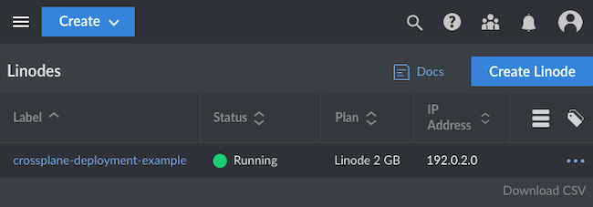

Crossplane offers an open-source extension to Kubernetes for creating a universal control plane. With Crossplane, you can orchestrate and manage your broader infrastructure entirely with Kubernetes tools. Crossplane can interface with just about any cloud platform API, including Akamai Cloud's, and provides features like API abstractions and Kubernetes's access control.

In this guide, you learn more about what Crossplane is and how it compares to similar tools. You can also follow step-by-step instructions to set up your own Crossplane instance.

## What Is Crossplane?

[Crossplane](https://www.crossplane.io/) creates cloud control planes across conceivably any cloud platform. Crossplane extends Kubernetes into a universal control plane. With it, you can provision and manage your broader infrastructure needs using familiar Kubernetes manifests and APIs.

Crossplane's extension of Kubernetes as a universal control plane lets it interface with virtually any external API. That is the case whether you are deploying to a major cloud platform, [ordering a pizza](https://blog.crossplane.io/providers-101-ordering-pizza-with-kubernetes-and-crossplane/), or leveraging another orchestration tool [like Terraform](https://github.com/upbound/provider-terraform).

### What Are Control Planes?

In the context of cloud resources, a *control plane* provides an interface to create resources and manage their lifecycles. A control plane thus corresponds with resource orchestration for cloud infrastructures.

Kubernetes itself is an example. A Kubernetes setup deploys and monitors resources, managing the state of each resource toward a given configuration.

Crossplane takes the Kubernetes control plane and extends it to a wider context. Whereas Kubernetes acts as a control plane for resources on a Kubernetes cluster, Crossplane acts as a *universal control plane*. Crossplane can be the interface for resources on virtually any cloud platform.

### Crossplane vs. Terraform: What Are the Differences?

[Terraform](https://www.terraform.io/) stands as perhaps the most popular tool for infrastructure-as-code. Like Crossplane, Terraform lets you manage that infrastructure across a range of services. So what sets Crossplane apart from Terraform, and when should you use Crossplane instead of Terraform?

Fundamentally, the differences come down to the tool's intended uses. Terraform is a command line tool for deploying infrastructure using declarative configurations. By contrast, Crossplane is a control plane that uses declarative configurations for creating and providing ongoing management of infrastructure.

Additionally, two significant functional differences stand out between the tools. These differences primarily affect how the tools fit into an organization and team structure.

- Terraform's configurations do not update with changes on the deployed infrastructure. Terraform is oriented around deploying infrastructure, and changes to a Terraform configuration require reapplying the whole deployment.

    As a control plane, Crossplane uses its declarative configurations to actively maintain and modify the state of infrastructure. This means that Crossplane is not subject to the configuration "drift" that can occur with Terraform configurations.

-   With Terraform, a collaborating developer needing some infrastructure access has to know both Terraform and the underlying API. Not only that, but the developer also needs granular access to the underlying resources.

    In contrast, Crossplane can provide self-service interfaces. Crossplane uses operators that handle credentials and expose simple, abstracted interfaces for collaborating developers. That way, developers only need access to and knowledge of the interface itself, rather than the granular aspects.

Crossplane's use of Kubernetes also makes it a favorable solution for teams already using Kubernetes. Crossplane takes advantage of the existing Kubernetes infrastructure and familiarity.

## How to Install Crossplane

Crossplane deploys to a Kubernetes cluster similar to many other Kubernetes applications. Once you have Crossplane installed on your cluster, you can take advantage of `kubectl` to create and manage Crossplane resources.

Follow along with the steps in this section to set up a Kubernetes cluster and get Crossplane running on it.

### Setting Up a Kubernetes Cluster

Crossplane runs on a Kubernetes cluster, so you need a running cluster available to get started with it.

With Linode, you can quickly deploy a Kubernetes cluster from the Cloud Manager. To do so, follow along with our guide [Linode Kubernetes Engine - Getting Started](/docs/products/compute/kubernetes/get-started/). When done, you should have a fully operational Kubernetes cluster and a `kubectl` instance configured to manage it.

In addition to having an active Kubernetes cluster, you need kubectl configured to manage it. You can find this information covered in the LKE guide linked just above.

To install Helm on your system, follow the relevant section of our guide [Installing Apps on Kubernetes with Helm 3](/docs/guides/how-to-install-apps-on-kubernetes-with-helm-3/#install-helm).

### Deploying Crossplane with Helm

With Kubernetes running and Helm installed, you can now proceed to install Crossplane.

1.  Add the Crossplane repository to your Helm instance:

    ```command
    helm repo add crossplane-stable https://charts.crossplane.io/stable
    helm repo update
    ```

    ```output
    Hang tight while we grab the latest from your chart repositories...
    ...Successfully got an update from the "crossplane-stable" chart repository
    Update Complete. ⎈Happy Helming!⎈
    ```

    Should you want to customize your installation, follow the link above to create a values file with the options and name it `values.yml` for this example. Then add `-f values.yml` to the end of the installation command below to apply your configuration to the installation.

    Should you want to customize your installation, follow the link above to create a `values.yaml` file with the options. Then add `-f values.yml` to the end of the installation command below to apply your configuration.

1.  Following the official recommendations, this command installs Crossplane in its own Kubernetes namespace:

    ```command
    helm install crossplane --namespace crossplane-system --create-namespace crossplane-stable/crossplane
    ```

1. Confirm the installation by checking on the Crossplane pods deployed to your cluster. It may take a short while for the pods to become ready, so you may have to wait to see the `Running` status.

    ```command
    kubectl get pods --namespace crossplane-system
    ```

    ```output
    NAME                                      READY   STATUS    RESTARTS   AGE
    crossplane-766d6647bc-b57lz               1/1     Running   0          44s
    crossplane-rbac-manager-f94699c7c-zvvtb   1/1     Running   0          44s
    ```

## How to Use Crossplane

Crossplane is now running on your cluster, and you are ready to start using its control planes to deploy your own infrastructure. There are myriad options available, as Crossplane is a universal control plane with the ability to control an almost limitless range of external APIs.

To get started, this section walks through a fully-functioning example. The example shows how to use the Linode provider for Crossplane to deploy a new Linode Compute instance.

While relatively simple, this example provides a strong base model. You can easily build on the configurations here to make Crossplane work for a diverse range of infrastructure needs.


The configurations and commands used in this guide add one or more Linode instances to your account. Be sure to monitor your account closely in the Linode Cloud Manager to avoid unwanted charges.


1. The provider allows you to deploy Akamai Cloud (formerly Linode) instances with Crossplane.

1.  Create a deployment manifest (e.g. `provider.yml`) for installing the [Linode provider](https://marketplace.upbound.io/providers/linode/provider-linode/) (`provider-linode`) to your Crossplane instance:

    ```file{title="provider.yml" lang="yaml"}
    apiVersion: pkg.crossplane.io/v1
    kind: Provider
    metadata:
      name: provider-linode
    spec:
      package: xpkg.upbound.io/linode/provider-linode:v0.0.10
    ```

    See the wide range of providers available for Crossplane on the [Upbound Marketplace](https://marketplace.upbound.io/providers). Upbound are the founders of Crossplane, and they maintain this provider repository.

1.  Apply the newly created manifest to install `provider-linode` onto the Kubernetes cluster:

    ```command
    kubectl apply -f provider.yml
    ```

    ```output
    provider.pkg.crossplane.io/provider-linode created
    ```

    Verify the installation with a `kubectl` command to list `provider` resources:

    ```command
    kubectl get providers
    ```

    ```output
    NAME              INSTALLED   HEALTHY   PACKAGE                                         AGE
    provider-linode   True        True      xpkg.upbound.io/linode/provider-linode:v0.0.7   15s
    ```

1.  Create a Kubernetes manifest file (e.g. `deployment.yml`) for deploying a new Linode Compute instance. This is where you start leveraging Crossplane and the Linode provider to provision resources.

    In this example manifest, you need to replace a few values with ones specific to your needs and your Linode account credentials:

    -   Replace `${ROOT_PASSWORD}` with a root password to be used for the new Linode Compute instance.

    - Replace `${LINODE_API_TOKEN}` with your Linode API personal access token, which you can generate by following the relevant section of our guide on [Getting Started with the Linode API](/docs/products/tools/api/get-started/#get-an-access-token)

    -   Replace `${SSH_PUBLIC_KEY}` with a public SSH key to access the Linode Compute instance. Learn more about SSH keys in our guide [Using SSH Public Key Authentication](/docs/guides/use-public-key-authentication-with-ssh/).

    ```file{title="deployment.yml" lang="yaml" hl_lines="8,11,37"}
    apiVersion: v1
    kind: Secret
    metadata:
      name: crossplane-secrets
      namespace: crossplane-system
    type: Opaque
    stringData:
      linodeRootPass: ${ROOT_PASSWORD}
      linodeCredentials: |
        {
          "token": "${LINODE_API_TOKEN}"
        }
    ---
    apiVersion: linode.upbound.io/v1beta1
    kind: ProviderConfig
    metadata:
      name: default
    spec:
      credentials:
        source: Secret
        secretRef:
          name: crossplane-secrets
          namespace: crossplane-system
          key: linodeCredentials
    ---
    apiVersion: instance.linode.upbound.io/v1alpha1
    kind: Instance
    metadata:
      annotations:
        meta.upbound.io/example-id: instance/v1alpha1/instance
      labels:
        testing.upbound.io/example-name: web
      name: web
    spec:
      forProvider:
        authorizedKeys:
        - ssh-rsa ${SSH_PUBLIC_KEY}
        image: linode/ubuntu20.04
        type: g6-standard-1
        label: crossplane-deployment-example
        region: us-southeast
        rootPassSecretRef:
          key: linodeRootPass
          name: crossplane-secrets
          namespace: crossplane-system
    ```

    This manifest consists of three parts, which perform these functions:

    -   The `Secret` resource (`crossplane-secrets`) stores variables for your instance's root password and your Linode API token. Later resources can then use these.

    -   The `ProviderConfig` resource provides initial configurations to be used by the upcoming resource. For the Linode provider, that simply means pointing to the secret value with the Linode API token.

    -   The `Instance` resource (`web`) articulates the details of the new Linode Compute instance to be created. This example creates a 2GB shared instance in Atlanta running Ubuntu 20.04 LTS.

        Use the API endpoints to learn more about available instance [types](https://api.linode.com/v4/linode/types), [regions](https://api.linode.com/v4/regions), and [images](https://api.linode.com/v4/images).

1.  Apply the deployment manifest in the same manner as deploying standard resources to a Kubernetes cluster:

    ```command
    kubectl apply -f deployment.yml
    ```

    ```output
    secret/crossplane-secrets created
    providerconfig.linode.upbound.io/default created
    instance.instance.linode.upbound.io/web created
    ```

1.  Verify that the instance has been deployed by using `kubectl` to fetch a list of `instance` resources:

    ```command
    kubectl get instances
    ```

    At first, you should see output like this, indicating that the instance provisioning has not yet completed:

    ```output
    NAME   READY   SYNCED   EXTERNAL-NAME   AGE
    web    False   True                     33s
    ```

    Wait a short while and try the command again, and you should see the instance become `READY`, indicating that your Compute instance has been successfully provisioned.

    ```output
    NAME   READY   SYNCED   EXTERNAL-NAME   AGE
    web    True    True     45521497        2m46s
    ```

Further verify the successful deployment through the Linode Cloud Manager. Navigate to the **Linodes** section, and you should see the new Compute instance listed. Using the example `deployment.yml` above, the new instance would be named `crossplane-deployment-example`, as shown here:

[](linode-crossplane-compute.png)

## Conclusion

With that, you have everything set up to start using Crossplane for as a universal control plane. Deploying the Linode instance in the example above shows you the basics of Crossplane's infrastructure management. And exploring with that deployment manifest can give you more ideas about how Crossplane manages its infrastructure.

Crossplane is also a highly flexible tool and has features to accommodate a wide variety of infrastructure needs. One valuable area to explore is actually Kubernetes's [role-based access control (RBAC)](https://kubernetes.io/docs/reference/access-authn-authz/rbac/) features. Crossplane can utilize these robust access-control features for its control planes, too.

To learn more about the concepts behind your Crossplane instance, take a look at Crossplane's [introduction](https://docs.crossplane.io/v1.12/getting-started/introduction/) documentation. This covers some of the most important concepts for making the most of your control planes. And for more information, follow the link below to the full Crossplane documentation.
