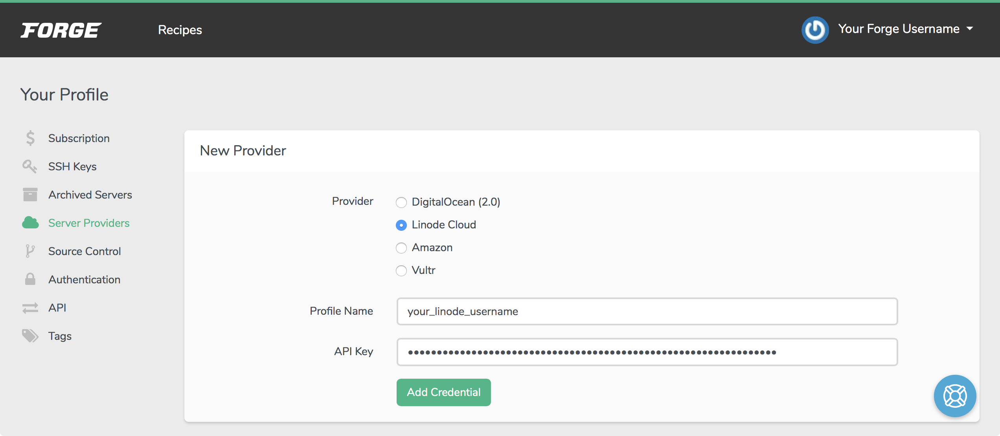

## What is Laravel Forge

[Laravel Forge](https://forge.laravel.com) is a tool for deploying and configuring web applications. It was developed by the makers of the [Laravel framework](https://laravel.com), but it can be used to automate the deployment of any web application that uses a PHP server.

Creating a fully-functioning web server normally involves the installation of multiple components such as NGINX, MySQL, and PHP. Laravel Forge automates all of the necessary installation and configuration steps, allowing you to get your website up and running quickly.

Once your server has been created, deploying updates becomes as clear and painless as pushing to your repository on GitHub. Also, you can easily manage the configuration of your website though a web interface. Finally, Forge automatically provides advanced security features, such as free SSL certificates (through [Let's Encrypt](https://letsencrypt.org/)) and automatic firewall configuration.

## Before You Begin

1.  Sign up for a [Laravel Forge](https://forge.laravel.com/auth/register) account if you don't have one.

1.  Create a Linode API key, which Laravel Forge will use to interface with your account. [Forge uses Linode's new APIv4](https://blog.laravel.com/forge-switching-to-the-new-linode-manager), and APIv4 tokens are created in the [Linode Cloud Manager](https://cloud.linode.com). Refer to the [Getting Started with the Linode API](/docs/products/tools/api/get-started/#get-an-access-token) to learn how to create your key.

1.  If you don't have a registered domain name for your website, purchase one from a domain name registrar.

    
You will be able to set up a site without a domain name (by visiting your Linode's IP address directly), but you will only be able to use SSL with a domain.


## Set Up your Forge Account

### Link to a Source Control Service

If you want to be able to quickly deploy from GitHub, GitLab, or Bitbucket, you will need to link these sites to your Forge account.

1.  From the top navigation menu of the Laravel Forge website, click on your username and then choose the **My Account** option:

    

1.  Navigate to the **Source Control** section:

    

1.  Choose your source control provider. Your browser will navigate to the source control provider's website, where an authorization prompt will appear.

    

1.  Confirm this authorization request. You will be returned to the Laravel Forge website.

### Adding your Linode API Key to Forge

1.  From the **My Account** page, navigate to the **Server Providers** section. Select **Linode Cloud**:

    

1.  Enter a profile name. This can be your Linode username or it can be any other string that will help you identify the profile. Then, enter your APIv4 key and click the **Add Credential** button.

## Create a Server

1.  Click on the **Forge** icon in the top left navigation menu. Then click on the **Linode** provider button.

1.  Fill out the form that appears:

    

    | **Option**&nbsp;&nbsp;&nbsp;&nbsp;&nbsp;&nbsp;&nbsp;&nbsp;&nbsp;&nbsp;&nbsp;&nbsp;&nbsp;&nbsp;&nbsp;&nbsp;&nbsp;&nbsp;&nbsp;&nbsp;&nbsp;&nbsp; | **Description** |
    | ------ | ----------- |
    | Credentials | Any of the Linode accounts that you have linked to your Laravel Forge account. |
    | Name | A name for your server. Laravel Forge auto-generates a random name, but you can edit it. |
    | Region | The data center where you want your server hosted. Choose a location close to where you expect the majority of users to be. |
    | Server Size | The hardware resource plan for your server. Plans with more CPU and memory can serve more connections to your sites, and a larger storage capacity can hold bigger databases. |
    | PHP Version | The PHP version to install. |
    | Post-Provision Recipe | [Actions](https://medium.com/@taylorotwell/post-provision-recipes-on-forge-634ccb189847) that should be taken after the server is provisioned. |
    | Database | The database package to install. |
    | Database Name | Your application's database name. By default it'll be named `forge`. |

1. Once you have finished selecting options, click **Create Server**. A pop-up dialog will show you the sudo and database passwords that have been automatically generated for you. Be sure to copy these values and store them in a secure place.

    

1.  Forge will now perform the steps necessary to create and configure a Linode based on the settings you provided. The new server will appear in the **Active Servers** section, and a list of recent events representing the server's configuration will appear below it.

    

1.  When the server has been fully provisioned the **Status** of the server will be **Active**. Navigate to the public IP address of your new Linode in a browser, and you will see the PHP settings active for the server:

    

1. When the setup process has completed you will also receive an email containing details about your new server:

    

## Set Up your Site

Your server has been created, but no sites have been set up on it, apart from the default site which displays your PHP settings.


If you do not want to use a domain with your website, you can configure the *default* site on your server. Select the default site from the **Active Sites** panel of your server's dashboard in Forge, then skip to the [Add a repository](#add-a-repository) instructions.


### Add a New Site

1.  Set up your DNS records for your domain. [Create a Domain Zone and an *A record*](/docs/products/networking/dns-manager/get-started/) assigned to your Linode's IP address. If you use Linode's name servers, review the [DNS Manager](/docs/products/networking/dns-manager/) guide for instructions.

    If you use another DNS provider, check their documentation for instructions.

    

1.  From the **Servers** menu in the top navigation bar, choose your new server. If you don't see this menu yet, refresh your browser window:

    

1.  Fill out the **New Site** form and then click the **Add Site** button:

    

    | **Option**&nbsp;&nbsp;&nbsp;&nbsp;&nbsp;&nbsp;&nbsp;&nbsp;&nbsp;&nbsp;&nbsp;&nbsp;&nbsp;&nbsp; | **Description** |
    | ------ | ----------- |
    | Root Domain | Your website's domain. |
    | Project Type | Your project type. If you are building regular PHP, you can choose `General PHP/Laravel`. Other options include Static, HTML, Symfony, and Symfony (Dev). |
    | Web Directory | The directory from which public files will be served. You will need to make sure your website's files are in this directory in your source code repository. |

1.  Your new site will appear below the form in the **Active Sites** panel:

    

### Add a Repository

1.  From the **Active Sites** panel, click on your site. The **Apps** section will appear:

    

1.  Select the **Git Repository** option and fill out the form that appears. The format for the **Repository** field should be `source_control_username/repository_name`. Laravel Forge will pull your code from the branch that you enter.

    

    
If you do not use [Composer](https://getcomposer.org), leave the **Install Composer Dependencies** option disabled, as it will cause errors for your deployment if enabled.


1.  Click on the **Install Repository** button. Forge will copy your source code to the server. When this finishes, visit your domain name in your browser, and you should see your site's contents.

1.  If your site deployment runs into any errors, a **Server Alerts** panel will appear. Click on the information button in this panel to review the errors in detail.

    

1. Verify that your site displays your repository's latest changes by navigating to your site's URL. If you did not register a Domain, then navigate to your site's IP address.

### Quick Deploy

Forge can automatically deploy updates to your server whenever you push new code to your application's repository.

1.  From the **Apps** section of your site's dashboard in Forge, click **Enable Quick Deploy**:

    

1.  Make changes to your project's code and push them to your repository service. Your live site will be updated to reflect the changes.

### Adding SSL to your Domain Name

SSL (Secure Sockets Layer) is the standard security technology for establishing an encrypted link between a web server and a browser. To add SSL:

1.  Navigate to the **SSL** section of your site's dashboard in Forge.

1.  If you already have an SSL certificate, click on **Install Existing Certificate**. Otherwise, select the **Let's Encrypt** option:

    

    
[Let's Encrypt](https://letsencrypt.org) is a free and widely-trusted SSL certificate authority.


1.  If you choose to use Let's Encrypt, verify that the domains you want to secure are listed correctly and click **Obtain Certificate**.
