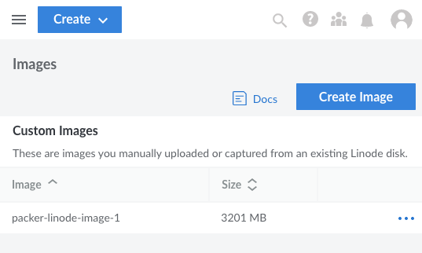
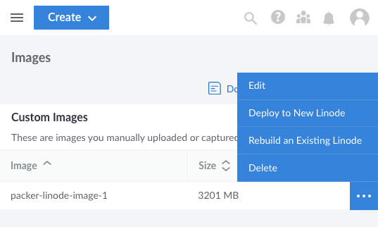
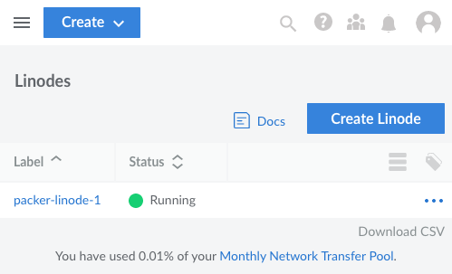

Packer automates machine image creation for containers or server instances. These images can serve as ready-made bases for deployments. Linode's Packer builder provides a tool for creating images specifically for Linode instances.

In this tutorial, learn how to create a Linode image using Packer. Design an image using a Packer template and the Linode builder plugin, then build and deploy your image as a new Linode instance.

## What Is Packer?

HashiCorp's [Packer](https://www.packer.io/) is an open source tool for automating the process of creating machine images. Using source configurations, Packer gives you a declarative interface for managing all aspects of an image. Packer sets up the operating system, installs and configures applications, and can even have your files and data ready.

Packer is capable of rendering images for tools like Docker and services like AWS. With Linode's custom Packer builder, Packer can create images that are ready to deploy as Linode instances.

Packer accomplishes image creation through templates which use the *HashiCorp Configuration Language* (HCL). Templates let you define your image through a declarative language. They let you import plugins, configure sources, and articulate commands to execute. Overall, it gives you a highly adaptable process for building images.

### Packer vs Terraform

Packer and Terraform may seem similar at first. However, each ideally serves a different role in the process of designing, provisioning, and deploying infrastructure. In fact, the two tools work exceedingly well together.

Packer automates the process of rendering machine images. With Packer, you define the operating system, initial software, and configuration for an instance. The built Packer image can be readily and quickly used to build multiple similar instances.

Meanwhile, Terraform automates the building, provisioning, and modifying of infrastructure. Terraform can handle many of the actions taken within a typical Packer template. However, doing so tends to be much less efficient, with the script needing to be executed for each instance deployed.

Instead, Terraform ideally serves to deploy ready systems. For that reason, Terraform works excellently when paired with Packer. Create a Packer image, and Terraform can quickly deploy an infrastructure with numerous instances based on it.

Learn more about using the two tools in tandem through our guide [How to Deploy a Packer Image with Terraform](/docs/guides/deploy-packer-image-with-terraform/).

## Before You Begin

1.  If you have not already done so, create a Linode account and Compute Instance. See our [Getting Started with Linode](/docs/guides/getting-started/) and [Creating a Compute Instance](/docs/guides/creating-a-compute-instance/) guides.

1.  Follow our [Setting Up and Securing a Compute Instance](/docs/guides/set-up-and-secure/) guide to update your system. You may also wish to set the timezone, configure your hostname, create a limited user account, and harden SSH access.


This guide is written for a non-root user. Commands that require elevated privileges are prefixed with `sudo`. If you’re not familiar with the `sudo` command, see the [Users and Groups](/docs/guides/linux-users-and-groups/) guide.


## How to Install Packer

Before building, you need to install Packer on a system from which you plan to create Linode images.

The process for installing Packer varies substantially depending on your operating system. Refer to the [official installation guide](https://learn.hashicorp.com/tutorials/packer/get-started-install-cli) for instructions particular to your operating system.

```code {title="Debian / Ubuntu"}
sudo apt-get update && sudo apt-get install -y gnupg software-properties-common
curl -fsSL https://apt.releases.hashicorp.com/gpg | sudo apt-key add -
sudo apt-add-repository "deb [arch=amd64] https://apt.releases.hashicorp.com $(lsb_release -cs) main"
sudo apt-get update && sudo apt-get install packer
```

```code {title="AlmaLinux / CentOS Stream / Rocky Linux"}
sudo yum install -y yum-utils
sudo yum-config-manager --add-repo https://rpm.releases.hashicorp.com/RHEL/hashicorp.repo
sudo yum -y install packer
```

```code {title="Fedora"}
sudo dnf install -y dnf-plugins-core
sudo dnf config-manager --add-repo https://rpm.releases.hashicorp.com/fedora/hashicorp.repo
sudo dnf -y install packer
```

Afterward, verify your installation with the following command to check your Packer version:

```code
packer --version
```


1.8.3


## How to Build a Linode Image with Packer

The rest of this tutorial walks you through the process of using Packer to create a Linode image. It starts with creating a basic image, then moves on to provisioning resources onto the image. Finally, you can see how to put that image together, build it, and deploy it to your Linode account.

To get started, create a directory to store your Packer project in, and change into that directory. This tutorial uses the `example-[packer-linode` directory.

```code
mkdir ~/example-packer-linode
cd ~/example-packer-linode
```

The rest of this tutorial assumes you are in your Packer project directory.

### Create a Template with the Linode Builder

Packer images are built using templates in the HashiCorp Configuration Language, also used by tools like Terraform.

Within the Packer template, you can add plugins, configure variables, and define the source which acts as the basis of your Packer image.

The Linode builder for Packer is a plugin dedicated to constructing Linode images. After importing the plugin, you can craft a Linode source and define the baseline characteristics of your Linode image.

Create a new `.pkr.hcl` file in your Packer project directory. This tutorial uses `example-linode-image.pkr.hcl` as the name of the file.

```code
nano example-linode-image.pkr.hcl
```

Add the following to your file:

```file {title="example-linode-image.pkr.hcl"}
packer {
  required_plugins {
    linode = {
      version = ">= 1.0.1"
      source  = "github.com/hashicorp/linode"
    }
  }
}
```

The `packer` block imports your required plugins. This is where you import the Linode builder plugin. This gives you access to the `linode` source. Below, you can see an example of how you can use that source to define the characteristics of an image.

```file {title="example-linode-image.pkr.hcl" linenostart="10" hl_lines="7"}
source "linode" "example-linode-image" {
  image                 = "linode/ubuntu20.04"
  image_description     = "Example Packer Linode Image"
  image_label           = "packer-linode-image-1"
  instance_label        = "packer-linode-1"
  instance_type         = "g6-standard-1"
  linode_token          = "LINODE_API_TOKEN"
  region                = "us-east"
  ssh_username          = "root"
}
```

Each field within the `linode` source block defines a component of the image built from the template. Some of these are more apparent than others, but you can get more details on each on the [Linode builder](https://www.packer.io/plugins/builders/linode) page. Here are some of the more useful, and less apparent, of these fields:

-   `image` gives the base operating system image to use. Here, the image corresponds to Ubuntu 20.04. See the full list of images [here](https://api.linode.com/v4/linode/images).

-   `instance_type` indicates the type of Linode instance used. This example creates a "Linode 2GB" shared CPU instance. Alternatively, you could use `g6-dedicated-4` for a "Dedicated 8GB" instance. See the full list of instance types [here](https://api.linode.com/v4/linode/types).

-   `linode_token` provides your Linode API token. Packer needs this to access your Linode account and create the image.

    
The value in the example above is just a placeholder, which you should replace with your own API token. You can follow our [Get an API Access Token](/docs/products/tools/linode-api/guides/get-access-token/) guide to generate a personal access token. Be sure to give the token "Read/Write" permissions.


-   `region` designates the server region for the resulting Linode instance. The example above puts the instance at the Newark, NJ location. See the full list of regions [here](https://api.linode.com/v4/regions).

Finally, the example also includes a `build` block. This block tells packer what sources and other provisioning features needed to create the image.

```file {title="example-linode-image.pkr.hcl" linenostart="21"}
build {
  sources = ["source.linode.example-linode-image"]
}
```

Right now, this simply references the `example-linode-image` designated in the source block. However, modifying this block later on in the section about provisioning allows it to do much more.

At this point, the template is ready to be initialized, which you can do with the command below:

```code
packer init .
```
Initializing your template prompts Packer to download any plugins you have defined within the template:


Installed plugin github.com/hashicorp/linode v1.0.3 in "/home/example-user/.config/packer/plugins/github.com/hashicorp/linode/packer-plugin-linode_v1.0.3_x5.0_linux_amd64"


### Using Variables in a Packer Template

Packer templates can utilize variables, which can make your templates more adaptable and readable. Each variable first needs to be defined. In this case, you can add the definitions right to the main template file, between the `packer` and `source` blocks. The example below also immediately makes use of these variables by changing two lines in the `source` block.

```file {title="example-linode-image.pkr.hcl" linenostart="10" hl_lines="1-3,5-8,16-17"}
variable "api_token" {
  type = string
}

variable "linode_region" {
  type      = string
  default   = "us-east"
}

source "linode" "example-linode-image" {
  image                 = "linode/ubuntu20.04"
  image_description     = "Example Packer Linode Image"
  image_label           = "packer-linode-image-1"
  instance_label        = "packer-linode-1"
  instance_type         = "g6-standard-1"
  linode_token          = var.api_token
  region                = var.linode_region
  ssh_username          = "root"
}
```

Each variable declaration has a `type` field to explain the variable and its role. Each variable declaration can also include a `default` field, which defines the default value for the variable.

While variables can be assigned in the command line when building the Packer image, the more practical approach is to assign variables in a dedicated file. Packer automatically reads variables from any files in the Packer project directory using the `.auto.pkrvars.hcl` format.

For this tutorial, you can add a file named `vars.auto.pkrvars.hcl` to the directory with your Linode image template:

```code
nano vars.auto.pkrvars.hcl
```

Now assign a value to the `api_token` variable within the file, like this:

```file {title="vars.auto.pkrvars.hcl"}
api_token = "LINODE_API_TOKEN"
```

In this case, the `linode_region` variable has a default value set. Therefore that variable does not need to be included here unless you want to build the image in a different region.

### Provisioning on the Linode Image

At this stage, there is enough to build a basic Linode image, and you could skip to the next section to see how to do that. However, you often want to build an image with included software and custom configurations. Packer can handle such provisioning through expanded use of the `build` block created earlier.

For this example, the tutorial adds NGINX to the Packer template defined in the previous sections. Using the `shell` provisioner, the template dictates a series of shell commands for Packer to execute on the instance before rendering the image. These commands install NGINX and provide some basic configuration to make it operational.

Follow along with the comments in the code below to get a breakdown of what each part is doing.

```file {title="example-linode-image.pkr.hcl" linenostart="30" hl_lines="3-25"}
build {
  sources = ["source.linode.example-linode-image"]

  provisioner "shell" {
    inline = [
      # Update the system.
      "apt-get update -qq",

      # Configure the firewall rules.
      "ufw allow ssh",
      "ufw allow http",
      "ufw --force enable",
      "ufw reload",

      # Install NGINX.
      "apt-get install -qq nginx",

      # Ensure NGINX runs at system startup.
      "systemctl enable nginx",

      # Restart the NGINX service; this loads any configuration changes you
      # choose to implement above.
      "systemctl restart nginx",
    ]
  }
}
```

Packer's ability to run shell commands on the instance before rendering an image gives you a high level of control and flexibility. You can readily extend on the example above to install additional software and make further configuration changes.

### Verify and Build the Linode Image

The Packer template is essentially ready to be built. However, it is usually good practice to verify the template contents for both formatting and correctness.

Packer comes with a function for automatically checking and correcting the format of your template. Packer's template standard is designed to make your templates more readable and, consequently, easier to maintain. If Packer makes any changes to your template files, it outputs the names of each changed file:

```code
packer fmt .
```

You can also automatically check templates for errors using the `validate` command. Packer notifies you of any errors, providing you the related files, locations, and descriptions.

```code
packer validate .
```


The configuration is valid.


Finally, to build your Linode image, you can issue Packer's `build` command:

```code
packer build .
```

The process itself may take several minutes, depending on the image, the instance, and the kind of provisioning being done. As the process goes on, you may see output similar to the following:


linode.example-linode-image: output will be in this color.

==> linode.example-linode-image: Running builder ...
==> linode.example-linode-image: Creating Linode...
[...]
==> linode.example-linode-image: Shutting down Linode...
==> linode.example-linode-image: Creating image...
[...]
==> Builds finished. The artifacts of successful builds are:
--> linode.example-linode-image: Linode image: packer-linode-image-1 (private/17691867)


Keep an eye on the output for any errors, or for a stalled process. If needed, you can stop the process with the **Ctrl** + **C** key combination.

Afterward, you can find the new Linode image from the **Images** menu within the Linode Cloud Manager interface.



## How to Deploy a Packer Image to Linode

The Packer image is now available on your Linode account, and accessible from your Linode dashboard. You can easily deploy your new image from there.

-   To deploy the image to a new instance, follow our guide [Deploy an Image to a New Compute Instance](/docs/products/tools/images/guides/deploy-image-to-new-linode/).

-   To deploy the image over an existing instance, follow our guide [Deploy an Image to an Existing Compute Instance](/docs/products/tools/images/guides/deploy-image-to-existing-linode/).

The process is straightforward, and after a short while, your instance should be running with the image built from Packer.

For this example, a new instance was deployed using the image. This was done by selecting the **Deploy to New Linode** from the image's menu.



After deploying the instance, you can navigate to your **Linodes** dashboard to see the instance listing.



This tutorial's example image has also been provisioned with NGINX, and its firewall has been configured with the HTTP port open. Thus, you can immediately see the instance in action through its default NGINX configuration. In a web browser, visit the new instance's public IP address. You should be greeted by the NGINX welcome screen:


## Conclusion

You now have a complete, provisioned Linode image built with Packer. Check out the link below to HashiCorp's repository of Packer tutorials to continue learning what Packer is capable of. This tutorial covered what you need to set up a Linode image with Packer. Diving into the rest of Packer's features can give you an excellent toolkit for fine-tuning your images.

The steps above also cover deploying Packer images to Linode. However, when you need to mobilize numerous instances, you could benefit from a tool to automate deploying your Packer images. Terraform works well for that, pairing with Packer to streamline the process of deploying and managing an infrastructure. Take a look at our guide [How to Deploy a Packer Image with Terraform](/docs/guides/deploy-packer-image-with-terraform/) to learn how these tools can be used effectively together.