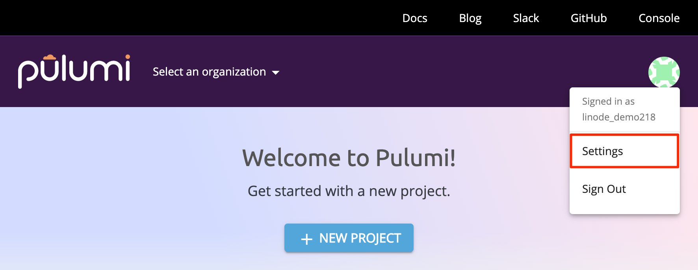
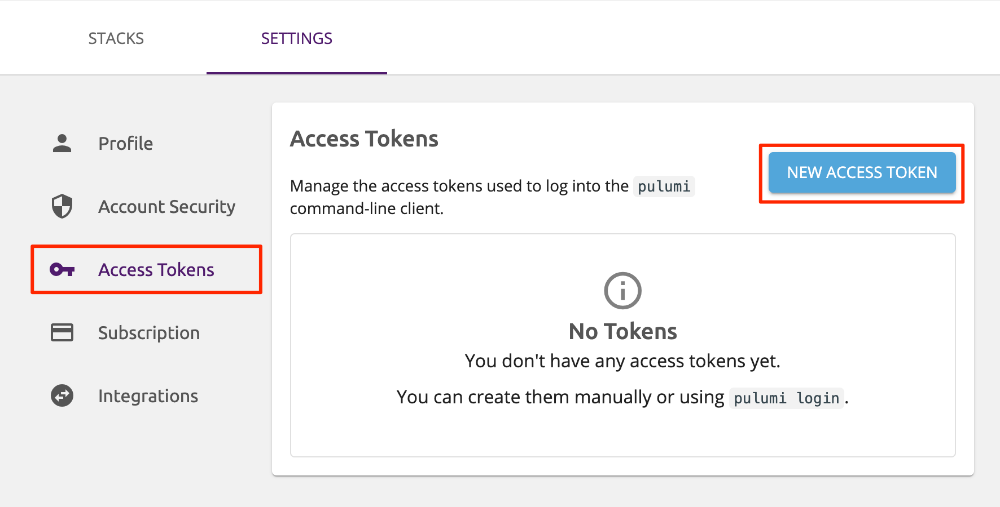

## What is Pulumi?

[*Pulumi*](https://www.pulumi.com/) is a development tool that allows you to write computer programs which deploy cloud resources--a practice referred to as *infrastructure as code (IaC)*. Pulumi integrates with multiple cloud platforms, and Pulumi programs can be authored in a number of common programming languages.

With Pulumi's Linode integration, you can manage your Linode resources as you would with our [API](/docs/products/tools/api/) or [CLI](/docs/products/tools/cli/), but in a language you may already be familiar with. This guide will present examples written in JavaScript, but Pulumi is also compatible with Go, Python, and TypeScript.

Pulumi also comes with a CLI interface for running the cloud infrastructure programs that you write. Once you've written a program, you can create your cloud resources with a single command:

    pulumi up

In this guide you will learn how to:

* [Install and set up Pulumi](#before-you-begin) on Debian 9
* [Create a single Linode instance](#create-a-linode) using Pulumi and JavaScript
* [Create a NodeBalancer](#create-and-configure-a-nodebalancer) with two NGINX webserver backends using Pulumi and JavaScript

##  Before You Begin

1. If you haven't yet, [create a Linode API token](/docs/products/tools/api/get-started/#create-an-api-token).

1. [Create a free Pulumi account](https://app.pulumi.com/signup).

1. Create a new Debian 9 Linode. Follow our [Creating a Compute Instance](/docs/products/compute/compute-instances/guides/create/) guide to deploy the Linode, and then follow the [Setting Up and Securing a Compute Instance](/docs/products/compute/compute-instances/guides/set-up-and-secure/) guide. Be sure to create a [limited  Linux user with sudo privileges](/docs/products/compute/compute-instances/guides/set-up-and-secure/#add-a-limited-user-account) on your server. All commands in this guide are to be run from a sudo user.

1. Install Pulumi on your Linode using their installation script:

        curl -fsSL https://get.pulumi.com | sh

1. To start using the Pulumi CLI:

    -   Restart your shell session, or

    -   Add `/home/username/.pulumi/bin` to your `$PATH` variable in your current session. Replace `username` with the name of your limited Linux user:

            PATH=$PATH:/home/username/.pulumi/bin

1. Install [Node.js](https://nodejs.org/en/) and [npm](https://www.npmjs.com/):

        sudo apt-get install curl software-properties-common
        curl -sL https://deb.nodesource.com/setup_12.x | sudo bash -
        sudo apt-get install -y nodejs

## Generate a Pulumi Access Token

Once you have a Pulumi account, you will need to create an *access token* to use later.


When Pulumi interprets the infrastructure programs that you write, it determines what cloud resources it needs to create in order to satisfy your program. Every time you run your program, [Pulumi stores the state](https://pulumi.io/reference/state/#state-and-backends) of these resources in a persistent backend. In subsequent updates to your infrastructure, Pulumi will compare your program with the recorded state so that it can determine which changes need to be made.

By default, Pulumi securely stores this state information on a web backend hosted at [https://app.pulumi.com](https://app.pulumi.com). This service is free to start and offers paid tiers for teams and enterprises.

It is possible to opt-out of using the default web backend and use a filesystem-based backend instead. Review [Pulumi's documentation](https://pulumi.io/reference/state/#to-the-filesystem-backend) for instructions.


1. [Log into your Pulumi account](https://app.pulumi.com/signin). After you've logged in, click on the avatar graphic to the top right of the Pulumi dashboard, then click on the **Settings** option in the dropdown menu that appears:

    

1. Select the **Access Tokens** item in the sidebar to the left of the page that appears:

    

1. Click on the **New Access Token** button towards the top right of the following page and follow the prompts to create your new token. Make sure you save this in a secure location, similar to your Linode API token.

## Create a Linode

### Set up your Pulumi Project

Now that you have everything you need to begin using Pulumi, you can create a new Pulumi *project*.


A Pulumi [project](https://pulumi.io/reference/project/) is the folder structure which contains your Pulumi programs. Specifically, a project is any folder which contains a `Pulumi.yaml` metadata file.


1. Pulumi requires an empty directory for each new project, so first you'll need to create one and make it your working directory:

        cd ~/ && mkdir pulumi && cd pulumi

1. Now that you're inside of your new empty working directory, create a new project:

        pulumi new

1. From here, you'll see several prompts:

    - Enter your Pulumi access token if prompted. If you've already entered it at any point following the installation of Pulumi, you will not be prompted again and can skip this step.
    - Use your arrow keys to highlight the `linode-javascript` option.
    - Enter a project name of your choice, or leave blank to use the default option.

    - Enter a project description, or leave blank to use the default option.
    - Enter a *stack* name of your choice, or leave blank to use the default option.

        
        Multiple instances of your Pulumi programs can be created. For example, you may want to have separate instances for the development, staging, and production environments of your service. Or, you may create multiple instances of your service if you're offering it to different business clients. In Pulumi, these instances are referred to as [stacks](https://pulumi.io/tour/programs-stacks/).
        

    - Enter your Linode API token.

1. Once the installation is successful, you will see a `Your new project is ready to go!` message. The `pulumi new` command scaffolds a collection of default configuration files in your project's directory. The default configuration will give you everything you need to get started. Enter the `ls` command to ensure that the files are present:

        ls

    
index.js      package.json	 Pulumi.pulumi.yaml
node_modules  package-lock.json  Pulumi.yaml


    The contents of these files were defined according to our responses to each prompt after entering `pulumi new`. In particular:

    - `index.js` contains the JavaScript Pulumi will run
    - `package.json` defines the dependencies we can use and the file path Pulumi will be reading our code from.

### Inspect the Default Configuration

Let's take a look at the contents of our `index.js` file:


"use strict";
const pulumi = require("@pulumi/pulumi");
const linode = require("@pulumi/linode");

// Create a Linode resource (Linode Instance)
const instance = new linode.Instance("my-instance", {
    type: "g6-nanode-1",
    region: "us-east",
    image: "linode/ubuntu18.04",
});

// Export the Instance label of the instance
exports.instanceLabel = instance.label;


The file requires two JavaScript modules unique to Pulumi: Pulumi's SDK, and Pulumi's Linode integration. [Pulumi's API Reference Documentation](https://pulumi.io/reference/pkg/nodejs/pulumi/linode/) serves as a reference for the JavaScript you'll see here. It also includes a library of several additional options that enable you to create configurations more specific to your use case.

In this case, your file is only creating a single 1GB Linode (Nanode) instance in the Newark data center running Ubuntu 18.04.

### Create and Destroy Resources

-   Use [Pulumi's `preview` command](https://pulumi.io/reference/cli/pulumi_preview/) to test your code and make sure it's successfully able to create resources under your account.

        pulumi preview

    The output of the command will list the operations Pulumi will perform once you deploy your program:

        Previewing update (dev):

            Type                      Name                   Plan
        +   pulumi:pulumi:Stack       my-pulumi-project-dev  create
        +   └─ linode:index:Instance  my-instance            create

        Resources:
            + 2 to create

-   Use [Pulumi's `up` command](https://pulumi.io/reference/cli/pulumi_up/) to deploy your code to your Linode account:

        pulumi up

    
This will create a new billable resource on your account.


    From here, you will be prompted to confirm the resource creation. Use your arrow keys to choose the `yes` option, hit `enter`, and you will see your resources being created. Once the process is completed, the Linode Label of your new Linode will be displayed. If you check your account manually through the [Cloud Manager](https://cloud.linode.com/), you can confirm that this Linode has been successfully created.

-   Since this Linode was only created as a test, you can safely delete it by entering [Pulumi's `destroy` command](https://pulumi.io/reference/cli/pulumi_destroy/):

        pulumi destroy

    Follow the prompts, and you'll be able to see the resources being removed, similar to how we could see them being created.

    
Many Pulumi commands will be logged on your Pulumi account. You can see this under the **Activity** tab of your project's stack in [Pulumi's Application Page](https://app.pulumi.com/).


## Create and Configure a NodeBalancer

To better demonstrate the power of Pulumi code, we'll create a new `index.js` file. This will define everything we need to create a functioning NodeBalancer which is pre-configured with two backend Linodes running NGINX.

1.  Replace the contents of your `index.js` file with the following:

    
const pulumi = require("@pulumi/pulumi");
const linode = require("@pulumi/linode");

// Create two new 1GB Linodes (Nanodes) using a StackScript to configure them internally.
// The StackScript referenced will install and enable NGINX.

// "linode1" (the first argument passed to the Linode instance constructor function) is the Pulumi-allocated Unique Resource Name (URN) for this resource
const linode1 = new linode.Instance("linode1", {
        // "PulumiNode1" is the Linode's label that appears in the Cloud Manager. Linode labels must be unique on your Linode account
        label: "PulumiNode1",
        region: "us-east",
        image: "linode/debian9",
        privateIp: true,
        stackscriptData: {
                hostname: "PulumiNode1",
            },
        stackscriptId: 526246,
        type:"g6-nanode-1",
});

const linode2 = new linode.Instance("linode2", {
        label: "PulumiNode2",
        region: "us-east",
        image: "linode/debian9",
        privateIp: true,
        stackscriptData: {
            hostname: "PulumiNode2",
            },
        stackscriptId: 526246,
        type:"g6-nanode-1",
});

// Create and configure your NodeBalancer

const nodeBalancer = new linode.NodeBalancer("nodeBalancer", {
        clientConnThrottle: 20,
        label: "PulumiNodeBalancer",
        region: "us-east",
});

const nodeBalancerConfig = new linode.NodeBalancerConfig("nodeBalancerConfig", {
        algorithm: "source",
        check: "http",
        checkAttempts: 3,
        checkTimeout: 30,
        checkInterval: 40,
        checkPath: "/",
        nodebalancerId: nodeBalancer.id,
        port: 8088,
        protocol: "http",
        stickiness: "http_cookie",
});

// Assign your Linodes to the NodeBalancer

const balancerNode1 = new linode.NodeBalancerNode("balancerNode1", {
        address: pulumi.concat(linode1.privateIpAddress, ":80"),
        configId: nodeBalancerConfig.id,
        label: "PulumiBalancerNode1",
        nodebalancerId: nodeBalancer.id,
        weight: 50,
});

const balancerNode2 = new linode.NodeBalancerNode("balancerNode2", {
        address: pulumi.concat(linode2.privateIpAddress, ":80"),
        configId: nodeBalancerConfig.id,
        label: "PulumiBalancerNode2",
        nodebalancerId: nodeBalancer.id,
        weight: 50,
});

//Output your NodeBalancer's Public IPV4 address and the port we configured to access it
exports.nodeBalancerIP = nodeBalancer.ipv4;
exports.nodeBalancerPort = nodeBalancerConfig.port;


    
    In our `index.js` file we've created and configured two Linodes using an existing [StackScript](/docs/products/tools/stackscripts/) which installs NGINX. Pulumi's Linode integration allows for the creation of entirely [new StackScripts](https://pulumi.io/reference/pkg/nodejs/pulumi/linode/#StackScript) directly in code, which can help you to automate your deployments even further.

    If you're interested in seeing how this StackScript works, you can view it [here](https://www.linode.com/stackscripts/view/526246).
    

1.  Now that you've successfully prepared your JavaScript code, let's bring up our configuration:

        pulumi up

    As before, select `yes` when prompted and wait for a few moments as your resources are created, configured, and brought online.

1.  Once the process is completed, you'll see your NodeBalancer's IP address and the port you configured earlier displayed as part of the output:

        Outputs:
        + nodeBalancerIP  : "192.0.2.3"
        + nodeBalancerPort: 8088

    Enter this IP address and port into your web browser, and you will see the *Hello World*-style page that the StackScript configured:

        curl http://192.0.2.3:8088/

    
Hello from PulumiNode1


    
If you do not see this page right away, you should wait a few additional moments. NodeBalancers can sometimes require a little extra time to fully apply a new configuration.


1.  Once you're finished with your NodeBalancer, you can remove and delete everything you added by entering `pulumi destroy` as before.

## Next Steps

Pulumi is a powerful tool with a vast number of possible configurations that can be applied. From here you can:

* Look at Pulumi's [examples](https://github.com/pulumi/examples) for more ideas regarding the things you can do with Pulumi.

* Try using Pulumi with different languages like [Python](https://pulumi.io/reference/python/) or [TypeScript](https://pulumi.io/reference/javascript/#typescript)

* Import Node.js tools like [Express](https://expressjs.com/) for even more elasticity with your code.

*  Use Pulumi for [Serverless Computing](https://www.pulumi.com/serverless/)