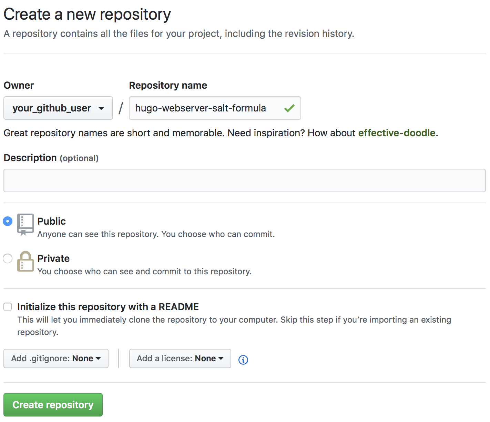
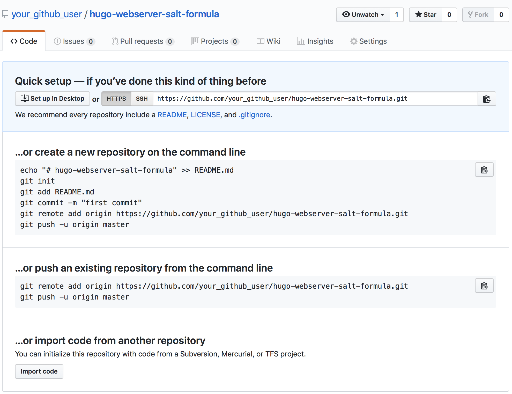
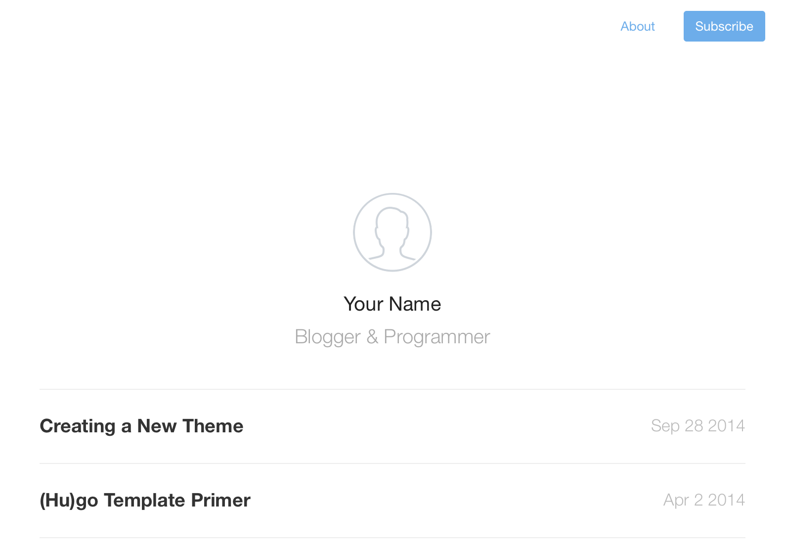
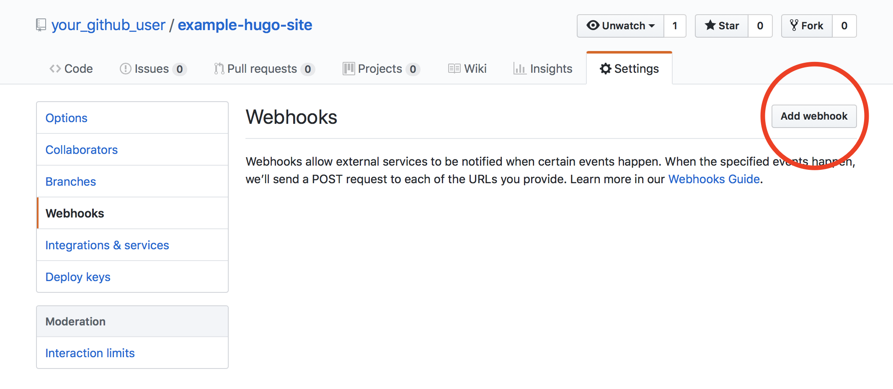
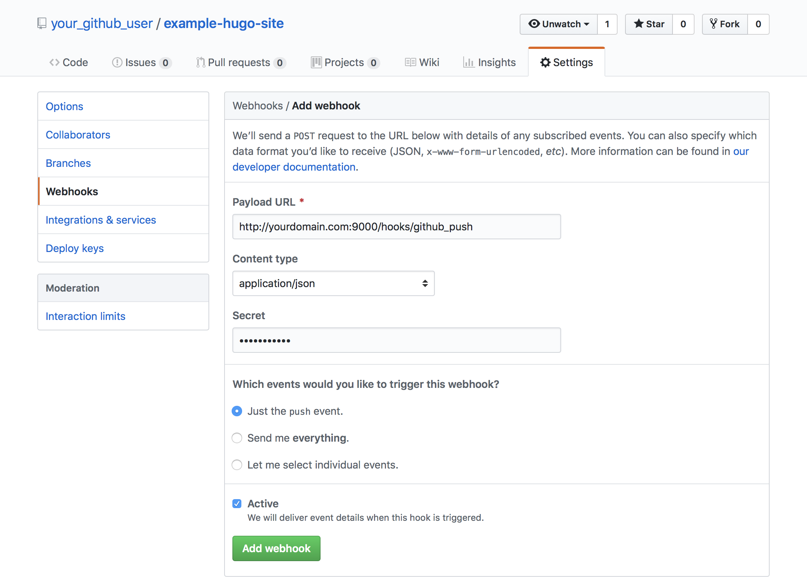
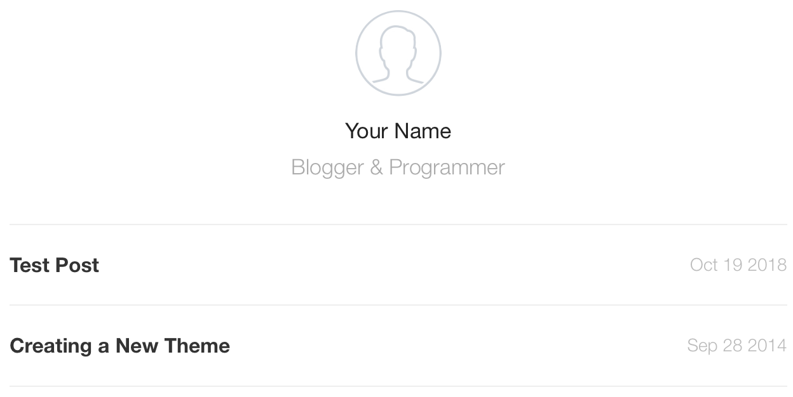
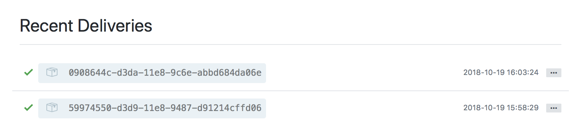

This guide will walk through the deployment of a static site using [SaltStack](https://github.com/saltstack/salt), which is a flexible configuration management system. The configuration files created for Salt will be version controlled using Git. Updates to your static site's code will be automatically communicated to the production system using webhooks, an event notification system for the web.

Setting up these mechanisms offers an array of benefits:

-   Using webhooks will keep your production website in sync with your development without any actions needed on your part.

-   Using Salt provides an extensible, reliable way to alter your production systems and minimize human error.

-   Version controlling your configuration management helps you track or revert the changes you've made to your systems and collaborate with others on your deployments.

## Development and Deployment Workflow

The static site generator used in this guide is [Hugo](https://gohugo.io), a fast framework written in Go. Static site generators compile [Markdown](https://en.wikipedia.org/wiki/Markdown) or other content files into HTML files. This guide can easily be adapted to other frameworks.

Two Git repositories will be created: one will track changes to the Hugo site, and the other will track Salt's configuration files. Remote repositories will be created for both on GitHub.

Two Linodes will be created: one will act as the Salt master, and the other as the Salt minion. This guide was tested under Debian 9, but the instructions may work with other distributions as well. The Salt minion will run the production webserver which serves the Hugo site, and the master will configure the minion's software. The minion will also run a webhook server which will receive code update notifications from GitHub.

It is possible to run Salt in a [masterless mode](https://docs.saltproject.io/en/latest/topics/tutorials/quickstart.html), but using a Salt master will make it easier to expand on your deployment in the future.


The workflow described in this guide is similar to how Linode's own [Guides & Tutorials](https://github.com/linode/docs) website is developed and deployed.


## Before You Begin

### Set Up the Development Environment

Development of your Hugo site and your Salt formula will take place on your personal computer. Some software will need to be installed on your computer first:

1.   Install Git using one of the methods in [Linode's guide](/docs/guides/how-to-install-git-on-linux-mac-and-windows/). If you have a Mac, use the Homebrew method, as it will also be used to install Hugo.

1.   Install Hugo. The [Hugo documentation](https://gohugo.io/getting-started/installing/) has a full list of installation methods, and instructions for some popular platforms are as follows:

    -   Debian/Ubuntu:

            sudo apt-get install hugo

    -   Fedora, Red Hat and CentOS:

            sudo dnf install hugo

    -   Mac, using [Homebrew](https://brew.sh):

            brew install hugo

    -   Windows, using [Chocolatey](https://chocolatey.org)

            choco install hugo -confirm

### Deploy the Linodes

1.  Follow the [Creating a Compute Instance](/docs/products/compute/compute-instances/guides/create/) guide and deploy two Linodes running Debian 9.

1.  In the settings tab of your Linodes' dashboards, label one of the Linodes as `salt-master` and the other as `salt-minion`. This is not required, but it will help keep track of which Linode serves which purpose.

1.  Complete the [Setting Up and Securing a Compute Instance](/docs/products/compute/compute-instances/guides/set-up-and-secure/) guide on each Linode to create a limited Linux user account with `sudo` privileges, harden SSH access, and remove unnecessary network services.

    

1.  Configure DNS for your site by adding a [domain zone](/docs/products/networking/dns-manager/guides/create-domain/) and setting up [reverse DNS](/docs/products/compute/compute-instances/guides/configure-rdns/) on your Salt minion's IP address.

## Set Up the Salt Master and Salt Minion

Before you can start setting up the Salt formulas for the minion, you first need to install the Salt software on the master and minion and set up communication between them.

1.  Log into the Salt **master** Linode via SSH and run the Salt installation bootstrap script:

        wget -O bootstrap-salt.sh https://bootstrap.saltproject.io
        sudo sh bootstrap-salt.sh -M -N

    
The `-M` option tells the script to install the Salt master software, and the `-N` option tells the script to not install the minion software.


1.  Log into the Salt **minion** Linode via SSH and [set the hostname](/docs/products/compute/compute-instances/guides/set-up-and-secure/#configure-a-custom-hostname). This guide uses `hugo-webserver` as the example hostname:

        sudo hostnamectl set-hostname hugo-webserver

    
This step needs to be completed **before installing Salt** on the minion, as Salt will use your hostname to generate the minion's Salt ID.


1.  Edit the minion's `/etc/hosts` file and append a new line for your hostname after the `localhost` line; replace 192.0.2.3 with your **minion's** public IP address:

    
127.0.0.1       localhost
192.0.2.3       hugo-webserver
# [...]


1.  Run the bootstrap script on the minion:

        wget -O bootstrap-salt.sh https://bootstrap.saltproject.io
        sudo sh bootstrap-salt.sh

1.  Edit `/etc/salt/minion` on the Salt minion. Uncomment the line that begins with `#master:` and enter your Salt **master's** IP after the colon (in place of `192.0.2.2`):

    
# [...]
master: 192.0.2.2
# [...]


    
Linode does not charge for traffic within a datacenter across private IP addresses. If your Salt master and minion are in the same datacenter, and both have a private IP addresses, you can use your Salt master's private IP address in this step to avoid incurring data traffic charges.


1.  Restart Salt on the minion:

        sudo systemctl restart salt-minion

### Salt Minion Authentication

The minion should now be able to find the master, but it has not yet been authenticated to communicate with the master. Salt uses public-private keypairs to authenticate minions to masters.

1.  On the **master**, list fingerprints for all the master's local keys, accepted minion keys, and unaccepted keys:

        sudo salt-key --finger-all

    The output should resemble:

    
Local Keys:
master.pem:  fe:1f:e8:3d:26:83:1c:...
master.pub:  2b:93:72:b3:3a:ae:cb:...
Unaccepted Keys:
hugo-webserver:  29:d8:f3:ed:91:9b:51:...


    
The example fingerprints in this section have been truncated for brevity.


1.  Copy the fingerprint for `master.pub` from the output of `salt-key --finger-all`. On your Salt **minion**, open `/etc/salt/minion` in a text editor. Uncomment the line that begins with `#master_finger:` and enter the value for your `master.pub` after the colon in single-quotes:

    
# [...]
master_finger: '0f:d6:5f:5e:f3:4f:d3:...'
# [...]


1.  Restart Salt on the minion:

        sudo systemctl restart salt-minion

1.  View the minion's local key fingerprint:

        sudo salt-call key.finger --local

    
local:
    29:d8:f3:ed:91:9b:51:...


    Compare the output's listed fingerprint to the fingerprints listed by the Salt master for any `Unaccepted Keys`. This is the output of `salt-key --finger-all` run on the master in the beginning of this section.

1.  After verifying, that the minion's fingerprint is the same as the fingerprint detected by the Salt master, run the following command on the **master** to accept the minion's key:

        sudo salt-key -a hugo-webserver

1.  From the master, verify that the minion is running:

        sudo salt-run manage.up

    You can also run a Salt test ping from the master to the minion:

        sudo salt 'hugo-webserver' test.ping

    
hugo-webserver:
    True


## Initialize the Salt Minion's Formula

The Salt minion is ready to be configured by the master. These configurations will be written in a Salt *formula* which will be hosted on [GitHub](https://github.com/).

1.  On your computer, create a new directory to hold your minion's formula and change to that directory:

        mkdir hugo-webserver-salt-formula
        cd hugo-webserver-salt-formula

1.  Inside the formula directory, create a new `hugo` directory to hold your webserver's configuration:

        mkdir hugo

1.  Inside the `hugo` directory, create a new `install.sls` file:

    
nginx_pkg:
  pkg.installed:
    - name: nginx


    
Salt configurations are declared in YAML-- a markup language that incorporates whitespace/indentation in its syntax. Be sure to use the same indentation as the snippets presented in this guide.


    A `.sls` file is a **S**a**L**t **S**tate file. Salt states describe the state a minion should be in after the state is applied to it: e.g., all the software that should be installed, all the services that should be run, and so on.

    The above snippet says that a package with name `nginx` (i.e. the NGINX web server) should be installed via the distribution's package manager. Salt knows how to negotiate software installation via the built-in package manager for various distributions. Salt also knows how to install software via NPM and other package managers.

    The string `nginx_pkg` is the *ID* for the state component, `pkg` is the name of the Salt *module* used, and `pkg.installed` is referred to as a *function declaration*. The component ID is arbitrary, so you can name it however you prefer.

    
If you were to name the ID to be the same as the relevant installed package, then you do not need to specify the `- name` option, as it will be inferred from the ID. For example, this snippet also installs NGINX:


nginx:
  pkg.installed


The same name/ID convention is true for other Salt modules.


1.  Inside the `hugo` directory, create a new `service.sls` file:

    
nginx_service:
  service.running:
    - name: nginx
    - enable: True
    - require:
      - pkg: nginx_pkg


    This state says that the `nginx` service should be immediately run and be enabled to run at boot. For a Debian 9 system, Salt will set the appropriate [systemd](/docs/guides/what-is-systemd/) configurations to enable the service. Salt also supports other init systems.

    The `require` lines specify that this state component should not be applied until after the `nginx_pkg` component has been applied.

    
Unless specified by a `require` declaration, Salt makes no guarantees about the order that different components are applied. The order that components are listed in a state file **does not** necessarily correspond with the order that they are applied.


1.  Inside the `hugo` directory, create a new `init.sls` file with the following contents:

    
include:
  - hugo.install
  - hugo.service


    Using the `include` declaration in this way simply concatenates the `install.sls` and `service.sls` files into a single combined state file.

    Right now, these state files only install and enable NGINX. More functionality will be enabled later in this guide.

    The `install` and `service` states will not be applied to the minion on their own--instead, only the combined `init` state will ever be applied. In Salt, when a file named `init.sls` exists inside a directory, Salt will refer to that particular state by the name of the directory it belongs to (i.e. `hugo` in our example).

    
The organization of the state files used here is not mandated by Salt. Salt does not place restrictions on how you organize your states. This specific structure is presented as an example of a [best practice](https://docs.saltproject.io/en/latest/topics/best_practices.html).


### Push the Salt Formula to GitHub

1.  Inside your `hugo-webserver-salt-formula` directory on your computer, initialize a new Git repository:

        cd ~/hugo-webserver-salt-formula
        git init

1.  Stage the files you just created:

        git add .

1.  Review the staged files:

        git status

    
On branch master
No commits yet
Changes to be committed:
  (use "git rm --cached <file>..." to unstage)

  new file:   hugo/init.sls
  new file:   hugo/install.sls
  new file:   hugo/service.sls


1.  Commit the files:

        git commit -m "Initial commit"

1.  Log into the GitHub website in your browser and navigate to the [Create a New Repository](https://github.com/new) page.

1.  Create a new public repository with the name `hugo-webserver-salt-formula`:

    

1.  Copy the HTTPS URL for your new repository:

    

1.  In your local Salt formula repository, add the GitHub repository as the `origin` remote and push your new files to it. Replace `github-username` with your GitHub user:

        git remote add origin https://github.com/github-username/hugo-webserver-salt-formula.git
        git push -u origin master

    
If you haven't pushed anything else to your GitHub account from the command line before, you may be prompted to authenticate with GitHub. If you have two-factor authentication enabled for your account, you will need to create and use a [personal access token](https://help.github.com/articles/creating-a-personal-access-token-for-the-command-line/).


1.  If you navigate back to your `hugo-webserver-salt-formula` repository on GitHub and refresh the page, you should now see your new files.

### Enable GitFS on the Salt Master

Update your Salt master to serve the new formula from GitHub:

1. Salt requires that you install a Python interface to Git to use GitFS. On the Salt master Linode:

        sudo apt-get install python-git

1.  Open `/etc/salt/master` in a text editor. Uncomment the `fileserver_backend` declaration and enter `roots` and `gitfs` in the declaration list:

    
fileserver_backend:
  - roots
  - gitfs


    `roots` refers to Salt files stored on the master's filesystem. While the Hugo webserver Salt formula is stored on GitHub, the Salt [*Top file*](https://docs.saltproject.io/en/latest/ref/states/top.html#states-top) will be stored on the master. The Top file is how Salt maps states to the minions they will be applied to.

1.  In the same file, uncomment the `gitfs_remotes` declaration and enter your Salt formula's repository URL:

    
gitfs_remotes:
  - https://github.com/your_github_user/hugo-webserver-salt-formula.git


1.  Uncomment the `gitfs_provider` declaration and set its value to `gitpython`:

    
gitfs_provider: gitpython


### Apply the Formula's State to the Minion

1.  In `/etc/salt/master`, uncomment the `file_roots` declaration and set the following values:

    
file_roots:
  base:
    - /srv/salt/


    `file_roots` specifies where state files are kept on the Master's filesystem. This is referenced when `- roots` is declared in the `fileserver_backend` section. `base` refers to a Salt *environment*, which is a tree of state files that can be applied to minions.  This guide will only use the `base` environment, but other environments could be created for development, QA, and so on.

1.  Restart Salt on the master to enable the changes in `/etc/salt/master`:

        sudo systemctl restart salt-master

1.  Create the `/srv/salt` directory on the Salt master:

        sudo mkdir /srv/salt

1.  Create a new `top.sls` file in `/srv/salt`:

    
base:
  'hugo-webserver':
    - hugo


    This is Salt's Top file, and the snippet declares that the `hugo-webserver` minion should receive the `init.sls` state from the `hugo` directory (from your GitHub-hosted Salt formula).

1.  Tell Salt to apply states from the Top file to the minion:

        sudo salt 'hugo-webserver' state.apply

    Salt as refers to this command as a *highstate*. Running a highstate can take a bit of time to complete, and the output of the command will describe what actions were taken on the minion. The output will also show if any actions failed.

    
If you see an error similar to:


No matching sls found for 'hugo' in env 'base'


Try running this command to manually fetch the Salt formula from GitHub, then run the `state.apply` command again:

    sudo salt-run fileserver.update

Salt's GitFS fetches files from remotes periodically, and this period [can be configured](https://docs.saltproject.io/en/latest/ref/configuration/master.html#std:conf_master-gitfs_update_interval).


1.  If you visit your domain name in a web browser, you should now see NGINX's default test page served by the Salt minion.

## Initialize the Hugo Site

1.  On your computer, create a new Hugo site. Make sure you are not running this command in your `hugo-webserver-salt-formula` directory:

        hugo new site example-hugo-site

1.  Navigate to the new Hugo site directory and initialize a Git repository:

        cd example-hugo-site
        git init

1.  Install a theme into the `themes/` directory. This guide uses the [Cactus theme](https://themes.gohugo.io/cactus/):

        git submodule add https://github.com/digitalcraftsman/hugo-cactus-theme.git themes/hugo-cactus-theme

1.  The theme comes with some example content. Copy it into the root of your site so that it can be viewed:

        cp -r themes/hugo-cactus-theme/exampleSite/ .

1.  Edit the `baseurl`, `themesDir`, and `name` options in `config.toml` as follows; replace `example.com` with your own domain and `Your Name` with your own name:

    
# [...]
baseURL = "http://example.com"
# [...]
themesDir = "themes"
# [...]
  name = "Your Name"


1.  Run the Hugo development server on your computer:

        hugo server

    The output from this command will end with a line like:

    
Web Server is available at http://localhost:1313/ (bind address 127.0.0.1)


1.  If you view the URL from this output in a browser, you can see your new Hugo site:

    

1.  Enter **CTRL-C** in the terminal session on your computer to stop the Hugo development server. Open the `.gitignore` file and make sure `public/` is listed. The default `.gitignore` from the Cactus theme should look like:

    
public/
themes


    The `public` directory is the result of Hugo compiling the Markdown content files into HTML. These files can be regenerated by anyone who downloads your site code, so they won't be checked into version control.

### Push the Hugo Site to GitHub

1.  In the Hugo site directory, commit the new site files:

        git add .
        git commit -m "Initial commit"

1.  Create a new public repository on GitHub named `example-hugo-site` and copy the repository's HTTPS URL.

1.  In the site directory, add the GitHub repository as the `origin` remote and push your new files to it; replace `github-username` with your GitHub user:

        git remote add origin https://github.com/github-username/example-hugo-site.git
        git push -u origin master

## Deploy the Hugo Site

The Salt minion's formula needs to be updated in order to serve the Hugo site. Specifically, the formula will need to have states which:

-   Install Git and clone the Hugo site repository from GitHub.

-   Install Hugo and build the HTML files from the Markdown content.

-   Update the NGINX configuration to serve the built site.

Some of the new state components will refer to data stored in [*Salt Pillar*](https://docs.saltproject.io/en/latest/topics/pillar/). Pillar is a Salt system that stores private data and other parameters that you don't want to list in your formulas. The Pillar data will be kept as a file on the Salt master and not checked into version control.


There are methods for securely checking this data into version control or using other backends to host the data, but those strategies are outside the scope of this guide.


Pillar data is injected into state files with Salt's [*Jinja* templating](https://docs.saltproject.io/en/latest/topics/jinja/index.html) feature. State files are first evaluated as Jinja templates and then as YAML afterwards.

### Install Git and Hugo

In your local Salt formula's repository, edit the `install.sls` file to append the `git_pkg` and `hugo_pkg` states:


# [...]

git_pkg:
  pkg.installed:
    - name: git

hugo_pkg:
  pkg.installed:
    - name: hugo
    - sources:
      - hugo: https://github.com/gohugoio/hugo/releases/download/v{{ pillar['hugo_deployment_data']['hugo_version'] }}/hugo_{{ pillar['hugo_deployment_data']['hugo_version'] }}_Linux-64bit.deb


The first state component installs Git, and the second component installs Hugo. The second component's `sources` declaration specifies that the package should be downloaded from Hugo's GitHub repository (instead of from the distribution package manager).

The `{{ }}` syntax that appears in `{{ pillar['hugo_deployment_data']['hugo_version'] }}` is a Jinja substitution statement. `pillar['hugo_deployment_data']['hugo_version']` returns the value of the `hugo_version` key from a dictionary named `hugo_deployment_data` in Pillar. Keeping the Hugo version in Pillar lets you update Hugo without needing to update your formulas.

### Clone the Hugo Site Git Repository

Create a new `config.sls` file in your local Salt formula repository's `hugo` directory:


hugo_group:
  group.present:
    - name: {{ pillar['hugo_deployment_data']['group'] }}

hugo_user:
  user.present:
    - name: {{ pillar['hugo_deployment_data']['user'] }}
    - gid: {{ pillar['hugo_deployment_data']['group'] }}
    - home: {{ pillar['hugo_deployment_data']['home_dir'] }}
    - createhome: True
    - require:
      - group: hugo_group

hugo_site_repo:
  cmd.run:
    - name: git clone --recurse-submodules https://github.com/{{ pillar['hugo_deployment_data']['github_account'] }}/{{ pillar['hugo_deployment_data']['site_repo_name'] }}.git
    - cwd: {{ pillar['hugo_deployment_data']['home_dir'] }}
    - runas: {{ pillar['hugo_deployment_data']['user'] }}
    - creates: {{ pillar['hugo_deployment_data']['home_dir'] }}/{{ pillar['hugo_deployment_data']['site_repo_name'] }}
    - require:
      - pkg: git_pkg
      - user: hugo_user


The final `hugo_site_repo` component in this snippet is responsible for cloning the example Hugo site repository from GitHub. This cloned repo is placed in the home directory of a system user that Salt creates in the preceding components. The clone command also recursively downloads the Cactus theme submodule.


The `- creates` declaration tells Salt that running the `cmd` command module will result in the creation of the file that's specified. If the state is applied again later, Salt will check if that file already exists. If it exists, Salt will *not* run the module again.



The `require` declarations in each component ensure that:

-   The clone is not run until the system user and home directory have been created, and until the software package for Git has been installed.
-   The user is not created until the group it belongs to is created.

Instead of hard-coding the parameters for the user, group, home directory, GitHub account, and repository name, these are retrieved from Pillar.

### Configure NGINX

1.  Append the following states to your `config.sls`:

    
nginx_default:
  file.absent:
    - name: '/etc/nginx/sites-enabled/default'
    - require:
      - pkg: nginx_pkg

nginx_config:
  file.managed:
    - name: /etc/nginx/sites-available/hugo_site
    - source: salt://hugo/files/hugo_site
    - user: root
    - group: root
    - mode: 0644
    - template: jinja
    - require:
      - pkg: nginx_pkg

nginx_symlink:
  file.symlink:
    - name: /etc/nginx/sites-enabled/hugo_site
    - target: /etc/nginx/sites-available/hugo_site
    - user: root
    - group: root
    - require:
      - file: nginx_config

nginx_document_root:
  file.directory:
    - name: {{ pillar['hugo_deployment_data']['nginx_document_root'] }}/{{ pillar['hugo_deployment_data']['site_repo_name'] }}
    - user: {{ pillar['hugo_deployment_data']['user'] }}
    - group: {{ pillar['hugo_deployment_data']['group'] }}
    - dir_mode: 0755
    - require:
      - user: hugo_user


    -   The `nginx_default` component removes the symlink in `sites-enabled` for the default NGINX config, which disables that configuration.
    -   `nginx_config` and `nginx_symlink` then create a new configuration file in `sites-available` and a symlink to it in `sites-enabled`.
    -   The `nginx_document_root` component creates the directory that NGINX will serve your Hugo site files from (when filled in with Pillar data, this will directory will look like `/var/www/example-hugo-site`).

1.  The `- source: salt://hugo/files/hugo_site` declaration in `nginx_config` refers to an NGINX configuration file that doesn't exist in your repository yet. Create the `files/` directory:

        cd ~/hugo-webserver-salt-formula/hugo
        mkdir files

1.  Create the `hugo_site` file inside `files/`:

    
server {
    listen 80;
    listen [::]:80;
    server_name {{ pillar['hugo_deployment_data']['domain_name'] }};

    root {{ pillar['hugo_deployment_data']['nginx_document_root'] }}/{{ pillar['hugo_deployment_data']['site_repo_name'] }};

    index index.html index.htm index.nginx-debian.html;

    location / {
        try_files $uri $uri/ = /404.html;
    }
}


    The `nginx_config` component that manages this file also listed the `- template: jinja` declaration, so the source file is interpreted as a Jinja template. The source file is able to substitute values from Pillar using the Jinja substitution syntax.

1.  **Replace** the content of your `service.sls` with this snippet:

    
nginx_service:
  service.running:
    - name: nginx
    - enable: True
    - require:
      - file: nginx_symlink
    - watch:
      - file: nginx_config


    The `nginx_service` component now requires `nginx_symlink` instead of `nginx_pkg`. Without this change, the service may be enabled and run before the new NGINX configuration is set up. The `- watch` declaration also instructs NGINX to restart whenever a change to `nginx_config` is made.

### Build Hugo

1.  Append a `build_script` state to `config.sls`:

    
build_script:
  file.managed:
    - name: {{ pillar['hugo_deployment_data']['home_dir'] }}/deploy.sh
    - source: salt://hugo/files/deploy.sh
    - user: {{ pillar['hugo_deployment_data']['user'] }}
    - group: {{ pillar['hugo_deployment_data']['group'] }}
    - mode: 0755
    - template: jinja
    - require:
      - user: hugo_user
  cmd.run:
    - name: ./deploy.sh
    - cwd: {{ pillar['hugo_deployment_data']['home_dir'] }}
    - runas: {{ pillar['hugo_deployment_data']['user'] }}
    - creates: {{ pillar['hugo_deployment_data']['nginx_document_root'] }}/{{ pillar['hugo_deployment_data']['site_repo_name'] }}/index.html
    - require:
      - file: build_script
      - cmd: hugo_site_repo
      - file: nginx_document_root


    This state uses more than one module. The first module will download the `deploy.sh` file from the salt master and place it on the minion. This script will be responsible for compiling your Hugo site files. The second module then calls that script. The first module is listed as a requirement of the second module, along with the Git clone command, and the creation of the document root folder.

    
The `- creates` option in the second module ensures that Salt doesn't rebuild Hugo if the state is re-applied to the minion.


1.  Create the `deploy.sh` script in `files/`:

    
#!/bin/bash

cd {{ pillar['hugo_deployment_data']['site_repo_name'] }}
hugo --destination={{ pillar['hugo_deployment_data']['nginx_document_root'] }}/{{ pillar['hugo_deployment_data']['site_repo_name'] }}


    Hugo's build function is called with NGINX's document root as the destination for the built files.

1.  Update `init.sls` to include the new `config.sls` file:

    
include:
  - hugo.install
  - hugo.config
  - hugo.service


### Push the Salt Formula Updates to GitHub

Your state files should now have these contents: [init.sls](init-full.sls), [install.sls](install-partial.sls), [config.sls](config-partial.sls), [service.sls](service-partial.sls).

The files present in your Salt formula repository should be:


hugo
├── config.sls
├── files
│   ├── deploy.sh
│   └── hugo_site
├── init.sls
├── install.sls
└── service.sls


1.  Stage all the changes you made to your local Salt formula files in the previous steps and then commit the changes:

        cd ~/hugo-webserver-salt-formula
        git add .
        git commit -m "Deploy the Hugo site"

1.  Push the commit to your GitHub repository:

        git push origin master

### Create the Salt Pillar File

1.  Open `/etc/salt/master` on the Salt master in a text editor. Uncomment the `pillar_roots` section:

    
pillar_roots:
  base:
    - /srv/pillar


    `pillar_roots` performs an analogous function to `file_roots`: it specifies where Pillar data is stored on the master's filesystem.

1.  Restart Salt on the master to enable the changes in `/etc/salt/master`:

        sudo systemctl restart salt-master

1.  Create the `/srv/pillar` directory on the Salt master:

        sudo mkdir /srv/pillar

1.  Create an `example-hugo-site.sls` file in `/srv/pillar` to contain the Pillar data for the minion. This file uses the same YAML syntax as other state files. Replace the values for `github_account` and `domain_name` with your GitHub account and your site's domain name:

    
hugo_deployment_data:
  hugo_version: 0.49
  group: hugo
  user: hugo
  home_dir: /home/hugo
  github_account: your_github_user
  site_repo_name: example-hugo-site
  nginx_document_root: /var/www
  domain_name: yourdomain.com


1.  Create a `top.sls` file in `/srv/pillar`. Similar to the Top file in your state tree, the Pillar's Top file maps Pillar data to minions:

    
base:
  'hugo-webserver':
    - example-hugo-site


### Apply State Updates to the Minion

On the Salt master, apply the new states to all minions:

    sudo salt '*' state.apply


In this guide there is only one minion, but Salt can use shell-style globbing and regular expressions to [match against minion IDs](https://docs.saltproject.io/en/latest/topics/targeting/globbing.html) when you have more than one. For example, this command would run a highstate on all minions whose IDs begin with `hugo`:

    sudo salt 'hugo*' state.apply


If no changes are made, try manually fetching the Salt formula updates from GitHub and then run the `state.apply` command again:

    sudo salt-run fileserver.update

When the operation finishes, your Hugo site should now be visible at your domain.

## Deploy Site Updates with Webhooks

Your site is now deployed to production, but there is no automatic mechanism in place yet for updating the production server when you update your Hugo site's content. To update the production server, your minion will need to:

1.  Pull the latest changes pushed to the `master` branch of your Hugo site repository on GitHub.

1.  Run the Hugo build process with the new content.

The `deploy.sh` script can be altered to pull changes from GitHub. These script changes will be made in the Salt formula repository. Then, we'll set up *webhooks* to notify the Salt minion that updates have been made to the Hugo site.

Webhooks are HTTP POST requests specifically designed and sent by systems to communicate some kind of significant event. A webhook server listens for these requests and then takes some action when it receives one. For example, a GitHub repository can be configured to send webhook notifications whenever a push is made to the repository. This is the kind of notification we'll configure, and the Salt minion will run a webhook server to receive them. [Other event notifications](https://developer.github.com/webhooks/) can also be set up on GitHub.

### Set Up a Webhook Server on the Salt Minion

1.  In your local Salt formula repository, append a new `webhook_pkg` state to your `install.sls` that installs the [webhook server package by adnanh](https://github.com/adnanh/webhook/):

    
webhook_pkg:
  pkg.installed:
    - name: webhook


    
The webhook server written in Go by adnanh is a popular implementation of the concept, but it's possible to write other HTTP servers that parse webhook payloads.


1.  Append two new components to your `config.sls`:

    
webhook_systemd_unit:
  file.managed:
    - name: '/etc/systemd/system/webhook.service'
    - source: salt://hugo/files/webhook.service
    - user: root
    - group: root
    - mode: 0644
    - template: jinja
    - require:
      - pkg: webhook_pkg
  module.run:
    - name: service.systemctl_reload
    - onchanges:
      - file: webhook_systemd_unit

webhook_config:
  file.managed:
    - name: '/etc/webhook.conf'
    - source: salt://hugo/files/webhook.conf
    - user: root
    - group: {{ pillar['hugo_deployment_data']['group'] }}
    - mode: 0640
    - template: jinja
    - require:
      - pkg: webhook_pkg
      - group: hugo_group


    The first state creates a [systemd unit file](/docs/guides/introduction-to-systemctl/) for the webhook service. The second state creates a webhook configuration. The webhook server reads the configuration and generates a webhook URL from it.

1.  Create a `webhook.service` file in your repository's `files/` directory:

    
[Unit]
Description=Small server for creating HTTP endpoints (hooks)
Documentation=https://github.com/adnanh/webhook/

[Service]
User={{ pillar['hugo_deployment_data']['user'] }}
ExecStart=/usr/bin/webhook -nopanic -hooks /etc/webhook.conf

[Install]
WantedBy=multi-user.target


1.  Create a `webhook.conf` file in your repository's `files/` directory:

    
[
  {
    "id": "github_push",
    "execute-command": "{{ pillar['hugo_deployment_data']['home_dir'] }}/deploy.sh",
    "command-working-directory": "{{ pillar['hugo_deployment_data']['home_dir'] }}",
    "trigger-rule":
    {
      "and":
      [
        {
          "match":
          {
            "type": "payload-hash-sha1",
            "secret": "{{ pillar['hugo_deployment_data']['webhook_secret'] }}",
            "parameter":
            {
              "source": "header",
              "name": "X-Hub-Signature"
            }
          }
        },
        {
          "match":
          {
            "type": "value",
            "value": "refs/heads/master",
            "parameter":
            {
              "source": "payload",
              "name": "ref"
            }
          }
        }
      ]
    }
  }
]


    This configuration sets up a URL named `http://example.com:9000/hooks/github_push`, where the last component of the URL is derived from the value of the configuration's `id`.

    
The webhook server runs on port 9000 and places your webhooks inside a `hooks/` directory by default.


    When a POST request is sent to the URL:

    -   The webhook server checks if the header and payload data from the request satisfies the rules in the `trigger-rule` dictionary, which are:
        -   That the SHA1 hash of the server's webhook secret matches the secret in the request headers. This prevents people who don't know your webhook secret from triggering the webhook's action.
        -   The `ref` parameter in the payload matches `refs/heads/master`. This ensures that only pushes to the `master` branch trigger the action.

    -   If the rules are satisfied, then the command listed in `execute-command` is run, which is the `deploy.sh` script.

    
Further documentation on the webhook configuration options can be reviewed on the project's [GitHub repository](https://github.com/adnanh/webhook/).


1.  Append a new `webhook_service` state to your `service.sls` that enables and starts the webhook server:

    
webhook_service:
  service.running:
    - name: webhook
    - enable: True
    - watch:
      - file: webhook_config
      - module: webhook_systemd_unit


1.  Update the `deploy.sh` script so that it pulls changes from `master` before building the site:

    
#!/bin/bash

cd {{ pillar['hugo_deployment_data']['site_repo_name'] }}
git pull origin master
hugo --destination={{ pillar['hugo_deployment_data']['nginx_document_root'] }}//{{ pillar['hugo_deployment_data']['site_repo_name'] }}


1.  Your state files should now have these contents: [init.sls](init-full.sls) *(unchanged)*, [install.sls](install-full.sls), [config.sls](config-full.sls), [service.sls](service-full.sls). Save the changes made to your Salt files, then commit and push them to GitHub:

        cd ~/hugo-webserver-salt-formula
        git add .
        git commit -m "Webhook server states"
        git push origin master

1.  On the Salt master, add a `webhook_secret` to the `example-hugo-site.sls` Pillar. Your secret should be a complex, random alphanumeric string.

    
hugo_deployment_data:
  # [...]
  webhook_secret: your_webhook_secret


1.  From the Salt master, apply the formula updates to the minion:

        sudo salt-run fileserver.update
        sudo salt 'hugo-webserver' state.apply

1.  Your webhook server should now be running on the minion. If you run a `curl` against it, you should see:

        curl http://example.com:9000/hooks/github_push

    
Hook rules were not satisfied.⏎


### Configure a Webhook on GitHub

1.  Visit your example Hugo site repository on GitHub and navigate to the **Webhooks** section of the **Settings** tab. Click on the **Add webhook** button:

    

1.  Fill in the form:

    -   Enter `http://example.com:9000/hooks/github_push` for the payload URL (substitute `example.com` for your own domain).

    -   Select `application/json` for the content type.

    -   Paste in the webhook secret that you previously added to Salt Pillar.

    The webhook is configured to notify on push events by default. Keep this option selected.

    

1.  Click the green **Add webhook** button to complete the setup.

### Update the Hugo Site

1.  In your local Hugo site repository, create a new post using Hugo's [*archetypes*](https://gohugo.io/content-management/archetypes/) feature:

        hugo new post/test-post.md

1.  This command creates a new partially filled in Markdown document in `content/post/`. Open this file in your editor, remove the `draft: true` line from the [*frontmatter*](https://gohugo.io/content-management/front-matter/), and add some body text:

    
---
title: "Test Post"
date: 2018-10-19T11:39:15-04:00
---

Test post body text


1.  If you run `hugo server` in the repository directory, you can see the new post:

    

1.  Commit and push the new post to GitHub:

        cd ~/example-hugo-site
        git add .
        git commit -m "Test post"
        git push origin master

1.  Visit your domain in your browser; your test post should automatically appear.

    
If your post does not appear, review the **Recent Deliveries** section at the bottom of your webhook configuration page on GitHub:

If you click on a delivery, full information about the request headers and payload and the server response are shown, and these may provide some troubleshooting information. Editing the `webhook.service` file so that it starts the service in [verbose mode](https://github.com/adnanh/webhook/blob/master/docs/Webhook-Parameters.md) may help.


## Next Steps

The current Salt configuration can be used as a foundation for more complex deployments:

-   Host multiple Hugo sites by updating Pillar with further GitHub repositories.

-   Host different kinds of static sites by changing the Salt formula to support them.

-   Load balance your site by creating more minions and apply the same Pillar data and Salt states to them. Then, set up a [NodeBalancer](https://www.linode.com/nodebalancers) to direct traffic to the minions.

-   Set up a separate development branch and development server with Salt's environments feature.
