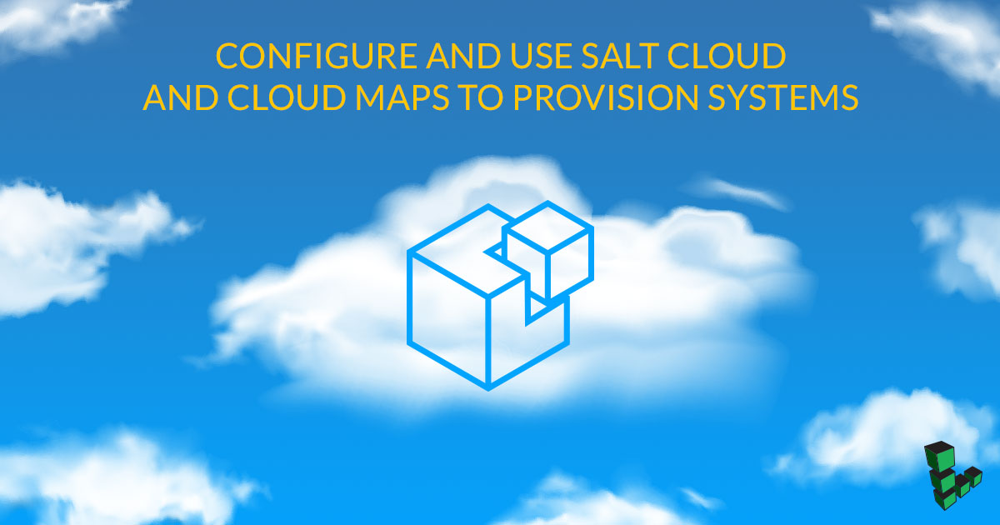

## What is Salt Cloud?

[Salt Cloud](https://docs.saltproject.io/en/latest/topics/cloud/) is a configuration management tool that allows users to provision systems on cloud hosts or hypervisors. During installation, Salt Cloud installs Salt on all provisioned systems by default. This enables the user to put systems into the desired state during provisioning.

Salt Cloud:

* Helps gather information on your systems and manage their lifecycle through a Command Line Interface (CLI).
* Supports Linode as a provider out of the box. You do not have to install any additional plugins.

This guide shows how to install Salt Cloud and configure it to work on a Linode.

## Before You Begin

1.  Create a management server which will be used to create and manage your Linode servers. You can host the management server remotely on a Linode, or on a local machine. The only condition is that it is capable of installing and executing Salt Cloud.

2.  This guide assumes that Salt Cloud will be installed together with Salt master server.

3.  Generate an [API key](/docs/products/tools/api/guides/manage-api-tokens/) to access Linode API. This key will be used by Salt Cloud to manage your instances. Make sure to keep your API key safe. Set the environment variable `API_TOKEN` and test your API key is working through the REST interface:

        curl -H "Authorization:Bearer $API_TOKEN" https://api.linode.com/v4/account | json_pp

4.  The management server must have access to the Linode API (non-proxy internet access).

## Install Salt and Salt Cloud via Bootstrap Script

The recommended way to install Salt Cloud is with a Salt Bootstrap script. This script will install Salt, Salt Cloud packages, and all required dependencies. Run the script with the `-h` flag to view the additional options available, or refer to [Salt Bootstrap Guide](https://docs.saltproject.io/en/latest/topics/tutorials/salt_bootstrap.html) for detailed instructions.

1. Download the Salt Bootstrap script via curl:

        curl -o bootstrap-salt.sh -L https://bootstrap.saltproject.io

2. Execute the script and use the `-L` option to install Salt and Salt Cloud:

        sh bootstrap-salt.sh -L

## Configure Salt Cloud

### Set up Provider Configuration:

Configure and test access to the Linode API.

1.  Edit `/etc/salt/cloud.providers.d/linode.conf` to configure the name of your provider configuration. Salt Cloud will use it during operations with instances in the CLI. Use a short name (or abbreviation like `li`) that will be easy to remember. You can also specify multiple Linode providers for managing multiple accounts. Linode requires the default root password for the new servers to be set. This password needs to be eight characters and contain lowercase, uppercase, and numbers.

    
my-linode-provider:
    api_version: v4
    apikey: <Your API key>
    password: <Default password for the new instances>
    driver: linode


    
All configuration files store data in YAML format. Be careful with indentation - use only spaces and not tabs. Each level of indentation is usually separated with 2 spaces.


2. Test access to the Linode API:

    Execute the following command from your master to test access to the Linode API:

        salt-cloud --list-locations my-linode-provider

    If you have set up the connection to Linode properly, you will see output similar to:

        my-linode_provider:
            ----------
            linode:
                ----------
                Atlanta, GA, USA:
                    ----------
                    ABBR:
                        atlanta
                    DATACENTERID:
                        4
                    LOCATION:
                        Atlanta, GA, USA

## Create a New Salt Cloud Instance

### List Available Locations, Images and Sizes

Before creating new instances, specify instance size: amount of system memory, CPU, and storage; location: physical location of data center; and image: operating system.

You can obtain this information with the following commands:

*  Available locations:

        salt-cloud --list-locations my-linode-provider

*  Available sizes:

        salt-cloud --list-sizes my-linode-provider

*  Available images:

        salt-cloud --list-images my-linode-provider

### Set up Profile Configuration

Create an instance profile. In this profile you describe a server which will be created on your Linode account. Minimal configuration should include provider, size, image and location.

For this example, create an instance with a standard size, using a Debian 11 image, located in London.

1.  Open `/etc/salt/cloud.profiles.d/linode-london-1gb.conf` and paste the following:

    
linode_1gb:
  provider: my-linode-provider
  size: g6-standard-1
  image: linode/debian11
  location: eu-west


    You can use one file for all profiles, or use one file per instance profile. All files from `/etc/salt/cloud.profiles.d/` are read during execution.

2.  By default, Salt Cloud will install Salt Minion on all provisioned servers. To allow provisioned systems to connect to the master, set the default master configuration for all provisioned systems.

    Edit `/etc/salt/cloud.conf.d/master.conf` and paste the following content, replacing `saltmaster.example.com` with the IP address or domain name of your master server:

    
minion:
  master: saltmaster.example.com


    Another option is to set this parameter for specific instance profile:

    
linode_1gb_with_master:
provider: my-linode-provider
  size: g6-standard-1
  image: linode/debian11
  location: eu-west
  minion:
    master: mymaster.example.com


3.  Set up [SSH key authentication](/docs/guides/use-public-key-authentication-with-ssh/) for your instance. To do this during provisioning, set up the profile as follows, replacing the `ssh_pubkey` and `ssh_key_file` with key information for an SSH key on your master server:

    
linode_1gb_with_ssh_key:
  provider: my-linode-provider
  size: g6-standard-1
  image: linode/debian11
  location: eu-west
  ssh_pubkey: ssh-ed25519 AAAAC3NzaC1lZDI1NTE5AAAAIKHEOLLbeXgaqRQT9NBAopVz366SdYc0KKX33vAnq+2R user@host
  ssh_key_file: ~/.ssh/id_ed25519


    
If your master server is located behind a firewall, you will have to open ports `4505-4506` in [firewall](https://docs.saltproject.io/en/latest/topics/tutorials/firewall.html). Depending on your network configuration, you may have to set up port forwarding for these ports.


## Salt Cloud Interface

### Create Linode Instances

There are several ways to create new instances:

*  **Create a single new instance**:

        salt-cloud -p linode_1gb linode1

    Creating the instance and installing Salt Minion on it might take some time.

    When deployment is complete, you will see following summary:

        linode1:
            ----------
            deployed:
                True
            id:
                <ID>
            image:
                linode/debian11
            name:
                linode1
            private_ips:
            public_ips:
                - <ip_address>
            size:
                g6-standard-1
            state:
                Running

*  You can connect to the instance using user `root` and the password specified in the config file.

*  To **create multiple servers in one command** type the following:

        salt-cloud -p linode_1gb linode1 linode2

    The instance names which you provide in this command are used to manage instances internally and they are not connected to the instance hostname.

    Linode labels:

    *  May only contain ASCII letters or numbers, dashes, and underscores
    *  Must begin and end with letters or numbers, and
    *  Be at least three characters in length.

*  Normally when creating instances, they are executed serially. Use the `salt-cloud` command with `-P` option to **create instances in parallel allowing for deployment**:

        salt-cloud -P -p linode_1gb linode1 linode2

*  **If you do not want to install Salt Minion on the provisioned server**, run `salt-cloud` with the `--no-deploy` option:

        salt-cloud -p linode_1gb --no-deploy linode3

    Salt cloud will generate an error message, but the instance will be created:

        linode3:
            ----------
            Error:
                ----------
                No Deploy:
                    'deploy' is not enabled. Not deploying.

### Destroy Salt Cloud Instances

1.  To destroy an instance, execute `salt-cloud` with `-d` option:

        salt-cloud -d linode1

2.  The server will be destroyed after you confirm the deletion.

### Get Information About Running Instances

**Partial Information**

Gather partial information by executing `salt-cloud` with the `-Q` option:

    salt-cloud -Q

**Full Information**

Get full information about instances using `-F` option:

    salt-cloud -F

**Configure a Selective Query**

1.  Edit `/etc/salt/cloud.conf.d/query.conf` and add the fields you would like to select:

    
query.selection:
  - image
  - size


2.  Execute selective query using `-S` option:

        salt-cloud -S

    Output:

        linode3:
            ----------
            image:
                linode/debian11
            size:
                1024

## How to Perform Actions on Salt Cloud Instances

Actions are features that apply to a specific instance. Currently, the following actions are supported:

* `show_instance`
* `start`
* `stop`

For example, to stop a running `linode1` instance, execute the `salt-cloud` command with the `-a` option and `stop` command:

    salt-cloud -a stop linode1

## Use Cloud Map Files to Manage Complex Environments

Scaling, creating, and destroying servers one at a time can be cumbersome. To alleviate this, use Cloud Map files.

Cloud maps assign profiles to a list of instances. During execution Salt Cloud will try to bring the state of these instances into agreement with the map file. New instances will be created, and existing instances will remain unmodified.

### Configure Cloud Map

In this example, Cloud map will define two instances: `linode_web` and `linode_db`. Both instances will use the profile `linode_1gb`, defined earlier.

1.  Edit `/etc/salt/cloud.conf.d/linode.map` and paste the following:

    
linode_1gb:
  - linode_web
  - linode_db


    Cloud map file allows you to define instances from several Linode accounts or even from a different provider. Check the [Cloud Map documentation](https://docs.saltproject.io/en/latest/topics/cloud/map.html) for an in-depth guide.

2.  To create instances from the Cloud map file, execute `salt-cloud` with the `-m` option and point to the `.map` file:

        salt-cloud -m /etc/salt/cloud.conf.d/linode.map

3.  Salt Cloud will ask you to confirm the target configuration:

        The following virtual machines are set to be created:
            linode_web
            linode_db

        Proceed? [N/y] y
        ... proceeding
        .  .  .

    To create instances in parallel, use `-P` option with Cloud map files.

### Delete Instances Created by Cloud Map Files

If an existing instance is removed from the Cloud map file, it will remain running. To delete instances created by map files:

* Delete single or multiple instances, specify their names:

        salt-cloud -d linode_web linode_db

* Delete all instances, described in the `map` file:

        salt-cloud -d -m /etc/salt/cloud.conf.d/linode.map

* Allow Salt Cloud to destroy every instance not described in the `map` file. SaltStack considers deleting such instances dangerous. This is disabled by default. To enable it:

    1. Modify `/etc/salt/cloud` and add:

        
enable_hard_maps: True


    2. Execute `salt-cloud` with the `--hard` option:

            salt-cloud -d -m /etc/salt/cloud.conf.d/linode.map

    3. Confirm the deletion when prompted.
