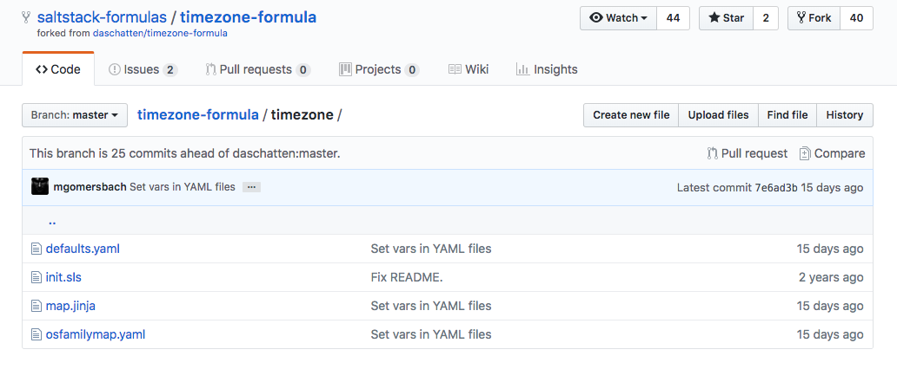
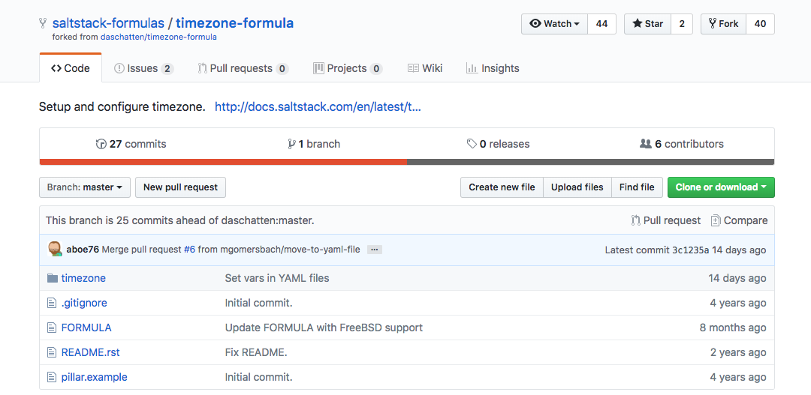
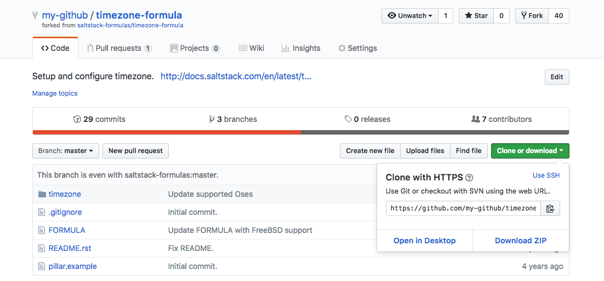
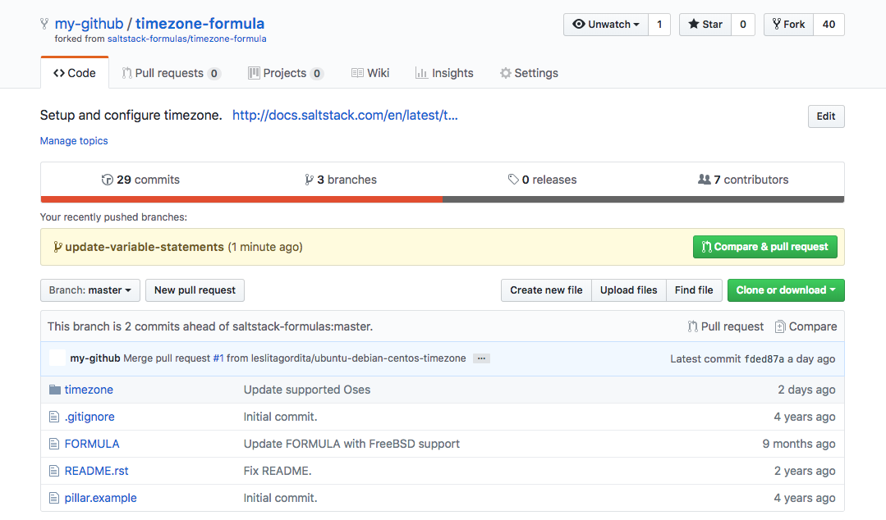
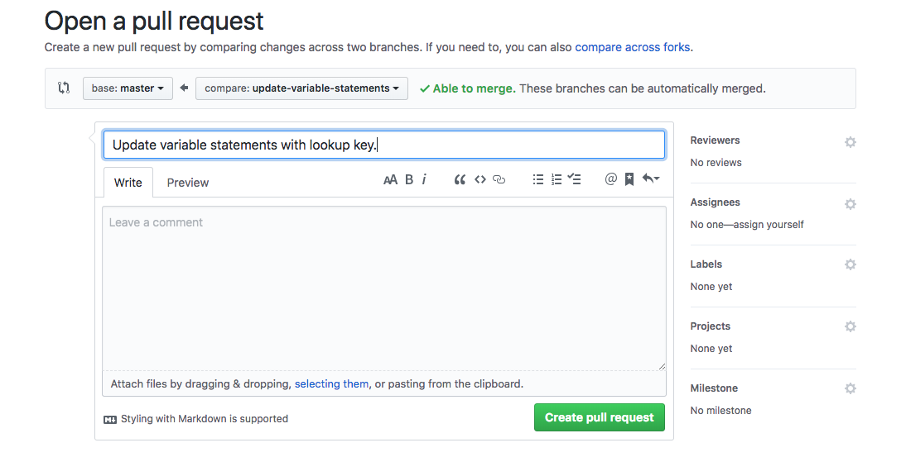
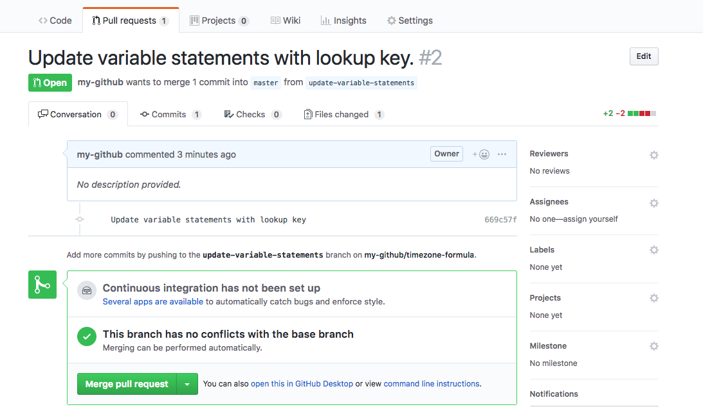

## Salt State Files

The SaltStack Platform is made up of two primary components: A remote execution engine which handles bi-directional communication for any node within your infrastructure (master and minions), and a configuration management system which maintains all infrastructure nodes in a defined state. Salt's configuration management system is known as the *Salt State* system. A Salt state is declared within a *Salt State file* (SLS) using YAML syntax and represents the information Salt needs to configure minions. A Salt Formula is a collection of related SLS files that will achieve a common configuration.

SaltStack's GitHub page contains Salt formulas for commonly needed configurations, like creating and managing SSL/TLS certificates, installing and configuring the Apache HTTP Server, installing and configuring a WordPress site and many other useful formulas. You can easily add any of these pre-written formulas to your own Salt state tree using GitHub.

This guide will use GitHub to fork and modify SaltStack's [timezone formula](https://github.com/saltstack-formulas/timezone-formula) and then use the formula on a Salt master to configure the time zone on two minions.

## Before You Begin

1. If you are new to SaltStack, read [A Beginner's Guide to Salt](/docs/guides/beginners-guide-to-salt/) to familiarize yourself with basic Salt concepts.

1. Download Git on your local computer by following our [How to Install Git on Linux, Mac or Windows](/docs/guides/how-to-install-git-on-linux-mac-and-windows/) guide.

1. Familiarize yourself with Git using our [Getting Started with Git](/docs/guides/how-to-configure-git/) guide.

1.  Make sure you have [configured git](/docs/guides/how-to-configure-git/#configure-git) on your local computer.

1. Use the [Getting Started with Salt - Basic Installation and Setup](/docs/guides/getting-started-with-salt-basic-installation-and-setup/) guide to set up a Salt Master and two Salt minions: one running Ubuntu 18.04 and the second running CentOS 7.

1.  Complete the sections of our [Setting Up and Securing a Compute Instance](/docs/products/compute/compute-instances/guides/set-up-and-secure/) guide to create a standard user account, harden SSH access and remove unnecessary network services.


The steps in this guide require root privileges. Be sure to run the steps below with the `sudo` prefix. For more information on privileges, see our [Users and Groups](/docs/guides/linux-users-and-groups/) guide.


## Overview of the SaltStack Time Zone Formula

In this section, we will take a closer look at SaltStack's `timezone-formula`, which can be used to configure a minion's time zone. A high-level overview of all the formula's state files and Jinja templates will be provided. Salt best practices recommends that formulas should separate the data that a state needs from the state itself to increase the flexibility and reusability of state files. We will observe how this is achieved in the time zone formula.

1.  In your browser, navigate to the `timezone-formula` on [SaltStack's GitHub page](https://github.com/saltstack-formulas/timezone-formula). The `README` file is displayed and contains basic information about the formula. It notes the following details:

    - The purpose of the formula: to configure the time zone.
    - The available states: `timezone`
    - The provided default values: `timezone: 'Europe/Berlin' utc: True`

    The repository's `FORMULA` file includes additional details, including the supported OS families (Debian, RedHat, SUSE, Arch, FreeBSD), a summary, description and release number.

1. Viewing the `timezone-formula`, click on the `timezone` directory to view its contents. You should see the following files:

      

1. Take a look at the contents of the `init.sls` file that defines the timezone state:

    
# This state configures the timezone.





timezone_setting:
  timezone.system:
    - name: {{ timezone }}
    - utc: {{ utc }}

timezone_packages:
  pkg.installed:
    - name: {{ confmap.pkgname }}

timezone_symlink:
  file.symlink:
    - name: {{ confmap.path_localtime }}
    - target: {{ confmap.path_zoneinfo }}{{ timezone }}
    - force: true
    - require:
      - pkg: {{ confmap.pkgname }}
    

    Salt will interpret the name of this file as `timezone`, since any `init.sls` file in a subdirectory is referred to by the path of the directory.

    This state file contains three state declarations, `timezone_setting`, `timezone_packages` and `timezone_symlink`. Below is a description of the configuration each declaration will accomplish on a Salt minion.

  - `timezone.system`: This state uses Salt's [timezone state module](https://docs.saltproject.io/en/latest/ref/states/all/salt.states.timezone.html) to manage the timezone for the minion. The values for `name` and `utc` are derived from the corresponding Salt master's Pillar file. This is accomplished in the two variable assignment at the top of the file: `` and ``.

  - `timezone_packages:` This state ensures that the package needed to configure time zones is installed on the minion. This value is derived from the `confmap` variable that is imported from the `map.jinja` file. The import is declared at the top of the file with the `` import statement. Later in this section, you will inspect the `map.jinja` file.

  - `timezone_symlink`: This state creates a symbolic link from the path defined in `name` to the location defined in `target`. This state will only execute if the `timezone_packages` state is executed successfully. This requirement is denoted by the `require` statement.

1. Next, inspect the `map.jinja` file:

      








      

      The `map.jinja` file allows the formula to abstract static defaults into a dictionary that contains platform specific data. The two main dictionaries are defined in the repository's `timezone/defaults.yaml` and `timezone/osfamilymap.yaml` files. The `defaults.yml` file serves as a base dictionary containing values shared by all OSes, while the `osfamilymap.yml` file stores any values that are different from the base values. Any file throughout the formula could make use of these dictionary values by importing the `map.jinja` file. In addition, any dictionary values can be overridden in a Pillar file. Overidding dictionary values will be discussed in the [Modify Your SaltStack Formula](#modify-your-saltstack-formula) section.

1.  Open the `timezone/defaults.yaml` file and the `timezone/osfamilymap,yaml` file to view the data stored in those files:

      
    path_localtime: /etc/localtime
    path_zoneinfo: /usr/share/zoneinfo/
    pkgname: tzdata
      

      
    Suse:
      pkgname: timezone
    FreeBSD:
      pkgname: zoneinfo
    Gentoo:
      pkgname: sys-libs/timezone-data
      

      The values defined in these YAML files are used in the `init.sls` file.

1.  Open the `pillar.example` file to review its contents:

      
  timezone:
    name: 'Europe/Berlin'
    utc: True
      

    This file provides an example for you to use when creating your own Pillar file on the Salt master. The `init.sls` file uses the values for `name` and `utc` in its `timezone_setting` state declaration. The value for `name` will set the time zone for your minion. The boolean value for `utc` determines whether or not to set the minion's hardware clock to UTC.

    Refer to [tz database time zones](https://en.wikipedia.org/wiki/List_of_tz_database_time_zones) to view a list of all available time zones. Since Pillar files contain sensitive data, you should not version control this file. In the [Create the Pillar](#create-the-pillar) section, you will create a Pillar file directly on your Salt master.

    Now that you understand the structure of the SaltStack time zone formula, in the next section you will fork the formula's repository on GitHub  and clone the forked formula to your local computer.

## Fork and Clone the SaltStack TimeZone Formula

In this section you will fork the `timezone-formula` from the official SaltStack GitHub page to your GitHub account and clone it to a local repository.

1. In your browser, navigate to the `timezone-formula` on [SaltStack's GitHub page](https://github.com/saltstack-formulas/timezone-formula). If you have not yet logged into your GitHub account, click on the **Sign in** link at the top of the page and log in.

1. Fork the timezone-formula from the SaltStack formula's GitHub page:

      

      Once the formula has been forked, you will be redirected to your GitHub account's own fork of the timezone formula.

1. Viewing your fork of the timezone formula, click on the **Clone or download** button and copy the URL:

      

1. On your local computer, clone the timezone formula:

        git clone https://github.com/my-github/timezone-formula.git

1. Move into the `timezone-formula` directory:

        cd timezone-formula

1. Display the contents of the `timezone-formula` directory:

        ls

      You should see the following output:

      
      FORMULA        README.rst     pillar.example timezone
      

1. When you clone a repository, Git will automatically set the `origin` remote to the location of the forked repository. Verify the configured remotes for your `timezone-formula` repository:

        git remote -v

      Your output should be similar to what is displayed below, however, it will point to your own fork of the `timezone-formula` repository:

      
  origin	https://github.com/my-github/timezone-formula.git (fetch)
  origin	https://github.com/my-github/timezone-formula.git (push)
      

     You can add the official SaltStack timezone formula as the `upstream` remote, so you can easily pull any changes made to the formula by the repository's maintainers or contribute back to the project. This step is not required.

        git remote add upstream https://github.com/saltstack-formulas/timezone-formula

      You now have a local copy of your forked `timezone-formula`. In the next section, you will modify the formula to update the `init.sls` file.

## Modify Your SaltStack Formula

In this section, you will modify the time zone formula to improve how the formula follows Salt best practices related to lookup dictionaries. You can similarly modify any SaltStack formula for your infrastructure's specific requirements, if needed.

As discussed in the [Overview of the SaltStack Time Zone Formula](#overview) section, the `timezone/defaults.yaml` file and the `timezone/osfamily.map` file provide dictionaries of values that are used by the `init.sls` state. These YAML file dictionary values can be overridden in a Pillar file that also stores any sensitive data needed by the `init.sls` state.

When structuring Pillar data, Salt's official documentation states that it is a best practice to make formulas expect all formula-related parameters to be placed under a second-level `lookup` key.  Currently, the `init.sls` file's `timezone` and `utc` variables expect the Pillar data to be structured differently. You will update these two variable statements to expect a second-level `lookup` key.

1. Create a new branch in your local repository to begin modifying the timezone-formula:

        git checkout -b update-variable-statements

1. Open the `init.sls` file in a text editor and modify its `timezone` and `utc` variable statements to match the example file:

      
# This state configures the timezone.





timezone_setting:
  timezone.system:
    - name: {{ timezone }}
    - utc: {{ utc }}

timezone_packages:
  pkg.installed:
    - name: {{ confmap.pkgname }}

timezone_symlink:
  file.symlink:
    - name: {{ confmap.path_localtime }}
    - target: {{ confmap.path_zoneinfo }}{{ timezone }}
    - force: true
    - require:
      - pkg: {{ confmap.pkgname }}
      

    The `init.sls` file now expects a second-level lookup key when retrieving the specified Pillar values. Following this convention will make it easier to override dictionary values in your Pillar file. You will create a Pillar file in the [Installing a Salt Formula](#installing-a-salt-formula) section of this guide.

1. Use Git to view which files have been changed before staging them:

        git status

      Your output should resemble the following:

    
On branch update-variable-statements
Changes not staged for commit:
  &nbsp&nbsp(use "git add &ltfile&gt..." to update what will be committed)
  &nbsp&nbsp(use "git checkout -- &ltfile&gt..." to discard changes in working directory)

  &nbsp&nbspmodified:   timezone/init.sls

no changes added to commit (use "git add" and/or "git commit -a")
    

1. Stage and commit the changes you made to the `init.sls` file.

        git add -A
        git commit -m 'My commit message'

1. Push your changes to your fork:

        git push origin update-variable-statements

1. Navigate to your timezone formula's remote GitHub repository and create a pull request against your fork's `master` branch.

    

    Make sure you select your own fork of the time zone formula as the `base fork`, otherwise you will submit a pull request against the official SaltStack timezone formula's repository, which is not the intended behavior for this example.

      

    If you are satisfied with the changes in the pull request, merge the pull request into your `master` branch.

      

   In the next section, you will add your forked `timezone-formula` to your Salt master, create a Pillar file for the `timezone-formula` and apply the changes to your minions.

## Install a Salt Formula

There are two ways to use a Salt Formula: you can add the formula as a GitFS Remote, which will allow you to directly serve the files hosted on your GitHub account, or you can add the formula directly to the Salt master using Git's clone mechanism. This section will cover both ways to use Salt formulas.

### Manually Add a Salt Formula to your Master

1. Navigate to your fork of the timezone-formula, click on the **Clone or download** button and copy the repository's URL to your clipboard.

1. SSH into your Salt master. Replace the `username` with your limited user account and replace `198.51.100.0` with your Linode's IP address:

        ssh username@198.51.100.0

1. Create a formulas directory and go to the new directory:

        mkdir -p /srv/formulas
        cd /srv/formulas

1. If your Salt master does not already have Git installed, install Git using your system's package manager:

    **Ubuntu/Debian**

        apt-get update
        apt-get install git

    **Centos**

        yum update
        yum install git

1. Clone the repository into the `/srv/formulas` directory. Make sure you replace `git-username` with your own username:

        git clone https://github.com/git-username/timezone-formula.git

### Add a Salt Formula as a GitFS Remote

GitFs allows Salt to serve files directly from remote git repositories. This is a convenient way to use Salt formulas with the added flexibility and power that remote version control systems provide, like collaboration and easy rollback to previous versions of your formulas.

1. On the Salt master, install the Python interface to Git:

        sudo apt-get install python-git

1. Edit the Salt master configuration file to use GitFs as a fileserver backend. Make sure the lines listed below are uncommented in your master configuration file:

      
fileserver_backend:
  - gitfs
  - roots


    When using multiple backends, you should list all backends in the order you want them to be searched. `roots` is the fileserver backend used to serve files from any of the master's directories listed in the `file_roots` configuration.

1. In the same Salt master configuration file, add the location of your timezone formula's GitHub repository. Ensure you have uncommented `gitfs_remote`:

      
gitfs_remotes:
  - https://github.com/git-username/timezone-formula.git


1. Uncomment the gitfs_provider declaration and set its value to gitpython:

    
gitfs_provider: gitpython


1. Restart the Salt master to apply the new configurations:

        sudo systemctl restart salt-master

### Add a Salt Formula to the Top File

To include your timezone formula in your Salt state tree, you must add it to your top file.

1.  Create the `/srv/salt` directory if it does not already exist:

        mkdir /srv/salt

2. Add the `timezone` state declared in the `timezone-formula` to your top file:

    
base:
  '*':
    - timezone
    

    The example Top file declares one environment, the `base` environment that targets all minions and applies the `timezone` state to them. This top file could easily contain several states that already exist in your state tree, like an `apache` state, a `wordpress` state, etc., and several environments that target different minions. Any Salt formula can be easily dropped-in to the top file and will be applied to the targeted minions the next time you run a highstate.

### Create the Pillar

1. Create a directory to store your formula's Pillar file:

        mkdir -p /srv/pillar

1. Create a Pillar file to store the data that will be used by your timezone formula:

    
timezone:
  lookup:
    
    name: America/New_York
    
    name: 'Europe/Berlin'
    
    utc: True
    

    The `timezone.sls` Pillar file was created from the `pillar.example` file provided in the SaltStack timezone formula. The example was modified to add Jinja control statements that will assign a different timezone on any minion that is a Debian family OS. You can replace any of the timezone `name` values to your preferred timezone or add additional Jinja logic, if necessary. For an introduction to Jinja, read the [Introduction to Jinja Templates for Salt](/docs/guides/introduction-to-jinja-templates-for-salt/).

    You can also override any of the dictionary values defined in the `timezone/defaults.yaml` or `timezone/osfamilymap.yaml` in the Pillar file using Salt's lookup dictionary convention. For example, if you wanted to override the `pkgname` value defined in `timezone/defaults.yaml` your Pillar file might look like the following example:

    
timezone:
  lookup:
    
    name: America/New_York
    
    name: 'Europe/Berlin'
    
    utc: True
    pkgname: timezone
    

1. If you cloned the timezone-formula to your master instead of adding the formula as a GitFS remote, add the timezone-formula's directory to the Salt master's `file_roots` configuration:

    
file_roots:
  base:
    - /srv/salt/
    - /srv/formulas/timezone-formula
    

1. Add the Pillar to the Pillar's top file:

    
base:
  '*':
    - timezone
    

1. Configure the location of the Pillar file:

    
pillar_roots:
  base:
    - /srv/pillar
    

1. Restart the Salt master for the new configurations to take effect on the Salt master:

        sudo systemctl restart salt-master

1. Run a highstate to your minion to apply the state defined in the timezone formula:

        sudo salt '*' state.apply

## Next Steps

To learn how to create your own Salt formulas and how to organize your formula's states in a logical and modular way, read our [Automate Static Site Deployments with Salt, Git, and Webhooks](/docs//applications/configuration-management/automate-a-static-site-deployment-with-salt/#initialize-the-salt-minion-s-formula) guide.
