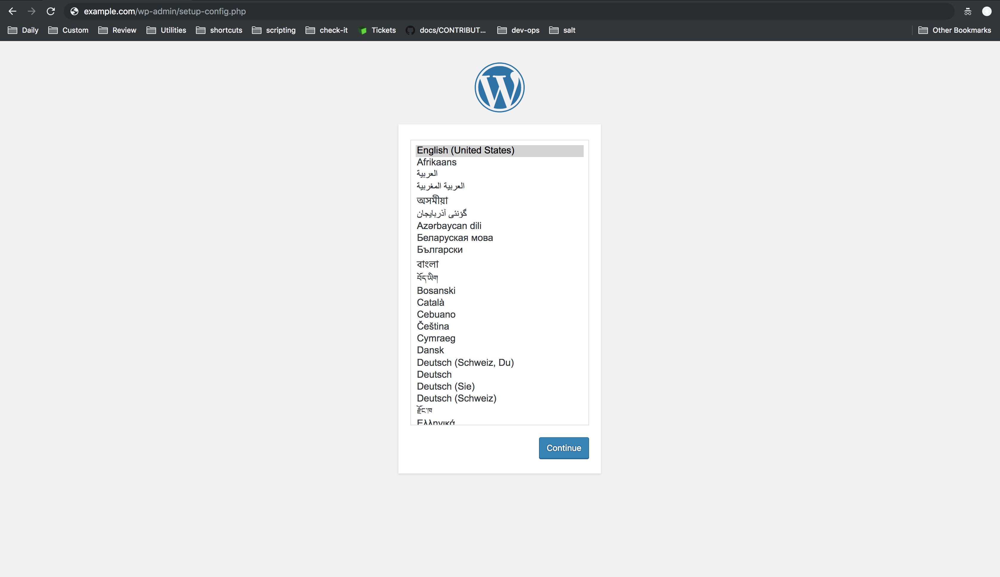

Linode's Terraform provider supports [StackScripts](/docs/platform/stackscripts/). StackScripts allow you to automate the deployment of custom software on top of Linode's default Linux images, or on any of your [saved custom images](/docs/products/tools/images/). You can create your own StackScripts, use a StackScript created by Linode, or use a Community StackScript.

In this guide you will learn how to use a Community StackScript to deploy WordPress on a Linode using Terraform.


Following this guide will result in the creation of billable Linode resources on your account. To prevent continued billing for these resources, remove them when you have completed the guide.


## Before You Begin

1.  Install Terraform on your computer by following the *Install Terraform* section of our [Use Terraform to Provision Linode Environments](/docs/applications/configuration-management/how-to-build-your-infrastructure-using-terraform-and-linode/#install-terraform) guide.

    
[Terraform’s Linode Provider](https://github.com/terraform-providers/terraform-provider-linode) has been updated and now requires Terraform version 0.12+.  To learn how to safely upgrade to Terraform version 0.12+, see [Terraform’s official documentation](https://www.terraform.io/upgrade-guides/0-12.html). View [Terraform v0.12’s changelog](https://github.com/hashicorp/terraform/blob/v0.12.0/CHANGELOG.md) for a full list of new features and version incompatibility notes.
    

1.  Terraform requires an API access token. Follow the [Getting Started with the Linode API](/docs/platform/api/getting-started-with-the-linode-api-new-manager/#get-an-access-token) guide to obtain one.

1.  If you have not already, [assign Linode's name servers](/docs/guides/dns-manager/#use-linodes-name-servers-with-your-domain) to your domain at your domain name's registrar.

1.  Browse the existing [StackScripts Library](https://www.linode.com/stackscripts/) to familiarize yourself with common tasks you can complete with existing StackScripts.

## Create a Terraform Configuration

Terraform defines the elements of your Linode infrastructure inside of configuration files. Terraform refers to these infrastructure elements as *resources*. Once you declare your Terraform configuration, you then *apply* it, which results in the creation of those resources on the Linode platform.

### Create the Terraform Configuration File

1. Ensure that you are in the `terraform` directory.

        cd ~/terraform

1. Using your preferred text editor, create a Terraform configuration file named `main.tf` to hold your resource definitions:

      
terraform {
  required_providers {
    linode = {
      source = "linode/linode"
      version = "1.26.0"
    }
  }
}
provider "linode" {
    token = var.token
}

resource "linode_sshkey" "my_wordpress_linode_ssh_key" {
    label = "my_ssh_key"
    ssh_key = chomp(file("~/.ssh/id_rsa.pub"))
}

resource "random_string" "my_wordpress_linode_root_password" {
    length  = 32
    special = true
}

resource "linode_instance" "my_wordpress_linode" {
    image = var.image
    label = var.label
    region = var.region
    type = var.type
    authorized_keys = [ linode_sshkey.my_wordpress_linode_ssh_key.ssh_key ]
    root_pass = random_string.my_wordpress_linode_root_password.result
    stackscript_id = var.stackscript_id
    stackscript_data = {
       "ssuser" = var.stackscript_data["ssuser"]
       "hostname" = var.stackscript_data["hostname"]
       "website" = var.stackscript_data["website"]
       "dbuser" = var.stackscript_data["dbuser"]
       "db_password" = var.stackscript_data["db_password"]
terraform {
  required_providers {
    linode = {
      source = "linode/linode"
      version = "1.26.0"
    }
  }
}
provider "linode" {
    token = var.token
}

resource "linode_sshkey" "my_wordpress_linode_ssh_key" {
    label = "my_ssh_key"
    ssh_key = chomp(file("~/.ssh/id_rsa.pub"))
}

resource "random_string" "my_wordpress_linode_root_password" {
    length  = 32
    special = true
}

resource "linode_instance" "my_wordpress_linode" {
    image = var.image
    label = var.label
    region = var.region
    type = var.type
    authorized_keys = [ linode_sshkey.my_wordpress_linode_ssh_key.ssh_key ]
    root_pass = random_string.my_wordpress_linode_root_password.result
    stackscript_id = var.stackscript_id
    stackscript_data = {
       "ssuser" = var.stackscript_data["ssuser"]
       "hostname" = var.stackscript_data["hostname"]
       "website" = var.stackscript_data["website"]
       "dbuser" = var.stackscript_data["dbuser"]
       "db_password" = var.stackscript_data["db_password"]
       "sspassword" = var.stackscript_data["sspassword"]
       "dbuser_password" = var.stackscript_data["dbuser_password"]
    }
}

resource "linode_domain" "my_wordpress_domain" {
    domain = var.domain
    soa_email = var.soa_email
    type = "master"
 }

resource "linode_domain_record" "my_wordpress_domain_www_record" {
    domain_id = "${linode_domain.my_wordpress_domain.id}"
    name = "www"
    record_type = var.a_record
    target =  "${linode_instance.my_wordpress_linode.ip_address}"
}

resource "linode_domain_record" "my_wordpress_domain_apex_record" {
    domain_id = "${linode_domain.my_wordpress_domain.id}"
    name = ""
    record_type = var.a_record
    target = "${linode_instance.my_wordpress_linode.ip_address}"
}


    The Terraform configuration file uses an [interpolation syntax](https://www.terraform.io/docs/configuration/interpolation.html) to reference Terraform [*input variables*](https://learn.hashicorp.com/terraform/getting-started/variables.html), call Terraform's [built-in functions](https://www.terraform.io/docs/configuration/interpolation.html#built-in-functions), and reference attributes of other resources.

    Variables and their values will be created in separate files later on in this guide. Using separate files for variable declaration allows you to avoid hard-coding values into your resources. This strategy can help you reuse, share, and version control your Terraform configurations.

### Examining the Terraform Configuration

Let's take a closer look at each block in the configuration file:

1.  The first stanza declares Linode as the [Terraform provider](https://www.terraform.io/docs/providers/) that will manage the life cycle of any resources declared throughout the configuration file. The Linode provider requires your Linode APIv4 token for authentication:

    
provider "linode" {
    token = var.token
}


1.  The next resource configures an SSH Key that will be uploaded to your Linode instance later in the configuration file:

    
resource "linode_sshkey" "my_wordpress_linode_ssh_key" {
    label = "my_ssh_key"
    ssh_key = chomp(file("~/.ssh/id_rsa.pub"))
}


    `ssh_key = chomp(file("~/.ssh/id_rsa.pub"))` uses Terraform's built-in `file()` function to provide a local file path to the public SSH key's location. The `chomp()` built-in function removes trailing new lines from the SSH key.

    
If you do not already have SSH keys, follow the steps in the *Create an Authentication Key-pair* section of the [Securing Your Server Guide](/docs/guides/set-up-and-secure/#create-an-authentication-key-pair).


1.  The `random_string` resource can be used to create a random string of 32 characters. The `linode_instance` resource will use it to create a root user password:

    
resource "random_string" "my_wordpress_linode_root_password" {
    length  = 32
    special = true
}


1.  The `linode_instance` resource creates a Linode with the declared configurations:

    
resource "linode_instance" "my_wordpress_linode" {
    image = var.image
    label = var.label
    region = var.region
    type = var.type
    authorized_keys = [ linode_sshkey.my_wordpress_linode_ssh_key.ssh_key ]
    root_pass = random_string.my_wordpress_linode_root_password.result
    stackscript_id = var.stackscript_id
    stackscript_data = {
       "ssuser" = var.stackscript_data["ssuser"]
       "hostname" = var.stackscript_data["hostname"]
       "website" = var.stackscript_data["website"]
       "dbuser" = var.stackscript_data["dbuser"]
       "db_password" = var.stackscript_data["db_password"]
       "sspassword" = var.stackscript_data["sspassword"]
       "dbuser_password" = var.stackscript_data["dbuser_password"]
    }
}


    -   The `authorized_keys` argument uses the SSH public key provided by the `linode_sshkey` resource in the previous stanza. This argument expects a value of type `list`, so the value must be wrapped in brackets.

    -   The `root_pass` argument is assigned to the value of the `random_string` resource previously declared.

    -   To use an existing StackScript you must use the `stackscript_id` argument and provide a valid ID as a value. Every StackScript is assigned a unique ID upon creation. This guide uses the [WordPress on Ubuntu 20.04](https://cloud.linode.com/stackscripts/998743) StackScript adapted by the Linode user [hmorris](https://cloud.linode.com/stackscripts/community?query=username%3Ahmorris). This StackScript's ID will be assigned to a Terraform variable later in this guide.

        StackScripts support user defined data. A StackScript can use the [`UDF` tag](/docs/platform/stackscripts/#variables-and-udfs) to create a variable whose value must be provided by the user of the script. This allows users to customize the behavior of a StackScript on a per-deployment basis. Any required `UDF` variable can be defined using the `stackscript_data` argument.

        The StackScript will be responsible for installing WordPress on your Linode, along with all other requirements, like installing and configuring the Apache Web Server, configuring the Virtual Hosts file, and installing MySQL.

    -   Other arguments are given values by the Terraform variables that will be declared later in this guide.

1.  In order to complete your WordPress site's configuration, you need to create a domain and corresponding domain records for your site. The `linode_domain` and `linode_domain_record` resources handle these configurations:

    
resource "linode_domain" "my_wordpress_domain" {
    domain = var.domain
    soa_email = var.soa_email
    type = "master"
 }

resource "linode_domain_record" "my_wordpress_domain_www_record" {
    domain_id = "${linode_domain.my_wordpress_domain.id}"
    name = "www"
    record_type = var.a_record
    target =  "${linode_instance.my_wordpress_linode.ip_address}"
}

resource "linode_domain_record" "my_wordpress_domain_apex_record" {
    domain_id = "${linode_domain.my_wordpress_domain.id}"
    name = ""
    record_type = var.a_record
    target = "${linode_instance.my_wordpress_linode.ip_address}"
}


    
If you are not familiar with the Domain Name System (DNS), review the [DNS Records: An Introduction](/docs/guides/dns-records-an-introduction/) guide.


    The `linode_domain` resource creates a [domain zone](/docs/guides/dns-manager/#create-and-manage-domains) for your domain.

    Each `linode_domain_record` resource retrieves the `linode_domain` resource's ID and assigns it to that record's `domain_id` argument. Each record's `target` argument retrieves the IP address from the Linode instance. Every `linode_instance` resource exposes [several attributes](https://www.terraform.io/docs/providers/linode/r/instance.html#attributes), including a Linode's IPv4 address.

### Define the Input Variables

In the `terraform` directory, create a file named `variables.tf`. This will define all the variables that were used in the `main.tf` file in the previous section. The values for these variables (aside from their default values) will be assigned in another file:


variable "token" {
  description = "Linode API Personal Access Token"
}

variable "image" {
  description = "Image to use for Linode instance"
  default = "linode/ubuntu20.04"
}

variable "label" {
  description = "The Linode's label is for display purposes only."
  default = "default-linode"
}

variable "region" {
  description = "The region where your Linode will be located."
  default = "us-east"
}

variable "type" {
  description = "Your Linode's plan type."
  default = "g6-standard-1"
}

variable "stackscript_id" {
  description = "Stackscript ID"
}

variable "stackscript_data" {
  description = "Map of required StackScript UDF data."
  type = "map"
}

variable "domain" {
  description = "The domain this domain represents."
}

variable "soa_email" {
  description = "Start of Authority email address. This is required for master domains."
}

variable "a_record" {
  description = "The type of DNS record. For example, `A` records associate a domain name with an IPv4 address."
  default = "A"
}
    


It is recommended to include a `description` attribute for each input variable to help document your configuration's usage. This will make it easier for anyone else to use this Terraform configuration.


Every variable can contain a `default` value. The `default` value is only used if no other value is provided. You can also declare a `type` for each variable. If no type is provided, the variable will default to `type = "string"`.

The `stackscript_data` variable is of type `map`. This will allow you to provide values for as many `UDF` variables as your StackScript requires.

### Assign Values to the Input Variables

Terraform allows you to assign variables in many ways. For example, you can assign a variable value via the command line when running `terraform apply`. In order to persist variable values, you can also create files to hold all your values.


There are several other options available for secrets management with Terraform. For more information on this, see [Secrets Management with Terraform](/docs/guides/secrets-management-with-terraform/).


Terraform will automatically load any file named `terraform.tfvars` and use its contents to populate variables. However, you should separate out any sensitive values, like passwords and tokens, into their own file. Keep this sensitive file out of version control.

1. Create a file named `terraform.tfvars` in your `terraform` directory to hold all non-sensitive values:

    
label = "wp-linode"
stackscript_id = "998743"
domain = "example.com"
soa_email = "user@email.com"


1. Create a file name `secrets.tfvars` in your `terraform` directory to hold any sensitive values:

    
token = "my-linode-api4-token"
stackscript_data = {
  "ssuser" = "username"
  "hostname" = "wordpress"
  "website" = "example.com"
  "dbuser" = "wpuser"
  "sspassword" = "my-secure-password"
  "db_password" = "another-secure-password"
  "dbuser_password" = "a-third-secure-password"
}

    
In Terraform 0.12, variables with map and object values will use the last value found and override previous values. This is different from previous versions of Terraform, which would merge map values instead of overriding them. For this reason the `stackscript_data` map and its values are defined in a single variable definitions file.
    

    
It is helpful to reference Terraform's [Linode provider](https://www.terraform.io/docs/providers/linode/) documentation and the [Linode APIv4 documentation](https://developers.linode.com/api/v4) for assistance in determining appropriate values for Linode resources.


1.  Replace the following values in your new `.tfvars` files:

    -   `token` should be replaced with your own Linode account's APIv4 token.

    -   For security purposes, the StackScript will create a limited Linux user on your Linode. `ssuser` should be replaced with your desired username for this user.

    -   `sspassword`, `db_password`, and `dbuser_password` should be replaced with secure passwords of your own.

    -   `domain` should be replaced with your WordPress site's domain address.

    -  `soa_email` should be the email address you would like to use for your [Start of Authority](/docs/guides/dns-records-an-introduction/#soa) email address.

## Initialize, Plan, and Apply the Terraform Configuration

Your Terraform configuration has been recorded, but you have not told Terraform to create the resources yet. To do this, you will invoke commands from Terraform's CLI.

### Initialize

Whenever a new provider is used in a Terraform configuration, it must be initialized before you can create resources with it. The initialization process downloads and installs the provider's plugin and performs any other steps needed to prepare for its use.

Navigate to your `terraform` directory in your terminal and run:

    terraform init

You will see a message that confirms that the Linode provider plugins have been successfully initialized.

### Plan

It can be useful to view your configuration's execution plan before actually committing those changes to your infrastructure. Terraform includes a `plan` command for this purpose. Run this command from the `terraform` directory:

    terraform plan \
    -var-file="secrets.tfvars" \
    -var-file="terraform.tfvars"

`plan` won’t take any actions or make any changes on your Linode account. Instead, an analysis is done to determine which actions (i.e. Linode resource creations, deletions, or modifications) are required to achieve the state described in your configuration.

### Apply

You are now ready to create the infrastructure defined in your `main.tf` configuration file:

1.  Run Terraform's `apply` command from the `terraform` directory:

        terraform apply \
        -var-file="secrets.tfvars" \
        -var-file="terraform.tfvars"

    Since you are using multiple variable value files, you must include each file individually using the `var-file` argument. You will be prompted to confirm the `apply` action. Type *yes* and press **enter**.

2.  Terraform will begin to create the resources you've defined throughout this guide. This process will take several minutes to complete. Once the infrastructure has been successfully built you will see a similar output:

    
Apply complete! Resources: 6 added, 0 changed, 0 destroyed.


3.  Navigate to your WordPress site's domain and verify that the site loads. You may have to wait a few minutes more after the `terraform apply` command returns, as the StackScript takes time to install WordPress. Additionally, it make take some time for your domain name changes to propagate:

    

4.  Complete the remaining WordPress configuration steps provided by the prompts.

## (Optional) Destroy the Linode Resources

If you do not want to keep using the resources created by Terraform in this guide, run the `destroy` command from the `terraform` directory:

    terraform destroy \
    -var-file="secrets.tfvars" \
    -var-file="terraform.tfvars"

Terraform will prompt you to confirm this action. Enter *yes* to proceed.
