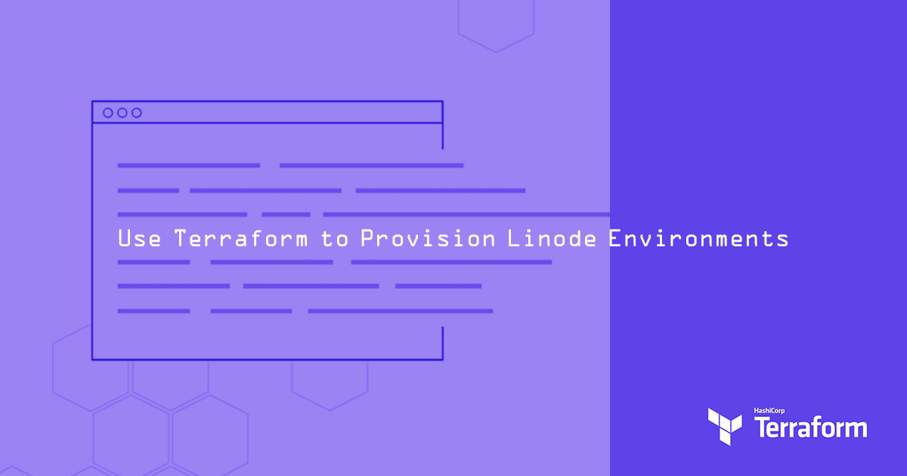

Infrastructure as code (IaC) is a development and operations methodology that allows server deployments and software configuration to be represented as code. This methodology reduces the chance for human error, makes complex systems more manageable, eases collaboration on systems engineering projects, and offers a number of other benefits.

Terraform is an IaC tool that focuses on creating, modifying, and destroying servers, instead of managing the software on those servers. Terraform offers plugins to interface with different hosting providers, and an [official Linode plugin](https://www.terraform.io/docs/providers/linode/index.html) is available. This guide show you how to get started with Terraform and Linode.

Linodes created with Terraform can be further configured with container systems like Docker, or with configuration management software like Salt, Puppet, Ansible, or Chef.


The configurations and commands used in this guide results in multiple Linodes being added to your account. Be sure to monitor your account closely in the Linode Manager to avoid unwanted charges.


## Before You Begin

-   This guide shows you how to install and use the Terraform client software from a Linux system. Terraform can be installed on other operating systems, and the instructions for those platforms are analogous to the commands presented in this guide.

    
When following this guide, your Linux user may need sudo privileges in order to install supplementary software packages.


-   You need a personal access token for Linode's [v4 API](/docs/api/) to use with Terraform. Follow the [Getting Started with the Linode API](/docs/guides/getting-started-with-the-linode-api/#get-an-access-token) to get a token.

    
Any Personal Access Tokens generated from the previous Linode Manager are API v3 tokens and do not work with Terraform's Linode provider.


## Install Terraform

The installation steps in this section are for Linux operating systems. To install Terraform on a different operating system, like macOS, see [Terraform's downloads](https://www.terraform.io/downloads.html) page. Once installed, skip to [Building with the Terraform Provider](#building-with-the-linode-provider).


The Terraform Provider for Linode requires [Terraform version 1.1+](https://www.hashicorp.com/blog/terraform-1-1-improves-refactoring-and-the-cloud-cli-experience). The examples in this guide were written to be compatible with [Terraform version 1.1](https://www.terraform.io/docs/configuration-0-11/terraform.html) and may be updated in the near future.


1.  Make a Terraform project directory in your home directory and then navigate to it:

        mkdir ~/terraform
        cd ~/terraform

2.  Download the following files from [Terraform's website](https://www.terraform.io/downloads.html), ensuring that the latest version available is being installed. Example `wget` commands are listed using the latest version available at time of publishing (1.1.9). You should inspect the links on the download page to see if a newer version is available and update the `wget` commands to use those URLs instead:

    -   The 64-bit Linux `.zip` archive

            wget https://releases.hashicorp.com/terraform/1.1.9/terraform_1.1.9_linux_amd64.zip

    -   The SHA256 checksums file

            wget https://releases.hashicorp.com/terraform/1.1.9/terraform_1.1.9_SHA256SUMS

    -   The checksum signature file

            wget https://releases.hashicorp.com/terraform/1.1.9/terraform_1.1.9_SHA256SUMS.sig

### Verify the Download

1.  Import the HashiCorp Security GPG key (listed on the [HashiCorp Security](https://www.hashicorp.com/security) page under *Secure Communications*):

        gpg --recv-keys 34365D9472D7468F

    The output should show that the key was imported:

    
gpg: /home/user/.gnupg/trustdb.gpg: trustdb created
gpg: key 34365D9472D7468F: public key "HashiCorp Security <security@hashicorp.com>" imported
gpg: no ultimately trusted keys found
gpg: Total number processed: 1
gpg:               imported: 1


    
If you receive errors that indicate the `dirmngr` software is missing or inaccessible, install `dirmngr` using your package manager and run the GPG command again.


1.  Verify the checksum file's GPG signature:

        gpg --verify terraform*.sig terraform*SHA256SUMS

    The output should contain the `Good signature from "HashiCorp Security <security@hashicorp.com>"` confirmation message:

    
gpg: Signature made Wed 15 Aug 2018 10:07:05 PM UTC
gpg:                using RSA key 34365D9472D7468F
gpg: Good signature from "HashiCorp Security <security@hashicorp.com>" [unknown]
gpg: WARNING: This key is not certified with a trusted signature!
gpg:          There is no indication that the signature belongs to the owner.
Primary key fingerprint: C874 011F 0AB4 0511 0D02 1055 3436 5D94 72D7 468F


1.  Verify that the fingerprint output matches the fingerprint listed in the *Secure Communications* section of the [HashiCorp Security](https://www.hashicorp.com/security.html) page.

1.  Verify the `.zip` archive's checksum:

        sha256sum -c terraform*SHA256SUMS 2>&1 | grep OK

    The output should show the file's name as given in the `terraform*SHA256SUMS` file:

    
terraform_1.1.9_linux_amd64.zip: OK


### Configure the Terraform Environment

1.  Unzip `terraform_*_linux_amd64.zip` to your `~/terraform` directory:

        unzip terraform_*_linux_amd64.zip

    
If you receive an error that indicates `unzip` is missing from your system, install the `unzip` package and try again.


1.  Edit your `~./profile` to include the `~/terraform` directory in your PATH. Then, reload the Bash profile:

        echo 'export PATH="$PATH:$HOME/terraform"' >> ~/.profile
        source ~/.profile

1.  Verify Terraform can run by simply calling it with no options or arguments:

        terraform

    
Usage: terraform [-version] [-help] <command> [args]

The available commands for execution are listed below. The most common, useful commands are shown first, followed by less common or more advanced commands. If you're just getting started with Terraform, stick with the common commands. For the other commands, please read the help and docs before usage.

Common commands:
    apply              Builds or changes infrastructure
    console            Interactive console for Terraform interpolations
    destroy            Destroy Terraform-managed infrastructure
    env                Workspace management
    fmt                Rewrites config files to canonical format
    get                Download and install modules for the configuration
    graph              Create a visual graph of Terraform resources
    import             Import existing infrastructure into Terraform
    init               Initialize a Terraform working directory
    output             Read an output from a state file
    plan               Generate and show an execution plan
    providers          Prints a tree of the providers used in the configuration
    push               Upload this Terraform module to Atlas to run
    refresh            Update local state file against real resources
    show               Inspect Terraform state or plan
    taint              Manually mark a resource for recreation
    untaint            Manually unmark a resource as tainted
    validate           Validates the Terraform files
    version            Prints the Terraform version
    workspace          Workspace management

All other commands:
    debug              Debug output management (experimental)
    force-unlock       Manually unlock the terraform state
    state              Advanced state management


## Building with the Linode Provider

Terraform uses a declarative approach in which configuration files specify the desired end-state of the infrastructure, so the examples in this guide will simply list the Linodes that we want to create. Terraform can understand two types of configuration files: JSON, and [HashiCorp Configuration Language](https://github.com/hashicorp/hcl) (HCL). This guide uses the HCL format, and HCL files end in the `.tf` extension.

1.  Create the file `linode-terraform-web.tf` in your `~/terraform` directory with the snippet below. Fill in your Linode API token, public SSH key, and desired root password where indicated. Additionally, replace the Linode provider `version` to the [latest](https://registry.terraform.io/providers/linode/linode/):

    
terraform {
  required_providers {
    linode = {
      source = "linode/linode"
      version = "1.27.1"
    }
  }
}

provider "linode" {
  token = "YOUR_LINODE_API_TOKEN"
}

resource "linode_instance" "terraform-web" {
        image = "linode/ubuntu18.04"
        label = "Terraform-Web-Example"
        group = "Terraform"
        region = "us-east"
        type = "g6-standard-1"
        authorized_keys = [ "YOUR_PUBLIC_SSH_KEY" ]
        root_pass = "YOUR_ROOT_PASSWORD"
}


    This snippet creates a Linode 2GB labelled `Terraform-Web-Example` in a `Terraform` Linodes group. While the server's software won't be configured in this guide, we can imagine for now that the Linode acts as a webserver.

    
See [Terraform's documentation](https://www.terraform.io/docs/configuration/syntax.html) for more information on configuration syntax and any updates to the Linode provider.


1.  Initialize the Terraform configuration:

        terraform init

    Terraform confirms successful initialization:

    
Initializing provider plugins...
- Checking for available provider plugins on https://releases.hashicorp.com...
- Downloading plugin for provider "linode" (1.0.0)...

The following providers do not have any version constraints in configuration,
so the latest version was installed.

To prevent automatic upgrades to new major versions that may contain breaking
changes, it is recommended to add version = "..." constraints to the
corresponding provider blocks in configuration, with the constraint strings
suggested below.

* provider.linode: version = "~> 1.0"
Terraform has been successfully initialized!


    
If an error occurs, run the command again in debug mode:

    TF_LOG=debug terraform init


1.  Run Terraform's [plan](https://www.terraform.io/docs/commands/plan.html) command:

        terraform plan

    
Refreshing Terraform state in-memory prior to plan...
The refreshed state will be used to calculate this plan, but will not be
persisted to local or remote state storage.

------------------------------------------------------------------------

An execution plan has been generated and is shown below.
Resource actions are indicated with the following symbols:
  + create

Terraform will perform the following actions:

  + linode_instance.terraform-web
      id:                 <computed>
      alerts.#:           <computed>
      authorized_keys.#:  "1"
      authorized_keys.0:  "ssh-rsa ..."
      backups.#:          <computed>
      backups_enabled:    <computed>
      boot_config_label:  <computed>
      group:              "Terraform"
      image:              "linode/ubuntu18.04"
      ip_address:         <computed>
      ipv4.#:             <computed>
      ipv6:               <computed>
      label:              "web"
      private_ip_address: <computed>
      region:             "us-east"
      root_pass:          <sensitive>
      specs.#:            <computed>
      status:             <computed>
      swap_size:          <computed>
      type:               "g6-standard-1"
      watchdog_enabled:   "true"

Plan: 1 to add, 0 to change, 0 to destroy.

------------------------------------------------------------------------

Note: You didn't specify an "-out" parameter to save this plan, so Terraform
can't guarantee that exactly these actions will be performed if
"terraform apply" is subsequently run.


    `terraform plan` won't take any action or make any changes on your Linode account. Instead, an analysis is done to determine which actions (i.e. Linode instance creations, deletions, or modifications) are required to achieve the state described in your configuration.

    
Debug mode can be applied to the plan command if you need to perform troubleshooting:

    TF_LOG=debug terraform plan


1.  If there are no errors, start the deployment:

        terraform apply

    You are asked to confirm the action. Enter `yes` and press **Enter**:

    
Do you want to perform these actions?
  Terraform will perform the actions described above.
  Only 'yes' will be accepted to approve.

  Enter a value: yes

linode_instance.terraform-web: Creating...
  alerts.#:           "" => "<computed>"
  authorized_keys.#:  "" => "1"
  authorized_keys.0:  "" => "ssh-rsa ..."
  backups.#:          "" => "<computed>"
  backups_enabled:    "" => "<computed>"
  boot_config_label:  "" => "<computed>"
  group:              "" => "Terraform"
  image:              "" => "linode/ubuntu18.04"
  ip_address:         "" => "<computed>"
  ipv4.#:             "" => "<computed>"
  ipv6:               "" => "<computed>"
  label:              "" => "web"
  private_ip_address: "" => "<computed>"
  region:             "" => "us-east"
  root_pass:          "<sensitive>" => "<sensitive>"
  specs.#:            "" => "<computed>"
  status:             "" => "<computed>"
  swap_size:          "" => "<computed>"
  type:               "" => "g6-standard-1"
  watchdog_enabled:   "" => "true"
linode_instance.terraform-web: Still creating... (10s elapsed)
linode_instance.terraform-web: Still creating... (20s elapsed)
linode_instance.terraform-web: Still creating... (30s elapsed)
linode_instance.terraform-web: Still creating... (40s elapsed)
linode_instance.terraform-web: Still creating... (50s elapsed)
linode_instance.terraform-web: Creation complete after 52s (ID: 10975739)

Apply complete! Resources: 1 added, 0 changed, 0 destroyed.


1.  Visit the Linode Manager. You should see that the `Terraform-Web-Example` Linode has been added to your account.

### Provision Additional Servers

In the previous step, you used Terraform to provision a Linode that could act as a webserver. To illustrate how to add another Linode via Terraform, let's say you now also need a separate database server. To do this, you can create another Terraform configuration file for the second Linode.


When deploying multiple Linodes with Terraform, remember that you need to assign a unique name for each Linode.

In production environments, your SSH key and root password should be unique for each resource. Having said that, the example Linodes in this guide shares keys and root passwords.


1.  Create another file called `linode-terraform-db.tf`. Substitute in your SSH key and root password where indicated. **Do not delete** `linode-terraform-web.tf`.

    
resource "linode_instance" "terraform-db" {
  image = "linode/centos7"
  label = "Terraform-Db-Example"
  group = "Terraform"
  region = "us-south"
  type = "g6-standard-1"
  swap_size = 1024
  authorized_keys = [ "YOUR_PUBLIC_SSH_KEY" ]
  root_pass = "YOUR_ROOT_PASSWORD"
}


    You may notice that the Terraform provider is not specified in this file as it was in `linode-terraform-web.tf`. Terraform loads into memory and concatenates all files present in the working directory which have a `.tf` extension. This means you don't need to define the provider again in new `.tf` files.

    
In this configuration a new parameter, `swap_size`, is used to override the default value of 512MB. You can check all available options for the Linode Terraform provider in the plugin's GitHub repository [readme.md](https://github.com/LinodeContent/terraform-provider-linode).


1.  Review the Terraform plan:

        terraform plan

    Terraform knows that your Terraform-Web-Example Linode still exists, so the plan only shows that the Terraform-Db-Example Linode would be created:

    
An execution plan has been generated and is shown below.
Resource actions are indicated with the following symbols:
  + create

Terraform will perform the following actions:

  + linode_instance.terraform-db
      # [...]

Plan: 1 to add, 0 to change, 0 to destroy.

# [...]


1.  Apply the configuration:

        terraform apply

1.  Check the Linode Manager to ensure that the `Terraform-Db-Example` Linode was added to your account.

### Destroy Servers

Terraform includes a [destroy](https://www.terraform.io/docs/commands/destroy.html) command to remove servers managed by Terraform. Prior to running the destroy command, you can run the plan command with the `-destroy` option to see which servers would be removed:

    terraform plan -destroy


# [...]

An execution plan has been generated and is shown below.
Resource actions are indicated with the following symbols:
  - destroy

Terraform will perform the following actions:

  - linode_instance.terraform-db

  - linode_instance.terraform-web

Plan: 0 to add, 0 to change, 2 to destroy.

# [...]


1.  Run the destroy command to remove the servers from the last section. Confirm the deletion with `yes` when prompted:

        terraform destroy

1.  Verify that the Linodes were removed in the Linode Manager.

1.  Remove the configuration files:

        rm *.tf

### Provision Multiple Servers Using Variables

Up to this point, the procedure for adding a new node to your infrastructure was to create a new file and run `terraform apply`. There are some downsides to this approach:

-   You need to repeatedly copy certain values across each file, like your SSH key.

-   If you want to change certain parameters across multiple servers, like the Linodes' `group` attribute, then you need to change each file.

To solve these issues, Terraform allows you to declare variables and insert those variables' values into your configurations:

1.  Create a new file to define your variable names and optional default variable values. This file can have any name; for this example, use `variables.tf`:

    
variable "token" {}
variable "authorized_keys" {}
variable "root_pass" {}
variable "region" {
  default = "us-southeast"
}


1.  Create the file `terraform.tfvars` to store your variables' values. Substitute in your API token, SSH key, and root password where indicated. **You cannot change this file's name** after creating it.

    
token = "YOUR_LINODE_API_TOKEN"
authorized_keys = "YOUR_PUBLIC_SSH_KEY"
root_pass ="YOUR_ROOT_PASSWORD"


1.  Create a new configuration file called `linode-terraform-template.tf`:

    
# Linode Provider definition
terraform {
  required_providers {
    linode = {
      source = "linode/linode"
      version = 1.27.1"
    }
  }
}

provider "linode" {
  token = var.token
}

# Example Web Server
resource "linode_instance" "terraform-web" {
        image = "linode/centos7"
        label = "Terraform-Web-Example"
        group = "Terraform"
        region = var.region
        type = "g6-standard-1"
        swap_size = 1024
        authorized_keys = [var.authorized_keys]
        root_pass = var.root_pass
}

# Example Database Server
resource "linode_instance" "terraform-db" {
        image = "linode/ubuntu18.04"
        label = "Terraform-Db-Example"
        group = "Terraform"
        region = var.region
        type = "g6-standard-1"
        swap_size = 1024
        authorized_keys = [var.authorized_keys]
        root_pass = var.root_pass
}


1.  Check your new deployment for errors:

        terraform plan

1.  Apply the configuration:

        terraform apply

    The end result should be the same as before.

### Modify Live Deployments

Terraform allows you to change a server's name, size, or other attributes without needing to destroy and rebuild it. Terraform handles this through changes to the configuration files.


Changing the size of your Linode forces your server to be powered off and migrated to a different host in the same data center. The associated disk migration takes approximately 1 minute for every 3-5 gigabytes of data. See our [Resizing a Linode](/docs/guides/resizing-a-linode/) guide for more information.


1.  Modify `linode-terraform-template.tf` and update the `type` value to `g6-standard-4` for the `terraform-db` resource.

    
# [...]

resource "linode_instance" "terraform-db" {
        # [...]
        type = "g6-standard-4"
        # [...]
}


1.  Review the plan:

        terraform plan

    
# [...]

An execution plan has been generated and is shown below.
Resource actions are indicated with the following symbols:
  ~ update in-place

Terraform will perform the following actions:

  ~ linode_instance.terraform-db
      type: "g6-standard-1" => "g6-standard-4"

Plan: 0 to add, 1 to change, 0 to destroy.

# [...]


1.  Apply your changes:

        terraform apply

1.  Verify the changes in the Linode Manager.

## Terraform Modules

Terraform uses a concept called [*modules*](https://www.terraform.io/docs/modules/index.html) to group common server requirements and configurations. Think of modules as similar to *functions* in programming languages.

As an example, let's say that you run a web agency and need to deploy identical pairs of webservers and database servers for different clients. To facilitate this, you can create a reusable Terraform module which describes the webserver and database server pairing.

The module's description allows for variable substitution of relevant attributes (passwords, keys, etc), just as in the configuration from the previous section. Once the module is configured, new servers can be instantiated for each of your clients by combining the module code with a new set of variable values.

### Basic Module Structure

The module structure is flexible, so you can use as many Terraform files as needed to describe your infrastructure. This example contains just one configuration file describing the reusable code.

1.  Create a `modules/app-deployment/` directory to hold the module configuration:

        cd ~/terraform
        mkdir -p modules/app-deployment

1.  Create a `main.tf` configuration file inside `modules/app-deployment/`:

    
# Web Server
resource "linode_instance" "terraform-web" {
        image = "linode/ubuntu18.04"
        label = var.webserver_label
        group = "Terraform"
        region = var.region
        type = "g6-standard-1"
        swap_size = 1024
        authorized_keys = var.authorized_keys
        root_pass = var.root_pass
}

# Database Server
resource "linode_instance" "terraform-db" {
        image = "linode/centos7"
        label = var.dbserver_label
        group = "Terraform"
        region = var.region
        type = var.db_type
        swap_size = 1024
        authorized_keys = var.authorized_keys
        root_pass = var.root_pass
}


1.  The configuration above reproduces the previous examples using variables. The next file contains variable definitions. Assign a default value for each variable. That value is used if you don't override it when you call the module.

    Substitute in your SSH key and root password where indicated:

    
variable "webserver_label" {
    description = "The name for the Web Server"
    default = "default-web"
}

variable "dbserver_label" {
    description = "The name for the Database Server"
    default = "default-db"
}

variable "db_type" {
    description = "The size (plan) for your Database Linode"
    default = "g6-standard-1"
}

variable "region" {
    description = "The default Linode region to deploy the infrastructure"
    default = "us-east"
}

variable "authorized_keys" {
    description = "The Public id_rsa.pub key used for secure SSH connections"
    default = ["default-ssh-public-key"]
}

variable "root_pass" {
    description = "The default root password for the Linode server"
    default = "default-root-password"
}


### Working with Modules

Create a deployment for an imaginary client:

1.  Create a `client1` directory:

        cd ~/terraform
        mkdir client1

1.  Create a `main.tf` configuration file inside `client1/` that uses your module. The module is referenced by providing the path to the module's configuration. Substitute in your API token, SSH key, and root password where indicated:

    
# Client 1 Infrastructure
terraform {
  required_providers {
    linode = {
      source = "linode/linode"
      version = "1.27.1"
    }
  }
}
provider "linode" {
  token = "YOUR_LINODE_API_TOKEN"
}

module "app-deployment" {
  source = "../modules/app-deployment"

# Variables Specific to this Deployment
region = "us-east"
authorized_keys = [ "YOUR_PUBLIC_SSH_KEY" ]
root_pass ="YOUR_ROOT_PASSWORD"

# Variables Specific to Servers
webserver_label = "client1-web"
dbserver_label = "client1-db"
db_type = "g6-standard-8"
}


1.  The file structure for your module and for `client1` should now look as follows. This structure is not mandated by Terraform, but it is useful as simple example:

    
client1
└── main.tf
modules
└── app-deployment
&emsp;&emsp;&emsp;&emsp;├── main.tf
&emsp;&emsp;&emsp;&emsp;└── variables.tf


1.  Initialize the Terraform configuration for the client, review the plan, and apply it:

        cd ~/terraform/client1/
        terraform init
        terraform plan
        terraform apply
