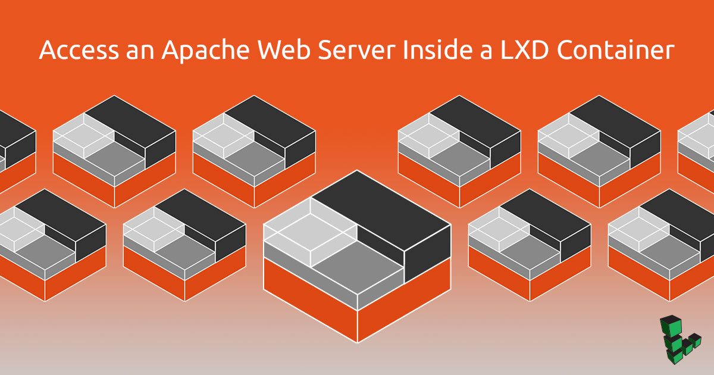
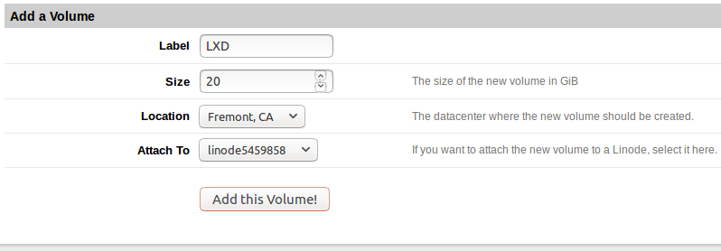

## What is LXD?

[LXD](https://linuxcontainers.org/lxd/) (pronounced "Lex-Dee") is a system container manager build on top of LXC (Linux Containers) that is currently supported by Canonical. The goal of LXD is to provide an experience similar to a virtual machine but through containerization rather than virtualization. Compared to Docker for delivering applications, LXD offers nearly full OS functionality with additional features such as snapshots, live migrations, storage management, and more.

The main benefits of LXD are the high density of containers that it can support and the performance it delivers compared to virtual machines. A computer with 2GB RAM can adequately support half a dozen containers. In addition, LXD officially supports the [container images of major Linux distributions](https://us.images.linuxcontainers.org/). We can choose the Linux distribution and version to run in the container.

This guide covers how to setup a Linode to work with LXD, how LXD works in practice, and how to troubleshoot common issues.


For simplicity, the term *container* is used throughout this guide to describe the LXD containers.


## Before You Begin

1.  If you have not already done so, create a Linode account and Compute Instance. See our [Getting Started with Linode](/docs/guides/getting-started/) and [Creating a Compute Instance](/docs/guides/creating-a-compute-instance/) guides.

1.  Follow our [Setting Up and Securing a Compute Instance](/docs/guides/set-up-and-secure/) guide to update your system. You may also wish to set the timezone, configure your hostname, create a limited user account, and harden SSH access.

## Mount Storage Volume

When setting up LXD, you can either store container data in an [external volume](#block-storage-volume) (such as a Block Storage Volume) or in a [Disk](#disk) mounted to your Linode.

### Block Storage Volume

1.  Follow the [View, Create, and Delete Block Storage Volumes](/docs/products/storage/block-storage/guides/manage-volumes/) guide and create a block storage volume with size *at least 20GB* and attach it to your Linode. Make a note of the device name and the path to the Volume.

    
**Do not** format the volume and do not add it to `/etc/fstab`.


    

2.  Edit your Configuration Profile and under **Boot Settings** select **GRUB 2** as your kernel. See [Run a Distribution-Supplied Kernel on a KVM Linode](/docs/guides/managing-the-kernel-on-a-linode/) for more information.

3.  Reboot your Linode from the Linode Manager.

### Disk

1.  In the Linode Manager, find the **Disks** section and click **Create a new disk**.

    

    
If your Linode's distribution disk already has 100% of the available disk space allocated to it, you will need to resize the disk before you can create a storage disk. See [Resizing a Disk](/docs/guides/disks-and-storage/#resizing-a-disk) for more information.


2.  Edit your Linode's Configuration Profile. Under **Block Device Assignment**, assign your new disk to `/dev/sdc`. Make a note of this path, which you will need when configuring LXD in the next section.

    

3.  Under **Boot Settings** select **GRUB 2** as your kernel.

4.  Reboot your Linode from the Linode Manager.

## Initialize LXD

1.  Install the packages `lxd` and `zfsutils-linux`:

        sudo apt install lxd zfsutils-linux

2.  Add your Unix user to the `lxd` group:

        sudo usermod -a -G lxd username

3.  Start a new SSH session for this change to take effect:

4.  Run `lxd init` to initialize LXD:

        sudo lxd init

    You will be prompted several times during the initialization process. Choose the defaults for all options **except** `Use existing block device?` For this option, select **yes** and then enter the path to the storage volume added in the previous section.

## LXD Commands

1.  List all containers:

        lxc list

    
Generating a client certificate. This may take a minute...
If this is your first time using LXD, you should also run: sudo lxd init
To start your first container, try: lxc launch ubuntu:16.04

+------+-------+------+------+------+-----------+
| NAME | STATE | IPV4 | IPV6 | TYPE | SNAPSHOTS |
+------+-------+------+------+------+-----------+


2.  List all available container images:

        lxc image list images:

    
+---------------------------------+--------------+--------+------------------------------------------+---------+----------+-------------------------------+
|              ALIAS              | FINGERPRINT  | PUBLIC |               DESCRIPTION                |  ARCH   |   SIZE   |          UPLOAD DATE          |
+---------------------------------+--------------+--------+------------------------------------------+---------+----------+-------------------------------+
| alpine/3.4 (3 more)             | 39a3bf44c9d8 | yes    | Alpine 3.4 amd64 (20180126_17:50)        | x86_64  | 2.04MB   | Jan 26, 2018 at 12:00am (UTC) |
+---------------------------------+--------------+--------+------------------------------------------+---------+----------+-------------------------------+
| alpine/3.4/armhf (1 more)       | 9fe7c201924c | yes    | Alpine 3.4 armhf (20170111_20:27)        | armv7l  | 1.58MB   | Jan 11, 2017 at 12:00am (UTC) |
+---------------------------------+--------------+--------+------------------------------------------+---------+----------+-------------------------------+
| alpine/3.4/i386 (1 more)        | d39f2f2ba547 | yes    | Alpine 3.4 i386 (20180126_17:50)         | i686    | 1.88MB   | Jan 26, 2018 at 12:00am (UTC) |
+---------------------------------+--------------+--------+------------------------------------------+---------+----------+-------------------------------+
| alpine/3.5 (3 more)             | 5533a5247551 | yes    | Alpine 3.5 amd64 (20180126_17:50)        | x86_64  | 1.70MB   | Jan 26, 2018 at 12:00am (UTC) |
+---------------------------------+--------------+--------+------------------------------------------+---------+----------+-------------------------------+
| alpine/3.5/i386 (1 more)        | 5e93d5f4cae1 | yes    | Alpine 3.5 i386 (20180126_17:50)         | i686    | 1.73MB   | Jan 26, 2018 at 12:00am (UTC) |
+---------------------------------+--------------+--------+------------------------------------------+---------+----------+-------------------------------+
| alpine/3.6 (3 more)             | 5010616d9a24 | yes    | Alpine 3.6 amd64 (20180126_17:50)        | x86_64  | 1.73MB   | Jan 26, 2018 at 12:00am (UTC) |
+---------------------------------+--------------+--------+------------------------------------------+---------+----------+-------------------------------+
.....................................................................


    
The first two columns for the alias and fingerprint provide an identifier that can be used to specify the container image when launching it.


3.  Launch a new container with the name `mycontainer`:

        lxc launch ubuntu:16.04 mycontainer

    
Creating mycontainer
Starting mycontainer


4.  Check the list of containers to make sure the new container is running:

        lxc list

    
+-------------+---------+-----------------------+---------------------------+------------+-----------+
|    NAME     |  STATE  |         IPV4          |          IPV6             |    TYPE    | SNAPSHOTS |
+-------------+---------+-----------------------+---------------------------+------------+-----------+
| mycontainer | RUNNING | 10.142.148.244 (eth0) | fde5:5d27:...:1371 (eth0) | PERSISTENT | 0         |
+-------------+---------+-----------------------+---------------------------+------------+-----------+


5.  Execute basic commands in `mycontainer`:

        lxc exec mycontainer -- apt update
        lxc exec mycontainer -- apt upgrade

    
The characters `--` instruct the `lxc` command not to parse any more command-line parameters.


6.  Open a shell session within `mycontainer`:

        lxc exec mycontainer -- sudo --login --user ubuntu

    
To run a command as administrator (user "root"), use "sudo <command>".
See "man sudo_root" for details.

ubuntu@mycontainer:~$


    
The Ubuntu container images have by default a non-root account with username `ubuntu`. This account can use `sudo`  and does not require a password to perform administrative tasks.

The `sudo` command provides a login to the existing account `ubuntu`.


7.  View the container logs:

        lxc info mycontainer --show-log

8.  Stop the container:

        lxc stop mycontainer

9.  Remove the container:

        lxc delete mycontainer

## Apache Web Server with LXD

This section will create a container, install the Apache web server, and add the appropriate `iptables` rules in order to expose post 80.

1.  Launch a new container:

        lxc launch ubuntu:16.04 web

2.  Update the package list in the container.

        lxc exec web -- apt update

3.  Install the Apache in the LXD container.

        lxc exec web -- apt install apache2

4.  Add the `iptables` rule to expose the port 80. When someone connects to port 80 through the public IP address, this rule redirects them to port 80 of the container.

    You will need to replace `your_public_ip` and `your_container_ip` with your public IP and container IP respectively in this command.

        PORT=80 PUBLIC_IP=your_public_ip CONTAINER_IP=your_container_ip sudo -E bash -c 'iptables -t nat -I PREROUTING -i eth0 -p TCP -d $PUBLIC_IP --dport $PORT -j DNAT --to-destination $CONTAINER_IP:$PORT -m comment --comment "forward to the Apache2 container"'

5.  Make the `iptables` rule persist on reboot by installing `iptables-persistent`. When prompted to save the IPv4 and IPv6 rules, click **Yes** in order to save them.

        sudo apt install iptables-persistent

6.  From your local computer, navigate to your Linode's public IP address in a web browser. You should see the default Apache page:

    

## Next Steps

If you plan to use a single website, then a single `iptables` rule to the website container will suffice. If you plan to use multiple websites, you will need to install a web server such as NGINX and set up [a reverse proxy](https://docs.nginx.com/nginx/admin-guide/web-server/reverse-proxy/) in a container. The `iptables` rule would then redirect to this container.
