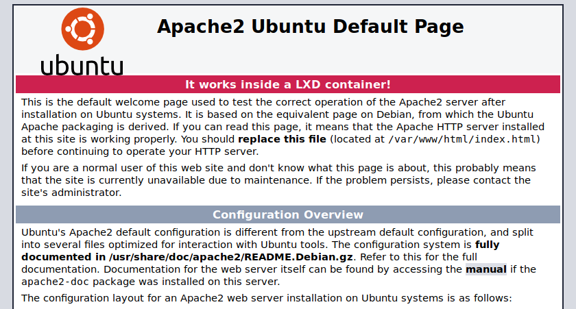

## Introduction

[LXD](https://linuxcontainers.org/lxd/) (pronounced "Lex-Dee") is a system container manager build on top of Linux Containers (LXC) supported by [Canonical](https://canonical.com). The goal of LXD is to provide an experience similar to a virtual machine but through containerization rather than hardware virtualization. Compared to Docker for delivering applications, LXD offers nearly full operating-system functionality with additional features such as snapshots, live migrations, and storage management.

A reverse proxy is a server that sits between internal applications and external clients, forwarding client requests to the appropriate server. While many common applications, such as Node.js, are able to function as servers on their own, they may lack a number of advanced load balancing, security, and acceleration features.

This guide explains the creation of a reverse proxy in an LXD container in order to host multiple websites, each in their own additional containers. You will utilize NGINX and Apache web servers, while also relying on NGINX as a reverse proxy.

Please refer to the following diagram to understand the reverse proxy created in this guide.

In this guide you will:

 - [Install and configure containers](/docs/applications/containers/beginners-guide-to-lxd-reverse-proxy/#creating-the-containers) for both NGINX and Apache web servers.

 - [Learn how to install and configure a reverse proxy in a container](/docs/applications/containers/beginners-guide-to-lxd-reverse-proxy/#setting-up-the-reverse-proxy).

 - [Get SSL/TLS support through Let's Encrypt certificates with automated certificate renewal](/docs/applications/containers/beginners-guide-to-lxd-reverse-proxy/#adding-support-for-https-with-let-s-encrypt).

- [Troubleshooting common errors](/docs/applications/containers/beginners-guide-to-lxd-reverse-proxy/#troubleshooting).


For simplicity, the term *container* is used throughout this guide to describe the LXD system containers.


### Before You Begin

1.  Complete [A Beginner's Guide to LXD: Setting Up an Apache Web Server In a Container](/docs/guides/beginners-guide-to-lxd/). The guide instructs you to create a container called `web` with the Apache web server for testing purposes. Remove this container by running the following commands.

        lxc stop web
        lxc delete web

    
For this guide LXD version 3.3 or later is needed. Check the version with the following command:

    lxd --version

If the version is not 3.3 or later, update to the latest version by installing the snap package as instructed in [A Beginner's Guide to LXD: Setting Up an Apache Webserver In a Container](/docs/guides/beginners-guide-to-lxd/) and use the following command:

    sudo lxd.migrate


2. This guide uses the hostnames `apache1.example.com` and `nginx1.example.com` for the two example websites. Replace these names with hostnames you own and setup their DNS entries to point them to the IP address of the server you created. For help with DNS see our [DNS Manager Guide](/docs/guides/dns-manager/).

## Creating the Containers

1.  Create two containers called `apache1` and `nginx1`, one with the Apache web server and another with the NGINX web server, respectively. For any additional websites, you may create new containers with your chosen web server software.

        lxc launch ubuntu:18.04 apache1
        lxc launch ubuntu:18.04 nginx1

2.  Create the `proxy` container for the reverse proxy.

        lxc launch ubuntu:18.04 proxy

3.  List the containers with the list command.

        lxc list

4.  The output looks similar to the following.

    
+---------+---------+---------------------+-----------------------------------------------+------------+-----------+
|  NAME   |  STATE  |        IPV4         |                     IPV6                      |    TYPE    | SNAPSHOTS |
+---------+---------+---------------------+-----------------------------------------------+------------+-----------+
| apache1 | RUNNING | 10.10.10.204 (eth0) | fd42:67a4:b462:6ae2:216:3eff:fe01:1a4e (eth0) | PERSISTENT |           |
+---------+---------+---------------------+-----------------------------------------------+------------+-----------+
| nginx1  | RUNNING | 10.10.10.251 (eth0) | fd42:67a4:b462:6ae2:216:3eff:febd:67e3 (eth0) | PERSISTENT |           |
+---------+---------+---------------------+-----------------------------------------------+------------+-----------+
| proxy   | RUNNING | 10.10.10.28 (eth0)  | fd42:67a4:b462:6ae2:216:3eff:fe00:252e (eth0) | PERSISTENT |           |
+---------+---------+---------------------+-----------------------------------------------+------------+-----------+


    There are three containers, all in the *RUNNING* state – each with their own private IP address. Take note of the IP addresses (both IPv4 and IPv6) for the container `proxy`. You will need them to configure the `proxy` container in a later section.

    Now that the containers have been created, the following steps will detail how to set up the web server software in the `apache1` and `nginx1` containers, and the `proxy` container so that the web servers are accessible from the internet.

### Configuring the Apache Web Server Container

When using a reverse proxy in front of a web server, the web server does not know the IP addresses of visitors. The web server only sees the IP address of the reverse proxy. However, each web server has a way to identify the real remote IP address of a visitor. For Apache, this is performed with the Remote IP Apache module. For the module to work, the reverse proxy must be configured to pass the remote IP address' information.

1.  Start a shell in the `apache1` container.

        lxc exec apache1 -- sudo --user ubuntu --login

1.  Update the package list in the `apache1` container.

        sudo apt update

1.  Install the package *apache2* in the container.

        sudo apt install -y apache2

1. Create the file `/etc/apache2/conf-available/remoteip.conf`.

    
RemoteIPHeader X-Real-IP
RemoteIPTrustedProxy 10.10.10.28 fd42:67a4:b462:6ae2:216:3eff:fe00:252e


    You can use the `nano` text editor by running the command `sudo nano /etc/apache2/conf-available/remoteip.conf`. Note, these are the IP addresses of the `proxy` container shown earlier, for both IPv4 and IPv6. Replace these with the IPs from your `lxc list` output.

    
Instead of specifying the IP addresses, you can also use the hostname `proxy.lxd`. However, the RemoteIP Apache module is peculiar when using the hostname and uses only one of the two IP addresses (either IPv4 or IPv6), which means the Apache web server does not know the real source IP address for some connections. By listing explicitly both IPv4 and IPv6 addresses, you can be certain that RemoteIP successfully accepts the source IP information from all connections of the reverse proxy.


1. Enable the new `remoteip.conf` configuration.

        sudo a2enconf remoteip

    
Enabling conf remoteip.
To activate the new configuration, you need to run:
systemctl reload apache2


1. Enable the `remoteip` Apache module.

        sudo a2enmod remoteip

    
Enabling module remoteip.
To activate the new configuration, you need to run:
systemctl restart apache2


1. Edit the default web page for Apache to make a reference that it runs inside a LXD container.

        sudo nano /var/www/html/index.html

    Change the line "It works!" (line number 224) to "It works inside a LXD container!" Save and exit.

1. Restart the Apache web server.

        sudo systemctl reload apache2

1. Exit back to the host.

        exit

You have created and configured the Apache web server, but the server is not yet accessible from the Internet. It becomes accessible after you configure the `proxy` container in a later section.

### Creating the NGINX Web Server Container

Like Apache, NGINX does not know the IP addresses of visitors when using a reverse proxy in front of a web server. It only sees the IP address of the reverse proxy instead. Each NGINX web server software can identify the real remote IP address of a visitor with the Real IP module. For the module to work, the reverse proxy must be configured accordingly to pass the information regarding the remote IP addresses.

1.  Start a shell in the `nginx1` container.

        lxc exec nginx1 -- sudo --user ubuntu --login

1.  Update the package list in the `nginx1` container.

        sudo apt update

1.  Install *NGINX* in the container.

        sudo apt install -y nginx

1. Create the file `/etc/nginx/conf.d/real-ip.conf`.

    
real_ip_header    X-Real-IP;
set_real_ip_from  proxy.lxd;


    You can use the `nano` text editor by running the command `sudo nano /etc/nginx/conf.d/real-ip.conf`.

    
You have specified the hostname of the reverse proxy, `proxy.lxd`. Each LXD container gets automatically a hostname, which is the name of the container plus the suffix `.lxd`. By specifying the `set_real_ip_from` field with `proxy.lxd`, you are instructing the NGINX web server to accept the real IP address information for each connection, as long as that connection originates from `proxy.lxd`. The real IP address information is found in the HTTP header `X-Real-IP` in each connection.


1. Edit the default web page for NGINX to make a reference that it runs inside a LXD container.

        sudo nano /var/www/html/index.nginx-debian.html

    Change the line "Welcome to nginx!" (line number 14) to "Welcome to nginx running in a LXD system container!". Save and exit.

1. Restart the NGINX web server.

        sudo systemctl reload nginx

1. Exit back to the host.

        exit

You have created and configured the NGINX web server, but the server is not accessible yet from the Internet. It becomes accessible after you configure the `proxy` container in the next section.

## Setting up the Reverse Proxy

In this section you will configure the container `proxy`. You will install NGINX and set it up as a reverse proxy, then add the appropriate LXD *proxy device* in order to expose both ports 80 and 443 to the internet.

1. Add LXD **proxy devices** to redirect connections from the internet to ports 80 (HTTP) and 443 (HTTPS) on the server to the respective ports at the `proxy` container.

        lxc config device add proxy myport80 proxy listen=tcp:0.0.0.0:80 connect=tcp:127.0.0.1:80 proxy_protocol=true
        lxc config device add proxy myport443 proxy listen=tcp:0.0.0.0:443 connect=tcp:127.0.0.1:443 proxy_protocol=true

    
Device myport80 added to proxy
Device myport443 added to proxy


    The `lxc config device add` command takes as arguments:

    | Argument | Explanation |
| ----- | ----- |
| `proxy` | The name of the container. |
| `myport80` | A name for this proxy device. |
| `proxy` | The type of the LXD device (LXD _proxy_ device). |
| `listen=tcp:0.0.0.0:80` | The proxy device listens on the host (default) on port 80, protocol TCP, on all interfaces. |
| `connect=tcp:127.0.0.1:80` | The proxy device connects to the container on port 80, protocol TCP, on the loopback interface. In previous versions of LXD you could have specified `localhost` here. However, in LXD 3.13 or newer, you can only specify IP addresses. |
| `proxy_protocol=true` | Request to enable the PROXY protocol so that the reverse proxy gets the originating IP address from the proxy device. |

    
If you want to remove a proxy device, use `lxc config device remove`. If you want to remove the above device `myport80`, run the following command:

    lxc config device remove proxy myport80

Where proxy is the name of the container, and myport80 is the name of the device.


2.  Start a shell in the `proxy` container.

        lxc exec proxy -- sudo --user ubuntu --login

3.  Update the package list.

        sudo apt update

4.  Install NGINX in the container.

        sudo apt install -y nginx

5.  Logout from the container.

        logout

### Direct Traffic to the Apache Web Server From the Reverse Proxy

The reverse proxy container is running and the NGINX package has been installed. To work as a reverse proxy, add the appropriate website configuration so that NGINX can identify (with `server_name` below) the appropriate hostname, and then pass (with `proxy_pass` below) the connection to the appropriate LXD container.

1.  Start a shell in the `proxy` container.

        lxc exec proxy -- sudo --user ubuntu --login

2.  Create the file `apache1.example.com` in `/etc/nginx/sites-available/` for the configuration of your first website.

    
server {
        listen 80 proxy_protocol;
        listen [::]:80 proxy_protocol;

        server_name apache1.example.com;

        location / {
                include /etc/nginx/proxy_params;

                proxy_pass http://apache1.lxd;
        }

        real_ip_header proxy_protocol;
        set_real_ip_from 127.0.0.1;
}


    You can run `sudo nano /etc/nginx/sites-available/apache1.example.com` to open up a text editor and add the configuration. Note, in this case you only need to edit the `server_name` to be the hostname of the website.

3.  Enable the website.

        sudo ln -s /etc/nginx/sites-available/apache1.example.com /etc/nginx/sites-enabled/

4.  Restart the NGINX reverse proxy. By restarting the service, NGINX reads and applies the new site instructions just added to `/etc/nginx/sites-enabled`.

        sudo systemctl reload nginx

5.  Exit the proxy container and return back to the host.

        logout

6.  From your local computer, visit the URL of your website with your web browser. You should see the default Apache page:

    

    
If you look at the Apache access.log file (default file `/var/log/apache2/access.log`), it still shows the private IP address of the `proxy` container instead of the real IP address. This issue is specific to the Apache web server and has to do with how the server prints the logs. Other software on the web server is able to use the real IP. To fix this through the Apache logs, see the section [Troubleshooting](/docs/applications/containers/beginners-guide-to-lxd-reverse-proxy/#troubleshooting).


### Direct Traffic to the NGINX Web Server From the Reverse Proxy

The reverse proxy container is running and the `NGINX` package has been installed. To work as a reverse proxy, you need to add the appropriate website configuration so `NGINX` can identify (with `server_name` below) the appropriate hostname, and then pass (with `proxy_pass` below) the connection to the appropriate LXD container with the actual web server software.

1.  Start a shell in the `proxy` container.

        lxc exec proxy -- sudo --user ubuntu --login

2.  Create the file `nginx1.example.com` in `/etc/nginx/sites-available/` for the configuration of your second website.

    
server {
        listen 80 proxy_protocol;
        listen [::]:80 proxy_protocol;

        server_name nginx1.example.com;

        location / {
                include /etc/nginx/proxy_params;

                proxy_pass http://nginx1.lxd;
        }

        real_ip_header proxy_protocol;
        set_real_ip_from 127.0.0.1;
}


    You can run `sudo nano /etc/nginx/sites-available/nginx1.example.com` to create the configuration. Note, you only need to edit the fields `server_name` to be the hostname of the website.

3.  Enable the website.

        sudo ln -s /etc/nginx/sites-available/nginx1.example.com /etc/nginx/sites-enabled/

4.  Restart the NGINX reverse proxy service.

        sudo systemctl reload nginx

5.  Exit the proxy container and return back to the host.

        logout

6.  From your local computer, visit the URL of your website with your web browser. You should see the following default NGINX page.

    

### Adding Support for HTTPS with Let's Encrypt

1.  Start a shell in the `proxy` container.

        lxc exec proxy -- sudo --user ubuntu --login

1.  Add the repository `ppa:certbot/certbot` by running the following command.

        sudo add-apt-repository ppa:certbot/certbot

1.  The output looks similar to the following.
    
      This is the PPA for packages prepared by Debian Let's Encrypt Team and backported for Ubuntu(s).
      More info: https://launchpad.net/~certbot/+archive/ubuntu/certbot
     Press [ENTER] to continue or Ctrl-c to cancel adding it.

     Get:1 http://security.ubuntu.com/ubuntu bionic-security InRelease [88.7 kB]
     ...
     Fetched 3360 kB in 2s (2018 kB/s)
     Reading package lists... Done


1.  Install the following two packages to a) support the creation of Let's Encrypt certificates; and b) auto-configure the NGINX reverse proxy to use Let's Encrypt certificates. The packages are pulled from the newly-created repository.

        sudo apt-get install certbot python-certbot-nginx

    
This configures the reverse proxy to also act as a *TLS Termination Proxy*. Any HTTPS configuration is only found in the `proxy` container. By doing so, it is not necessary to perform any tasks inside the web server containers relating to certificates and Let's Encrypt.


1.  Run `certbot` as root with the `--nginx` parameter in order to perform the auto-configuration of Let's Encrypt for the first website. You are asked to supply a valid email address for urgent renewal and security notices. You are then asked to accept the Terms of Service and whether you would like to be contacted by the Electronic Frontier Foundation in the future. Next, provide the website for which you are activating HTTPS. Finally, you can choose to set up a facility that automatically redirects HTTP connections to HTTPS connections.

        sudo certbot --nginx

    
Saving debug log to /var/log/letsencrypt/letsencrypt.log
Plugins selected: Authenticator nginx, Installer nginx
Enter email address (used for urgent renewal and security notices) (Enter 'c' to
cancel): myemail@example.com

- - - - - - - - - - - - - - - - - - - - - - - - - - - - - - - - - - - - - - - -
Please read the Terms of Service at
https://letsencrypt.org/documents/LE-SA-v1.2-November-15-2017.pdf. You must
agree in order to register with the ACME server at
https://acme-v02.api.letsencrypt.org/directory
- - - - - - - - - - - - - - - - - - - - - - - - - - - - - - - - - - - - - - - -
(A)gree/(C)ancel: A

- - - - - - - - - - - - - - - - - - - - - - - - - - - - - - - - - - - - - - - -
Would you be willing to share your email address with the Electronic Frontier
Foundation, a founding partner of the Let's Encrypt project and the non-profit
organization that develops Certbot? We'd like to send you email about our work
encrypting the web, EFF news, campaigns, and ways to support digital freedom.
- - - - - - - - - - - - - - - - - - - - - - - - - - - - - - - - - - - - - - - -
(Y)es/(N)o: N

Which names would you like to activate HTTPS for?
- - - - - - - - - - - - - - - - - - - - - - - - - - - - - - - - - - - - - - - -
1: apache1.example.com
2: nginx1.example.com
- - - - - - - - - - - - - - - - - - - - - - - - - - - - - - - - - - - - - - - -
Select the appropriate numbers separated by commas and/or spaces, or leave input
blank to select all options shown (Enter 'c' to cancel): 1
Obtaining a new certificate
Performing the following challenges:
http-01 challenge for apache1.example.com
Waiting for verification...
Cleaning up challenges
Deploying Certificate to VirtualHost /etc/nginx/sites-enabled/apache1.example.com

Please choose whether or not to redirect HTTP traffic to HTTPS, removing HTTP access.
- - - - - - - - - - - - - - - - - - - - - - - - - - - - - - - - - - - - - - - -
1: No redirect - Make no further changes to the webserver configuration.
2: Redirect - Make all requests redirect to secure HTTPS access. Choose this for
new sites, or if you're confident your site works on HTTPS. You can undo this
change by editing your web server's configuration.
- - - - - - - - - - - - - - - - - - - - - - - - - - - - - - - - - - - - - - - -
Select the appropriate number [1-2] then [enter] (press 'c' to cancel): 2
Redirecting all traffic on port 80 to ssl in /etc/nginx/sites-enabled/apache1.example.com

- - - - - - - - - - - - - - - - - - - - - - - - - - - - - - - - - - - - - - - -
Congratulations! You have successfully enabled https://apache1.example.com

You should test your configuration at:
https://www.ssllabs.com/ssltest/analyze.html?d=apache1.example.com
- - - - - - - - - - - - - - - - - - - - - - - - - - - - - - - - - - - - - - - -

IMPORTANT NOTES:
 - Congratulations! Your certificate and chain have been saved at:
   /etc/letsencrypt/live/apache1.example.com/fullchain.pem
   Your key file has been saved at:
   /etc/letsencrypt/live/apache1.example.com/privkey.pem
   Your cert will expire on 2019-10-07. To obtain a new or tweaked
   version of this certificate in the future, simply run certbot again
   with the "certonly" option. To non-interactively renew *all* of
   your certificates, run "certbot renew"
 - Your account credentials have been saved in your Certbot
   configuration directory at /etc/letsencrypt. You should make a
   secure backup of this folder now. This configuration directory will
   also contain certificates and private keys obtained by Certbot so
   making regular backups of this folder is ideal.
 - If you like Certbot, please consider supporting our work by:

   Donating to ISRG / Let's Encrypt:   https://letsencrypt.org/donate
   Donating to EFF:                    https://eff.org/donate-le


1.  Run `certbot` as root with the `--nginx` parameter in order to perform the auto-configuration of Let's Encrypt for the second website. This is the second time we run `certbot`, therefore we are asked directly to select the website to configure.

        sudo certbot --nginx

    
Saving debug log to /var/log/letsencrypt/letsencrypt.log
Plugins selected: Authenticator nginx, Installer nginx

Which names would you like to activate HTTPS for?
- - - - - - - - - - - - - - - - - - - - - - - - - - - - - - - - - - - - - - - -
1: apache1.example.com
2: nginx1.example.com
- - - - - - - - - - - - - - - - - - - - - - - - - - - - - - - - - - - - - - - -
Select the appropriate numbers separated by commas and/or spaces, or leave input
blank to select all options shown (Enter 'c' to cancel): 2
Obtaining a new certificate
Performing the following challenges:
http-01 challenge for nginx1.example.com
Waiting for verification...
Cleaning up challenges
Deploying Certificate to VirtualHost /etc/nginx/sites-enabled/nginx1.example.com

Please choose whether or not to redirect HTTP traffic to HTTPS, removing HTTP access.
- - - - - - - - - - - - - - - - - - - - - - - - - - - - - - - - - - - - - - - -
1: No redirect - Make no further changes to the webserver configuration.
2: Redirect - Make all requests redirect to secure HTTPS access. Choose this for
new sites, or if you're confident your site works on HTTPS. You can undo this
change by editing your web server's configuration.
- - - - - - - - - - - - - - - - - - - - - - - - - - - - - - - - - - - - - - - -
Select the appropriate number [1-2] then [enter] (press 'c' to cancel): 2
Redirecting all traffic on port 80 to ssl in /etc/nginx/sites-enabled/nginx1.example.com

- - - - - - - - - - - - - - - - - - - - - - - - - - - - - - - - - - - - - - - -
Congratulations! You have successfully enabled https://nginx1.example.com

You should test your configuration at:
https://www.ssllabs.com/ssltest/analyze.html?d=nginx1.example.com
- - - - - - - - - - - - - - - - - - - - - - - - - - - - - - - - - - - - - - - -

IMPORTANT NOTES:
 - Congratulations! Your certificate and chain have been saved at:
   /etc/letsencrypt/live/nginx1.example.com/fullchain.pem
   Your key file has been saved at:
   /etc/letsencrypt/live/nginx1.example.com/privkey.pem
   Your cert will expire on 2019-10-07. To obtain a new or tweaked
   version of this certificate in the future, simply run certbot again
   with the "certonly" option. To non-interactively renew *all* of
   your certificates, run "certbot renew"
 - If you like Certbot, please consider supporting our work by:

   Donating to ISRG / Let's Encrypt:   https://letsencrypt.org/donate
   Donating to EFF:                    https://eff.org/donate-le


1.  After adding all websites, perform a dry run in order to test the renewal of the certificates. Check that all websites are updating successfully to ensure the automated facility updated the certificates without further effort.

        sudo certbot renew --dry-run

    
Saving debug log to /var/log/letsencrypt/letsencrypt.log

- - - - - - - - - - - - - - - - - - - - - - - - - - - - - - - - - - - - - - - -
Processing /etc/letsencrypt/renewal/apache1.example.com.conf
- - - - - - - - - - - - - - - - - - - - - - - - - - - - - - - - - - - - - - - -
Cert not due for renewal, but simulating renewal for dry run
Plugins selected: Authenticator nginx, Installer nginx
Renewing an existing certificate
Performing the following challenges:
http-01 challenge for apache1.example.com
Waiting for verification...
Cleaning up challenges

- - - - - - - - - - - - - - - - - - - - - - - - - - - - - - - - - - - - - - - -
new certificate deployed with reload of nginx server; fullchain is
/etc/letsencrypt/live/apache1.example.com/fullchain.pem
- - - - - - - - - - - - - - - - - - - - - - - - - - - - - - - - - - - - - - - -

- - - - - - - - - - - - - - - - - - - - - - - - - - - - - - - - - - - - - - - -
Processing /etc/letsencrypt/renewal/nginx1.example.com.conf
- - - - - - - - - - - - - - - - - - - - - - - - - - - - - - - - - - - - - - - -
Cert not due for renewal, but simulating renewal for dry run
Plugins selected: Authenticator nginx, Installer nginx
Renewing an existing certificate
Performing the following challenges:
http-01 challenge for nginx1.example.com
Waiting for verification...
Cleaning up challenges

- - - - - - - - - - - - - - - - - - - - - - - - - - - - - - - - - - - - - - - -
new certificate deployed with reload of nginx server; fullchain is
/etc/letsencrypt/live/nginx1.example.com/fullchain.pem
- - - - - - - - - - - - - - - - - - - - - - - - - - - - - - - - - - - - - - - -

- - - - - - - - - - - - - - - - - - - - - - - - - - - - - - - - - - - - - - - -
** DRY RUN: simulating 'certbot renew' close to cert expiry
**          (The test certificates below have not been saved.)

Congratulations, all renewals succeeded. The following certs have been renewed:
  /etc/letsencrypt/live/apache1.example.com/fullchain.pem (success)
  /etc/letsencrypt/live/nginx1.example.com/fullchain.pem (success)
** DRY RUN: simulating 'certbot renew' close to cert expiry
**          (The test certificates above have not been saved.)
- - - - - - - - - - - - - - - - - - - - - - - - - - - - - - - - - - - - - - - -

IMPORTANT NOTES:
 - Your account credentials have been saved in your Certbot
   configuration directory at /etc/letsencrypt. You should make a
   secure backup of this folder now. This configuration directory will
   also contain certificates and private keys obtained by Certbot so
   making regular backups of this folder is ideal.


    
The `certbot` package adds a *systemd timer* in order to activate the automated renewal of Let's Encrypt certificates. You can view the details of this timer by running `systemctl list-timers`.


1. The certbot tool edits and changes the NGINX configuration files of your websites. In doing so, certbot does not obey initial `listen` directive (`listen 80 proxy_protocol;`) and does not add the `proxy_protocol` parameter to the newly added `listen 443 ssl;` lines. You must edit the configuration files for each website and append "proxy_protocol" to each "listen 443 ssl;" line.

        sudo nano /etc/nginx/sites-enabled/apache1.example.com
        sudo nano /etc/nginx/sites-enabled/nginx1.example.com

    
listen 443 ssl proxy_protocol; # managed by Certbot
listen [::]:443 ssl proxy_protocol; # managed by Certbot


    
Each website configuration file has two pairs of `listen` directives: HTTP and HTTPS, respectively. The first is the original pair for HTTP that was added in a previous section. The second pair was added by certbot for HTTPS. These are pairs because they cover both IPv4 and IPv6. The notation `[::]` refers to IPv6. When adding the parameter `proxy_protocol`, add it before the `;` on each line as shown above.


1.  Restart NGINX.

        sudo systemctl restart nginx

## Troubleshooting

### Browser Error "SSL_ERROR_RX_RECORD_TOO_LONG"

You have configured Certbot and created the appropriate Let's Encrypt configuration for each website. But when you access the website from your browser, you get the following error.


Secure Connection Failed

An error occurred during a connection to apache1.example.com. SSL received a record that exceeded the maximum permissible length. Error code: SSL_ERROR_RX_RECORD_TOO_LONG

    The page you are trying to view cannot be shown because the authenticity of the received data could not be verified.
    Please contact the website owners to inform them of this problem.


This error is caused when the NGINX reverse proxy in the `proxy` container does not have the `proxy_protocol` parameter in the `listen 443` directives. Without the parameter, the reverse proxy does not consume the *PROXY protocol* information before it performs the HTTPS work. It mistakenly passes the PROXY protocol information to the HTTPS module, hence the *record too long* error.

Follow the instructions in the previous section and add `proxy_protocol` to all `listen 443` directives. Finally, restart NGINX.

### Error "Unable to connect" or "This site can’t be reached"

When you attempt to connect to the website from your local computer and receive *Unable to connect* or *This site can't be reached* errors, it is likely the proxy devices have not been configured.

Run the following command on the host to verify whether LXD is listening and is able to accept connections to ports 80 (HTTP) and 443 (HTTPS).

    sudo ss -ltp '( sport = :http || sport = :https )'


The `ss` command is similar to `netstat` and `lsof`. It shows information about network connections. In this case, we use it to verify whether there is a service on ports 80 and 443, and which service it is.
* `-l`, to display the listening sockets,
* `-t`, to display only TCP sockets,
* `-p`, to show which processes use those sockets,
* `( sport = :http || sport = :https )`, to show only ports 80 and 443 (HTTP and HTTPS, respectively).


In the following output we can verify that both ports 80 and 443 (HTTP and HTTPS, respectively) are in the *LISTEN* state. In the last column we verify that the process listening is `lxd` itself.


State     Recv-Q  Send-Q   Local Address:Port   Peer Address:Port
LISTEN    0       128                  *:http              *:*       users:(("lxd",pid=1301,fd=7),("lxd",pid=1301,fd=5))
LISTEN    0       128                  *:https             *:*       users:(("lxd",pid=1349,fd=7),("lxd",pid=1349,fd=5))


If you see a process listed other than `lxd`, stop that service and restart the `proxy` container. By restarting the `proxy` container, LXD applies the proxy devices again.

### The Apache access.log Shows the IP Address of the Proxy Container

You have set up the `apache1` container and verified that it is accessible from the internet. But the logs at `/var/log/apache2/access.log` still show the private IP address of the `proxy` container, either the private IPv4 (*10.x.x.x*) or the private IPv6 addresses. What went wrong?

The default log formats for printing access logs in Apache only print the IP address of the host of the last hop (i.e. the proxy server). This is the `%h` format specifier as shown below.


LogFormat "%v:%p %h %l %u %t \"%r\" %>s %O \"%{Referer}i\" \"%{User-Agent}i\"" vhost_combined
LogFormat "%h %l %u %t \"%r\" %>s %O \"%{Referer}i\" \"%{User-Agent}i\"" combined
LogFormat "%h %l %u %t \"%r\" %>s %O" common


The `%h` must be manually replaced with the `%a` format specifier, which prints the value as returned by the real RemoteIP Apache module.


LogFormat "%v:%p %a %l %u %t \"%r\" %>s %O \"%{Referer}i\" \"%{User-Agent}i\"" vhost_combined
LogFormat "%a %l %u %t \"%r\" %>s %O \"%{Referer}i\" \"%{User-Agent}i\"" combined
LogFormat "%a %l %u %t \"%r\" %>s %O" common


1.  Run the following command in the `apache1` container to edit the configuration file `httpd.conf` and perform the change from `%h` to `%a`.

        sudo nano /etc/apache2/apache2.conf

2. Reload the Apache web server service.

        sudo systemctl reload apache2

## Next Steps

You have set up a reverse proxy to host many websites on the same server and installed each website in a separate container. You can install static or dynamic websites in the containers. For dynamic websites, you may need additional configuration; check the respective documentation for setup using a reverse proxy. In addition, you may also use NGINX as a reverse proxy for non-HTTP(S) services.
