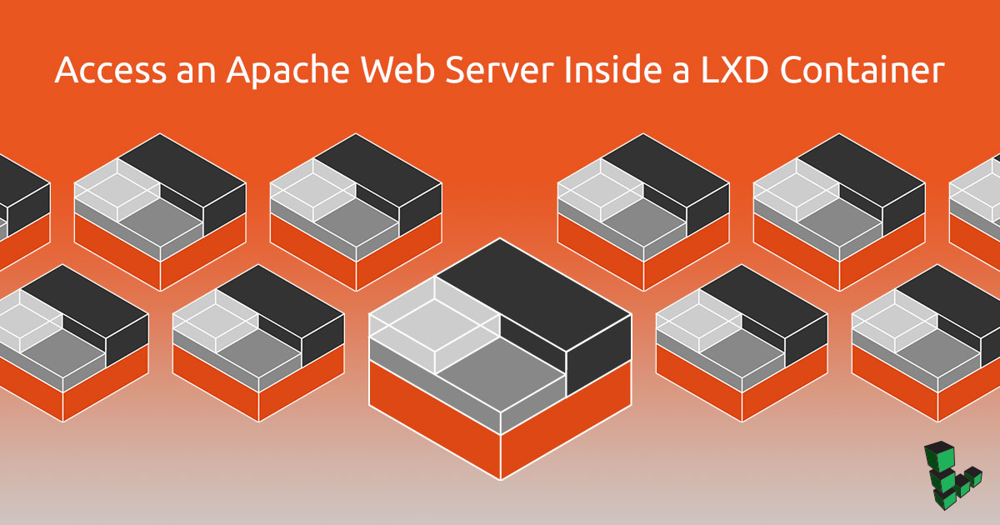
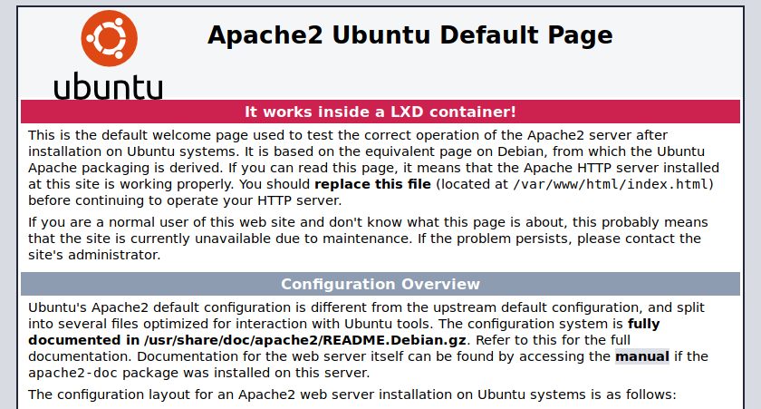

## What is LXD?

[LXD](https://linuxcontainers.org/lxd/) (pronounced "Lex-Dee") is a system container manager build on top of LXC (Linux Containers) that is currently supported by Canonical. The goal of LXD is to provide an experience similar to a virtual machine but through containerization rather than hardware virtualization. Compared to Docker for delivering applications, LXD offers nearly full operating-system functionality with additional features such as snapshots, live migrations, and storage management.

The main benefits of LXD are the support of high density containers and the performance it delivers compared to virtual machines. A computer with 2GB RAM can adequately support half a dozen containers. In addition, LXD officially supports the [container images of major Linux distributions](https://us.images.linuxcontainers.org/). We can choose the Linux distribution and version to run in the container.

This guide covers how to install and setup LXD 3 on a Linode and how to setup an Apache Web server in a container.


For simplicity, the term *container* is used throughout this guide to describe the LXD system containers.


## Before You Begin

1.  Complete the [Creating a Compute Instance](/docs/products/compute/compute-instances/guides/create/) guide. Select a Linode with at least 2GB of RAM memory, such as the Linode 2GB. Specify the Ubuntu 19.04 distribution. You may specify a different Linux distribution, as long as there is support for **snap packages (snapd)**; see the [More Information](#more-information) for more details.

1.  Follow our [Setting Up and Securing a Compute Instance](/docs/products/compute/compute-instances/guides/set-up-and-secure/) guide to update your system. You may also wish to set the timezone, configure your hostname, create a limited user account, and harden SSH access.

## Configure the Snap Package Support

LXD is available as a Debian package in the long-term support (LTS) versions of Ubuntu, such as Ubuntu 18.04 LTS. For other versions of Ubuntu and other distributions, LXD is available as a snap package. Snap packages are universal packages because there is a single package file that works on any supported Linux distributions. See the [More Information](#more-information) section for more details on what a snap package is, what Linux distributions are supported, and how to set it up.

1.  Verify that snap support is installed correctly. The following command either shows that there are no snap packages installed, or that some are.

        snap list

    
No snaps are installed yet. Try 'snap install hello-world'.


2.  View the details of the LXD snap package `lxd`. The output below shows that, currently, the latest version of LXD is `3.12` in the default `stable` channel. This channel is updated often with new features. There are also other channels such as the `3.0/stable` channel which has the LTS LXD version (supported along with Ubuntu 18.04, until 2023) and the `2.0/stable` channel (supported along with Ubuntu 16.04, until 2021). We will be using the latest version of LXD from the default `stable` channel.

        snap info lxd

    
name:      lxd
summary:   System container manager and API
publisher: Canonical✓
contact:   https://github.com/lxc/lxd/issues
license:   Apache-2.0
description: |
  **LXD is a system container manager**

  With LXD you can run hundreds of containers of a variety of Linux
  distributions, apply resource limits, pass in directories, USB devices
  or GPUs and setup any network and storage you want.

  LXD containers are lightweight, secure by default and a great
  alternative to running Linux virtual machines.

  **Run any Linux distribution you want**

  Pre-made images are available for Ubuntu, Alpine Linux, ArchLinux,
  CentOS, Debian, Fedora, Gentoo, openSUSE and more.

  A full list of available images can be [found
  here](https://images.linuxcontainers.org)

  Can't find the distribution you want? It's easy to make your own images
  too, either using our `distrobuilder` tool or by assembling your own image
  tarball by hand.

  **Containers at scale**

  LXD is network aware and all interactions go through a simple REST API,
  making it possible to remotely interact with containers on remote
  systems, copying and moving them as you wish.

  Want to go big? LXD also has built-in clustering support,
  letting you turn dozens of servers into one big LXD server.

  **Configuration options**

  Supported options for the LXD snap (`snap set lxd KEY=VALUE`):
   - criu.enable: Enable experimental live-migration support [default=false]
   - daemon.debug: Increases logging to debug level [default=false]
   - daemon.group: Group of users that can interact with LXD [default=lxd]
   - ceph.builtin: Use snap-specific ceph configuration [default=false]
   - openvswitch.builtin: Run a snap-specific OVS daemon [default=false]

  [Documentation](https://lxd.readthedocs.io)
snap-id: J60k4JY0HppjwOjW8dZdYc8obXKxujRu
channels:
  stable:        3.12        2019-04-16 (10601) 56MB -
  candidate:     3.12        2019-04-26 (10655) 56MB -
  beta:          ↑
  edge:          git-570aaa1 2019-04-27 (10674) 56MB -
  3.0/stable:    3.0.3       2018-11-26  (9663) 53MB -
  3.0/candidate: 3.0.3       2019-01-19  (9942) 53MB -
  3.0/beta:      ↑
  3.0/edge:      git-eaa62ce 2019-02-19 (10212) 53MB -
  2.0/stable:    2.0.11      2018-07-30  (8023) 28MB -
  2.0/candidate: 2.0.11      2018-07-27  (8023) 28MB -
  2.0/beta:      ↑
  2.0/edge:      git-c7c4cc8 2018-10-19  (9257) 26MB -


3.  Install the `lxd` snap package. Run the following command to install the snap package for LXD.

        sudo snap install lxd

    
lxd 3.12 from Canonical✓ installed


You can verify that the snap package has been installed by running `snap list` again. The `core` snap package is a prerequisite for any system with snap package support. When you install your first snap package, `core` is installed and shared among all other snap packages that will get installed in the future.

        snap list

    
Name  Version  Rev    Tracking  Publisher   Notes
core  16-2.38  6673   stable    canonical✓  core
lxd   3.12     10601  stable    canonical✓  -


## Initialize LXD

1.  Add your non-root Unix user to the `lxd` group:

        sudo usermod -a -G lxd username
    
By adding the non-root Unix user account to the `lxd` group, you are able to run any `lxc` commands without prepending `sudo`. Without this addition, you would have needed to prepend `sudo` to each `lxc` command.


2.  Start a new SSH session for the previous change to take effect. For example, log out and log in again.

3.  Verify the available free disk space:

        df -h /

    
Filesystem      Size  Used Avail Use% Mounted on
/dev/sda         49G  2.0G   45G   5% /

In this case there is 45GB of free disk space. LXD requires at least 15GB of space for the storage needs of containers. We will allocate 15GB of space for LXD, leaving 30GB of free space for the needs of the server.

4.  Run `lxd init` to initialize LXD:

        sudo lxd init

    You will be prompted several times during the initialization process. Choose the defaults for all options.

    
Would you like to use LXD clustering? (yes/no) [default=no]:
Do you want to configure a new storage pool? (yes/no) [default=yes]:
Name of the new storage pool [default=default]:
Name of the storage backend to use (btrfs, ceph, dir, lvm, zfs) [default=zfs]:
Create a new ZFS pool? (yes/no) [default=yes]:
Would you like to use an existing block device? (yes/no) [default=no]:
Size in GB of the new loop device (1GB minimum) [default=15GB]:
Would you like to connect to a MAAS server? (yes/no) [default=no]:
Would you like to create a new local network bridge? (yes/no) [default=yes]:
What should the new bridge be called? [default=lxdbr0]:
What IPv4 address should be used? (CIDR subnet notation, “auto” or “none”) [default=auto]:
What IPv6 address should be used? (CIDR subnet notation, “auto” or “none”) [default=auto]:
Would you like LXD to be available over the network? (yes/no) [default=no]:
Would you like stale cached images to be updated automatically? (yes/no) [default=yes]
Would you like a YAML "lxd init" preseed to be printed? (yes/no) [default=no]:


## Apache Web Server with LXD

This section will create a container, install the Apache web server, and add the appropriate `iptables` rules in order to expose post 80.

1.  Launch a new container:

        lxc launch ubuntu:18.04 web

2.  Update the package list in the container.

        lxc exec web -- apt update

3.  Install the Apache in the LXD container.

        lxc exec web -- apt install apache2

4.  Get a shell in the LXD container.

        lxc exec web -- sudo --user ubuntu --login

5.  Edit the default web page for Apache to make a reference that it runs inside a LXD container.

        sudo nano /var/www/html/index.html

     Change the line `It works!` (line number 224) to `It works inside a LXD container!`. Then, save and exit.

6.  Exit back to the host. We have made all the necessary changes to the container.

        exit

7.  Add a LXD **proxy device** to redirect connections from the internet to port 80 (HTTP) on the server to port 80 at this container.

        sudo lxc config device add web myport80 proxy listen=tcp:0.0.0.0:80 connect=tcp:127.0.0.1:80

In recent versions of LXD, you need to specify an IP address (such as *127.0.0.1*) instead of a hostname (such as _localhost_). If your container already has a proxy device that uses hostnames, you can edit the container configuration to replace with IP addresses by running `lxc config edit web`.


6.  From your local computer, navigate to your Linode's public IP address in a web browser. You should see the default Apache page:

    

## Common LXD Commands

*  List all containers:

        lxc list

    
To start your first container, try: lxc launch ubuntu:18.04

+------+-------+------+------+------+-----------+
| NAME | STATE | IPV4 | IPV6 | TYPE | SNAPSHOTS |
+------+-------+------+------+------+-----------+


* List all available repositories of container images:

        lxc remote list

    
+-----------------+------------------------------------------+---------------+-------------+--------+--------+
|      NAME       |                   URL                    |   PROTOCOL    |  AUTH TYPE  | PUBLIC | STATIC |
+-----------------+------------------------------------------+---------------+-------------+--------+--------+
| images          | https://images.linuxcontainers.org       | simplestreams | none        | YES    | NO     |
+-----------------+------------------------------------------+---------------+-------------+--------+--------+
| local (default) | unix://                                  | lxd           | file access | NO     | YES    |
+-----------------+------------------------------------------+---------------+-------------+--------+--------+
| ubuntu          | https://cloud-images.ubuntu.com/releases | simplestreams | none        | YES    | YES    |
+-----------------+------------------------------------------+---------------+-------------+--------+--------+
| ubuntu-daily    | https://cloud-images.ubuntu.com/daily    | simplestreams | none        | YES    | YES    |
+-----------------+------------------------------------------+---------------+-------------+--------+--------+

The repository `ubuntu` has container images of Ubuntu versions. The `images` repository has container images of a large number of different Linux distributions. The `ubuntu-daily` has daily container images to be used for testing purposes. The `local` repository is the LXD server that we have just installed. It is not public and can be used to store your own container images.

*  List all available container images from a repository:

        lxc image list ubuntu:

    
+------------------+--------------+--------+-----------------------------------------------+---------+----------+-------------------------------+
|      ALIAS       | FINGERPRINT  | PUBLIC |                  DESCRIPTION                  |  ARCH   |   SIZE   |          UPLOAD DATE          |
+------------------+--------------+--------+-----------------------------------------------+---------+----------+-------------------------------+
| b (11 more)      | 5b72cf46f628 | yes    | ubuntu 18.04 LTS amd64 (release) (20190424)   | x86_64  | 180.37MB | Apr 24, 2019 at 12:00am (UTC) |
+------------------+--------------+--------+-----------------------------------------------+---------+----------+-------------------------------+
| c (5 more)       | 4716703f04fc | yes    | ubuntu 18.10 amd64 (release) (20190402)       | x86_64  | 313.29MB | Apr 2, 2019 at 12:00am (UTC)  |
+------------------+--------------+--------+-----------------------------------------------+---------+----------+-------------------------------+
| d (5 more)       | faef94acf5f9 | yes    | ubuntu 19.04 amd64 (release) (20190417)       | x86_64  | 322.56MB | Apr 17, 2019 at 12:00am (UTC) |
+------------------+--------------+--------+-----------------------------------------------+---------+----------+-------------------------------+
.....................................................................


    
The first two columns for the alias and fingerprint provide an identifier that can be used to specify the container image when launching it.

The output snippet shows the container images Ubuntu versions 18.04 LTS, 18.10, and 19.04. When creating a container we can just specify the short alias. For example, `ubuntu:b` means that the repository is `ubuntu` and the container image has the short alias `b` (for _bionic_, the codename of Ubuntu 18.04 LTS).

*  Get more information about a container image:

        lxc image info ubuntu:b

    
Fingerprint: 5b72cf46f628b3d60f5d99af48633539b2916993c80fc5a2323d7d841f66afbe
Size: 180.37MB
Architecture: x86_64
Public: yes
Timestamps:
    Created: 2019/04/24 00:00 UTC
    Uploaded: 2019/04/24 00:00 UTC
    Expires: 2023/04/26 00:00 UTC
    Last used: never
Properties:
    release: bionic
    version: 18.04
    architecture: amd64
    label: release
    serial: 20190424
    description: ubuntu 18.04 LTS amd64 (release) (20190424)
    os: ubuntu
Aliases:
    - 18.04
    - 18.04/amd64
    - b
    - b/amd64
    - bionic
    - bionic/amd64
    - default
    - default/amd64
    - lts
    - lts/amd64
    - ubuntu
    - amd64
Cached: no
Auto update: disabled

The output shows the details of the container image including all the available aliases. For Ubuntu 18.04 LTS, we can specify either `b` (for `bionic`, the codename of Ubuntu 18.04 LTS) or any other alias.

*  Launch a new container with the name `mycontainer`:

        lxc launch ubuntu:18.04 mycontainer

    
Creating mycontainer
Starting mycontainer


*  Check the list of containers to make sure the new container is running:

        lxc list

    
+-------------+---------+-----------------------+---------------------------+------------+-----------+
|    NAME     |  STATE  |         IPV4          |          IPV6             |    TYPE    | SNAPSHOTS |
+-------------+---------+-----------------------+---------------------------+------------+-----------+
| mycontainer | RUNNING | 10.142.148.244 (eth0) | fde5:5d27:...:1371 (eth0) | PERSISTENT | 0         |
+-------------+---------+-----------------------+---------------------------+------------+-----------+


*  Execute basic commands in `mycontainer`:

        lxc exec mycontainer -- apt update
        lxc exec mycontainer -- apt upgrade

    
The characters `--` instruct the `lxc` command not to parse any more command-line parameters.


*  Open a shell session within `mycontainer`:

        lxc exec mycontainer -- sudo --login --user ubuntu

    
To run a command as administrator (user "root"), use "sudo <command>".
See "man sudo_root" for details.

ubuntu@mycontainer:~$


    
The Ubuntu container images have by default a non-root account with username `ubuntu`. This account can use `sudo`  and does not require a password to perform administrative tasks.

The `sudo` command provides a login to the existing account `ubuntu`.


*  View the container logs:

        lxc info mycontainer --show-log

*  Stop the container:

        lxc stop mycontainer

*  Remove the container:

        lxc delete mycontainer

    
A container needs to be stopped before it can be deleted.


## Troubleshooting

### Error "unix.socket: connect: connection refused"

When you run any `lxc` command, you get the following error:

        lxc list

    
Error: Get http://unix.socket/1.0: dial unix /var/snap/lxd/common/lxd/unix.socket: connect: connection refused


This happens when the LXD service is not currently running. By default, the LXD service is running as soon as it is configured successfully. See [Initialize LXD](#initialize-lxd) to configure LXD.

### Error "unix.socket: connect: permission denied"

When you run any `lxc` command, you get the following error:

        lxc list

    
Error: Get http://unix.socket/1.0: dial unix /var/snap/lxd/common/lxd/unix.socket: connect: permission denied


This happens when your limited user account is not a member of the `lxd` group, or you did not log out and log in again so that the new group membership to the `lxd` group gets updated.

If your user account is `ubuntu`, the following command shows whether you are a member of the `lxd` group:

        groups ubuntu

    
ubuntu : ubuntu sudo lxd


In this example, we are members of the `lxd` group and we just need to log out and log in again. If you are not a member of the `lxd` group, see [Initialize LXD](#initialize-lxd) on how to make your limited account a member of the `lxd` group.

## Next Steps

If you plan to use a single website, then a single proxy device to the website container will suffice. If you plan to use multiple websites, you may install virtual hosts inside the website container. If instead you would like to setup multiple websites on their own container, then you will need to set up [a reverse proxy](/docs/guides/use-nginx-reverse-proxy/) in a container. In that case, the proxy device would direct to the reverse proxy container to direct the connections to the individual websites containers.
