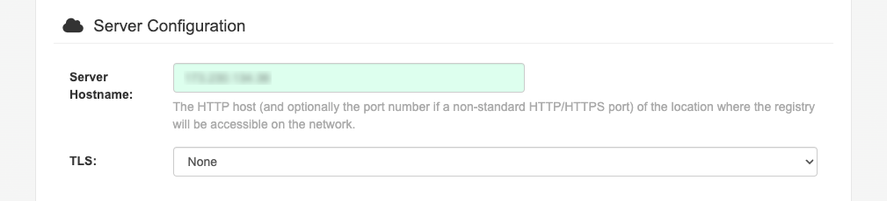
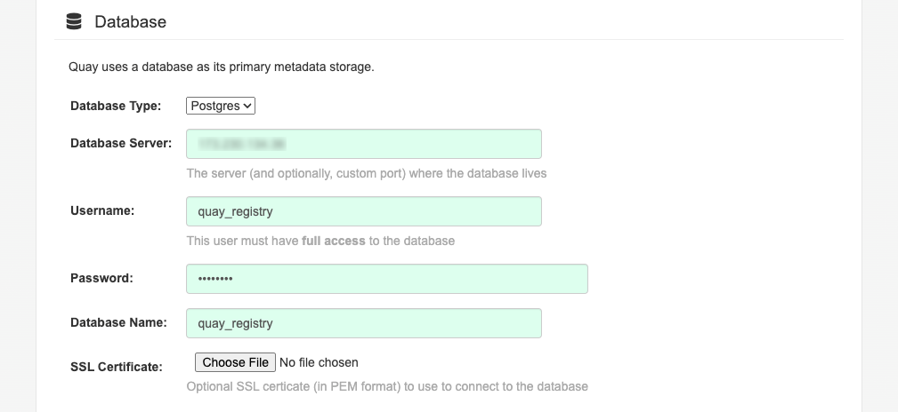
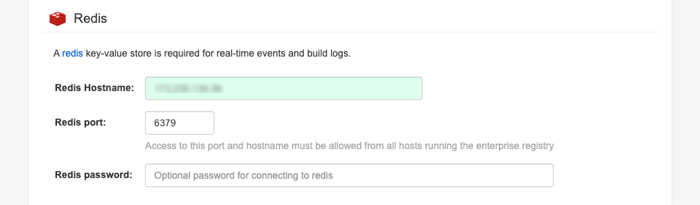
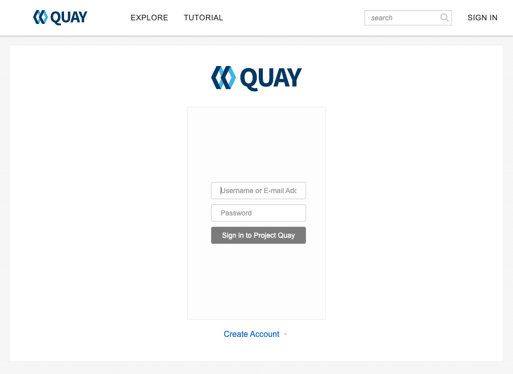
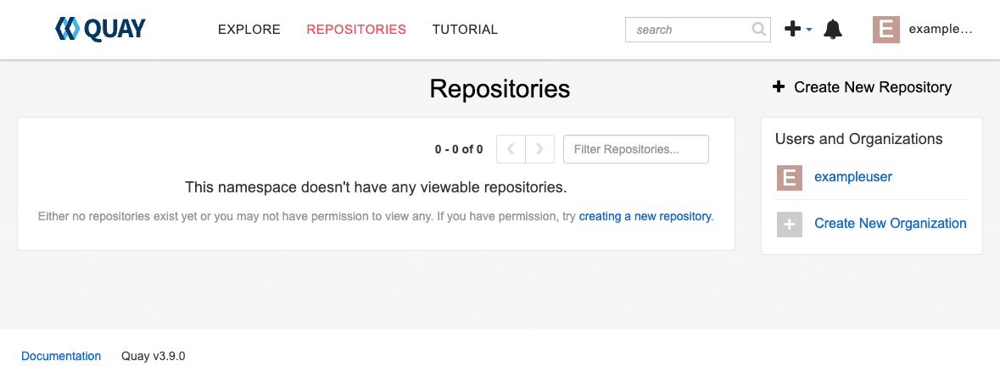
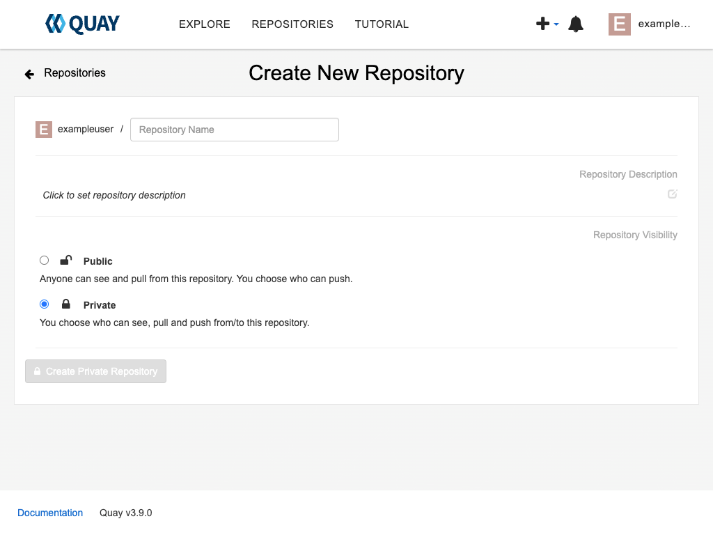
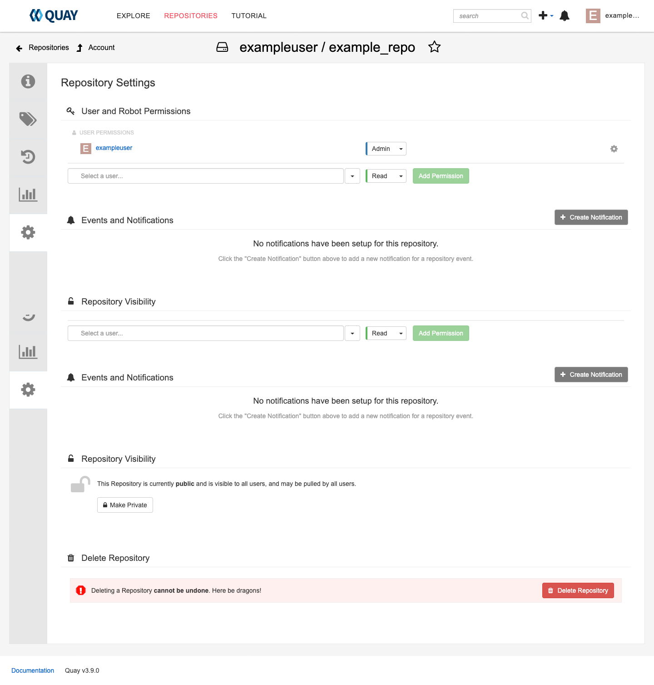

Docker doesn’t provide long term storage or image distribution capabilities, so developers need something more. [Docker Registry](https://docs.docker.com/registry/) performs these tasks, and using it guarantees the same application runtime environment through virtualization. However, building an image can involve a significant time investment, which is where [Quay](https://www.redhat.com/en/resources/quay-datasheet) (pronounced *kway*) comes in. A registry like Quay can both build and store containers. You can then deploy these containers in a shorter time and with less effort than using Docker Registry. This guide explains how Quay can be an essential part of the development process and details how to deploy a Quay registry.

## What is Red Hat Quay?

Red Hat Quay is a fault-tolerant and highly reliable registry equipped with the functionality needed to work in large-scale environments. Quay provides a purpose-built, centralized, and scalable registry platform that functions in a multi-cluster environment spanning multiple sites. Quay also analyzes container images for security vulnerabilities before you run them. This ensures that deployments spanning geographically separated areas don’t suffer from various forms of executable corruption. Also part of the security functionality, Quay offers granular access control. This means that developers working on a project adhere to the [principle of least privilege](https://www.paloaltonetworks.com/cyberpedia/what-is-the-principle-of-least-privilege), yet still have the rights needed to collaborate on tasks.

## Quay Features

Quay provides a wealth of features, broken down into the following categories:

-   **Security**:
    -   Secure container storage that provides access and authentication settings.
    -   Scans containers for added security.
    -   Continuously scans image content and provides reports on potential vulnerability issues.
    -   Uses existing authentication providers that rely on Lightweight Directory Access Protocol (LDAP) or OpenID Connect (OIDC).
    -   Logs and audits every security-related event in the system using long-term log storage.

-   **Flexibility**:
    -   Uses fine-grain access rules which allow you to isolate different user groups or enable collaboration between groups as needed.
    -   Allows a project to start small and scale to a much larger size without major project changes.
    -   Supports geographically distributed deployment with a single client entry point to boost performance.
    -   Provides a transparent cache of images stored in other container registries.
    -   Works with both cloud and offline environments, or a combination of the two.
    -   Incorporates support for a range of object storage services and third-party database systems.

-   **Developer Productivity**:
    -   Reduces the amount of work needed to build and deploy new containers.
    -   Makes it easier to manage storage growth through quota management.
    -   Provides source code management integration using simplified Continuous Integration (CI) pipelines.
    -   Maintains a "time machine" feature that protects against accidental deletion.

Often omitted in reviews of Quay is that it works with more than just Docker. It also works with products like [Rancher](https://www.rancher.com/), [Hyper-V](https://learn.microsoft.com/en-us/windows-server/virtualization/hyper-v/hyper-v-technology-overview), [Codefresh](https://codefresh.io/), and [Skopeo](https://github.com/containers/skopeo).

### When Should You Use Quay?

Quay can present some issues when working with it for the first time. For example, configuring the security features can be both time-consuming and error-prone. One of the biggest issues is that Quay isn’t really a single product, and knowing which flavor of Quay to choose can be confusing. Here is a quick overview of the various Quay flavors:

-   [**Project Quay**](https://www.projectquay.io/): This is the standalone, open source, container registry that is comparable to [Sonatype](https://www.sonatype.com/), [Nexus Repository OSS](https://www.sonatype.com/products/sonatype-nexus-oss), or [Harbor](https://goharbor.io/).
-   [**Red Hat Quay.io**](https://quay.io/plans/): This is the enterprise-level version of Quay that is priced by the number of private repositories you create. However, public repositories are free.
-   [**Red Hat Quay**](https://www.redhat.com/en/technologies/cloud-computing/quay): This is the enterprise-level version available through [Red Hat OpenShift](https://www.redhat.com/en/technologies/cloud-computing/openshift) for use in creating private repositories.

First, you need to choose the right flavor of Quay for the kind of project you want to create. Next, configure the Quay environment correctly before you begin using it. You want to limit use of Project Quay to experimentation or small projects, while Red Hat Quay is more appropriate for huge projects.

## Before You Begin

1.  If you have not already done so, create a Linode account and Compute Instance. Use a minimum of a Linode 4 GB plan to create a Quay setup on CentOS Stream. See our [Getting Started with Linode](/docs/guides/getting-started/) and [Creating a Compute Instance](/docs/guides/creating-a-compute-instance/) guides.

1.  Follow our [Setting Up and Securing a Compute Instance](/docs/guides/set-up-and-secure/) guide to update your system. You may also wish to set the timezone, configure your hostname, create a limited user account, and harden SSH access.

1.  This guide used Docker to run Quay containers. To install Docker, follow the instructions in our [Installing and Using Docker on CentOS and Fedora](/docs/guides/installing-and-using-docker-on-centos-and-fedora/) guide through the *Managing Docker with a Non-Root User* section. Verify that Docker is ready for use with the `docker version` command. This guide uses [Docker Community Edition (CE) 24.0.7](https://www.ibm.com/docs/en/db2/11.5?topic=docker-downloading-installing-editions), but newer versions and the Docker Enterprise Edition (EE) should work.

1.  This guide uses PostgreSQL database for Quay's required long-term metadata storage (this database isn’t used for images). To install PostgreSQL, follow our [Install and Use PostgreSQL on CentOS 8](/docs/guides/centos-install-and-use-postgresql/) guide (this guide also works with CentOS Stream 9) up until the *Using PostgreSQL* section. Make sure you configure PostgreSQL to start automatically after a server restart.

    
    Avoid using MariaDB for your installation because the use of MariaDB is deprecated in recent versions of Quay. After installing and securing PostgreSQL, create a Quay database.
    

1.  Quay uses Redis for short-term storage of real time events. To install Redis, follow our [Install and Configure Redis on CentOS 7](/docs/guides/install-and-configure-redis-on-centos-7/) guide (it also works with CentOS Stream 8 and 9) through the *Verify the Installation* section.


This guide is written for a non-root user. Commands that require elevated privileges are prefixed with `sudo`. If you’re not familiar with the `sudo` command, see the [Users and Groups](/docs/tools-reference/linux-users-and-groups/) guide.


## Creating a Quay Setup on Top of CentOS Stream on a Server

This section walks through creating a small Quay setup to use for experimentation or a small project. Perform a system update before continuing.

## Deploying a Database

Follow the steps below to create and configure a PostgreSQL database for Quay:

1.  Open a `psql` prompt using the `postgres` administrative account:

    ```command
    sudo -u postgres psql
    ```

    If prompted, provide the password you supplied when securing PostgreSQL:

    ```output
    postgres=#
    ```

1.  Create a new example `quay_registry` database:

    ```command
    CREATE DATABASE quay_registry;
    ```

    ```output
    CREATE DATABASE
    ```

1.  Verify the database is present:

    ```command
    \l
    ```

    ```output
                                        List of databases
         Name      |  Owner   | Encoding |   Collate   |    Ctype    |   Access privileges
    ---------------+----------+----------+-------------+-------------+-----------------------
     postgres      | postgres | UTF8     | en_US.UTF-8 | en_US.UTF-8 |
     quay_registry | postgres | UTF8     | en_US.UTF-8 | en_US.UTF-8 |
     template0     | postgres | UTF8     | en_US.UTF-8 | en_US.UTF-8 | =c/postgres          +
                   |          |          |             |             | postgres=CTc/postgres
     template1     | postgres | UTF8     | en_US.UTF-8 | en_US.UTF-8 | =c/postgres          +
                   |          |          |             |             | postgres=CTc/postgres
    (4 rows)
    ```

1.  Create a new example `quay_registry` user and provide it with a password:

    ```command
    CREATE USER quay_registry WITH encrypted password 'EXAMPLE_PASSWORD';
    ```

    ```output
    CREATE ROLE
    ```

1.  Ensure that the Quay user is present:

    ```command
    \du
    ```

    ```output
                                         List of roles
       Role name   |                         Attributes                         | Member of
    ---------------+------------------------------------------------------------+-----------
     postgres      | Superuser, Create role, Create DB, Replication, Bypass RLS | {}
     quay_registry |                                                            | {}
    ```

1.  Grant the Quay user rights to the Quay database:

    ```command
    GRANT ALL PRIVILEGES ON DATABASE quay_registry TO quay_registry;
    ```

    ```output
    GRANT
    ```

1.  Verify that the rights are in place:

    ```command
    \l quay_registry
    ```

    ```output
                                          List of databases
         Name      |  Owner   | Encoding |   Collate   |    Ctype    |     Access privileges
    ---------------+----------+----------+-------------+-------------+----------------------------
     quay_registry | postgres | UTF8     | en_US.UTF-8 | en_US.UTF-8 | =Tc/postgres              +
                   |          |          |             |             | postgres=CTc/postgres     +
                   |          |          |             |             | quay_registry=CTc/postgres
    (1 row)
    ```

1.  Enter the `quay_registry` database:

    ```command
    \c quay_registry
    ```

    ```output
    You are now connected to database "quay_registry" as user "postgres".
    ```

1.  Install the `pg_tgrm` extension:

    ```command
    CREATE EXTENSION pg_trgm;
    ```

    ```output
    CREATE EXTENSION
    ```

1.  Verify that the `pg_trgm` extension is installed:

    ```command
    SELECT * FROM pg_extension WHERE extname = 'pg_trgm';
    ```

    ```output
      oid  | extname | extowner | extnamespace | extrelocatable | extversion | extconfig | extcondition
    -------+---------+----------+--------------+----------------+------------+-----------+--------------
     16396 | pg_trgm |       10 |         2200 | t              | 1.5        |           |
    (1 row)
    ```

1.  Exit the `psql` shell:

    ```command
    \q
    ```

1.  Open the `pg_hba.conf` file, normally located at `/var/lib/pgsql/data/`, in a text editor with administrative privileges:

    ```command
    sudo nano /var/lib/pgsql/data/pg_hba.conf
    ```

    Modify the `pg_hba.conf` file to allow for remote connections by editing the `# IPv4 local connections:` line to appear like the following:

    ```file {title="/var/lib/pgsql/data/pg_hba.conf" lang="aconf"}
    # IPv4 local connections:
    host    all             all          0.0.0.0/0               md5
    ```

    When done, press <kbd>CTRL</kbd>+<kbd>X</kbd>, followed by <kbd>Y</kbd> then <kbd>Enter</kbd> to save the file and exit `nano`.

1.  Now open the `postgresql.conf` file, normally located in `/var/lib/pgsql/data/`:

    ```command
    sudo nano /var/lib/pgsql/data/postgresql.conf
    ```

    Modify the `postgresql.conf` file to listen on all addresses by modifying the `listen_addresses` line like the following:

    ```file {title="/var/lib/pgsql/data/postgresql.conf" lang="aconf"}
    listen_addresses = '*'
    ```

    When done, press <kbd>CTRL</kbd>+<kbd>X</kbd>, followed by <kbd>Y</kbd> then <kbd>Enter</kbd> to save the file and exit `nano`.

1.  Restart the server for these changes to take effect:

    ```command
    sudo systemctl restart postgresql
    ```

### Configuring Redis

Perform the following additional Redis configuration tasks for Quay.

1.  Create a Redis configuration file:

    ```command
    sudo nano /etc/redis/redis.conf
    ```

    Comment out the line that reads `bind 127.0.0.1 ::1` and add a new line underneath containing `bind 0.0.0.0`:

    ```file { title="/etc/redis/redis.conf" lang="aconf" hl_lines="2,3"}
    #bind 127.0.0.1 -::1
    bind 0.0.0.0
    ```

    When done, press <kbd>CTRL</kbd>+<kbd>X</kbd>, followed by <kbd>Y</kbd> then <kbd>Enter</kbd> to save the file and exit `nano`:

1.  Ensure the change take effect:

    ```command
    sudo systemctl restart redis
    ```

1.  Confirm that Redis is ready to use:

    ```command
    systemctl status redis
    ```

1.  Verify that Redis is listening at port `6379`:

    ```command
    ss -tunelp | grep 6379
    ```

    ```output
    tcp   LISTEN 0      511          0.0.0.0:6379      0.0.0.0:*    uid:992 ino:73370 sk:1001 cgroup:/system.slice/redis.service <->
    ```

### Generating the Quay Configuration

It’s time to install a copy of Quay. This guide uses the free and open source Project Quay version discussed earlier.

1.  Obtain a copy of Quay:

    ```command
    docker pull quay.io/projectquay/quay:v3.9.0
    ```

    ```output
    v3.9.0: Pulling from projectquay/quay
    57168402cb72: Pull complete
    3d50b44561f0: Pull complete
    e42a14c55ca9: Pull complete
    2d3027ebf95a: Pull complete
    0422499b4b00: Pull complete
    27f2a5fad2e5: Pull complete
    60b93bda04c7: Pull complete
    15f0806a68f5: Pull complete
    Digest: sha256:633818d2122a463e3aad8febbdc607a2e4df95db38b308fad8c071a60518f0a5
    Status: Downloaded newer image for quay.io/projectquay/quay:v3.9.0
    quay.io/projectquay/quay:v3.9.0
    ```

1.  Verify the download by running `echo` inside the container:

    ```command
    docker run quay.io/projectquay/quay:v3.9.0 /bin/echo "Welcome to the Docker World!"
    ```

    ```output
    "Welcome to the Docker World!"
       __   __
      /  \ /  \     ______   _    _     __   __   __
     / /\ / /\ \   /  __  \ | |  | |   /  \  \ \ / /
    / /  / /  \ \  | |  | | | |  | |  / /\ \  \   /
    \ \  \ \  / /  | |__| | | |__| | / ____ \  | |
     \ \/ \ \/ /   \_  ___/  \____/ /_/    \_\ |_|
      \__/ \__/      \ \__
                      \___\ by Red Hat
     Build, Store, and Distribute your Containers
    Running '/bin/echo'
    Welcome to the Docker World!
    ```

1.  Start the application to allow access to the configuration settings. Because the system doesn’t have a public key configured, this setup uses port `8080` and an `http` connection.

    ```command
    docker run -p 8080:8080 quay.io/projectquay/quay:v3.9.0 config EXAMPLE_PASSWORD
    ```

    ```output
       __   __
      /  \ /  \     ______   _    _     __   __   __
     / /\ / /\ \   /  __  \ | |  | |   /  \  \ \ / /
    / /  / /  \ \  | |  | | | |  | |  / /\ \  \   /
    \ \  \ \  / /  | |__| | | |__| | / ____ \  | |
     \ \/ \ \/ /   \_  ___/  \____/ /_/    \_\ |_|
      \__/ \__/      \ \__
                      \___\ by Red Hat
     Build, Store, and Distribute your Containers

    Startup timestamp:
    Fri Nov 10 02:00:57 UTC 2023

    Running all default config services
    2023-11-10 02:00:58,247 INFO RPC interface 'supervisor' initialized
    2023-11-10 02:00:58,247 CRIT Server 'unix_http_server' running without any HTTP authentication checking
    2023-11-10 02:00:58,247 INFO supervisord started with pid 8
    2023-11-10 02:00:59,250 INFO spawned: 'stdout' with pid 25
    2023-11-10 02:00:59,252 INFO spawned: 'config-editor' with pid 26
    2023-11-10 02:00:59,254 INFO spawned: 'quotaregistrysizeworker' with pid 27
    2023-11-10 02:00:59,257 INFO spawned: 'quotatotalworker' with pid 28
    2023-11-10 02:01:00,321 INFO success: stdout entered RUNNING state, process has stayed up for > than 1 seconds (startsecs)
    2023-11-10 02:01:00,322 INFO success: config-editor entered RUNNING state, process has stayed up for > than 1 seconds (startsecs)
    2023-11-10 02:01:00,322 INFO success: quotaregistrysizeworker entered RUNNING state, process has stayed up for > than 1 seconds (startsecs)
    2023-11-10 02:01:00,322 INFO success: quotatotalworker entered RUNNING state, process has stayed up for > than 1 seconds (startsecs)
    config-editor stdout | time="2023-11-10T02:00:59Z" level=warning msg="An error occurred loading TLS: No public key provided for HTTPS. Server falling back to HTTP."
    config-editor stdout | time="2023-11-10T02:00:59Z" level=info msg="Running the configuration editor with HTTP on port 8080 with username quayconfig"
    ```

1.  Open a web browser and use the following address format to access Quay: `http://YOUR_IP_ADDRESS:8080/`.

1.  When requested, supply `quayconfig` as the username along with the password you chose in step three.

1.  You need to fill out seven fields across the **Server Configuration**, **Database**, and **Redis** sections:

    -   In the **Server Configuration** section, enter your Akamai Cloud Compute Instance's public IPv4 Address for the **Server Hostname** field:

        

    -   In the **Database** section, select **Postgres** from the **Database Type** dropdown menu:

        

        Enter your Akamai Cloud Compute Instance's public IPv4 Address for the **Database Server** field. Enter `quay_registry` for both the **Username** and **Database Name** fields. For the **Password** field, enter the password you chose in step three.

    -   In the **Redis** section, enter your Akamai Cloud Compute Instance's public IPv4 Address for the **Redis Hostname** field:

        

    
    See [Chapter 4. Configuring Red Hat Quay](https://access.redhat.com/documentation/en-us/red_hat_quay/3.3/html/deploy_red_hat_quay_-_basic/configuring_red_hat_quay) of the official documentation for further options to configure your Quay instance.
    

1.  When done, click the **Validate Configuration Changes** button at the bottom of the screen. If successful, click the **Download** button to download the `quay-config.tar.gz` file.

1.  Return to the terminal and kill the running Quay server by pressing the <kbd>CTRL</kbd>+<kbd>C</kbd> key combination.

1.  Transfer the `quay-config.tar.gz` file to your user's home (`~/`) directory on your Akamai Cloud Compute Instance.

1.  Create storage and configuration directories, then copy the `quay-config.tar.gz` file to the configuration directory:

    ```command
    sudo mkdir -p /data/quay/storage
    sudo mkdir -p /data/quay/config
    sudo cp quay-config.tar.gz /data/quay/config/
    ```

1.  Change into the configuration directory and unarchive the required configuration data from the `quay-config.tar.gz` file:

    ```command
    cd /data/quay/config/
    sudo tar xvf quay-config.tar.gz
    ```

1.  Restart the Quay server with the new configuration:

    ```command
    docker run --restart=always -p 8080:8080 \
      --sysctl net.core.somaxconn=4096 \
      -v /data/quay/config:/conf/stack:Z \
      -v /data/quay/storage:/datastorage:Z \
      quay.io/projectquay/quay:v3.9.0
    ```

Starting Quay like this provides you with a continuously scrolling screen of updates so you can monitor registry activity.

## Deploying a Quay Registry

1.  With server now configured to work with Quay, access the registry at `http://YOUR_IP ADDRESS:8080/` in your web browser. During your first access, you see the Quay repository screen:

    

1.  Click **Create Account** to create a new account. Once you create a new account, you see a new screen telling you that your account has no repositories:

    

1.  Click **Creating a New Repository** to create your first repository. The next screen begins by asking you for a repository name, which must use a number or lowercase letter (uppercase letters may cause Quay to reject the name).

    

1.  Choose between a public or private repository, then click the associated **Create** button.

1.  Filling the repository begins by issuing either a docker or a podman pull command to obtain the application container. After obtaining the code, you can add tags to it.

1.  There is also a **Repository Settings** tab where you can configure the repository details. Part of these settings is to add or remove users and adjust specific repository rights: read, write, and admin. You can also configure events and notifications based on repository activity to keep everyone on the project informed about changes.

    

1.  To create additional repositories, click the **+** icon, then choose **New Repository** from the drop down list. [Chapter 1. Creating a repository](https://access.redhat.com/documentation/en-us/red_hat_quay/3.2/html/use_red_hat_quay/creating_a_repository) provides you with additional details on working with repositories using Quay.

## Conclusion

Quay provides the means to enhance container development in three ways: improved security, greater flexibility, and enhanced developer productivity. To obtain these benefits, you need to perform a multi-part installation of a number of software products. This is so that Quay has the resources needed to perform the required tasks. However, this adds to development environment complexity. Consequently, there is a tradeoff between the benefits of Quay and the associated need to perform additional configuration tasks. If you want to develop something beyond a simple project, also consider the costs of using Red Hat Quay instead of Project Quay.