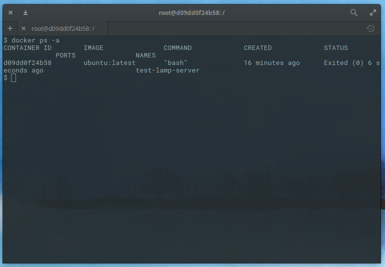
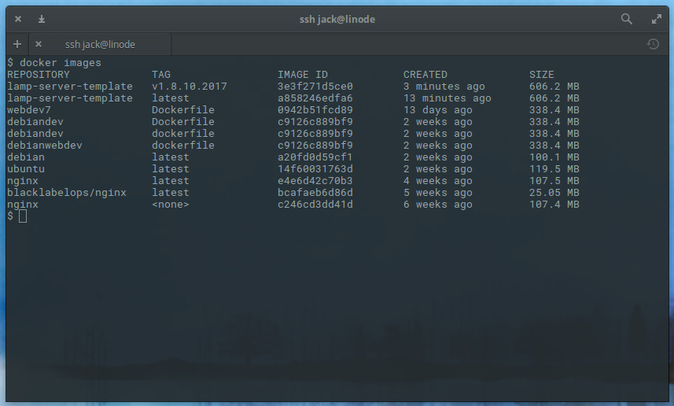
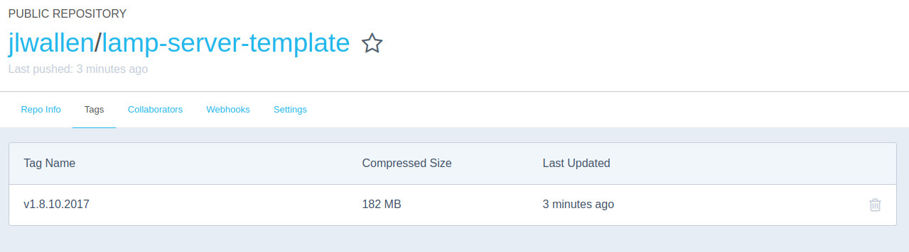

Docker makes it easy to develop and deploy custom and consistent environments that include specific applications and dependencies. Docker calls these compilations Images. Docker images can be hosted and retrieved from private locations or from the official repository, [Docker Hub](https://hub.docker.com/).

This guide is part of a series of introductions to Docker concepts. The commands to create an image in this guide build on the previous guide, [How to Install and Pull Images for Container Deployment](/docs/guides/installing-and-using-docker-on-ubuntu-and-debian/). For more information about Docker and containers, visit our [guides on Containers](/docs/applications/containers/).

## Create a Docker Image

Create a new local image based on the latest Ubuntu Docker image. Although the repository already has a number of LAMP stack images available, we create one in this guide as an example of the process.

1. Pull the latest Ubuntu image:

        docker pull ubuntu

2.  Create the new container, such that we can add our LAMP stack to Ubuntu. This example names the container `lamp-server-template` and adds the `bash` option to the docker command to enter the container in order to continue making changes:

        docker run --name lamp-server-template -it ubuntu:latest bash

3.  Install the `lamp-server` metapackage inside the container:

        apt-get install lamp-server^

    This upgrade and installation will take longer than it would if you were working on a standard server. During the installation of the LAMP stack, you will be prompted to create a MySQL root user password. When the installation completes, exit the container:

        exit

4.  Use `docker ps -a` to list all of the available containers:

    

## Commit Changes to the Image

To commit changes to the image, we must first have the container ID. As with the example above, the `docker ps -a` command lists the ID as `d09dd0f24b58`. We’re going to name our new image `lamp-server-template` and commit the changes with the command:

    docker commit d09dd0f24b58 lamp-server-template

If you run the `docker images` command, you’ll see the new image, `lamp-server-template` listed.

## Tag Your Image for Version Control

When you pull down an image from Docker Hub, the `Status` line includes the *image tag* as shown here:

    Status: Downloaded newer image for ubuntu:latest

Docker tags are an easy way for you to know what version or release you are working with. This is especially useful for creating new images from a base image. For example, if you have a Ubuntu image you use as a base to create different images, Docker tags help you track the differences:

    lamp-server-template:v1.8.10.2017
    lamp-server-template:v2.8.10.2017
    lamp-server-template:v3.8.10.2017

1.  Create image tags with a `docker commit`. Using the example tags above, tag the new image with a version number and date:

        docker commit d09dd0f24b58 lamp-server-template:v1.8.10.2017

2.  Run `docker images` to see the new image created along with the associated tag:

    

## Push Your Image to Docker Hub

1.  Before pushing the image to Docker Hub, add a description, your full name (`FULL NAME` in the example here), and Docker Hub username (`USERNAME`) in the `docker commit`:

        docker commit -m "Added LAMP Server" -a "FULL NAME" d09dd0f24b58 USERNAME/lamp-server-template:v1.8.10.2017

2.  Once this is fully tagged, log in and push it to Docker Hub:

        docker login

3.  You will be prompted for your Docker Hub credentials. When authentication succeeds, you will see `Login succeeded`. Now, you can push the image to the Hub with the command:

        docker push lamp-server-template:v1.8.10.2017

4.  Open a browser, log in to your Docker Hub account, and go your main repository. You will see the new image listed. Click on the image and then click on the **Tags** tab to see the added tag:

    

And that is all there is to creating a new image, changing the image, committing your changes, tagging the image, and pushing the complete image to Docker Hub, all handled directly from your Linode.
