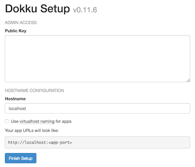

Dokku is a self-hosted Platform-as-a-Service (PaaS) that makes deploying applications simple using Git. Although Dokku's implementation is similar to Heroku, it lacks certain key features such as auto-scaling. Dokku is an extremely powerful tool that automatically runs your application inside Docker and requires minimal configuration of web servers.

This guide demonstrates how to:

 - Create a Flask application that returns 'Hello World!' on the index page
 - Install Dokku on a Linode
 - Deploy a Flask application with a WSGI server inside a Docker container
 - Add an SSL certificate through Dokku with the Let's Encrypt plugin

## Before You Begin

### On Your Local Computer


Dokku v0.12.5 is compatible with Ubuntu 16.04 x64, Ubuntu 14.04 x64, and Debian 8.2 x64. CentOS 7 x64 is only supported experimentally, and as such some steps like configuring SSH keys and virtual hosts must be done manually using the dokku command line interface. See [the official documentation](http://dokku.viewdocs.io/dokku~v0.12.5/getting-started/installation/) for more information.


A [public key](/docs/guides/use-public-key-authentication-with-ssh/) is assumed to be available. Typically this is located in `~/home/username/.ssh/id_rsa.pub`.

Install Git if needed:

    sudo apt install git

### On Your Linode

The Dokku install script creates a `dokku` user on the system, installs Docker, and pulls the relevant image.

1.  Download the install script from Dokku then run the script:

        wget https://raw.githubusercontent.com/dokku/dokku/v0.12.5/bootstrap.sh
        sudo DOKKU_TAG=v0.12.5 bash bootstrap.sh

    
Preparing to install v0.11.6 from https://github.com/dokku/dokku.git...
For dokku to build containers, it is strongly suggested that you have 1024 megabytes or more of free memory
If necessary, please consult this document to setup swap: http://dokku.viewdocs.io/dokku/advanced-installation/#vms-with-less-than-1gb-of-memory
--> Ensuring we have the proper dependencies
--> Initial apt-get update
--> Installing docker
--> NOTE: Using Linode? Docker may complain about missing AUFS support.
    You can safely ignore this warning.
        Installation will continue in 10 seconds.
...


2.  Navigate to the public IP address of your Linode in a browser and enter the public key:

    

    
Add the public key immediately after running the installation script to avoid someone else adding a public key to Dokku. For an unattended installation, refer to the [advanced installation instructions](https://github.com/dokku/dokku/blob/master/docs/getting-started/advanced-installation.md).


3.  To add additional SSH keys, pipe the output over SSH to the `dokku` user. Replace `example.com` with the IP address of your Linode.

        cat ~/.ssh/id_rsa.pub | ssh dokku@example.com ssh-keys:add new-key

## Create a Flask Application

1.  On your local computer, create a new project directory:

        mkdir flask-example && cd flask-example

2.  Create a new file called `hello_world.py` that serves 'Hello World!' on the index page.

    
import os

from flask import Flask

app = Flask(__name__)

@app.route('/')
def hello():
    return 'Hello World!'

if __name__ == '__main__':
    # Bind to PORT if defined, otherwise default to 5000.
    port = int(os.environ.get('PORT', 5000))
    app.run(host='127.0.0.1', port=port)


3.  Add a `requirements.txt` file to track versions of any dependencies of the Flask application. Gunicorn is the WSGI server used to allow Flask to interface properly with NGINX.

    
Flask==0.12.1
gunicorn==19.7.1


4.  For more complex projects with many dependencies using a virtual environment, redirect output of `pip freeze` into `requirements.txt`.

        pip freeze > requirements.txt

### Add a gitignore

Optionally, add a `.gitignore` file to have Git omit caching and virtual environment files from version control.


__pycache__/
*.pyc

venv/


### Procfile

The Procfile tells the Gunicorn server what command to use when launching the app:


web: gunicorn hello_world:app --workers=4



4 workers is a good default for an web app running on a Linode. See the [Gunicorn docs](http://docs.gunicorn.org/en/stable/design.html#how-many-workers) for more information about determining the correct number of workers for your particular app.


### Git Remote

1.  Initialize a Git repository:

        git init
        git add .
        git commit -m "Deploy Flask with Dokku"

2.  Add a remote named `dokku` with the username `dokku` and substitute `example.com` with the public IP address of your Linode:

        git remote add dokku dokku@example.com:flask-example

3.  Verify the remote is added:

        git remote -v

    This will list the remotes.

    
dokku   dokku@example-ip:flask-example (fetch)
dokku   dokku@example-ip:flask-example (push)


    In summary, the project layout looks like:

        flask-example
        ├── .gitignore
        ├── Procfile
        ├── hello_world.py
        └── requirements.txt

## Create Project on a Dokku Host

1.  SSH into your Linode and create the application:

        dokku apps:create flask-example

2.  Make sure VHOST is enabled.

        dokku domains:enable flask-example

## Deploy a Flask Application

1.  On your local computer, deploy the Flask application by pushing the branch to the `dokku` remote. This will take care of NGINX behind the scenes and expose port `80`:

        git push dokku master

    Other local branches can also be deployed but, all branches must be pushed to the master branch of the `dokku` remote:

        git push dokku branch-name:master

2.  `curl` the IP address of your Linode to test that the app was deployed successfully:

        curl example.com

    
Hello World!


###  SSL Certificate with Dokku and Let's Encrypt

The remaining steps in this guide should be performed from your Linode.

1.  Install the Let's Encrypt plugin for Dokku:

        sudo dokku plugin:install https://github.com/dokku/dokku-letsencrypt.git

2.  Set the `DOKKU_LETSENCRYPT_EMAIL` environment variable to the email for Let's Encrypt:

        dokku config:set flask-example DOKKU_LETSENCRYPT_EMAIL=docs@linode.com

3.  Add the application and domain:

        dokku domains:add flask-example example.com

4.  Create the SSL certificate. NGINX will automatically start serving the application over HTTPS on port 443:

         dokku letsencrypt flask-example

5.  Run this as a cron job so the certificate will renew automatically:.

        dokku letsencrypt:cron-job --add

    
This requires Dokku version 0.5 or higher. Check by running `dokku version`.


## Start, Stop, and Restart Applications

* List all running Dokku applications:

        dokku apps

* Restart an application:

        dokku ps:restart flask-example

* Stop an application:

        dokku ps:stop flask-example

* Restore all applications after a reboot:

        dokku ps:restore

### View Application Logs

View the application logs through Dokku or the Docker container.

1.  To see logs through Dokku:

        dokku logs flask-example

2.  List all running Docker containers:

        sudo docker ps -a

3.  Find the container ID then run:

        sudo docker logs container_id

## Scale Applications

Dokku does not scale applications automatically, and by default will only run a single `web` process. To increase the number of containers running your application, you can use the `ps:scale` command.

1.  Check how many workers your application currently has:

        dokku ps:scale flask-example

    
-----> Scaling for flask-example
-----> proctype           qty
-----> --------           ---
-----> web                1


2.  Scale up to 4 `web` processes:

        dokku ps:scale flask-example web=4

3.  Confirm that the new processes are running:

    
-----> Scaling for flask-example
-----> proctype           qty
-----> --------           ---
-----> web                4


Dokku is an open source alternative to Heroku for small applications. Deploying applications is as simple as pushing to a remote with Git. Elements such as Docker and NGINX are abstracted away to minimize time to deployment. There are additional features such as [pre-deploy hooks](http://dokku.viewdocs.io/dokku/advanced-usage/deployment-tasks/) and linking databases which are not shown in this guide.
