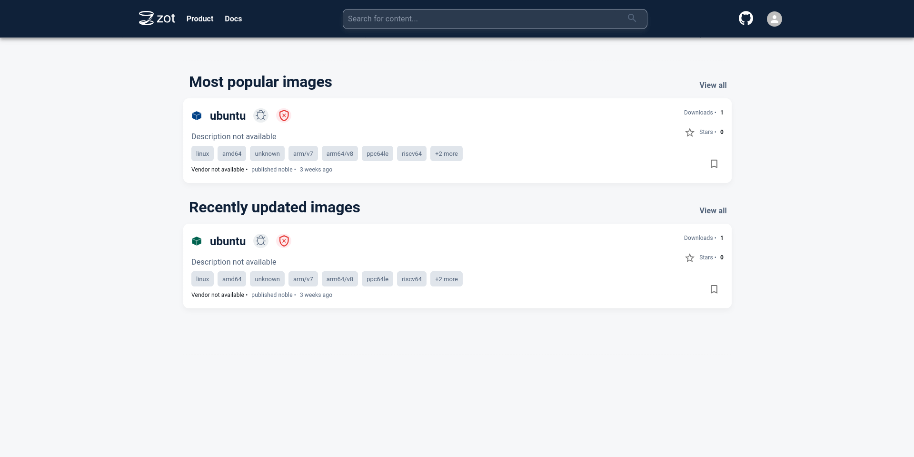

From hobbyists working on their latest and greatest side project all the way to engineers shipping the next version of their enterprise-ready application at work, a wide group of developers frequently make use of containers in their day-to-day work.

Many tools have been developed around the container ecosystem and a common standard known as Open Container Initiative (OCI) facilitates interoperability between these tools.

This guide explores storage and distribution of OCI container images with zot. This allows storing a freshly-baked container image and caching frequently used public images.

## What is zot?

[zot](https://zotregistry.dev) is a vendor-neutral OCI-native registry. It can run on different types of hardware ranging from embedded devices to large cloud virtual machines (VM).

Some of the features that make zot a great tool are:
- Awesome web-based user interface
- Command Line Interface (CLI) tool to interact with zot
- Security integrations including Single Sign-On (SSO) support with OpenID Connect (OIDC), htpasswd, and API keys
- Built-in artifact scanning with [Trivy](https://trivy.dev/latest/)
- Easy configuration file
- Support for multiple backends to store data such as S3-compatible services
- Options for scaling out high-scale deployments
- Single-binary application with multiple deployment options including standalone service and Kubernetes
- Support for Authorization via a permissions system
- Monitoring with built-in metrics

## Before You Begin

-  This guide uses an Akamai Cloud compute instance to run zot, but any other suitable machine also works fine. If you do not already have a VM to use, create a Compute Instance with at least 4 GB of memory. Check out the [Getting Started with Linode](/docs/products/platform/get-started/) and [Creating a Compute Instance](/docs/products/compute/compute-instances/guides/create/) guides to get the basics setup.

-  This guide uses the Ubuntu 24.04 LTS image available in Akamai Cloud. systemd will be used to run zot as a service. Any other Linux distributions that use systemd are also suitable to follow along with this guide.

-  You may also wish to set the timezone, configure your hostname, create a limited user account, and harden SSH access.


If the machine being used has an IP address which can be reached over the internet such as a VM on the public cloud, it is strongly recommended to take extra care and use a firewall along with strong credentials to prevent unauthorized access to the system.


-  On startup, zot will download some rather large artifacts for the image scanning feature. Ensure that the machine where zot is to be run has an internet connection that is not metered or has the necessary allowance to download large files which total approximately 1 GB in size.

- This guide makes use of htpasswd, on Ubuntu, this requires the `apache2-utils` package to be installed.

- This guide will use [podman](https://podman.io/) for working with OCI container images. This would need to be installed on the client you wish to download images to (the computer you are reading this guide on, for example). podman does not need to be installed on the server where zot will be deployed.

- TLS will be enabled for the registry as part of the steps in this guide. Ensure you have generated a set of certificates for the server to use. To learn more about SSL certification, check out our guides [Understanding TLS Certificates and Connections](/docs/guides/what-is-a-tls-certificate/) and [Securing Web Traffic Using Certbot](/docs/guides/enabling-https-using-certbot/). You may choose to use a proxy such as NGINX, however, this guide will configure zot to use TLS certificates directly.


This guide is written for a non-root user. Commands that require elevated privileges are prefixed with `sudo`. If you’re not familiar with the `sudo` command, see the [Users and Groups](/docs/guides/linux-users-and-groups/) guide.


## Deploying zot

This section will walk through the process of downloading, configuring, and running zot.

### Step 1: Create the zot user and directories

#### Create a dedicated user for zot


While it is optional to have a dedicated user for the service, it is recommended to create a dedicated user for zot with only the minimum permissions that it needs.


This command sets up the user:

```command
sudo adduser --no-create-home --gecos --disabled-password --disabled-login zot
```

You should see output similar to this:

```output
info: Adding user `zot' ...
info: Selecting UID/GID from range 1000 to 59999 ...
info: Adding new group `zot' (1001) ...
info: Adding new user `zot' (1001) with group `zot (1001)' ...
info: Not creating home directory `/home/zot'.
info: Adding new user `zot' to supplemental / extra groups `users' ...
info: Adding user `zot' to group `users' ...
```

#### Create directories to store zot stuff

The following directories will be created to store zot-related data:
1. data directory - `/data/zot`
2. log directory - `/var/log/zot`
3. config directory - `/etc/zot`

The following commands create the directories and also assign the correct permissions:

```command
sudo mkdir -p /data/zot
sudo chown -R zot:zot /data/zot

sudo mkdir -p /var/log/zot
sudo chown -R zot:zot /var/log/zot

sudo mkdir -p /etc/zot
sudo chown -R zot:zot /etc/zot
```

### Step 2: Identifying the right zot build to use

zot builds are all published on the [project's GitHub Releases page](https://github.com/project-zot/zot/releases).

There are builds for different CPU architectures and platforms.
For this guide, the machine plaform is `Linux` and has a CPU architecture of `amd64`.

zot is also built in 2 flavors - a "normal" version and a minimal version. The builds for the minimal version have a suffix of `-minimal`. The minimal version is intended for systems where only the OCI registry functionality is required. The normal version includes more features such as the UI, container scanning, etc. This guide will use the "normal" build.

Therefore, for this guide, the binary of choice would be `zot-linux-amd64`.


The latest version of zot available at the time of this guide is v2.1.8. It is recommended to deploy the latest stable version available for all the latest features and bug fixes.


### Step 3: Download the zot binary to the machine

The following command will download the zot v2.1.8 binary and place it into `/tmp` directory.

```command
wget https://github.com/project-zot/zot/releases/download/v2.1.8/zot-linux-amd64 -O /tmp/zot-linux-amd64
```

The binary can be checked for correctness and validity by checking the SHA256 checksum with the following commands:

```command {title="Download checksums"}
wget https://github.com/project-zot/zot/releases/download/v2.1.8/checksums.sha256.txt -O '/tmp/checkums.sha256.txt'
```

Navigate to `/tmp` and use the following command to verify the checksum:

```command {title="Verify checksums"}
cat './checkums.sha256.txt' | grep 'zot-linux-amd64$' | sha256sum -c
```

You would see output like below if the checksums match:

```output
zot-linux-amd64: OK
```

Next, move the binary to the destination and make it executable. Give the `zot` user and group ownership with the following commands:

```command
sudo mv /tmp/zot-linux-amd64 /usr/bin/zot
sudo chown zot:zot /usr/bin/zot
sudo chmod +x /usr/bin/zot
```

### Step 4: Login security

To protect logins for zot, an authentication mechanism is required. There are multiple ways to authenticate to zot, but for simplicity, this guide will use htpasswd.
The following command creates an htpasswd file which zot can be configured to use.
The first user is `testuser` and has a password of `test123`.

```command
sudo htpasswd -bBc /etc/zot/htpasswd testuser test123
```

You should see the output:

```output
Adding password for user testuser
```


The password the guide uses is a simple one, however, for an actual zot deployment, be sure to use a strong password - preferably one generated by a password generator.


### Step 5: Create a configuration file for zot

zot takes a single configuration file that contains all the required configuration for the application. [zot github repo's examples directory](https://github.com/project-zot/zot/tree/main/examples) has helpful example files that can used for various kinds of setups.

For this guide, a simple setup with UI, security scanning,and password authentication will suffice. The config file will be built-up step-by-step. The final sub-section contains the full configuration sample.

#### OCI Distribution Spec Version

First, the configuration of the version of distribution spec to be used. This will be set to the latest version at the time of writing which is `1.1.1`.

```file {title="/etc/zot/config.json" lang="json" hl_lines="2"}
{
  "distSpecVersion": "1.1.1"
}
```

#### Data Storage configuration

Next, zot needs to know where to store its local files. The highlighted config points it to the `/data/zot` directory created earlier:

```file {title="/etc/zot/config.json" lang="json" hl_lines="3-5"}
{
  "distSpecVersion": "1.1.1",
  "storage": {
    "rootDirectory": "/data/zot"
  }
}
```

#### Server Network configuration

zot interacts with clients over the network and needs to know which host and port to listen to for client connections. The highlighted portion of the config tells zot to listen to all interfaces on the machine on port 8080.

```file {title="/etc/zot/config.json" lang="json" hl_lines="6-9"}
{
  "distSpecVersion": "1.1.1",
  "storage": {
    "rootDirectory": "/data/zot"
  },
  "http": {
    "address": "0.0.0.0",
    "port": "8080"
  }
}
```

#### Log Path configuration

zot logs typically print to the console, however, a dedicated directory was created earlier for storing logs. The following highlighted config tells zot to write logs to the given file path at the `info` level.

```file {title="/etc/zot/config.json" lang="json" hl_lines="10-13"}
{
  "distSpecVersion": "1.1.1",
  "storage": {
    "rootDirectory": "/data/zot"
  },
  "http": {
    "address": "0.0.0.0",
    "port": "8080"
  },
  "log": {
    "level": "info",
    "output": "/var/log/zot/zot.log"
  }
}
```

#### Login security configuration

zot needs to know about the htpasswd file that was created earlier. The following highlighted config tells zot that authentication method is htpasswd and where it can find the file:

```file {title="/etc/zot/config.json" lang="json" hl_lines="9-13"}
{
  "distSpecVersion": "1.1.1",
  "storage": {
    "rootDirectory": "/data/zot"
  },
  "http": {
    "address": "0.0.0.0",
    "port": "8080",
    "auth": {
        "htpasswd": {
            "path": "/etc/zot/htpasswd"
        }
    }
  },
  "log": {
    "level": "info",
    "output": "/var/log/zot/zot.log"
  }
}
```

Additionally, enable API key support for use with external OCI tools. The highlighted section below indicates the required configuration:

```file {title="/etc/zot/config.json" lang="json" hl_lines="13"}
{
  "distSpecVersion": "1.1.1",
  "storage": {
    "rootDirectory": "/data/zot"
  },
  "http": {
    "address": "0.0.0.0",
    "port": "8080",
    "auth": {
        "htpasswd": {
            "path": "/etc/zot/htpasswd"
        },
        "apikey": true
    }
  },
  "log": {
    "level": "info",
    "output": "/var/log/zot/zot.log"
  }
}
```

#### Enable UI and Scanning extensions

The zot UI and container scanning functionality are part of extensions configuration and can be enabled as follows:

```file {title="/etc/zot/config.json" lang="json" hl_lines="20-29"}
{
  "distSpecVersion": "1.1.1",
  "storage": {
    "rootDirectory": "/data/zot"
  },
  "http": {
    "address": "0.0.0.0",
    "port": "8080",
    "auth": {
        "htpasswd": {
            "path": "/etc/zot/htpasswd"
        },
        "apikey": true
    }
  },
  "log": {
    "level": "info",
    "output": "/var/log/zot/zot.log"
  },
  "extensions": {
    "search": {
      "cve": {
        "updateInterval": "2h"
      }
    },
    "ui": {
      "enable": true
    }
  }
}
```

#### Enable Registry synchronization

In order for zot to act as a pull-through cache, a configuration for a remote registry can be added to the config file. This guide will use [DockerHub](https://hub.docker.com/) as the remote registry. zot will download and locally store any requested images on demand.

```file {title="/etc/zot/config.json" lang="json" hl_lines="29-38"}
{
  "distSpecVersion": "1.1.1",
  "storage": {
    "rootDirectory": "/data/zot"
  },
  "http": {
    "address": "0.0.0.0",
    "port": "8080",
    "auth": {
        "htpasswd": {
            "path": "/etc/zot/htpasswd"
        },
        "apikey": true
    }
  },
  "log": {
    "level": "info",
    "output": "/var/log/zot/zot.log"
  },
  "extensions": {
    "search": {
      "cve": {
        "updateInterval": "2h"
      }
    },
    "ui": {
      "enable": true
    },
    "sync": {
      "enable": true,
      "registries": [
        {
          "urls": ["https://docker.io/library"],
          "onDemand": true,
          "tlsVerify": true
        }
      ]
    }
  }
}
```

More information about sync settings can be found in the [zot documentation](https://zotregistry.dev/v2.1.8/admin-guide/admin-configuration/?h=sync#syncing-and-mirroring-registries).

#### Enable TLS

For security, enable TLS with the following config. Replace  and  with the paths to your web certificate and key files respectively.


Ensure that the `zot` user created earlier is able to access the certificate and key files.


```file {title="/etc/zot/config.json" lang="json" hl_lines="15-18"}
{
  "distSpecVersion": "1.1.1",
  "storage": {
    "rootDirectory": "/data/zot"
  },
  "http": {
    "address": "0.0.0.0",
    "port": "8080",
    "auth": {
        "htpasswd": {
            "path": "/etc/zot/htpasswd"
        },
        "apikey": true
    },
    "tls": {
      "cert": "",
      "key": ""
    }
  },
  "log": {
    "level": "info",
    "output": "/var/log/zot/zot.log"
  },
  "extensions": {
    "search": {
      "cve": {
        "updateInterval": "2h"
      }
    },
    "ui": {
      "enable": true
    },
    "sync": {
      "enable": true,
      "registries": [
        {
          "urls": ["https://docker.io/library"],
          "onDemand": true,
          "tlsVerify": true
        }
      ]
    }
  }
}
```

### Step 6: Verify the configuration

```command
sudo -u zot /usr/bin/zot verify /etc/zot/config.json
```

If everything is in good shape, the following output should be seen:

```output
{"level":"info","config":"/etc/zot/config.json","time":<TIMESTAMP>,"message":"config file is valid"}
```

### Step 7: Creating the systemd service file

The following `systemd` service file will run the the zot service:

```file {title="/etc/systemd/system/zot.service"}
[Unit]
Description=zot registry
Documentation=https://zotregistry.dev/
After=network.target

[Service]
Type=simple
ExecStart=/usr/bin/zot serve /etc/zot/config.json
User=zot
Group=zot

[Install]
WantedBy=multi-user.target
```

For the service file to get picked up, after creating the file, run the following systemd reload command:

```command
sudo systemctl daemon-reload
```

### Step 8: Start zot

With all the configuration steps complete, start zot:

```command
sudo systemctl start zot
```


On first startup, zot will download a couple of Trivy databases which are used for container scanning and will periodically refresh these databases.


To tell `systemd` that zot should be started automatically after the machine boots up, the service needs to be "enabled" with the following command:

```command
sudo systemctl enable zot
```

The following command will help check to see if zot is working fine:

```command
sudo systemctl status zot
```

An output indicating success would be:

```output
● zot.service - zot registry
     Loaded: loaded (/etc/systemd/system/zot.service; enabled; preset: enabled)
     Active: active (running)
       Docs: https://zotregistry.dev/
   Main PID: 2537 (zot)
      Tasks: 8 (limit: 4605)
     Memory: 758.6M (peak: 758.7M)
        CPU: 2.285s
     CGroup: /system.slice/zot.service
             └─2537 /usr/bin/zot serve /etc/zot/config.json

localhost systemd[1]: Started zot.service - zot registry.
```

If things are not going so well, there may be a failure indicated in the status output. For example:

```output
× zot.service - zot registry
     Loaded: loaded (/etc/systemd/system/zot.service; enabled; preset: enabled)
     Active: failed (Result: exit-code)
   Duration: 107ms
       Docs: https://zotregistry.dev/
   Main PID: 1882 (code=exited, status=2)
        CPU: 114ms

localhost systemd[1]: zot.service: Failed with result 'exit-code'.
```

To find what might have gone wrong, check the journal logs with `sudo journalctl -u zot.service`.
Additionally, look into the log file configured in the zot config to find any errors.

## Checking out the zot UI

Access the zot UI from a web browser by navigating to `https://:8080`. Replace  with your machine's host name or IP address.

This should bring up a login page.


The credentials supplied for htpasswd file creation earlier can be used to login.
After a successful login, the homepage would be displayed.


## Creating an API key

Generate an API key using the UI by clicking on the User Profile icon in the top right and selecting the "API Keys" option.


## Downloading an image from zot

Use podman to download an image from the zot registry.

Login to the registry with the username configured earlier and the generated API key. Replace  with your machine's host name.

```command
podman login :8080
```

The following output is seen on a successful login:

```output
Login Succeeded!
```

Next, pull the image with the following command. Replace  with your machine's host name.

```command
podman pull :8080/ubuntu:noble
```

If everything works well, the image pull should succeed. The hashes in the output may differ in your case.

```output
Trying to pull :8080/ubuntu:noble...
Getting image source signatures
Copying blob 953cdd413371 done   | 
Copying config 6d79abd4c9 done   | 
Writing manifest to image destination
6d79abd4c96299aa91f5a4a46551042407568a3858b00ab460f4ba430984f62c
```

### View the image and security scan results in the zot UI

Navigate to the zot UI in the browser. The image that was just downloaded would be listed on the home page.



Click on the image name to see more details about the image.


Click on the tag to see more details specific to a particular image tag.


Click on the `Vulnerabilities` tab to see details about Vulnerabilities in the image.


## Conclusion

You have successfully self-hosted the zot registry!

Next, navigate to the zot documentation links below to learn more about zot and other features that zot supports.
