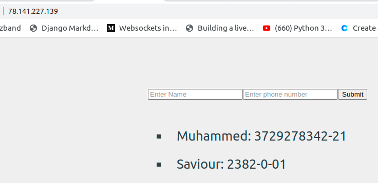

## Before You Begin

1.  If you have not already done so, create a Linode account and Compute Instance. See our [Getting Started with Linode](/docs/guides/getting-started/) and [Creating a Compute Instance](/docs/guides/creating-a-compute-instance/) guides.

1.  Follow our [Setting Up and Securing a Compute Instance](/docs/guides/set-up-and-secure/) guide to update your system. You may also wish to set the timezone, configure your hostname, create a limited user account, and harden SSH access.


The steps in this guide require root privileges. Be sure to run the steps below as `root` or with the `sudo` prefix. For more information on privileges, see our [Users and Groups](/docs/tools-reference/linux-users-and-groups/) guide.


# How to Deploy Django and React Applications on Ubuntu 20.04 with Docker

Are you a developer that wants to learn how to deploy their application to a Linux server?

If yes, you have come to the right place, you will learn the process which you can use to deploy your application so that it can be accessed by everyone.

This article goes through how to build a Django and React application and deploy it on an Ubuntu server. The article show all the complexities that come with deploying an application like that and how to solve all the problems they encounter.

You go from building a contact list application to dockerizing the application to ease the deployment process. Then, set the firewall for security, and configure NGINX to display our application through the remote IP address. Then finally run the application.



This guide assumes you are familiar with the following concepts and skills:

* Basic understanding of  [Django](https://www.djangoproject.com/) and [ReactJS](https://reactjs.org/)


## Prerequisites

- [Django installed](https://www.djangoproject.com/download/) locally
- [NPM](https://npmjs.org/) installed

## Build the Backend

Before you can deploy anything, we need to first have an application to deploy. This section goes through how to build a simple contact app API with Django. Start by building the Django application and then you attach the React application later.

We will build this project locally before we push it to the server. Build the Django API  by following the steps below.

1. Create the project directory (`django-react/`). The directory you just created will contain everything related to your project. In the project directory, create a new directory for your Django API (`api/`).
2. In your command line/terminal, navigate to the API directory and run the following command to start a Django project. 

        django-admin startproject contact_list .

3. Create a Django app by running the following command.
        python manage.py startapp app

Now add the `app` you just created to your `settings.py` file, like you see in the code below.


INSTALLED_APPS = [
		    ...,
  'rest_framework', #needed to create the API
  'corsheaders', # used to allow react server to access the Django app
  "app"]


4. Open `api/contact-list/urls.py` and add a route to the app you have created by updating the urls list.

from django.urls import path, include

urlpatterns = [
    path('admin/', admin.site.urls),
    path('app/', include("app.urls"))] #route for new app

5. Now, open `api/app/models.py` and paste the code below. The following code contains the database fields that holds the contact data.

from django.db import models

class Contact(models.Model):
    name = models.CharField(max_length=200)
    phone_number = models.CharField(max_length=200)
    def __str__(self):
        return self.name

6. Next, create the `views` for saving and listing out contacts in the database. You can do this by pasting the following code in `api/app/views.py`.

from rest_framework import generics
from rest_framework import status
from rest_framework.decorators import api_view
from .serializers import ContactSerializer
from rest_framework.response import Response
from .models import Contact
@api_view(['POST'])
def create_contact(request):
	    # create coontact
    contact = ContactSerializer(data=request.data)
    if contact.is_valid():
        contact.save()
        return Response(contact.data)
    else:
        return Response(status=status.HTTP_404_NOT_FOUND)

class ContactList(generics.ListCreateAPIView):
    # list out contacts
    queryset = Contact.objects.all()
    serializer_class = ContactSerializer

7. Create a new file, `api/app/serializers.py`, and paste the following code. The code below converts the data obtained from the database into a format that is understandable by the frontend.


from rest_framework import serializers
from .models import Contact
  
class ContactSerializer(serializers.ModelSerializer):
    class Meta:
        model = Contact
        fields = ('name', 'phone_number',"id") # fields in the models


8. Next, create a new file `api/app/urls.py` and paste the code below to set the routing for the `views`.

from . import views
from django.urls import path

urlpatterns = [
    path('create/', views.create_contact, name='create-items'),
    path('list/', views.ContactList.as_view(), name='view-contacts'),]


9. Finally, for the backend side update the `settings.py` file to accept React and Docker.

ALLOWED_HOSTS = ['*']
...
CORS_ORIGIN_WHITELIST = [
    'http://localhost:3000']


## Create the Frontend

1. Now build the frontend part. To start, go to the root of your project (`django-react/`) run the following command to initialize `create-react-app` in your project.

        $ npx create-react-app frontend
        $ cd frontend

2. Create a new file `frontend/src/components/form.js`, and paste the code below. The following code handles the form that  saves a contact.

import React, { useState } from "react";
import axios from "axios";

export const Form = () => {
    const [name1, setName1] = useState("");
    const [phone_number, setPhone_number] = useState("");

    let formField = new FormData();
    formField.append("name", name1);
    formField.append("phone_number", phone_number);

    const handleFormSubmit = async () => {
        await axios({
        method: "post",
        url: "/app/create/",
        data: formField,
    })
};
    return (
        <>
        <form onSubmit={handleFormSubmit}>
        <input
        className="form-class"
        type="text"
        placeholder="Enter Name"
        required
        value={name1}
        onChange={(e) => setName1(e.target.value)}
        ></input>
        <input
        className="form-class"
        type="text"
        placeholder="Enter phone number"
        required
        value={phone_number}
        onChange={(e) => setPhone_number(e.target.value)}
        ></input>
        <input type="submit"></input>
        </form>
         
        </>
    );
};

3. Create a new file `frontend/src/components/card.js`, and paste the code below. The following code handles the logic for listing the contacts.

import React from "react";
export const Card = ({ listOfContacts }) => {
    return (
        <>
        {listOfContacts.map(contact => {
        return (
        <ul key={contact.id}>
        <li className="contact-list">{contact.name}: {contact.phone_number}</li>
        </ul>
        );
    })}
    </>
    );
};


4. Create a new file `frontend/src/components/home.js`, and paste the code below. The following code handles the home page where the contact list and form are displayed.

import React, { useState, useEffect } from "react";
import { Card } from "./card";
import { Form } from "./form";

export const ContactPage = () => {
const [contact, setContact] = useState([]);
const [name1, setName1] = useState(null)
const [phone_number, setPhone_number] = useState(null) 
  
let formField = new FormData()
formField.append('name',name1)
formField.append('phone_number',phone_number)

useEffect(() => {
    fetch("/app/list")
    .then((response) => {
        if (response.ok) {
            return response.json();
        }
    })
    .then((data) => setContact(data));
}, []);
const handleFormSubmit = () => {
    fetch("/app/create", {
    method: "POST",
    body:formField,
    headers: {
        "Content-type": "application/json; charset=UTF-8",
    },
    })
        .then((response) => response.json())
        .then((message) => {
            getUpdate();
        });
};

const getUpdate = () => {
    fetch("/app/list")
        .then((response) => {
        if (response.ok) {
            return response.json();
        }
        })
        .then((data) => setContact(data));
};

return (
    <>
    <Form/>
        <Card listOfContacts={contact} />
    </>
    );
};


5. Install additional dependencies for routing.

        $ npm i react-router react-router-dom

6. Update the `frontend/src/App.js` to display our application by pastind the code below in the file.


import React from "react";
import "./App.css";
import { ContactPage } from "./components/home";
import { BrowserRouter as Router, Route } from "react-router-dom";

function App() {
     return (
    

      <header className="App-header">
        <Router>
          
            <Route exact path="/">
              <ContactPage />
            </Route>
        
        </Router>
      </header>
    

  );
}

export default App;


7. Update the `frontend/src/App.css` to improve the styling of the application by paste the code below in the file.


*{
  text-decoration: none;
} 

body {
font-size: 1.6rem; 
background-color: #efefef;
color: #324047
}

.App-header{
padding-left: 500px;
}

.form-class{
margin-top: 100px;
}

.contact-list{
position: relative;
list-style-type: square;
padding-left: 1rem;
margin-bottom: 0.5rem;
}


## Set up Docker for Application

In this section, you make your current application run on Docker and Docker Compose. This makes it easy for you when you want to deploy the application because the whole application runs as a single unit. 

1. On your text editor, navigate to `api/`, create a new file with the name `Dockerfile` then paste the following code. This tells Docker how your Django application should be built.



FROM python:3.8.2
ENV PYTHONUNBUFFERED 1

WORKDIR /api

# copy requirements file to Docker image
COPY ./requirements.txt .

# Install the dependencies requirements.txt file in Docker image
RUN pip install -r requirements.txt

# Copies api from local machine to Docker image
COPY . .

EXPOSE 8000


2. Now, create the `requirements.txt` file at the root of your project and input the text below. Below is a list of dependencies needed to run your project.

        django==3.1
        django-cors-headers==3.11.0
        djangorestframework==3.11.0

3. On your text editor, navigate to `frontend/`, create a new file with the name `Dockerfile` then paste the following code. 

FROM node:14.17.3

WORKDIR /frontend

COPY ./package.json /frontend

RUN npm install

COPY . .

EXPOSE 3000

CMD ["npm", "start"]


4. Create a new file with the name `docker-compose.yml` and paste the following code. The YAML code is going to run the frontend and backend simultaneously.


services:
  api:
    build: ./api        
    ports:
      - "8000:8000"
    volumes:
      - ./api:/api
    command: bash -c "python manage.py makemigrations &&
      python manage.py migrate &&
      python manage.py runserver 0.0.0.0:8000"

  web:
    build: ./frontend
    ports:
      - "3000:3000"
    volumes:
      - ./frontend:/frontend
      - /frontend/node_modules
    depends_on:
      - api


## Set up the Application to Run on the Server

### Set up Firewall for Network Security
This section handles firewall which is essential for regulating, and blocking unwanted network traffic into the server.
1. Install [UFW](https://help.ubuntu.com/community/UFW) (Uncomplicated Firewall), which is used for the Firewall configuration.

        $ sudo apt install ufw

2. Allow all outgoing ports by running the command below.

        $ sudo ufw default allow outgoing

3. Now block anyone trying to reach your server from the outside world by running the command below.

        $ sudo ufw default deny incoming

4. Now allow SSH so that you continue to access our server with SSH.

        $ sudo ufw allow ssh

5. Finally, enable UFW on your server.
     
        $ sudo ufw enable

### Set up NGINX as Reverse Proxy

1. Install [NGINX](https://www.nginx.com/) on Server.

        $ sudo apt install nginx

2. Remove NGINX default file so that we can write our own.
                
       $ sudo rm /etc/nginx/sites-enabled/default

3. Create NGINX configuration. Run `nano /etc/nginx/sites-enabled/django-react` to create a new NGINX configuration file and open it with `nano`. Paste the code you have below in the opened file. The code below passes `http://localhost:3000` to the IP address of your remote server.


server{
    listen 80;
    server_name 78.141.227.139;

    location / {
            proxy_pass http://localhost:3000;
            include /etc/nginx/proxy_params;
        }
}


4. Allow `http/tcp` traffic on our firewall so that your browser can access your app.

        $ sudo ufw allow http/tcp

5. Restart NGINX to implement the settings you created.

        $ sudo systemctl restart nginx

## Run Application on server

1. On your Ubuntu server, create a folder for your project by running `mkdir project`.
2. Now you need to first copy the application into the remote server. On your local machine, run the command below. Don’t forget to change `78.141.227.139` in the command below to the IP address of your remote server.

        $ scp -r path/to/ptroject root@78.141.227.139:/path/to/remote/project/folder

3. On the remote server, `cd` into the project file and run the command below to build the Docker image.

        $ sudo docker-compose build

4. Run the application.

        $ sudo docker-compose up

Now open your remote IP address on your browser and you should see your application come up.

## Conclusion

In this article, you went through how to build a Django and React application and deploy it on an Ubuntu server. I showed you how to handle some of the complexities that come with deploying an application like that and how to solve all the problems they encounter.

You went from building a contact application to dockerizing the application to ease the deployment process. Then, we set the firewall for security, and configured NGINX to display our application through the remote IP address.

You can take the knowledge you’ve gotten in this tutorial a step further by deploying an application with static files and see what needs to be changed to make that work.