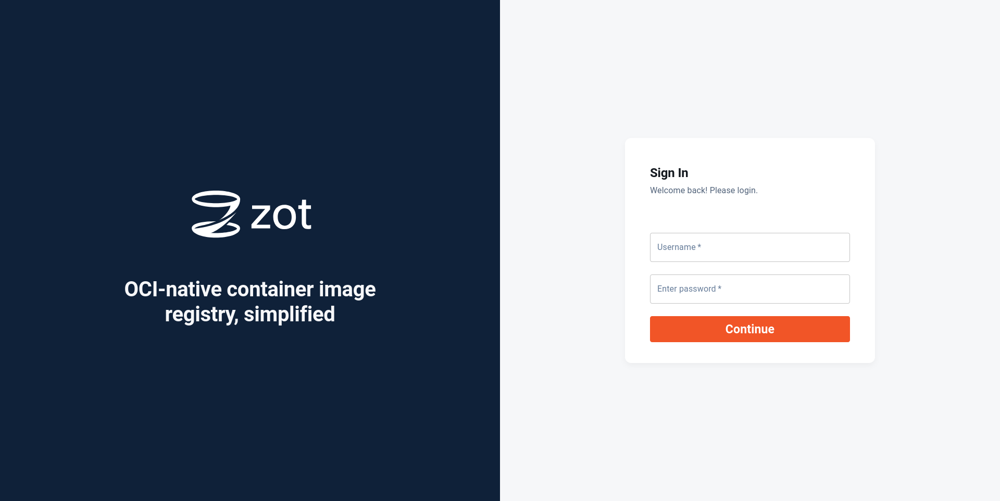
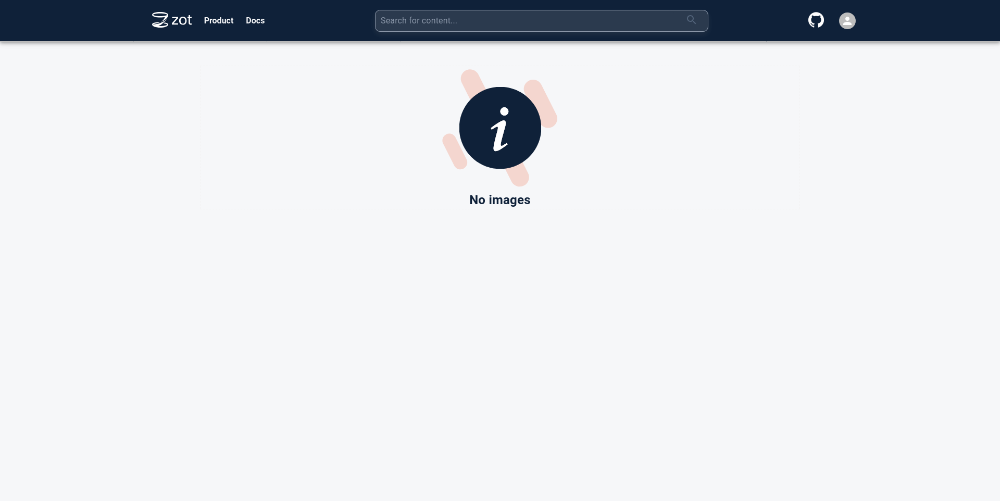
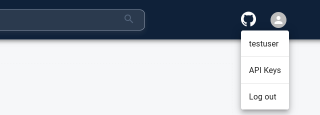
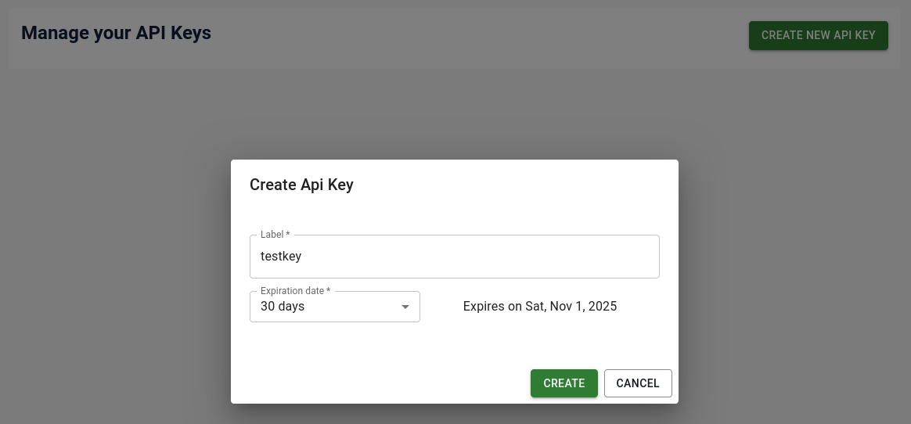
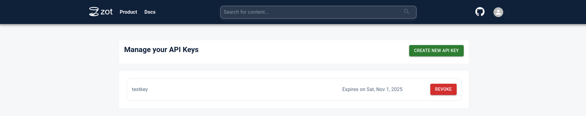
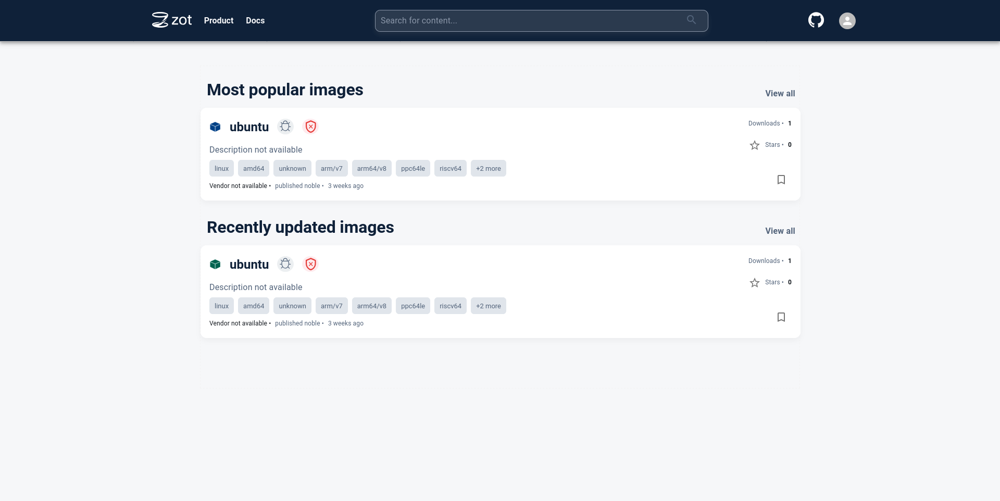
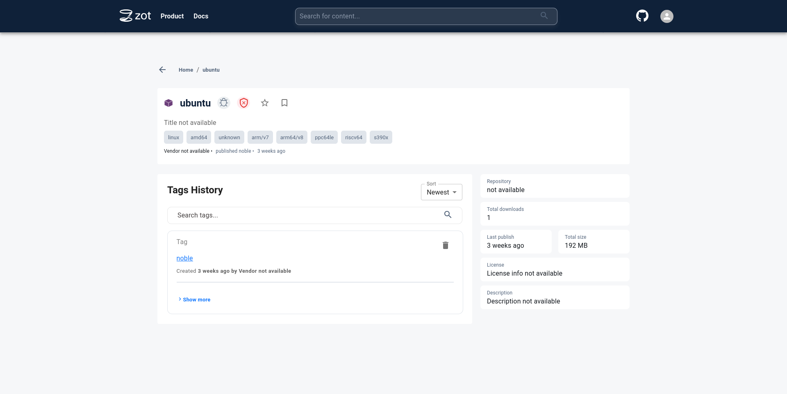
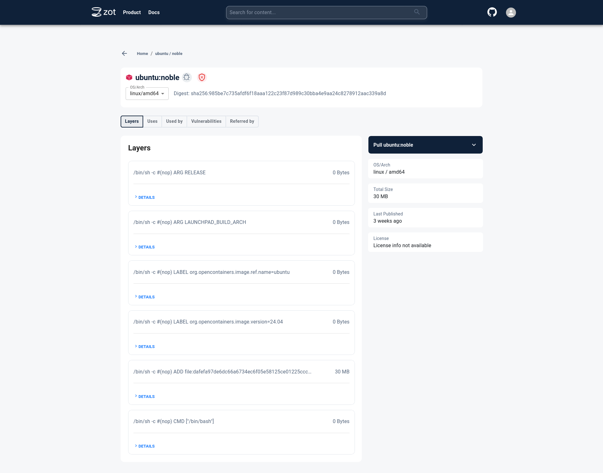
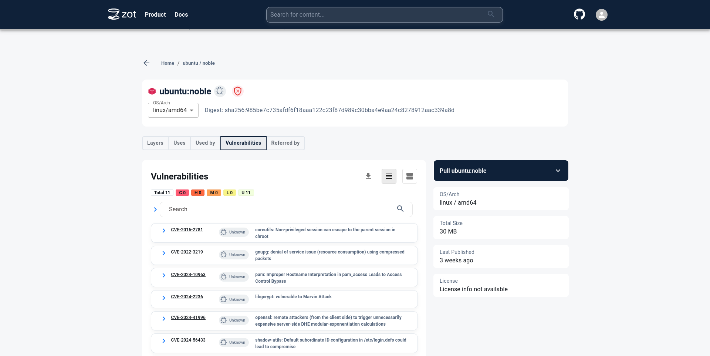

A wide range of internet services, embedded software, and other applications are packaged and run with [containers](/docs/guides/cloud-containers/). Many tools have been developed around the container ecosystem, and a common standard known as [Open Container Initiative (OCI)](https://opencontainers.org/) facilitates interoperability between these tools.

Container images need to be stored and then distributed when an application is deployed. This guide explores storage and distribution of OCI container images with Zot. In particular, this guide shows how to set up Zot as a cache for images stored on Docker Hub. By setting up your own container cache, you can reduce latency and avoid rate limits of public container registries.

## What is Zot?

[Zot](https://zotregistry.dev) is a vendor-neutral OCI-native registry. It can run on different types of hardware ranging from embedded devices to high-power cloud compute instances. Some key benefits of Zot include:

- Security integrations including Single Sign-On (SSO) support with OpenID Connect (OIDC), htpasswd, and API keys
- An authorization system that supports repository-level access control
- Built-in artifact scanning with [Trivy](https://trivy.dev)
- Support for multiple backends for storing data, including S3-compatible services
- Options for creating high-scale deployments
- Monitoring with built-in metrics
- A Web-based user interface and a command line interface for interacting with these features
- An application binary that has no dependencies and that can be run as a standalone executable, or by container tools

While this guide focuses on how to configure and use Zot as a pull through cache for Docker Hub, you can also directly upload images to the Zot registry with this same deployment.

## Before You Begin

1. The instructions in this guide install Zot on a compute cloud instance, and these specifications are assumed:

    - At least 4GB of memory
    - Ubuntu 24.04 LTS as the operating system. systemd is used to run Zot as a service in this guide. Other distributions that use systemd may also be suitable for following the instructions.

    To create a compute instance on Akamai Cloud, follow the [Get started](https://techdocs.akamai.com/cloud-computing/docs/getting-started) and [Creating a Linode](https://techdocs.akamai.com/cloud-computing/docs/create-a-compute-instance) guides.

1. Follow the [Set up and secure a Linode](https://techdocs.akamai.com/cloud-computing/docs/set-up-and-secure-a-compute-instance) guide to create a limited user to run commands under. Configuring a firewall is also recommended.

1.  On startup, Zot downloads some large artifacts for the image scanning feature (approximately 1GB in total). Ensure your instance's internet connection is not metered or has the necessary allowance to download these artifacts.

    
    Inbound traffic to Akamai compute instances is free.
    

1. This guide makes use of htpasswd for authentication, which is part of the `apache2-utils` package on Ubuntu. Install this package on your compute instance:

    ```command
    sudo apt install apache2-utils
    ```

1. This guide uses [podman](https://podman.io/) to work with OCI container images. This needs to be installed on the client you wish to download images to (for example, your computer that you are reading this guide on). Podman does not need to be installed on the instance where Zot is deployed.

1. TLS is enabled for the registry in this guide. Two requirements need to be met to enable TLS:

    - A domain name needs to be assigned to the IP address of the compute instance. If you use Akamai's DNS Manager, [assign a domain, or a subdomain, to your instance's IP](https://techdocs.akamai.com/cloud-computing/docs/getting-started-with-dns-manager#add-dns-records). If you use another DNS provider, like your domain registrar's DNS management, use that service to create the DNS record.

    - Ensure you have generated a set of certificates for the server to use. To learn more about SSL certification, review the [Understanding TLS Certificates and Connections](/docs/guides/what-is-a-tls-certificate/) guide. Free certificates are available from the [Let's Encrypt](https://letsencrypt.org/) authority, and you can use [Certbot](https://certbot.eff.org/) to get a certificate. If using Certbot, the [`--standalone`](https://eff-certbot.readthedocs.io/en/stable/using.html#standalone) option can be used, because no web server proxy is set up in this guide.


This guide is written for a non-root user. Commands that require elevated privileges are prefixed with `sudo`. If you’re not familiar with the `sudo` command, see the [Users and Groups](/docs/guides/linux-users-and-groups/) guide.


## Deploy Zot

This section walks through the process of configuring Zot as a pull through cache for Docker Hub and creating a systemd service to run and manage the application.

### Create a Linux User and Directories for Zot

1. **Create a dedicated Linux user for Zot**:

    While it is optional to have a dedicated user for the Zot service, it is recommended to create one with only the minimum permissions that it needs. Run the `adduser` command to create a `zot` user:

    ```command
    sudo adduser --no-create-home --gecos --disabled-password --disabled-login zot
    ```

    You should see output similar to this:

    ```output
    info: Adding user `zot' ...
    info: Selecting UID/GID from range 1000 to 59999 ...
    info: Adding new group `zot' (1001) ...
    info: Adding new user `zot' (1001) with group `zot (1001)' ...
    info: Not creating home directory `/home/zot'.
    info: Adding new user `zot' to supplemental / extra groups `users' ...
    info: Adding user `zot' to group `users' ...
    ```

1. **Create directories to store Zot data**:

    In this guide, the following directories are used to store Zot-related data:

    | Path | Directory Type |
    |------|----------------|
    | `/data/zot` | Data directory |
    | `/var/log/zot` | Log directory |
    | `/etc/zot` | Config directory |

    Run these commands to create the directories and assign the correct permissions:

    ```command
    sudo mkdir -p /data/zot
    sudo chown -R zot:zot /data/zot

    sudo mkdir -p /var/log/zot
    sudo chown -R zot:zot /var/log/zot

    sudo mkdir -p /etc/zot
    sudo chown -R zot:zot /etc/zot
    ```

### Identify the Right Zot Build to Use

Zot builds are all published on the [project's GitHub Releases page](https://github.com/project-zot/zot/releases). There are builds for different CPU architectures and platforms. For this guide, the machine platform is `Linux` and the CPU architecture is `amd64`.

Zot is also built in 2 flavors: a "normal" version and a minimal version. The builds for the minimal version have a suffix of `-minimal`. The minimal version is intended for systems where only the OCI registry functionality is required. The normal version includes more features, such as the UI, container scanning, etc. This guide will use the normal build.

Therefore, for this guide, the binary of choice is `zot-linux-amd64`.


It is recommended to deploy the latest stable version available for all the latest features and bug fixes.


### Download the Zot Binary

1. On your compute instance, download the Zot binary to the `/tmp` directory:

    ```command
    wget https://github.com/project-zot/zot/releases/download/v2.1.14/zot-linux-amd64 -O /tmp/zot-linux-amd64
    ```

    
    The above command downloads the version 2.1.14 binary, which is the latest at the time of publication for this guide. You should update this command with the URL for the latest binary that is available on https://github.com/project-zot/zot/releases.
    

1. To verify the authenticity of the binary, use the corresponding SHA256 checksum. Run these commands to download the checksum and use the `sha256sum` program to compare it with the binary:

    ```command
    wget https://github.com/project-zot/zot/releases/download/v2.1.14/checksums.sha256.txt -O '/tmp/checkums.sha256.txt'
    cd /tmp
    cat './checkums.sha256.txt' | grep 'zot-linux-amd64$' | sha256sum -c
    ```

    
    When running the above commands, update the URL of the checksum text file to match the version of the binary you downloaded in the previous step.
    

    If the checksums match, this output appears:

    ```output
    zot-linux-amd64: OK
    ```

1. Move the binary under `/usr/bin/` and make it executable, then give the `zot` user and group ownership  over it:

    ```command
    sudo mv /tmp/zot-linux-amd64 /usr/bin/zot
    sudo chown zot:zot /usr/bin/zot
    sudo chmod +x /usr/bin/zot
    ```

### Login Security

To protect logins for Zot, an authentication mechanism is required. There are multiple ways to authenticate to Zot, but for simplicity, this guide will use htpasswd.

The following command creates an htpasswd file which Zot can be configured to use. It populates it with a new user for Zot named `testuser` and a password of `test123`:

```command
sudo htpasswd -bBc /etc/zot/htpasswd testuser test123
```


Be sure to replace `test123` with a more complex, unique, robust password.


This output should appear:

```output
Adding password for user testuser
```

### Configure Zot

Zot uses a single configuration file that contains all the required configuration for the application. [The examples directory](https://github.com/project-zot/zot/tree/main/examples) in the Zot GitHub repository has helpful example files that can used for various kinds of setups.

For this guide, a simple setup with UI, security scanning, and password authentication is appropriate. Follow these steps to populate the configuration:

1. On your compute instance, create a file named `/etc/zot/config.json` and open it in a text editor.

1. Specify the [*OCI Distribution Specification*](https://github.com/opencontainers/distribution-spec#oci-distribution-specification) version that Zot should adhere to. This is an open network protocol that standardizes distribution of container images (and other content). In the Zot configuration file, this is set with the `distSpecVersion` keyword. The version used in this guide is `1.1.1`. Add these lines to your configuration file:

    ```file {title="/etc/zot/config.json" lang="json" hl_lines="1-3"}
    {
        "distSpecVersion": "1.1.1"
    }
    ```

1. Tell Zot where it should store local data. Add the `storage` keyword and these new highlighted lines to your file:

    ```file {title="/etc/zot/config.json" lang="json" hl_lines="3-5"}
    {
        "distSpecVersion": "1.1.1",
        "storage": {
            "rootDirectory": "/data/zot"
        }
    }
    ```

1. Enter the server network configuration. This guide configures Zot to listen for connections from client on port 8080, and on all network interfaces. Add the `http` keyword and these new highlighted lines to your file:

    ```file {title="/etc/zot/config.json" lang="json" hl_lines="4-7"}
    {
        "distSpecVersion": "1.1.1",
        "storage": { ... },
        "http": {
            "address": "0.0.0.0",
            "port": "8080"
        }
    }
    ```

1. By default, Zot writes logs to the console. Instead, instruct Zot to write logs to `/var/log/zot/zot.log`, with the `info` level. Add the `log` keyword and these new highlighted lines to your file:

    ```file {title="/etc/zot/config.json" lang="json" hl_lines="5-8"}
    {
        "distSpecVersion": "1.1.1",
        "storage": { ... },
        "http": { ... },
        "log": {
            "level": "info",
            "output": "/var/log/zot/zot.log"
        }
    }
    ```

1. Connect your `htpasswd` file to the Zot configuration. Add these new highlighted lines to your file within the `http` block:

    ```file {title="/etc/zot/config.json" lang="json" hl_lines="7-11"}
    {
        "distSpecVersion": "1.1.1",
        "storage": { ... },
        "http": {
            "address": "0.0.0.0",
            "port": "8080",
            "auth": {
                "htpasswd": {
                    "path": "/etc/zot/htpasswd"
                }
            }
        },
        "log": { ... }
    }
    ```

1. Enable API key support for use with external OCI tools. Add this new highlighted line to your file within the `auth` block (under the `http` block):

    ```file {title="/etc/zot/config.json" lang="json" hl_lines="11"}
    {
        "distSpecVersion": "1.1.1",
        "storage": { ... },
        "http": {
            "address": "0.0.0.0",
            "port": "8080",
            "auth": {
                "htpasswd": {
                    "path": "/etc/zot/htpasswd"
                },
                "apikey": true
            }
        },
        "log": { ... }
    }
    ```

1. Enable the UI and [container security scanning](https://zotregistry.dev/v2.1.14/general/architecture/#security-scanning) extensions. These are specified under the `extensions` keyword in the configuration. Add these new highlighted lines to your file:

    ```file {title="/etc/zot/config.json" lang="json" hl_lines="6-15"}
    {
        "distSpecVersion": "1.1.1",
        "storage": { ... },
        "http": { ... },
        "log": { ... },
        "extensions": {
            "search": {
                "cve": {
                    "updateInterval": "2h"
                }
            },
            "ui": {
                "enable": true
            }
        }
    }
    ```

1. Enable registry synchronization. In order for Zot to act as a pull through cache, a configuration for a remote registry can be added to the config file. This guide uses [DockerHub](https://hub.docker.com/) as the remote registry. Zot downloads and locally stores any requested images on demand. Add these highlighted lines to your file within the `extensions` block:

    ```file {title="/etc/zot/config.json" lang="json" hl_lines="9-18"}
    {
        "distSpecVersion": "1.1.1",
        "storage": { ... },
        "http": { ... },
        "log": { ... },
        "extensions": {
            "search": { ... },
            "ui": { ... },
            "sync": {
                "enable": true,
                "registries": [
                    {
                        "urls": ["https://docker.io/library"],
                        "onDemand": true,
                        "tlsVerify": true
                    }
                ]
            }
        }
    }
    ```

    More information about sync settings can be found in the [Zot documentation](https://zotregistry.dev/v2.1.14/admin-guide/admin-configuration/?h=sync#syncing-and-mirroring-registries).

1. Enable TLS to secure connections to the Zot server. Add these highlighted lines to your file within the `http` block. Replace  and  with the paths to your web certificate and key files respectively:

    
    Ensure that the `zot` Linux user created earlier is able to access the certificate and key files.
    

    ```file {title="/etc/zot/config.json" lang="json" hl_lines="8-11"}
    {
        "distSpecVersion": "1.1.1",
        "storage": { ... },
        "http": {
            "address": "0.0.0.0",
            "port": "8080",
            "auth": { ... },
            "tls": {
                "cert": "",
                "key": ""
            }
        },
        "log": { ... },
        "extensions": { ... }
    }
    ```

1. The full configuration file should now resemble the following:

    ```file
    {
        "distSpecVersion": "1.1.1",
        "storage": {
            "rootDirectory": "/data/zot"
        },
        "http": {
            "address": "0.0.0.0",
            "port": "8080",
            "auth": {
                "htpasswd": {
                    "path": "/etc/zot/htpasswd"
                },
                "apikey": true
            },
            "tls": {
                "cert": "",
                "key": ""
            }
        },
        "log": {
            "level": "info",
            "output": "/var/log/zot/zot.log"
        },
        "extensions": {
            "search": {
                "cve": {
                    "updateInterval": "2h"
                }
            },
            "ui": {
                "enable": true
            },
            "sync": {
                "enable": true,
                "registries": [
                    {
                        "urls": ["https://docker.io/library"],
                        "onDemand": true,
                        "tlsVerify": true
                    }
                ]
            }
        }
    }
    ```

### Verify the Configuration

Use Zot's `verify` command to verify the syntax of your new configuration file:

```command
sudo -u zot /usr/bin/zot verify /etc/zot/config.json
```

This output should appear:

```output
{"level":"info","config":"/etc/zot/config.json","time":<TIMESTAMP>,"message":"config file is valid"}
```

### Create the Systemd Service File

1. Create a systemd service file at `/etc/systemd/system/zot.service` with the following content:

    ```file {title="/etc/systemd/system/zot.service"}
    [Unit]
    Description=zot registry
    Documentation=https://zotregistry.dev/
    After=network.target

    [Service]
    Type=simple
    ExecStart=/usr/bin/zot serve /etc/zot/config.json
    User=zot
    Group=zot

    [Install]
    WantedBy=multi-user.target
    ```

1. Reload the systemd manager configuration so that it is aware of the new Zot service:

    ```command
    sudo systemctl daemon-reload
    ```

### Start Zot

1. Use systemd to start the new Zot service:

    ```command
    sudo systemctl start zot
    ```

    
    On first startup, Zot will download a couple of Trivy databases which are used for container scanning and will periodically refresh these databases.
    

1. To tell `systemd` that Zot should be started automatically after the machine boots up, the service needs to be enabled with the following command:

    ```command
    sudo systemctl enable zot
    ```

1. You can check the status of the service to make sure that Zot started successfully:

    ```command
    sudo systemctl status zot
    ```

    This output indicates success:

    ```output
    ● zot.service - zot registry
        Loaded: loaded (/etc/systemd/system/zot.service; enabled; preset: enabled)
        Active: active (running)
        Docs: https://zotregistry.dev/
    Main PID: 2537 (zot)
        Tasks: 8 (limit: 4605)
        Memory: 758.6M (peak: 758.7M)
            CPU: 2.285s
        CGroup: /system.slice/zot.service
                └─2537 /usr/bin/zot serve /etc/zot/config.json

    localhost systemd[1]: Started zot.service - zot registry.
    ```

1. If the service failed, there may be a failure indicated in the status output. For example:

    ```output
    × zot.service - zot registry
        Loaded: loaded (/etc/systemd/system/zot.service; enabled; preset: enabled)
        Active: failed (Result: exit-code)
    Duration: 107ms
        Docs: https://zotregistry.dev/
    Main PID: 1882 (code=exited, status=2)
            CPU: 114ms

    localhost systemd[1]: zot.service: Failed with result 'exit-code'.
    ```

    To find what might have gone wrong, check the journal logs with:

    ```command
    sudo journalctl -u zot.service
    ```

    Additionally, look into the Zot log file you configured at `/var/log/zot/zot.log` to find any errors.

## Access the Zot UI

1. Access the Zot UI from a web browser by navigating to `https://:8080`. Replace  with your machine's host name or IP address. This should bring up a login page:

    

    The credentials supplied for htpasswd file creation earlier can be used to login.

1. After a successful login, the homepage is displayed:

    

## Create a Zot API Key

Generate an API key from within the browser UI by clicking on the User Profile icon in the top right and selecting the **API Keys** option:








## Cache an Image from Docker Hub with Zot

This section describes how to use podman on your workstation to download an image from the Zot registry:

1. Log in to the registry with the Zot username configured earlier and the generated API key. Replace  with your machine's host name:

    ```command
    podman login :8080
    ```

    The following output is seen on a successful login:

    ```output
    Login Succeeded!
    ```

1. Pull the image with the following command. Replace  with your machine's host name.

    ```command
    podman pull :8080/ubuntu:noble
    ```

    When the image pull succeeds, the output resembles the following:

    ```output
    Trying to pull :8080/ubuntu:noble...
    Getting image source signatures
    Copying blob 953cdd413371 done   |
    Copying config 6d79abd4c9 done   |
    Writing manifest to image destination
    6d79abd4c96299aa91f5a4a46551042407568a3858b00ab460f4ba430984f62c
    ```

    When you requested this image, it was automatically downloaded and cached by Zot from Docker Hub.

### View the Image and Security Scan Results in the Zot UI

1. Navigate to the Zot UI in the browser. The image that was just downloaded would be listed on the home page.

    

1. Click on the image name to see more details about the image.

    

1. Click on the tag to see more details specific to a particular image tag.

    

1. Click on the `Vulnerabilities` tab to see details about Vulnerabilities in the image.

    

## Conclusion

You have successfully self-hosted the Zot registry!

Next, navigate to the Zot documentation links below to learn more about Zot and other features that Zot supports.
