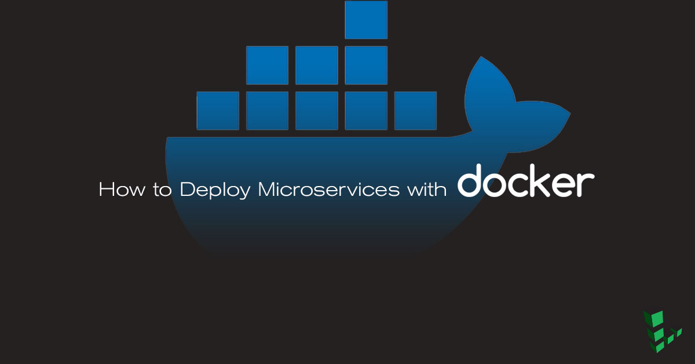

## What is a Microservice?

Microservices are an increasingly popular architecture for building large-scale applications. Rather than using a single, monolithic codebase, applications are broken down into a collection of smaller components called microservices. This approach offers several benefits, including the ability to scale individual microservices, keep the codebase easier to understand and test, and enable the use of different programming languages, databases, and other tools for each microservice.

[Docker](https://www.docker.com) is an excellent tool for managing and deploying microservices. Each microservice can be further broken down into processes running in separate Docker containers, which can be specified with Dockerfiles and Docker Compose configuration files. Combined with a provisioning tool such as Kubernetes, each microservice can then be easily deployed, scaled, and collaborated on by a developer team. Specifying an environment in this way also makes it easy to link microservices together to form a larger application.

This guide shows how to build and deploy an example microservice using Docker and Docker Compose.

## Before You Begin

1.  If you have not already done so, create a Linode account and Compute Instance. See our [Getting Started with Linode](/docs/products/platform/get-started/) and [Creating a Compute Instance](/docs/products/compute/compute-instances/guides/create/) guides.

1.  Follow our [Setting Up and Securing a Compute Instance](/docs/products/compute/compute-instances/guides/set-up-and-secure/) guide to update your system. You may also wish to set the timezone, configure your hostname, create a limited user account, and harden SSH access.


This guide is written for a non-root user. Commands that require elevated privileges are prefixed with `sudo`. If you’re not familiar with the `sudo` command, you can check our [Users and Groups](/docs/guides/linux-users-and-groups/) guide.


### Install Docker



### Install Docker Compose



## Prepare the Environment

This section uses Dockerfiles to configure Docker images. For more information about Dockerfile syntax and best practices, see our [How To Use Dockerfiles guide](/docs/guides/how-to-use-dockerfiles/) and Docker's [Dockerfile Best Practices guide](https://docs.docker.com/engine/userguide/eng-image/dockerfile_best-practices/#sort-multi-line-arguments).

1. Create a directory for the microservice:

        mkdir flask-microservice

2. Create a directory structure for the microservice components within the new directory:

        cd flask-microservice
        mkdir nginx postgres web

### NGINX

1. Within the new `nginx` subdirectory, create a Dockerfile for the NGINX image:

    
from nginx:alpine
COPY nginx.conf /etc/nginx/nginx.conf


2.  Create the `nginx.conf` referenced in the Dockerfile:

    
user  nginx;
worker_processes 1;
error_log  /dev/stdout info;
error_log off;
pid        /var/run/nginx.pid;

events {
    worker_connections  1024;
    use epoll;
    multi_accept on;
}

http {
    include       /etc/nginx/mime.types;
    default_type  application/octet-stream;

    log_format  main  '$remote_addr - $remote_user [$time_local] "$request" '
                      '$status $body_bytes_sent "$http_referer" '
                      '"$http_user_agent" "$http_x_forwarded_for"';

    access_log  /dev/stdout main;
    access_log off;
    keepalive_timeout 65;
    keepalive_requests 100000;
    tcp_nopush on;
    tcp_nodelay on;

    server {
        listen 80;
        proxy_pass_header Server;

        location / {
            proxy_set_header Host $host;
            proxy_set_header X-Real-IP $remote_addr;

            # app comes from /etc/hosts, Docker added it for us!
            proxy_pass http://flaskapp:8000/;
        }
    }
}


### PostgreSQL

The PostgreSQL image for this microservice will use the official `postgresql` image on Docker Hub, so no Dockerfile is necessary.

In the `postgres` subdirectory, create an `init.sql` file:


SET statement_timeout = 0;
SET lock_timeout = 0;
SET idle_in_transaction_session_timeout = 0;
SET client_encoding = 'UTF8';
SET standard_conforming_strings = on;
SET check_function_bodies = false;
SET client_min_messages = warning;
SET row_security = off;
CREATE EXTENSION IF NOT EXISTS plpgsql WITH SCHEMA pg_catalog;
COMMENT ON EXTENSION plpgsql IS 'PL/pgSQL procedural language';
SET search_path = public, pg_catalog;
SET default_tablespace = '';
SET default_with_oids = false;
CREATE TABLE visitors (
    site_id integer,
    site_name text,
    visitor_count integer
);

ALTER TABLE visitors OWNER TO postgres;
COPY visitors (site_id, site_name, visitor_count) FROM stdin;
1 	linodeexample.com  	0
\.



In Line 22 of `init.sql`, make sure your text editor does not convert tabs to spaces. The app will not work without tabs between the entries in this line.


### Web

The `web` image will hold an example Flask app. Add the following files to the `web` directory to prepare the app:

1. Create a `.python-version` file to specify the use of Python 3.6:

        echo "3.6.0" >> web/.python-version

2.  Create a Dockerfile for the `web` image:

     
from python:3.6.2-slim
RUN groupadd flaskgroup && useradd -m -g flaskgroup -s /bin/bash flask
RUN echo "flask ALL=(ALL) NOPASSWD:ALL" >> /etc/sudoers
RUN mkdir -p /home/flask/app/web
WORKDIR /home/flask/app/web
COPY requirements.txt /home/flask/app/web
RUN pip install --no-cache-dir -r requirements.txt
RUN chown -R flask:flaskgroup /home/flask
USER flask
ENTRYPOINT ["/usr/local/bin/gunicorn", "--bind", ":8000", "linode:app", "--reload", "--workers", "16"]


3.  Create `web/linode.py` and add the example app script:

    
from flask import Flask
import logging
import psycopg2
import redis
import sys

app = Flask(__name__)
cache = redis.StrictRedis(host='redis', port=6379)

# Configure Logging
app.logger.addHandler(logging.StreamHandler(sys.stdout))
app.logger.setLevel(logging.DEBUG)

def PgFetch(query, method):

    # Connect to an existing database
    conn = psycopg2.connect("host='postgres' dbname='linode' user='postgres' password='linode123'")

    # Open a cursor to perform database operations
    cur = conn.cursor()

    # Query the database and obtain data as Python objects
    dbquery = cur.execute(query)

    if method == 'GET':
        result = cur.fetchone()
    else:
        result = ""

    # Make the changes to the database persistent
    conn.commit()

    # Close communication with the database
    cur.close()
    conn.close()
    return result

@app.route('/')
def hello_world():
    if cache.exists('visitor_count'):
        cache.incr('visitor_count')
        count = (cache.get('visitor_count')).decode('utf-8')
        update = PgFetch("UPDATE visitors set visitor_count = " + count + " where site_id = 1;", "POST")
    else:
        cache_refresh = PgFetch("SELECT visitor_count FROM visitors where site_id = 1;", "GET")
        count = int(cache_refresh[0])
        cache.set('visitor_count', count)
        cache.incr('visitor_count')
        count = (cache.get('visitor_count')).decode('utf-8')
    return 'Hello Linode!  This page has been viewed %s time(s).' % count

@app.route('/resetcounter')
def resetcounter():
    cache.delete('visitor_count')
    PgFetch("UPDATE visitors set visitor_count = 0 where site_id = 1;", "POST")
    app.logger.debug("reset visitor count")
    return "Successfully deleted redis and postgres counters"



4.  Add a `requirements.txt` file with the required Python dependencies:

    
flask
gunicorn
psycopg2-binary
redis


## Docker Compose

Docker Compose will be used to be define the connections between containers and their configuration settings.

Create a `docker-compose.yml` file in the `flask-microservice` directory and add the following:


version: '3'
services:
 # Define the Flask web application
 flaskapp:

   # Build the Dockerfile that is in the web directory
   build: ./web

   # Always restart the container regardless of the exit status; try and restart the container indefinitely
   restart: always

   # Expose port 8000 to other containers (not to the host of the machine)
   expose:
     - "8000"

   # Mount the web directory within the container at /home/flask/app/web
   volumes:
     - ./web:/home/flask/app/web

   # Don't create this container until the redis and postgres containers (below) have been created
   depends_on:
     - redis
     - postgres

   # Link the redis and postgres containers together so they can talk to one another
   links:
     - redis
     - postgres

   # Pass environment variables to the flask container (this debug level lets you see more useful information)
   environment:
     FLASK_DEBUG: 1

   # Deploy with three replicas in the case one of the containers fails (only in Docker Swarm)
   deploy:
     mode: replicated
     replicas: 3

 # Define the redis Docker container
 redis:

   # use the redis:alpine image: https://hub.docker.com/_/redis/
   image: redis:alpine
   restart: always
   deploy:
     mode: replicated
     replicas: 3

 # Define the redis NGINX forward proxy container
 nginx:

   # build the nginx Dockerfile: http://bit.ly/2kuYaIv
   build: nginx/
   restart: always

   # Expose port 80 to the host machine
   ports:
     - "80:80"
   deploy:
     mode: replicated
     replicas: 3

   # The Flask application needs to be available for NGINX to make successful proxy requests
   depends_on:
     - flaskapp

 # Define the postgres database
 postgres:
   restart: always
   # Use the postgres alpine image: https://hub.docker.com/_/postgres/
   image: postgres:alpine

   # Mount an initialization script and the persistent postgresql data volume
   volumes:
     - ./postgres/init.sql:/docker-entrypoint-initdb.d/init.sql
     - ./postgres/data:/var/lib/postgresql/data

   # Pass postgres environment variables
   environment:
     POSTGRES_PASSWORD: linode123
     POSTGRES_DB: linode

   # Expose port 5432 to other Docker containers
   expose:
     - "5432"


## Test the Microservice

1.  Use Docker Compose to build all of the images and start the microservice:

        cd flask-microservice/ && docker-compose up

    You should see all of the services start in your terminal.

2.  Open a new terminal window and make a request to the example application:

        curl localhost

    
Hello Linode! This page has been viewed 1 time(s).


3.  Reset the page hit counter:

        curl localhost/resetcounter

    
Successfully deleted redis and postgres counters


4.  Return to the terminal window where Docker Compose was started to view the standard out log:

    
flaskapp_1  | DEBUG in linode [/home/flask/app/web/linode.py:56]:
flaskapp_1  | reset visitor count


## Using Containers in Production: Best Practices

The containers used in the example microservice are intended to demonstrate the following best practices for using containers in production:

Containers should be:

1.  **Ephemeral**: It should be easy to stop, destroy, rebuild, and redeploy containers with minimal setup and configuration.

    The Flask microservice is an ideal example of this. The entire microservice can be brought up or down using Docker Compose. No additional configuration is necessary after the containers are running, which makes it easy to modify the application.

2.  **Disposable**: Ideally, any single container within a larger application should be able to fail without impacting the performance of the application. Using a `restart: on-failure` option in the `docker-compose.yml` file, as well as having a replica count, makes it possible for some containers in the example microservice to fail gracefully while still serving the web application – with no degradation to the end user.

    
The replica count directive will only be effective when this configuration is deployed as part of a [Docker Swarm](/docs/guides/how-to-create-a-docker-swarm-manager-and-nodes-on-linode/), which is not covered in this guide.


3.  **Quick to start**: Avoiding additional installation steps in the Docker file, removing dependencies that aren't needed, and building a target image that can be reused are three of the most important steps in making a web application that has a quick initialization time within Docker. The example application uses short, concise, prebuilt Dockerfiles in order to minimize initialization time.

4.  **Quick to stop**: Validate that a `docker kill --signal=SIGINT {APPNAME}` stops the application gracefully. This, along with a restart condition and a replica condition, will ensure that when containers fail, they will be brought back online efficiently.

5. **Lightweight**: Use the smallest base container that provides all of the utilities needed to build and run your application. Many Docker images are based on [Alpine Linux](https://alpinelinux.org/about/), a light and simple Linux distribution that takes up only 5MB in a Docker image. Using a small distro saves network and operational overhead, and greatly increases container performance. The example application uses alpine images where applicable (NGINX, Redis, and PostgreSQL), and a python-slim base image for the Gunicorn / Flask application.

6.  **Stateless**: Since they are ephemeral, containers typically shouldn't maintain state. An application's state should be stored in a separate, persistent data volume, as is the case with the microservice's PostgreSQL data store. The Redis key-value store does maintain data within a container, but this data is not application-critical; the Redis store will fail back gracefully to the database should the container not be able to respond.

7.  **Portable**: All of an app's dependencies that are needed for the container runtime should be locally available. All of the example microservice's dependencies and startup scripts are stored in the directory for each component. These can be checked into version control, making it easy to share and deploy the application.

8.  **Modular**: Each container should have one responsibility and one process. In this microservice, each of the major processes (NGINX, Python, Redis, and PostgreSQL) is deployed in a separate container.

9.  **Logging**: All containers should log to `STDOUT`. This uniformity makes it easy to view the logs for all of the processes in a single stream.

10. **Resilient**: The example application restarts its containers if they are exited for any reason. This helps give your Dockerized application high availability and performance, even during maintenance periods.
