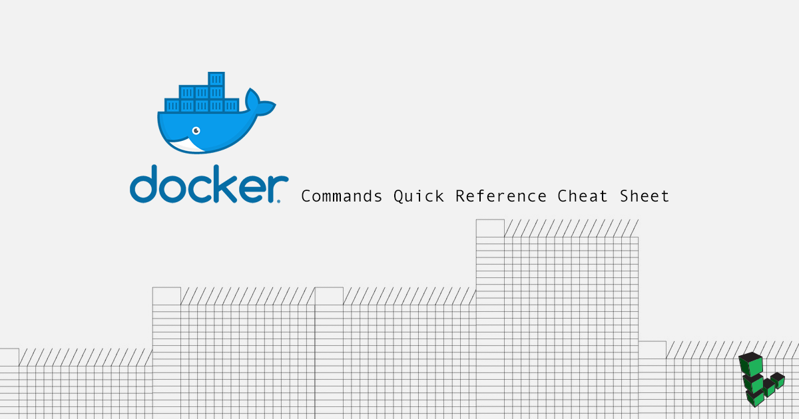

Docker is becoming increasingly popular among software developers, operators and enterprises as a software container platform. Containers package software in a format that can run isolated on a host operating system. Bundled with only essential libraries and settings, Docker renders lightweight, efficient, self-contained systems that run identically wherever deployed.

Optimizing the platform's functionality begins with mastery of the core Docker commands. This cheat sheet is a reference for the most basic Docker commands that address installation, Hub interaction, and working with containers and images.

As of this writing, the recommended Docker installation is Docker Community Edition ([Docker CE](https://docs.docker.com/engine/installation/)). See the official docs or our [How to Install Docker](/docs/guides/installing-and-using-docker-on-ubuntu-and-debian/) guide for more details.


If you have not added your limited user account to the `docker` group (with `sudo usermod -aG docker username`), all of the commands in this cheatsheet will need to be run with `sudo`.


## Docker Hub

| Docker Syntax | Description |
|:-------------|:---------|
| **docker search** searchterm | Search Docker Hub for images. |
| **docker pull** user/image | Downloads an image from Docker Hub. |
| **docker login** | Authenticate to Docker Hub   (or other Docker registry). |
| **docker push** user/image | Uploads an image to Docker Hub.   You must be authenticated to run this command. |

## Image and Container Information

| Docker Syntax | Description |
|:-------------|:---------|
| **docker ps** | List all running containers. |
| **docker ps -a** | List all container instances, with their ID  and status. |
| **docker images** | Lists all images on the local machine. |
| **docker history** user/image | Lists the history of an image. |
| **docker logs** [container name or ID] | Displays the logs from a running container. |
| **docker port** [container name or ID] | Displays the exposed port of a running container. |
| **docker diff** [container name or ID] | Lists the changes made to a container. |

## Work With Images and Containers

| Docker Syntax | Description |
|:-------------|:---------|
| **docker run** -it user/image | Runs an image, creating a container and  changing the terminal  to the terminal within the container. |
| **docker run** -p $HOSTPORT:$CONTAINERPORT -d user/image | Run an image in detached mode  with port forwarding. |
| **`ctrl+p` then `ctrl+q`** | From within the container's command prompt,  detach and return to the host's prompt. |
| **docker attach** [container name or ID] | Changes the command prompt  from the host to a running container. |
| **docker start** [container name or ID] | Start a container.  |
| **docker stop** [container name or ID] | Stop a container.  |
| **docker rm -f** [container name or ID] | Delete a container. |
| **docker rmi** | Delete an image. |
| **docker tag** user/image:tag user/image:newtag | Add a new tag to an image. |
| **docker exec** [container name or ID] shell command | Executes a command within a running container. |

## Image Creation

| Docker Syntax | Description |
|:-------------|:---------|
| **docker commit** user/image | Save a container as an image. |
| **docker save** user/image | Save an image to a tar archive. |
| **docker build -t sampleuser/ubuntu .** | Builds a Docker image  from a Dockerfile  in the current directory. |
| **docker load** | Loads an image from file.|
