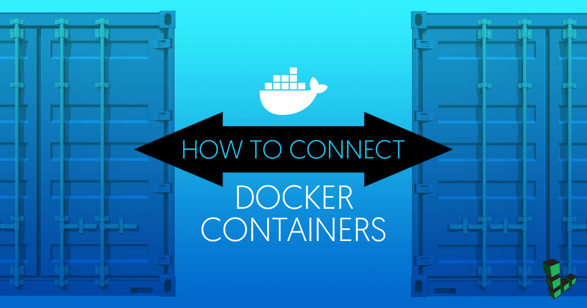

When using [Docker](https://www.docker.com) to containerize your applications, it is common practice to run each component of the application in a separate container. For example, a website might have a web server, application, and database, each running in its own container.

Configuring the containers to communicate with each other and the host machine can be a challenge. This guide will use a simple example app to demonstrate the basics of Docker container communication. The app will consist of a Node.js app that reads data from a PostgreSQL database.

## Before You Begin

### Install Docker CE

You will need a Linode with Docker CE installed to follow along with the steps in this guide.



## Example Node.js Application

The example app used throughout this guide will be a simple Node.js app that will read "Hello world" from a PostgreSQL database and print it to the console. In this section, you will build and test the app on your Linode without using containers.

### Install and Configure PostgreSQL

1.  Update your system:

        sudo apt update && sudo apt upgrade

2.  Install PostGreSQL:

        sudo apt install postgresql postgresql-contrib

3.  Change the `postgres` user's password:

        sudo passwd postgres

4.  Set a password for the `postgres` database user:

        su - postgres
        psql -d template1 -c "ALTER USER postgres WITH PASSWORD 'newpassword';"

5.  Create a database for the example app and connect to it:

        createdb nodejs
        psql nodejs

6.  Add "Hello world" to the database:

        nodejs=# CREATE TABLE hello (message varchar);
        nodejs=# INSERT INTO hello VALUES ('Hello world');
        nodejs=# \q

7.  Create a dump of the database for later use:

        pg_dumpall > backup.sql

8.  Sign out as the `postgres` Linux user:

        exit

9.  Copy the data dump to your home directory:

        sudo cp /var/lib/postgresql/backup.sql ~/.

10. Since you will be connecting to this database from a container (which will have an IP address other than `locahost`), you will need to edit the PostgreSQL config file to allow connections from remote addresses. Open `/etc/postgresql/9.5/main/postgresql.conf` in a text editor. Uncomment the `listen_addresses` line and set it to '*':

    
#------------------------------------------------------------------------------
# CONNECTIONS AND AUTHENTICATION
#------------------------------------------------------------------------------

# - Connection Settings -

listen_addresses = '*'                  # what IP address(es) to listen on;


11. Enable and start the `postgresql` service:

        sudo systemctl enable postgresql
        sudo systemctl start postgresql

### Create a Hello World App

1.  Install Node and NPM:

        curl -sL https://deb.nodesource.com/setup_8.x | sudo -E bash -
        sudo apt-get install nodejs

2.  Navigate to the home directory and create a directory:

        cd
        mkdir app && cd app

3.  Using a text editor, create `app.js` and add the following content:

    
const { Client } = require('pg')

const client = new Client({
  user: 'postgres',
  host: 'localhost',
  database: 'nodejs',
  password: 'newpassword',
  port: 5432
})

client.connect()

client.query('SELECT * FROM hello', (err, res) => {
  console.log(res.rows[0].message)
  client.end()
})


    This app uses the `pg` NPM module (node-postgres) to connect to the database created in the previous section. It then queries the 'hello' table (which returns the "Hello world" message) and logs the response to the console. Replace `'newpassword'` with the `postgres` database user password you set in the previous section.

    
The `pg` module can also use environment variables to configure the client connection. This is the recommended option for production apps. Read more about environment variables in the [node-postgres documentation](https://node-postgres.com/features/connecting).


5.  Install the `pg` module:

        npm install pg

6.  Test the app:

        node app.js

    If the database is configured correctly, "Hello world" will be displayed on the console.

## Connect Container to Docker Host

This section illustrates a use case where the Node.js app is run from a Docker container, and connects to a database that is running on the Docker host.

### Set Up Docker Container

1.  Return to your home directory:

        cd

2. Create a Dockerfile to run the Node.js app:

    
FROM debian

RUN apt update -y && apt install -y gnupg curl
RUN curl -sL https://deb.nodesource.com/setup_8.x | bash - && apt install -y nodejs
COPY app/ /home/

ENTRYPOINT tail -F /dev/null


3. The image built from this Dockerfile will copy the `app/` directory to the new image. Edit `app.js` to allow the app to connect to the `database` host instead of `localhost`:

    
const client = new Client({
  user: 'postgres',
  host: 'database',
  database: 'nodejs',
  password: 'newpassword',
  port: 5432
})


4.  Build an image from the Dockerfile:

        docker build -t node_image .

### Connect Container to Database

1.  Docker automatically sets up a default  **bridge network**, accessed through the `docker0` network interface. Use `ifconfig` or `ip` to view this interface:

        ifconfig docker0

    The output will resemble the following:

    
docker0   Link encap:Ethernet  HWaddr 02:42:1e:e8:39:54
  inet addr:172.17.0.1  Bcast:0.0.0.0  Mask:255.255.0.0
  inet6 addr: fe80::42:1eff:fee8:3954/64 Scope:Link
  UP BROADCAST RUNNING MULTICAST  MTU:1500  Metric:1
  RX packets:3848 errors:0 dropped:0 overruns:0 frame:0
  TX packets:5084 errors:0 dropped:0 overruns:0 carrier:0
  collisions:0 txqueuelen:0
  RX bytes:246416 (246.4 KB)  TX bytes:94809688 (94.8 MB)

    The internal IP address of the Docker host (your Linode) is 172.17.0.1.

2.  Allow PostgreSQL to accept connections from the Docker interface. Open `/etc/postgresql/9.5/main/pg_hba.conf` in a text editor and add the following line:

    
host    all             postgres        172.17.0.0/16           password


    Since 172.17.0.1 is the IP of the Docker host, all of the containers on the host will have an IP address in the range 172.17.0.0/16.

3.  Restart the database:

        sudo systemctl restart postgresql

4.  Start the container:

        docker run -d --add-host=database:172.17.0.1 --name node_container node_image

    The `--add-host` option defines a `database` host, which points to the IP address of the Docker host. Declaring the `database` host at runtime, rather than hard-coding the IP address in the app, helps keep the container reusable.

5.  From within the container, use `ping` to test the connection to the `database` host:

        docker exec -it node_container ping database

6.  Each Docker container is also assigned its own IP address from within the 172.17.0.0/16 block. Find the IP address of this container with `ip`:

        docker exec -it node_container ip addr show eth0

    You can test this connection by pinging this address from the Docker host.

7.  Run the app:

        docker exec -it node_container node home/app.js

  If the configuration was successful, the program should display the "Hello world" console output as before.

## Connect Two Containers

In this section, both the app and database will be running in separate containers. You can use the [official postgres image](https://hub.docker.com/_/postgres/) from Docker Hub and load in the SQL dump created earlier.


You should not store production database data inside a Docker container. Containers should be treated as ephemeral entities: if a container unexpectedly crashes or is restarted, all data in the database will be lost.


1.  Stop and remove the Node.js container:

        docker stop node_container
        docker rm node_container

2.  Pull the `postgres` image:

        docker pull postgres

3.  Make sure your `backup.sql` file is in your current working directory, then run the `postgres` image:

        docker run -d -v `pwd`:/backup/ --name pg_container postgres

    The `-v` option mounts your current working directory to the `/backup/` directory on the new container.

4.  The new container will automatically start the postgres database and create the postgres user. Enter the container and load the SQL dump:

        docker exec -it pg_container bash
        cd backup
        psql -U postgres -f backup.sql postgres
        exit

5.  Run the node image again. This time, instead of `--add-host`, use the `--link` option to connect the container to pg_container:

        docker run -d --name node_container --link=pg_container:database node_image

    This will link the `pg_container` under the hostname `database`.

6.  Open `/etc/hosts` in node_container to confirm that the link has been made:

        docker exec -it node_container cat /etc/hosts

    There should be a line similar to the following:

      
172.17.0.2  database  pg_container


    This shows that `pg_container` has been assigned to the IP address 172.17.0.2, and is linked to this container via the hostname `database`, as expected.

7.  Since the Node.js app is still expecting to connect to a PostgreSQL database on the `database` host, no further changes are necessary. You should be able to run the app as before:

        docker exec -it node_container node home/app.js

## Using Docker Compose

Using the `--link` or `--host` options every time you launch your containers can be cumbersome. If your server or any of the containers crash, they must be manually reconnected. This is not an ideal situation for any application that requires constant availability. Fortunately, Docker provides **Docker Compose** to manage multiple containers and automatically link them together when they are launched. This section will use Docker Compose to reproduce the results of the previous section.


For a more comprehensive explanation of Docker Compose and how to write `docker-compose.yml` configuration files, see our complete [Docker Compose](/docs/guides/how-to-use-docker-compose/) guide.


1.  Install Docker Compose:

        sudo curl -L https://github.com/docker/compose/releases/download/1.17.0/docker-compose-`uname -s`-`uname -m` -o /usr/local/bin/docker-compose
        sudo chmod +x /usr/local/bin/docker-compose

2.  In the same directory as your Dockerfile, create a `docker-compose.yml` file with the following content:

    
version: '3'

services:
  database:
    image: postgres
    container_name: pg_container
    volumes:
       - pgdata:/var/lib/postgresql/data

  app:
    build: .
    container_name: node_container
    links:
     - database
    environment:
      - PGPASSWORD=newpassword
      - PGUSER=postgres
      - PGDATABASE=nodejs
      - PGHOST=database
      - PGPORT=5432
    depends_on:
      - database

volumes:
  pgdata: {}


    When you run Docker Compose with this file, it will create the `pg_container` and `node_container` from the previous section. As before, the database container will use the official PostgreSQL image, while the app container will be built from your Dockerfile. The `links` entry serves the same function as the `--link` option in the `run` command used earlier.

3.  Docker Compose also allows you to set up environment values, so you can simplify the app to use these rather than having the values hard-coded. Edit `app.js` to remove these values:

    
const express = require('express')
const { Client } = require('pg')

const client = new Client()

client.connect()

client.query('SELECT * FROM hello', (err, res) => {
  console.log(res.rows[0].message)
  client.end()
})


4.  Remove the previous containers:

        docker rm -f node_container pg_container

5.  Use Docker Compose to bring up the containers:

        docker-compose up -d

5.  Load the example data into the new container:

        docker cp backup.sql pg_container:/
        docker exec -it pg_container psql -U postgres -f backup.sql postgres

6.  Run `app.js` from the app container:

        docker exec -it node_container node home/app.js

The app should run as before.

## Conclusion

By default, Docker automatically assigns an IP address to each container and to the Docker host. You can manually connect services between containers by using these addresses (assuming that your firewall allows the connection).

However, Docker also provides a number of convenient wrappers around these connections to help you speed up and simplify the connection process. You can connect your Docker host to a container with a unique hostname, or directly link two containers. Using Docker Compose can simplify this process even further by allowing you to declare connections in the `docker-compose.yml` file so that they are automatically established when the containers are brought up.

There are other connection options that were not covered in this guide. For example, you can run a container using `--net="host"`, which will share that container's network stack with the Docker host: `localhost` on the container will point to `localhost` on the Docker host. You can also expose ports on each Docker container, or configure the default bridge network for more flexibility. For a more in-depth discussion of these options, see the links in the More Info section below.
