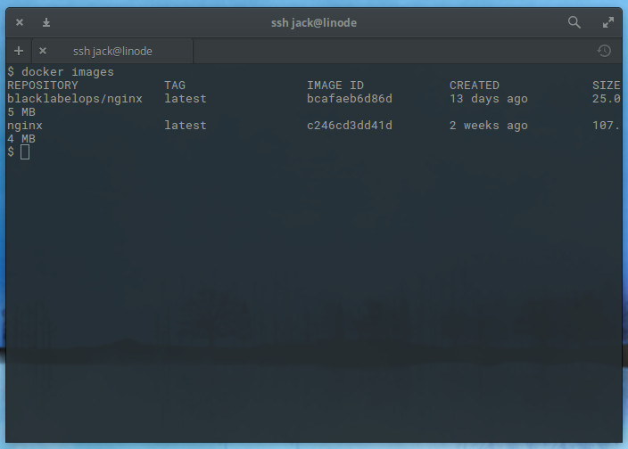
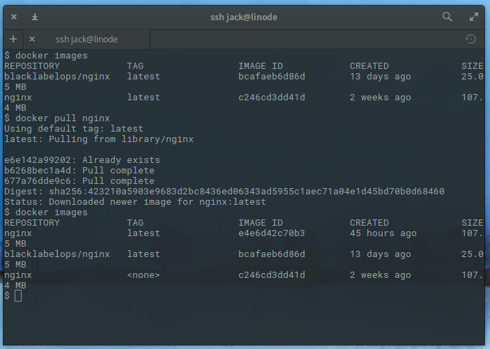
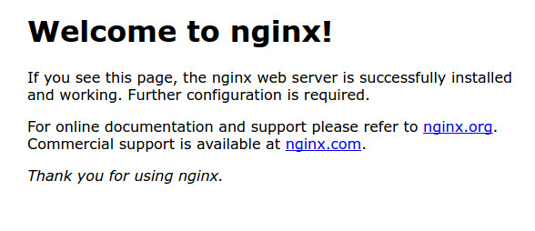

## What is a Docker Container?

According to Docker.com, a container is a "lightweight, stand-alone, executable piece of a software package that includes everything needed to run it: code, runtime, system tools, system libraries, and settings." A containers isolates software from its surroundings and is created from the images pulled from a Docker registry. For example, you can pull the nginx image and create as many containers from it as needed.

## Docker Command Syntax

Deploy a Docker container using the following syntax:

    docker run –name CONTAINER-NAME -p NETWORK_PORT:CONTAINER_PORT IMAGE NAME

It consists of:

*  `CONTAINER-NAME`: The name you give the container.
*  `NETWORK_PORT`: A port available to the network.
*  `CONTAINER_PORT`: The port the container will listen on.
*  `IMAGE NAME`: The name of the image to be used for the container.

## Deploy a Container

This example will create an nginx container with port 80 exposed, using the official nginx image.

1.  Confirm the current, existing official image:

        docker images

    In this screenshot, the nginx image is two weeks old:

    

2.  Update the original image with `docker pull nginx` as shown in the [How to Install Docker and Pull Images for Container Deployment](/docs/guides/installing-and-using-docker-on-ubuntu-and-debian/) guide. Run `docker images` again to confirm the update:

    

3.  Deploy the container:

        docker run --name docker-nginx -p 80:80 -d nginx

    This will show the newly created ID for the container. Note that the `-d`, *detach*, option returns you to the prompt:

    

4.  Confirm that the container is running:

        docker ps -a

5.  Navigate to your Linode's IP address to see the default nginx welcome message:

    

## How to Stop and Delete Containers

1.  Stop the container by using the first few characters of the container ID (`e468` in this example):

        docker stop e468

2.  Delete the container by using the `rm` command and the same container ID:

        docker rm e468
