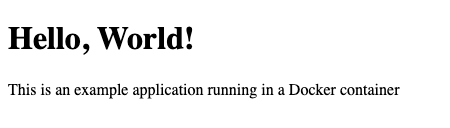

The Docker Engine is an open-source technology for running applications in containers. Containerization lets you run your applications independent of the particular system infrastructure you are trying to run it on. This can help you create more consistent development experiences and streamline prototyping and deployment. Moreover, Docker containers can make the process of using continuous integration and continuous delivery (CI/CD) much easier.

This guide walks you through the steps for getting Docker Community Edition (CE) installed on Ubuntu 20.04. It then summarizes common commands you can use to manage your Docker containers and walks you through the creation of a simple Docker application.

## Before You Begin

1. Familiarize yourself with our [Getting Started](/docs/getting-started/) guide, and complete the steps for setting your Linode's hostname and timezone.

1. This guide uses `sudo` wherever possible. Complete the sections of our [Securing Your Server](/docs/security/securing-your-server/) guide to create a standard user account, harden SSH access, and remove unnecessary network services.

1. Update your system:

        sudo apt update && sudo apt upgrade


This guide is written for a non-root user. Commands that require elevated privileges are prefixed with `sudo`. If you’re not familiar with the `sudo` command, see the [Users and Groups](/docs/tools-reference/linux-users-and-groups/) guide.


## Installing Docker

1. Uninstall any Docker packages that may already be installed:

        sudo apt remove docker docker-engine docker.io containerd runc

1. Install the packages required to use the Docker repository with the package manager:

        sudo apt install apt-transport-https ca-certificates curl gnupg lsb-release

1. Add Docker's GPG key:

        curl -fsSL https://download.docker.com/linux/ubuntu/gpg | sudo gpg --dearmor -o /usr/share/keyrings/docker-archive-keyring.gpg

1. Create a configuration to use the Docker's stable release repository:

        echo "deb [arch=amd64 signed-by=/usr/share/keyrings/docker-archive-keyring.gpg] https://download.docker.com/linux/ubuntu focal stable" | sudo tee /etc/apt/sources.list.d/docker.list > /dev/null

1. Update the package manager, and install Docker CE, its command-line tool, and `containerd`:

        sudo apt update
        sudo apt install docker-ce docker-ce-cli containerd.io

    The Docker process starts automatically. To have Docker continue running after a system restarts/shuts down, you can also enable the Docker process:

        sudo systemctl enable docker

1. Add your limited Linux user to the `docker` user group:

        sudo usermod -aG docker $USER

    This command assumes you are logged in as the limited user you want run Docker with. If not, replace `$USER` with the username of the limited user you want to run Docker with.

1. Exit the shell and log in again for the `usermod` change to take effect.

1. Verify that everything is working as expected by running Docker's "Hello, World!" image:

        docker run hello-world

    If everything went well with the installation, you should receive a message containing the following:

    
Hello from Docker!
This message shows that your installation appears to be working correctly.
    

## Using Docker

This section aims to get you started using Docker. Below, you can find a set of common commands for managing your Docker containers. Further on, you can follow along to create a simple Docker application.

### Managing Docker Containers

1. You can list the Docker containers you have, active and inactive, with the following command:

        docker ps -a

    You should get an output like the following. This example shows the container resulting from the `hello-world` image run in the previous section:

    
CONTAINER ID   IMAGE         COMMAND    CREATED       STATUS                   PORTS     NAMES
5039168328a5   hello-world   "/hello"   2 hours ago   Exited (0) 2 hours ago             magical_varahamihira
    

1. Start a Docker container with the following command. This example uses the container ID shown in the output of the step above:

        docker start 5039168328a5

1. Stop an actively running container similarly:

        docker stop 5039168328a5

    The `hello-world` image makes a container that stops automatically, so this command is not necessary for it. However, many other containers continue running until explicitly commanded to stop, and you may want to run these containers in the background. For those cases, this command can come in handy.

1. Remove a container with a command like the following. Again, this uses the container ID from the `hello-world` example above:

        docker rm 5039168328a5

### Example Containerized Application

Here, you can see how to use Docker to create containerized applications. This straightforward example uses [NGINX](https://nginx.org/) to serve a web page from within a Docker container.

1. Create a directory for your Docker application, and change into that directory. The remaining steps assume you are in this directory:

        mkdir ~/example-docker-app
        cd ~/example-docker-app

1. Create a directory to hold an HTML file:

        mkdir html

1. Create an HTML file like the following one, storing it in the directory created in the previous step:

    
<!doctype html>
<html>
<body>
    <h1>Hello, World!</h1>
    
This is an example application running in a Docker container

</body>
</html>
    

1. Create a `Dockerfile` with the contents shown below:

    
FROM nginx
COPY html /usr/share/nginx/html
    

    A `Dockerfile` controls what a Docker image does on start up. Here, the `FROM` statement tells Docker to use the NGINX image. The `COPY` statement tells Docker to copy the contents of the `html` subdirectory into the `/usr/share/nginx/html` directory of the Docker container. That latter directory is the default from which NGINX serves static web content, like HTML files.

1. Build the Docker image:

        docker build -t example-docker-app .

    Here, the `-t` flag allows you to "tag" or name the image, making it easier to reference. The `.` at the end of the command tells Docker to find the `Dockerfile` in the current directory.

1. Run a container using the Docker image you just created:

        docker run -dp 3000:80 example-docker-app

    The `-d` flag flag runs the container in the background ("detached"), and the `-p` flag allows you to designate the port mapping. In this example, port **80** on the Docker container is mapped to port **3000** on the host machine.

    NGINX runs inside of the Docker container, serving the HTML file to port **80**. Based on the port mapping in the run command, Docker then maps that port to the host machine's port **3000**.

1. Visit the HTML page now being served by the Docker container by navigating to `localhost:3000` in a web browser. To visit the page remotely, you can use an SSH tunnel:

    - On Windows, you can use the PuTTY tool to set up your SSH tunnel. Follow the appropriate section of the [Using SSH on Windows](/docs/guides/using-ssh-on-windows/#ssh-tunnelingport-forwarding) guide, replacing the example port number there with **3000**.
    - On OS X or Linux, use the following command to set up the SSH tunnel. Replace `example-user` with your username on the application server and `198.51.100.0` with the server's IP address:

            ssh -L3000:localhost:3000 example-user@198.51.100.0

    

## Conclusion

Docker is now installed and ready to use, and you have a strong start in learning how to get the most out of it!

To continue your journey, you can follow Docker's own [Getting Started](https://docs.docker.com/get-started/) guide. It walks you through the creation and maintenance of a Docker application, including setting up database persistence and using Docker Compose for multi-container applications.
