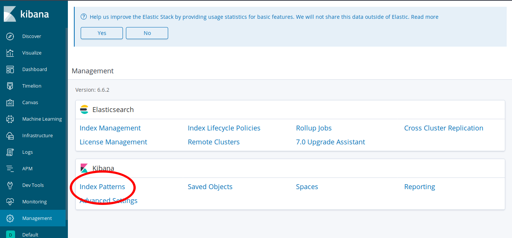
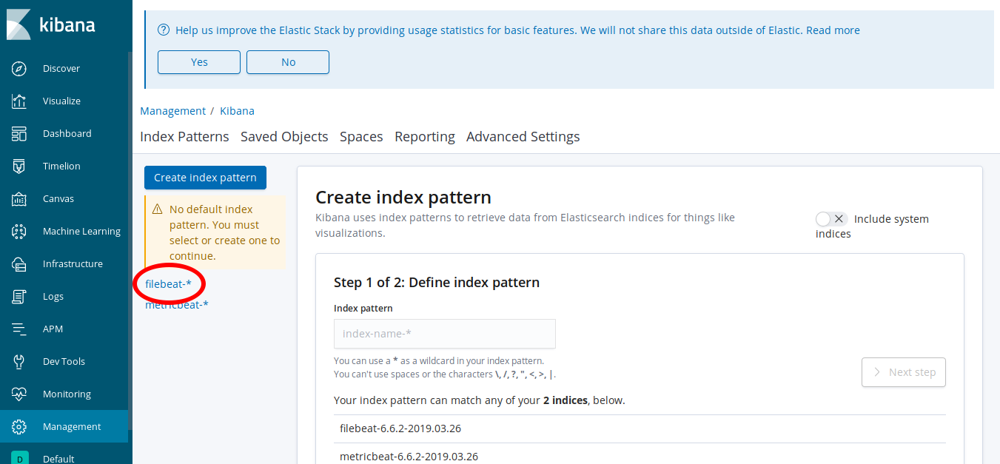
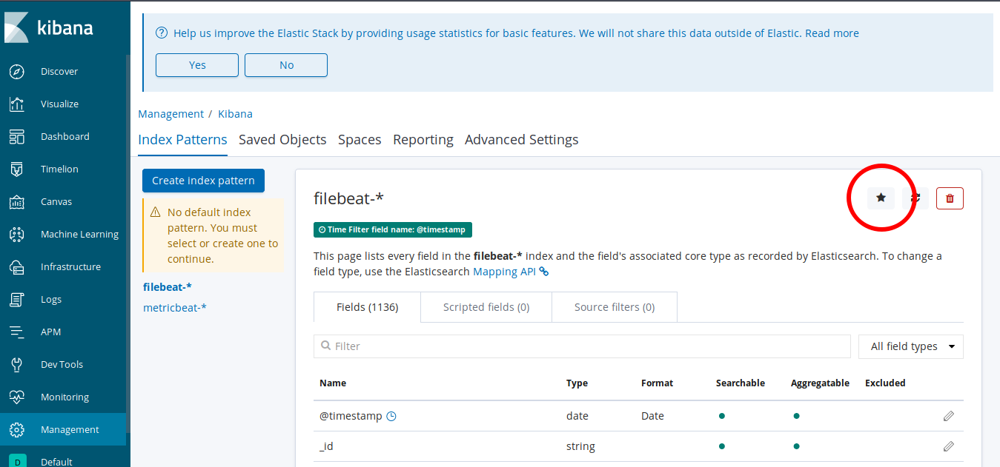
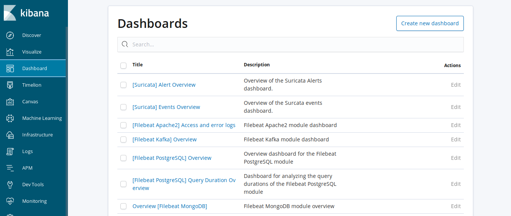
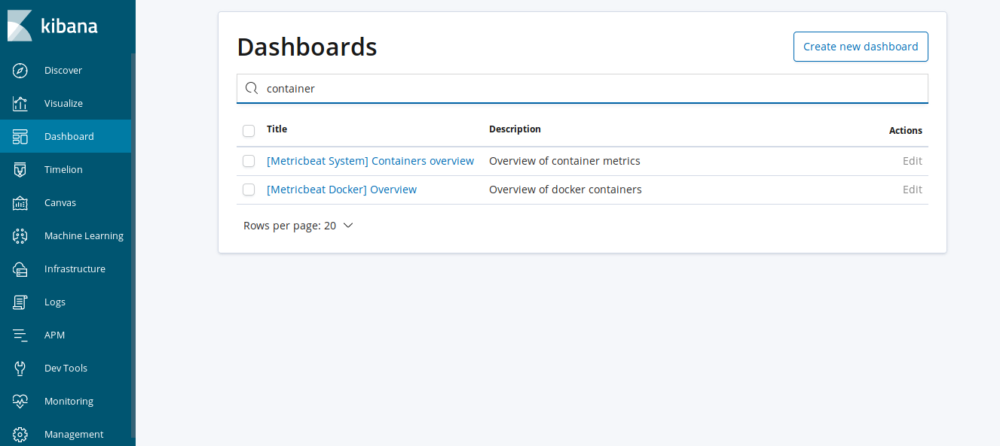
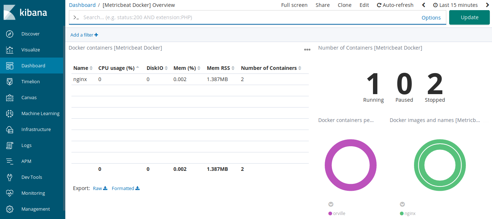
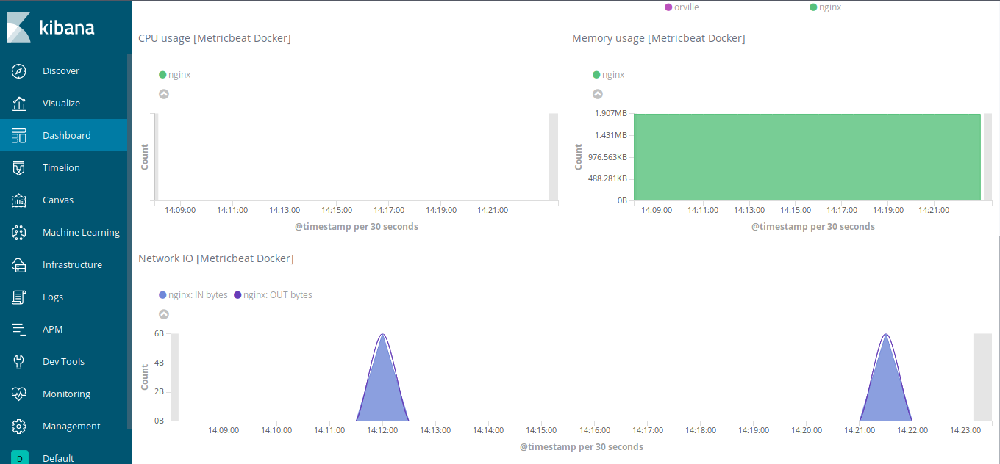
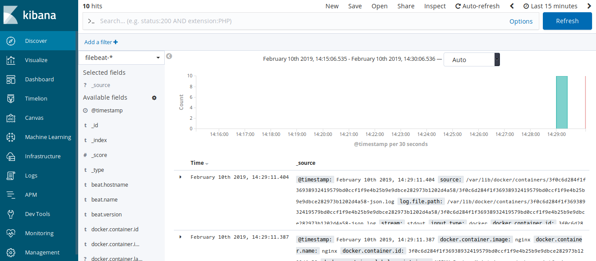
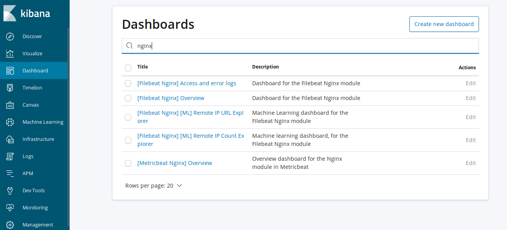
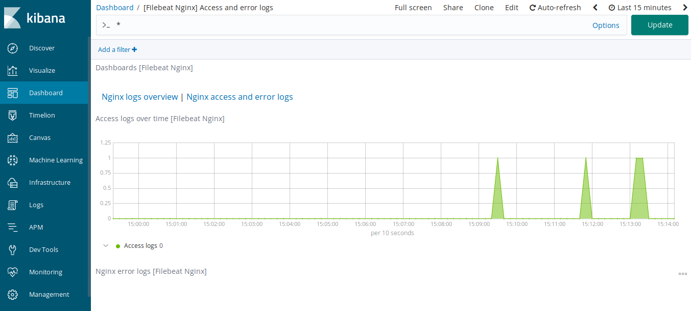

The [Elastic Stack](https://www.elastic.co/products) can monitor a variety of data generated by [Docker](https://www.docker.com/) containers. In this guide, you will set up a Linode to analyze and visualize container logs and metrics using tools like Kibana, Beats, and Elasticsearch. Once finished, you will be able to configure your system to collect data for additional containers automatically.

## Before you Begin

1.  If you have not already done so, create a Linode account and Compute Instance. See our [Getting Started with Linode](/docs/products/platform/get-started/) and [Creating a Compute Instance](/docs/products/compute/compute-instances/guides/create/) guides.

1.  Follow our [Setting Up and Securing a Compute Instance](/docs/products/compute/compute-instances/guides/set-up-and-secure/) guide to update your system. You may also wish to set the timezone, configure your hostname, create a limited user account, and harden SSH access.

1.  Follow our [UFW Guide](/docs/guides/configure-firewall-with-ufw/) in order to install and configure a firewall (UFW) on your Ubuntu or Debian-based system, or our [FirewallD Guide](/docs/guides/introduction-to-firewalld-on-centos/) for rpm or CentOS-based systems. After configuring the firewall, ensure that the necessary ports are open in order to proceed with connections over SSH for the rest of this guide:

        sudo ufw allow ssh

1.   Install Docker on your Linode by following [the installation guide from the Docker project](https://docs.docker.com/).


The services in this guide bind to localhost only, which means they are not accessible outside of the Linode from remote hosts. This ensures that Elasticsearch's REST API remains private to localhost and is not remotely accessible from the internet. If you take steps beyond this guide to configure Elasticsearch and related components further, ensure that your firewall is in place and correctly blocking traffic to the Elasticsearch and Kibana nodes from the internet (ports 9200 and 9300 for Elasticsearch and 5601 for Kibana) to keep them properly secured.


## Install Elastic Stack Components

Before configuring your system to monitor running containers, first install the components necessary to collect and ship logs and metrics to Elasticsearch.

### Debian-Based Distributions

Configure the Elastic `apt` repository and install the necessary packages and their dependencies.

1.  Install the official Elastic APT package signing key:

        wget -qO - https://artifacts.elastic.co/GPG-KEY-elasticsearch | sudo apt-key add -

2.  Install the `apt-transport-https` package, which is required to retrieve `deb` packages served over HTTPS:

        sudo apt-get install apt-transport-https

3.  Add the APT repository information to your server's list of sources:

        echo "deb https://artifacts.elastic.co/packages/6.x/apt stable main" | sudo tee -a /etc/apt/sources.list.d/elastic-6.x.list

4.  Refresh the list of available packages:

        sudo apt-get update

5.  Before installing Elasticsearch, the Java runtime must be present. On systems such as Ubuntu 18.04 LTS, using the `default-jre-headless` package installs a compatible Java runtime:

        sudo apt-get install default-jre-headless

6.  Install Elasticsearch, Kibana, Filebeat, and Metricbeat:

        sudo apt-get install elasticsearch kibana filebeat metricbeat

### Redhat-Based Distributions

Configure the `rpm` repository for `yum` and related packaging tools.

1.  Trust the Elastic signing key:

        sudo rpm --import https://artifacts.elastic.co/GPG-KEY-elasticsearch

1.  Create a yum repository configuration to use the Elastic yum repository:

    
[elasticsearch-6.x]
name=Elastic repository for 6.x packages
baseurl=https://artifacts.elastic.co/packages/6.x/yum
gpgcheck=1
gpgkey=https://artifacts.elastic.co/GPG-KEY-elasticsearch
enabled=1
autorefresh=1
type=rpm-md
    

1.  Update the `yum` cache to ensure any new packages become available:

        sudo yum update

1.  Before installing Elasticsearch, the Java runtime must be present. On CentOS, for example, a compatible Java runtime can be installed using a headless OpenJDK package:

        sudo yum install java-11-openjdk-headless

1.  Install Elasticsearch, Kibana, Filebeat, and Metricbeat:

        sudo yum install elasticsearch kibana filebeat metricbeat

## Configure The Elastic Stack

In order to properly discover and capture container metrics, each component of the Elastic stack should be configured.

### Elasticsearch

In the file `/etc/elasticsearch/jvm.options` two values that begin with `-Xm` should be uncommented. These settings instruct the JVM to allocate a specific amount of memory. The recommend value for these settings is 50% of the available system RAM. For example, on a system with 1G of RAM, these settings should be:


-Xms512m
-Xmx512m


1.  Before starting Elasticsearch, install some necessary plugins to process geoip and user-agent data.

        sudo /usr/share/elasticsearch/bin/elasticsearch-plugin install ingest-user-agent
        sudo /usr/share/elasticsearch/bin/elasticsearch-plugin install ingest-geoip

1.  With these setting in place, start the `elasticsearch` service.

        sudo systemctl start elasticsearch

1.  Wait for a short period of time for Elasticsearch to start, then check that Elasticsearch is responding over the REST API:

        curl http://localhost:9200

    You should see output similar to the following:

        {
          "name" : "iQEk_-M",
          "cluster_name" : "elasticsearch",
          "cluster_uuid" : "tQeLgbKrTNOp2AoqdmTItw",
          "version" : {
                "number" : "6.5.4",
                "build_flavor" : "default",
                "build_type" : "deb",
                "build_hash" : "d2ef93d",
                "build_date" : "2018-12-17T21:17:40.758843Z",
                "build_snapshot" : false,
                "lucene_version" : "7.5.0",
                "minimum_wire_compatibility_version" : "5.6.0",
                "minimum_index_compatibility_version" : "5.0.0"
          },
          "tagline" : "You Know, for Search"
        }

    Elasticsearch is ready to index documents.

### Kibana

Most of Kibana's default settings are suitable for the purposes of this guide. No configuration changes are necessary; start the `kibana` service.

    sudo systemctl start kibana

### Filebeat

Use the `docker` input to enable Filebeat to capture started containers dynamically. This alleviates the need to specify Docker log file paths and instead permits Filebeat to discover containers when they start.

1.  Add the following near the top of the Filebeat configuration file to instruct the `filebeat` daemon to capture Docker container logs. These lines should be entered under the configuration key `filebeat.inputs`:

    
filebeat.inputs:
- type: docker
  containers.ids:
  - '*'
  processors:
  - add_docker_metadata: ~


1.  Uncomment the following line and change its value to `true`, which will permit Filebeat to create associated Kibana dashboards for captured container logs:

    
setup.dashboards.enabled: true


1.  Finally, add the following `autodiscover` configuration to the end of the `filebeat.yml` file:

    
filebeat.autodiscover:
  providers:
    - type: docker
      hints.enabled: true


1.  Enable the `nginx` module, which will be used later in this tutorial:

        sudo /usr/bin/filebeat modules enable nginx

1.  The remainder of the configuration file will instruct Filebeat to send logs to the locally-running Elasticsearch instance, which can be left unchanged. Start Filebeat:

        sudo systemctl start filebeat

### Metricbeat

Like Filebeat, configure Metricbeat similarly to dynamically discover running containers to monitor.

1.  Metricbeat uses a module to collect container metrics. Issue the following command to enable the `docker` and `nginx` modules:

        sudo /usr/bin/metricbeat modules enable docker
        sudo /usr/bin/metricbeat modules enable nginx

1.  Uncomment the following line and change its value to `true`, which will permit Metricbeat to create associated Kibana dashboards for captured container logs:

    
setup.dashboards.enabled: true


1.  The remainder of the configuration file will instruct Metricbeat to send logs to the locally-running Elasticsearch instance, which can be left unchanged. Metricbeat can now be started:

        sudo systemctl start metricbeat

## Visualizing Container Logs and Metrics

The following example demonstrates how Filebeat and Metricbeat automatically capture container data which can be accessed within Kibana.

1.  To begin, run a simple nginx Docker container on your Linode.

        sudo docker run --name nginx -P -d --label co.elastic.logs/module=nginx nginx

    - This command will run the web server in the background and expose the listening HTTP service under a random port number.
    - The `--label` argument is a [hint](https://www.elastic.co/guide/en/beats/filebeat/current/configuration-autodiscover-hints.html) to let Filebeat automatically parse the log format of certain container types, which in this case is nginx.

1.  To open a secure connection to Kibana, open an SSH tunnel to port 5601 on your Linode.

        ssh -L 5601:localhost:5601 <user@ip-address>

    - Replace `<user@ip-address>` with the username and IP address of your Linode.
    - This forwards port 5601 locally to port 5601 on your Linode.
    - A comprehensive guide to using SSH tunnels on a variety of platforms is available in our [Create an SSH Tunnel for MySQL guide](/docs/guides/create-an-ssh-tunnel-for-mysql-remote-access/).

1.  Browse to `http://localhost:5601` in your browser, which will display the following initial landing page for Kibana.

    

1.  Click the **Management** link in the lower left sidebar. The following page will be displayed. Then, click **Index Patterns** to enter the Index Pattern configuration page.

    

1.  Index Patterns dictate how Kibana understands indices that are present in Elasticsearch. In order for some visualizations to display properly, a default index pattern must first be configured. Select **filebeat-\*** on the left side of the page to configure the filebeat-* index pattern.

    

1.  Click the **star icon** in the upper right corner of the page to set this index pattern as the default in Kibana.

    

    Kibana is now properly configured with a default index pattern.

1.  Filebeat and Metricbeat are setup to configure Elasticsearch and Kibana automatically, so dashboards and index patterns are loaded and ready to be used. Click on **Dashboard** in the left-hand sidebar, which displays the following page.

    

1.  In the Search bar, type "container" to display pre-populated dashboards for system containers. Click on the **[Metricbeat Docker] Overview** link.

    

1.  The **[Metricbeat Docker] Overview** dashboard will load, which shows several aspects of currently-running container metrics. The dashboard displays a list of running containers, the total number of running, paused, and stopped containers, as well as metrics about container resource consumption.

    

    Scrolling further down, it also shows graphs indicating container resource usage over time, including CPU, memory, and network activity.

    

1.  Before moving on to other Kibana visualizations, generate some log activity from nginx by sending HTTP requests to the listening container. First, find which port the container is listening for requests on using the `docker` command:

        docker ps

    You should see output similar to the following:

        CONTAINER ID        IMAGE               COMMAND                  CREATED             STATUS              PORTS                   NAMES
        3f0c6d284f1f        nginx               "nginx -g 'daemon of…"   23 minutes ago      Up 23 minutes       0.0.0.0:32769->80/tcp   nginx

    From this output, we know that the HTTP server can be reached by issuing requests to port 32769, which is being forwarded to port 80 in the container. The port on your system may be different.

1.  Send several requests to this port using the `curl` command, replacing `<port>` with the number found in the previous step:

        for i in $(seq 1 10) ; do curl localhost:<port> ; done

1.  Now a number of logs are present in Kibana for this container. Click **Discover** in the left-hand sidebar in Kibana. It displays the following screen.

    

    - The histogram near the top of the page indicates the total number of container logs over time.
    - The table below the graph contains the contents of individual log contents.
    - Clicking on the arrows to the left of each log's timestamp will display the information for each captured log.

1.  Try re-issuing the previous `for ...` command to send another ten `curl` requests to the container and observe how the log histogram changes to reflect the new logs.

1.  Click **Dashboard** in the left-hand sidebar, then click it a second time to enter the dashboard selection screen. Search for "nginx" in the search bar.

    

1.  Click on the **[Filebeat Nginx] Access and error logs** link, which will display a dashboard with a number of visualizations regarding nginx activity.

    

## Additional Modules

This tutorial has demonstrated how Filebeat and Metricbeat can automatically capture container metrics and logs without the need to explicitly configure log file paths or configurations. In addition to the nginx examples presented here, the additional links provided below enumerate other modules that can be loaded into Filebeat and Metricbeat for other services.
